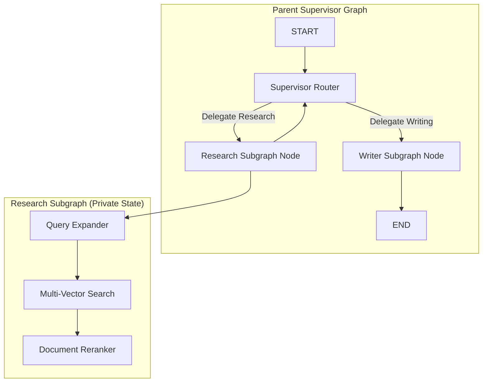

# 📹 How to build Subgraphs in LangGraph

<div className="video-card" style={{border: '1px solid #30363d', borderRadius: '8px', padding: '16px', marginBottom: '24px', background: 'rgba(56, 139, 253, 0.05)'}}>
  <div style={{display: 'flex', gap: '16px', flexWrap: 'wrap'}}>
    <div><strong>Instructor:</strong> Nitish Singh (CampusX)</div>
    <div><strong>Duration:</strong> 1367</div>
    <div><strong>Course:</strong> Module 4: Agentic AI & LangGraph</div>
    <div><strong>Watch Link:</strong> <a href="https://www.youtube.com/watch?v=wcHcocpAoX4" target="_blank" rel="noopener noreferrer">YouTube Lecture ↗</a></div>
  </div>
</div>

## 📌 Executive Summary

As agentic systems expand, monolithic state graphs become unmaintainable. Subgraphs allow encapsulating complex multi-step workflows (e.g. a complete RAG research pipeline or a code compiler agent) into isolated, reusable child graphs with their own private state schemas.

This lesson explores subgraph encapsulation, mapping parent and child state schemas, hierarchical agent architectures, and modular composition.

---

## 🏗️ System Architecture & Execution Flow



---

## 📖 Core Concepts & Technical Deep Dive

### 1. Hierarchical State Isolation
Parent graphs and child graphs can have completely distinct `TypedDict` schemas. The parent only needs to expose keys that the child requires, preventing child temporary variables from cluttering the parent's state.

### 2. Compiling Subgraphs as Standard Nodes
A compiled `StateGraph` implements the standard `Runnable` interface, meaning it can be added as a node inside a parent graph like any normal function:
`parent_builder.add_node("researcher", child_graph.compile())`

---

## 💻 Production Implementation

```python
from typing import TypedDict
from langgraph.graph import StateGraph, START, END

# 1. Child Graph: Focused Math Subgraph
class ChildState(TypedDict):
    val: int

child_builder = StateGraph(ChildState)
child_builder.add_node("double", lambda s: {"val": s["val"] * 2})
child_builder.add_edge(START, "double")
child_builder.add_edge("double", END)
child_app = child_builder.compile()

# 2. Parent Graph: Incorporates Child as a Node
class ParentState(TypedDict):
    val: int
    user_name: str

parent_builder = StateGraph(ParentState)
parent_builder.add_node("math_subgraph", child_app)
parent_builder.add_edge(START, "math_subgraph")
parent_builder.add_edge("math_subgraph", END)

parent_app = parent_builder.compile()
print(parent_app.invoke({"val": 21, "user_name": "Alice"}))
```

---

## ⚙️ Production Gotchas & Best Practices

:::tip Clear Key Mapping
Ensure that shared keys between parent and child state schemas share identical names and types so LangGraph can pass inputs and outputs automatically.
:::

:::warning Checkpointer Inheritance
When attaching a checkpointer to a parent graph, child subgraphs automatically share the same checkpointer, recording child state updates with nested namespace keys.
:::

---

## 📊 Architectural Reference & Comparison

| Architecture | Complexity | State Isolation | Reusability |
| :--- | :--- | :--- | :--- |
| **Monolithic Single Graph** | High (50+ nodes) | None (Shared global state) | Poor |
| **Hierarchical Subgraphs** | Low (modular) | High (Private child states) | High (Pluggable modules) |

---

## 📚 Key Takeaways & Enterprise Checklist

- [ ] **Architecture Verification:** Ensure your design addresses latency, decoupled interfaces, and strict data validation contracts.
- [ ] **Deterministic Testing:** Run unit tests and golden dataset evaluations before shipping changes to staging or production.
- [ ] **Security & Observability:** Enforce input/output guardrails, scrub sensitive credentials/PII, and capture distributed traces.
- [ ] **Scalability & Sizing:** Calibrate model parameters, context limits, and compute instance requirements against projected request concurrency.
