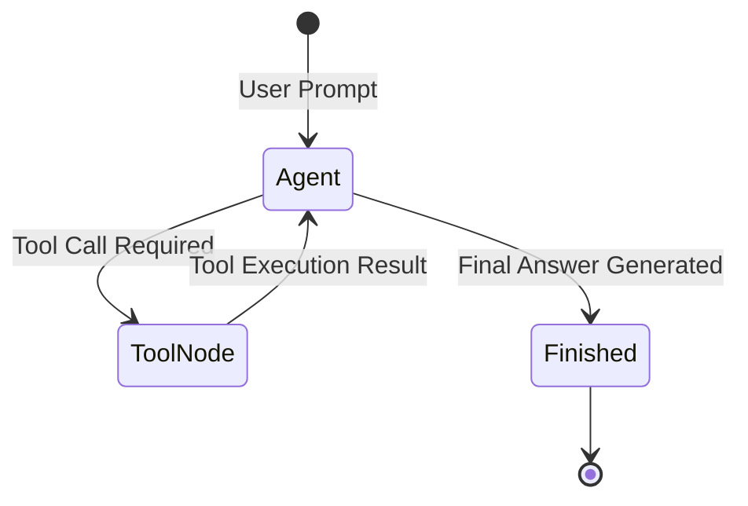

# 📹 How to build Subgraphs in LangGraph

<div className="video-card" style={{border: '1px solid #30363d', borderRadius: '8px', padding: '16px', marginBottom: '24px', background: 'rgba(56, 139, 253, 0.05)'}}>
  <div style={{display: 'flex', gap: '16px', flexWrap: 'wrap'}}>
    <div><strong>Instructor:</strong> Nitish Singh (CampusX)</div>
    <div><strong>Duration:</strong> 22m 47s</div>
    <div><strong>Playlist:</strong> Agentic AI with LangGraph (CampusX)</div>
    <div><strong>Watch Link:</strong> <a href="https://www.youtube.com/watch?v=wcHcocpAoX4" target="_blank" rel="noopener noreferrer">YouTube Lecture ↗</a></div>
  </div>
</div>

## 📌 Executive Summary & Learning Objectives

This lecture covers **How to build Subgraphs in LangGraph**, focusing on production implementations, edge cases, and industry standards:
- Core intuition, architecture, and underlying mechanisms.
- Key differences between theoretical research implementations and scalable enterprise patterns.
- Concrete Python walkthroughs, error recovery, and performance optimization.

---

## 🏗️ Architecture & Conceptual Workflow



---

## 📖 Core Concepts & Technical Deep Dive

### 1. Architectural Foundations
In modern production AI engineering, **How to build Subgraphs in LangGraph** is essential for ensuring reliability, low latency, and deterministic outcomes. As AI systems evolve from naive prompt-in / completion-out scripts into distributed systems, engineers must handle:
- **State management & consistency:** Ensuring intermediate states and tool invocations are tracked.
- **Error boundaries & recovery:** Graceful degradation when external LLMs or vector stores encounter rate limits or network partitions.
- **Resource utilization & cost efficiency:** Caching common queries and reducing unnecessary foundation model token expenditure.

### 2. Operational Considerations
- **Latency Optimization:** Pre-computing embeddings, utilizing asynchronous non-blocking event loops, and streaming tokens via Server-Sent Events (SSE).
- **Security & Sandboxing:** Validating inputs before ingestion, sanitizing LLM outputs, and isolating tool execution environments.

---

## 💻 Production Implementation Walkthrough

```python
from typing import TypedDict, Annotated, List
from langgraph.graph import StateGraph, END
import operator

# 1. Define State Schema
class AgentState(TypedDict):
    messages: Annotated[List[str], operator.add]
    next_step: str

# 2. Define Node Functions
def analyze_input(state: AgentState):
    print("Analyzing query...")
    return {"messages": ["Query analyzed."], "next_step": "generate"}

def generate_response(state: AgentState):
    print("Generating response...")
    return {"messages": ["Final response generated."], "next_step": "end"}

# 3. Build StateGraph
workflow = StateGraph(AgentState)
workflow.add_node("analyze", analyze_input)
workflow.add_node("generate", generate_response)

workflow.set_entry_point("analyze")
workflow.add_edge("analyze", "generate")
workflow.add_edge("generate", END)

app = workflow.compile()
output = app.invoke({"messages": ["Hello Agent"], "next_step": ""})
print(output)
```

---

## 💡 Production Best Practices & Tips

:::tip Production Deployment Guideline
When deploying How to build Subgraphs in LangGraph in enterprise environments, always configure automated retries with exponential backoff and telemetry tracing (such as OpenTelemetry or LangSmith).
:::

:::warning Common Failure Modes
Watch out for state contamination across concurrent requests. Ensure each session or user interaction uses an isolated thread ID or execution context.
:::

---

## 🎯 Key Takeaways & Quick Reference

| Dimension | Production Standard | Pitfall to Avoid |
| :--- | :--- | :--- |
| **Execution** | Async / Non-blocking with timeouts | Synchronous blocking calls in event loops |
| **Data Validation** | Strict Pydantic v2 schemas | Untyped dictionary access |
| **Monitoring** | Distributed tracing & latency percentiles | Relying only on standard console logs |

## ⏱️ Lecture Timeline & Key Topics

| Timestamp | Key Topic / Concept Discussed |
| :--- | :--- |
| **00:00:00** | हाय गाइस, माय नेम इज नितेश एंड यू वेलकम... |
| **00:05:39** | एजेंट्स हो गए। ये आपका टेस्टिंग एजेंट हो... |
| **00:11:07** | क्या है वो भी हमने समझ लिया। अब हम अपना... |
| **00:17:10** | गए। स्टार्ट से लेके ट्रांसलेट नोड और ऐड... |
| **00:22:45** | नेक्स्ट वीडियो में। बाई।... |


---

---

## 📜 Complete Lecture Transcript (Hindi / Hinglish)

> **Language:** Hindi / Hinglish | **Source:** `22 - How to build Subgraphs in LangGraph.hi-orig.srt` | **Total Segments:** 12 | **Word Count:** ~4,098 words

<details>
<summary><b>Click to expand full chronological transcript (12 timestamped intervals)</b></summary>

#### ⏱️ [00:00 ➔ 00:02]

हाय गाइस, माय नेम इज नितेश एंड यू वेलकम टू माय YouTube चैनल। आज के वीडियो में भी हम लोग अपना एजेंटिक एआई यूजिंग लैंडग्राफ प्लेलिस्ट कंटिन्यू करेंगे। और आज की वीडियो का टॉपिक है सबग्राफ्स। सो सबग्राफ्स खुद में एक इंपॉर्टेंट टॉपिक बन जाता है। स्पेशली अगर आप फ्यूचर में मल्टी एजेंट सिस्टम्स बिल्ड करना चाहते हो। सो मल्टी एजेंट सिस्टम्स बिल्ड करने के टाइम पे सबग्राफ बिकम्स अ वेरीेंट कॉन्सेप्ट। तो दैट इज़ व्हाई आई विल कवर दिस टॉपिक इन डिटेल। सो मेरा प्लान ऑफ एक्शन ये रहेगा आज के वीडियो में कि सबसे पहले हम लोग अ इस कांसेप्ट को डिस्कस करेंगे ऑन अ थ्योरेटिकल लेवल कि सबग्राफ्स होते क्या हैं? उसके बाद मैं आपको इसका नीड बताऊंगा कि क्यों एआई वर्क फ्लोस में सबग्राफ इंपॉर्टेंट हो जाता है। और लास्ट में ये सब कुछ समझने के बाद हम लोग कुछ प्रैक्टिकल कोड एग्जांपल्स देखेंगे जिसकी हेल्प से आप ये समझ पाओगे कि कैसे आप सब ग्राफ्स को लैंड ग्राफ में इंप्लीमेंट कर सकते हो। ठीक है? तो चलो नाउ लेट्स स्टार्ट आवर डिस्कशन अराउंड सबग्राफ्स। सबसे पहले अ कॉनसेप्चुअल लेवल पे समझते हैं कि सबग्राफ्स क्या होते हैं? ठीक है? तो अभी तक हमने लंग ग्राफ के अंदर ग्राफ्स बनाना सीखा। ठीक है? हमने ये सीखा कि आप किसी भी तरह के एi वर्क फ्लो को एक ग्राफ के फॉर्म में रिप्रेजेंट कर सकते हो। और इस ग्राफ में आपके पास न्स होते हैं। और न्स जनरली टास्क को रिप्रेजेंट करते हैं। ठीक है? जैसे आपको एक एलएलएम कॉल करना है। या फिर आपको एक वेक्टर डेटाबेस से रिट्रीवल करना है या फिर आपको एक टूल कॉल करना है। तो हर इस तरह का टास्क एक नोड की तरह रिप्रेजेंट होता है इस ग्राफ में। अब व्हाट इफ हम इसमें से किसी एक नोड को रिप्लेस कर दें विद अ ग्राफ इटसेल्फ। ठीक है? सो समझना इस बात को कि एक ग्राफ है जिसके अंदर एक नोड है। बट हमने उस नोड को रिप्लेस कर दिया विद अनदर ग्राफ। तो यह जो ब्लू कलर का ग्राफ आपको दिखाई दे रहा है, सिंस यह खुद एक बड़े ग्राफ का पार्ट है, आप इसको सबग्राफ बुलाओगे। एंड दैट्स द होल कांसेप्ट। ठीक है? इस डायग्राम में आपको

#### ⏱️ [00:02 ➔ 00:04]

एग्जैक्टली यही चीज दिखाई दे रही है। सो ऑन द होल अगर आप इस पूरे डायग्राम को देखो तो ये एक ग्राफ है। बट इस ग्राफ के अंदर जो नोड्स हैं वो खुद ग्राफ है। तो ये अंदर वाले ग्राफ्स को ही हम सब ग्राफ बुलाते हैं। यहां पर मैंने एक डेफिनेशन भी लिखा है। डेफिनेशन इज़ अ सबग्राफ इन लैन ग्राफ यूजुअली मीन्स अ ग्राफ दैट इज़ एंबेडेड एंड एग्जीक्यूटेड एज अ नोड इनसाइड अनदर ग्राफ। ठीक है? तो आई रियली होप सबसे पहले आपको ये पूरा का पूरा जो कांसेप्चुअल क्लेरिटी है ये मिल गया। ठीक है? अब हम लोग डिस्कस करते हैं कि इस कांसेप्ट को इंप्लीमेंट करने से क्या फायदा होता है? इस कांसेप्ट की जरूरत क्या है? सो आई गेस आपको याद होगा जब आपने फर्स्ट टाइम कोई जेन जेन एआई एप्लीकेशन बनाया होगा तो उसका जो फ्लो होगा वो बहुत ही सिंपल होगा। आपके पास एक यूजर की क्वेरी होगी जिसको आपने एक एलएलएम के पास भेजा होगा और उस एलएलएम ने आपको एक आउटपुट दिया होगा। बट ओवर टाइम जब आपने और कांसेप्ट्स पढ़े तो आपने रियलाइज किया कि जेनआई सिस्टम्स कैन बी वेरी कॉम्प्लेक्स। उसमें बहुत तरह के मॉड्यूल्स हो सकते हैं। जैसे ऐसा हो सकता है कि आपके जेनएi चैटबॉट को कुछ टूल्स की जरूरत हो या फिर आप रैक बेस्ड चैटबॉट बनाना चाहते हो या फिर डिपेंडिंग ऑन द लॉजिक आपको कंडीशनल राउटिंग करनी है। एक बार में अगर कोई चीज अचीव नहीं हुई तो रीट्राई का कांसेप्ट इंप्लीमेंट करना है। मेमोरी हो सकता है, एचआईटीएल हो सकता है, इवैल्यूएशन हो सकता है, गार्ड रेल्स हो सकता है। सो यू अंडरस्टैंड माय पॉइंट, राइट? कि एक प्रॉपर रियल वर्ल्ड जेनआई एप्लीकेशन कैन बी अ बिग एप्लीकेशन लाइक इट कैन हैव अ लॉट ऑफ़ थिंग्स गोइंग ऑन। राइट? एक एग्जांपल को लेके अगर हम बात करें तो मान लो आप एक सॉफ्टवेयर डेवलपर एजेंट बनाना चाहते हो अपनी कंपनी के लिए जिसका काम होगा किसी सॉफ्टवेयर को बिल्ड करना। अब सॉफ्टवेयर डेवलपमेंट का प्रोसेस कैसा होता है कि आपके पास एक टीम लीड होता है और वो टीम लीड क्या करता है? अपने डेवलपर से वेबसाइट या फिर कोई

#### ⏱️ [00:04 ➔ 00:06]

सॉफ्टवेयर डेवलप कराता है। तो हो सकता है कि आपके पास दो सॉफ्टवेयर टीम्स हैं। एक आपकी बैक एंड वाली टीम है और एक आपकी फ्रंट एंड वाली टीम है। ठीक है? ये दोनों मिलकर के सॉफ्टवेयर को डेवलप करेंगे। फिर जैसे ही ये दोनों अपना-अपना काम कर देंगे तो फिर आप अपने सॉफ्टवेयर को टेस्ट करवाते हो। ठीक है? अ टेस्ट हो जाएगा। उसके बाद आप पूरा का पूरा कोड रिव्यू कराते हो। कोड रिव्यु कराने के बाद आप अपनी डेवोप्स टीम के पास भेज देते हो और आपकी डेवोप्स टीम क्या करती है? इसको डिप्लॉय और मॉनिटर करती है। तो ये काइंड ऑफ एक पूरा का पूरा फ्लो है जो आपको इंप्लीमेंट करना है। बिकॉज़ आप एक प्रॉपर सॉफ्टवेयर डेवलपमेंट एजेंट बनाना चाहते हो। अब आप खुद सोच के देखो कि अगर आप एक इतना कॉम्प्लेक्स एजेंट बनाने जाओगे लंग ग्राफ में लेट्स से तो उस लैंग ग्राफ एजेंट का जो ग्राफ आप बिल्ड करोगे वो कितना कॉम्प्लेक्स हो जाएगा बिकॉज़ यहां पे हर जो सिस्टम है उसका खुद का हो सकता है कि कुछ-कुछ टूल्स हो उसके खुद का रिटाई लॉजिक हो खुद का मेमोरी हो वहां पे हो सकता है एचआईटीएल आपको इंप्लीमेंट करना पड़े हो सकता है कि आपको हर अलग-अलग मॉड्यूल में खुद के गार्ड रेल्स इंप्लीमेंट करने पड़े। तो यू अंडरस्टैंड कि खुद में दिस कैन बिकम अ वेरी कॉम्प्लेक्स थिंग। राइट? अब आप क्या कर सकते हो? इस कॉम्प्लेक्स काम को थोड़ा आसान कर सकते हो। अगर आप यहां पर इस बड़े एजेंट को छोटे-छोटे मल्टीपल एजेंट्स में डिवाइड कर दो। फॉर एग्जांपल आपका टीम लीड बिकम्स वन एजेंट जो कि काइंड ऑफ़ आपका प्लानिंग एजेंट है। फिर आपका बैक एंड डेवलपमेंट टीम एंड फ्रंट एंड डेवलपमेंट टीम। ये आपके दो कोडिंग एजेंट्स हो गए। ये आपका टेस्टिंग एजेंट हो गया। ये आपका कोड रिव्यू एजेंट हो गया। और ये आपका डेवोप्स एजेंट हो गया। तो आपने क्या किया? अपने बड़े से एजेंट को छोटे-छोटे एजेंट्स में कन्वर्ट कर दिया। तो ये एक मल्टी एजेंट आर्किटेक्चर बन गया। अब यहां पे मजेदार चीज क्या है कि हर एजेंट को आप एक सब्राफ से रिप्रेजेंट कर

#### ⏱️ [00:06 ➔ 00:08]

सकते हो। ठीक है? तो बेसिकली दिस विल बी वन सबग्राफ। अब इसके अंदर इसका खुद का ग्राफ चल रहा है। यह कोड डेवलपमेंट कैसे कर रहा है? इसका लॉजिक अंदर ही इंप्लीमेंटेड है। इसके खुद के अपने टूल्स हैं। इसके अंदर अपनी खुद की मेमोरी है। इसके अंदर अपना इवैल्यूएशन लॉजिक है। इसके अंदर अपना गार्ड ट्रेल है। सिमिलरली आपका टेस्टिंग वाला जो एजेंट है उसका पूरा लॉजिक इस सबग्राफ में कंटेंड है। तो यू अंडरस्टैंड माय पॉइंट। राइट? सडनली से ये जो बड़ा सा काम था इसको आपने ब्रेकडाउन किया और फिर आप उसको ब्रेकडाउन करके अचीव कर रहे हो। ठीक है? तो यही फायदा होता है सबग्राफ का। दिस इज़ व्हाई सबग्राफ्स आर नीडेड बिकॉज़ Z एआई एप्लीकेशनेशंस कैन गेट कॉम्प्लेक्स। और उस कॉम्प्लेक्सिटी को अचीव करने के लिए आपको ब्रेक करना होता है और सिंपल टास्क में कन्वर्ट करना होता है। ठीक है? क्या अचीव किया आपने इस पूरी चीज से? मल्टीपल चीजें अचीव की। सबसे पहली चीज जो आपने अचीव की वो है मॉड्यूलरिटी। सॉफ्टवेयर में आप कहीं भी चले जाओ हमेशा आपको बोला जाता है कि योर कोड शुड बी मॉड्यूलर। तो यहां पे भी सेम चीज अप्लाई होती है। इट्स लाइक ब्रेकिंग डाउन योर एंटायर कोड बेस इनू फंक्शनंस। सेकंड आपने क्या इंप्लीमेंट किया? आपने रीयूजेबिलिटी का कांसेप्ट इंप्लीमेंट किया। कैसे? अब मान लो ये आपका कोडिंग एजेंट है जो आपने बैक एंड डेवलपमेंट वाली टीम के लिए इंप्लीमेंट किया। यही सेम कोडिंग एजेंट आप फ्रंट एंड वाली टीम के लिए के लिए भी इंप्लीमेंट कर सकते हो। बिकॉज़ एसेंशियली बोथ आर डूइंग कोडिंग ओनली राइट? बस अलग सेट ऑफ़ फाइल्स के ऊपर कोडिंग चल रही है। ठीक है? तो रीयूजेबिलिटी आपने इंप्लीमेंट किया। थर्ड आपका मेंटेनेबिलिटी भी बढ़ गया। सोच के देखो। अ सडनली से आपको ये पूरा चीज डीबग करना आसान हो जाएगा। एग्जैक्टली कहां पे प्रॉब्लम आई है? आप सीधे उस ग्राफ को उठाओगे और उसको डीबग करोगे। ठीक है? तो ये तीन सबसे बड़ी चीजें हैं जो आप अचीव करते हो जब आप सबग्राफ्स को इंप्लीमेंट करते हो अपने एजेंटिक या फिर जेएनएआई वर्क फ्लो में। ठीक है? तो आई रियली होप विद दिस एग्जांपल यू यू गेट माय पॉइंट कि सबग्राफ्स का क्या जरूरत है। एंड दैट इज़

#### ⏱️ [00:08 ➔ 00:10]

व्हाई फ्यूचर में आप कभी भी जब भी मल्टी एजेंट आर्किटेक्चर्स बिल्ड करोगे वहां पे आप ये सबग्राफ का कांसेप्ट यूज़ करोगे। सो इन तीन कॉनसेप्चुअल बेनिफिट्स के अलावा तीन और लैंग्राफ्ट स्पेसिफिक बेनिफिट्स भी हैं। सो वो भी जल्दी से डिस्कस कर लेते हैं। सबसे पहला बेनिफिट है फेलियर आइसोलेशन। सो लंग ग्राफ इस तरीके से डिज़ है कि आपका मान लो कोई एक पर्टिकुलर सबग्राफ खुद में फेल कर जाता है या उसमें कुछ प्रॉब्लम अकर कर जाता है तो भी आपका बाकी का जो ग्राफ है वो बहुत आराम से एग्जीक्यूट हो जाएगा पूरा का पूरा विद सम वार्निंग्स ऑब्वियसली बट ऐसा नहीं होगा कि एक सबग्राफ के डाउन होने से आपका पूरा का पूरा ग्राफ बैठ गया। अगर आप सबग्राफ यूज़ ना करो तब यह प्रॉब्लम हो सकती है कि एक नोड फेलियर से आपका बाकी का जो ग्राफ है उसमें प्रॉब्लम आने लग जाए। तो सबग्राफ गिव्स यू दिस फेलियर आइसोलेशन। सेकंड यू गेट अ वेरीेंट थिंग व्हिच इज़ स्टेट सेपरेशन। सो लंग ग्राफ में हर ग्राफ का खुद का एक स्टेट होता है। बेसिकली डेटा अबाउट द ग्राफ। ठीक है? अब अगर आप सबग्राफ का कांसेप्ट इंप्लीमेंट नहीं करते हो और मान लो आप ये पूरा का पूरा सॉफ्टवेयर डेवलपमेंट एजेंट जो है वो एक सिंगल ग्राफ में रख के बनाते हो तो आप समझ रहे हो प्रॉब्लम क्या होगी? प्रॉब्लम ये है कि इतना बड़ा जो कॉम्प्लेक्स आर्किटेक्चर है उस पूरे आर्किटेक्चर के लिए आपके पास सिर्फ एक सिंगल स्टेट होगा। और ये सारे के सारे जो कंपोनेंट्स हैं कोडिंग वाला कंपोनेंट, टेस्टिंग वाला कंपोनेंट, डेवोप्स वाला कंपोनेंट। वो सब के सब इसी स्टेट के साथ इंटरेक्ट करेंगे व्हिच इज नॉट अ गुड थिंग। बट सबग्राफ इंप्लीमेंट करने से क्या फायदा है कि आप अपने हर एजेंट एज इन हर सबग्राफ के लिए खुद का स्टेट डिफाइन कर सकते हो। मतलब कोडिंग वाले एजेंट का अपना अलग स्टेट है। टेस्टिंग वाले एजेंट का अपना अलग स्टेट है। कोड रिव्यूअर वाले का अपना अलग स्टेट है। तो फिर आपके जो स्टेट्स हैं यह आपस में मिसमैच नहीं करते। एंड द थर्ड बेनिफिट

#### ⏱️ [00:10 ➔ 00:12]

इज ऑब्जर्वेबिलिटी। सो आपको याद होगा मैंने आपको बताया था कि कैसे लैंग्वेज जैसे टूल को आप लैंग ग्राफ के साथ इंटीग्रेट करके अपने पूरे के पूरे वर्क फ्लो को स्टडी कर सकते हो कि वो कैसा परफॉर्म कर रहा है। अब व्हाट इफ आप एक इतना कॉम्प्लेक्स सॉफ्टवेयर डेवलपमेंट एजेंट बना रहे हो और आप स्पेसिफिकली यह जानना चाहते हो कि आपका जो कोडिंग एजेंट है वो कैसा परफॉर्म कर रहा है एज इन आपका कोडिंग एजेंट कितने टोकंस कंज्यूम कर रहा है। उसका ऑन एन एवरेज लेटेंसी कितना है? तो ये कैसे करोगे? अब मजेदार बात यह है कि लनग्राफ आपको यह फीचर देता है कि आप ग्रनुलर लेवल पे जाकर के अपने सबग्राफ्स को भी ट्रेस कर सकते हो। सो मैं अलग से चाहूं तो अ कोडिंग एजेंट को ट्रेस कर सकता हूं। मैं अलग से टेस्टिंग एजेंट को ट्रेस कर सकता हूं। मैं अलग से कोड रिवर एजेंट को ट्रेस कर सकता हूं। एंड दिस इज़ वन ऑफ़ द मेजर बेनिफिट्स ऑफ़ अ लैंग ग्राफ। ठीक है? सो आई रियली होप आपको ये तीन बेनिफिट्स समझ में आ गए। अ ऑन द होल भी आपको ये पूरा डिस्कशन अभी तक आई एम प्रीटी श्योर आपको इट्स मेकिंग सेंस। राइट? सो हमने लैंडग्राफ समझ लिया। आई एम सॉरी हमने सबग्राफ समझ लिया और सबग्राफ की जरूरत क्या है वो भी हमने समझ लिया। अब हम अपना डिस्कशन लेके जाते हैं अ इस डायरेक्शन में कि हम ये समझेंगे कि कैसे आप सबफ के कांसेप्ट को लनग्राफ में इंप्लीमेंट कर सकते हो। ठीक है? सो लेट्स डिस्कस दैट। अब कोड लिखने के पहले एक इंपॉर्टेंट चीज मैं आपके सामने रखना चाहता हूं। अ सो होता क्या है कि आप लैंग ग्राफ के अंदर दो अलग तरीकों से सबग्राफ्स बना सकते हो। यहां पर अगर आप लैंग्रा ग्राफ का डॉक्यूमेंटेशन देखो तो आपको दिखाई देगा। यहां पे लिखा हुआ है व्हेन एडिंग सबग्राफ्स यू नीड टू डिफाइन हाउ द पेरेंट ग्राफ एंड द सबग्राफ कम्युनिकेट्स। सो देयर आर टू डिफरेंट वेज़। द फर्स्ट वन इज़ दैट यू इनवोक अ ग्राफ फ्रॉम अ नोड। यहां पे लिखा हुआ है सबग्राफ्स आर कॉल्ड फ्रॉम इनसाइड अ नोड इन द पेरेंट ग्राफ। सो इस पर्टिकुलर मोड में क्या होता है कि आपके पास आपका पेरेंट ग्राफ है। और अब आप इस जगह पे एक सबग्राफ

#### ⏱️ [00:12 ➔ 00:14]

इंसर्ट करना चाहते हो। तो आप क्या करोगे? आप अपने लिए एक सबग्राफ बनाओगे और फिर आप इस सबग्राफ को इस नोड के अंदर से इनवोक करोगे। सो यहां पर डायरेक्ट कनेक्शन नहीं है इन दोनों ग्राफ्स के बीच में। आपने इन दोनों ग्राफ्स को अलग-अलग तरीके से बिल्ड किया। इंडिपेंडेंटली बिल्ड किया और फिर पेरेंट ग्राफ के अंदर वाले नोड में आपने इनवोक करने का कोड लिखा इस सबग्राफ को। ठीक है? तो ये हो गया आपका पहला मैकेनिज्म। दूसरा मैकेनिज्म होता है दैट यू ऐड अ ग्राफ एज अ नोड। सो अ सबग्राफ इज़ ऐडेड डायरेक्टली एज अ नोड इन द प्रेजेंट एंड शेयर स्टेट कीज़ विद द पेरेंट। सो इसमें बेसिकली वही चीज़ होती है जो हमने अभी तक पढ़ी। सो आपको आपके पास एक पेरेंट ग्राफ है और इस जगह पे आप एक सबग्राफ इंसर्ट करना चाहते हो तो आप क्या करोगे? रादर देन हैविंग अ नोड एक सबग्राफ अ रखोगे उस नोड के बदले। तो यही दो मेन आपके मैकेनिज्म्स हैं सबग्राफ ऐड करने के। और इन दोनों में जो सबसे बड़ा डिफरेंस है वो ये है कि फर्स्ट वाले मैकेनिज्म में आपके ये दोनों जो ग्राफ्स हैं पेरेंट ग्राफ एंड सबग्राफ दे कैन हैव देयर ओन सेपरेट स्टेट्स। ठीक है? इसका अपना अलग स्टेट होगा। इसका अपना अलग स्टेट होगा। और सेकंड वाले मैकेनिज्म में यू हैव अ शेयरर्ड स्टेट। बेसिकली आपका जो सबग्राफ है वो पेरेंट वाले ही स्टेट कीज़ के साथ काम करता है। ठीक है? यह सबसे बड़ा डिफरेंस है। तो अब हम क्या करेंगे? हम इन दोनों मैकेनिज्म्स को पढ़ेंगे वन बाय वन। ठीक है? तो मैं एक यूज़ केस लूंगा और उस यूज़ केस को मैं सॉल्व करूंगा फर्स्ट इस वाले मैकेनिज़्म से फिर सेकंड वाले मैकेनिज़्म से। सो दैट आपको दोनों का फ्लेवर मिल जाए। सो सबग्राफ को लैंग ग्राफ में इंप्लीमेंट करने के लिए हम एक छोटा सा यूज़ केस लेंगे। ठीक है? यूज़ केस क्या है कि मान लो हमारे पास एक यूजर है और उसने हमसे एक क्वेश्चन पूछा और उस क्वेश्चन को हमने एक एलएलएम के

#### ⏱️ [00:14 ➔ 00:16]

पास भेज दिया जिसने हमें एक आंसर जनरेट करके दे दिया और ये जो आंसर जनरेट हुआ है ये इंग्लिश में है। बट हम यूजर को हिंदी में आंसर दिखाना चाहते हैं। तो हम क्या करेंगे? इस जनरेटेड इंग्लिश आंसर को एक दूसरे एलएलएम के पास भेजेंगे जो ट्रांसलेशन का काम करेगा और हमें हिंदी आंसर देगा एज आउटपुट। ठीक है? तो बहुत ही सिंपल सा वर्क फ्लो है। इसको हम लोग इंप्लीमेंट करेंगे। सो पहले मैं आपको फर्स्ट मैकेनिज्म बताता हूं। सो फर्स्ट मैकेनिज़्म में आपके पास अ दो अलग ग्राफ्स आप डेवलप करते हो और दोनों के बीच में स्टेट शेयर नहीं होता। ठीक है? तो हमारा आर्किटेक्चर कुछ ऐसा होगा कि हमारा जो फर्स्ट ग्राफ है वो जो पेरेंट ग्राफ है वो कुछ ऐसा दिखाई देगा। स्टार्ट नोड उसके बाद जनरेट बोल के एक नोड होगा जिसका काम होगा आंसर जनरेट करना। उसके बाद आएगा ट्रांसलेट नोड जिसका काम होगा आंसर को ट्रांसलेट करना और फाइनली एंड नोड। और हम एक सेकंड इंडिपेंडेंट ग्राफ डेवलप करेंगे जहां पे हम सिर्फ और सिर्फ ट्रांसलेशन का काम परफॉर्म करेंगे। सो हमारा जो सबग्राफ है वो ट्रांसलेशन का काम परफॉर्म करेगा। तो ये कुछ ऐसा दिखाई देगा। स्टार्ट ट्रांसलेट एंड और हम क्या करेंगे? पेरेंट वाले ग्राफ में ट्रांसलेट नोड के अंदर कुछ भी कोड नहीं लिखेंगे। बस एक लाइन का कोड लिखेंगे कि उसको इनवोक करना है इस सबग्राफ को। ये आर्किटेक्चर होगा हमारा। ठीक है? और इन दोनों के अपने खुद के स्टेट्स होंगे। इसका स्टेट होगा स्टेट वन। इसका स्टेट होगा स्टेट टू। तो मैं आपको दिखाता हूं कोड में यह पूरी चीज काम कैसे करती है। सो यहां पर हमने लाइब्रेरीज को इंपोर्ट कर लिया। यहां पर हमने लोड डॉटb को कॉल कर लिया। ठीक है? अब हम पहले सब ग्राफ बनाएंगे। ठीक है? इस वाले ग्राफ को हम पहले डेवलप करेंगे। अब सोच के देखो। इस ग्राफ को इनपुट में क्या चाहिए? इस ग्राफ को इनपुट में चाहिए एक

#### ⏱️ [00:16 ➔ 00:18]

इंग्लिश टेक्स्ट या फिर आंसर। और यह ग्राफ आपको आउटपुट में क्या देगा? एक हिंदी में ट्रांसलेटेड टेक्स्ट। ठीक है? तो सबसे पहले हमने इसका स्टेट डिफाइन किया। वी आर कॉलिंग दिस स्टेट एज सबस्टेट। इस सबस्टेट में दो चीजें हैं। दो कीज़ हैं। फर्स्ट इज़ आपका इनपुट टेक्स्ट जो आपको इंग्लिश आंसर मिलेगा। एंड सेकंड इज़ ट्रांसलेटेड टेक्स्ट जो आप हिंदी ट्रांसलेटेड टेक्स्ट जनरेट करोगे। फिर हमने सबग्राफ के लिए एक एलएलएम चूज़ कर लिया जो कि चैट ओपन एआई का है। और सिंस इसमें सिर्फ एक ही नोड है तो हम उस नोड को डिफाइन कर रहे हैं। बेसिकली हम इस नोड को डिफाइन कर रहे हैं। ठीक है? क्या कोड लिखा हुआ है यहां पे? यहां पे हमने एक सिंपल सा प्र्ट लिखा है कि भाई आपको एक टेक्स्ट दिया जाएगा। उसको हिंदी में ट्रांसलेट कर दो। नेचुरल और क्लियर रखना। कुछ एक्स्ट्रा कंटेंट ऐड मत करना। हमने यहां पे सबग्राफ एलएलएम को इनवोक किया है प्र्प कर के। और जो भी आपको आंसर मिल रहा है हिंदी ट्रांसलेटेड टेक्स्ट उसको हमने इस वेरिएबल में ऐड किया और स्टेट के अंदर डाल दिया। ठीक है? यहां पे हम अपने सबग्राफ को बिल्ड कर रहे हैं। एक सिंगल नोड ऐड कर रहे हैं। और ये हमारे एजेस हो गए। स्टार्ट से लेके ट्रांसलेट नोड और ऐड एज से लेके आपका हो गया। ठीक है? और उसके बाद ये हमने कंपाइल कर लिया अपने सबग्राफ को। तो इस पॉइंट पे हमारे पास यह वाला ग्राफ रेडी है। अब बात करते हैं पेरेंट वाले ग्राफ की। तो पेरेंट वाले ग्राफ में भी एक स्टेट होगा। हम उसको पेरेंट स्टेट बुला रहे हैं। अब इसमें तीन चीजें होंगी। पहला आपका क्वेश्चन क्या था? दूसरा आपका इंग्लिश आंसर क्या था? तीसरा आपका हिंदी आंसर क्या था? तीनों ही चीजें स्ट्रिंग होंगी। ये बन गया हमारा पेरेंट एलएलएम। अब हमें दो न्स डिफाइन करने हैं। कौन-कौन से? एक जनरेट वाला और एक ट्रांसलेट वाला। तो जनरेट वाले में कोड बहुत सिंपल है कि हमने पेरेंट एलएलएम डॉट इनवोक किया। हमने बोला यू आर अ हेल्पफुल असिस्टेंट। इस क्वेश्चन को आंसर करो। ठीक है? जो भी आंसर आया उसको हमने स्टेट में सेव कर दिया। ये हमारा

#### ⏱️ [00:18 ➔ 00:20]

इंग्लिश आंसर है। अब बात करते हैं अगले नोट की जहां पे मेन सारी चीज हो रही है। अ सो इस ट्रांसलेट नोड में आपको कुछ भी नहीं करना। आपको सिंपली अपने सबग्राफ को इनवोक कर देना है। और सबग्राफ को आप इनवोक करते टाइम अपना इंग्लिश वाला आंसर भेज रहे हो। अब सबग्राफ क्या करेगा? पलट के आपको अपना पूरा का पूरा फाइनल स्टेट भेजेगा। और आपके फाइनल स्टेट में यह दोनों चीजें होंगी। इंग्लिश वाला क्वेश्चन भी सॉरी इंग्लिश वाला आंसर भी और हिंदी वाला आंसर भी। बट आपको मतलब किससे है? आपको मतलब है सिर्फ और सिर्फ हिंदी वाले आंसर से। तो आपने हिंदी वाले आंसर को एक्सट्रैक्ट किया और अपने पेरेंट स्टेट के आंसर हिंदी वाले की में डाल दिया। ठीक है? और इतना करने के बाद यहां पे आपने अपना ग्राफ बिल्ड कर लिया। दो नोड्स हैं, तीन एजेस हैं। यहां पे आपने कंपाइल कर लिया। और अब हम क्या कर रहे हैं? हमारे पेरेंट ग्राफ को इनवोक कर रहे हैं विथ दिस क्वेश्चन। और इसको जैसे ही आप रन करोगे तो आपको फाइनल स्टेट में दिखाई देगा आपका क्वेश्चन, आपका इंग्लिश आंसर और आपका हिंदी आंसर। एंड दिस इज़ हाउ अ सबग्राफ इज़ इंप्लीमेंटेड इन लैंग ग्राफ। ठीक है? तो ये हमने पहला वाला मैकेनिज्म देखा जहां पे स्टेट्स आर आइसोलेटेड। दोनों ग्राफ्स के अपने खुद के स्टेट्स थे। ठीक है? अब इसी एग्जांपल को हम देखेंगे सेकंड मैकेनिज़्म के थ्रू जहां पे हम दोनों ग्राफ्स में एक शेयर्ड स्टेट को यूज़ करके काम करेंगे। सो ये रहा हमारा सेकंड मैकेनिज़्म वाला कोड। यहां पे भी मैं आपको एक वॉक थ्रू देता हूं। सो ये हो गया हमारा इंपोर्ट। यहां पे हमने लोड डॉट डॉटNB को कॉल कर लिया। अब यहां पे देखो इंटरेस्टिंग चीज़ क्या है कि आपको दो अलग स्टेट्स डिफाइन नहीं करने हैं। यहां पे आप स्टेट्स को शेयर करोगे। तो हमने एक सिंपल सिंगल स्टेट डिफाइन किया पेरेंट का। ठीक है? तो पेरेंट के स्टेट में वही तीन कीज़ हैं। क्वेश्चन है, इंग्लिश आंसर है, हिंदी आंसर है। ठीक है? यहां पे हमने अपने दो अलग एलएलएम्स डिफाइन कर लिए। एक आपका पेरेंट वाले के लिए, एक आपका सबग्राफ के लिए। अब यहां से मेन काम शुरू होता है। अब

#### ⏱️ [00:20 ➔ 00:22]

हम एक्चुअली सबसे पहले हमारा जो सबग्राफ है, उसको डिज़ाइन कर रहे हैं। ठीक है? अंदर वाले ग्राफ को डिज़ाइन कर रहे हैं। तो अंदर वाले ग्राफ में अभी भी एक सिंगल नोड है व्हिच इज़ ट्रांसलेट टेक्स्ट और ये रहा हमारा उस ग्राफ को बिल्ड करने का कोड बिल्कुल सेम है जो पिछले कोड में था। इसके नीचे अब हम क्या कर रहे हैं कि हम अपने पेरेंट वाले ग्राफ को बिल्ड कर रहे हैं। ठीक है? बट नोटिस करना इस बार हम दो न्स यहां पे बिल्ड नहीं कर रहे। हम सिर्फ एक ही नोड बिल्ड कर रहे हैं। जनरेट वाला। ट्रांसलेट वाला जो नोड है वो अब सबग्राफ के थ्रू आएगा। सो हमने यह जनरेट वाला नड लिखा। बिल्कुल वही लॉजिक है जो पिछले कोड में मैंने आपको दिखाया। असली चेंज आपको यहां पर दिखाई देगा। सो पेरेंट का ग्राफ बिल्ड करने के प्रोसेस में देखो हमारा पहला नोड क्या है? जनरेट आंसर वाला व्हिच इज़ दिस फंक्शन। बट सेकंड जो नोड है वो क्या है? वो हमारा सबग्राफ है। दिस इज़ द बिगेस्ट चेंज। तो वी आर नॉट यूजिंग अ नोड। इंस्टेड वी आर यूजिंग अ सबग्राफ एज नोड। ठीक है? और फिर हमने एजेस अपने डिफाइन कर दिए। और हमने पेरेंट वाले ग्राफ को कंपाइल कर दिया। और ग्राफ को जब इनवोक किया तो यू आर गेटिंग द सेम आंसर। बट दिस वन इज़ फॉलोइंग अ कंप्लीटली डिफरेंट मैकेनिज्म। ठीक है? तो यही दो मेन मैकेनिज्म्स हैं सबग्राफ्स को इंप्लीमेंट करने के ल्राफ में। आई रियली होप आपको इन दोनों का जो डिफरेंस है वो समझ में आ गया। सो या गाइस दैट वाज़ इट फॉर द वीडियो। जाते-जाते बस आपको एक सजेशन देना चाहूंगा। आप एक बार जाकर के लैंग ग्राफ का जो ऑफिशियल डॉक्यूमेंटेशन है वह जरूर स्टडी करना सबग्राफ के ऊपर। मोस्टली आपको वही चीजें दिखाई देंगी जो मैंने आपको इस वीडियो में बताई हैं। बट एक दो एडिशनल चीजें आपको और दिखाई देंगी। जैसे कि हाउ डू यू ऐड पर्सिस्टेंस टू सबग्राफ्स। ठीक है? फंडा बहुत सिंपल है कि आपको सिर्फ अपने पेरेंट वाले ग्राफ को चेक पॉइंटर देना होता है। अ लंग ग्राफ ऑटोमेटिकली पेरेंट से अ जो आपका चाइल्ड है सबग्राफ उसको भी चेक पॉइंट कर

#### ⏱️ [00:22 ➔ 00:22]

लेता है। ठीक है? लेकिन अगेन कोड में यहां पे एग्जांपल दिया हुआ है। आई वुड रिकमेंड आप एक बार जाके देखो। ठीक है? एंड सिमिलरली आप क्या कर सकते हो? आप स्ट्रीमिंग भी परफॉर्म कर सकते हो सबग्राफ के आउटपुट के ऊपर। तो उसका कोड भी आपको यहां पे देखने को मिल जाएगा। और हाउ कैन यू व्यू द सबग्राफ का स्टेट वो भी आपको यहां पर कोड में देखने को मिल जाएगा। ठीक है? तो थोड़ा सा खुद पे आप जाकर के स्टडी करोगे तो आपको और एडिशनल पर्सपेक्टिव मिलेगा। बट जो मेन चीज थी वो मैंने आपको समझा दी। उसके बेसिस पे भी आप मल्टी एजेंट सिस्टम्स बना पाओगे आगे चलके। तो आई रियली होप यह वीडियो आपको हेल्पफुल लगा। अगर आपको वीडियो पसंद आया तो प्लीज लाइक करना। अगर आपने इस चैनल को सब्सक्राइब नहीं किया है तो प्लीज डू सब्सक्राइब। मिलते हैं नेक्स्ट वीडियो में। बाई।

</details>
