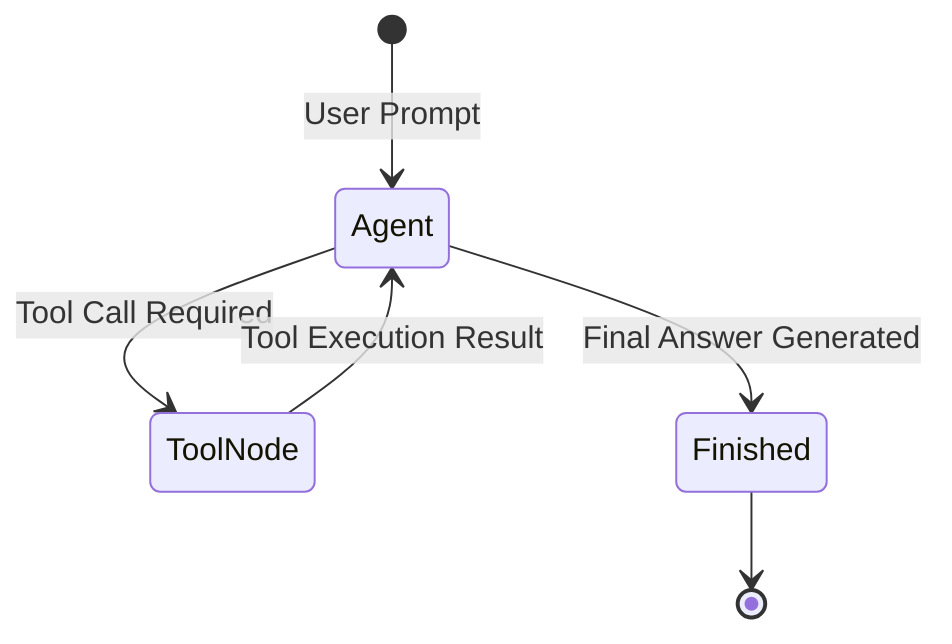

# 📹 Long Term Memory in LangGraph

<div className="video-card" style={{border: '1px solid #30363d', borderRadius: '8px', padding: '16px', marginBottom: '24px', background: 'rgba(56, 139, 253, 0.05)'}}>
  <div style={{display: 'flex', gap: '16px', flexWrap: 'wrap'}}>
    <div><strong>Instructor:</strong> Nitish Singh (CampusX)</div>
    <div><strong>Duration:</strong> 65m 35s</div>
    <div><strong>Playlist:</strong> Agentic AI with LangGraph (CampusX)</div>
    <div><strong>Watch Link:</strong> <a href="https://www.youtube.com/watch?v=KrXBcokM3Tc" target="_blank" rel="noopener noreferrer">YouTube Lecture ↗</a></div>
  </div>
</div>

## 📌 Executive Summary & Learning Objectives

This lecture covers **Long Term Memory in LangGraph**, focusing on production implementations, edge cases, and industry standards:
- Core intuition, architecture, and underlying mechanisms.
- Key differences between theoretical research implementations and scalable enterprise patterns.
- Concrete Python walkthroughs, error recovery, and performance optimization.

---

## 🏗️ Architecture & Conceptual Workflow



---

## 📖 Core Concepts & Technical Deep Dive

### 1. Architectural Foundations
In modern production AI engineering, **Long Term Memory in LangGraph** is essential for ensuring reliability, low latency, and deterministic outcomes. As AI systems evolve from naive prompt-in / completion-out scripts into distributed systems, engineers must handle:
- **State management & consistency:** Ensuring intermediate states and tool invocations are tracked.
- **Error boundaries & recovery:** Graceful degradation when external LLMs or vector stores encounter rate limits or network partitions.
- **Resource utilization & cost efficiency:** Caching common queries and reducing unnecessary foundation model token expenditure.

### 2. Operational Considerations
- **Latency Optimization:** Pre-computing embeddings, utilizing asynchronous non-blocking event loops, and streaming tokens via Server-Sent Events (SSE).
- **Security & Sandboxing:** Validating inputs before ingestion, sanitizing LLM outputs, and isolating tool execution environments.

---

## 💻 Production Implementation Walkthrough

```python
from typing import TypedDict, Annotated, List
from langgraph.graph import StateGraph, END
import operator

# 1. Define State Schema
class AgentState(TypedDict):
    messages: Annotated[List[str], operator.add]
    next_step: str

# 2. Define Node Functions
def analyze_input(state: AgentState):
    print("Analyzing query...")
    return {"messages": ["Query analyzed."], "next_step": "generate"}

def generate_response(state: AgentState):
    print("Generating response...")
    return {"messages": ["Final response generated."], "next_step": "end"}

# 3. Build StateGraph
workflow = StateGraph(AgentState)
workflow.add_node("analyze", analyze_input)
workflow.add_node("generate", generate_response)

workflow.set_entry_point("analyze")
workflow.add_edge("analyze", "generate")
workflow.add_edge("generate", END)

app = workflow.compile()
output = app.invoke({"messages": ["Hello Agent"], "next_step": ""})
print(output)
```

---

## 💡 Production Best Practices & Tips

:::tip Production Deployment Guideline
When deploying Long Term Memory in LangGraph in enterprise environments, always configure automated retries with exponential backoff and telemetry tracing (such as OpenTelemetry or LangSmith).
:::

:::warning Common Failure Modes
Watch out for state contamination across concurrent requests. Ensure each session or user interaction uses an isolated thread ID or execution context.
:::

---

## 🎯 Key Takeaways & Quick Reference

| Dimension | Production Standard | Pitfall to Avoid |
| :--- | :--- | :--- |
| **Execution** | Async / Non-blocking with timeouts | Synchronous blocking calls in event loops |
| **Data Validation** | Strict Pydantic v2 schemas | Untyped dictionary access |
| **Monitoring** | Distributed tracing & latency percentiles | Relying only on standard console logs |

## ⏱️ Lecture Timeline & Key Topics

| Timestamp | Key Topic / Concept Discussed |
| :--- | :--- |
| **00:00:00** | हाय गाइस, माय नेम इज नितेश एंड यू वेलकम... |
| **00:16:10** | मेमोरी भी साथ में क्रिएट कर रहे हैं।... |
| **00:32:41** | चीजें दिखेंगी। फर्स्ट आपको दिखाई देगा एक... |
| **00:49:03** | वन डी डुप्लीकेशन स्ट्रेटजी जैसा मैंने... |
| **01:05:33** | में। बाय।... |


---

---

## 📜 Complete Lecture Transcript (Hindi / Hinglish)

> **Language:** Hindi / Hinglish | **Source:** `25 - Long Term Memory in LangGraph.hi-orig.srt` | **Total Segments:** 33 | **Word Count:** ~11,666 words

<details>
<summary><b>Click to expand full chronological transcript (33 timestamped intervals)</b></summary>

#### ⏱️ [00:00 ➔ 00:02]

हाय गाइस, माय नेम इज नितेश एंड यू वेलकम टू माय YouTube चैनल। सो इस वीडियो में भी हम लोग अपना एजेंटिक एआई यूजिंग लैंग्राफ्ट प्लेलिस्ट कंटिन्यू करेंगे। अ पिछले दो-तीन वीडियो से हम मेमोरी के कांसेप्ट के ऊपर फोकस कर रहे हैं। अ अगर आपको याद होगा तो हमने लास्ट टू लास्ट वीडियो में एक बहुत डीप टाइव लिया था मेमोरी के फाउंडेशंस के ऊपर। उस वीडियो में मैंने आपको थ्योरिटिकल लेवल पर समझाया था कि मेमोरी क्या होती है और उसको आप कैसे बिल्ड करते हो अराउंड अ एलएलएम। वहां पे हमने दो टाइप की मेमोरीज देखी थी। शॉर्ट टर्म मेमोरी एंड लॉन्ग टर्म मेमोरी और फिर मैंने आपको इन दोनों के अराउंड जो जो प्रॉब्लम्स आती हैं उनके बारे में काफी डिटेल में बताया था। फिर लास्ट वीडियो में हमने फोकस किया था शॉर्ट टर्म मेमोरी के ऊपर। वहां पर मैंने आपको दिखाया था कि कैसे आप लंग ग्राफ में शॉर्ट टर्म मेमोरी इंप्लीमेंट कर सकते हो इनसाइड अ चार्ट बॉट। अब आज का जो वीडियो है वो डेडिकेटेड है टू लॉन्ग टर्म मेमोरी व्हिच इज़ अ वेरीेंट कांसेप्ट। हम आज के वीडियो में अगेन यह सीखेंगे कि कैसे आप लैंग ग्राफ के अंदर लॉन्ग टर्म मेमोरी इंप्लीमेंट कर सकते हो। हाउ कैन यू मेक योर चैटबॉट मोर पावरफुल बाय एडिंग द फीचर ऑफ लॉन्ग टर्म मेमोरी। ठीक है? तो पूरा का पूरा वीडियो बहुत ही सिंपल है और बहुत ही ल्यूसिड है। मैंने एकदम स्क्रैच से चीजों को स्टार्ट किया और धीरे-धीरे कॉम्प्लेक्सिटी ऐड की है और एंड में मैं आपको दिखाऊंगा कि कैसे प्रोडक्शन ग्रेड एलएलएम सिस्टम्स में लॉन्ग टर्म मेमोरी इंप्लीमेंट की जाती है। ऑन द होल आई वुड से दिस वीडियो इज़ रियलीेंट। स्पेशली इफ यू आर प्लानिंग टू बिकम एन एi इंजीनियर जो फ्यूचर में प्रोडक्शन ग्रेड चार्टबॉट सिस्टम्स बनाएगा। आपके लिए यह पर्टिकुलर वीडियो बहुतेंट हो जाता है। सो, प्लीज मेक श्योर आप इसको एंड टू एंड देखो। ठीक है? आई एम वेरी एक्साइटेड फॉर द वीडियो। लेट्स स्टार्ट। अब गाइज़, वैसे तो मैंने आपको पिछले के पिछले वीडियो में लॉन्ग टर्म मेमोरी क्या होता है? यह बताया था। बट इस वीडियो को शुरू करने के पहले मैं आपको फिर से एक क्विक रिककैप देता हूं। ठीक है? तो,

#### ⏱️ [00:02 ➔ 00:04]

होता क्या है? एलएलएम बेस्ड सिस्टम्स में कि लेट्स से आप एक चार्टबॉट बिल्ड कर रहे हो। और चैटबॉट में व्हाट यू डू इज़ कि आप मल्टीपल थ्रेड्स में बातचीत करते हो। आपको चैटबॉट चार्ट जीपीटी याद होगा। चार्ट जीपीटी में व्हाट यू डू इज़ यू क्रिएट सेपरेट थ्रेट्स फॉर सेपरेट कॉन्वर्सेशंस। जैसे इस डायग्राम में यू कैन सी यू कैन इमेजिन दिस टू बी अ चैट बॉट। अब एक विंडो में आपने कभी किसी टेक्निकल टॉपिक के बारे में बात किया लाइक लैंगचेन। किसी दूसरे में आपने अपने ट्रैवल प्लांस डिस्कस किए और किसी तीसरे में आप कुछ बहुत डीप बातें करने लग गए। अब होता क्या है कि आपको इफ यू आर अ चैटबॉट बिल्डर इफ यू आर अ कंपनी जिसने चैटबॉट बिल्ड किया है तो आपको ओवरटाइम अपने प्रोडक्ट को इस तरीके से इंप्रूव करना होता है कि यूजर आपके साथ और ज्यादा कंफर्टेबल होते जाए और इसके लिए बहुत इंपॉर्टेंट है कि आप यूजर को और अच्छे से समझो ताकि आप उसके हिसाब से अपने एलएलएम के रिस्पांससेस को पर्सनलाइज कर पाओ। अब प्रॉब्लम क्या है कि यूजर अपने बारे में किसी एक सिंगल चार्ट में सब कुछ नहीं बता रहा। वो अलग-अलग कॉन्वर्सेशंस में थोड़ा-थोड़ा अपने बारे में बताता है। जैसे हो सकता है इस टेक्निकल कॉन्वर्सेशन में यूजर बताए कि वो प्रोग्रामर है और वो पython प्रेफर करता है। सिमिलरली इस ट्रैवल प्लान वाले कन्वर्सेशन में वो बताए कि वो रिसेंटली अभी प्लान कर रहा है कहीं पे मूव करने का या कहीं ट्रैवल करने का। सिमिलरली ये डीप थॉट वाले कॉन्वर्सेशन में वो थोड़ा बताएगा कि उसका थोड़ा फिलॉसफिकल इंक्लिनेशन है या वो स्पिरिचुअलिटी में थोड़ा बिलीव करता है। तो ये सारे के सारे जो इंपॉर्टेंट पीसेस ऑफ इंफॉर्मेशनेशन है यूजर के बारे में ये एक सिंगल थ्रेड में एक्सिस्ट नहीं करते। ये मल्टीपल थ्रेड्स में एग्ज़िस्ट करते हैं। तो एलएलएम बेस्ड सिस्टम बनाने वाले जो लोग हैं वो लोग क्या करते हैं कि वो एक सिस्टम इंप्लीमेंट करते हैं। सो व्हाट दे डू इज़ दे क्रिएट अ मेमोरी स्टोर काइंड ऑफ थिंग। ठीक है? दिस कैन बी अ

#### ⏱️ [00:04 ➔ 00:06]

डेटाबेस। या फिर आप इसको डेटाबेस ही समझ लो फिलहाल। और होता क्या है कि जितनी बार एक नए चैट में यूजर एक क्वेश्चन पूछता है तो आप नॉट ओनली उस क्वेश्चन को आंसर करते हो बट एट द सेम टाइम आप अपने एलएलएम से ये भी पूछते हो कि क्या इस क्वेश्चन में यूजर के बारे में कोई इंफॉर्मेशन छुपा है? अगर इस यूजर के बारे में कोई इंफॉर्मेशन छुपा है जो आगे यूज़फुल हो सकता है तो आप वो पीस ऑफ इंफॉर्मेशन एक्सट्रैक्ट करते हो और उसको इस मेमोरी स्टोर में ऐड कर देते हो। अब इस मेमोरी स्टोर की सबसे अच्छी खासियत क्या है कि ये पर्सिस्टेंट है व्हिच बेसिकली मींस कि अगर आपने ये चैट विंडो बंद भी कर दिया तो भी यहां पे जो इनेशन है वो एज इट इज़ रहेगी फॉर एवर। सिमिलरली आपने किसी दूसरे चार्ट में बात किया कि मुझे 2 महीने बाद लेट्स से मुंबई जाना है तो ये भी टेंपरेरी बेसिस पे इट इज़ एनेंट इंफॉर्मेशनेशन तो आप झट से ये इनेशन भी निकाल करके डेटाबेस में डाल देते हो। तो बेसिकली आप क्या कर रहे हो कि हर बार जब यूजर आपके साथ चैटिंग कर रहा है तो उस कॉन्वर्सेशन से इंपॉर्टेंट पीसेस ऑफ इनेशन को निकाल करके इस पर्सिस्टेंट स्टोरेज में डाल रहे हो। और इसी पर्सिस्टेंट स्टोरेज को हम लॉन्ग टर्म मेमोरी बोलते हैं। बिकॉज़ इसकी हेल्प से आप पर्सनलाइज रिस्पांससेस दे सकते हो। जैसे यूजर ने कभी बताया कि उसका नाम नितीश है। तो ये जाकर के हमारे डेटाबेस में स्टोर हो गया। अब मजेदार चीज क्या है कि एलएलएम अपना रिप्लाई फ्रेम करने के प्रोसेस में हमेशा पहले एक बार जाकर चेक करेगा कि इस डेटाबेस के अंदर कुछ ऐसा इंफॉर्मेशनेशन तो नहीं छुपा जो मुझे इस आंसर को और बेटर तरीके से पर्सनलाइज़ करने में हेल्प करेगा। फॉर एग्जांपल मैं अगर मैं क्वेश्चन पूछ रहा हूं कि अ राइट अ कोड फॉर फिबोनाची अ सीरीज़। ठीक है? और पास्ट में मैंने कभी चैटबॉट को बताया था कि मुझे Python पसंद है। आई प्रेफर प्रोग्रामिंग इन Python और ये इनफेशन मेमोरी स्टोर में है। तो अब एलएलएम अपना आंसर करने के पहले एक बार मेमोरी स्टोर में जाके चेक करेगा कि यूजर को कौन सा

#### ⏱️ [00:06 ➔ 00:08]

प्रोग्रामिंग लैंग्वेज पसंद है। उसका प्रेफरेंस क्या है? वो इंफॉर्मेश आएगा और उस इंफॉर्मेशनेशन के बेसिस पे एलएलएम समझ पाएगा कि उसको ये आंसर ये प्रोग्राम पाइथन में लिख के देना है। तो दिस इज़ हाउ पर्सनलाइजेशन हैपेंस इन एलएलएम बेस्ड सिस्टम। और ये पूरी की पूरी चीज जो पॉसिबल करवा रहा है जो कंपोनेंट उसको हम लॉन्ग टर्म मेमोरी बोलते हैं। तो आई रियली होप आपको इस सिंपल एग्जांपल डेमोंस्ट्रेशन से फर्स्ट ऑफ ऑल समझ में आ गया कि लॉन्ग टर्म मेमोरी होता क्या है इन एलएलएम बेस्ड सिस्टम्स। अब हम क्या करेंगे कि हम एक डीप ड्राइव लेंगे कि कैसे आप लैंग ग्राफ में लॉन्ग टर्म मेमोरी को इंप्लीमेंट कर सकते हो। अब वीडियो को स्टार्ट करने के पहले एक छोटा सा टेक्निकल डिस्कशन करेंगे। डिस्कशन ये है कि लंग ग्राफ में आपका जो स्टोर का कांसेप्ट है, मेमोरी स्टोर का जो कांसेप्ट है, ये एक क्लास की हेल्प से इंप्लीमेंटेड है। इनफैक्ट ये एक एब्स्ट्रैक्ट क्लास है। और इस एब्स्ट्रैक्ट क्लास का नाम है बेस स्टोर। अभी जब हम कोड देखेंगे तो वहां पे आपको ये बेस स्टोर मल्टीपल जगहों पे दिखाई देगा। दैट इज़ व्हाई मैं पहले एक बारी ये एक्सप्लेन करना चाहता हूं। सो इस एब्स्ट्रैक्ट क्लास में बताया गया है कि आपका जो मेमोरी स्टोर है वो क्या-क्या एक्टिविटीज कर सकता है। जैसे यहां पे बताया गया है कि मेमोरी स्टोर जो है या जो बेस स्टोर है वो नई मेमोरीज़ क्रिएट कर सकता है। सिमिलरली आप यहां पे एकिस्टिंग मेमोरीज़ को सर्च कर सकते हो। आप एकिस्टिंग मेमोरीज़ को एडिट कर सकते हो और आप एकिस्टिंग मेमोरीज़ को डिलीट भी कर सकते हो। तो ये सारी चीजें बता रखी हैं इस बेस स्टोर में। अब इस बेस स्टोर से और कुछ क्लासेस इन्हहेरिट करती हैं। जैसे कि एक बहुत फेमस क्लास है इन मेमोरी स्टोर बोल के। अब ये जो इन मेमोरी स्टोर है ये एक स्पेशल टाइप का मेमोरी स्टोर है जो आपकी मेमोरीज को रैम में स्टोर करता है। ऑब्वियसली रैम में स्टोर करता है तो फिर बहुत यूज़फुल नहीं है। आप प्रोडक्शन ग्रेड सिस्टम्स में इन मेमोरी स्टोर को यूज़ नहीं करोगे। यह पर्टिकुलर इंप्लीमेंटेशन इसलिए एक्सिस्ट करता है सो दैट आप क्विकली प्रोटोटाइप करके चेक कर लो कि आपका पूरा

#### ⏱️ [00:08 ➔ 00:10]

का पूरा फंक्शनैलिटी सही से काम कर रहा है या नहीं। तो हम भी शुरू में जब कोड देखेंगे तो वहां पे इन मेमोरी स्टोर को यूज़ करेंगे। फिर एक और क्लास इंप्लीमेंटेड जो है वो है पोस्ट ग्रेस स्टोर बोल के। और नाम से ही आपको समझ में आ रहा है यह क्लास आपकी मेमोरीज को पोस्ट ग्रे डेटाबेस में स्टोर करती है और प्रोडक्शन ग्रेड सिस्टम्स के लिए आप इसको यूज़ करते हो। तो लास्ट में वीडियो के मैं आपको ये पर्टिकुलर इंप्लीमेंटेशन भी दिखाऊंगा। एंड देयर इज़ वन मोर रेडिस स्टोर जो कि अगेन एक प्रोडक्शन ग्रेड इंप्लीमेंटेशन है रेडिस में मेमोरीज़ को स्टोर करने के लिए। ठीक है? तो पूरा का पूरा ऑर्गेनाइजेशन कैसा है कि लंग ग्राफ में लॉन्ग टर्म मेमोरी का जो कांसेप्ट है वो स्टोर के फॉर्म में इंप्लीमेंटेड है और उसका कोड आपको देखने को मिलेगा बेस स्टोर एब्स्ट्रैक्ट क्लास में और फिर उस एब्स्ट्रैक्ट क्लास से मल्टीपल अलग इंप्लीमेंटेशंस हैं जो इन्हहेरिट करती हैं। उसमें से जो दो सबसेेंट वाले हम देखने वाले हैं वो है इन मेमोरी स्टोर जो रैम में मेमोरीज को स्टोर करेगा और सेकंड पोस्ट क्रे स्कोर जो आपका मेमोरीज को पोस्ट क्रे डेटाबेस में स्टोर करेगा। ठीक है? तो ये एक कॉनसेप्चुअल माइंड मैप है कि लंग ग्राफ में ये पूरा इंप्लीमेंटेशन कैसे है। नाउ दैट यू अंडरस्टैंड दिस बिट अब आपको कोड देख करके ज्यादा परेशानी नहीं होगी। नाउ लेट्स डाइव इंटू द कोडिंग पार्ट। अब कोडिंग वाला पूरा पार्ट हम दो पार्ट्स में देखेंगे। सो सबसे पहले हम क्या करेंगे कि हम फर्स्ट पार्ट में स्पेसिफिकली मेमोरी स्टोर्स के ऊपर काम करेंगे। यहां पे हम थोड़ी देर के लिए भूल जाएंगे कि हम लैंग ग्राफ पढ़ रहे हैं और हमारा पूरा फोकस होगा मेमोरी स्टोर्स को सीखना। अब यहां पे हम क्या-क्या करेंगे? हम सीखेंगे कि आप कैसे एक मेमोरी स्टोर बनाते हो। कैसे उसके अंदर नई मेमोरीज को क्रिएट करते हो। कैसे एकिस्टिंग मेमोरीज को सर्च करते हो। ये सारा कांसेप्ट आप सीखोगे। एक बार जब आप मेमोरी स्टोर्स के साथ काम करने में कंफर्टेबल हो जाओगे उसके

#### ⏱️ [00:10 ➔ 00:12]

बाद हम पार्ट टू में क्या करेंगे? हम लंग ग्राफ के साथ इंटीग्रेट करेंगे मेमोरी स्टोर को और हम एक रियल चार्ट बॉट बनाएंगे जो मेमोरीज क्रिएट भी करेगा और मेमोरीज को रीड भी करेगा। ठीक है? तो दो पार्ट्स में ये पूरा काम हम करने वाले हैं। चलो स्टार्ट करते हैं पार्ट वन जहां पे वी विल लर्न अबाउट हाउ टू इंप्लीमेंट मेमोरी स्टोर्स इन लैंग्राफ। तो कोड मैंने लिख रखा है। मैं आपको वॉक थ्रू देता हूं। बहुत ही सिंपल कोड है। सबसे पहले आपको क्या करना है कि आपको lang्राफ्ट डॉट स्टोर डॉट मेमोरी के अंदर से इन मेमोरी स्टोर को अ इंस्टॉल करना है। इंपोर्ट करना है। इन मेमोरी स्टोर जैसा मैंने बोला इज़ वन इंप्लीमेंटेशन ऑफ बेस स्टोर। जहां पर बताया गया है कि क्या-क्या काम एक मेमोरी स्टोर कर सकता है। इन मेमोरी स्टोर की खासियत क्या है कि यह रैम में चीजों को स्टोर करता है। तो पर्सिस्टेंट नहीं है बट क्विकली चीजों को सीखने के लिए बहुत यूज़फुल है। अगर आप थोड़ा सा इसके कोड में जाके देखो तो आपको ये पूरा स्ट्रक्चर बहुत आसानी से समझ में आ जाएगा। इनफैक्ट मैं आपको दिखाता हूं। अगर आप इन मेमोरी स्टोर पे क्लिक करोगे तो आपको ये इन मेमोरी स्टोर का कोड दिखाई देगा। अब यहां पे सबसे इंटरेस्टिंग चीज जो आपको देखनी है वो ये है कि आपका इन मेमोरी स्टोर जो क्लास है वो बेस स्टोर क्लास को इन्हहेरिट करता है। और अगर मैं आपको लेके चलूं बेस स्टोर क्लास में तो आपको दिखाई देगा कि ये बेस स्टोर जो है ये एक एब्स्ट्रैक्ट क्लास है। बिकॉज़ ये एबीसी को इन्हहेरिट कर रहा है। अब यहां पे अगर आप जाओगे तो आपको अलग-अलग एब्स्ट्रैक्ट मेथड्स दिखाई देंगे। जैसे कि गेट जिसकी हेल्प से आप एक पर्टिकुलर मेमोरी को फैच करके लाते हो। सर्च जिसकी हेल्प से आप एक से ज्यादा मेमोरीज को सर्च कर सकते हो। देन वी हैव पुट जिसकी हेल्प से आप नई मेमोरीज क्रिएट कर सकते हो। ठीक है? तो आई होप आपको सबसे पहले तो स्ट्रक्चर समझ में आ गया। अब मैं आपको दिखाता हूं कि कैसे हमें इसके साथ काम करना है। तो सबसे पहले आप क्या करते हो कि आप इन मेमोरी स्टोर जो क्लास है उसका एक ऑब्जेक्ट बना लेते हो। और हम इस ऑब्जेक्ट को स्टोर बुला रहे हैं। अब इस ऑब्जेक्ट के

#### ⏱️ [00:12 ➔ 00:14]

पास वो सारी कैपेबिलिटीज हैं जो इस क्लास के पास हैं। नई मेमोरीज को क्रिएट करना, सर्च करना, फेच करके लाना ये सब कुछ हमारे पास स्टोर के अंदर है। अब यहां पे आपको क्या करना होता है? एक नेम स्पेस क्रिएट करना होता है। हम सबसे पहले क्या करने वाले हैं? हम एक नई मेमोरी क्रिएट करने वाले हैं इस स्टोर के अंदर। और उसके लिए आपको सबसे पहले एक नेम स्पेस क्रिएट करना पड़ता है। अब नेम स्पेस क्या होता है? मैं आपको जल्दी से समझाता हूं। अगर आप थोड़ी देर के लिए अपने मेमोरी स्टोर को Google ड्राइव मान लो तो नेम स्पेस इज नथिंग बट अ फोल्डर इनसाइड योर Google ड्राइव। जिस तरीके से आप फोल्डर के अंदर डेटा को ऑर्गेनाइज करते हो। सिमिलरली आप मेमोरी स्टोर के अंदर मेमोरी को ऑर्गेनाइज करने के लिए नेम स्पेस को यूज़ करते हो। जैसे मैं आपको एक एग्जांपल नेम स्पेस दिखाता हूं। एक एग्जांपल नेम स्पेस हो सकता है यूज़र्स U1 तो बेसिकली हमने क्या किया? हमने एक टॉप लेवल फोल्डर बनाया यूज़र्स बोल के और उसके अंदर हमने एक और फोल्डर बनाया U1 बोल के और अब हम U1 रिलेटेड सारी मेमोरीज इस फोल्डर में स्टोर कर रहे हैं। बेसिकली यूजर वन की सारी मेमोरीज़ U1 फोल्डर में स्टोर कर रहे हैं। एक और नेम स्पेस हो सकता है यूज़र्स U2। तो अब हम क्या कर रहे हैं? टॉप लेवल फोल्डर में एक दूसरा फोल्डर बना रहे हैं U2 और U2 की सारी मेमोरीज़ हम इस फोल्डर के अंदर सेव कर रहे हैं। अब एक और अ नेम स्पेस हो सकता है यूज़र्स U1 प्रोफाइल। तो अब हम क्या कर रहे हैं? हम थोड़ा सा और फोल्डर के अंदर डीप ड्राइव कर रहे हैं। और इस फोल्डर के अंदर एक और फोल्डर बना रहे हैं बाय द नेम ऑफ़ प्रोफाइल। अब इसके अंदर हम क्या स्टोर कर रहे हैं? हम U1 का प्रोफाइल रिलेटेड इंफॉर्मेशन स्टोर कर रहे हैं। जैसे कि उसका नाम क्या है? उसका प्रोफेशन क्या है? उसका एज क्या है? उसका जेंडर क्या है? एक और नेम स्पेस हो सकता है यूज़र्स U2 प्रोफाइल। तो हमने U2 के लिए प्रोफाइल

#### ⏱️ [00:14 ➔ 00:16]

फोल्डर बना दिया। एक और नेम स्पेस हो सकता है यूज़र्स U1 प्रेफरेंस। तो अब हमने U1 के लिए एक प्रेफरेंस फोल्डर बना दिया। अब इस प्रेफरेंस फोल्डर के अंदर हम मेमोरी स्टोर कर सकते हैं। जैसे कि यूजर को डार्क मोड पसंद है। यूजर प्रेफर्स पython प्रोग्रामिंग लैंग्वेज। तो इस तरह का इनेशन हम यहां पे डाल रहे हैं। तो आई होप आपको समझ में आ रहा है कि नेम स्पेसेस आर अ वे टू ऑर्गेनाइज मेमोरी इनसाइड अ मेमोरी स्टोर। ठीक है? तो कभी भी आप नई मेमोरीज क्रिएट करोगे वो किसी ना किसी नेम स्पेस के अंदर ही होगा। तो फिलहाल हमने क्या किया? हमने एक नेम स्पेस बनाया और उस नेम स्पेस का नाम है यूज़र्स U1। ठीक है? आप कुछ भी रख सकते हो बट हमने यूज़र्स U1 रखा। और एक चीज हमेशा याद रखना नेम स्पेसेस को आप टपल के फॉर्म में क्रिएट करते हो। टपल स्ट्रिंग कॉमा स्ट्रिंग कॉमा स्ट्रिंग करके आप कितना भी लंबा नेम स्पेस बना सकते हो। ठीक है? तो ये हो गया हमारा नेम स्पेस। और अब इसी नेम स्पेस के अंदर हम अपनी फर्स्ट मेमोरी क्रिएट करेंगे। कैसे? बहुत आसान है। आपके पास जो स्टोर ऑब्जेक्ट है उसके पास एक पुट मेथड है जो मैंने आपको अभी दिखाया भी था। इस पुट मेथड को तीन चीजें चाहिए होती हैं। पुट मेथड को अपना काम करने के लिए तीन चीजें चाहिए। पहले पहली बात ये कर लेते हैं कि पुट मेथड करता क्या है? पुट मेथड एक पर्टिकुलर नेम स्पेस में एक न्यू मेमोरी को इंसर्ट करता है। बेसिकली नई मेमोरी क्रिएट करने के काम आता है। पुट मेथड। इसको तीन इनपुट्स चाहिए। पहला नेम स्पेस बेसिकली वह फोल्डर जहां पे आपको मेमोरी क्रिएट करनी है। फिर आपकी मेमोरी का एक यूनिक की ये यूनिक होना चाहिए। और सेकंड एक वैल्यू उस मेमोरी की वैल्यू क्या है? ठीक है? तो ध्यान से देखो। हमने क्या किया? हमने स्टोर डॉट पुट के अंदर सबसे पहले अपना नेम स्पेस दे दिया और हमने अपना की दे दिया। की फिलहाल हमारा वन है। और ये है हमारी वैल्यू। हम क्या स्टोर करना चाहते हैं? हम ये डिक्शनरी

#### ⏱️ [00:16 ➔ 00:18]

डेटा स्टोर करना चाहते हैं। डेटा का वैल्यू यूजर लाइक्स पीसा एंड दिस इज आवर फर्स्ट मेमोरी। सिमिलरली हम एक सेकंड मेमोरी भी साथ में क्रिएट कर रहे हैं। स्टोर डॉट पुट नेम स्पेस। इस बार हमारा की है टू। और इस बार हमारा मेमोरी है दैट यूजर प्रेफर्स डार्क मोड। अब मैं क्या करूंगा? मैं सिंपली इस कोड को एग्जीक्यूट करूंगा। हो गया। हमने मेमोरी ऐड कर दी। अब मैं क्या कर रहा हूं? मैं एक और दूसरा नेम स्पेस बना रहा हूं। इस नेम स्पेस का नाम है नेम स्पेस टू और ये है यूजर u2। तो अब हम एक सेकंड फोल्डर क्रिएट कर रहे हैं यूजर टू के लिए। और अब देखो हम क्या कर रहे हैं। स्टोर डॉट पुट नेम स्पेस टू उसका की है वन यूजर लाइक्स पास्ता। सेकंड मेमोरी इज़ नेम स्पेस टू की है टू। डेटा इज़ यूजर प्रेफर्स ग्रिड स्टाइल नेविगेशन। मैं इसको भी रन कर देता हूं। एंड विद दैट हमने सेकंड यूजर के लिए भी मेमोरीज क्रिएट कर दी। तो मेमोरी क्रिएट करना आपने सीख लिया। अब मैं आपको बताता हूं कि कैसे आप मेमोरीज को फैच कर सकते हो। ठीक है? तो उसके लिए आपके पास होता है गेट मेथड। ठीक है? गेट इज़ फॉर रिट्रीविंग डेटा। तो यहां पे आपको सिर्फ दो चीजें बतानी है। आपका नेम स्पेस और आपका की। तो मैंने नेम स्पेस दे दिया फर्स्ट यूजर का U1 वाले का और मैं उससे फर्स्ट मेमोरी की वन मांग रहा हूं। तो इसको मैं जैसे ही रन करूंगा तो देखो क्या दिखाई दे रहा है यूजर लाइक्स पास्ता अब अगर मैं यहां पर नेम स्पेस टू कर दूं तो ये सेकंड यूजर की फर्स्ट मेमोरी आ जाएगी यूजर लाइक्स पास्ता अगर मैं यहां पे टू कर दूं तो अब आ जाएगा यूजर प्रेफर्स ग्रिड स्टाइल नेविगेशन ओवर या ग्रिड स्टाइल नेविगेशन तो दिस इज़ हाउ यू क्रिएट मेमोरीज़ एंड दिस इज़ हाउ यू फच अ पर्टिकुलर मेमोरी यहां पे आप एक कोई पर्टिकुलर मेमोरी को फैच कर रहे हो वि द हेल्प ऑफ़ नेम स्पेस एंड की। व्हाट इफ आपको सारी की सारी मेमोरीज़ एक साथ फैच करनी है फ्रॉम अ पर्टिकुलर नेम स्पेस।

#### ⏱️ [00:18 ➔ 00:20]

उसके लिए आपके पास सर्च बोल के एक फंक्शन होता है। तो आप क्या कर रहे हो? स्टोर डॉट सर्च और आप अपना नेम स्पेस प्रोवाइड कर रहे हो। तो नेम स्पेस हमारा है यूज़र्स comमा U1। तो मुझे यूजर वन की सारी मेमोरीज़ चाहिए। तो हमने क्या किया? इसको सर्च किया और जो भी आया उसको हमने आइटम्स में स्टोर कर दिया। अब आइटम्स इज़ अ लिस्ट। तो हमने उस लिस्ट के ऊपर लूप चलाया और हर आइटम को प्रिंट कर दिया। दिस इज द रिजल्ट। ये है हमारे यूजर वन की सारी मेमोरीज़। अगर आपको यूजर टू की सारी मेमोरीज़ देखनी है तो आप नेम स्पेस टू करोगे, रन करोगे। ये रहा यूजर टू की सारी मेमोरीज़। तो आई होप आपको समझ में आ रहा है कि ये पूरी चीज़ कितनी सिंपल बना रखी है लंग्राफ ने। आपको सिंपली इन मेमोरी स्टोर का एक ऑब्जेक्ट बनाना था। अब उस ऑब्जेक्ट के पास पुट मेथड है, गेट मेथड है, सर्च मेथड है जिनकी हेल्प से आप क्रिएट भी कर पा रहे हो, एक आइटम को रिट्रीव भी कर पा रहे हो। सारी मेमोरीज को भी रिट्रीव कर पा रहे हो। जो इंपॉर्टेंट कांसेप्ट यहां पे सीखने लायक है वो है नेम स्पेसेस का। व्हिच इज़ अगेन अ वेरी इंटरेस्टिंग एंड सिंपल कांसेप्ट। आप बेसिकली अपने मेमोरी स्टोर के अंदर फोल्डर्स क्रिएट कर रहे हो। और फोल्डर्स क्रिएट करने के लिए आप नेम स्पेसेस को यूज़ कर रहे हो। तो आई होप आपको यहां तक का डिस्कशन सिंपल लगा। एंड यू आर कंफर्टेबल विथ द कॉन्सेप्ट। सो अभी तक हमने दो चीजें सीखी मेमोरी के टर्म्स में। फर्स्ट हमने यह सीखा कि आप मेमोरी क्रिएट कैसे करते हो यूजिंग द पुट फंक्शन। और सेकंड आपने सीखा कि कैसे आप मेमोरीज़ को रिट्रीव कर सकते हो। और इसके लिए हमने दो अलग फंक्शनंस देखे। वन वाज़ गेट एंड द सेकंड वन वाज़ सर्च। अब एक बार फोकस करते हैं रिट्रीवल के ऊपर। अब रिट्रीवल जो है रिट्रीवल में ये जो दो मेथड्स हैं ये दोनों यूज़फुल तो हैं बट देयर इज वन सिचुएशन जहां पे ये दोनों मेथड्स आपकी हेल्प नहीं कर पाएंगे। पहले मैं आपको एक बार बता देता हूं। गेट हमने यूज़ किया था जब हमारे पास एग्जैक्ट की मौजूद था। व्हिच बेसिकली मींस कि हमें एग्जैक्टली पता है कि हमें कौन सी मेमोरी

#### ⏱️ [00:20 ➔ 00:22]

चाहिए। और सर्च हमने यूज़ किया था टू गेट ऑल द मेमोरीज़ इन वन गो। मतलब आई डोंट केयर मुझे सारी मेमोरीज ला के दो। बट व्हाट इफ हमें ना कोई एक पर्टिकुलर मेमोरी चाहिए है। मतलब हमें पहले से नहीं पता कि वो मेमोरी कौन सी है। और सेकंड हमें सारी मेमोरीज भी नहीं चाहिए। व्हाट इफ हमें किसी स्पेसिफिक मेमोरी की रिक्वायरमेंट हो। मैं आपको एक एग्जांपल देता हूं। मान लो आप अपने चैटबॉट से बात कर रहे हो अबाउट योर ट्रैवल प्लान। आपने पास्ट में भी इस ट्रैवल प्लान के बारे में बात किया था और आज आप फिर से बात कर रहे हो। अब इस पॉइंट पर ऐसा हो सकता है कि आपका जो मेमोरी स्टोर है उसमें 100 मेमोरी पड़ी हो आपके बारे में। आपका नाम, आपका प्रोफेशन, आप कौन से प्रोग्रामिंग लैंग्वेज में काम करते हो, आपको डार्क मोड पसंद है और बहुत तरह की चीजें वहां पे पड़ी हुई हैं। और वहां पे यह भी पड़ा हुआ है कि आप 2 महीने बाद मुंबई प्लान कर रहे हो विजिट करने का। अब इस पॉइंट पर आप सोचो कि आपके करंट कॉन्वर्सेशन में कौन सी मेमोरी हेल्पफुल होगी एजेंट के लिए। ऑब्वियसली वो मेमोरीज जो आपके मुंबई ट्रैवल प्लान के अराउंड है। अब ऐसा हो सकता है कि 100 में से सिर्फ दो या तीन मेमोरीज आपके मुंबई प्लान के अराउंड हो। तो सोच के देखो। अगर आप सर्च को यूज़ करोगे और आप सारी मेमोरीज़ को फेच करके ले आओगे। 100 मेमोरीज को और उसको आप अपने कॉन्टेक्स्ट में डाल दोगे तो आपका एलएलएम सिर्फ कंफ्यूज होगा। वो आपको अच्छे रिस्पांससेस नहीं देगा। बेस्ट सिचुएशन वुड बी कि आप इन 100 मेमोरीज में से एग्जैक्टली यही दो-तीन मेमोरीज फच करके लाओ जहां पे मुंबई के बारे में बात हो रही है। जब वो दो-तीन मेमोरीज आपके करंट कॉन्वर्सेशन का पार्ट बनेंगी तो ऑटोमेटिकली आपका एलएलएम आपको बेटर पर्सनलाइज़ रिस्पांससेस दे पाएगा। तो मैं क्या कहना चाह रहा हूं कि यहां पर आपको नीड है सिमेंटिक सर्चिंग की।

#### ⏱️ [00:22 ➔ 00:24]

मतलब अभी जो कॉन्वर्सेशन चल रहा है उसके मीनिंग को आप मैच करोगे आपकी जो मेमोरीज स्टर्ड हैं उसके साथ और जिन मेमोरीज के साथ मीनिंग मैच होगा आप सिर्फ उन्हीं मेमोरीज़ को फैच करके लाओगे। दिस इज़ द कॉनंसेप्ट ऑफ़ सिमेंटिक सर्च। आप मीनिंग के बेसिस पर सर्चिंग करना चाहोगे मेमोरी में जो आपका करंट कॉन्वर्सेशन है। तो अब हम यह सीखेंगे कि हाउ डू वी सिमेंटिकली सर्च मेमोरीज। अब मजेदार बात यह है कि सिमेंटिक सर्च करने के लिए भी आप सर्च फंक्शन को ही यूज़ करते हो। मैं आपको कोड में दिखाता हूं सिमेंटिक सर्च कैसे किया जाता है। तो यहां पर दो मेन चेंजेस हैं। पहला चेंज ये है कि जब आप इन मेमोरी स्टोर का ऑब्जेक्ट बनाओगे तो आप वहां पर एक एंबेडिंग मॉडल पास करोगे जिसकी हेल्प से आप सिमेंटिक सर्च परफॉर्म करवाओगे फ्यूचर में। तो यहां पर आप कोड देखो मैंने यहां पे लिख रखा है। सबसे पहले हमने इंपोर्ट की लाइब्रेरीज़ उसके बाद मैंने क्या किया? मैंने ओपन एi का एक एंबेडिंग मॉडल को फैच किया। इस मॉडल का नाम है टेक्स्ट एंबेडिंग थ्री स्मॉल और उसको मैंने इस वेरिएबल में स्टोर कर दिया एंबेडिंग मॉडल। उसके बाद जब मैंने इन मेमोरी स्टोर क्रिएट किया तो यहां पे इंडेक्स बोल के एक की के अंदर मैंने एक डिक्शनरी पास की और डिक्शनरी में मैंने बताया कि इस पर्टिकुलर मेमोरी स्टोर के पास सिमेंटिक सर्च करवाने का कैपेबिलिटी है। बिकॉज़ आई एम पासिंग अ एंबेडिंग मॉडल इंटू इट। तो मैंने यहां पे बता दिया कि दिस इज द एंबेडिंग मॉडल और इतने डायमेंशन की एंबेडिंग्स जनरेट करना। ठीक है? तो अब ये थोड़ा स्पेशलाइज्ड अ मेमोरी स्टोर है व्हिच आल्सो हैस एंबेडिंग एंड सिमेंटिक सर्च कैपेबिलिटीज़। ठीक है? अब मैंने फिर से क्या किया कि एक नेम स्पेस क्रिएट किया यूज़र्स U1 और यहां पे मैं क्या कर रहा हूं कि अपनी मर्जी से 10 अलग मेमोरीज़ क्रिएट कर रहा हूं विथ द हेल्प ऑफ़ पुट मेथड। बिल्कुल सेम तरीके से जैसा मैंने ऊपर किया। यू कैन पॉज द

#### ⏱️ [00:24 ➔ 00:26]

स्क्रीन एंड यू कैन सी कि मैंने क्या-क्या मेमोरीज क्रिएट की हैं। यूजर के बारे में अलग-अलग चीजें मैंने यहां पे डाल दी हैं। ठीक है? अब यहां से इंटरेस्टिंग चीज शुरू होती है। अब देखो मुझे क्या करना है? मुझे सर्चिंग परफॉर्म करनी है। और सर्चिंग परफॉर्म करने के प्रोसेस में मैं क्या करूंगा? मैं एक क्वेरी भी डालूंगा। और अब क्या होगा कि इस क्वेरी की एंबेडिंग जनरेट होगी। मेरे सारे मेमोरीज़ की एंबेडिंग ऑलरेडी बन चुकी है। तो वो एंबेडिंग वेक्टर्स को कंपेयर किया जाएगा। और जो क्लोजेस्ट आपकी मेमोरीज़ हैं उनको फैच करके लाया जाएगा। सो व्हाट आई एम डूइंग इज़ मैं लिख रहा हूं स्टोर डॉट सर्च नेम स्पेस मैंने प्रोवाइड किया। बट इस बार मैंने साथ में क्वेरी प्रोवाइड किया। और क्वेरी में मैंने क्या लिखा? व्हाट इज़ यूजर करेंटली लर्निंग? अगर आप ऊपर जाके देखोगे तो यहां पर इस पर्टिकुलर मेमोरी में मेमोरी नंबर फाइव में मैंने बताया है कि यूजर इज़ लर्निंग मशीन लर्निंग। ठीक है? और यहां पे लिमिट इक्वल टू वन का मतलब है कि आप कितनी मेमोरीज़ को रिटर्न करवाना चाहते हो। अगर मैं तीन लिखूंगा यहां पे तो टॉप तीन मैचिंग मेमोरीज रिटर्न होंगी। ठीक है? तो देखो मैं इस कोड को रन करता हूं और ये देखो मेरा आउटपुट है दैट यूजर इज़ लर्निंग मशीन लर्निंग। अगर मैं यहां पे लिमिट थ्री कर देता तो टॉप तीन मैचिंग मेमोरीज़ मुझे मिलती। जैसे यूजर प्रेफर्स स्टेप बाय स्टेप रीजनिंग यूजर लाइक्स एग्जांपल्स इन Python। ये उसको सबसे ज्यादा क्लोजेस्ट लगा सिमेंटिकली। बट अगेन यहां पे वन वुड बी अ गुड ऑप्शन। एक और एग्जांपल देते हैं। व्हाट आर यूज़र्स प्रेफरेंसेस? अब अगर आप यहां पर गो थ्रू करोगे तो आपको दिखाई देगा कि मेरे तीन-चार प्रेफरेंसेस हैं। तो मैंने लिमिट थ्री सेट किया। इस कोड को रन किया। एंड यू कैन सी यूजर प्रेफर्स डार्क मोड इन एप्लीकेशन। यूजर प्रेफर्स बुलेट पॉइंट्स ओवर पैराग्राफ्स। यूजर प्रेफर्स कोइंसाइज आंसर्स ओवर लॉन्ग एक्सप्लेनेशंस। तो ये मुझे दिखाई देने लग गया। तो जो बेसिक डिफरेंस है वो दो जगहों पे है। पहला है जब आप अपना मेमोरी स्टोर क्रिएट कर रहे हो। वहां पे आप एक एंबेडिंग मॉडल पास कर रहे हो। दैट इज फर्स्ट चेंज। एंड द सेकंड चेंज इज़ स्टोर डॉट सर्च फंक्शन को आप कैसे यूज़

#### ⏱️ [00:26 ➔ 00:28]

कर रहे हो। पहले आप सिर्फ नेम स्पेस पास कर रहे थे। अब आप क्वेरी भी पास कर रहे हो और आप एक लिमिट भी बता रहे हो कि आपको पलट के कितनी मेमोरीज़ चाहिए। तो दिस इज़ हाउ यू कंडक्ट सेटिक सर्च अ इन लॉन्ग टर्म मेमोरीज़। दिस इज़ अ वेरी वेरीेंट कांसेप्ट एंड गोइंग फॉरवर्ड अगर आप थोड़ा भी प्रॉपर चैटबॉट बनाओगे जिसके अंदर मेमोरी कैपेबिलिटीज़ है आप ये फंक्शनैलिटी डेफिनेटली यूज़ करोगे। सो प्लीज आप मेक श्योर करना कि ये आपको अच्छे से समझ में आ जाए। अब गाइस आपने मेमोरी स्टोर के साथ काम करना तो सीख लिया। अब हम वीडियो में आगे बढ़ेंगे और इस मेमोरी स्टोर को एक लैंगग्राफ चैटबॉट के साथ कनेक्ट करेंगे। अब मेरा प्लान बहुत सिंपल है। वी आर गोइंग टू बिल्ड अ वेरी सिंपल लंग ग्राफ वर्क फ्लो जो कि कुछ ऐसा दिखाई देगा। स्टार्ट से शुरू हो के देयर विल बी अ चार्ट नोड और चार्ट नोड से एंड हो जाएगा। ये वाला वर्क फ्लो हमने कई बार बना लिया इस प्लेलिस्ट में। बट इस बार हम क्या अलग करेंगे कि हम इस लैंडग्राफ वर्क फ्लो को एक मेमोरी स्टोर के साथ कनेक्ट करेंगे और मजेदार बात यह है कि इस मेमोरी स्टोर के अंदर पहले से ही कुछ मेमोरीज होंगी प्रीफिल्ड। ठीक है? और होगा क्या कि जब यूजर कोई क्वेश्चन पूछेगा हमारे चार्टबॉट से एलएलएम से तो हमारा एलएलएम क्या करेगा पहले इस मेमोरी स्टोर में जाएगा और वहां से चेक करेगा कि क्या-क्या मेमोरीज अवेलेबल है और फिर उन मेमोरीज की हेल्प से अपना रिस्पांस पर्सनलाइज करेगा। तो इस पॉइंट पर हमारा जो चैटबॉट है वह सिर्फ मेमोरीज को यूज कर सकता है। एग्जिस्टिंग मेमोरीज को यूज कर सकता है। इस पॉइंट पे लेट मी क्लेरिफाई हमारा चैटबॉट कांट क्रिएट न्यू मेमोरीज़। वो मैं आपको थोड़ी देर बाद बताऊंगा। पहले एग्जिस्टिंग मेमोरीज़ को यूज़ कैसे करता है

#### ⏱️ [00:28 ➔ 00:30]

चैटबॉट? वो मैं आपको दिखाता हूं। ठीक है? तो अगेन कोड मैंने लिख रखा है। मैं आपको एक वॉक थ्रू देता हूं। बहुत ही सिंपल कोड है। अगर आपने लंग ग्राफ के ऊपर काम कर रखा है और अगर आपने अभी तक का वीडियो सही से देखा है तो आपको कोई परेशानी नहीं होगी। तो सबसे पहले हमने क्या किया? काफी सारे इंपोर्ट्स की जरूरत है। इन सबको हमने रन कर लिया। अब यहां से चीजें शुरू होती हैं। सबसे पहले हमने एक मेमोरी स्टोर बनाया इन मेमोरी स्टोर। अभी हम सिंैटिक सर्च यूज़ नहीं कर रहे इसलिए यहां पे कोई एंबेडिंग मॉडल नहीं डाला हमने। उसके बाद हमने एक यूजर आईडी डिफाइन कर लिया। जनरली ये डायनेमिक होता है। अ ये आपको फ्रंट एंड से पता चलता है कि यूजर आईडी क्या है। बट अभी हम मान ले रहे हैं कि हम जिस यूजर से चैट कर रहे हैं उसका यूजर आईडी U1 है। और उस यूजर आईडी के बेसिस पे हमने एक नेम स्पेस बना लिया। ठीक है? और नेम स्पेस क्या है? यूजर यूजर आईडी डायनेमिकली फिल हो रहा है। और आगे हमने एक डिटेल्स बोल करके एक और अ काइंड ऑफ़ सब फोल्डर बना लिया। तो हायरार्की कुछ ऐसा है कि यूजर है। यूजर के अंदर अपना यूजर U1 है और U1 के अंदर डिटेल्स बोल के एक फोल्डर है। और हमारी सारी मेमोरीज़ इस डिटेल्स के अंदर स्टर्ड है। अब अगली चारप लाइंस जो आपको दिखाई दे रही हैं, इसमें हम क्या कर रहे हैं? मैनुअली मेमोरीज़ को क्रिएट कर रहे हैं फॉर आवर यूजर U1। तो क्या-क्या मेमोरीज़ हैं? पहली मेमोरी है कि उसका नाम नितीश है। दूसरी मेमोरी है कि उसका प्रोफेशन। वो एआई पढ़ाता है YouTube पे। अ द यूजर प्रेफर्स कसाइज आंसर्स। यूजर लाइक्स एग्जांपल्स इन Python एंड यूजर इज बिल्डिंग एमसीपी सर्वर्स Python बेस्ड प्रोजेक्ट्स। ये हमारी मेमोरीज हैं। पहले से भरी हुई हैं। ठीक है? अब यहां से काम शुरू होता है लनग्राफ का। तो सबसे पहले हम क्या कर रहे हैं? एक सिस्टम प्र्ट टेंपलेट डिफाइन कर रहे हैं। ठीक है? एक बार इसको आप पढ़ोगे ना तो आपको ऑटोमेटिकली फ्लो समझ में आने लगेगा। इसको मैं रीड आउट कर रहा हूं। आप भी वीडियो पॉज करके पढ़ सकते हो। हमारा सिस्टम प्र्प बोल रहा है यू आर अ हेल्पफुल

#### ⏱️ [00:30 ➔ 00:32]

असिस्टेंट विद मेमोरी कैपेबिलिटीज। इफ यूजर स्पेसिफिक मेमोरीज अवेलेबल यूज़ इट टू पर्सनलाइज योर रिस्पांससेस बेस्ड ऑन व्हाट यू नो अबाउट द यूजर। योर गोल इज़ टू प्रोवाइड रेलेवेंट फ्रेंडली एंड टेलर्ड असिस्टेंस दैट रिफ्लेक्ट्स द यूज़र्स प्रेफरेंस, कॉन्टेक्स्ट एंड पास्ट इंटरेक्शन। काफी कुछ इंग्लिश में लिखा हुआ है। नटशेल में मतलब यह है कि अगर मेमोरीज में कुछ दिखाई दे रहा है यूजर के बारे में उसको यूज करना रिस्पांस फ्रेम करने के लिए ताकि आप पर्सनलाइज आंसर दे पाओ। आगे देखो क्या लिखा है। इफ द यूजर्स नेम और रेलेवेंट पर्सनल कॉन्टेक्स्ट इज़ अवेलेबल ऑलवेज पर्सनलाइज योर रिस्पांस बाय एड्रेसिंग द यूजर बाय नेम। कभी भी आंसर दोगे तो अगर आपको नाम पता है यूजर का तो नाम लेके आंसर देना। सेकंड रेफरेंसिंग नोन प्रोजेक्ट्स टूल्स एंड प्रेफरेंसेस। अब आप अगर समझा रहे हो कि जेन एआई क्या है और अगर आपके पास यह भी बताया गया है कि यूजर किस तरह के प्रोजेक्ट पे काम कर रहा है तो कनेक्ट कर देना। थर्ड एडजस्टिंग द टोन टू फील फ्रेंडली नेचुरल डायरेक्टली एम्ड एट द यूजर। ठीक है? अवॉइड जेनेरिक फ्रेजिंग व्हेन पर्सनलाइजेशन इज़ पॉसिबल। फॉर एग्जांपल इंस्टेड ऑफ़ इन टाइपस्क्रिप्ट एप्स से सिंस योर प्रोजेक्ट इज़ बिल्ट विथ टाइपस्क्रिप्ट। यू कैन सी कितना हम उसको फोर्स कर रहे हैं सिस्टम पंप के थ्रू कि तुम पर्सनलाइज़ रिस्पों्ससेस देना मेमोरीज़ के बेसिस पे। लास्ट में यहां पे भी एक इंटरेस्टिंग चीज दिख आपको दिखाई देगी। इन द एंड सजेस्ट थ्री रेलेवेंट फर्दर क्वेश्चंस बेस्ड ऑन करंट रिस्पांस एंड द यूजर प्रोफाइल। कभी भी आप कोई आंसर दोगे तो उसके एंड में तीन क्वेश्चंस भी सजेस्ट करना कि क्या मैं इसका भी आंसर दूं? और ये क्वेश्चंस किस चीज के बेसिस पे होंगे? यूजर के प्रोफाइल के बेसिस पे। तो यू गेट द आईडिया। हम काफी ज्यादा उसको कंट्रोल करने की कोशिश कर रहे हैं कि वो मेमोरी के बेसिस पे पर्सनलाइज आंसर दे। तो यह हमारा सिस्टम प्र्ट है और इस सिस्टम प्र्ट में हमने एक फिल इन द ब्लैंक क्रिएट कर दिया है यूजर डिटेल्स कंटेंट बोल के। यहीं पे हमारी मेमोरी आके फिल होगी फ्यूचर में। फिलहाल यहां पे ये ब्लैंक हमने क्रिएट कर

#### ⏱️ [00:32 ➔ 00:34]

रखा है। अब आगे बढ़ते हैं। यहां पे हमने एक एलएलएम क्रिएट कर दिया। बिकॉज़ ऑब्वियसली हमारे चार्टबॉट को एक एलएलएम की जरूरत पड़ेगी। अब आता है हमारा नोड। यह वाला नोड। दिस पर्टिकुलर नोड। अब यहां पर आपको सिंपली यूजर से आंसर ले आंसर नहीं करना है। क्वेश्चन ले आंसर नहीं करना है। आपको यहां पे मेमोरी वाला पूरा काम भी करना है। तो एक बार इस कोड पे फोकस करते हैं। सबसे पहले इस नड को हम चैट नोड बुला रहे हैं। और जनरली आपने जो भी नोट्स अभी तक बनाए होंगे उसमें इनपुट में आपको स्टेट मिलता है। जो कि यहां पर भी है। बट यहां पे आपको इसके अलावा दो और एडिशनल चीजें दिखेंगी। फर्स्ट आपको दिखाई देगा एक कॉन्फिग बोल के वेरिएबल जो कि रनेबल कॉन्फिग टाइप का अ आइटम है और थर्ड आपको दिखाई देगा स्टोर बोल के एक वेरिएबल जो कि बेस स्टोर टाइप का अ वेरिएबल है। तो एक बार मैं आपको बता देता हूं ये दोनों चीजें कहां से आ रही हैं। तो ये जो कॉन्फिग है ये एक्चुअली आता है यहां से। जब आप ग्राफ को इनवोक करते हो तो साथ में आप एक कॉन्फिग भेजते हो। आई गेस आपको याद होगा यह हमने मल्टीपल टाइम किया है इस प्लेलिस्ट में जब हम शॉर्ट टर्म मेमोरी के साथ काम करते हैं थ्रेड आईडी पास करते हैं तो यहां पर हम उसी कॉन्फिग को भेज रहे हैं टू दिस नोड बिकॉज़ इसी कॉन्फिग में छुपा हुआ है कि कौन से यूजर से हम चैट कर रहे हैं तो उसका यूजर आईडी हमें चाहिए। उसका यूजर आईडी हमें क्यों चाहिए? बिकॉज़ यूजर आईडी से ही हमें नेम स्पेस पता चलेगा। और नेम स्पेस क्यों चाहिए? बिकॉज़ मेमोरीज़ आपकी नेम स्पेस के अंदर है। तो आई होप आपको समझ में आ रहा है कि कॉन्फिग की जरूरत क्या है? और वो कहां से आ रहा है? अब बात करते हैं स्टोर की। स्टोर क्या है? स्टोर इज योर मेमोरी स्टोर जहां पे आपकी मेमोरीज छुपी हुई है। और यह आ रहा है इस लाइन से। जब आप कंपाइल कर रहे हो अपने ग्राफ को तो वहीं पे आप स्टोर पास कर दे रहे हो। वही स्टोर आपको यहां पे रिसीव हो रहा है। और यहीं से फिर आप मेमोरीज़ को एक्सट्रैक्ट कर रहे हो। ठीक है? तो ये कोड थोड़ा सा अलग है पास्ट कोड के कंपैरिजन में। इन द सेंस यहां पे

#### ⏱️ [00:34 ➔ 00:36]

दो नए वेरिएबल्स आपको दिखाई दे रहे हैं। बट दोनों की जरूरत क्या है? आई होप मैंने एक्सप्लेन कर दिया। अब बात करते हैं आगे के कोड की। तो आगे हम क्या कर रहे हैं? सबसे पहले यूजर आईडी एक्सट्रैक्ट कर रहे हैं। यूजर आईडी हमें कहां से मिलेगा? कॉन्फिग वेरिएबल के अंदर से मिलेगा। बिकॉज़ यहां पे हम भेज रहे हैं। ये देखो। यहां से हम यूजर आईडी भेज रहे हैं। यहां पे हम उसको रिसीव कर रहे हैं। यूजर आईडी हमें क्यों चाहिए? बिकॉज़ उससे हमें हमारा नेम स्पेस मिलेगा। ये एग्जैक्टली वही नेम स्पेस है जो आपने ऊपर डिफाइन किया है। ये वाला। ठीक है? तो हमारे पास हमारा नेम स्पेस आ गया। अब हम क्या कर रहे हैं? हम अपने स्टोर में सर्च कर रहे हैं और हम सारी मेमोरीज को लेके आ रहे हैं। हम यहां पे सिमेंटिक सर्च परफॉर्म नहीं कर रहे हैं। इस पॉइंट पे आई आई डोंट वांट टू ऐड एनी काइंड ऑफ़ कॉम्प्लेक्सिटी बिकॉज़ आप फर्स्ट टाइम चैटबॉट में मेमोरी ऐड कर रहे हो। दैट इज़ व्हाई आई एम एक्सट्रैक्टिंग ऑल द मेमोरीज़ और उसको मैंने आइटम्स में स्टोर कर दिया। अब आगे का कोड बहुत सिंपल है। हम सिंपली पूछ रहे हैं कि अगर आइटम्स में कुछ भी है व्हिच मींस कि मेमोरी में अगर कुछ भी है तो आप क्या करो? सारी की सारी मेमोरीज को मर्ज करके एक टेक्स्ट ब्लॉक बना दो सेपरेटेड बाय अ हफन। पहली मेमोरी हफन दूसरी मेमोरी, तीसरी मेमोरी, हफन, चौथी मेमोरी। इस तरीके से एक सिंगल पैराग्राफ बना दो और उसको इस वेरिएबल में स्टोर कर दो यूजर डिटेल कंटेंट। ठीक है? और वही हमें इस प्र्प्ट टेंप्लेट में फिल करना है। आई गेस आपको समझ में आ रहा है। तो ये आ गया हमारे पास सारी मेमोरीज़ इन द फॉर्मेट ऑफ अ स्ट्रिंग। अब हम क्या कर रहे हैं? हम सिस्टम प्र्ट टेंपल्लेट को ले रहे हैं जो कि ऊपर था यहां पे और उसके ऊपर फॉर्मेट फंक्शन लगा रहे हैं और हम वहां पे यूजर डिटेल कंटेंट में यूजर डिटेल कंटेंट भर दे रहे हैं। तो बेसिकली इस पूरे के पूरे प्रम्प्ट में हमने यहां पे पुरानी मेमोरीज़ ऐड कर दी। अब उस पुरानी मेमोरी के बेसिस पे वो सारा काम करेगा। उसके बाद हमने क्या किया? इस सिस्टम प्र्ट को एक सिस्टम मैसेज में कन्वर्ट कर दिया। जरूरी है। अब आता है फाइनल स्टेप। हमने एलएलm.

#### ⏱️ [00:36 ➔ 00:38]

इनवोक को कॉल किया। बट यहां पर नोटिस करना हम सिर्फ अभी तक का सारा का सारा कॉन्वर्सेशन नहीं भेज रहे। उसके पहले हम अपेंड कर रहे हैं हमारा सिस्टम मैसेज। ये पूरा का पूरा इंस्ट्रक्शन। तो आई होप अब आपको समझ में आ रहा है कि कैसे आप लॉन्ग टर्म मेमोरी को उठा के शॉर्ट टर्म मेमोरी में इंजेक्ट करते हो। एलएलएम के कॉन्टेक्स्ट विंडो में पास करते हो और उसके बेसिस पे आपको एक रिस्पांस मिल रहा है। वही रिस्पांस आप मैसेज में ऐड कर दे रहे हो। तो दिस इज़ द एंटायर वर्क फ्लो जो इस चैट नोड के अंदर चल रहा है। अब यहां पे देखो आप क्या कर रहे हो? आप यहां पे अपना ग्राफ बिल्ड कर रहे हो। बहुत सिंपल ग्राफ है। एक नोड है और ये आपका वर्क फ्लो है। स्टार्ट से चैट, चैट से एंड बिल्डर डॉट कंपाइल में आपने अपना स्टोर पास कर दिया और इन दोनों सेल्स को मैं रन कर देता हूं। हमने शायद ऊपर से रन नहीं किया। मैं एक काम करता हूं। मैं फिर से सब कुछ रन कर देता हूं। यह हो गया रन। ये भी हो गया। ये भी हो गया। ये भी हो गया। ये भी हो गया। एंड दिस इज़ आवर ग्राफ। ठीक है? अब हम इसको रन करेंगे। तो हमने क्या किया? एक कॉन्फ़िग वेरिएबल डिफाइन किया जिसमें हमने यूजर आईडी U1 बना दिया। ग्राफ को इनवोक करते टाइम हमने बोला एक्सप्लेन Zi इन सिंपल टर्म्स। हमने बस इतना बोला है। ठीक है? और अब हम इसको रन कर रहे हैं। ये देखो सीधे सबसे पहले वो क्या बोल रहा है? श्योर नितीश। उसको कैसे पता चला? हमारा नाम नितेश है। हमारे सिस्टम प्र्ट में हमने डलवाया। सिस्टम प्र्ट में कहां से आया? मेमोरी के थ्रू। ठीक है? आगे फिर उसने आंसर किया और लास्ट में देखो। हियर अ हियर आर अ फ्यू क्वेश्चंस टू कंसीडर। मैंने उसको बोला था कि हर रिस्पांस के एंड में तीन-चार क्वेश्चंस पूछना मुझसे। तो उसने मेरे को बोला कि वुड यू लाइक टू सी स्पेसिफिक एग्जांपल्स ऑफ जेएनएआई इन Python? अगेन Python का आईडिया उसको कहां से आया? बिकॉज़ मैंने ऊपर बता रखा है। आर यू इंटरेस्टेड इन एक्सप्लोरिंग टूल्स और लाइब्रेरीज़ फॉर बिल्डिंग जेएनएआई प्रोजेक्ट्स? और लास्ट क्वेश्चन देखो। हाउ वुड यू लाइक टू इनकर्पोरेट जेएनएआई

#### ⏱️ [00:38 ➔ 00:40]

कांसेप्ट्स इंटू योर टीचिंग मटेरियल। टीचिंग मटेरियल का आईडिया उसको क्यों लगा? क्योंकि यहां पे हमने ऊपर बता रखा है दैट बाय प्रोफेशन आई एम अ टीचर ऑन YouTube। दैट इज व्हाई उसने अपने रिस्पांस को मेरे हिसाब से पर्सनलाइज किया। तो आई होप आपको समझ में आ रहा है कि कैसे हम लॉन्ग टर्म मेमोरीज की हेल्प से एलएलएम के रिस्पांससेस को पर्सनलाइज कर पा रहे हैं यूजर के हिसाब से। तो दिस इज़ अ वेरी वेरीरी इंटरेस्टिंग थिंग। आई आई एम प्रीटी श्योर जब आप इसको खुद अपने मशीन पे करोगे, अपने प्रोजेक्ट में इंप्लीमेंट करोगे, यू विल हैव अ बिग स्माइल ऑन योर फेस। ठीक है? तो, यह हो गया हमारा फर्स्ट पार्ट। अब हम सीखते हैं कि कैसे इस फ्लो में हम यह भी फीचर ऐड करें कि हमारा चैट बॉट न्यू मेमोरीज क्रिएट कर पाए। अभी हम सिर्फ एग्जिस्टिंग मेमोरीज को यूज़ कर रहे हैं। बट आइडियली क्या होना चाहिए? नई मेमोरीज़ क्रिएट भी होनी चाहिए। तो अब हम नेक्स्ट वो देखेंगे कि हाउ डू यू क्रिएट न्यू मेमोरीज़ व्हाइल चैटिंग। ठीक है? अब नई मेमोरीज क्रिएट करने वाला वर्क फ्लो कुछ ऐसा होगा कि हमारे पास स्टार्ट नोड होगा। वहां से एक रिमेंबर बोल के नोड होगा और फिर वहां से हम एंड पे चले जाएंगे। और ये पर्टिकुलर वर्क फ्लो अगेन कनेक्टेड होगा एक मेमोरी स्टोर से। बट इस बार इस मेमोरी स्टोर के अंदर पहले से कोई मेमोरीज नहीं होंगी। हम नई मेमोरीज ऐड करेंगे। ओके? और यहां पे मैं एक चीज फिर से क्लेरिफाई करना चाहूंगा। अगेन चीजों को सिंपल रखने के लिए इस पॉइंट पे हम यहां पे मेमोरीज को यूज़ करने वाला कोड नहीं रख रहे। ये पूरा वर्क फ्लो सिर्फ एक काम करता है नई मेमोरीज़ क्रिएट करना। एग्ज़िस्टिंग मेमोरीज़ को यूज़ नहीं करता ये। ठीक है? तो एसेंशियली दिस इज़ नॉट अ चैट बॉट। दिस इज़ नॉट अ चैट बॉट। इट इज़ नॉट चैटिंग एक्चुअली। इट इज जस्ट टेकिंग द यूज़र्स मैसेज एंड डिसाइडिंग कि उसके अंदर कुछ मेमोरी है या नहीं। अगर है तो उसको उठा रहा है और मेमोरी स्टोर में डाल रहा है। दैट्स इट। दिस इज द वर्क

#### ⏱️ [00:40 ➔ 00:42]

फ्लो। मैं आपको दिखाता हूं इसका कोड कैसा है। देखो सबसे पहले हम क्या कर रहे हैं? फिर से चीजों को इंपोर्ट कर रहे हैं। उसके बाद यहां पे हमने एक नया अ स्टोर क्रिएट कर लिया। अब ऑब्वियसली हमें मेमोरीज क्रिएट करने के लिए भी एक एलएलएम की जरूरत पड़ेगी। बिकॉज़ फ्लो कुछ ऐसा है कि हमारे पास यूजर का मैसेज आएगा और हम उस यूजर के मैसेज को एक एलएलएम के पास भेजेंगे और वो एलएलएम डिसाइड करेगा कि इस मैसेज के अंदर कुछ याद करने जैसा है या नहीं। कुछ मेमोरी जैसा है या नहीं। अगर होगा तो वो एक्सट्रैक्ट करके स्टोर करवा देगा। अगर नहीं होगा तो स्किप हो जाएगा। ठीक है? दैट इज व्हाई वी नीड अ एलएलएम। और इस एलएलएम को हम एक्सट्रेक्टर एलएलएम बोल रहे हैं। बिकॉज़ इसका काम है मेमोरी एक्सट्रैक्ट करना। तो ये हमारा एलएलएम हो गया। अब इसके बाद ये कुछ नई चीज आपको देखने को मिलेगी। ये एक पाइडेंटिक मॉडल है। अ जो बेसिकली ये कंट्रोल कर रहा है कि हमारा जो एलएलएम है वो हमें कंट्रोलोल्ड रिस्पांससेस दे। तो हम क्या चाहते हैं कि जब हम एक मैसेज को अपने एलएलएम के पास भेजें तो वो हमें पलट के दो चीजें दे। पहला वो हमें यह बताएं कि इस पर्टिकुलर गिवन मैसेज में क्या कुछ मेमोरी है या नहीं। कुछ याद रखने लायक है या नहीं। तो वो हम स्टोर करेंगे इन दिस वेरिएबल शुड राइट बोल के। इसका वैल्यू ट्रू या फॉल्स होगा। ट्रू होगा। इट मींस गिवन मैसेज में याद रखने लायक कुछ है तो आगे का काम करो। बट अगर यहां पे फॉल्स हो गया तो कोई मेमोरी राइट नहीं होगी मेमोरी स्टोर के अंदर। ठीक है? उसके बाद नेक्स्ट एक मेमोरीज बोल के हमारे पास लिस्ट होगा। और हम एक्सपेक्ट कर रहे हैं कि एक गिवन मैसेज में ऐसा हो सकता है कि एक से ज्यादा

#### ⏱️ [00:42 ➔ 00:44]

मेमोरीज हो या एक से ज्यादा याद रखने लायक चीजें हो। तो इन दैट केस हम उन मेमोरीज को एक लिस्ट के अंदर स्टोर करेंगे। लिस्ट ऑफ स्ट्रिंग्स। ठीक है? तो ये हमने एक पाइडेंटिक मॉडल बना दिया। इस पाइडेंटिक मॉडल का नाम है मेमोरी डिसीजन। इसमें दो चीजें हैं। पहला ये बताया जाएगा कि कुछ याद रखने लायक है भी या नहीं। अगर है तो जो भी याद करने लायक चीजें हैं उनको हम एक लिस्ट ऑफ स्ट्रिंग्स में डाल देंगे। ठीक है? अब हमने क्या किया? फिर एक्सट्रेक्टर एलएलएम जो है उसके साथ विद स्ट्रक्चरर्ड आउटपुट चला दिया और वहां पे ये मेमोरी डिसीजन भेज दिया और ये बन गया हमारा फाइनल एलएलएम जिसको हम यूज़ करेंगे। ये सारी चीजें हम पास्ट में कर चुके हैं लक चेन प्लेलिस्ट में जब हमने स्ट्रक्चरर्ड आउटपुट निकालना सीखा था अपने एलएलएम से। तो ये एग्जैक्टली वही कांसेप्ट है। अब आता है यहां से मेन चीज़। अब हम क्या कर रहे हैं? हम अपना नोड क्रिएट कर रहे हैं। दिस नोड। इस नोड की बात हो रही है। अब इस नोड में फिर से आप नोटिस करो। आपके पास तीन चीजें हैं। स्टेट आपको मिल रहा है, कॉन्फिग मिल रहा है। कॉन्फिग से हमें यूजर आईडी मिलेगा। यूजर आईडी से हमें नेम स्पेस बनाना है। नेम स्पेस में हमें मेमोरी को ऐड करना है। और थर्ड हमें स्टोर मिल रहा है। बिल्कुल सेम सेटअप जो मैंने आपको पिछले कोड में दिखाया। अब सबसे पहले हम क्या कर रहे हैं? यूजर आईडी एक्सट्रैक्ट कर रहे हैं। उससे हम नेम स्पेस फॉर्म कर रहे हैं। और फिर हम क्या कर रहे हैं? स्टेट के अंदर से जो लास्ट मैसेज है उसको एक्सट्रैक्ट कर रहे हैं। बिकॉज़ हमें यूजर के लास्ट मैसेज के अंदर से मेमोरी एक्सट्रैक्ट करनी है। तो हमने लास्ट मैसेज को एक्सट्रैक्ट किया और फिर हमने क्या किया? हमने मेमोरी एक्सट्रेक्टर जो हमारा एलएलएम है स्ट्रक्चरर्ड आउटपुट देने वाला एलएलएम है उसको इनवोक किया। इनवोक हमने दो चीजों से किया। पहला हमने उसके अंदर एक सिस्टम मैसेज भेजा। सिस्टम मैसेज में देखो क्या लिखा हुआ है। एक्सट्रैक्ट लॉन्ग टर्म मेमोरीज फ्रॉम द यूज़र्स मैसेज ओनली स्टोर स्टेबल यूजर स्पेसिफिक इनफो आइडेंटिटी प्रेफरेंसेस ऑनगोइंग प्रोजेक्ट्स डू नॉट स्टोर ट्रांजिएंट इनफो रिटर्न शुड राइट इक्वल टू फॉल्स इफ नथिंग इज़ वर्थ स्टोरिंग पहला वाला वेरिएबल ईच मेमोरी शुड बी अ

#### ⏱️ [00:44 ➔ 00:46]

शॉर्ट एटॉमिक सेंटेंस। ठीक है? और उसके अलावा हमने यूजर का लास्ट मैसेज भेज दिया। तो सिस्टम मैसेज प्लस द लास्ट मैसेज जिसके अंदर से उसको मेमोरी एक्सट्रैक्ट करना है और पलट के जो भी हमें मिल रहा है वो हम डिसीजन बोल के एक वेरिएबल में स्टोर कर रहे हैं। बट ध्यान देना ये डिसीजन टाइप का जो वेरिएबल है ये एक्चुअली मेमोरी डिसीजन टाइप का ऑब्जेक्ट है। और मेमोरी डिसीजन क्या है? हमारा ये पाइडेंटिक मॉडल। तो ऑटोमेटिकली हमारे एलएलएम को इस फॉर्मेट में मेमोरी डिसीजन फॉर्मेट में आंसर देना पड़ेगा। स्ट्रक्चरर्ड आउटपुट देना पड़ेगा। ठीक है? तो अब हमारे पास इस डिसीजन के अंदर आंसर मिल चुका है। इसमें दो चीजें होंगी। पहला ये बताया गया होगा कि कुछ याद रखने लायक है कि नहीं। अगर याद रखने लायक है तो वो एक लिस्ट के अंदर स्टर्ड होगा। ठीक है? तो हमने यहां पे क्वेश्चन सीधे पूछा कि इफ डिसीजन डॉट शुड राइट। अगर शुड राइट यस है ट्रू है तो फिर क्या करो? डिसीजन डॉट मेमोरीज़ में जाओ। मेमोरीज़ ये देखो ये लिस्ट दिस लिस्ट। ठीक है? तो आप मेमोरीज़ में जाओ। और एक-एक करके स्टोर डॉट पुट में आप नेम स्पेस के अंदर यूनिक की हम जनरेट करते जा रहे हैं और डेटा को ऐड करते जा रहे हैं। सिंपल कोड और लास्ट में वी आर जस्ट रिटर्निंग अ हार्ड कोडेड मैसेज फ्रॉम द एलएलएम दैट वी हैव नोटेड द मेमोरी। दैट्स इट। ठीक है? तो बहुत ही सिंपल वर्क फ्लो है। मैं एक काम करता हूं। इसको ऊपर से रन करते हुए आता हूं। सो दैट मैं आपको डेमोंस्ट्रेट करके दिखा पाऊं कि ये काम कर रहा है कि नहीं। ठीक है? इसके नीचे हमने क्या किया? हमारा वर्क फ्लो बना लिया। ये रहा हमारा वर्क फ्लो। स्टार्ट रिमेंबर एंड। अब यहां से देखो डेमोंस्ट्रेशन। सो हमने सबसे पहले कॉन्फ़िग वेरिएबल बनाया जो ऊपर नोड के पास जा रहा है। यहां पे हमने यूजर आईडी U1 रख दिया। ग्राफ्ट डॉट इनवोक किया। मैंने पहली चीज़ बोली हाय माय नेम इज़ नितीश। इसको मैंने रन किया। देखो रिप्लाई क्या आ रहा है? असिस्टेंट ने बोला नोटेड। और ऐसा इसलिए आ रहा है नॉट बिकॉज़ एलएलएम हमें ये रिसोंड कर रहा है बट

#### ⏱️ [00:46 ➔ 00:48]

हम यहां पे हार्ड कोडेड रिप्लाई दे रहे हैं हर बार। ठीक है? फिर मैंने बोला आई टीच एआई ऑन YouTube। मैंने इसको भी रन किया। फिर से उसने बोला नोटेड। फिर मैंने बोला माय फेवरेट प्रोग्रामिंग लैंग्वेज इज़ Python। मैंने इसको भी रन किया। तो मैंने तीन मैसेजेस भेजे और तीनों में कुछ याद रखने लायक है। तो चलो अब चेक करते हैं कि कुछ उसने याद रखा या नहीं। तो मैं फिर से स्टोर डॉट सर्च कर रहा हूं और अपना नेम स्पेस पास कर रहा हूं और मैं इसको रन कर रहा हूं। एंड यू कैन सी उसने वो तीनों चीजें याद की। तो दिस मींस कि हम रिमेंबर कर पा रहे हैं। हम मेमोरीज को एक्सट्रैक्ट कर पा रहे हैं। उसको मेमोरी स्टोर में स्टोर भी कर पा रहे हैं। अब इस पूरे कोड में सब कुछ सही है। देयर इज़ वन मेजर फ्लॉ। और वो फ्लॉ ये है कि मैं आपको दिखाता हूं इनफैक्ट फ्लॉ क्या है। तो मैं क्या करता हूं? मैं ऊपर से जाके यह तीनों कोड्स फिर से रन कर देता हूं। हाय, माय नेम इज नितीश। आई टीच एi ऑन YouTube एंड माय फेवरेट प्रोग्रामिंग लैंग्वेज इज़ Python। अब देखना क्या होगा? अगर मैं अपना मेमोरी स्टोर देखूं, तो ये देखो डुप्लीकेट मेमोरीज़ क्रिएट हो गई। दिस इज द बिगेस्ट फ्लॉप विद दिस पर्टिकुलर पीस ऑफ कोड कि यहां पर हमने डी डुप्लीकेशन का कोड नहीं लिखा है। अगर आप बार-बार सेम टाइप का मैसेज भेजते जाओगे वो क्या करेगा? रिडंडेंट मेमोरी क्रिएट करता जाएगा आपके मेमोरी स्टोर में। तो अब हमें क्या करना पड़ेगा? इस बहुत बड़े फ्लॉ को सॉल्व करना पड़ेगा। हमें किसी तरीके से कोई डीडुप्लीकेशन स्ट्रेटजी लगानी पड़ेगी जिससे यह प्रॉब्लम ना एग्जिस्ट करे। अब देखो डी डुप्लीकेशन की कई स्ट्रेटजीस हो सकती है। मैं आपको एक स्ट्रेटजी बताता हूं। स्ट्रेटजी यह है कि हम क्या करेंगे कि हमारा जो एलएलएम है जिसका काम है यूजर के मैसेज से मेमोरी एक्सट्रैक्ट करना। उसको हम सिर्फ यूजर का लेटेस्ट मैसेज ही

#### ⏱️ [00:48 ➔ 00:50]

नहीं भेजेंगे। साथ ही साथ हम उसको एग्जिस्टिंग मेमोरीज भी भेजेंगे। और हम उसको प्यार से बोलेंगे। कि तुम यूजर के करंट मैसेज से अ मेमोरीज एक्सट्रैक्ट करो। बट तुम सिर्फ हमें लिस्ट ऑफ मेमोरीज मत दो। साथ ही साथ तुम हमें यह भी बताओ कि ये जो मेमोरी तुमने अभी एक्सट्रैक्ट की है क्या वो पहले से मेमोरी स्टोर में एक्सिस्ट करती है कि नहीं? तो बेसिकली विद एव्री मेमोरी वी विल गेट अ ट्रू और फॉल्स। ट्रू का मतलब वो मेमोरी पहले से एग्जिस्ट करती है। फॉल्स का मतलब यह नई मेमोरी है। पहली बार आई है। और अब हम क्या करेंगे? इस लिस्ट के ऊपर लूप चलाएंगे और सिर्फ उन्हीं मेमोरीज को हम स्टोर में ऐड करेंगे जिनके आगे फॉल्स अटैच्ड होगा। दैट इज़ द ओनली डिफरेंस दैट वी विल डू। ठीक है? तो दिस इज वन डी डुप्लीकेशन स्ट्रेटजी जैसा मैंने बोला और भी पॉसिबल है। मैं आपको ये पर्टिकुलर स्ट्रेटजी इंप्लीमेंट करके दिखाता हूं। सो फिर से मैं आपको पूरा कोड दिखा रहा हूं। सो हमने इंपोर्ट्स ले लिए। यहां पे हमने स्टोर क्रिएट कर लिया। यहां पे हमने अपना एलएलएम बुला लिया। अब ये देखो यह बिल्कुल सेम चीज है। अ यह बिल्कुल सेम चीज है। मेमोरी डिसीजन ये हमारा पाइडेंटिक मॉडल है। इसमें शुड राइट है और मेमोरीज़ है जो कि लिस्ट है। बट इस बार ये लिस्ट ऑफ स्ट्रिंग ना हो के लिस्ट ऑफ मेमोरी आइटम है। अब मेमोरी आइटम क्या है? मेमोरी आइटम खुद में एक पाइडेंटिक मॉडल है जो बता रहा है कि हर मेमोरी आइटम के दो कंपोनेंट्स होंगे। एक तो खुद टेक्स्ट होगा। दूसरा उसके साथ एक बुलियन वेरिएबल भी अटैच्ड होगा। तो यहां पे हम ये इंफॉर्मेशनेशंस अटैच करेंगे कि ये पर्टिकुलर मेमोरी नई है या फिर पुरानी

#### ⏱️ [00:50 ➔ 00:52]

है। तो दैट इज़ द ओनली डिफरेंस। हम क्या कर रहे हैं कि हमारा जो पाइडेंटिक मॉडल है उसको हम थोड़ा सा और एक्सप्रेसिव बना रहे हैं। ठीक है? पहले जहां पे वो लिस्ट ऑफ स्ट्रिंग था। अब वो लिस्ट ऑफ मेमोरी आइटम है। अब मेमोरी आइटम में सिर्फ स्ट्रिंग ना हो करके साथ ही साथ यह इनेशन भी अटैच्ड होगा कि वो नया मेमोरी है या पुराना मेमोरी है। आई होप आपको समझ में आ रहा है। तो ये हो गया हमारा दोनों पाइडेंटिक मॉडल जो साथ में काम करेंगे। यहां पे हमने विद स्ट्रक्चरर्ड आउटपुट चला लिया। और यहां पर हमने अपना मेमोरी जो प्र्प्ट है सिस्टम प्र्ट उसको भी हमने थोड़ा सा और इवॉल्व कर लिया है। देखो यहां पे क्या लिखा हुआ है। यू आर रिस्पांसिबल फॉर अपडेटिंग एंड मेंटेनिंग एक्यूरेट यूजर मेमोरी करंट यूजर डिटेल्स। एकिस्टिंग मेमोरी तुमको दे दी जाएगी। तुम्हारा टास्क है रिव्यू द यूज़र्स लेटेस्ट मैसेज। एक्सट्रैक्ट यूजर स्पेसिफिक इनफो वर्थ स्टोरिंग लॉन्ग टर्म फॉर ईच एक्सट्रैक्ट एक्सट्रैक्टेड आइटम सेट इज न्यू इक्वल टू ट्रू ओनली इफ इट एड्स न्यू इनेशन कंपेयर टू करंट यूजर डिटेल। मैंने आपको उल्टा बताया। ट्रू का मतलब एकिस्टिंग बताया। फॉल्स का मतलब न्यू मेमोरी बताया। यहां पे उल्टा लिखा हुआ है। ट्रू का मतलब न्यू मेमोरी होगा। फॉल्स का मतलब एग्ज़िस्टिंग मेमोरी होगा। इफ इट इट इज़ बेसिकली द सेम मीनिंग एज़ समथिंग ऑलरेडी प्रेजेंट। सेट इज़ न्यू इक्वल टु फॉल्स। कीप ईच ईच मेमोरी एज अ शॉर्ट एटॉमिक सेंटेंस नो स्पेकुलेशन ओनली फैक्ट स्टेटेड बाय द यूजर इफ देयर इज़ नथिंग मेमोरी वर्दी रिटर्न एन एम एंप्टी लिस्ट ठीक है तो ये हमारा सिस्टम प्र्प हो गया उसके बाद नीचे का कोड मोस्टली सेम है ये पूरी चीज़ बिल्कुल सेम है द ओनली डिफरेंस इज़ यहां पे हम मेमोरीज़ को ऐड करते टाइम ये चेक कर रहे हैं कि इज़ न्यू ट्रू है कि नहीं। अगर इज न्यू ट्रू है तब भी हम मेमोरीज को ऐड कर रहे हैं। दैट्स द ओनली डिफरेंस। तो मैं इसको भी रन कर लेता हूं। आगे का कोड भी बिल्कुल सेम है। अब इसको टेस्ट करते हैं। ये हो गया हमारा कॉन्फिग वेरिएबल। ये हमने लिखा माय नेम इज

#### ⏱️ [00:52 ➔ 00:54]

नितीश। उसके बाद हमने लिखा आई लाइक Python प्रोग्रामिंग लैंग्वेज। ठीक है? और इस पॉइंट पे अगर मैं चेक करूं तो मेरी ये दोनों मेमोरीज़ हैं। अब देखो मैं क्या कर रहा हूं? मैं फिर से ऊपर वाला मैसेज माय नेम इज नितीश। दोबारा चला रहा हूं। एंड आई लाइक Python फॉर प्रोग्रामिंग। दोबारा चला रहा हूं। बट अगर मैं वापस जाके चेक करूं कि मेमोरी में क्या है तो नोटिस करना अभी भी वही दोनों हैं। देयर इज़ नो डुप्लीकेशन। तो हमने डुप्लीकेशन वाला प्रॉब्लम सॉल्व कर लिया। ठीक है? तो आई होप आपको दोनों चीजें समझ में आ गई। कैसे आप एग्ज़िस्टिंग मेमोरीज़ को यूज़ करते हो और कैसे आप नई मेमोरीज़ क्रिएट करते हो। अब हम क्या करेंगे? इन दोनों को मर्ज करके एक प्रॉपर चार्ट बॉट बनाएंगे। एक सिंगल फ्लो जिसमें ये दोनों काम साथ में होंगे। सो हमारा मर्ज्ड वर्क फ्लो कुछ ऐसा दिखाई देगा कि वहां पे स्टार्ट नोड होगा जिससे हम रिमेंबर नोड पे जाएंगे। रिमेंबर नोड का काम है यूजर के सबसे रीसेंट मैसेज के अंदर से मेमोरीज को एक्सट्रैक्ट करना। उसके बाद एक बार जब मेमोरीज एक्सट्रैक्ट हो जाएंगी तो फिर हम जाएंगे चैट नोड के पास। चैट नड के दो काम हैं। पहला काम है कि यूजर को रिप्लाई करना है जो भी उसका क्वेश्चन है। बट सेकंड काम यह है कि उसको कॉन्टेक्स्चुअल पर्सनलाइज रिप्लाई देने हैं। अ पहले वो मेमोरी में जाके देखेगा कि क्या-क्या हमारे पास यूजर के बारे में इंफॉर्मेशनेशन है और उसके बेसिस पे अपने रिप्लाई को ढालेगा। तो कॉन्टक्चुअल रिप्लाई हो रहा है मेमोरी के बेसिस पर और फिर हमारा वर्क फ्लो एंड हो जा रहा है और हमारा यह पूरा का पूरा वर्क फ्लो इज इंटरेक्टिंग विद आवर मेमोरी स्टोर। हमारा जो रिमेंबर नोड है यह यहां पर राइट कर रहा है मेमोरीज को

#### ⏱️ [00:54 ➔ 00:56]

और चैट नोड रीड कर रहा है। दिस इज द वर्क फ्लो। ठीक है? कुछ भी बहुत स्पेशल नहीं है। जो दो चीजें हमने अभी तोड़ के पढ़ी उनको हम बस जोड़ने वाले हैं। मैं आपको कोड दिखाता हूं। सो यह हमारा सारा का सारा लिस्ट ऑफ लाइब्रेरीज है जिनको हमने इंपोर्ट किया। यहां पर हमने अपना मेमोरी स्टोर बना लिया। ये हमारा अ चैट करने वाला प्र्प्ट है जो मैंने आपको पहले दिखाया था। ठीक है? तो यहां पे बिल्कुल वही चीजें लिखी हुई है। मैंने इनफैक्ट कॉपी पेस्ट किया है। उसके बाद यहां पे हमने अपना मेमोरी वाला एलएलएम बनाया। दो एलएलएम्स यूज़ होंगे। पहले से मैं बता दे रहा हूं। एक एलएलएम आपका यहां पर यूज़ होगा मेमोरीज को एक्सट्रैक्ट करने के लिए और एक एलएलएम आपका यहां पर यूज़ होगा चैट करने के लिए। तो दो अलग एलएलएम्स हम यूज़ करेंगे। तो ये हो गया हमारा फर्स्ट एलएलएम जो मेमोरी एक्सट्रैक्ट करेगा उसके दोनों पाइडेंटिक मॉडल्स जो हमने जस्ट अभी डिस्कस किए डी डुप्लीकेशन वाले में। ये हो गया स्ट्रक्चरर्ड आउटपुट। ये हो गया मेमोरी का सिस्टम प्र्ट जो मैंने आपको थोड़ी देर पहले दिखाया। उसके बाद यह आता है फर्स्ट नोड वि इज रिमेंबर नड। इसके अंदर का कोड एग्जैक्टली सेम है जो मैंने आपको थोड़ी देर पहले दिखाया। फिर यह हमारा चैट वाला एलएलएम है और यह हमारा चैट नोड है। इसका कोड भी एग्जैक्टली वही है जो मैंने आपको पिछले के पिछली बार दिखाया। और ये हो गया हमारा ग्राफ। यू कैन सी रिमेंबर चार्ट एंड। ठीक है? ये हो गया हमारा कॉन्फिग। और अब देखो मैं क्या करूंगा। मैं सबसे पहले पहला मैसेज भेज रहा हूं। हाय माय नेम इज नितीश। उसने मुझे रिप्लाई किया। हाय नितीश। इट्स ग्रेट टू मीट यू। हाउ कैन आई असिस्ट यू टुडे? अब मैं इस पॉइंट पे आपको चेक करके दिखाता हूं कि मेमोरी में क्या ऐड हुआ। तो देखो इस पॉइंट पे मेमोरी में यह ऐडेड है। यूजर नेम इज़ नितीश। अब मैंने अगला मैसेज

#### ⏱️ [00:56 ➔ 00:58]

भेजा। आई टीच एआई ऑन YouTube। अब मैं अगर इसको रन करूं तो देखो वो क्या कह रहा है। दैट्स ग्रेट नितीश। टीचिंग ऑन टीचिंग एआई ऑन YouTube साउंड्स लाइक अ एक्साइटिंग वेंचर। अब वो क्या कर रहा है? वो मुझसे पलट के क्वेश्चंस भी पूछ रहा है। मैं आपको दिखाता हूं फिर से। अगर मैं इसको दोबारा रन करूं प्रिंट करके तो वो मुझसे क्वेश्चन पूछ रहा है। व्हाट टॉपिक्स डू यू कवर इन योर वीडियोस? आर एनी स्पेसिफिक प्रोजेक्ट्स और कांसेप्ट्स यू फाइंड योर ऑडियंस इन इज़ पर्टिकुलरली इंटरेस्टेड इन? सिंस मैंने उसको बोला था कि तुम पलट के क्वेश्चंस पूछना। वो क्वेश्चंस पूछ रहा है। इस पॉइंट पे अगर मैं दिखाऊं आपको तो ये दो मेमोरीज क्रिएट हुई हैं। अब देखो मेरा थर्ड क्वेश्चन इज़ एक्सप्लेन जेन एआई सिंपली। तो इसका रिजल्ट देखते हैं कैसा आ रहा है। ये देखो। श्योर नितीश उसने मेरा नाम लेके मुझे बुलाया। फिर उसने एक्सप्लेन किया बुलेट पॉइंट्स में बिकॉज़ मैंने उसको बता रखा था और लास्ट में उसने मुझसे क्वेश्चन भी पूछा कि क्या ये क्वेश्चन के बारे में तुम आंसर सुनना चाहते हो कि नहीं। ठीक है? और एक बार फिर से चेक करते हैं कि मेमोरी में क्या आया? तो अभी भी देखो दो ही मेमोरीज़ हैं। ये ऑब्वियस बात है। बिकॉज़ एक्सप्लेन जेन एआई सिंपली इस मैसेज में कुछ भी याद रखने लायक नहीं है। कुछ भी मेमोरी में ऐड करने लायक नहीं है। इसलिए एलएल में कुछ भी नहीं भेजा। ठीक है? तो विद दिस हमारा पूरा का पूरा जो वर्क फ्लो है चार्ट बॉट का वो काम कर रहा है। हम रियल टाइम में मेमोरीज क्रिएट भी कर रहे हैं और उसको यूज़ भी कर रहे हैं टू पर्सनलाइज़ द एलएलएम्स रिस्पांस। अब ये पूरी चीज़ काम सही से कर रही है। देयर इज़ जस्ट वन मेजर फ्लॉ एंड दैट फ्लॉ इज़ कि हम जो मेमोरी स्टोर यूज़ कर रहे हैं वो इन मेमोरी स्टोर है। वो सारी की सारी मेमोरीज़ को कहां पे स्टोर करता है? RAM के अंदर। अब प्रॉब्लम यह है रैम के अंदर कि अगर आप एक बार अपने कोड को बंद कर दो या अपने मशीन को शटडाउन कर दोबारा वापस आओ आपकी सारी मेमोरीज उड़ जाती हैं। मैं आपको दिखा सकता हूं अगर मैं रिस्टार्ट पे क्लिक कर दूं तो आप नोटिस करोगे कि मैं

#### ⏱️ [00:58 ➔ 01:00]

इनफैक्ट आपको सारा कोड रन करके दिखा देता हूं। फिर से मैंने रिस्टार्ट कर दिया है और मैं सारा कोड रन करते हुए आ रहा हूं। ठीक है? अब मैं आपको दिखाता हूं कि इस पॉइंट पर क्या मेमोरीज अवेलेबल है। देखो इस पॉइंट पे कोई भी मेमोरी अवेलेबल नहीं है। क्योंकि मैंने रिस्टार्ट कर दिया अपने प्रोग्राम को। सारा की सारी मेमोरी रैम से बाहर चली गई और अब मेमोरी में कुछ भी नहीं है। तो दिस इज़ द बिगेस्ट फ्लॉ कि इन मेमोरी स्टोर जो मेमोरी स्टोर है वो वोलेटाइल है और आप उसको अपने प्रोडक्शन ग्रेड चार्टबॉट सिस्टम्स के लिए यूज़ नहीं कर सकते। तो अब हम इस प्रॉब्लम को सॉल्व करने के लिए एक दूसरा पर्सिस्टेंट मेमोरी स्टोर यूज करेंगे जो कि पोस्ट क्रेस डेटाबेस के ऊपर बिल्ट होगा। ठीक है? तो वो मैं आपको नेक्स्ट दिखाता हूं। सो पोस्ट ग्रेस स्टोर यूज़ करने के लिए सबसे पहले आपको अपने मशीन पे पोस्ट ग्रेस डेटाबेस चाहिए। तो उसके लिए हम एग्जैक्टली वही सेटअप यूज़ करेंगे जो हमने लास्ट वीडियो में यूज़ किया था शॉर्ट टर्म मेमोरी के लिए। हम डॉकर के थ्रू अ अपने मशीन पे पोस्ट क्रेज़ को चलाएंगे। और यह कैसे करना है? इसके एग्जैक्ट स्टेप्स मैंने यहां पर लिख दिए हैं। एक-एक करके हम इसको एग्जीक्यूट करेंगे। सबसे पहले आपको क्या करना है कि आपको अपने मशीन पे डॉकर इंस्टॉल करना है। सो यू हैव टू सर्च डॉकर डेस्कटॉप। और यहां से आपको अपने मशीन के लिए डॉकर को डाउनलोड कर लेना है और फिर इंस्टॉल कर लेना है। बहुत ही सिंपल है। यह मैं आपको करके नहीं दिखाऊंगा बिकॉज़ ऑलरेडी मेरे मशीन पे डॉकर इंस्टॉल्ड है। एक बार डॉकर के इंस्टॉल हो जाने के बाद आपको चेक करना है कि डॉकर सही से चल रहा है कि नहीं। उसके लिए आप क्या करो? एक नया टर्मिनल ओपन करो और वहां पे सिंपली लिखो डॉकर माइनस माइनस वर्जन। अगर आपको इस तरह का कुछ आउटपुट दिखाई दे रहा है इट मींस आपके मशीन पे डॉकर सही से इंस्टॉल हो गया है। उसके बाद आपको क्या करना है कि आपको ये

#### ⏱️ [01:00 ➔ 01:02]

पर्टिकुलर कमांड रन करना है। ये कमांड क्या करेगा कि आपके मशीन पे डॉकर के अंदर अ पोस्ट ग्रे का एक इमेज इंस्टॉल कर देगा। ठीक है? और फिर उस इमेज को चला भी देगा। तो यह स्टेप बहुत इंपॉर्टेंट है। एक बार इसको हम केयरफुली करते हैं। ठीक है? मैंने चलाया इसको और इट सेस कि डॉकर कैन नॉट कनेक्ट टू डॉकर टीम। उसका रीज़न ये है कि मैंने अपने मशीन पे इंस्टॉल तो कर रखा है डॉकर पर मैंने इसको स्टार्ट नहीं किया है। तो एक बार मैं स्टार्ट कर लेता हूं। यह डॉकर स्टार्ट हो गया। अब मैं क्या करता हूं? इस कमांड को फिर से रन करता हूं। सो इट सेस कि ऑलरेडी एक कंटेनर इस नाम से चल रहा है। मैं थोड़ी देर पहले टेस्ट कर रहा था। तो व्हाट आई विल डू इज कि मैं सबसे पहले जाकर के कंटेनर्स में ये मेरा जो कंटेनर है अ इसको मैं हटा देता हूं। और इमेज में इसको हटा देता हूं। ठीक है? अब एक बार इस कोड को हम फिर से रन करते हैं। अब देखो वह बोल रहा है कि मैं पोस्ट क्रेस को नहीं चला सकता बिकॉज़ अभी ये इमेज हमारे मशीन पे नहीं है। तो पहले मैं ये मशीन पे डाउनलोड करूंगा। तो वो इमेज को डाउनलोड कर रहा है डॉकर इमेज को। एक बार डॉकर इमेज जब डाउनलोड हो जाएगा फिर वो उसको रन करेगा एज अ कंटेनर। देखो डाउनलोड हो गया और स्टार्ट भी हो गया। अगर मैं आपको दिखाऊं तो यहां पे अगर आप इमेजेस में जाओ तो यह अभी जागजैक्टली अभी डाउनलोड हुआ है और यही अब कंटेनर रन भी हो रहा होगा। ये देखो लंग ग्राफ पोस्ट अगर आप इसको चेक करना चाहो टर्मिनल के थ्रू वो भी आप कर सकते हो। आपको सिंपली लिखना होगा डॉकर पीएस यह देखो पोस्ट्रे 16

#### ⏱️ [01:02 ➔ 01:04]

वाला वर्जन है। आई गेस 16 इज़ द वर्जन। अ यस वो हमारे मशीन पे रन कर रहा है। तो इस पॉइंट पे वी आर रेडी टू रन आवर कोड। ठीक है? कोड कैसे रन करना है? मैं आपको दिखाता हूं। बहुत सिंपल है। सबसे पहले आपको क्या करना है? अपने मशीन पे ये लाइब्रेरीज इंस्टॉल कर लेनी है। अ ये एग्जैक्ट कोड आप रन कर दो। आपके मशीन पे ये लाइब्रेरीज इंस्टॉल हो जाएंगी। मेरे मशीन पे ऑलरेडी इंस्टॉल्ड है। तो मैं नहीं चला रहा हूं। इसके आगे का कोड बिल्कुल सेम है जो हमने अभी देखा। ठीक है? तो ये वही सिस्टम प्र्ट है। ये वही मेमोरी एलएलएम है। सेम पाइडेंटिक मॉडल्स हैं। ये हमारा मेमोरी एक्सट्रेक्टर हो गया। ये मेमोरी का सिस्टम प्र्प हो गया। मेमोरी एक्सट्रैक्ट करने का सिस्टम प्र्ट हो गया। ये हमारा रिमेंबर नोड का कोड एक्जेक्टली सेम है। चैट एलएलएम हो गया। चैट नोड का कोड एक्जेक्टली सेम है। ये हमारा ग्राफ हो गया जो कि अगेन बिल्कुल सेम है। अगर मैं आपको दिखाऊं अच्छा चलो मैं अभी नहीं दिखा सकता। बिकॉज़ अभी हमने इसको कंपाइल नहीं किया है। एक्चुअली कंपाइल करने का कोड आपको यहां पे लिखना है इंसाइड दिस कॉन्टेक्स्ट मैनेजर। तो यहां पे आप अपने डेटाबेस का यूआरएल बता रहे हो। दिस इज़ द यूआरएल। एग्जैक्टली यही यूआरएल आपको रखना है। फिर आप यह कॉन्टेक्स्ट मैनेजर स्टार्ट कर रहे हो एज स्टोर। ठीक है? लास्ट टाइम यहां पे चेक पॉइंटर था। फिर हमने स्टोर को सेटअप किया। यहां पे हमने ग्राफ को कंपाइल किया। कंपाइल करते टाइम हमने बता दिया कि हमारा स्टोर इज़ अ पोस्ट ग्रेड स्टोर। उसके आगे का कोड बिल्कुल सेम है। ये हमने अपना कॉन्फ़िग डिफाइन किया। यहां पे हमने दो मैसेजेस भेजे। हाय। माय नेम इज़ नितीश एंड आई टीच एआई ऑन YouTube। और थर्ड क्वेश्चन भी हमने भेजा एक्सप्लेन जेनएi सिंपली एंड वी आर प्रिंटिंग आउट द मैसेज एंड वी आर आल्सो प्रिंटिंग आउट कि क्या-क्या चीजें मेमोरी में स्टोर हुई। तो अगर मैं इस कोड को रन करूं तो यू कैन सी दिस इज द रिस्पांस श्योर नितीश आ रहा है। पॉइंट वाइज मेरे को एक्सप्लेन कर रहा है और लास्ट में मुझसे कुछ क्वेश्चंस भी पूछ रहा है। और ये रही

#### ⏱️ [01:04 ➔ 01:05]

मेरी स्टर्ड मेमोरीज़। दो चीजें स्टोर हुई हैं। नितीश टीचेस एआई ऑन YouTube यूज़र्स नेम इज़ नितिश। बट इससे यह प्रूव नहीं हुआ कि जो हमने मेमोरी में स्टोर किया है वह पर्सिस्टेंट है कि नहीं। वो भी टेस्ट कर लेते हैं। हम क्या करते हैं? अपने कर्नल को रिस्टार्ट कर देते हैं। हमने रिस्टार्ट कर दिया। अब देखो मैं नीचे का ये जो कोड है सिर्फ इसको रन कर रहा हूं। और इस कोड में मैंने क्या कोड लिखा है कि अभी क्या-क्या चीजें मेमोरी में स्टर्ड है वो दिखाओ। इसको मैंने जैसे ही रन किया। ये दोनों चीजें अभी भी हैं। इवन आफ्टर द रिस्ट। दिस प्रूव्स कि पोस्ट ग्रे अह आपका मेमोरीज़ अह स्टोर यूज़ करने की वजह से आपकी मेमोरीज़ आर नाउ पर्सिस्टेंट और वो अगले कई दिनों तक आपके मशीन पे बिल्कुल वैसे ही रहेंगी। इवन इफ आप अपना मशीन टर्न ऑफ कर लो। ठीक है? तो दिस इज़ द सेटअप दैट यू यूज़ इन अ प्रोडक्शन ग्रेड चैटबॉट। ठीक है? या तो आप पोस्ट ग्रेस यूज़ करते हो या फिर आप रेडस यूज़ करते हो। ठीक है? तो ये भी मुझे आपको दिखाना था। आई होप आपको ये पूरी चीज़ समझ में आ गई। इट वुड बी ग्रेट अगर आप ये सारे नोटबुक्स को लो। अपने मशीन पर रन करो। इफ पॉसिबल अपने खुद के कोड्स लिखो। अपने प्रोजेक्ट में इसको इंप्लीमेंट करो। तब आपकी लर्निंग बहुत अच्छी तरीके से होगी। ठीक है? तो विथ दैट आई विल कंक्लूड दिस वीडियो। इस वीडियो में हमने बहुत स्क्रैच से ये समझा कि कैसे आप लैंग ग्राफ के अंदर लॉन्ग टर्म मेमोरी को इंप्लीमेंट कर सकते हो। ठीक है? अगर आपको वीडियो पसंद आया तो प्लीज लाइक करना और अगर आपने इस चैनल को सब्सक्राइब नहीं किया है तो प्लीज डू सब्सक्राइब। मिलते हैं नेक्स्ट वीडियो में। बाय।

</details>
