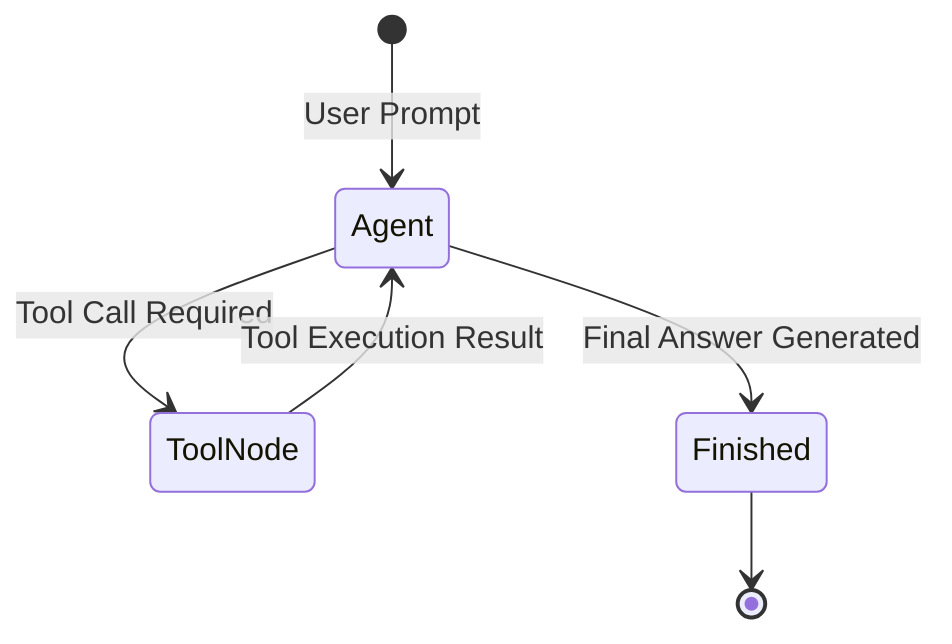

# 📹 This AI Agent Plans, Researches & Writes Blogs Automatically using LangGraph ｜ Agentic AI Project

<div className="video-card" style={{border: '1px solid #30363d', borderRadius: '8px', padding: '16px', marginBottom: '24px', background: 'rgba(56, 139, 253, 0.05)'}}>
  <div style={{display: 'flex', gap: '16px', flexWrap: 'wrap'}}>
    <div><strong>Instructor:</strong> Nitish Singh (CampusX)</div>
    <div><strong>Duration:</strong> 80m 4s</div>
    <div><strong>Playlist:</strong> Agentic AI with LangGraph (CampusX)</div>
    <div><strong>Watch Link:</strong> <a href="https://www.youtube.com/watch?v=Ou_v9lk0rxg" target="_blank" rel="noopener noreferrer">YouTube Lecture ↗</a></div>
  </div>
</div>

## 📌 Executive Summary & Learning Objectives

This lecture covers **This AI Agent Plans, Researches & Writes Blogs Automatically using LangGraph ｜ Agentic AI Project**, focusing on production implementations, edge cases, and industry standards:
- Core intuition, architecture, and underlying mechanisms.
- Key differences between theoretical research implementations and scalable enterprise patterns.
- Concrete Python walkthroughs, error recovery, and performance optimization.

---

## 🏗️ Architecture & Conceptual Workflow



---

## 📖 Core Concepts & Technical Deep Dive

### 1. Architectural Foundations
In modern production AI engineering, **This AI Agent Plans, Researches & Writes Blogs Automatically using LangGraph ｜ Agentic AI Project** is essential for ensuring reliability, low latency, and deterministic outcomes. As AI systems evolve from naive prompt-in / completion-out scripts into distributed systems, engineers must handle:
- **State management & consistency:** Ensuring intermediate states and tool invocations are tracked.
- **Error boundaries & recovery:** Graceful degradation when external LLMs or vector stores encounter rate limits or network partitions.
- **Resource utilization & cost efficiency:** Caching common queries and reducing unnecessary foundation model token expenditure.

### 2. Operational Considerations
- **Latency Optimization:** Pre-computing embeddings, utilizing asynchronous non-blocking event loops, and streaming tokens via Server-Sent Events (SSE).
- **Security & Sandboxing:** Validating inputs before ingestion, sanitizing LLM outputs, and isolating tool execution environments.

---

## 💻 Production Implementation Walkthrough

```python
from typing import TypedDict, Annotated, List
from langgraph.graph import StateGraph, END
import operator

# 1. Define State Schema
class AgentState(TypedDict):
    messages: Annotated[List[str], operator.add]
    next_step: str

# 2. Define Node Functions
def analyze_input(state: AgentState):
    print("Analyzing query...")
    return {"messages": ["Query analyzed."], "next_step": "generate"}

def generate_response(state: AgentState):
    print("Generating response...")
    return {"messages": ["Final response generated."], "next_step": "end"}

# 3. Build StateGraph
workflow = StateGraph(AgentState)
workflow.add_node("analyze", analyze_input)
workflow.add_node("generate", generate_response)

workflow.set_entry_point("analyze")
workflow.add_edge("analyze", "generate")
workflow.add_edge("generate", END)

app = workflow.compile()
output = app.invoke({"messages": ["Hello Agent"], "next_step": ""})
print(output)
```

---

## 💡 Production Best Practices & Tips

:::tip Production Deployment Guideline
When deploying This AI Agent Plans, Researches & Writes Blogs Automatically using LangGraph ｜ Agentic AI Project in enterprise environments, always configure automated retries with exponential backoff and telemetry tracing (such as OpenTelemetry or LangSmith).
:::

:::warning Common Failure Modes
Watch out for state contamination across concurrent requests. Ensure each session or user interaction uses an isolated thread ID or execution context.
:::

---

## 🎯 Key Takeaways & Quick Reference

| Dimension | Production Standard | Pitfall to Avoid |
| :--- | :--- | :--- |
| **Execution** | Async / Non-blocking with timeouts | Synchronous blocking calls in event loops |
| **Data Validation** | Strict Pydantic v2 schemas | Untyped dictionary access |
| **Monitoring** | Distributed tracing & latency percentiles | Relying only on standard console logs |

## ⏱️ Lecture Timeline & Key Topics

| Timestamp | Key Topic / Concept Discussed |
| :--- | :--- |
| **00:00:00** | हाय गाइज़, माय नेम इज नितेश एंड यू आर... |
| **00:18:43** | है और हमारे पास वर्कर नोट्स होंगे जो... |
| **00:38:43** | ऑफ चैट जीपीटी फ्रॉम... |
| **00:58:52** | फ्रंट आपको एक चीज देखने को मिल जाएगी कि... |
| **01:20:02** | नेक्स्ट वीडियो में। बाय।... |


---

---

## 📜 Complete Lecture Transcript (English)

> **Language:** English | **Source:** `26 - This AI Agent Plans, Researches & Writes Blogs Automatically using LangGraph ｜ Agentic AI Project.hi.srt` | **Total Segments:** 41 | **Word Count:** ~14,161 words

<details>
<summary><b>Click to expand full chronological transcript (41 timestamped intervals)</b></summary>

#### ⏱️ [00:00 ➔ 00:02]

हाय गाइज़, माय नेम इज नितेश एंड यू आर वेलकम टू माय YouTube चैनल। इस वीडियो में भी हम लोग अपना लैंडग्राफ प्लेलिस्ट कंटिन्यू करेंगे। और आज का वीडियो बहुत इंटरेस्टिंग है बिकॉज़ आज के वीडियो में हम एक प्रॉपर एआई एजेंट बनाने जा रहे हैं। और जो एआई एजेंट हम बनाने जा रहे हैं वो एक तरह का प्लानिंग एजेंट होने वाला है। अब आई गेस आपके दिमाग में क्वेश्चन आ रहा होगा कि प्लानिंग एजेंट क्या होता है? तो मैंने यहां पे एक डेफिनेशन लिखा है। एक बार पहले इसको गो थ्रू करते हैं। यहां लिखा हुआ है अ प्लानिंग एजेंट इज एन एआई एजेंट दैट डज़ नॉट इमीडिएटली जंप टू आंसर और एक्ट। इंस्टेड इट फर्स्ट क्रिएट्स अ स्ट्रक्चरर्ड प्लान ऑफ व्हाट नीड्स टू बी डन एंड देन एग्जीक्यूट्स दैट प्लान स्टेप बाय स्टेप। सो अभी तक हमने जो भी वर्क फ्लोस या एजेंट्स बिल्ड किए हैं इस प्ले प्लेलिस्ट में वहां पे आपने नोटिस किया होगा कि हमने जो भी कोड लिखा है उसमें ऐसा होता है कि आप जैसे ही एक टास्क देते हो अपने एलएलएम को आपका एलएलएम उसको डायरेक्टली करना स्टार्ट कर देता है। फॉर एग्जांपल पास्ट में हमने एक वर्क फ्लो बनाया था जहां पे हम यूपीएससी में लिखे हुए एस्स को इवैल्यूएट करवा रहे थे एलएलएम से। अब अगर आप ध्यान दो वहां पर क्या हो रहा था कि आप जैसे ही अपना एस्स प्रोवाइड कर रहे थे और बोल रहे थे कि इसको इवैल्यूएट करो आपका एलएलएम डायरेक्टली उसको इवैलुएट करना स्टार्ट कर दे रहा था। मतलब वो अपने टास्क पे डायरेक्टली जंप कर जा रहा था। बट देयर आर सर्टेन टास्क जहां पे डायरेक्टली काम करना स्टार्ट करने के पहले प्लानिंग रिक्वायर्ड होती है। फॉर एग्जांपल आप एक वेबसाइट बना रहे हो और वेबसाइट में आप क्या बना रहे हो? आप एक एक्सपेंस ट्रैकर एप्लीकेशन बना रहे हो। ठीक है? तो अगर यह पर्टिकुलर टास्क मैं अपने एआई एजेंट को दूं कि तुमको एक वेबसाइट बनानी है और उस वेबसाइट में एक्सपेंस ट्रैकिंग का काम होगा। तो अगर मेरा एजेंट डायरेक्टली कोड करना स्टार्ट कर दे तो देयर इज़ अ गुड चांस कि जो आउटकम निकल के आएगा उसमें कुछ ना कुछ प्रॉब्लम होगी। वर्सेस सेकंड ऑप्शन ये है कि पहले मेरा एआई एजेंट प्लान करें। वो टास्क को समझे और उसके हिसाब से एक प्लान बनाए और फिर जब

#### ⏱️ [00:02 ➔ 00:04]

एक बार प्लान बन जाए तो फिर अपने प्लान को वो स्टेप बाय स्टेप एग्जीक्यूट करें। तो सोच के देखो कौन सा तरीका आपको ज्यादा बेटर लग रहा है इस तरह के कॉम्प्लेक्स टास्क के लिए। से डायरेक्टली काम करना स्टार्ट कर दो या फिर पहले प्लान बनाओ फिर उसको एग्जीक्यूट करो। यही होते हैं प्लानिंग एजेंट्स। प्लानिंग एजेंट्स दो फज़ में काम करते हैं। जैसे यहां पे लिखा हुआ है। जैसे ही आप उसको एक टास्क देते हो तो फज़ वन में आपका एजेंट एक प्लान बनाता है। ठीक है? तो प्लान बनाने के दौरान वो क्या करता है? वो टास्क को ब्रेकडाउन करता है इंटू सबटास्क्स। और फिर फेज टू में वो उन सारे के सारे सबटास्क्स को एग्जीक्यूट करता है। तो आज हम ऐसा ही एक एजेंट बनाने जा रहे हैं। और इस पूरी चीज को और अच्छे से समझाने के लिए मैंने एक छोटा सा यूज़ केस लिया है। छोटा तो नहीं है। इट्स अ गुड यूज़ केस। हम एक ब्लॉग राइटिंग एजेंट बनाने वाले हैं जिसका काम बहुत सिंपल है। आप उसको एक टॉपिक दोगे और वो एजेंट आपके लिए उस टॉपिक के ऊपर एक डिटेल्ड ब्लॉग बना के देगा। अब अगर आप सोच के देखो तो ये टास्क एक ऐसा टास्क है जहां पे प्लानिंग रिक्वायर्ड है। अगर मैं डायरेक्टली बोलूं कि मुझे लेट्स से ट्रांसफार्मर आर्किटेक्चर के ऊपर ब्लॉक चाहिए और मेरा एजेंट डायरेक्टली लिखना स्टार्ट कर दे तो देयर इज़ अ गुड चांस कि वो कुछ चीजें मिस कर दे। वर्सेस अगर मेरा एजेंट पहले एक टास्क को समझे उसके अराउंड प्लानिंग बनाए और फिर उस प्लान को एग्जीक्यूट करे तो देयर इज़ अ गुड चांस कि मेरे को ज्यादा अच्छा ब्लॉग देखने को मिलेगा। दैट इज व्हाई मैंने ये पर्टिकुलर यूज़ केस चूज़ किया है। और अच्छी बात ये है कि ये पूरा चीज मैंने बना भी लिया है। तो मैं आपको पहले एक बार डेमो दिखाता हूं। सो दैट आप थोड़ा सा मोटिवेटेड फील करो। फिर मैं आपके साथ डिस्कस करूंगा कि हम ये पूरा टास्क कैसे एग्जीक्यूट करने वाले हैं। सो दिस इज़ आवर एजेंट गाइज़। ये जो आपको स्क्रीन पे भी दिखाई दे रहा है। ये हमारा एजेंट एप्लीकेशन है। और मैं क्या करता हूं मैं आपको एक बार इसका डेमो दिखाता हूं। सो यहां पे लेफ्ट साइड में आप अपने ब्लॉग का टॉपिक दे सकते हो। लेट्स से फिलहाल हम एक ब्लॉग चाहते हैं ऑन द टॉपिक ऑफ सेल्फ

#### ⏱️ [00:04 ➔ 00:06]

अटेंशन। ठीक है? तो यहां पर आप सिर्फ टॉपिक का नाम भी लिख सकते हो या फिर आप थोड़ा सा डिस्क्रिप्शन भी दे सकते हो कि मुझे सेल्फ अटेंशन में इस- इस तरह की चीजों के ऊपर ब्लॉग चाहिए। ठीक है? उसके बाद आप क्लिक करते हो जनरेट ब्लॉक के ऊपर और जनरेट ब्लॉक पे आप जैसे ही क्लिक करते हो, आपका एजेंट ट्रिगर हो जाता है। और यहां पे इस तरीके से मैंने कोड लिखा है कि आपको आपके एजेंट का प्रोग्रेस दिखाई देता रहेगा। जैसे कि फिलहाल हमारा जो एजेंट है वो हमारे आर्किटेक्चर के राउटर वाले नड पे है। ठीक है? तो राउटर नोड पे मैंने जो भी कोड लिखा है वो एग्जीक्यूट होगा। फिर सिमिलरली अगले नड पे जाएगा। उसके अगले नड पे जाएगा। ये मैंने रखा है। सो दैट मुझे पता चले कि मेरा जो एजेंट है वो सही से काम कर रहा है। एक बार जब उसका काम करना खत्म हो जाता है तो मैं आपको दो चीजें दिखाऊंगा। पहला मैं आपको दिखाऊंगा कि एजेंट ने एग्जैक्टली क्या प्लान बनाया था। ठीक है? और सेकंड मैं आपको दिखाऊंगा जो एग्जैक्ट ब्लॉग हमारे एजेंट ने क्रिएट किया है। थोड़ा सा टाइम लगता है इस पूरी की पूरी चीज में। यू कैन सी अब वो अगले नोड पे बढ़ गया है। दैट इज द रिसर्च नोड। सिमिलरली फिर वो अगले नोड पे जाएगा और ऐसे करते-करते वो अपना पूरा वर्क फ्लो एग्जीक्यूट करेगा। सो आई वास सेइंग कि थोड़ा सा यहां पे टाइम लगता है बिकॉज़ आप एक प्रॉपर बड़ा ब्लॉग लिख रहे हो। और मैंने आपको बताया नहीं अभी तक बट इसमें दो बहुत अच्छे फीचर्स मैंने ऐड किए हैं। पहला फीचर इसमें है कि ये रिसर्च कर सकता है। ऑनलाइन जाकर के जब भी इसको जरूरत पड़ेगी जाकर के ऑनलाइन नॉलेज सोर्स से चीजें ला सकता है। जैसे कोई भी रिसर्च असिस्टेंट करता है। सेकंड इसमें मैंने इमेजेस ऐड करने का भी फीचर ऐड किया है। तो आपका ब्लॉग सिर्फ टेक्स्ट ना हो के जहां पे भी इमेज रिक्वायर्ड होगी ऑटोमेटिकली इमेज भी जनरेट होगा और वो इमेज ऑटोमेटिकली ब्लॉग के अंदर आ भी जाएगा। ठीक है? तो एक फुल्ली कंप्लीट ब्लॉग आपको देखने को मिलेगा। तो व्हाट आई विल डू इज़ आई विल वेट फॉर सम टाइम। एक बार इसको हम एग्जीक्यूट होने देते हैं और इसका रिजल्ट मैं आपको दिखाता हूं। यू कैन ऑलरेडी सी प्रोग्रेस हो रहा है। हम राउटर नोड का काम कंप्लीट कर चुके हैं। रिसर्च नोड का काम हो गया है। ऑर्केस्ट्रेटर नोड का काम हो गया।

#### ⏱️ [00:06 ➔ 00:08]

ऑर्केस्टेटर नोड इज़ द प्लानिंग नोड। उसके बाद वर्कर नोट अपना काम करना स्टार्ट कर चुका है। वर्कर नोट इज द मेन नड जहां पे ब्लॉग राइटिंग का काम चल रहा है। ठीक है? तो आई विल वेट और एक बार जब ये पूरी चीज खत्म हो जाती है। ये पूरा एग्जीक्यूशन खत्म हो जाता है। फिर मैं आपको दिखाता हूं कि आउटपुट कैसा है। एंड यू कैन सी गाइस हमारा जो एजेंट है उसने अपना एग्जीक्यूशन कंप्लीट कर लिया। अब मैं आपको दिखाता हूं कि हमारे एजेंट ने प्लानिंग कैसे किया। तो यहां पे देखो सबसे पहले टैब में यहां पे प्लान हमें दिखाया जा रहा है। सबसे पहले प्लान के हिसाब से एजेंट ने ये टाइटल डिसाइड किया खुद से। उसने ऑडियंस भी खुद से सेलेक्ट किया। हालांकि आप चाहो तो आप अपने हिसाब से ऑडियंस बता सकते हो प्र्प में। टोन भी उसने खुद से डिसाइड किया और ब्लॉग का काइंड भी उसने खुद से डिफाइन किया। बट ये सारी चीजें आप प्र्ट में दे सकते हो। उसके बाद ये रहा आपका प्लान। उसने पूरे के पूरे ब्लॉग को सेवन सेक्शंस में डिवाइड किया। पहला सेक्शन है इंट्रोडक्शन टू सेल्फ अटेंशन। उसके बाद हाउ सेल्फ अटेंशन वर्क्स। उसके बाद स्टेप बाय स्टेप एग्जांपल ऑफ सेल्फ अटेंशन। व्हाई सेल्फ अटेंशन इज पावरफुल फॉर सीक्वेंस मॉडलिंग। सेल्फ अटेंशन इन पॉपुलर आर्किटेक्चर्स, कॉमन चैलेंजेस एंड कंक्लूजन। उसने खुद से यह ब्रेकडाउन किया। नॉट ओनली दैट उसने यह भी डिसाइड किया कि उसको हर सेक्शन को कितने टारगेट वर्ड्स देने हैं। हर सेक्शन को उसने कुछ टैग्स असाइन किए। और साथ ही साथ उसने ये भी डिसीजन लिया कि हर सेक्शन को क्या रिसर्च की जरूरत है, क्या साइटेशन की जरूरत है, क्या कोड की जरूरत है। ठीक है? तो फिलहाल हमने ऐसा टॉपिक चूज़ किया था जहां पे उतना रिसर्च नहीं चाहिए। बिकॉज़ ये एक ऐसा टॉपिक है जिसके बारे में ऑलरेडी एलएलएम्स को खुद से पता है। उनको बाहर जाके रिसर्च करने की जरूरत नहीं है। तो, यह पूरा प्लानिंग स्टेज है। अब मैं आपको दिखाता हूं हमारा ब्लॉग जो बन के आया। सो, दिस इज द ब्लॉग। इंट्रोडक्शन टू सेल्फ अटेंशन। हाउ सेल्फ अटेंशन वर्क्स। दीज़ आर द की कंपोनेंट्स। उसके बाद यह देखो सबसे इंटरेस्टिंग चीज ऑटोमेटिकली इमेजेस भी जनरेट हुए हैं टेक्स्ट के बेसिस पे। तो दिस इज़ वन इमेज। फिर यहां पे स्टेप बाय स्टेप एग्जांपल ऑफ़ सेल्फ अटेंशन कंप्यूटेशन है। इसमें अगर आप

#### ⏱️ [00:08 ➔ 00:10]

नीचे जाओ तो ये देखो कितने प्यार से पूरे के पूरे कैलकुलेशन को इमेज में कन्वर्ट कर दिया गया है। ये देखो। उसके बाद व्हाई सेल्फ अटेंशन इज़ पावरफुल फॉर सीक्वेंस मॉडलिंग। फिर एक और इमेज यहां पर जनरेट हुआ है। एंड फाइनली कॉमन चैलेंजेस एंड कंक्लूजन। और मजेदार चीज क्या है कि आप चाहो तो इस ब्लॉग को डाउनलोड कर सकते हो विद द इमेज। ठीक है? इसके अलावा और भी चीजें आपको यहां पे देखने को मिलेंगी। जैसे कि आप अगर एविडेंस टैब में जाओगे तो यहां पे आपको साइटेशंस दिखाई देंगे। फिलहाल इस ब्लॉग में कोई साइटेशंस नहीं है। तो यहां पर कुछ भी नहीं दिखाई दे रहा है। बट अगर आप कोई ऐसा टॉपिक चूज़ करो जिसमें रिसर्च की जरूरत है। फॉर एग्जांपल आपने सर्च किया अ टॉप एआई न्यूज़ फॉर दिस वीक। तो यहां पे एलएलएम जाके सर्च करेगा ऑनलाइन और रिजल्ट्स को लेके आएगा। तो इन दैट केस वो सारा एविडेंस यहां पे दिखाई देगा। सारे साइटेशंस सारे लिंक्स यहां पे दिखाई देंगे। सिमिलरली देयर इज़ अ लॉग टैब जहां पे बिहाइंड द सीन जो भी एजेंट डिसीजन मेकिंग कर रहा था वो सब यहां पे लॉग हो रहा है। ठीक है? और देयर इज़ आल्सो अ इमेजेस टैब जहां पे जितने भी इमेजेस जनरेट हुए हैं उनका लिस्टिंग दिया हुआ है। ठीक है? तो दिस इज अ कंप्लीट ब्लॉग राइटिंग एजेंट। इनफैक्ट मजेदार चीज क्या है कि पास्ट में आपने इस एजेंट को यूज़ करके जितने ब्लॉग्स लिखवाए हैं, आप उनको भी कभी भी देख सकते हो वापस। फॉर एग्जांपल यू कैन सी मैंने इतने सारे ब्लॉग्स अभी तक लिखवाए हैं। मैं आपको दिखाता हूं लेट्स से ये वाला ब्लॉग। ओपन सोर्स वर्सेस प्रोपराइटरी एलएलएम्स। यह वाला ब्लॉग थोड़ा इंटरेस्टिंग है। तो, यह वाला ब्लॉग मैं आपको दिखाता हूं। यह देखो। यह रहा वह ब्लॉग जो हमने थोड़ा पहले जनरेट करवाया था। तो ओपन सोर्स वर्सेस प्रोपराइटरी एलएलएमएम्स के ऊपर है। इसमें भी यू कैन सी इमेज हैं। बट साथ ही साथ अगर आप देखो तो यहां पे आपको साइटेशंस भी दिख रहे हैं। अगर आप इस सोर्स पे क्लिक करो तो वो लिंक्स ओपन हो जाएंगे जिनको यूज़ किया गया है इस ब्लॉग को लिखने के दौरान। ठीक है? इनोवेशन ट्रेंड शेपिंग ओपन सोर्स एलएलएम्स अगेन यहां पे सोर्सेस आपको दिखाई देंगे। एंड मजेदार चीज क्या है कि हेलुसिनेशन

#### ⏱️ [00:10 ➔ 00:12]

बहुत कम है। बिकॉज़ हमने इस सिस्टम को बनाने के लिए रीसेंट वाले ओपन एआई एलएलएम्स को यूज़ किया है। अ यू कैन सी बहुत प्यारे इमेजेस भी जनरेट हो रहे हैं। इमेजेस के लिए मैंने जेमिनाई यूज़ किया है। दैट इज़ व्हाई इमेजेस आपको इतने अच्छे दिखाई दे रहे हैं। सो या इन शॉर्ट दिस इज़ द प्रोजेक्ट। दिस इज़ द एजेंट दैट वी आर गोइंग टू बिल्ड इन दिस वीडियो। आई रियली होप इसको देख के आपको बहुत अच्छा फील हो रहा होगा, मोटिवेशन फील हो रहा होगा कि हम भी यह सिस्टम बनाएं अपने लैपटॉप पे। तो या दिस इज द टास्क अ जो हम एग्जीक्यूट करेंगे इस वीडियो में। तो नाउ दैट यू नो ये सिस्टम काम कैसे करता है। अब मैं आपको बताता हूं कि हम स्टेप बाय स्टेप इसको बिल्ड कैसे करेंगे। ठीक है? अब गाइज़ हम इस प्रोजेक्ट को कैसे बिल्ड करेंगे। ये समझने के लिए एक बार मैं आपको पहले इस प्रोजेक्ट का आर्किटेक्चर दिखाता हूं। ठीक है? तो ये जो आपको दिखाई दे रहा है ये हमारे प्रोजेक्ट का आर्किटेक्चर है। दिस इज द एक्चुअल ग्राफ जो हम लैंडग्राफ में बिल्ड करेंगे जिसकी वजह से ये पूरा सिस्टम काम करेगा। ठीक है? तो पहले एक बार मैं आपको इसका क्विक ओवरव्यू देता हूं। सो होगा क्या कि ये स्टार्ट नोड पे हमें हमारा टॉपिक मिलेगा। फॉर एग्जांपल हमारा टॉपिक इज़ सेल्फ अटेंशन। अब ये टॉपिक सबसे पहले जाएगा राउटर नोड के पास। अब राउटर नोड का एक बहुत स्पेसिफिक काम है। राउटर नोड का काम यह है कि राउटर नोड हमें यह बताता है कि गिवन टॉपिक के लिए हमें इंटरनेट पर जाकर रिसर्च करने की जरूरत है या नहीं। दैट्स इट। सो अगर टॉपिक कन्वेंशनल सा है जैसे कि सेल्फ अटेंशन या ट्रांसफार्मर आर्किटेक्चर जिसके बारे में जो भी नॉलेज हमें चाहिए है वो ऑलरेडी हमारे एलएलएम के पास है तो हमें रिसर्च की जरूरत नहीं है। बट अगर टॉपिक ऐसा है जो रीसेंट चीजों के ऊपर डिपेंड करता है तो फिर हमें रिसर्च की जरूरत पड़ती है। फॉर एग्जांपल अगर टॉपिक है टॉप एआई न्यूज़ ऑफ जनवरी 2026 तो अब ये ऐसा टॉपिक है जिसके लिए जो नॉलेज हमें चाहिए वो सब कुछ एलएलएम के अंदर नहीं

#### ⏱️ [00:12 ➔ 00:14]

मिलेगा। हमें इसके लिए इंटरनेट पे जाकर सर्च करना पड़ेगा। तो ये राउटर का सिंपल काम होता है ये पता करना कि जो टॉपिक हमें दिया गया है उसको इंटरनेट रिसर्च की जरूरत है या नहीं। ठीक है? सो अगर आप देखो तो थोड़ी देर पहले जो डेमो मैंने आपको दिखाया था उस डेमो में जैसे ही आप टॉपिक इंसर्ट करते हो तो वहां पे एक नीड्स रिसर्च बोल के की है। इसका वैल्यू ट्रू या फॉल्स सेट हो जाता है। जैसे फिलहाल मैंने अभी एक ब्लॉग लिखवाया द इवॉल्यूशन ऑफ़ चार्ट जीपीटी फ्रॉम 2022 टू 2026। तो ये एक ऐसा टॉपिक है जहां पे इंटरनेट पे जाके सर्च करने की जरूरत पड़ सकती है फॉर द रीसेंट डेवलपमेंट्स। दैट इज व्हाई यहां पे नीड रिसर्च ट्रू आ गया। ठीक है? तो राउटर ने यहां पे बोल दिया यस। तो अब हम आ गए इस नोड के ऊपर वि इज द रिसर्च नोड। अब रिसर्च नोड क्या करता है? रिसर्च नोड आपके टॉपिक को लेता है और वो उसको ब्रेकडाउन कर देता है इंटू सम रिसर्च पॉइंटर्स कि अगर मुझे इंटरनेट पे जाके सर्च करने की जरूरत है तो वो सर्चेस क्या हो सकते हैं? जैसे कि हमारे गिवन टॉपिक के लिए कि चार्ट जीपीटी का डेवलपमेंट कैसे हुआ 2022 से 2026 तक? दीज़ आर द सर्चेस जो हमारा सिस्टम परफॉर्म करेगा। जैसे कि चैट जीपीटी वर्जन रिलीजेस एंड अपडेट्स फ्रॉम 2022 टू 2026। न्यू फीचर्स क्या-क्या आए हैं? परफॉर्मेंस इंप्रूवमेंट्स क्या-क्या आए हैं? चेंजेस इन चैट जीपीटी यूसेज पैटर्न्स एंड एप्लीकेशनेशंस, ओपन एआई अनाउंसमेंट्स अबाउट चैट जीपीटी। वी कैन सी कि ये जो रिसर्च नोड है, ये बेसिकली सर्चेस प्लान कर रहा है कि इंटरनेट पे जाके हमें क्या-क्या सर्च करना चाहिए। एक बार जैसे ही आप ये सारे सर्चेस कंडक्ट करते हो बाय द वे ये सर्चेस कंडक्ट करने के लिए हम लोग टैवली यूज़ करेंगे। टैवली इज़ लाइक अ सर्च इंजन फॉर एलएलएम्स। अब टैवली पे जाकर के हम ये सारा डेटा लेके आते हैं और वो सारा डेटा हम देते हैं ऑर्केस्ट्रेटर नोड को। और हमारा ऑर्केस्ट्रेटर नोड ही हमारा प्लानर नोड है। इसी का काम होता है ब्लॉग

#### ⏱️ [00:14 ➔ 00:16]

जनरेट करना। ब्लॉग के लिए प्लान जनरेट करना। आई एम सॉरी। तो अब ये जो नोड है आपका प्लानर नोड ये आपके लिए प्लान जनरेट कर रहा है और प्लान इज बेसिकली कि आपके ब्लॉग में क्या-क्या सेक्शंस होंगे। तो बेस्ड ऑन अपना नॉलेज एंड बेस्ड ऑन जो भी रिसर्च से आया उसके बेसिस पे हमारा जो प्लानर नोड है वो एक प्लान जनरेट करता है। प्लान जनरेट करने का मतलब सेक्शंस डिसाइड करता है और ये भी डिसाइड करता है कि हर सेक्शन में कितने वर्ड्स होने चाहिए। साथ ही साथ वो ये भी डिसाइड करता है कि हर सेक्शन को रिसर्च की जरूरत है या नहीं, साइटेशंस की जरूरत है या नहीं, कोड की जरूरत है या नहीं। ठीक है? तो ये काम हो गया आपके प्लानिंग नड का। अगर आपके पास ऐसा कोई टाइमलेस टॉपिक है जैसे कि सेल्फ अटेंशन जिसको रिसर्च की जरूरत नहीं है तो वो इस पाथ से डायरेक्टली आ जाएगा प्लानर नोड के पास और फिर उसके हिसाब से प्लानिंग हो जाएगी। अगेन उसके हिसाब से सेक् सेशंस बन जाएंगे। तो अभी तक का आपको आई गेस फ्लो समझ में आ रहा है। टॉपिक दिया गया डिसाइड किया गया कि इसको रिसर्च की जरूरत है या नहीं। अगर रिसर्च की जरूरत है तो रिसर्च कंडक्ट किया गया विद द हेल्प ऑफ टैवली और रिसर्च के रिजल्ट्स को प्लानर नोड को दे दिया गया। अगर रिसर्च की जरूरत नहीं है तो आप डायरेक्टली प्लानिंग नोड पे आए और प्लानिंग नड ने अपना काम कर दिया। तो इस स्टेज पे हमारे पास हमारा प्लान है। प्लान है एज इन हमारे ब्लॉग में कौन-कौन से सेक्शंस हैं ये इंफॉर्मेशन आ चुका है। इसके बाद आता है सबसे इंपॉर्टेंट स्टेप जो कि है वर्कर नोड। वर्कर नोड वो नोड है जो हमारे लिए ब्लॉग राइटिंग का काम करता है। सो इस एग्जांपल में अगर आप देखो तो नाइन सेक्शंस हैं। तो होगा क्या कि ऑटोमेटिकली यहां पे नाइन वर्कर्स ट्रिगर हो जाएंगे। फिलहाल आपको एक ही दिख रहा है। बट डिपेंडिंग ऑन आपके प्लान में कितने स्टेप्स हैं या आपके ब्लॉग में कितने सेक्शंस हैं उतने वर्कर नोट्स आ जाएंगे। वर्कर वन आपके फर्स्ट सेक्शन के ऊपर काम करना स्टार्ट कर देगा। वर्कर टू सेकंड सेक्शन के ऊपर, वर्कर थ्री, थर्ड सेक्शन के ऊपर एंड सो ऑन। और ये सब लोग पैरेलली काम करेंगे। ठीक है? तो होगा क्या? थोड़ी

#### ⏱️ [00:16 ➔ 00:18]

देर के बाद आपके सारे सेक्शंस पैरेलल में कंप्लीट हो जाएंगे। तो हर वर्कर नोट आपको अपना-अपना सेक्शन कंप्लीट करके देगा। ठीक है? उसके बाद आता है रिड्यूसर नोड। रिड्यूसर नोड के दो काम हैं। पहला काम है कि वो सारे सेक्शंस को उठा के स्टिच करता है। स्टिच करता है, जोड़ता है। ठीक है? दिस इज़ द फर्स्ट टास्क। सेकंड टास्क क्या है? कि वो एक एलएलएम को पूरा का पूरा कंबाइंड ब्लॉग भेजता है और उससे पूछता है कि इस पूरे ब्लॉग में आपको कहां-कहां पे लग रहा है? इमेज डालने की जरूरत है। और फिर वो इमेजेस जनरेट करता है और उन इमेजेस को उन जगहों पर प्लेस करता है। तो रिड्यूसर का दो काम है सारे सेक्शंस को स्टिच करना और उसमें जहां भी जरूरत है वहां पे इमेज ऐड करना। तो दिस इज द आर्किटेक्चर ऑफ दिस एंटायर थिंग। ठीक है? टॉपिक मिला, रिसर्च हुआ, प्लान बना, प्लान से अ वर्कर नोड के पास प्लान गया और सारे वर्कर नोट्स पैरेलल में सेक्शंस लिखने लग गए। उसके बाद रिड्यूसर नोड आया। उसने सारे सेक्शंस को जोड़ा और उसमें इमेजज़ इंटीग्रेट किए। ठीक है? तो दिस इज़ द आर्किटेक्चर ऑफ़ आवर ब्लॉग राइटिंग एजेंट। अब यही हमें डेवलप करना है। तो हम लोग इसको स्टेप बाय स्टेप डेवलप करेंगे फोर अ स्टेजेस में। ठीक है? तो हम लोग सबसे पहले स्टेज में क्या करेंगे? एकदम बेसिक ब्लॉग राइटिंग एजेंट बनाएंगे। इस ब्लॉग राइटिंग एजेंट में ना तो रिसर्च का फैसिलिटी होगा, ना ही इमेजज़ का फैसिलिटी होगा। ये सिंपल टेक्चुअल ब्लॉग जनरेट करेगा। ठीक है? स्टेप टू में हम क्या करेंगे? हम इस बेसिक एप्लीकेशन में रिसर्च का फीचर ऐड करेंगे। मतलब इंटरनेट पे जाके आप सर्च कर पाओगे और इंफॉर्मेशन ला पाओगे और उस इंफॉर्मेशनेशन को अपने ब्लॉग में डाल पाओगे। फिर स्टेज थ्री में हम क्या करेंगे? हम इसमें इमेज ऐड करने का फीचर डालेंगे। ठीक है? तो

#### ⏱️ [00:18 ➔ 00:20]

हमारा ब्लॉग बन गया। उसमें इमेज कैसे डालना है वो मैं आपको बताऊंगा। और फाइनली स्टेज फोर में हम इसको जीयूआई में कन्वर्ट करेंगे। तो हम ये चार स्टेजेस में इस पूरे प्रोजेक्ट को डेवलप करेंगे। तो अब गोइंग फॉरवर्ड हमारा सबसे इंपॉर्टेंट जो कंसर्न है जो फोकस है वो होगा हाउ टू बिल्ड अ बेसिक ब्लॉग राइटिंग एजेंट दैट कैन जनरेट स्टैटिक ब्लॉग्स विदाउट रिसर्च विदाउट इमेज। आई होप आपको प्लान ऑफ़ एक्शन समझ में आ गया। तो गाइज़ अब हम बिल्ड करेंगे हमारा स्टेज वन वाला बेसिक ब्लॉग राइटिंग एजेंट। सो पहले मैं आपको इसका आर्किटेक्चर बता देता हूं। आर्किटेक्चर थोड़ा और सिंपल है। सो यहां पर क्या होगा? हमारे पास एक ऑर्केस्ट्रेटर होगा जो कि हमारा प्लानर भी है और हमारे पास वर्कर नोट्स होंगे जो हमारे राइटर नोट्स हैं। सो होगा क्या? यहां पे स्टार्ट में हमें एक टॉपिक दिया जाएगा। मान लो टॉपिक है सेल्फ अटेंशन। यह टॉपिक पहुंचेगा हमारे ऑर्केस्ट्रेटर एज इन प्लानर नोड के पास। अब प्लानर नोड क्या करेगा? उस टॉपिक को देखेगा और उसके अराउंड एक प्लान बनाएगा। अब ये प्लान बनाना थोड़ा ए्बगुस साउंड कर रहा होगा। बट एक्चुअली होगा क्या कि हमारे पास एक प्लान ऑब्जेक्ट होगा व्हिच विल बी अ पाइडेंटिक ऑब्जेक्ट और उसका स्कीमा आपको यहां पे दिखाई दे रहा है। अह सो इस प्लान ऑब्जेक्ट में दो चीजें होंगी। पहला ब्लॉग का टाइटल। दूसरा इसके अंदर सेट ऑफ टास्क्स होंगे। टास्क वन, टास्क टू, टास्क थ्री एक्सट्रा। अब आप सोच रहे होंगे कि यह टास्क क्या है? तो ये टास्क भी खुद टास्क ऑब्जेक्ट्स हैं जो कि अगेन एक पाइडेंटिक मॉडल होगा। और हर टास्क ऑब्जेक्ट ऐसा दिखाई देता है। ये टास्क का स्कीमा है। हर टास्क का खुद का एक आईडी होगा। एक टाइटल होगा और एक डिस्क्रिप्शन होगा कि उस टास्क में करना क्या है। तो बेसिक फंडा ये है कि जैसे ही यह टॉपिक पहुंचेगा ऑर्केस्ट्रेटर के पास

#### ⏱️ [00:20 ➔ 00:22]

ऑर्केस्ट्रेटर क्या करेगा? एक प्लान बना रहा है। प्लान विल हैव वन ब्लॉग टाइटल एंड अ लिस्ट ऑफ टास्क ऑब्जेक्ट्स। हर टास्क ऑब्जेक्ट विल कंटेन इंफॉर्मेशन अबाउट वन सेक्शन ऑफ द ब्लॉग। सो अगर प्लानिंग के दौरान यह डिसाइड हुआ कि हमारे पास हमारे ब्लॉग के अंदर पांच सेक्शंस होंगे तो हर सेक्शन के कॉरेस्पोंडिंग एक टास्क ऑब्जेक्ट बनेगा और हर टास्क ऑब्जेक्ट के अंदर आप टास्क का आईडी उस सेक्शन का टाइटल और उस सेक्शन में एग्जैक्टली क्या डालना है ये ब्रीफ डिस्क्रिप्शन डाल के दोगे। ठीक है? तो अब इस जगह पर हमारे पास हमारा प्लान है। अब वही प्लान हम क्या करेंगे? वर्कर नोड के पास भेजेंगे। अब यहां पर एक मैकेनिज्म हम यूज़ करते हैं जिसको हम बोलते हैं ऑर्कस्ट्रेटर वर्कर फ्लो। इसके हिसाब से क्या होता है कि आपके डायनेमिकली उतने ही वर्कर फैन आउट या ट्रिगर हो जाते हैं जितने आपको चाहिए। ठीक है? फॉर एग्जांपल आपको पांच टास्क्स करने हैं। आपको पांच सेक्शंस लिखने हैं। तो ऑटोमेटिकली यहां पे पांच वर्कर नोड्स बन जाएंगे। और ऑर्केस्ट्रेटर क्या करेगा? हर वर्कर नोड को एक टास्क दे देगा। और उस टास्क में क्या डिस्क्रिप्शन है? कि उस सेक्शन को कैसे लिखना है। ठीक है? फिर क्या होगा? हर वर्कर नोड इंडिपेंडेंटली अपने सेक्शन के ऊपर काम करना शुरू कर देगा। बिकॉज़ हर वर्कर नोड के पास खुद का एलएलएम है। फिर क्या होगा? पैरेलली ये पांचों सेक्शंस रेडी होंगे और पांचों सेशंस के रेडी होने के बाद हम क्या करेंगे? उन पांचों सेक्शंस को स्टिच करेंगे, जोड़ेंगे वि द हेल्प ऑफ रिड्यूसर। रिड्यूसर के यहां पे दो काम है। पहला इट विल स्टिच द फाइव सेक्शंस एंड सेकंड इट विल

#### ⏱️ [00:22 ➔ 00:24]

क्रिएट अ मार्कडाउन फाइल। और यही मार्क डाउन फाइल के अंदर आपको आपका फाइनल ब्लॉग दिखाई देगा। ठीक है? तो दिस इज द आर्किटेक्चर दैट वी आर गोइंग फॉर। तो कोड मैंने ऑलरेडी लिख रखा है। मैं आपको दिखाता हूं। सो यहां पे हमने सारा का सारा इंपोर्ट ले लिया है। यहां पे हमने क्या किया है? इस जगह पे अगर आप देखो तो हमने एक प्लान बोल के पाइडेंटिक मॉडल बनाया है। इसमें दो चीजें हैं। ब्लॉग टाइटल जो कि स्ट्रिंग है और टास्क। टास्क इज़ बेसिकली लिस्ट ऑफ टास्क ऑब्जेक्ट्स। तो अब यह टास्क ऑब्जेक्ट क्या है? वो यहां पर ऊपर डिफाइंड है। तो हर टास्क ऑब्जेक्ट में तीन चीजें होंगी। हर टास्क ऑब्जेक्ट एज इन सेक्शन में तीन चीजें होंगी। आईडी, टाइटल और ब्रीफ डिस्क्रिप्शन कि उसमें क्या कवर करना है उस सेक्शन में। ठीक है? तो हमने ये हमारा पाइडेंटिक मॉडल भी बना दिया। तो हमने ये रन कर दिया। अब इसके बाद मैं आपको दिखाता हूं कि हमारा ये जो लैंग ग्राफ वर्क फ्लो है इसमें स्टेट क्या रहेगा। तो स्टेट में तीनचार चीजें रहेंगी। सबसे पहला रहेगा हमारे पास टॉपिक जो हमें यूज़र से मिलेगा। सेकंड रहेगा प्लान जो हमारा ऑर्केस्ट्रेटर हमें बना के देगा। उसके बाद आएगा सेक्शंस। तो सेक्शंस में बेसिकली आपके पास हर वर्कर नोड का आउटपुट रहेगा। सो यू कैन सी हमारे पास पैरेलली मान लो अगर पांच वर्कर नोड्स काम कर रहे हैं। हर वर्कर नोड एक सेक्शन लिख रहा है। तो अपना-अपना काम करने के बाद ये सारे नड्स आपको एक-एक स्ट्रिंग देंगे। बेसिकली एक-एक पैराग्राफ देंगे। पैराग्राफ या सेट ऑफ पैराग्राफ्स देंगे। तो इन सबको आप कहां पे स्टोर कर रहे हो? इन सबको आप स्टोर कर रहे हो सेक्शंस में। ठीक है? सो दैट इज़ व्हाई दिस इज़ अ लिस्ट ऑफ़ स्ट्रिंग। और आप इनको काइंड ऑफ रिड्यूस कर रहे हो। बिकॉज़ आपको सबको जोड़ना है। सारी जगहों का आउटपुट जो आ रहा है उसको एक जगह पर रखना है। तो यू आर यूजिंग दिस रिड्यूसर फंक्शन ऑपरेटर डॉट

#### ⏱️ [00:24 ➔ 00:26]

ऐड। ये हमने पास्ट में यूज़ कर रखा है इस प्लेलिस्ट में। एंड लास्टली हमारे पास एक फाइनल बोल के वेरिएबल है स्टेट में जिसमें हमारा फाइनल ब्लॉक स्टोर होगा आफ्टर फाइनल मर्जिंग। ठीक है? तो आई होप आपको अभी तक का फ्लो पूरा समझ में आ रहा है। फिर हमने ये चैट बॉट ले लिया। आई एम सॉरी ये एलएलएम ले लिया। चार्ट ओपन नहीं आएगा। जीपीटी 4.1 मिनी। तो एक बार हम इन दोनों को भी चला लेते हैं। उसके बाद आता है हमारा ऑर्कस्ट्रेटर नोड। ठीक है? इट्स वेरी सिंपल। हम क्या कर रहे हैं? हम सबसे पहले हमारा जो एलएलएम है उसमें विद स्ट्रक्चरर्ड आउटपुट फंक्शन को कॉल कर रहे हैं और प्लान ऑब्जेक्ट बता रहे हैं। तो हम बेसिकली अपने इस एलएलएम को फोर्स कर रहे हैं कि इसका आउटपुट शुड ऑलवेज बी अ प्लान ऑब्जेक्ट। और प्लान ऑब्जेक्ट हमने ऊपर डिफाइन कर रखा है। तो जो भी आउटपुट आएगा वो यह पाइडेंटिक ऑब्जेक्ट ही आएगा। अब इसके अंदर हम दो मैसेजेस भेज रहे हैं। पहला हमारा सिस्टम मैसेज है जहां पे हमने लिख रखा है क्रिएट अ ब्लॉग प्लान विद फाइव टू सेवन सेक्शंस ऑन द फॉलोइंग टॉपिक। और टॉपिक कहां दे रहे हैं? उसके ठीक नीचे ह्यूमन मैसेज में जो हमारे स्टेट के टॉपिक में है। जहां पे यूजर ने हमें दिया था। और फिर पलट के हमें एक प्लान मिल रहा है। उस प्लान को हम स्टेट के प्लान के अंदर डाल रहे हैं। ठीक है? है तो बेसिकली ऑर्केस्ट्रेटर वाले नोड को विजिट करने के बाद हमारे पास हमारा प्लान आ चुका होगा व्हिच विल बी स्टर्ड इनसाइड अ प्लान ऑब्जेक्ट। ईच प्लान ऑब्जेक्ट विल हैव मल्टीपल टास्क ऑब्जेक्ट्स। आई होप आपको यहां तक समझ में आ रहा है। तो इसको भी हमने रन कर दिया। अब यहां पर इंटरेस्टिंग चीज शुरू होती है। इंटरेस्टिंग चीज यह है कि ऑर्केस्ट्रेटर से आपको वर्कर के पास जाना है। बट आपको पहले से नहीं पता कि आपके पास कितने वर्कर्स होने वाले हैं। बिकॉज़ ऐसा भी हो सकता है कि प्लान के हिसाब से पांच सेक्शंस हो या प्लान के हिसाब से तीन सेक्शंस हो। तो ये हमें पहले से नहीं पता। तो हमें इंटरमीडिएट यहां पर एक फंक्शन लिखना पड़ता है जिसको हम फैन आउट बुला रहे हैं। इस फैन आउट का काम बहुत सिंपल है। ये सिंपली चेक करेगा कि आपके प्लान ऑब्जेक्ट में कितने टास्क हैं।

#### ⏱️ [00:26 ➔ 00:28]

बेसिकली आपके प्लानर ने ब्लॉग के अंदर कितने सेक्शंस प्लान किए। और फिर क्या करेगा? हर टास्क एज इन हर सेक्शन के लिए वो एक बार वर्कर नड को ट्रिगर करेगा। ठीक है? तो यहां पर लैंग्राफ आपको एक सेंड एपीआई देता है जिसकी हेल्प से आप ये काम कर सकते हो। सो हो क्या रहा है? हम लूप चला रहे हैं स्टेट प्लान डॉट टास्क में। हम पता कर रहे हैं कि हमारे पास कितने टास्क ऑब्जेक्ट्स हैं। एंड फॉर ईच टास्क ऑब्जेक्ट हम सेंड फंक्शन को कॉल कर रहे हैं और हम बोल रहे हैं कि वर्कर नोड को ट्रिगर करो। और वर्कर नोड को ट्रिगर करने के साथ-साथ हम वर्कर नोड को एक पेलोड भी दे रहे हैं। कुछ इंफॉर्मेशन भी दे रहे हैं। और वो इंफॉर्मेशन क्या है? हम हर वर्कर नोट को बता रहे हैं कि तुम्हारा टास्क क्या है और ब्लॉग का टॉपिक क्या है और पूरा का पूरा प्लान भी बता रहे हैं ताकि थोड़ा कोहेरेंट तरीके से वो सेक्शन को लिखे। मतलब हर सेक्शन को पता है कि ओवरऑल प्लान क्या है तो थोड़ा सा वो उसके हिसाब से ब्लॉग को लिखेगा। ठीक है? तो ये एक इंपॉर्टेंट इंटरमीडिएट फंक्शन है। अब बात करते हैं वर्कर फंक्शन की जो मेन लिखने का काम कर रहा है। तो इसको एक पेलोड मिल रहा है। पेलोड में इसको क्या-क्या मिल रहा है? उसका टास्क जो उसको परफॉर्म करना है, ब्लॉग का टॉपिक और ओवरऑल प्लान भी उसको बताया जा रहा है। तो यह तीनों चीजें हम रिसीव कर ले रहे हैं। ठीक है? तो टास्क टॉपिक प्लान हमारे पास है। ब्लॉग का टाइटल हमारे पास आ गया। फिर हमने क्या किया? हमने एलएलएम डॉट इनवोक किया। और यहां पर हमने सिस्टम मैसेज में बोला राइट वन क्लीन मार्क डाउन सेक्शन और ह्यूमन मैसेज में हमने उसको सब कुछ बता दिया कि ब्लॉक का टाइटल ये है। टॉपिक यूजर ने हमें ये दिया था। आपको इस सेक्शन के ऊपर काम करना है और आपको ये डिस्क्रिप्शन देख करके काम करना है। ठीक है? ये दोनों इनेशन टास्क ऑब्जेक्ट के अंदर है। और यहां पे देखो लिखा हुआ है रिटर्न ओनली द सेक्शन कंटेंट इन मार्कडाउन। तो अब क्या होगा? यह जो पर्टिकुलर वर्कर है वह सिर्फ अपना काम करेगा। अपना सेक्शन लिखेगा और उसको इस वेरिएबल में स्टोर कर देगा। और ऐसा हर

#### ⏱️ [00:28 ➔ 00:30]

वर्कर करेगा। जितने भी आपके टास्क ऑब्जेक्ट्स हैं, उतने वर्कर हैं, हर वर्कर अपना-अपना काम करेगा और हम क्या करेंगे? सेक्शंस में भेज देंगे इनसाइड अ लिस्ट। तो सब कुछ रिड्यूस हो के एक लिस्ट में मर्ज हो जाएगा। आई होप आपको समझ में आ रहा है। दिस स्टेप। ये वाला स्टेप परफॉर्म हो जाएगा। ठीक है? तो इसको भी हम लोग रन कर लेते हैं। अब आता है हमारा लास्ट नोड जो कि है रिड्यूसर नोड ये वाला। अब यहां पे देखो हम क्या कर रहे हैं? हम सिंपली टाइटल को उठा रहे हैं जो हमारे पास स्टेट के अंदर प्लान के अंदर है। और हम क्या कर रहे हैं? स्टेट सेक्शंस को जो कि एक लिस्ट ऑफ स्ट्रिंग्स है। उसके ऊपर जॉइन फंक्शन लगा दे रहे हैं। और जॉइन हम किसके ऊपर कर रहे हैं? लाइन चेंज के ऊपर। बेसिकली एक सेक्शन उसके ऊपर लाइन चेंज। उसके नीचे दूसरा सेक्शन। फिर लाइन चेंज उसके नीचे तीसरा सेक्शन ऐसे करके हम इसको एक बड़ा सा स्ट्रिंग बना रहे हैं और उसको इस वेरिएबल में डाल दे रहे हैं बॉडी बोल के और फिर हम यहां पे एक फाइनल स्ट्रिंग बना रहे हैं जहां पे टाइटल है उसके बाद लाइन चेंज है उसके बाद हमारा पूरा का पूरा बॉडी है तो ये हमारा पूरा ब्लॉक फॉर्म हो रहा है और इसके आगे ये हैश टैग लगाया बिकॉज़ हम मार्क डाउन में लिख रहे हैं हैशट टैग का मतलब होता है हेडिंग ठीक है तो टाइटल हेडिंग में आ गया बाकी का पूरा बॉडी नॉर्मल तरीके से हमने लिखा और ये बन गया हमारा फाइनल मार्क डाउन डाउन। उसके आगे का ये जो तीन लाइन का कोड है, इसमें हम सिंपली क्या कर रहे हैं? एक नई फाइल बना रहे हैं। और उस नई फाइल में हम इस स्ट्रिंग को डाल रहे हैं। एंड दिस इज़ द फाइनल रिजल्ट। तो ये बन गया हमारा लास्ट नोड। उसके आगे का कोड बहुत सिंपल है। यहां पे हम अपना ग्राफ क्रिएट कर रहे हैं। ये रहा हमारा ऑर्केस्ट्रेटर नोड, वर्कर नोड, रिड्यूसर नोड। यह हमने बना लिया। उसके बाद उनके बीच में हमने कनेक्शन कर दिया। सो, यह रहा स्टार्ट से ऑर्केस्ट्रेटर का कनेक्शन। उसके बाद एक कंडीशनल एज है बिटवीन ऑर्केस्ट्रेटर एंड फैन आउट जो हमें बता रहा है कि हमें कितने वर्कर क्रिएट करने हैं। और उसके बाद लास्ट में वर्कर और रिड्यूसर के बीच में एक एज है और लास्ट में रिड्यूसर और एंड के बीच में एक एज है।

#### ⏱️ [00:30 ➔ 00:32]

और इसके बाद हमने क्या किया? हमारा ऐप प्रिंट करके देख लिया। ठीक है? तो दिस इज़ द फ्लो। अब बस हमें क्या करना है? इस फ्लो को रन करना है। तो हमने लिखा राइट अ ब्लॉग ऑन सेल्फ अटेंशन। ठीक है? और सेक्शंस को फिलहाल हमने ब्लैंक छोड़ दिया। इसको हम हटा भी सकते हैं वैसे बट ठीक है। इसको हमने रन किया और ये हमारा ब्लॉग कंप्लीट हो गया। लेट्स चेक दिस। सो यू कैन सी यहां पे ये आ गया हमारा ब्लॉग। इसको अगर ओपन करो तो ये रही हमारी मार्कडाउन फाइल। मेरे पास एक एक्सटेंशन है। मैं उसकी हेल्प से आपको दिखाता हूं। आप बेटर देख पाओगे। यह रहा हमारा ब्लॉग जो अभी जनरेट हुआ है। यू कैन सी इसमें आपको दो इंपॉर्टेंट चीजें समझ में आएंगी। पहला यहां पे हमने कोई रिसर्च परफॉर्म नहीं किया है। मतलब हम इंटरनेट से कनेक्टेड नहीं थे। सेकंड देयर इज़ नो इमेज बिकॉज़ हमने इमेज वाला कुछ भी काम नहीं किया है। बट स्टिल आई वुड से अगर आप इसको पढ़ोगे तो इट्स अ डिसेंट काइंड ऑफ़ ब्लॉग। बहुत बढ़िया भी नहीं है बट एकदम फालतू भी नहीं है। तो इट मींस कि हमारा जो बेसिक ब्लॉग राइटिंग एजेंट है वो काम कर रहा है। ठीक है? अब हम क्या करेंगे? इसी को थोड़ा सा इंप्रूव करेंगे। अब रिसर्च कैपेबिलिटी और इमेज ऐड करने की कैपेबिलिटी ऐड करने के पहले हम अपने इस बेसिक से ब्लॉग एजेंट को ना थोड़ा सा इंप्रूव करेंगे। मैं आपको बताता हूं हम क्या इंप्रूवमेंट करेंगे। अभी अगर आप ध्यान दो तो हमारा जो एजेंट है उसका जो प्लानिंग के लिए सिस्टम प्र्ट है वो एक बहुत सिंपल सा प्र्ट है जहां पे हमने सिंपली लिखा है क्रिएट अ ब्लॉग प्लान विद फाइव टू सेवन सेक्शंस ऑन द फॉलोइंग टॉपिक दैट्स इट बस इतना लिख के छोड़ दिया है सिमिलरली हमारा जो वर्कर प्र्प है सिस्टम प्र्प उसमें भी हमने बस लिखा है राइट वन क्लीन मार्क डाउन सेक्शन दैट्स इट दिस इज़ टू बेसिक हमें क्या करना चाहिए कि हमें अपने एजेंट को और अच्छा परफॉर्म करवाने के लिए थोड़ा और इलेबोरेट सिस्टम

#### ⏱️ [00:32 ➔ 00:34]

प्रोंट्स देने चाहिए। तो नेक्स्ट हम वही करेंगे। मैं क्या करने वाला हूं? मैं दो-तीन चेंजेस करने वाला हूं इसके वो कोड में। बहुत मेजर चेंजेस नहीं है। बट ट्रस्ट मी उन चेंजेस से क्या होगा कि आपका ये जो बेसिक लेवल ब्लॉग राइटिंग एजेंट है ये भी और अच्छा परफॉर्म करेगा। ठीक है? देखो सबसे पहला चेंज मैं क्या कर रहा हूं कि मैं जो आपका प्लान ऑब्जेक्ट है जो आपका ऑर्केस्ट्रेटर बनाता है उसमें मैं एक-दो डिटेल्स और ऐड करूंगा। सो एक डिटेल तो ऑलरेडी था ब्लॉक टाइटल और दूसरा था टास्क। इसमें मैं दो और चीजें ऐड कर रहा हूं। ऑडियंस एंड टोन बोल के। ये आप प्रोवाइड कर पाओगे अपने प्र्प के थ्रू। ठीक है? सेकंड ये जो टास्क ऑब्जेक्ट्स हैं जहां पे हर टास्क ऑब्जेक्ट एक सेक्शन में क्या करना है ये बता रहा है। हम उस टास्क ऑब्जेक्ट को भी थोड़ा सा और इबोरेट बनाएंगे। ठीक है? अगर आप कंपेयर करो तो पुराना टास्क ऑब्जेक्ट बस ये था। आईडी टाइटल एंड ब्रीफ। बट यहां पे देखो हम इसमें और डिटेलिंग ऐड कर रहे हैं। आईडी होगा, टाइटल होगा, एक गोल होगा। ठीक है? देखो, वन सेंटेंस डिस्क्राइबिंग व्हाट द रीडर शुड बी एबल टू डू एंड अंडरस्टैंड आफ्टर दिस सेक्शन। उसके बाद हम इसमें कुछ बुलेट्स ऐड करेंगे। ठीक है? थ्री टू फाइव कंक्रीट नॉन ओवरलैपिंग सब पॉइंट्स टू कवर इन दिस सेक्शन। तो बेसिकली हमारा जो ऑर्केस्ट्रेटर है जो प्लान बना रहा है हर सेक्शन के लिए वो यहां पे दो-तीन पॉइंटर्स ऐड करेगा कि इस सब सेक्शन में इस सेक्शन में क्या-क्या पॉइंट्स कवर होने चाहिए। ठीक है? तो थोड़ा और हम डिटेलिंग ऐड कर रहे हैं। साथ ही साथ हमारा जो प्लानर है ऑर्केस्ट्रेटर वो टारगेट वर्ड्स भी डिफाइन करेगा कि हर सेक्शन में कितने टारगेट वर्ड्स होने चाहिए। साथ ही साथ हम एक टाइप भी ऐड कर रहे हैं कि ये सेक्शन इंट्रो होगा या कोर होगा या एग्जांपल्स होगा या चेक लिस्ट होगा। यह कर सकते हो आप। नहीं भी कर सकते हो। आपके ऊपर है। फिलहाल मैंने कर दिया। ठीक है? तो सबसे पहला हमने इंप्रूवमेंट क्या किया कि हमारे जो पाइडेंटिक मॉडल्स हैं उनको हमने थोड़ा सा और इबोरेट बनाया बाय एडिंग मोर डिटेल्स। उसके बाद आगे की चीजें ऑलमोस्ट सेम है। आपका स्टेट बिल्कुल सेम है। आपका एलएलएम बिल्कुल सेम है। डिफरेंस आपको दिखाई देगा ऑर्केस्ट्रेटर के

#### ⏱️ [00:34 ➔ 00:36]

कोड में जहां पे आपने सिस्टम प्र्ट लिखा था। सिस्टम प्र्ट अब देखो एक बहुत ही बड़ा सा इबोरेट सिस्टम प्र्ट है। आप वीडियो को पॉज करके देख सकते हो या फिर डिस्क्रिप्शन में आपको कोड मिल जाएगा। आप वहां से भी रीड आउट कर सकते हो। आपको दिखाई देगा कि बहुत डिटेल में अच्छे से समझाया गया है कि एलएलएम को कैसे प्लान बनाना है। ठीक है? बट आगे का कोड बिल्कुल सेम है। फिर फैन आउट का आपका कोड बिल्कुल सेम है। उसके बाद वर्कर का कोड भी एग्जैक्टली सेम है। बस डिफरेंस कहां पे आता है? यहां पे जो सिस्टम मैसेज है वो बहुत इबोरेट है और हमने हर इंस्ट्रक्शन बहुत केयरफुली दिया है। ठीक है? उसके बाद आगे हमने और ज्यादा डिटेल्स प्रोवाइड किए हैं हर सेक्शन के लिए। बिकॉज़ हमारे पाइडेंटिक मॉडल में अब ज्यादा डिटेल्स हैं। उसके बाद रिड्यूसर का कोड एज़ इट इज़ बिल्कुल सेम है। ग्राफ बनाने का कोड बिल्कुल सेम है। और आगे का कोड भी बिल्कुल सेम है। तो एक काम करते हैं इस पूरे कोड को रन करते हैं और देखते हैं कि जो नया ब्लॉग बन के आ रहा है क्या वो उतना ही अच्छा है या फिर हमने इतनी मेहनत फालतू में की। ठीक है? हमने फिर से क्या किया? सेल्फ अटेंशन के ऊपर ब्लॉग लिखने को बोल दिया। अगेन। ठीक है? तो लेट्स वेट। एंड यू कैन सी यह कोड रन हो गया है। एक बार अगर हम चेक करें तो यह रहा हमारा ब्लॉग। इसको मैं फिर से ओपन करता हूं मेरे प्लगइन के साथ। ठीक है? यह है हमारा करंट वाला ब्लॉग। और यह है हमारा पिछला ब्लॉग। ठीक है? यह पिछला वाला ब्लॉग है। और यह हमने जो करेंटली जनरेट किया। तो यू वुड सी कि आपको ऑलरेडी थोड़ा इंप्रूवमेंट दिखाई देगा। यू कैन सी यहां पर नमई में कोड वगैरह भी करके दिखाया गया है जो पहले अवेलेबल नहीं था। व्हाई स्केल बाय दिस फैक्टर ये सब चीजें पहले नहीं थी। समरी वगैरह ऐड की गई है। फिर देखो पूरा कोड इंप्लीमेंटेशन दिया गया है जो पहले अवेलेबल नहीं था। तो यू कैन सी ऑलरेडी हमारा जो टेक्स्ट आउटपुट है उसका क्वालिटी

#### ⏱️ [00:36 ➔ 00:38]

इंप्रूव कर गया। जस्ट बाय ऐडिंग इबोरेट सिस्टम प्र्ट्स एंड एडिंग अ डिटेल्ड पाइडेंटिक मॉडल। ठीक है? तो अगर वो नहीं समझ में आ रहा है तो आप कोड में जाके देख सकते हो। आपको समझ में आ जाएगा कि दिस इज़ अ मच बेटर ब्लॉग इन कंपैरिजन टू द प्रीवियस वन। तो ये हमने अपना पहला इंप्रूवमेंट किया। हमने अपने सिस्टम प्र्ट्स को बहुत ज्यादा इबोरेट बनाया और बहुत क्लियरली डिफाइन किया कि हमें क्या चाहिए। अब बात करते हैं स्टेज टू की जहां पर हम अपने ब्लॉग राइटिंग एजेंट में रिसर्च का फीचर ऐड करेंगे। मतलब कभी-कभी हमारे एलएलएम के पास अगर अपडेटेड नॉलेज नहीं है तो हम इंटरनेट पे जाके सर्च करेंगे और इंफॉर्मेशनेशन को लेके आएंगे। ये फीचर हमें ऐड करना है। एंड ट्रस्ट मी दिस इज़ अ वेरीेंट फीचर बिकॉज़ आज की डेट में आप कोई भी रिसर्च असिस्टेंट उठा लो उसके पास ये कैपेबिलिटी होती है। ठीक है? अब प्रॉब्लम यह है कि यह जो पूरा का पूरा फंक्शनैलिटी है, इसका जो कोड है, वो आपको थोड़ा डिफिकल्ट लग सकता है। इसलिए पहले मैं आपको एक डिटेल्ड ओवरव्यू दूंगा कि ये सिस्टम हम कैसे प्लान कर रहे हैं। ठीक है? एकदम सिंपल शब्दों में। सो हमारा प्लान बहुत सिंपल है। हमें जैसे ही एक टॉपिक दिया जाएगा, हम सबसे पहले उस टॉपिक को एक राउटर के पास भेजेंगे। यह राउटर एक एलएलएम बेस्ड राउटर है जिसका काम बहुत सिंपल है। इस राउटर को यह डिसाइड करना है कि इस गिवन टॉपिक के लिए इंटरनेट सर्च की जरूरत है या नहीं। फॉर एग्जांपल अगर टॉपिक है सेल्फ अटेंशन मतलब हमें सेल्फ अटेंशन के ऊपर ब्लॉग लिखना है। तो इस टॉपिक के लिए हमें इंटरनेट सर्च करने की जरूरत नहीं है। बिकॉज़ इस टॉपिक के ऊपर जो ब्लॉग लिखना है उसका सारा कंटेंट मोस्ट लाइकली हमारे एलएलएम के पास ऑलरेडी होगा। उसके पैरामेट्रिक नॉलेज में। बट अगर आपका टॉपिक है लेट्स से अ टॉप एआई न्यूज़ ऑफ द

#### ⏱️ [00:38 ➔ 00:40]

वीक या फिर ऑफ द मंथ। तो इस टॉपिक के लिए आपको इंटरनेट सर्च करना पड़ेगा। बिकॉज़ यह नॉलेज आपके एलएलएम के पैरामेट्रिक नॉलेज में नहीं है। ठीक है? तो राउटर के पास जैसे ही हमने अपना टॉपिक भेजा तो राउटर ने मान लो तुरंत आइडेंटिफाई किया कि यस वी नीड टू डू इंटरनेट सर्च फॉर दिस। अब नॉट ओनली हमारा राउटर यह आइडेंटिफाई कर रहा है कि उसको इंटरनेट सर्च की जरूरत है या नहीं। अगर इंटरनेट सर्च की जरूरत है तो वह हमें कुछ सर्च क्वेरीज भी रिकमेंड कर देता है। फॉर एग्जांपल अगर हमारा टॉपिक है इवॉल्यूशन ऑफ चैट जीपीटी फ्रॉम 2022 टू 2026। अब ऑब्वियसली इस पर्टिकुलर ब्लॉग के लिए हमें इंटरनेट सर्च करने की जरूरत पड़ेगी। तो नॉट ओनली हमारा राउटर यह बोलेगा कि हां इंटरनेट सर्च की जरूरत है बट साथ ही साथ वो हमें कुछ सर्च क्वेरीज भी सजेस्ट करेगा जो उसको लगेगा यह ब्लॉग लिखने में हमारी हेल्प कर सकता है। फॉर एग्जांपल मैं आपको दिखाता हूं। ये देखो जब हमने यह ब्लॉग एक्चुअली हमारे प्लेटफार्म को दिया हमारी वेबसाइट को दिया तो उसने ये क्वेरीज जनरेट की। चार्ट जीपीटी वर्जन रिलीज एंड अपडेट्स फ्रॉम दिस न्यू फीचर्स इंट्रोड्यूस परफॉर्मेंस इंप्रूवमेंट चेंजेस इन चार्ट जीपीटी ओपन अनाउंसमेंट्स अबाउट चार्ट जीपीटी तो उसने खुद से ये क्वेरीज जनरेट करके दी तो इस पॉइंट पे हमारे पास ये इनेशन तो है ही कि इंटरनेट सर्च करना है बट साथ ही साथ हमें कुछ क्वेरीज भी बता दी गई है राउटर की हेल्प से। अब हम क्या करेंगे? इन सर्च क्वेरीज को लेके आगे बढ़ेंगे हमारे रिसर्च नोड के पास। अब रिसर्च नोड का काम बहुत सिंपल है। वो टैवली जैसा एक टूल यूज करेगा। टैवली इज अ सर्च इंजन फॉर एलएलएम्स और एक-एक करके इन सर्च क्वेरीज को उठाएगा और टैवली के पास भेजेगा। टैवली क्या करेगा? हर सर्च क्वेरी

#### ⏱️ [00:40 ➔ 00:42]

के अगेंस्ट आपको कुछ इनफो ला के देगा इंटरनेट से। आप क्या करोगे? वह सारा इनफो स्टेट के अंदर सेव कर दोगे। ओके रिसर्च का काम हो गया। अब हम आगे बढ़ेंगे हमारे ऑर्केस्ट्रेटर एज एन प्लानर के पास। प्लानर को हम बोलेंगे कि देखो भाई हमारे पास ये टॉपिक है। इस टॉपिक के ऊपर ब्लॉग लिखना है। तुम एक प्लान जनरेट करो। मतलब हमें बताओ कि क्या-क्या सेक्शंस होने चाहिए। एंड यस साथ ही साथ हम इंटरनेट से कुछ रिसर्च करके लाए हैं जो हमारे स्टेट में स्टर्ड है। इसको भी थोड़ा कंसीडर कर लेना वाइल प्लानिंग। ठीक है? तो हमने प्लानर को नॉट ओनली बोला प्लान जनरेट करने के लिए बट साथ ही साथ अभी तक हमने इंटरनेट पे जितना भी रिसर्च किया उस टॉपिक के ऊपर वो भी पकड़ा दिया ताकि उसके बेसिस पे वो एक प्लान बना पाए। अब प्लानर ने क्या किया? प्लान बनाया। प्लान में उसने बोला कि भाई हमें फाइव सेक्शंस डेवलप करने हैं। अब क्या होगा? यह फाइव सेक्शंस फाइव डिफरेंट वर्कर नोड्स के पास जाएंगे। ठीक है? हर वर्कर नोड इंडिपेंडेंटली अपने सेक्शन के ऊपर काम करने लग जाएगा। और अगर उस पर्टिकुलर सेक्शन को लिखने के लिए इंटरनेट से लाए हुए नॉलेज की जरूरत है तो हम स्टेट से वो इंफॉर्मेशन दे देंगे उस वर्कर को और इस तरीके से ये सारे सेक्शंस प्रिपेयर होंगे और फिर हमारा जो रिड्यूसर है वो इस पूरी चीज को स्टिच कर देगा और हमें हमारा ब्लॉक मिल जाएगा। तो दिस इज़ द हाई लेवल ओवरव्यू। अभी मैं आपको और थोड़ा डिटेल में समझाऊंगा विद पाइडेंटिक स्कीमाज़ एंड ऑल। बट आई रियली होप आपको अभी तक का फंडा समझ में आया। राउटर के पास जा रहे हैं, पता कर रहे हैं कि क्या हमें इंटरनेट सर्च की जरूरत है या नहीं। अगर है तो नॉट

#### ⏱️ [00:42 ➔ 00:44]

ओनली बता रहा है वो हमें बट साथ ही साथ कुछ क्वेरीज भी जनरेट करके दे रहा है। उन क्वेरीज को लेके हम रिस्चर के पास जा रहे हैं। रिस्चर क्या कर रहा है? टैवली की हेल्प से उन क्वेरीज के ऊपर इंफॉर्मेशन लेके आ रहा है। स्टेट में स्टोर कर रहा है। और फिर हम प्लानर के पास जा रहे हैं। प्लान जनरेट करने को बोल रहे हैं। साथ ही साथ जो रिसर्च किया है वो भी पकड़ा दे रहे हैं। और फिर जो प्लान बन रहा है, जो सेक्शंस क्रिएट हो रहे हैं, हर सेक्शन को वर्कर क्रिएट कर रहा है और क्रिएट करने के प्रोसेस में अगर उसको इंटरनेट से लाए हुए नॉलेज की जरूरत है, तो उसको भी वो यूज़ कर ले रहा है और इस तरीके से हमारा ब्लॉग जनरेट हो रहा है। ठीक है? आई रियली होप आपको यहां तक समझ में आ गया। अब मैं आपको ग्राफ का एक्चुअल लेआउट और पाइडेंटिक स्कीमास दिखाता हूं। सो दैट आप थोड़ा और डीपली समझ पाओ इस पूरे चीज को। सो दिस इज द स्ट्रक्चर ऑफ आवर ग्राफ। ये मैंने आपको थोड़ी देर पहले भी दिखाया था शायद। तो हमारे पास राउटर है। राउटर क्वेरी के बेसिस पे डिसाइड कर रहा है कि उसको रिसर्च करने की जरूरत है या नहीं। इन एनी केस आप ऑर्केस्ट्रेटर एज एन प्लानर के पास जा रहे हो। प्लानर आपको नंबर ऑफ़ सेक्शंस जो क्रिएट करने हैं, उसका प्लान बना के दे रहा है और हर सेक्शन को एक वर्कर लिख रहा है और फिर रिड्यूसर उन सबको मर्ज कर रहा है। दिस इज़ द फ्लो। अब एक बार इसको थोड़ा और डीपली समझते हैं। सो राउटर के पास जब हमारा क्वेरी पहुंच रहा है, ब्लॉग का टॉपिक पहुंच रहा है, तो राउटर हमें आउटपुट में एक राउटर डिसीजन ऑब्जेक्ट दे रहा है। व्हिच इज़ अ पडेंटिक स्कीमा। यहां से हमें तीन चीजें आउटपुट में मिल रही हैं बेस्ड ऑन द क्वेरी। पहला हमें एक बूलियन वेरिएबल मिल रहा है। नीड्स रिसर्च यस और नो। सिंपल। ठीक है? सेकंड हमें एक मोड बोल के की है। उसका वैल्यू मिल रहा है। मोड का तीन ही पॉसिबल वैल्यूस हैं। क्लोज्ड बुक जैसे कि सेल्फ अटेंशन जैसा टॉपिक, ओपन बुक जैसे कि टॉप एआई न्यूज़ ऑफ द वीक वाला टॉपिक और हाइब्रिड ऐसा टॉपिक जिसमें मोस्टली आप कॉनसेप्चुअली आंसर कर दोगे

#### ⏱️ [00:44 ➔ 00:46]

एलएलएम की नॉलेज से। बट आपको थोड़ा सा रिसर्च भी करने की जरूरत है। फॉर एग्जांपल ओपन सोर्स एलएलएम्स। अब ओपन सोर्स एलएलएम्स क्या होते हैं? ये आप बहुत आसानी से एलएलएम की नॉलेज से भी बता सकते हो। बट अभी रिसेंटली कौन-कौन से ओपन सोर्स एलएलएम्स मार्केट में हैं यह पता करने के लिए आपको इंटरनेट पे सर्च करना पड़ेगा। ठीक है? तो हमारा राउटर जो है हमें बता रहा है कि उसको रिसर्च की जरूरत है या नहीं। अ मोड में वो बता रहा है कि इन तीनों में से कौन सी कैटेगरी में गिरता है आपका ब्लॉग। क्लोज्ड बुक के लिए यू डोंट नीड रिसर्च। हाइब्रिड के लिए यू नीड रिसर्च। ओपन बुक के लिए यू नीड रिसर्च। ठीक है? एंड लास्टली क्वेरीज। अगर उसको लगता है कि रिसर्च की जरूरत है तो वो चारप क्वेरीज आपके लिए जनरेट करके दे रहा है। जैसा मैंने आपको थोड़ी देर पहले दिखाया भी। देखो इस तरह की चारप क्वेरीज जनरेट करके दे रहा है। अगर मोड हाइब्रिड या फिर ओपन बुक है। आई होप आपको यहां तक समझ में आ रहा है। ठीक है? अब मान लो थोड़ी देर के लिए कि हम इस यस वाले पाथ में आ रहे हैं। मतलब हमारा ब्लॉग का टॉपिक ऐसा है जिसके लिए इंटरनेट सर्च की जरूरत है। तो अब क्या करना है? तो अब हमें रिसर्च कंडक्ट करना है। हमारे पास कुछ क्वेरीज हैं जो हमें यहां पे दे दी गई हैं। अब हम क्या करेंगे? फॉर ईच क्वेरी वी विल डू अ टैबली सर्च। जो कि बहुत सिंपल है। मैं आपको कोड दिखाता हूं। आपको सिंपली क्या करना है? सबसे पहले आपको इस वेबसाइट पे जाना है टैबली बोल के अ व्हिच इज़ कनेक्ट योर एआई एजेंट्स टू द वेब। यह एक सर्च इंजन है फॉर एलएलएम्स। आपको यहां पे अकाउंट बनाना है। इससे आपको एक एपीआई की मिल जाएगा। उस एपीआई की को आपको उठाना है और अपनेenv फाइल में डाल देना है यहां पे। उसके बाद आप क्या कर सकते हो? आप बहुत आसानी से लैंगचेन और टैवली की हेल्प से इंटरनेट पे सर्च कर सकते हो। आपको सिंपली क्या करना है? टैबली सर्च रिजल्ट बोल के एक क्लास है। उसमें आप बता दोगे कि आपको हर क्वेरी

#### ⏱️ [00:46 ➔ 00:48]

के अगेंस्ट कितने सर्च रिजल्ट्स चाहिए। और आपको उस टूल को बस इनवोक कर देना है बाय गिविंग इट अ क्वेरी। तो मैंने क्या किया? मैंने ये क्वेरी ली। चैट जीपीटी वर्जन रिलीज़ एंड अपडेट्स फ्रॉम 2022 टू 2026। ये मेरा सर्च क्वेरी है। अब इसके अगेंस्ट वो मुझे दो रिजल्ट देगा। बिकॉज़ यहां पे मैंने मैक्सिल्ट टू सेट कर रखा है। तो, यह देखो लिस्ट के अंदर यह रहे दो रिजल्ट्स। टाइटल यूआरएल और उसका कंटेंट फिर टाइटल यूआरएल और उसका कंटेंट ठीक है अब इसको आप लूप चला के फैच कर सकते हो अपने हिसाब से तो दिस इज़ हाउ यू ब्रिंग इंटरनेट नॉलेज टू योर सिस्टम ठीक है तो हमारे पास मान लो चारप क्वेरीज थी हमने हर क्वेरी के लिए इस तरीके से टैबली सर्च मारा हर टैवली सर्च के अगेंस्ट हमें कुछ रिजल्ट्स मिले जो आप कंट्रोल कर सकते हो दो से लेके 10 तक कुछ भी हो सकते हैं ठीक है अब आप क्या करते हो हर रिजल्ट को थोड़ा सा स्टैंडर्डाइज़ फॉर्मेट में बिकॉज़ अभी यह स्टैंडर्डाइज़ फॉर्मेट नहीं है। यू कैन सी ये खुद में बहुत कॉम्प्लेक्स सा टेक्स्ट है। व्हाट यू डू इज़ यू कन्वर्ट इट इंटू अ स्टैंडर्डाइज़्ड फॉर्मेट और हम उसको एविडेंस आइटम बुला रहे हैं। तो हमने उस स्टैंडर्डाइज़ फॉर्मेट को एविडेंस आइटम बुला रखा है व्हिच इज़ अ पाइडेंटिक स्कीमा। तो हम हर टैबली सर्च रिजल्ट का टाइटल स्टोर कर रहे हैं। यूआरएल स्टोर कर रहे हैं। किस डेट पे पब्लिश हुआ ये स्टोर कर रहे हैं। अ सोर्स क्या है वो स्टोर कर रहे हैं और आपका स्निपेट स्टोर कर रहे हैं। स्निपेट मतलब यह पूरा का पूरा जो टेक्स्ट है कंटेंट इसको स्टोर कर रहे हैं। ठीक है? इतनी चीजें हम स्टोर कर रहे हैं। तो रिस्चर क्या कर रहा है यहां पे? वो अगर उसको हमने पांच क्वेरीज दी। उसको अगर हमने पांच क्वेरीज दी। ये पांच क्वेरीज हमने दी। तो फॉर फॉर ईच क्वेरी फॉर ईच क्वेरी वो जा रहा है और टैबली सर्च कर रहा है और हर टैवली सर्च से उसको दो-चार रिजल्ट्स मिल रहे हैं। तो पांच क्वेरीज़ के अगेंस्ट मान लो अगर वो दो-दो रिजल्ट्स उठा रहा है तो टोटल मिला के उसके पास 10 रिजल्ट्स

#### ⏱️ [00:48 ➔ 00:50]

हैं। और हर रिजल्ट ऑब्जेक्ट को हमने एविडेंस आइटम में कन्वर्ट कर दिया। और फिर हम क्या कर रहे हैं? एविडेंस आइटम हमारे पास सिंस 10 हो गए। तो हम उसको एक एविडेंस पैक में कन्वर्ट कर दे रहे हैं। एविडेंस पैक क्या है? इट इज़ बेसिकली अ कलेक्शन ऑफ एविडेंस आइटम ऑब्जेक्ट्स। ठीक है? तो इस रिसर्च से हमें यहां पे एक एविडेंस पैक ऑब्जेक्ट मिल रहा है। एविडेंस पैक ऑब्जेक्ट इज़ अ कलेक्शन ऑफ मल्टीपल एविडेंस आइटम ऑब्जेक्ट्स। ठीक है? और उसको उठा के हम स्टेट में स्टोर कर दे रहे हैं। ठीक है? अब हम पहुंचे ऑर्केस्ट्रेटर के पास। अब ऑर्केस्ट्रेटर के पास आप दो रास्ते से पहुंच सकते हो। तो आप रिस्चर के थ्रू भी पहुंच सकते हो। आप बिना रिस्चर के थ्रू भी पहुंच सकते हो। अब यहां पे हमने क्या कर रखा है? अ सिंपली अपने सिस्टम को बोल रखा है कि यू हैव टू मेक अ प्लान विद द हेल्प ऑफ दिस प्लान ऑब्जेक्ट। प्लान में क्या-क्या होना चाहिए? ब्लॉग का टाइटल होना चाहिए, ऑडियंस होना चाहिए, टोन होना चाहिए, ब्लॉग का काइंड होना चाहिए, कंस्ट्रेंट होने चाहिए एंड टास्क होने चाहिए। टास्क मतलब सेक्शन का डिटेल। और हर टास्क इज़ दिस टास्क ऑब्जेक्ट। हर टास्क का खुद का आईडी, टाइटल, गोल, बुलेट्स, टारगेट वर्ड्स, टैग्स, रिक्वायर्स, रिसर्च, रिक्वायर्स साइटेशन, रिक्वायर कोड यह सब होना चाहिए। तो अब ऑर्कस्ट्रेटर क्या करेगा? एक प्लान बनाएगा और प्लान बनाने के प्रोसेस में रिस्चर ने उसको जो एविडेंस अ ऑब्जेक्ट जो दिया है, एविडेंस पैक ऑब्जेक्ट जो दिया है, उससे भी वह आईडिया लेगा टू डेवलप द प्लान। और फिर वह टास्क बनाएगा और हर टास्क को वह एक-एक वर्कर के पास भेज देगा। वर्कर अपना काम करेगा और अपना काम करने के प्रोसेस में अगेन अगर उसको इंटरनेट वाली जरूरत पड़ेगी चीज तो वह फिर से यह एविडेंस पैक ऑब्जेक्ट के पास जाके जा के आइटम्स को उठा सकता है और इस तरीके से हमारा ब्लॉग बनेगा वो रिड्यूसर के पास जाएगा। रिड्यूसर के पास स्टिच होगा और हमें हमारा आउटपुट मिलेगा। दिस इज़ द एंटायर फ्लो ऑफ़ दिस एप्लीकेशन। आई रियली होप मैं आपको समझा पाया। थोड़ा सा कॉम्प्लेक्स लग सकता है। बट वीडियो को दोबारा देखना शायद आपको समझ में आ जाएगा।

#### ⏱️ [00:50 ➔ 00:52]

अब मैं आपको कोड दिखाता हूं। होपफुली इस बार कोड आपको थोड़ा सा कम डिफिकल्ट लगे। तो सबसे पहले यहां पर हमने हमारी लाइब्रेरीज को इंपोर्ट कर लिया। ठीक है? यहां पे यू कैन सी हमने टैवली को इंपोर्ट किया है। अ इसके लिए एक आपको अ पेप इंस्टॉल करना पड़ेगा। आप एक बार Google कर लेना। मुझे याद नहीं है। मैंने शायद पहले ही कर रखा था। उसके बाद यहां पे हमारे सारे स्कीमाज़ हैं। ठीक है? जो भी हमने यहां पे स्कीमाज़ डिस्कस किए। यह जो सारे आपको दिखाई दे रहे हैं टास्क, प्लान, राउटर डिसीजन, एविडेंस आइटम, एविडेंस पैक, यह सब कुछ यहां पर है। यह रहा टास्क, यह रहा प्लान। यह रहा एविडेंस आइटम। यह रहा राउटर डिसीजन। यह रहा एविडेंस पैक। ठीक है? यह एग्जैक्टली वही है जो हमने अभी डिस्कस किया। उसके बाद आता है हमारा स्टेट। स्टेट में हमने रखा है टॉपिक जो यूजर देगा। मोड जो आपका राउटिंग डिसीजन से आएगा। नीड्स रिसर्च यह भी आपके राउटिंग डिसीजन से आएगा। क्वेरीज़ राउटिंग डिसीजन से आएगा। एविडेंस रिसर्च से आएगा। प्लान ऑर्कस्ट्रेटर से आएगा। सेक्शंस वर्कर से आएगा और फाइनल आपके रिड्यूसर से आएगा। तो सारी चीजों के लिए हमने स्टेट में जगह बना रखी है। सबसे इंपॉर्टेंट है ये एविडेंस वाला। इंटरनेट से सर्च करके हम जो भी चीजें लाएंगे वो यहां पे स्टर्ड होगा। उसके बाद यहां पे हमने अपना एलएलएम डिफाइन कर लिया। अब मैं आपको बताता हूं राउटर का सेटअप। यह वाला पार्ट यह वाला पार्ट आपको बताता हूं। ठीक है? तो, सबसे पहले आप यहां पर वीडियो पॉज करके एक बार सिस्टम प्र्ट पढ़ो राउटर का। यू आर अ राउटिंग मॉड्यूल फॉर अ टेक्निकल ब्लॉग प्लानर। बाय द वे इस पॉइंट पे मैंने अपने ब्लॉग सिस्टम को रिड्यूस कर दिया है टू बी अ टेक्निकल ब्लॉग प्लानर। अ टेक्निकल ब्लॉग राइटर। ठीक है? सारे ब्लॉग्स को हम केटर नहीं कर रहे। हम सिर्फ टेक्निकल ब्लॉग्स लिख रहे हैं। डिसाइड वेदर वेब सर्च रिसर्च इज़ नीडेड बिफोर प्लानिंग। तीन मोड्स हमने डिफाइन कर दिए। क्लोज्ड बुक, एवरग्रीन टॉपिक्स वेयर करेक्टनेस डज नॉट डिपेंड ऑन रिसेट फैक्ट्स। जैसे कि सेल्फ अटेंशन, हाइब्रिड नीड्स रिसर्च। मोस्टली

#### ⏱️ [00:52 ➔ 00:54]

एवरग्रीन बट नीड्स अप टू गेट एग्जांपल्स, टूल्स, मॉडल्स टू बी यूज़फुल। जैसे कि ओपन सोर्स एलएलएम्स। एन ओपन बुक जहां पे आपको सबसे ज्यादा वोलेटाइल टॉपिक्स मिलेंगे और आपको सबसे ज्यादा रिसर्च करने की जरूरत है। जैसे कि टॉप एआई न्यूज़ ऑफ द वीक। अगर नीड्स रिसर्च ट्रू है तो आपको थ्री टू 10 हाई सिग्नल क्वेरीज बनानी है जो मैंने आपको अभी दिखाया। इस तरह की क्वेरीज आपको बनानी है। क्वेरीज शुड बी स्कोप्ड एंड स्पेसिफिक। इफ यूजर आस्क्ड फॉर लास्ट वीक दिस वीक लेटेस्ट रिफ्लेक्ट दैट कंस्ट्रेंट इन द क्वेरीज़। ठीक है? तो क्वेरी में वो डाल देना है। उसके बाद यह आ गया आपका राउटर नोड। राउटर नोड में हमने सबसे पहले टॉपिक उठा लिया स्टेट से। यूजर ने हमें दिया था। हमने एलएलएम को विद स्ट्रक्चरर्ड आउटपुट दे के बोला कि तुमको इसी पidेंटिक स्कीमा में आउटपुट देना है। और हमने फिर इनवोक कर लिया हमारे एलएलएम को। सिस्टम मैसेज भेज दिया जो ऊपर इतना बड़ा लिखा है और ह्यूमन मैसेज में हमने टॉपिक बता दिया। पलट के हमारे राउटर का डिसीजन आ गया। डिसीजन में तीन चीजें हैं। रिसर्च की जरूरत है या नहीं? कौन सा मोड का ब्लॉग है और क्वेरीज होंगी तो रहेंगी। अदरवाइज ब्लैंक रहेगा ये। ठीक है? और ये बन गया आपका राउटिंग नोड। अब राउटिंग नोड के बाद अगर आप ध्यान दो तो एक कंडीशन लग रही है। दो पार्ट्स में आप जा सकते हो। तो उसके लिए हमने एक छोटा सा फंक्शन लिखा है राउट नेक्स्ट बोल के। यहां पे हमने सिंपल लॉजिक लगा दिया कि अगर नीड्स रिसर्च यस है तो रिसर्च पे जाओ। अगर नीड्स रिसर्च फॉल्स है तो ऑर्केस्ट्रेटर के पास जाओ। ठीक है? अगर रिसर्च चाहिए तो यहां जाओ। अगर नहीं चाहिए तो यहां जाओ। आई होप आपको समझ में आ रहा है। अब बात करते हैं हमारे अगले नोड की जो कि है रिसर्च नोड। तो देखते हैं रिसर्च नोड में काम कैसे हो रहा है। सो रिसर्च नड में क्या फंडा है कि सबसे पहले आप यहां पे सिस्टम प्र्ट पढ़ लो। यहां पे लिखा हुआ है यू आर अ रिसर्च

#### ⏱️ [00:54 ➔ 00:56]

सिंथेसाइजर फॉर टेक्निकल राइटिंग गिवेन रॉ वेब सर्च रिजल्ट्स प्रोड्यूस अ डीडुप्लीकेटेड लिस्ट ऑफ एविडेंस आइटम ऑब्जेक्ट्स। रूल्स ये हैं कि ओनली इंक्लूड आइटम्स विद अ नॉन एम्प्टी यूआरएल प्रेफर रेलेवेंट एंड ऑथरेटिव सोर्स लाइक कंपनी ब्लॉग्स डॉक्स रेपुटेड आउटलेट्स इफ अ पब्लिश्ड इट इज़ एक्सप्लसिटली प्रेजेंट इन द रिजल्ट पेलोड कीप इट एज़ इट इज़ इफ मिसिंग और अनक्लियर सेट पब्लिश एट नल डू नॉट गेस कीप स्निपेश शॉर्ट एंड डू डुप्लीकेट बाय द यूआरएल ऐसा हो सकता है कभी कि टैवली से दो रिजल्ट्स हमें मिलके आए बट वो दोनों रिजल्ट सेम सेम यूआरएल को पॉइंट कर रहे हैं। तो हम दोनों को ना रख के सिर्फ एक को रखेंगे। ठीक है? आई होप आपको समझ में आ रहा है। उसके बाद यहां पे आपका मेन नोड का कोड शुरू होता है। हम सबसे पहले क्या कर रहे हैं? हम जितनी भी क्वेरीज़ राउटर नोड ने बना के दी थी ये वाली। यह जो जितनी भी क्वेरीज हमारे राउटर नोड ने बना के दी थी, हम सबसे पहले उनको फैच करके ला रहे हैं। फिर हम एक अ लिमिट लगा दे रहे हैं कि हर क्वेरी के अगेंस्ट हम मैक्सिमम सिक्स ही रिजल्ट्स लेके आएंगे। तो हमारे पास पांच क्वेरीज़ हैं और हर क्वेरी के अगेंस्ट सिक्स रिजल्ट्स लेके आएंगे। मतलब हम टैवली से टोटल सिक्स अ 5 * 6 अह 30 एविडेंस आइटम ऑब्जेक्ट्स को लेके आ रहे हैं। ठीक है? तो यहां पे देखो अब मेन चीज यहां पे शुरू होती है। हम लूप चला रहे हैं। हर क्वेरी को पकड़ रहे हैं और टैवली सर्च कर रहे हैं। टैवली सर्च करने का ऊपर हमने कोड लिख रखा है। ठीक है? तो टैवली सर्च से हमें रिजल्ट्स मिल रहे हैं। उन रिजल्ट्स को हम उठा के एविडेंस बोल के एक आपका या रॉ रिजल्ट्स बोल के एक लिस्ट है। उसमें डालते जा रहे हैं। व्हिच इज़ बेसिकली अ लिस्ट ऑफ डिक्शनरी। ठीक है? तो यहां पे हमें एविडेंस पैक ऑब्जेक्ट के रूप में अ पूरा का पूरा रिसर्च आइटम मिल जाएगा और उसको हम स्टेट के अंदर एविडेंस की के अंदर भी

#### ⏱️ [00:56 ➔ 00:58]

स्टोर कर रहे हैं। ठीक है? आई होप आपको समझ में आ रहा है रिसर्च का काम क्या है? अब इसके आगे का फ्लो बिल्कुल वही है जो आपने लास्ट वाले स्टेज में देखा था। बेसिक वाले में हमारे पास एक प्लानर है। प्लानर का यह बड़ा सा हमने सिस्टम प्र्ट लिख रखा है। बट कोड बिल्कुल सेम है। प्लानर हमारे लिए एक प्लान जनरेट कर रहा है। हम प्लान जनरेट करने के प्रोसेस में उसको अभी तक कलेक्ट किया हुआ एविडेंस एज इन रिसर्च भी प्रोवाइड कर रहे हैं। यू कैन सी यहां पर हम लिख रहे हैं कि यह एविडेंस भी देख लेना व्हाइल मेकिंग द प्लान। और एविडेंस सिर्फ तभी आपके पास अवेलेबल होगा जब आपके पास ऐसा टॉपिक हो जिसके लिए हमने रिसर्च किया है। अगर ऐसा टॉपिक है जो एवरग्रीन है तो आपके पास एविडेंस ऑब्जेक्ट एंप्टी होगा। ये हमने बता दिया है मे बी एंप्टी। ठीक है? तो यहां पे बिल्कुल सेम चीज हो रही है। बस एक एडिशनल काम ये हो रहा है कि हम उसको एविडेंस भी प्रोवाइड कर रहे हैं टू प्लान। ओके? अ उसके बाद आपका यहां से आपको प्लान मिल जा रहा है। फिर यह रहा हमारा फैन आउट का लॉजिक बिल्कुल सेम है जो पहले था। उसमें बस कुछ एडिशनल चीजें आ गई। हम एविडेंस भी प्रोवाइड कर रहे हैं एज अ पेलोड। उसके बाद आता है आपका वर्कर। वर्कर का भी एक डिटेल्ड प्र्प है और फिर वर्कर नोट भी अपना काम कर रहा है और अपना काम करने के प्रोसेस में उसके पास एविडेंस है एज इन इंटरनेट से किया हुआ रिसर्च वाला चीज भी है उसको भी वो यूज़ कर सकता है टू राइट द सेक्शन बट आईडिया सेम है आपको वही चीज आउटपुट में मिल रही है बिल्कुल वैसे ही यू कैन एक्चुअली गो एंड कंपेयर द प्रीवियस कोड एक बार जैसे ही आपके पास ये चीज़ आ गई अब आपको क्या करना है आपको रिड्यूसर को यूज़ करना है टू कंबाइन दोज़ थिंग्स तो यहां पे हमने कंबाइन करने का कोड लिख रखा है और यहां पे फाइल जनरेट करने का कोड लिख रखा है। दैट्स इट। ठीक है? तो अ यहां तक हो गए हमारे सारे नोट्स। उसके बाद इस स्टेप में हमने अपना ग्राफ बिल्ड किया जो हमने पूरा प्लान किया था। राउटर, रिसर्च, ऑर्केस्ट्रेटर, वर्कर एंड

#### ⏱️ [00:58 ➔ 01:00]

रिड्यूसर। ये उनको कनेक्ट करने का कोड है। ये रहा हमारा आउटपुट। दिस इज़ हाउ आवर ग्राफ विल लुक। और फाइनली उसको रन करने के लिए हमने एक फंक्शन बना लिया। और यहां पे हमने उसको रन करने का कोड लिख दिया। ठीक है? तो मैं एक काम करता हूं। मैं आपको यह सब कुछ रन करके दिखाता हूं। और हमारे ब्लॉग का टॉपिक हो जाएगा लेट्स से व्हाट कैन वी सर्च स्टेट ऑफ मल्टी मॉडल एलएलएम्स इन 2026 और इसको हमने रन कर दिया। अब यह थोड़ा टाइम लेगा। मैं एक बार वीडियो पॉज करके आपको रिजल्ट दिखाता हूं। एंड यू कैन सी हमारा जो ब्लॉग है वो जनरेट हो गया। ब्लॉग का टॉपिक है टाइटल है स्टेट ऑफ मल्टीमॉडल एलएलएम्स इन 2026 ओवरव्यू एंड इंडस्ट्री इंप्लिकेशंस। अब यहां पे अप फ्रंट आपको एक चीज देखने को मिल जाएगी कि नॉट ओनली आपको ब्लॉग दिखाई दे रहा है बट साथ में सोर्सेस भी दिखाई दे रहे हैं। सो अगर आप इन सोर्सेस पर क्लिक करो तो यू कैन सी यह सोर्सेस भी ओपन हो जा रहे हैं। ठीक है? Google जेमिनाई सीरीज ठीक है? यह देखो यह एकदम रीसेंट के ब्लॉग्स उठा के ला रहे हैं। एंड दिस क्लियरली प्रूव्स कि हमारा जो सिस्टम है, हमारा जो ब्लॉग राइटर एजेंट है वो रिसर्च परफॉर्म कर रहा है। एज इन वो इंटरनेट पे जा रहा है और काम की चीजें रेलेवेंट चीजें पुल करके ला रहा है। ठीक है? तो या विथ दैट हमने हमारे एजेंट में रिसर्च करने की कैपेबिलिटी ऐड कर ली। अब नेक्स्ट हम मूव करेंगे टुवर्ड्स इमेज ऐड करने की कैपेबिलिटी। तो अब मैं आपको एक बार प्लान बताता हूं कि कैसे हम अपने ब्लॉग राइटिंग एजेंट में इमेज ऐड करने का फीचर डालेंगे। सो जो आपके ग्राफ का स्ट्रक्चर है वो तो सेम रहेगा। इनफैक्ट यहां तक इसके ऊपर एवरीथिंग विल बी एग्जैक्टली द सेम जो हमने

#### ⏱️ [01:00 ➔ 01:02]

अभी तक किया है। जो भी चेंजेस आएंगे वो रिड्यूसर में आएंगे। आपको याद होगा अभी तक हमारा जो रिड्यूसर है वह दो काम करता है। उसको मल्टीपल वर्कर्स अपना-अपना सेक्शन कंप्लीट करके भेजते हैं। और हमारा रिड्यूसर क्या करता है? उन सेक्शंस को मर्ज करता है और मर्ज करने के बाद जो ओवरऑल ब्लॉग बनता है उसको वह एक फाइल में राइट करता है। अब गोइंग फॉरवर्ड इमेजेस वाली फंक्शनैलिटी ऐड करने के लिए हमारा रिड्यूसर कुछ एडिशनल काम और करेगा। मैं आपको बताता हूं एग्जैक्टली क्या-क्या करेगा। तो स्टेप वन में सबसे पहले हमारा रिड्यूसर पहले की तरह मर्जिंग तो परफॉर्म करेगा। यहां पर एग्जांपल देखो। आप ऐसे समझो कि इतना जो है वह पहले वर्कर से आया। इतना दूसरे वर्कर से आया और इतना तीसरे वर्कर से आया। तो हमारा रिड्यूसर क्या कर रहा है? स्टेप वन में इन तीनों को मर्ज करके एक मार्क डाउन क्रिएट कर रहा है। दिस इज़ नॉट अ फाइल येट। दिस इज़ जस्ट अ टेक्स्ट। स्ट्रिंग है ये। ठीक है? अब उसके बाद स्टेप टू में क्या करेगा? स्टेप टू में हमारा रिड्यूसर एक एलएलएम के पास इस मार्कडाउन को भेजेगा और पूछेगा कि आपको क्या लगता है इस पूरे के पूरे टेक्स्चुअल ब्लॉग में कहां-कहां पे इमेजेस होने चाहिए। ठीक है? तो अब हमारा जो एलएलएम है वो इंटेलिजेंट है। वो ब्लॉग को पढ़ेगा और समझ जाएगा कि देयर आर टू प्लेसेस वन हियर एंड वन हियर जहां पे आपको इमेजज़ डालने चाहिए ब्लॉग की क्वालिटी इंप्रूव करने के लिए। अब नॉट ओनली हमारा एलएलएम हमें यह बता रहा है कि यहां पर एक इमेज आना चाहिए और यहां पे एक इमेज आना चाहिए। बट साथ ही साथ वो हमें यह भी बता रहा है कि किस टाइप का इमेज आना चाहिए। सो हमारा ये एलएलएम क्या करेगा? हर प्लेस होल्डर को क्रिएट

#### ⏱️ [01:02 ➔ 01:04]

करने के साथ-साथ दिस इज़ अ प्लेस होल्डर। हर प्लेस होल्डर के साथ वो हमें एक डिटेल्ड प्र्प भी देगा कि कैसे उस इमेज को जनरेट करना है। सो वो बता रहा है कि इस पर्टिकुलर प्लेस होल्डर के लिए ये फाइल नेम होना चाहिए इमेज का। और ये प्र्प्ट दो आप अपने इमेज वाले मॉडल को जेमिनाई को टू जनरेट दिस इमेज। तो आई होप आपको समझ में आ रहा है। स्टेप टू में क्या हो रहा है कि आप अपने मार्कडाउन को इस एलएलएम के पास भेज रहे हो। यह एलएलएम दो काम कर रहा है। पहला ये आइडेंटिफाई कर रहा है कि आपके पूरे ब्लॉग में कहां-कहां पे इमेजज़ होने चाहिए और साथ ही साथ उस इमेज का नेचर क्या होना चाहिए वो भी डिसाइड करके बता रहा है। ठीक है? तो अब स्टेप टू में आपके पास दो चीजें आ गई। आपके पास आ गया मार्क डाउन विद प्लेस होल्डर्स और फॉर एव्री प्लेस होल्डर यू हैव दिस डिटेल्ड प्र्ट जो आप किसी जेमिनाई जैसे मॉडल को भेज के इमेज जनरेट करवा सकते हो। ठीक है? अब आता है स्टेप थ्री। स्टेप थ्री में आप क्या करते हो? आप एक्चुअली जेमिनाई जैसे किसी मॉडल के पास ये सारे के सारे प्र्ट्स भेजते हो और एक-एक करके ये सारे इमेजेस जनरेट करवाते हो और जैसे ही इमेजेस जनरेट हो जाते हैं आप उनको अपने फोल्डर में एज इन अपने प्रोजेक्ट फोल्डर में इमेजेस बोल के एक डायरेक्टरी में सेव कर लेते हो और जैसे ही इमेज सेव हो गए अब आप क्या करते हो स्टेप थ्री में आप इन प्लेस होल्डर्स को रिप्लेस कर देते हो विद दी फाइल नेम्स। और अब आपका मार्क डाउन ऐसा दिखने लगता है जहां पर प्लेस होल्डर था वहां पे अब फाइल नेम आ गया। ये देखो। और अब आप जब इस नए मार्कडाउन को सेव कर लोगे एज अ फाइल। तो इस फाइल को जब आप ओपन करोगे तो नॉट ओनली आपको टेक्स्ट दिखाई देगा बट साथ ही साथ आपको इमेजज़ भी

#### ⏱️ [01:04 ➔ 01:06]

दिखाई देंगे। तो बेसिक फंडा यह है कि अब आपका रिड्यूसर तीन स्टेप्स में काम कर रहा है। पहले वो सारा का सारा टेक्स्ट मर्ज करके एक कंप्लीट टेक्स्चुअल ब्लॉग बना रहा है। उस ब्लॉग को एक एलएलएम के पास भेज रहा है। एलएलएम से पूछ रहा है बताओ कहां-कहां पे इमेज होना चाहिए। हमारा एलएलएम हमें बता रहा है कि दीज़ आर द प्लेसेस जहां पे इमेजज़ होने चाहिए। प्लेस होल्डर क्रिएट कर रहा है। एंड फॉर ईच प्लेस होल्डर वह साथ ही साथ एक प्र्प्ट भी जनरेट करके दे रहा है। जिस प्र्प को आप किसी जेमिनाई जैसे मॉडल के पास भेज करके वो इमेजज़ एक्चुअली डाउनलोड कर सकते हो अपने प्रोजेक्ट फोल्डर में। और एक बार जब वो फोल्डर में डाउनलोड हो गए तो आप उन फाइल्स का जो पाथ है उसको आप डाल दो इंस्टेड ऑफ द प्लेस होल्डर। और अब आपके पास एक प्रॉपर ब्लॉग आ गया जिसमें नॉट ओनली टेक्स्ट है बट साथ ही साथ इमेज भी हैं। आई होप आपको यह पूरा फ्लो समझ में आ रहा है। सो ओवरव्यू तो मैंने आपको बता दिया। एक बार मैं आपको थोड़ा और डीपली कोड के फॉर्म में बता देता हूं कि हमने किस तरह के पाइडेंटिक स्कीमाज़ इंप्लीमेंट किए हैं इस पूरी चीज के लिए। सो जैसा मैंने बोला सारा का सारा चेंज रिड्यूसर वाले नोड में है। तो व्हाट आई हैव डन इज कि रिड्यूसर को अब मैंने एक सिंगल नोड के बदले एक सबग्राफ में कन्वर्ट कर दिया है। और वो सबग्राफ कुछ ऐसा दिखाई देता है। सो रिड्यूसर इन इटसेल्फ इज़ अ कलेक्शन ऑफ़ थ्री नोड्स। द फर्स्ट वन इज़ मर्ज कंटेंट। द सेकंड वन इज़ डिसाइड इमेजज़ एंड द थर्ड वन इज़ जनरेट एंड प्लेस इमेजज़। ठीक है? मर्ज कंटेंट का काम क्या है? जो मैंने आपको थोड़ी देर पहले बताया। स्टेप वन मर्जिंग यह वाला मार्कडाउन जनरेट करना। ठीक है? दिस इज़ द फर्स्ट नोड। सेकंड नोड सबसेेंट है। यह क्या करता है? यह आपके टेक्सचुअल मार्कडाउन को एलएलएम के पास भेजता है और वह एलएलएम पलट के दो चीजें करता है। पहला

#### ⏱️ [01:06 ➔ 01:08]

आपके टेक्सचुअल मार्कडाउन में प्लेस होल्डर्स क्रिएट कर देता है इस तरीके के और फिर कॉरेस्पोंडिंग टू ईच प्लेस होल्डर वो एक प्र्प्ट भी क्रिएट कर देता है जिसकी हेल्प से आप वो इमेज बहुत आसानी से जनरेट कर सकते हो। ठीक है? अब यहां पर एक चीज आपको मैं बताना चाहूंगा कि ये जो डिसाइड इमेजेस वाला नोड है इसका जो आउटपुट होगा उसमें दो चीजें होंगी। पहला दिस मार्क डाउन विद प्लेस होल्डर्स एंड सेकंड फॉर ईच प्लेसहोल्डर ये पूरा प्रप स्ट्रक्चर। तो उस चीज को अच्छे से रिप्रेजेंट करने के लिए हमने एक पाइडेंटिक ऑब्जेक्ट बनाया जिसका नाम है ग्लोबल इमेज प्लान। ग्लोबल इमेज प्लान में दो चीजें हैं। पहला मार्क डाउन विद प्लेस होल्डर्स बोल के एक स्ट्रिंग है विल होल्ड दिस एंटायर थिंग। एंड सेकंड यहां पर इमेजेस बोल करके एक लिस्ट है और उस लिस्ट में इमेज स्पेसिफिकेशन बोल के एक दूसरा पाइडेंटिक मॉडल है। और अगर आप इमेज स्पेक्ट में जाओ तो इसमें ये सारी चीजें हैं। प्लेस होल्डर है, फाइल नेम है, प्र्प्ट है, किस साइज का इमेज होगा, किस क्वालिटी का इमेज होगा? यह सारा डिटेल दिया हुआ है। तो बेसिकली फॉर ईच प्लेस होल्डर जो यह जो चीज आपको दिखाई दे रही है, यही आपका इमेज स्पेक ऑब्जेक्ट है। तो, आपका डिसाइड इमेज का जो आउटपुट होगा, उसमें दो चीजें होंगी। एक तो आपका मार्क डाउन विद प्लेसहोल्डर्स होगा और एक लिस्ट ऑफ इमेज स्पेक ऑब्जेक्ट्स होंगे। बेसिकली लिस्ट ऑफ सच ऑब्जेक्ट्स होंगे। बेसिकली वन फॉर ईच इमेज दैट यू हैव टू जनरेट यू विल हैव वन सच पाइडेंटिक ऑब्जेक्ट। आई होप आपको समझ में आ रहा है। फिर यह आगे जाएगा अगले नोड के पास। अगला नोड है जनरेट एंड प्लेस इमेजज़। जनरेट एंड प्लेस इमेजज़ क्या

#### ⏱️ [01:08 ➔ 01:10]

करेगा? हर इमेज के लिए इस अ पडेंटिक स्कीमा को फैच करेगा और जेमिनाई के पास जाके इमेज को जनरेट करेगा और जो जनरेटेड इमेज है उसको इस प्लेस होल्डर से रिप्लेस कर देगा। आई होप आपको फ्लो समझ में आ रहा है। ठीक है? थोड़ा सा टेक्निकल हो रहा है सब कुछ बट आई स्टिल फील कि आप समझ पा रहे हो। सबसेेंट यह है कि डिसाइड इमेज का आउटपुट क्या है? डिसाइड इमेज का आउटपुट है ये ग्लोबल इमेज प्लान व्हिच कंसिस्ट ऑफ टू थिंग्स। फर्स्ट अ स्ट्रिंग जिसमें प्लेस होल्डर्स हैं। एंड सेकंड फॉर ईच प्लेस होल्डर आपके पास एक इमेज स्पेक ऑब्जेक्ट है। इमेज स्पेक ऑब्जेक्ट विल कंटेन अ लॉट ऑफ़ डिटेल्स अबाउट द टू बी जनरेटेड इमेज। ठीक है? आई होप आपको ये पूरी चीज़ समझ में आ गई। अब मैं आपको कोड में दिखाता हूं यह पूरी चीज कैसे इंप्लीमेंटेड है। कोड दिखाने के पहले एक इंपॉर्टेंट चीज जैसा मैंने आपको पहले भी बोला इमेजेस जनरेट करने के लिए मैं Google के जेमिनाई मॉडल्स को यूज़ कर रहा हूं और इसके लिए आपको जेमिनाई मॉडल्स का एपीआई की लगेगा। तो उसका सिंपल तरीका मैं आपको बताता हूं कैसे आप कीज़ लेके आ सकते हो। आपको जाना है Google AI स्टूडियो में ai stud.com पे वहां पर आपको गेट एपीआई की पे क्लिक करना है और यहां पे क्रिएट एपीआई की पे जाना है। ठीक है? और यहां पे अगर आपके पास एकिस्टिंग प्रोजेक्ट है तो वो सेलेक्ट कर लेना। अदरवाइज़ यू कैन क्रिएट अ न्यू प्रोजेक्ट। न्यू प्रोजेक्ट बना के क्रिएट की कर लेना। आपका की बन जाएगा। अब यहां पर एक और इंपॉर्टेंट चीज ऐसा हो सकता है कि फ्री टियर में आपको बहुत ज्यादा इमेज जनरेट करने का ऑप्शन ना मिले। इन दैट केस हो सकता है आपको पेड वाला लेना पड़े। सो पे एज यू गो मॉडल भी है। सो मैंने क्या किया? मैंने अपने यूपीआई अकाउंट से कनेक्ट कर दिया इसको। वो उसने मुझे प्र्प किया। मैंने कर दिया। और मैं आपको बताता हूं अभी तक मेरा कितना खर्चा हुआ है। मैंने अराउंड

#### ⏱️ [01:10 ➔ 01:12]

30-40 ब्लॉग्स जनरेट कर दिए होंगे अभी तक इस पूरे ट्यूटोरियल को बनाने के प्रोसेस में। और अगर मैं आपको बिलिंग दिखाऊं तो अभी तक आई हैव स्पेंट ₹135 तो इससे ज्यादा का कॉस्टिंग आपको नहीं लगेगा। आपको हार्डली ₹100 लगेंगे। ठीक है? बट अगेन बी केयरफुल। ऐसा नहीं है कि आप ब्लाइंडली की को कहीं पे दे दे रहे हो। कोई दूसरे लोग भी आपका की यूज़ कर रहे हैं तो फिर बिल बहुत उठ सकता है। सो प्लीज बी केयरफुल। पैसे लग सकते हैं बट पैसे बहुत ज्यादा नहीं लगेंगे अगर आप केयरफुली यूज़ करोगे। ठीक है? तो आपको क्या करना है? यहां से जो की आपको मिली है उसको आपको कॉपी करना है और अपने प्रोजेक्ट में जाना है एनवायरमेंट फाइल में। Google एपीआई की जो है इसमें आपको अपने एपीआई की को पेस्ट कर देना है। इतना करने के बाद आप इमेज जनरेशन कर पाओगे। ठीक है? सो कोड मैं आपको दिखाता हूं। वो कोड बहुत ही सिंपल है। इनफैक्ट बहुत कम जगहों पे चेंजेस हैं। जैसा मैंने बोला शुरू में यह वर्कर तक आपका कोड एग्जैक्टली सेम रहेगा। इसके ऊपर कोड एग्जैक्टली सेम है। जो भी चेंजेस हैं वो रिड्यूसर में हैं। तो सबसे पहले मैं आपको स्कीमाज़ दिखा देता हूं। टास्क वाला स्कीमा एक्सजेक्टली सेम है। प्लान वाला स्कीमा एक्सैक्टली सेम है। एविडेंस आइटम, राउटर डिसीजन, एविडेंस पैक यह सब कुछ बिल्कुल सेम है। दो नए स्कीमाज़ यहां पे हमने ऐड किए हैं। एक है आपका ग्लोबल इमेज प्लान जिसमें दो चीजें हैं और इमेज स्पेक जो कि ये वाला है। ये दो नई चीजें हमने ऐड की। अ उसके बाद आगे का कोड ऑलमोस्ट सेम है। स्टेट में हमने कुछ नई चीजें ऐड की। यह वाली इतनी चीजें हमने नई ऐड की। मर्ज मार्क डाउन मार्क डाउन विद प्लेस होल्डर्स इमेज स्पेक्स। यह हमने नया ऐड किया। बाकी सब कुछ बिल्कुल पहले जैसा है। अ उसके बाद आपका राउटर सिस्टम

#### ⏱️ [01:12 ➔ 01:14]

एग्जैक्टली सेम है। रिसर्च वाला नड बिल्कुल सेम है। प्लानिंग वाला नोड बिल्कुल सेम है। यह फैन आउट मैकेनिज्म बिल्कुल सेम है। आपका वर्कर नोड एग्जैक्टली सेम है। यहां तक कोई चेंजेस नहीं है। चेंज यहां से शुरू होता है। सो अब हमारा जो रिड्यूसर है वो तीन नोड से मिलके बना है। तो पहला नोट क्या है? मर्ज कॉनेंट। ये वाला। दिस इज़ मर्ज कॉनेंट। मर्ज कॉनेंट का काम बहुत सिंपल है। अभी तक जितना भी वर्कर नोट्स ने लिखा है उन सबको मर्ज करना है। बट उसको मार्कडाउन फाइल में भी कन्वर्ट नहीं करना है। ठीक है? तो ये हो गया पहला स्टेप। दूसरा स्टेप है डिसाइड इमेजेस। इसके लिए हमने एक सिस्टम प्र्ट लिखा है कि यू आर एन एक्सपर्ट टेक्निकल एडिटर डिसाइड इफ इमेज डायग्राम्स आर नीडेड फॉर दिस ब्लॉग रूल्स क्या हैं कि मैक्सिमम तीन ही इमेज हो सकते हैं एक ब्लॉग में और हर इमेज शुड मटेरियली इंप्रूव अंडरस्टैंडिंग डायग्राम फ्लो टेबल लाइक विजुअल डिटेल्स हमने बता दिए कि हमें किस तरह के डायग्राम्स चाहिए। फिर हमने यहां पर भेजा अ यहां पे हमने पूरा का पूरा अपना अ ग्लोबल इमेज प्लान के हिसाब से स्ट्रक्चर कर लिया अपने एलएलएम को और यहां पे हमने अपना अभी तक का ब्लॉग जो भी था वो पूरा भेज दिया। अब यह हमें पलट करके दो चीजें देगा मार्क डाउन विद प्लेस होल्डर्स एंड तीनों या चारों जो भी इमेजेस हैं उनके इमेज स्पेक्स। उसके बाद आता है लास्ट आपका जनरेट एंड प्लेस इमेज। इसका काम बहुत सिंपल है। यह आपका Google जेमिनाई की एपीआई को हिट करेगा। यह हमने एक हेल्पर फंक्शन बना रखा है। जेमिनाई जनरेट इमेज बाइट्स जो कि ऊपर हमने यहां पे लिख रखा है। यह पूरा कोड मैंने जेमिनाई की वेबसाइट से उठाया है। तो इस कोड में सिंपली आपको एक प्र्प्ट मिलता है और उस प्र्ट के अगेंस्ट आप एक इमेज जनरेट करके देते हो।

#### ⏱️ [01:14 ➔ 01:16]

तो यह जो फंक्शन है यह जेमिनाई को कॉल कर रहा है, प्र्प्ट दे रहा है, इमेज को ला रहा है और उस इमेज को सेव कर रहा है और उसके पाथ को भेज दे रहा है मार्कडाउन वाली फाइल के पास। मार्कडाउन वाली फाइल में आप प्लेस होल्डर को हटा दे रहे हो। फाइल के पाथ को डाल दे रहे हो और इस पूरी चीज को एक फाइल में सेव कर दे रहे हो। यही पूरा कोड यहां पे कॉम्प्लेक्स तरीके से लिखा हुआ है। सो दैट कोई एरर ना हो। कोई कोड ना फटे। ठीक है? मेन फंडा यही है। तो दिस इज इट। और यहां पे एक छोटा सा चेंज है। हमने एक छोटा सा सबग्राफ बनाया है रिड्यूसर के लिए। दिस इज़ द सबग्राफ। और उसी सबग्राफ को हमने बड़े वाले ग्राफ में यूज़ किया है। लाइक दिस। ठीक है? एंड दैट्स इट। बाकी सब कुछ बिल्कुल सेम है। तो, अब मैं आपको चला के दिखाता हूं कि यह पूरी चीज कैसे काम करेगी। सो, आई विल रन इट वन बाय वन। और हम फिर से क्या करेंगे? हम सेल्फ अटेंशन वाला ही ब्लॉग फिर से उठाएंगे। सेल्फ अटेंशन इन ट्रांसफॉर्मर आर्किटेक्चर। ठीक है? एंड देखते हैं कि इस बार जो ब्लॉग बन के आता है क्या उसमें इमेजज़ हैं या नहीं। तो आई विल पॉज द वीडियो। मैं आपको रिजल्ट्स दिखाता हूं। एंड यू कैन सी गाइस हमारा सेल्फ अटेंशन वाला ब्लॉग जनरेट हो गया है। और इस बार आप नोटिस करोगे कि नॉट ओनली टेक्सचुअल कंटेंट है हमारे ब्लॉग में बट एट द सेम टाइम हमारे पास अ इमेजेस भी हैं। और पहले जैसी डिटेलिंग भी है। अ इस पर्टिकुलर टॉपिक के लिए कोई रिसर्च नहीं हुआ है। दैट इज़ व्हाई आपको कोई लिंक्स दिखाई नहीं देंगे। बट यू विल से सी कोड ब्लॉक्स एक्सट्रा यू कैन सी दिस इज़ आल्सो एन इमेज। एक्चुअली मुझे एक बार रुक के थोड़ा चेक करना पड़ेगा। ये जो इमेजज़ जनरेट हो रहे हैं वो सही है या फिर हेलुसनेट कर रहे हैं। दिस आल्सो लुक्स लाइक अ गुड इमेज बट थोड़ा बहुत मुझे लग रहा है कि कहीं-कहीं पे टेक्स्ट सही नहीं है। अ बट जो भी है फिलहाल इतना तो दिखाई दे

#### ⏱️ [01:16 ➔ 01:18]

रहा है कि इमेजेस सही से डाउनलोड हो रहे हैं और सही से प्लेस हो रहे हैं हमारे ब्लॉग में। ठीक है? तो अब हमारा जो ब्लॉग राइटिंग एजेंट है वो नॉर्मल टेक्सचुअल ब्लॉग भी जनरेट कर सकता है। उसमें रिसर्च भी डाल सकता है इफ रिक्वायर्ड और इमेजेस भी ऐड कर सकता है। अब बस एक लास्ट चीज बच गई। हम इस पूरे सिस्टम को एक यूजर इंटरफेस देंगे जो मैंने आपको वीडियो की शुरुआत में दिखाया था। अब जीयूआई बनाने के लिए गाइस मैंने कंप्लीटली स्ट्रीमलेट का सहारा लिया है। बिकॉज़ स्ट्रीम इज वन ऑफ द इजीएस्ट वे टू क्रिएट जीयूआई इन Python। आप चाहो तो रिएक्ट या फिर किसी दूसरे फ्रंट एंड फ्रेमवर्क में भी पूरा का पूरा फ्रंट एंड क्रिएट कर सकते हो। बट वो थोड़ा एडवांस्ड हो जाता है। स्पेशली जब आप किसी कंपनी में काम करते हो तब शायद वैसा किया जाता है। फिलहाल हम जो प्रोजेक्ट बना रहे हैं वो बहुत सीखने के लिए बना रहे हैं। दैट इज़ व्हाई मैंने स्ट्रीमलेट यूज़ किया। और स्ट्रीमलेट में भी मैंने क्या किया कि मैंने बहुत ज्यादा दिमाग नहीं लगाया। मैंने एक बार प्लान किया कि मेरा यूआई कैसा दिखना चाहिए। उसमें क्या-क्या चीजें होनी चाहिए। और वो सारे स्पेसिफिकेशंस मैंने बहुत क्लियरली लिखे और चैट जीपीटी को दे दिया। और चार्ट gpटी ने मेरे लिए पूरा का पूरा स्ट्रीमलेट का कोड जनरेट करके दे दिया। ठीक है? और बेसिकली मैंने पूरा वाइप कोडिंग किया। और दिस इज़ द फ्रंट एंड एज़ इन स्ट्रीमलेट का कोड। मुझे बस इतना करना पड़ा इसमें कि मुझे इसमें अपना बैक एंड प्रोवाइड करना पड़ा। तो व्हाट आई डीड मैंने अभी तक जितना भी कोड लिखा था इमेज जनरेट करने तक का उस सब पूरे कोड को मैंने उठाया और एक पython फाइल डॉट py फाइल में डाल दिया और बस जो लास्ट में आपका ग्राफ बनाने के प्रोसेस में जो ऐप बना कंपाइल होने के बाद इस ऐप को बस मुझे क्या करना पड़ा? इस स्ट्रीमलेट वाली फाइल में इंपोर्ट करना पड़ा। दैट्स इट। और उसके बाद मैंने इसको नॉर्मली एक स्ट्रीमलेट फाइल की तरह रन किया। स्ट्रीमलेट रन इस फाइल का नाम। और

#### ⏱️ [01:18 ➔ 01:20]

दिस इज़ द आउटपुट जो मैंने आपको वीडियो की शुरुआत में दिखाया था। और ये चीज काम करने लग गई। तो, यहां पे मैं आपको यह 200 300 लाइन का कोड समझाने नहीं जा रहा। बिकॉज़ ऑनेस्टली इसमें बहुत सारी चीजें मैंने खुद लिखी नहीं है। मुझे खुद नहीं पता तो उसमें काफी टाइम चला जाएगा। तो आई वुड रिकमेंड आपको जिस तरह का जीयूआई चाहिए आप वो स्पेसिफिकेशंस लिखो। चैट जीपीटी में डालो। अपना बैक एंड का कोड दिखाओ और चार्ट जीपीटी आपके लिए वो फ्रंट एंड बना देगा। ये एनीवेज हमारा काम नहीं है। हमारा काम है एजेंट्स का बैक एंड डेवलप करना। वो हमने सक्सेसफुली किया है इस वीडियो में। ठीक है? तो वि दैट आई विल क्लोज दिस वीडियो। क्लोजिंग नोट पे आई वुड जस्ट से कि इस छोटे से प्रोजेक्ट को बनाने के प्रोसेस में मुझे बहुत मजा आया। बिकॉज़ मुझे बहुत पोटेंशियल दिखाई दिया। अ आज की डेट में हर कंपनी कंटेंट को बहुत सीरियसली ले रही है और कंटेंट मतलब सिर्फ वीडियो नहीं होता। अभी भी टेक्सचुअल कंटेंट, ब्लॉग्स बहुत मैटर करते हैं। तो हर कंपनी का एक कंटेंट डिवीजन होता है और वहां पर लोग हायर होते हैं और लोग कंटेंट लिखते हैं, ब्लॉग लिखते हैं। बट अगर आप एक इस तरह का सिस्टम बना पाओ जो जेनुइनली अपने कस्टमर के हिसाब से ढल जाए और उनके रिक्वायरमेंट के हिसाब से जब उन्हें चाहिए ब्लॉग्स जनरेट करके दे। मुझे लगता है इट कैन बी अ वेरी पावरफुल बिनेस। तो मुझे बहुत पोटेंशियल दिखाई दिया। मुझे ऐसा लगा कि अगर मुझे एक महीना दे दिया जाए तो शायद मैं इसको बहुत अच्छा रिफाइन कर दूंगा इस पूरे प्रोजेक्ट को। बट अनफॉर्चुनेटली एज अ टीचर मेरे पास इतना टाइम नहीं है। बट इफ यू आर सर्चिंग फॉर अ गुड प्रोजेक्ट जो आप इंटरव्यूअर के सामने दिखाना चाहते हो तो दिस कैन बी अ वेरी गुड प्रोजेक्ट। अगर आपको ये वीडियो समझ में आया है तो आई एम प्रीटी श्योर आपको पॉसिबिलिटीज भी दिख रही होंगी कि कहां-कहां इसको इंप्रूव किया जा सकता है। ट्रस्ट मी बहुत स्कोप है और अगर आप इसको सीरियसली लेके थोड़ा बिल्ड करोगे तो दिस कैन बी अ वेरी गुड पोर्टफोलियो प्रोजेक्ट। ठीक है? तो या विथ दैट आई विल क्लोज द

#### ⏱️ [01:20 ➔ 01:20]

वीडियो। थैंक्स फॉर वाचिंग। मिलते हैं नेक्स्ट वीडियो में। बाय।

</details>
