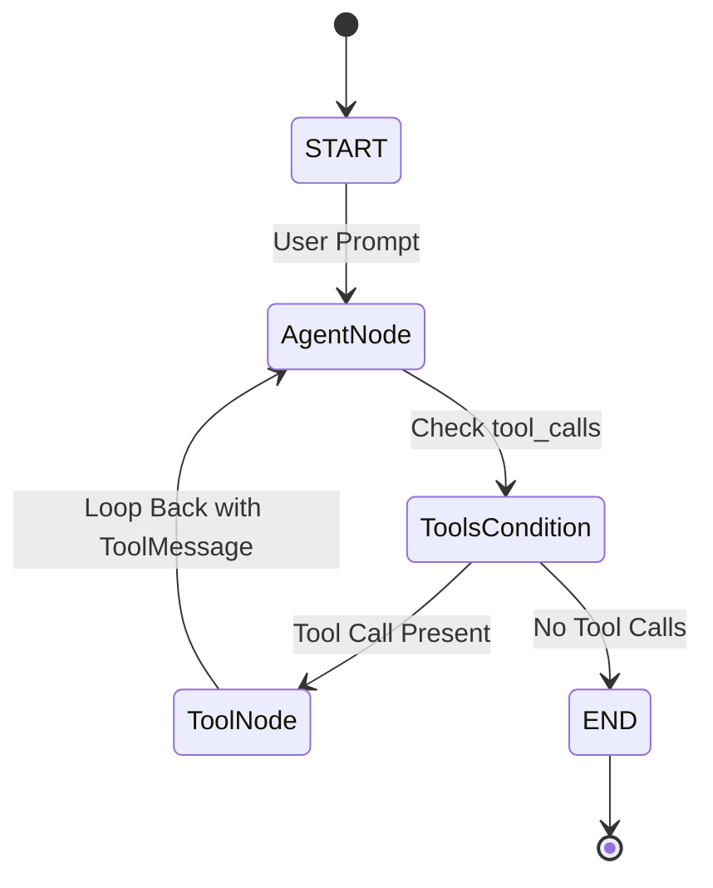

# 📹 LangGraph Tutorial-Getting Started With Pydantic-Data Validations

<div className="video-card" style={{border: '1px solid #30363d', borderRadius: '8px', padding: '16px', marginBottom: '24px', background: 'rgba(56, 139, 253, 0.05)'}}>
  <div style={{display: 'flex', gap: '16px', flexWrap: 'wrap'}}>
    <div><strong>Instructor:</strong> Krish Naik</div>
    <div><strong>Duration:</strong> 1802</div>
    <div><strong>Course:</strong> Module 4: Agentic AI & LangGraph</div>
    <div><strong>Watch Link:</strong> <a href="https://www.youtube.com/watch?v=vVGXPRjtAJE" target="_blank" rel="noopener noreferrer">YouTube Lecture ↗</a></div>
  </div>
</div>

## 📌 Executive Summary

LangGraph structures agent workflows as explicit state machines composed of three foundational elements: State Schemas, Nodes, and Edges.

This guide provides an in-depth breakdown of `StateGraph`, `TypedDict` state modeling, reducers (`add_messages`), adding standard and conditional edges (`tools_condition`), compiling graphs, and inspecting execution flow.

---

## 🏗️ System Architecture & Execution Flow



---

## 📖 Core Concepts & Technical Deep Dive

### 1. State Schema & Reducers
The state represents the single source of truth passed to every node. Defining:
```python
class State(TypedDict):
    messages: Annotated[List[BaseMessage], add_messages]
```
Ensures that when a node returns `{"messages": [new_message]}`, LangGraph appends `new_message` to the existing list rather than overwriting it.

### 2. Nodes as Pure Functions
Nodes are standard Python functions that receive the current state and return a dictionary of state updates.

### 3. Edges & Routing
- **Standard Edges:** Unconditionally route from Node A to Node B (`builder.add_edge("node_a", "node_b")`).
- **Conditional Edges:** Inspect the current state and route dynamically to different target nodes based on a routing function.

---

## 💻 Production Implementation

```python
from typing import TypedDict, Annotated, List
from langgraph.graph import StateGraph, START, END
from langgraph.prebuilt import ToolNode, tools_condition
from langchain_core.messages import BaseMessage, HumanMessage
from langchain_core.tools import tool
import operator

# 1. State Definition
class AgentState(TypedDict):
    messages: Annotated[List[BaseMessage], operator.add]

@tool
def calculate_tax(amount: float) -> float:
    """Calculate standard 18% enterprise VAT."""
    return round(amount * 0.18, 2)

# 2. Graph Construction
builder = StateGraph(AgentState)
builder.add_node("agent", lambda state: {"messages": ["Agent processed."]})
builder.add_node("tools", ToolNode([calculate_tax]))

builder.add_edge(START, "agent")
builder.add_conditional_edges("agent", tools_condition)
builder.add_edge("tools", "agent")

app = builder.compile()
print("LangGraph core architecture compiled successfully.")
```

---

## ⚙️ Production Gotchas & Best Practices

:::tip Standard tools_condition
Always use LangGraph's prebuilt `tools_condition` when building ReAct agents. It automatically checks if the latest message in state is an `AIMessage` with `tool_calls` and routes to `"tools"` or `END`.
:::

:::warning Graph Compilation
Remember to call `.compile()` on your `StateGraph` builder before invoking it. You can optionally attach checkpointers and interrupts during compilation.
:::

---

## 📊 Architectural Reference & Comparison

| Concept | Role | Equivalent Concept |
| :--- | :--- | :--- |
| **State** | Shared data schema | Database row / Session store |
| **Node** | Computation step | Microservice / Pure function |
| **Edge** | Directed transition | Route / Event trigger |
| **Reducer** | State update merger | Redux reducer / CRDT merge |

---

## 📚 Key Takeaways & Enterprise Checklist

- [ ] **Architecture Verification:** Ensure your design addresses latency, decoupled interfaces, and strict data validation contracts.
- [ ] **Deterministic Testing:** Run unit tests and golden dataset evaluations before shipping changes to staging or production.
- [ ] **Security & Observability:** Enforce input/output guardrails, scrub sensitive credentials/PII, and capture distributed traces.
- [ ] **Scalability & Sizing:** Calibrate model parameters, context limits, and compute instance requirements against projected request concurrency.
