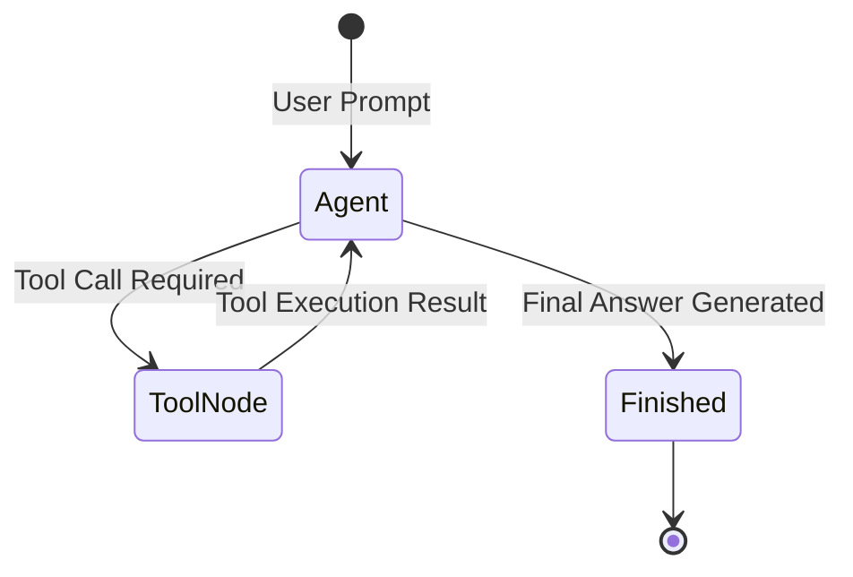

# 📹 Agentic With LangGraph Crash Course-Part 2- Debugging And Monitering

<div className="video-card" style={{border: '1px solid #30363d', borderRadius: '8px', padding: '16px', marginBottom: '24px', background: 'rgba(56, 139, 253, 0.05)'}}>
  <div style={{display: 'flex', gap: '16px', flexWrap: 'wrap'}}>
    <div><strong>Instructor:</strong> Krish Naik (Krish Naik)</div>
    <div><strong>Duration:</strong> 40m 32s</div>
    <div><strong>Playlist:</strong> LangGraph & MCP Architecture (Krish Naik)</div>
    <div><strong>Watch Link:</strong> <a href="https://www.youtube.com/watch?v=5TBsXGdmkc0" target="_blank" rel="noopener noreferrer">YouTube Lecture ↗</a></div>
  </div>
</div>

## 📌 Executive Summary & Learning Objectives

This lecture covers **Agentic With LangGraph Crash Course-Part 2- Debugging And Monitering**, focusing on production implementations, edge cases, and industry standards:
- Core intuition, architecture, and underlying mechanisms.
- Key differences between theoretical research implementations and scalable enterprise patterns.
- Concrete Python walkthroughs, error recovery, and performance optimization.

---

## 🏗️ Architecture & Conceptual Workflow



---

## 📖 Core Concepts & Technical Deep Dive

### 1. Architectural Foundations
In modern production AI engineering, **Agentic With LangGraph Crash Course-Part 2- Debugging And Monitering** is essential for ensuring reliability, low latency, and deterministic outcomes. As AI systems evolve from naive prompt-in / completion-out scripts into distributed systems, engineers must handle:
- **State management & consistency:** Ensuring intermediate states and tool invocations are tracked.
- **Error boundaries & recovery:** Graceful degradation when external LLMs or vector stores encounter rate limits or network partitions.
- **Resource utilization & cost efficiency:** Caching common queries and reducing unnecessary foundation model token expenditure.

### 2. Operational Considerations
- **Latency Optimization:** Pre-computing embeddings, utilizing asynchronous non-blocking event loops, and streaming tokens via Server-Sent Events (SSE).
- **Security & Sandboxing:** Validating inputs before ingestion, sanitizing LLM outputs, and isolating tool execution environments.

---

## 💻 Production Implementation Walkthrough

```python
from typing import TypedDict, Annotated, List
from langgraph.graph import StateGraph, END
import operator

# 1. Define State Schema
class AgentState(TypedDict):
    messages: Annotated[List[str], operator.add]
    next_step: str

# 2. Define Node Functions
def analyze_input(state: AgentState):
    print("Analyzing query...")
    return {"messages": ["Query analyzed."], "next_step": "generate"}

def generate_response(state: AgentState):
    print("Generating response...")
    return {"messages": ["Final response generated."], "next_step": "end"}

# 3. Build StateGraph
workflow = StateGraph(AgentState)
workflow.add_node("analyze", analyze_input)
workflow.add_node("generate", generate_response)

workflow.set_entry_point("analyze")
workflow.add_edge("analyze", "generate")
workflow.add_edge("generate", END)

app = workflow.compile()
output = app.invoke({"messages": ["Hello Agent"], "next_step": ""})
print(output)
```

---

## 💡 Production Best Practices & Tips

:::tip Production Deployment Guideline
When deploying Agentic With LangGraph Crash Course-Part 2- Debugging And Monitering in enterprise environments, always configure automated retries with exponential backoff and telemetry tracing (such as OpenTelemetry or LangSmith).
:::

:::warning Common Failure Modes
Watch out for state contamination across concurrent requests. Ensure each session or user interaction uses an isolated thread ID or execution context.
:::

---

## 🎯 Key Takeaways & Quick Reference

| Dimension | Production Standard | Pitfall to Avoid |
| :--- | :--- | :--- |
| **Execution** | Async / Non-blocking with timeouts | Synchronous blocking calls in event loops |
| **Data Validation** | Strict Pydantic v2 schemas | Untyped dictionary access |
| **Monitoring** | Distributed tracing & latency percentiles | Relying only on standard console logs |

## ⏱️ Lecture Timeline & Key Topics

| Timestamp | Key Topic / Concept Discussed |
| :--- | :--- |
| **00:00:00** | Hello guys. So we are going to continue... |
| **00:09:52** | will just go ahead and write os.environ... |
| **00:20:17** | and here from tools to end right. So if... |
| **00:30:40** | the other one. Right. So here I will say... |
| **00:40:30** | Take care. bye-bye.... |


---

---

## 📜 Complete Lecture Transcript (English)

> **Language:** English | **Source:** `05 - Agentic With LangGraph Crash Course-Part 2- Debugging And Monitering.en.srt` | **Total Segments:** 21 | **Word Count:** ~7,856 words

<details>
<summary><b>Click to expand full chronological transcript (21 timestamped intervals)</b></summary>

#### ⏱️ [00:00 ➔ 00:02]

Hello guys. So we are going to continue the discussion with respect to our langraph crash course. Already I have said that we are going to cover this into multiple parts and specifically I had written about part one, part two and part three. In the part one uh we discussed about the entire langraph fundamentals where when we understood how to build a basic chatbot tools, multiple tools, adding memory, add human in the loop, streaming techniques and we also discussed about MCP. So all these specific topics have been completed. Now we are moving into the part two and this part two I am basically categorizing in the advanced lag graph section and before I start making you understand about workflows and agents multi- aents and functional API I really want to take this specific topic that is nothing but debug and monitoring because this is one of the more core fundamental topics that you should really understand and with the help of this trust me uh if you specifically add related to debugging and monitoring in your resume that will definitely impress the interviewer. So when I talk about debug and monitoring whenever you develop a generative AI application or an agentic application right or an agentic AI application this debugging and monitoring is must okay debugging and monitoring is must and as I said that if you know the langin ecosystem specifically since we're discussing about lang and langraph we are going to use lang for the debug and monitoring and along with this we will also show how you can use Langraph Studio right to execute any kind of flows and these two topics will be important for everyone to understand and how you can specifically work with Langsmith and Langraph Studio both of this will be in the Langchin cloud itself okay in the Langchin cloud so here it will give you an idea like how

#### ⏱️ [00:02 ➔ 00:04]

to use this specific cloud platform and how you can debug and monitoring the entire graph and workflow with respect to which LLMA model you are specifically using how it is how it is probably taking the input providing you the response and when we talk about langraph studio right the entire graph execution the pattern of the graph execution you can easily see it okay so this is the agenda uh I really want to talk about debug and monitoring and obviously in my next part I will also talk about LLM evaluation metrics and then one part will be only discussing about this workflow and multi- aents so right now We're going to focus on this specific thing. Okay, debug and monitoring how you can basically do it in langraph. So let's go ahead. So as I said, I will just go ahead and minimize this. This was my code if you remember right in the last class, we already have created this for first of all what I will do, I will just go ahead and write langsmith. Okay, so as you know we are going to use this lang platform for the debug and monitoring. Why I'm using this? Because see if you have if you know about the uh you know if you just go ahead and talk about lang chain right so let's say we are going over a lang chain in the lang chain in the first page you can see the entire ecosystem and in this particular ecosystem you'll be able to see you know about lang chain you know about langraph because completely we spoke about lang graph in our previous class we also spoke about different different integrations from mcp to normal tools integration everything we spoke about and this is what lang is all about here you and do the debug. Here you can probably use the playground, prompt management, annotation, testing and monitoring. So we are going to focus on all this specific task. Okay. And step by step we will try to see it. Now first of all uh if I really want to use the lang you need to have the langsmith API key. So what I will do I will just go ahead and write langsmith API key. Okay. And we will just go ahead and create a lang API key. So I will just go over here and we will go ahead and click on sign up. Once we click on sign up here

#### ⏱️ [00:04 ➔ 00:06]

you can go ahead and continue with Google right you'll be seeing why this API key will be amazing right and I have been using this platform for a longer period of time and it's quite amazing to see what all things it can basically do okay so I will just go over here and I'll click on tracing projects okay just to give you an idea what all things are there uh let's see in the settings do I have a different theme so I will make it as a dark theme okay so I'll click on back now see in the tracing projects You'll be able to see that I have created so many different kind of projects. Let's say here you have this course line graph right if you just go ahead and see this you know here you'll be able to see that what kind of traces it is actually able to pick up right so this kind of traces like how your entire applications will be specifically working right now I got an error because there was an authentication error why this authentication error have actually come right this kind of debugging you'll be able to do it in a very easy way monitoring the entire monitoring part will be able to do it in a very easy way so here you have monitoring also See, you can probably go ahead and create a variable dashboard. You can create anything. So, let's say if I just go ahead and click on this line graph projects right here, you'll be able to get all the charts based on the days. Let's say I think this is from a longer period of time. So, let's say if I go ahead and just hit on last last 14 days and see that whether any kind of uh tracks is there, right? There is nothing, right? So what I will do I'll again go back to my monitoring you know and I've used this long back you know and right now it is just showing for 7 days but let's say I will go over here and let's see whether I can provide probably just provide some kind of metadata. So let's say last 30 days at least we should be able to see something that basically means I've not used anything in this last 30 days. Uh let's say I will just go ahead and apply some filters over here. Right? So let's apply some filters. Let's say I will go ahead and write first at least from first uh start date I will apply invalid end date end date is where let's see this is my

#### ⏱️ [00:06 ➔ 00:08]

start date time end date we will just go ahead and write 2025 month I will say 03 and this will be 31st 31st March right I'll just go ahead and apply this let's see whether there is anything or not so here you can see one of the request was there here you can see that I have probably used at that point of time when I was just trying it out. Right? So this is a very good uh dashboard that is probably got uh got created for you and along with this you can trace each and every request that is happening. Right? Just to show you uh in my company also I specifically use a different dashboard. I have a paid account of Langraph cloud project so that you know I use it for my products that I'm specifically building related to AI. But anyhow I will be showing you each and everything as we go ahead. Now first of all in the lang you need to go ahead and create your API key in order to start using. So I'll go ahead and click on settings. So here you can see so many different API keys are there. I will go ahead and create the API key. I will write okay this is my langraph crash course. Okay crash course. And I will just go ahead and create the API key. Okay. I will use this API key. And again let me tell you guys this uh it gives you free access of 500,000 request in the lang. So you don't have to probably just go ahead and copy my API key. You can go ahead and create your own, right? Because money will not it will not charge you anything. So here I will go in myv file. I will go ahead and uh go ahead and create a key over here because I'm going to use this key and the key name will be nothing but langen langchen_i key. Right? So this will basically be my key name and I will paste it over here. Okay? because the reason is very simple because I'm going to use this particular u I'm going to use this particular uh key for tracking my entire application in short right and uh you will be seeing that how we will be going ahead and tracking each and everything with respect to the keys that we are using over here right so now let's go ahead

#### ⏱️ [00:08 ➔ 00:10]

and probably take a specific example and then we will try to debug and monitor with the help of langsmith okay so here I will create my third folder and this folder will be all about debugging Okay, debugging. I will create this particular folder rename to debugging. Okay, and then I will go ahead and create some files over here. Right. So the first file is simply debugging ynb. Okay, here I will go ahead and select the kernel and then I will start working on my code. So let's say 1 + 1. Now here what we are planning to do is that I will create a simple uh simple state graph uh with respect to a specific task wherein I make a tool call and then based on that we will go ahead and track it everything in the lang. Okay. So first of all what I will actually do is that I will import some of the libraries that I require. Okay. And these libraries are commonly used. Okay. Uh even in my previous tutorials I have actually spoken about it. Okay. So here I will remove this langin open AI because I don't require it because at the end of the day we are just going to go ahead and use our uh normal gro API right so here you can see from typing let me close this and let me open it once again okay so here you go so I will just go ahead and execute it so from typing import annotated I'm using type deck end start state graph add messages which is my reducer tool node tool base message OS and load_.env. Now what we are basically going to do is that quickly I'll go ahead and initialize my load env okayv and I will go ahead and execute it. The reason is very simple why we are using this so that we can load our environment variable. Now the next step is that I will just go ahead and write os.environ environment and here we are going to go ahead and use our grock API_key

#### ⏱️ [00:10 ➔ 00:12]

and here we are basically going to go ahead and write OS uh get env here we are going to go ahead and write grock API key okay so once we do this the next key that I'm really interested in is my lang API key so I will go ahead and write os dot environ now see guys here Uh you can also see that I'm not getting any suggestion. The reason is very simple. What I will do? I will just go to this particular folder. Okay. And sometime you know u uh whenever you keep your dashboard open or whenever you keep your VS code open for longer period of time and then when you create a new folder it will not be able to load the packages. So what I will do I will just close this and I will open it from here again. Okay. And now you can see that my entire uh libraries will get loaded and at least I'll be able to get some kind of suggestions. Hope so. Okay. And this is the problem that I usually face whenever I'm specifically working with this. Now here you can see all the libraries has got loaded. Okay. So now we are going to go ahead and write os.environment. And here I'm going to go ahead and write langsmith API_key. And inside this we are going to basically write os.get get env and then we are just going to go ahead and load our lang lang chain API key okay now this langsmith API key will be playing a very important role because once we set this in the environment right that basically means my entire langun application will understand where we need to probably go ahead and track based on this API key it is going to go ahead and use some specific project and start tracking things okay so this is really important for you all to understand. Okay. Other than this, uh we also need to go ahead and set up two more important things, right? From this, right, I will go ahead and set up OS. Environment. One variable I'll create over here and OS. One more variable we'll create over here. Now,

#### ⏱️ [00:12 ➔ 00:14]

what are the variable? I will let just let you know. Uh and for that, we need to just go ahead and set up see the documentation. So I here I will go I will go ahead and write langsmith API key API key env okay so here you can see get started with langsmith once you probably just go ahead and see for the observability right so observability evaluation prompt engineering there are so many different things that you can basically do over here right so uh get started by adding tracing to your application so if you want to go ahead and understand how to go ahead and add tracing so you have to go ahead and set up this three keys right one is uh lang tracing is equal to true then langsmith API key which we have already set it up so here what I will do I will just go ahead and copy this open my project here I'll just go ahead and write is equal to true okay and remember this true is not a boolean variable right this is not a boolean variable it is like a string variable so here I will just go ahead and write something like true sorry I will just go ahead and write it as true Okay, perfect. Now, one more thing after this, what we really need to do is about our project. I think there is also one more key where we need to set up the project. So, let's see this. I will just go ahead and see some examples over here. Uh, lang spacing is there. Uh, to create an API, head to the langid setting pre API key. Okay, it has just set this three keys. There is also one more field which is called as project and I will also talk about that. Uh, why we use project key also, right? uh that we'll just try to understand in some time. So right now what I will actually do is that I will go back again to my code where I was doing the debugging. Okay. So I'll remove this and then once I set the project what will happen? So here uh it is telling me to import the OS. So let's quickly go ahead and import the OS. Okay. And this OS has got imported. Okay. Now what we are basically going to do is that quickly I

#### ⏱️ [00:14 ➔ 00:16]

will go ahead and create a state graph. And this state graph will be a basic state graph with tool call. Okay. So here I'm going to go ahead and create a graph with tool call. And I hope we have discussed this uh in our previous session also. Okay. So first of all what I am actually going to do is that I'm going to go ahead and make a tool. Okay. So I will go ahead and write from langchen tools import tool. Okay. Now inside this I will go ahead and use this tool decorator at the rate tool. Okay. And here we are going to go ahead and define our function. Here we are going to go ahead and write add. A is nothing but float. Let's say B is nothing but float. Okay. C. And here I will just go ahead and say add two numbers. Okay. And here we are just going to go ahead and return a plus b. This is just a simple way because I really want I'm focused more on explaining you about Langsmith how the tracking basically happens. Okay. Then I will just go ahead and create my tool node. So this is my tool node. This will be nothing but I will use this tool node and inside this I'm going to add this functionality which is called as add. Okay, which is called as add. So add is just like one tool that we are trying to integrate and first of all I'm trying to make it as a tool node itself along with this the second thing is that I should find out a way over here to even initialize my LLM model right so in order to initialize if you see in my previous file I just used this right so I will use the same code over here right from langchain chat_model import initiate model and initiate chat model I'm using grock lama 3 8 billion8192 parameter. So if you just go ahead and execute this, this is how my llm is right. You can also use chat gro but here I'm using this initiate chat model for the better purpose. Okay now this is

#### ⏱️ [00:16 ➔ 00:18]

done right. Uh in my next step what I'm actually going to do is that I will just quickly go ahead and bind my llm model with this tool. So here I will go ahead and write llm dotbind tools and here I'm going to go ahead and add this tool. Okay. And this will be nothing but my llmc with tools. Okay. So this is done. Okay. Now uh I will create a function. This will be my node function saying that hey let's call the llm model. So llm model. And here I'm going to go ahead and give an input of state. This will be of state type which I have not defined. So I will first of all go ahead and create my state graph. So here let's go ahead and create the state graph. So class class state okay um class state and this will be returning something called as type because I need to return all the values in the form of key value pairs. So here I'm going to go ahead and create my messages and here we are going to use the annotated okay and then we will go ahead and write list and this is my base message. Okay. Um, base messages. The reason why I'm adding this because I need to keep a list of all the messages that I'm trying to append it over here. Right. And this add messages is my reducer. So what will happen at every conversation when we are passing from one node to the other node. All the information will start getting saved over here and it'll be available in this particular variable called as messages which will be available in the entire state graph. So here we're going to create the state. Type dict is not defined. The reason is very simple because we did not import typed dictect. Let's see. So, typed dict is installed. Okay. Type dict. Okay. Let's see. Are we returning this? Okay. It should be messages colon. Let me see this quickly. Messages colon annotated list of add message type dict is not defined. Now it is defined. I think I had to execute

#### ⏱️ [00:18 ➔ 00:20]

that once again. Okay. So now you have the state colon state. Okay. Since we have to pass state as my parameter and here we are going to just return the messages colon because we have to return this entirely in the form of dictionary here I'm going to basically go ahead and write lm with tools dot invoke and here we going to go ahead and give my state of messages. Okay. So done. So here we are specifically using this particular model u and also using our uh tool specific uh model so that we'll be able to invoke it and get the response and again save it back to the messages. So guys now here you can see that I have added one tool okay and I have binded with my LLM and I've also created one node definition okay the reason of creating this is that because we are going to create this graph okay and here you can see lm with tool is there so let me just make sure to remove this s so that our naming convention is almost right okay so here you can see uh I have imported three different libraries okay start state graph start and end and there is a tool node and there is a tool condition Okay. Uh, instead of this tool calling LLM, I have basically written call LLM model. Right. So here what I will do, I will just go ahead and copy and paste this. Okay. So I will copy and paste it over here. Okay. Quickly. And this same function we will try to use it over here. Okay. You know my tool nodes uh is basically nothing but like this, right? It is giving in a list of uh list of tool function. So here what I can do is that I can also go ahead and define my tool and I can write add over here. Okay. So this is done and here you can see that uh this is tools. So let me just make the spelling to tools. The same problem statement what we did in the next last class. Here what we are

#### ⏱️ [00:20 ➔ 00:22]

doing is that we are calling this LLM model first of all as one of my node. So tool calling LLM is one of my node. Then I have a tool nodes. Okay. Then from start to tool calling I have then we are adding a conditional edges saying that hey tool calling LLM to tool condition and here from tools to end right. So if you probably go ahead and see the image it is it looks something like this right and if you remember in my previous session already we have covered this. So from start there is a tool calling LLM. This tool have one functionality that is called as add and we are ending it over here with respect to the functionality and if you see right somewhere here in the chatbot only we discussed it right. So here you can see this right now in order to invoke it I will just go ahead and write response and I will go back in my debugging. YNB and I will invoke it. Now see I'll just go ahead and ask what is the recent AI news. Okay, what is the recent AI news? Now let me just open my langsmith page. So quickly this is my lang. I will go back. Okay, so by default in the tracing project I don't have anything. Okay, I don't have anything right. So I will just go ahead and execute this now. So now once I execute this now this is what we are executing graph.invoke messages what is the recent AI news. Okay or I'll just go ahead and search for what is machine learning. Okay now when I'm searching this see what will happen it'll go to this tool calling LLM. This tool calling LLM will first of all see whether it is a tool call or not. Right now it is not a tool call. Right? It'll try to give the answer. It'll give you the response. Right? So once I execute this now see the magic what will happen in the lang okay so right now this has got executed uh if you go ahead and see the response you'll be able to see okay fine I'm getting a AI message learning is a field of sub field and all this information now I'll go back to my lang right and I'll just go ahead and reload this see once I reload it right the amazing thing is that there is something called as default okay default and here inside

#### ⏱️ [00:22 ➔ 00:24]

this particular default here you can see that I am able to get one trace okay and the trace is like once I click this you know you'll be able to see that in this trace it shows like how the flow of execution has happened I ask the input what is machine learning and here the human it is considering it as a human input and this is my entire AI message right it is probably giving it and also in order to understand the entire flow first of all it went and hit this tool tool calling LLM node right you remember what is this tool calling LLM node right inside this there is a two call that is happening one is chat Grock call right so inside this chat Grock you know this LLM hash tools like add but it is not using it right and then here you can see with respect to the tool condition also right how things are happening how everything is visible here you can clearly see that right so with respect to this you know the tool calling llm is one node and in two inside this there is a chat rock model right it also has a tools called as add right now let me show you one more good example over here so I will say hey uh what is since it has some additional tools okay so I will say hey what is 2 + 2 okay what is 2 + 2 I'll just ask this question now you know that this is definitely make a tool call okay or I'll just go ahead and ask this question uh Please, please do do the operation or let's say I'll go ahead and write what is 5 + 20. Okay, so this is my question. Okay, I'll just go ahead and execute this. Let's see two responses I will get and let's see what kind of response I will get. So here you can see what is 2 + 2. So one is what is 2+2? Tool is giving a four output, right? So here now I'll click on this. Okay, I'll click on

#### ⏱️ [00:24 ➔ 00:26]

this. Now here you'll be able to see first of all tool calling llms is there. What is 2 plus blue? The AI output says a 2 +2 there's all values and here you can see in the YAML in the JSON uh you know so here you can see the output first is calling this particular tool called as add right and inside this tool condition also you'll be able to see that what is 2 plus two first of all add tool call it got added then it is going to this particular tool itself the output of the first node is tool right then when we went inside the tools over here now here you can see more information the add functionality is basically giving you the output as four and internally on this particular tool there was this operation that got executed where the input is this and your output is this right and finally here you can see that with respect to the entire flow your output is basically coming as four itself okay so if I just go ahead and show you this right and uh let's say if I just go ahead and write this what is 5 + 5 5 + 20 okay this has got executed let's say I will go ahead and write respon response of let's see the response here you can see 25 tool message content is basically coming as right so it is executing this entire thing and it is giving you the response right so this is the most amazing thing right let me give you more good and proper answers so here what I will do from tools I'll not go to the end instead I'll send it to the tool calling LLM so in order to send it to the tool calling LLM I will just go ahead and give this right now I'm not able to see the output properly because at the end of the day I'm just getting uh a default message right now if I go ahead and ask what is 5 + 20 let's ask this and let's see the response now now the response will be an AI message okay before it was coming as a tools message because after the tool it was going to the end right but now from the tool it is again going back to

#### ⏱️ [00:26 ➔ 00:28]

the uh the LLM itself now if I just go ahead and reload it and if I just close this the first important transaction like uh the first thing like just recently when I asked what is 5 plus 20 that thing you'll be able to see it now see how line by line it has done so if I just go ahead and click this here you'll be able to understand the entire flow first message that you got what is 5 + 2 output what is human is human input is what is 5+2 AI is considering this as a parameter it is calling the tool called as add then from this it is calling a tool name called as add the tool output is basically 25 and then finally the AI since the tool is giving the output back to the LLM the LLM will probably summarize and give you the output. So step by step what has got executed. This is what it is showing right. This is what it is basically showing. First it went to the tool calling LLM. Then it went to the LM model. Then tool condition is applied. Then the tool call is done. Then the ad call is done. Right? Then it again went back to my LLM. Then u it saw that it not had any more questions. Then it went to the end section. And finally you can see the output over here. And this is what your output end is. Right? So if you are able to understand that flow right it is very much simple in order to get like how the execution is specifically happening right and this we just seen with one specific example okay now you may be thinking kish okay fine with this at least we are able to understand like how the flow of the calls is actually happening how every tool is basically getting called and all is there something we can probably go ahead and see the entire lang graph right lang graph studio okay uh with respect to the graph workflow, right? Can we do that? This was one of the question. Now, here you can also see guys, uh, by default we are getting this default, right? You can also go ahead and set up the project name. Now, this will be one assignment to you. How to set up the project name.

#### ⏱️ [00:28 ➔ 00:30]

Okay. So, if I go ahead and search for Langsmith setup project name. Okay. If I just go ahead and see this log traces to a specific project. So here there will be one more parameter which we can specifically go ahead and use it somewhere here it will be coming up. Okay. Um as mentioned in the tracing project lang use a concept of project to group. You can set up the lang project environment. Right. So here what I will do I will go ahead and set it up. Where I will set it up I will just go ahead and write over here. Okay. code and I will say os.environ. Okay. And here I can give my project name lang project name and that project name will be what? Whatever is your test project. So I'll go ahead and write test project. Now let's see whether this will work or not. So quickly uh let's execute this or either you have to restart the kernel. It may be something like this. But at the end of the day, both will work. Okay, so let's see again. I'll go back to my Langsmith. Reload it. If it does not work, you have to restart the kernel. Okay, so right now it is not working. So you have to restart the kernel in order to make it work. Okay, so just restart the kernel and you'll be able to I'll keep this one as the assignment. It is definitely going to work. Now the next step is that how do you go ahead and run this with the help of Langraph Studio? because lang graph studio also you need to probably know how to probably go ahead and run this. Okay. So for langraph studio I will be using a library. Now the best amazing part is that monitoring with langraph studio is very very much simple. Okay. So here I'm going to use inme. Okay. So I'm going to use this specific library and I will quickly go ahead and install this. So command prompt I will go over here. I will say uv add minus r requirement.txt.

#### ⏱️ [00:30 ➔ 00:32]

Okay. So once I do this installation, this is perfectly done. Okay. Uh once this installation is done inside this debugging folder, you know, I will go ahead and create one specific py file. So let's go ahead and see. I'll write, hey, this is my agent. py file. Okay. Now inside my agent py file, uh what we are basically going to do is that uh as usual, I'm going to go ahead and set up some of the keys and configuration, right? So quickly what I will do I will go ahead and import all this specific stuff. Okay. Uh I don't require lang open aai because I require the other one. Right. So here I will say gro_api key. Okay. Here also grock API key. Now this will be fun. You will just love it. Okay. uh because we are going ahead once one more step wherein we play with all these things right and we will also set up all these environment variables that I require okay I will just go ahead and paste it over here so agent py I will just go ahead and write it over here and inside my debugging ipynb I will also go ahead and import this lang project okay so all this are simple environment that we are trying to set it up okay now As you know in the debugging what all things we executed we first of all initialized my llm. So let's go ahead and initialize it. So here now my py file. I will just go ahead and initialize it. Okay we are going to use this llama 3 model and then again I will go back to my debugging file. Uh I will create this particular classes. So let's go ahead and create this classes in my agent. py. Same state. There should be a state. Okay. I will close all this specific stuff. Okay, quickly I'll go back again to my this one. Okay, and then here you will be able to see that I

#### ⏱️ [00:32 ➔ 00:34]

have all the specific files that has got created. I'll copy this. Okay, so that I just go ahead and keep on adding all these things or I can directly call this as a function. So here I will go ahead and write. So this will basically be my function. I will say definition make tool graph. Okay. And inside this I'm going to go ahead and define this function. Okay. So here you can see this is my tool. This is my LMIT tool. Same thing. Nothing so much different. Everything I'm defining it over here itself. And then once I go back to my debugging I will just go ahead and create all these things. Okay. So let me just go ahead and define this where I'm going to create the builder compile each and everything. Okay. So I'm going to go ahead and define inside this function. Okay. And there will be a tab. Let's see the tool condition has not got imported. Why? Because I've not imported it. Very simple. Calling llm models each and everything is there. So let's go ahead and import this tool condition. This three libraries that I require. Okay. I will quickly go ahead and do that. I'm telling you why I'm specifically using this the same code inside that I have made a function which is called as make tool graph and uh this is what we are basically doing we are compiling it okay and then I'm going to just go ahead and return this particular graph okay and at the end of the day in order to execute this I'll say agent dot make tool graph I'm just calling this function okay so this is my agent function uh let's say this is my I'll go ahead and write tool agent okay now My main aim is that you understood how this graph looks like. This graph looks something like this. And I want to show you this in langraph studio. Right? Now, how do I probably go ahead and execute

#### ⏱️ [00:34 ➔ 00:36]

this in the langraph studio? Now, you remember one of the library that we have imported in Langraph CLI in memory. Okay? With the help of this, we will be able to run any graph in the langraph studio from our local to the langraph cloud in the langraph cloud. So let's say if you are running a graph in your local you can directly go ahead and monitor that in the lang cloud itself and that is what is my plan over here. So here we what we will do we will create one more file which will be my langraph dot JSON file. Okay now inside this langraph.json and remember you have to name it in this way right we will go ahead and set up some configuration. The first configuration is nothing but I'll say dependencies. what all dependencies we have right so I will go ahead and write dependencies okay so first key is nothing but dependencies inside this dependency you have something like dot okay then here you have something like graphs okay so the next key that we need to set is with respect to the graph inside this graph I will go ahead and give my tool agent name so I'll say hey this is nothing but this is my tool tool _ agent. Okay, this is the name of the agent. And the second parameter is the file name which I have created. Right? So inside this, you know that I've created debugging inside the debugging folder, I've created the agent. py file, right? So from this current working directory, what is my file name? I will write dot / agent. py. And this is basically calling inside this we are calling this particular variable which is called as tool agent. So what it is going to do this will basically call this particular function and this function is going to load each and everything as we go ahead. Okay. So this is very simple and this is what we are basically doing. So here I'm going to go ahead and write this. Then in the next parameter we are also going to give what are dependencies we have. So one dependency we have is in my environment

#### ⏱️ [00:36 ➔ 00:38]

variable. So in my environment variable where is the env file? In the root folder. So I'll say hey do double dash go to the root folder and there you call the env file right? So this is the dependencies that we specifically have. So guys now finally what we are basically going to do is that I will try to show you that how you can run this after setting up the configuration directly into the langraph studio which is in the cloud. Okay. So uh now I'll show you my face. So let's go ahead and uh go to my terminal and first of all what you need to do is that see whenever you open a command prompt right remember I open a command prompt over here right now you know that your configuration file is given inside this folder that is nothing but three debugging so first of all I will go inside this particular folder three debugging okay and from here I will run a command which is called as langraph dev okay so let me again hide my face so Here we are going to call a command called as lang graph dev and with the help of this particular command and from where this command is basically coming up because we have installed langraph cli in memory. Okay. Now what this command is going to do is that it is going to pick up this configuration file. It is going to see hey where my agent is right on this specific file in this particular working directory and it is going to call you the tool agent variable which is present inside over here right. So that is how it is basically going to understand and then it is going to run this in the langraph studio. So once I go ahead and execute this here you can see that some of the links are there and automatically you should have logged in into your lang and here you will be able to see that my entire graph has got opened this is nothing but this is langraph studio here you got tool agent name which I gave in my configuration here are my nodes right here you can drop a message and then just execute it like just go ahead and type hi and once you click on submit the exec execution will go ahead you know and uh if you remember we can also put interruption

#### ⏱️ [00:38 ➔ 00:40]

right we can interrupt it let's say before this particular node we want to put an interrupt we can go ahead and put it after this particular node we can go ahead and put up this particular interrupt right and then we can continue our execution this is the most important thing now again the other thing is that if I go back over here there are some more URLs that you'll be able to see see this is my API docs URL so if I just go ahead and click this now what is this URL all about here you can see all the different different APIs The entire documentation is basically created. See you have /ass assistant / assistant search. So by default you'll be able to get this kind of information from this graphs also. There is also something like you can also convert this into MCP right. So here with respect to the MCP/MCP post MCP you can also convert your entire see this is the URL where your entire services are running right you can specifically go ahead and write this particular code and just go ahead and test the request based on you right you can put the keys you can put all the information you'll be able to get the response right so this is the entire thing here you can also see the code snippet you know look at the curl command each and everything so I would suggest just go ahead and check out more about the documentation because as we go ahead you know this level of debugging and monitoring is super super beneficial. Uh the best part is debugging with the help of this right and not only this see uh if I also go back to my tracing project right this was my project name test project here also you'll be able to see different types of tracings that is happening in the default you can actually see different types of tracing that is happening you know everything you'll be able to see it right so two types of debugging I have actually showed you okay one was with respect to lang again you want to go back over there just go ahead and click on this lang uh deployments here in the langraph studio you know just give the URL where you are specifically running right and I think it has got closed now so here you'll be able to see that if I just go ahead and click this the again the URL will be able to come right and here is my entire URL that is available over here right so I hope you like this particular video

#### ⏱️ [00:40 ➔ 00:40]

one assignment I really want to give you go ahead and test it over here just go ahead and write the messages and see what all things will be able to see this will be so graphically like how the input is going how it is calling the tool each and everything gets highlighted in an amazing way. So I hope you like this particular video wherein we spoke about debug and monitoring with the help of Langsmith and Langraph Studio. Uh this is just like a crash course which we are specifically learning. So yes, this was it from my side. I'll see you in the next video. Have a great day. Thank you and all. Take care. bye-bye.

</details>
