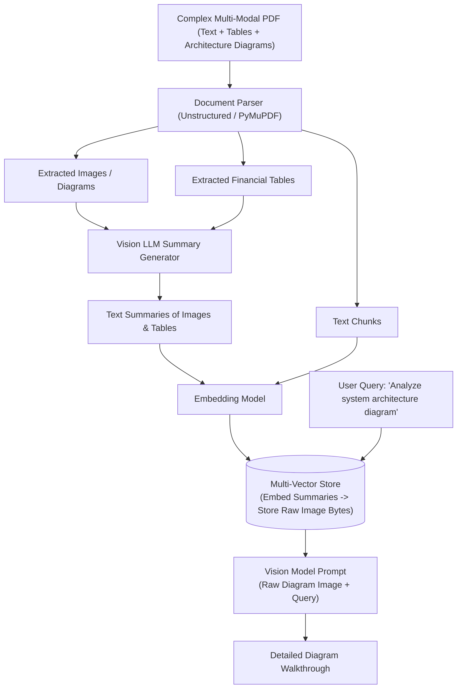

# 📹 Step By Step Process To Build MultiModal RAG With Langchain(PDF And Images)

<div className="video-card" style={{border: '1px solid #30363d', borderRadius: '8px', padding: '16px', marginBottom: '24px', background: 'rgba(56, 139, 253, 0.05)'}}>
  <div style={{display: 'flex', gap: '16px', flexWrap: 'wrap'}}>
    <div><strong>Instructor:</strong> Krish Naik</div>
    <div><strong>Duration:</strong> 2699</div>
    <div><strong>Course:</strong> Module 4: Agentic AI & LangGraph</div>
    <div><strong>Watch Link:</strong> <a href="https://www.youtube.com/watch?v=BV0YUeam4y8" target="_blank" rel="noopener noreferrer">YouTube Lecture ↗</a></div>
  </div>
</div>

## 📌 Executive Summary

Enterprise technical assets—architecture diagrams, circuit schematics, financial balance sheets, and medical scans—cannot be processed by text-only embedding models. Multi-Modal RAG ingests, indexes, and synthesizes text, tables, and images simultaneously using vision-capable foundation models.

This guide explores multi-vector retrieval architectures, visual document parsing, embedding image summaries, and prompting vision models (GPT-4o, Claude 3.5 Sonnet) with retrieved visual context.

---

## 🏗️ System Architecture & Execution Flow



---

## 📖 Core Concepts & Technical Deep Dive

### 1. The Multi-Vector Retriever Pattern
Directly embedding raw image pixels with CLIP often produces poor semantic search accuracy for detailed enterprise diagrams. The industry standard pattern:
- Pass each extracted image and table to a vision model (GPT-4o) to generate a dense, highly descriptive text summary.
- Embed the text summary into the vector store.
- Store the raw high-resolution image in an object store (S3 or local storage) linked by ID.
- When querying, match against the summary embedding, but pass the *raw image* to the final generator model.

### 2. Table Parsing Fidelity
Tables embedded as plain text lose spatial row-column relationships. Converting tables to HTML or markdown preserves hierarchical headers and numeric alignment.

---

## 💻 Production Implementation

```python
from langchain_core.messages import HumanMessage
from langchain_openai import ChatOpenAI
import base64

def encode_image_base64(image_path: str) -> str:
    with open(image_path, "rb") as image_file:
        return base64.b64encode(image_file.read()).decode('utf-8')

# Blueprint for Multi-Modal LLM invocation
# vision_model = ChatOpenAI(model="gpt-4o", temperature=0.0)
# message = HumanMessage(content=[
#     {"type": "text", "text": "Describe the failover topology in this architecture diagram."},
#     {"type": "image_url", "image_url": {"url": f"data:image/png;base64,{encode_image_base64('arch.png')}"}}
# ])
# response = vision_model.invoke([message])

print("Multi-Modal RAG architecture initialized with Multi-Vector Retrieval support.")
```

---

## ⚙️ Production Gotchas & Best Practices

:::tip Image Resolution & Token Costs
High-resolution images consume thousands of tokens per page. Downscale images to max 1568px on the longest dimension before sending them to vision models.
:::

:::warning Table OCR Preservation
Never flatten financial balance sheets into raw single-line strings. Always extract them as structured Markdown or HTML tables to preserve column relationships.
:::

---

## 📊 Architectural Reference & Comparison

| Modality | Extraction Tool | Embedding Strategy | Final Generation Input |
| :--- | :--- | :--- | :--- |
| **Text Prose** | `RecursiveCharacterSplitter` | Direct vector embedding | Raw text chunks |
| **Architecture Diagrams**| `pdf2image` + Vision LLM | Embed generated summary | Raw high-res image (Base64) |
| **Tables & Sheets** | `pdfplumber` / Table OCR | Embed table summary | Markdown / HTML table string |

---

## 📚 Key Takeaways & Enterprise Checklist

- [ ] **Architecture Verification:** Ensure your design addresses latency, decoupled interfaces, and strict data validation contracts.
- [ ] **Deterministic Testing:** Run unit tests and golden dataset evaluations before shipping changes to staging or production.
- [ ] **Security & Observability:** Enforce input/output guardrails, scrub sensitive credentials/PII, and capture distributed traces.
- [ ] **Scalability & Sizing:** Calibrate model parameters, context limits, and compute instance requirements against projected request concurrency.
