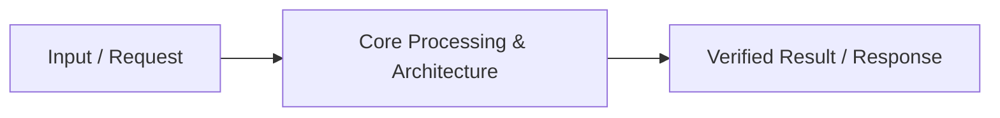

# 📹 What Is LLM HAllucination And How to Reduce It?

<div className="video-card" style={{border: '1px solid #30363d', borderRadius: '8px', padding: '16px', marginBottom: '24px', background: 'rgba(56, 139, 253, 0.05)'}}>
  <div style={{display: 'flex', gap: '16px', flexWrap: 'wrap'}}>
    <div><strong>Instructor:</strong> Krish Naik (Krish Naik)</div>
    <div><strong>Duration:</strong> 12m 0s</div>
    <div><strong>Playlist:</strong> LangGraph & MCP Architecture (Krish Naik)</div>
    <div><strong>Watch Link:</strong> <a href="https://www.youtube.com/watch?v=r0q1n8BJ0QI" target="_blank" rel="noopener noreferrer">YouTube Lecture ↗</a></div>
  </div>
</div>

## 📌 Executive Summary & Learning Objectives

This lecture covers **What Is LLM HAllucination And How to Reduce It?**, focusing on production implementations, edge cases, and industry standards:
- Core intuition, architecture, and underlying mechanisms.
- Key differences between theoretical research implementations and scalable enterprise patterns.
- Concrete Python walkthroughs, error recovery, and performance optimization.

---

## 🏗️ Architecture & Conceptual Workflow



---

## 📖 Core Concepts & Technical Deep Dive

### 1. Architectural Foundations
In modern production AI engineering, **What Is LLM HAllucination And How to Reduce It?** is essential for ensuring reliability, low latency, and deterministic outcomes. As AI systems evolve from naive prompt-in / completion-out scripts into distributed systems, engineers must handle:
- **State management & consistency:** Ensuring intermediate states and tool invocations are tracked.
- **Error boundaries & recovery:** Graceful degradation when external LLMs or vector stores encounter rate limits or network partitions.
- **Resource utilization & cost efficiency:** Caching common queries and reducing unnecessary foundation model token expenditure.

### 2. Operational Considerations
- **Latency Optimization:** Pre-computing embeddings, utilizing asynchronous non-blocking event loops, and streaming tokens via Server-Sent Events (SSE).
- **Security & Sandboxing:** Validating inputs before ingestion, sanitizing LLM outputs, and isolating tool execution environments.

---

## 💻 Production Implementation Walkthrough

```python
# Production Implementation Blueprint
def run_production_pipeline():
    print("Executing production pipeline...")

if __name__ == "__main__":
    run_production_pipeline()
```

---

## 💡 Production Best Practices & Tips

:::tip Production Deployment Guideline
When deploying What Is LLM HAllucination And How to Reduce It? in enterprise environments, always configure automated retries with exponential backoff and telemetry tracing (such as OpenTelemetry or LangSmith).
:::

:::warning Common Failure Modes
Watch out for state contamination across concurrent requests. Ensure each session or user interaction uses an isolated thread ID or execution context.
:::

---

## 🎯 Key Takeaways & Quick Reference

| Dimension | Production Standard | Pitfall to Avoid |
| :--- | :--- | :--- |
| **Execution** | Async / Non-blocking with timeouts | Synchronous blocking calls in event loops |
| **Data Validation** | Strict Pydantic v2 schemas | Untyped dictionary access |
| **Monitoring** | Distributed tracing & latency percentiles | Relying only on standard console logs |

## ⏱️ Lecture Timeline & Key Topics

| Timestamp | Key Topic / Concept Discussed |
| :--- | :--- |
| **00:00:00** | Hello all, my name is Krishna and... |
| **00:02:56** | kind of arrogant friends. I have lot of... |
| **00:06:10** | it is being dependent on some kind of... |
| **00:09:03** | databases that is available within the... |
| **00:11:59** | thank... |


---

---

## 📜 Complete Lecture Transcript (English)

> **Language:** English | **Source:** `08 - What Is LLM HAllucination And How to Reduce It？.en-orig.srt` | **Total Segments:** 6 | **Word Count:** ~1,920 words

<details>
<summary><b>Click to expand full chronological transcript (6 timestamped intervals)</b></summary>

#### ⏱️ [00:00 ➔ 00:02]

Hello all, my name is Krishna and welcome to my YouTube channel. So guys, today in this specific video we are going to discuss about a very important topic which is called as LLM hallucination. This topic can be very important for your interviews because nowadays everybody is thinking about building rag applications and my plan after this specific video is to create some set of videos related to rag, different types of rag, how rag can be implemented. But before we go ahead towards rack, you really need to understand this topic. What is LLM hallucination? I hope everybody may have used chat GPT, you may have used cloud, you may had used different kind of or let's say Google Germany, different different AI assistants you have used. And whenever you ask some specific set of questions, sometimes you get answers that may not be factually right and sometimes LLM may generate their own answer as they like. Right? I hope everybody has seen this kind of scenarios. So this is nothing but this is basically called as LLM is hallucinating. You know they are trying to give or they are making their own answers even though the answer is not actually correct. Right? So in this specific video we'll talk more about LLM halifination. How do you prevent it? You know whenever you are developing a any kind of applications let it be a rag application or a generative a application. So let me go ahead and discuss this step by step. uh we will make sure to I'll I'll make sure to teach you this particular topic in a way that everybody should be able to understand things right so LLM hallucination u as you all know that every LLM model so let's say that this is my LLM model okay now whenever we talk about LLM model every LLM model has a training cutff date okay training cutff of date. That basically means let's say right now

#### ⏱️ [00:02 ➔ 00:04]

in open AAI we have something called a GPD5 model right and this GP5 let's consider that the training date is 1st August 2025 okay so let's say that this is the date that we have specifically for this particular model when we say training cutff date that basically means whatever data we had before 1st of August with all those datas we have trained this specific specific model. Okay. And the recent new data, the LLM will not have any clue or any idea about it. So whenever I ask any questions to this LLM, it will be able to generate the output and if I say like anything that I asked before 1st of August, I think it will be able to answer us accurately accurately. Okay. Now LLM is also some kind of arrogant friends. I have lot of arrogant friends that I have connected to with you know in my life. So these are some arrogant friends. Okay. What happens is that now sometimes I ask some questions through the LLM. Okay. And just like my arrogant friend even though this friend does not know that answer you know this person will come first and he'll try to answer this even though the answer is not factually right you know I know this I know this hey this may be this this this this okay so let's say if I've asked question this person is an expert in AI you know and I have asked a question hey what is what is hallucination Okay, what is hallucination? Now let's say that this arrogant friend does not know the answer. He will try to even though tell us some kind of answer over here. Okay, and he will tell the answer in such a way that you know

#### ⏱️ [00:04 ➔ 00:06]

most of us will start believing it. Okay, most of us will start believing it because he has said this answer much more in a way that once you understand what he is basically saying, you may think, hey, it may be factually right, you know, and this is what is all about hallucination. Even though the answer is not right, this arrogant friend or my LLM model has anyhow made up that particular answer and given it in front of you. Okay. And it will try to give the answer in such a way that whenever we talk about statistics, whenever we talk about factual information that all information will be available over here, right? when I say statistics let's say it will say hey 83% it will probably provide some factual information from some random use case right even though this use cases are not true okay and this is one of the major problem throughout all the LLMs that is being trained by uh companies out there right so nowadays you consider any platform chat GPT you consider cloud you even consider Google Germany, right? What they are doing is that they are trying to integrate with external tools, right? They are trying to integrate with external tools, right? And the main aim of integrating this external tools is that whenever a new kind of information is asked for this kind of models, LLM models, they're not going to go ahead and make up that answer. Instead they will be having their dependencies on these external tools. These external tools can be a web search tool. It can be a rag. It can be connected to any kind of databases. It can be connected to let's say search engine

#### ⏱️ [00:06 ➔ 00:08]

any thirdparty APIs it may be connected to that basically means now the LM is not taking the responsibility in answering the answer directly. Instead it is being dependent on some kind of external tool out there right now I hope everybody is able to understand hallucination right now what are why why this hallucination actually happens you know so one of the major reason I've told you obviously there is a training cutff date okay training cutff date let's say my LLM is not been trained my LLM is not being trained with sufficient amount of data sufficient amount of data data. So this scenario may also happen right I was just seeing as soon as GPT5 got launched you know someone was trying to answer hey Chris what hey hey LM what is 8.11 minus 8.90 okay or sorry 8.9 okay so this kind of questions were also basically getting asked and LLM was not able to generate the output it was giving a wrong answers why this is basically happening because similar kind of examples the LLM may have not been sufficiently trained So there also it is starting to hallucinate. It is giving you some wrong answers. It will generate a kind of answer. It will say that hey this is the right answer and then suddenly you'll say that hey you're not telling it right. Then it'll start thinking and it'll and it'll have some kind of you know backoff theorem uh which may be applied out there for the LLM models and it'll try to give some other answers out there. Right? So that is the main reason. Now how do we go ahead and prevent this LLM hallucination? Right? See one basic example for companies you know see when LLM is giving you some wrong answer it is fine but when you're developing some applications right this kind of generative AI application or AI agentic AI applications or you're developing AI agents for companies right it is always better that whenever you try to use some

#### ⏱️ [00:08 ➔ 00:10]

kind of LLM you try to integrate this LLM with external rack system right so let's say that this is my vector store it can be a vector databases and this is what you are basically connected to so whenever a question is asked to an LLM related to any info right I'm not talking about public I'm I'm talking about companies right it is always good that LLM is connected to a rack system here I have a vector databases and for this particular vector databases we may get some kind of context information and then this LLM will be able to generate the output right and that is where your rack system come into picture right rag comes into picture because we do not want LM to hallucinate if it does not know some kind of answers it is just going to go ahead and some call some kind of tools external databases out there and it can also call this vector databases that is available within the company So here now LLM is only not dependent on generating the answer but it is also getting it is also dependent on asking hey do I have any tools or anything binded with along with me right and that is what it makes uh uh LLM hallination to probably get reduced you cannot remove completely right you cannot remove LLM hallucination completely let's say that if I have asked any kind of questions and from this specific tools we did not get any context then also so LLM will not keep quiet it will take this specific context and it will generate the output okay and it'll generate the output it will create it own output it will create its own output okay so we cannot 100% remove hallucination instead we can reduce it we can reduce it by uh let's say 20 to 30% we can reduce it to

#### ⏱️ [00:10 ➔ 00:11]

20 to 30% in most of the cases we may uh be able to improve our accuracy by 5 to 10%. Right? So this kind of scenarios basically happening. So that is the reason now everybody is focusing in moving towards rag application wherein they are creating retrievers they are creating agents which will be able to do the task and that task whatever these agents or retriever are doing will provide the necessary context to the LLM to generate the output. Now LLM is only not generating the output based on its W but instead based on the response that it is being able to get from the tools or the databases. Now this is just a 5 to 10 minutes video on making you understand about LLM hallucination. The reason why I'm making this specific video is that it is very simple. In the next video I will be focusing on rag applications. One of the major concern about LLM, it's specifically LLM hallucination. It's not like only rag is one of the way. You can also go ahead and use LLM fine-tuning. You can also go ahead and use LLM fine-tuning technique. But again understand this is a expensive process. This is a expensive process. Okay. With basic prompt engineering also you'll not be able to do rag is one of the very good solution. And along on top of rag you can also go ahead and use human verification human verification like we can provide a feedback based on the answers that is being generated by the LLM. So yeah this was a simple video on understanding about LLM hallucination. uh as we go ahead we will talk about different kind of rags how to build rag application you know um how do we integrate it again with the help of langraph we will continue the playlist that we have already defined so yes this was it from my side I'll see you in the next video thank

</details>
