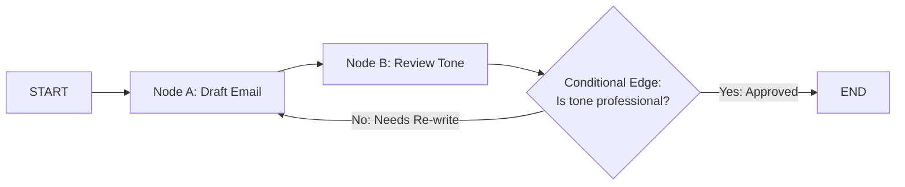

# LangGraph Core Architecture: StateGraph, Nodes & Edges

<div className="video-card" style={{border: '1px solid #30363d', borderRadius: '8px', padding: '16px', marginBottom: '24px', background: 'rgba(56, 139, 253, 0.05)'}}>
  <div style={{display: 'flex', gap: '16px', flexWrap: 'wrap', alignItems: 'center'}}>
    <div><strong>Curators:</strong> Unified Masterclass (CampusX & Krish Naik)</div>
    <div><strong>Module:</strong> Module 4: Agentic AI & LangGraph</div>
    <div><strong>Focus:</strong> Beginner to Production</div>
  </div>
</div>

## 🎯 What You'll Learn
- Understand why cyclical workflows break traditional DAG frameworks and require LangGraph.
- Define shared state schemas using Python's `TypedDict`.
- Construct and compile a `StateGraph` with nodes and edges.

---

## 💡 Concept & Architecture

Traditional pipeline engines (like LangChain LCEL, Airflow, or Prefect) are strictly **Directed Acyclic Graphs (DAGs)**: they can only flow forward in one direction. They cannot loop back!

Real AI agents require **cycles**:
- An agent writes code.
- A test node runs the code.
- If the test fails, execution **must loop back** to the coding node to fix the bugs!

**LangGraph** models agentic applications as **State Machines**:
1. **State:** A shared central data schema that tracks conversation history, variables, and flags.
2. **Nodes:** Standard Python functions that receive the current State, perform work, and return an updated dictionary.
3. **Edges:** Rules that determine which node runs next (either unconditional or conditional).

### System Architecture & Data Flow



---

## 💻 Step-by-Step Code Walkthrough

Below is the complete implementation broken down into digestible parts so you can understand every line.

### Part 1: Step 1: Defining the Shared State Schema

```python
from typing import TypedDict

# The State dictionary is passed to every node in the graph
class AgentState(TypedDict):
    input_text: str
    draft: str
    is_approved: bool
    review_count: int
```

#### 🔍 In-Depth Explanation:
The `AgentState` schema defines all variables tracked by the graph. Every node receives an instance of this dictionary and can update fields.

### Part 2: Step 2: Defining Node Functions

```python
def drafter_node(state: AgentState):
    """Node that drafts an initial response."""
    count = state.get("review_count", 0) + 1
    print(f"[DRAFTER NODE]: Generating draft (Attempt #{count})...")
    return {
        "draft": f"Draft response to: '{state['input_text']}'",
        "review_count": count
    }

def reviewer_node(state: AgentState):
    """Node that reviews and approves or rejects the draft."""
    print("[REVIEWER NODE]: Evaluating draft quality...")
    # Simulate approval on attempt 2
    approved = state["review_count"] >= 2
    return {"is_approved": approved}
```

#### 🔍 In-Depth Explanation:
Each node is a plain Python function. It receives `state` and returns a dictionary containing ONLY the keys it wants to update.

### Part 3: Step 3: Assembling the StateGraph with Conditional Edges

```python
from langgraph.graph import StateGraph, START, END

# 1. Initialize graph with state schema
workflow = StateGraph(AgentState)

# 2. Add nodes
workflow.add_node("drafter", drafter_node)
workflow.add_node("reviewer", reviewer_node)

# 3. Add edges
workflow.add_edge(START, "drafter")
workflow.add_edge("drafter", "reviewer")

# 4. Conditional Edge: Decide whether to loop or finish
def route_after_review(state: AgentState):
    if state["is_approved"]:
        return END
    return "drafter" # Loop back!

workflow.add_conditional_edges(
    "reviewer",
    route_after_review,
    {"drafter": "drafter", END: END}
)

# 5. Compile into executable application
app = workflow.compile()

# Execute the graph
final_state = app.invoke({"input_text": "Summarize the quarterly financials", "review_count": 0})
print("\nFinal Graph State Completed:", final_state)
```

#### 🔍 In-Depth Explanation:
Notice the cycle: `workflow.add_conditional_edges()` routes back to `drafter` if `is_approved` is `False`. The graph loops automatically until the condition is met.

---

## ⚠️ Beginner Tips & Best Practices

:::tip Nodes Only Return Updates
A node doesn't need to return the entire state. If you only return `{'is_approved': True}`, LangGraph automatically merges that change into the master state without wiping other keys.
:::

:::warning Always Set recursion_limit
When invoking cyclical graphs, pass `config={'recursion_limit': 15}`. If a bug causes an infinite loop, LangGraph will raise a `GraphRecursionError` instead of freezing.
:::

---

## 📝 Key Takeaways & Summary

- LangGraph enables cyclical state machines essential for self-healing AI agents.
- `StateGraph` coordinates nodes (Python functions) and edges (transitions).
- Conditional edges allow dynamic routing, loops, and termination criteria.

