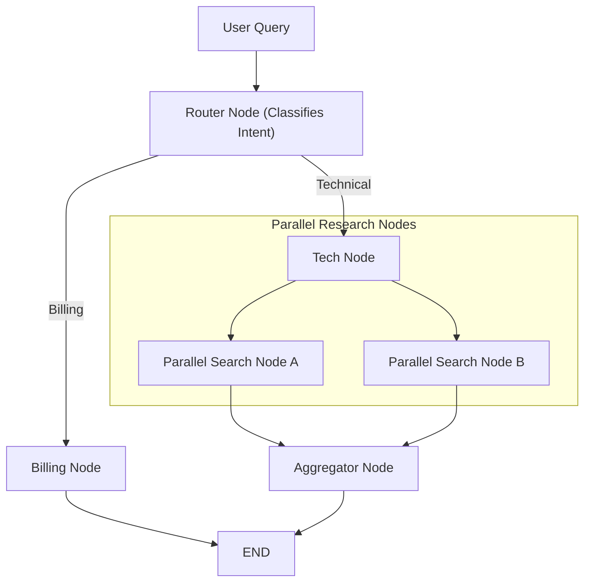

# Graph Execution Patterns: Sequential, Parallel & Conditional Routing

<div className="video-card" style={{border: '1px solid #30363d', borderRadius: '8px', padding: '16px', marginBottom: '24px', background: 'rgba(56, 139, 253, 0.05)'}}>
  <div style={{display: 'flex', gap: '16px', flexWrap: 'wrap', alignItems: 'center'}}>
    <div><strong>Curators:</strong> Nitish Singh (CampusX)</div>
    <div><strong>Module:</strong> Module 4: Agentic AI & LangGraph</div>
    <div><strong>Focus:</strong> Beginner to Production</div>
  </div>
</div>

## 🎯 What You'll Learn
- Master Sequential Graph Execution (chaining tasks step-by-step).
- Implement Parallel Fan-Out and Fan-In execution using state reducers (`operator.add`).
- Build dynamic content routers that classify queries and send them to specialized domain nodes.

---

## 💡 Concept & Architecture

Complex enterprise agent architectures combine three primary topologies:
1. **Sequential Pattern:** Task 1 finishes -> Task 2 begins -> Task 3 begins.
2. **Fan-Out / Fan-In Parallel Pattern:** A single state fans out into multiple specialized researcher nodes running concurrently. Once all parallel nodes finish, their results fan-in to a summarizer node.
3. **Router Pattern:** An initial classifier inspects the user query and routes to the appropriate specialist (e.g. billing agent vs technical support agent).

### System Architecture & Data Flow



---

## 💻 Step-by-Step Code Walkthrough

Below is the complete implementation broken down into digestible parts so you can understand every line.

### Part 1: Step 1: Using Annotated and operator.add for Parallel State Merging

```python
from typing import TypedDict, Annotated, List
import operator
from langgraph.graph import StateGraph, START, END

# Annotated[List[str], operator.add] tells LangGraph:
# "When parallel nodes return results, APPEND them to this list instead of overwriting!"
class ParallelState(TypedDict):
    topic: str
    insights: Annotated[List[str], operator.add]
```

#### 🔍 In-Depth Explanation:
The `operator.add` reducer is critical. Without it, if Node A and Node B finish at the same time, one node's return value would overwrite the other.

### Part 2: Step 2: Defining Parallel Worker Nodes and Aggregator

```python
def researcher_a(state: ParallelState):
    print("[WORKER A]: Researching market data in parallel...")
    return {"insights": ["Market growth projected at 18% CAGR."]}

def researcher_b(state: ParallelState):
    print("[WORKER B]: Researching regulatory compliance in parallel...")
    return {"insights": ["EU AI Act mandates strict compliance checks."]}

def aggregator_node(state: ParallelState):
    print("[AGGREGATOR]: Merging all parallel insights...")
    all_findings = " | ".join(state["insights"])
    return {"insights": [f"FINAL SUMMARY: {all_findings}"]}

# Assemble the parallel graph
workflow = StateGraph(ParallelState)
workflow.add_node("worker_a", researcher_a)
workflow.add_node("worker_b", researcher_b)
workflow.add_node("aggregator", aggregator_node)

# Fan-out: START triggers both worker_a and worker_b simultaneously
workflow.add_edge(START, "worker_a")
workflow.add_edge(START, "worker_b")

# Fan-in: Both workers route into aggregator
workflow.add_edge("worker_a", "aggregator")
workflow.add_edge("worker_b", "aggregator")
workflow.add_edge("aggregator", END)

parallel_app = workflow.compile()

# Execute parallel graph
res = parallel_app.invoke({"topic": "AI Trends 2026", "insights": []})
print("\nAggregated Findings:", res["insights"][-1])
```

#### 🔍 In-Depth Explanation:
Both workers run concurrently. LangGraph automatically synchronizes execution and passes the combined list of insights to the aggregator node.

---

## ⚠️ Beginner Tips & Best Practices

:::tip Use Reducers Whenever Multiple Nodes Write to One Field
Always use `Annotated[..., operator.add]` for lists of messages or logs. In parallel topologies, un-annotated state fields will cause race condition errors.
:::

:::warning Avoid Circular Deadlocks
Ensure your graph transitions always have at least one deterministic exit condition pointing to `END`.
:::

---

## 📝 Key Takeaways & Summary

- LangGraph supports sequential, parallel (fan-out/fan-in), and dynamic routing patterns.
- `operator.add` reducers allow concurrent nodes to append to shared lists without data loss.
- Parallel graph execution slashes latency for multi-source research tasks.

