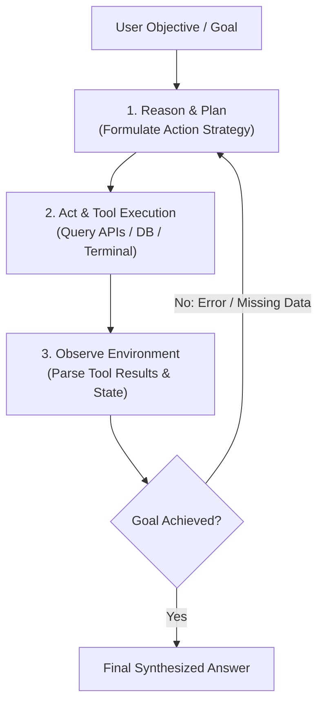

# 📹 Detailed Prerequisites To Start Learning Agentic AI With Free Videos And Materials

<div className="video-card" style={{border: '1px solid #30363d', borderRadius: '8px', padding: '16px', marginBottom: '24px', background: 'rgba(56, 139, 253, 0.05)'}}>
  <div style={{display: 'flex', gap: '16px', flexWrap: 'wrap'}}>
    <div><strong>Instructor:</strong> Krish Naik</div>
    <div><strong>Duration:</strong> 619</div>
    <div><strong>Course:</strong> Module 4: Agentic AI & LangGraph</div>
    <div><strong>Watch Link:</strong> <a href="https://www.youtube.com/watch?v=Qs_j5wRbVr8" target="_blank" rel="noopener noreferrer">YouTube Lecture ↗</a></div>
  </div>
</div>

## 📌 Executive Summary

The paradigm shift from Generative AI to Agentic AI represents the evolution from passive, single-turn completion prompts to autonomous, goal-driven computational systems. While traditional GenAI generates text in response to an isolated prompt, an Agent observes an environment, plans sequences of actions, executes tools, evaluates feedback, and self-corrects until a termination condition is satisfied.

This lesson explores perception-action feedback loops, the ReAct (Reasoning + Acting) pattern, architectural trade-offs between heuristic pipelines and autonomous agent systems, and enterprise reliability boundaries.

---

## 🏗️ System Architecture & Execution Flow



---

## 📖 Core Concepts & Technical Deep Dive

### 1. The Autonomous Feedback Loop
Agentic systems execute closed-loop control:
1. **Perception:** Ingesting user prompt, environmental context, and past turn history.
2. **Reasoning (Cognition):** Breaking complex goals into sub-tasks and determining which tool to invoke with specific arguments.
3. **Action:** Executing tool calls against real-world systems (SQL databases, REST APIs, local file systems).
4. **Observation:** Ingesting execution output or error traces and updating working memory.
5. **Reflection / Correction:** Re-evaluating the plan if execution fails and dynamically selecting alternative routes.

### 2. Generative AI vs Agentic AI
- **Generative AI:** Feed-forward processing. The model receives a prompt, generates tokens autoregressively, and terminates. Any error in reasoning requires human re-prompting.
- **Agentic AI:** Cyclical graph processing. The agent can loop, retry, verify its own work, and invoke multiple external tools over multiple turns before returning a final answer.

---

## 💻 Production Implementation

```python
from typing import TypedDict, Annotated, List
from langgraph.graph import StateGraph, END
import operator

class AgentState(TypedDict):
    task: str
    plan: List[str]
    completed_steps: List[str]
    is_finished: bool

def planning_node(state: AgentState):
    print("--- PLANNING NEXT ACTION ---")
    return {"plan": ["Check server metrics", "Restart failing pods"], "is_finished": False}

def execution_node(state: AgentState):
    print("--- EXECUTING TOOL ACTION ---")
    return {"completed_steps": ["Server metrics checked: pod crashloop detected."]}

def evaluation_node(state: AgentState):
    print("--- EVALUATING TASK PROGRESS ---")
    return {"is_finished": True}

workflow = StateGraph(AgentState)
workflow.add_node("planner", planning_node)
workflow.add_node("executor", execution_node)
workflow.add_node("evaluator", evaluation_node)

workflow.set_entry_point("planner")
workflow.add_edge("planner", "executor")
workflow.add_edge("executor", "evaluator")
workflow.add_edge("evaluator", END)

app = workflow.compile()
print("Agentic Feedback Loop initialized successfully.")
```

---

## ⚙️ Production Gotchas & Best Practices

:::tip Recursion Limits
Always configure explicit `recursion_limit` settings (e.g. `config={"recursion_limit": 25}`) on agent graphs to prevent infinite loops and runaway API costs when tools fail repeatedly.
:::

:::warning Avoid Unbounded Agent Independence
Never allow an autonomous agent to execute destructive actions (dropping tables, sending customer emails, executing shell commands) without human review or strict sandboxing.
:::

---

## 📊 Architectural Reference & Comparison

| Characteristic | Generative AI | Agentic AI |
| :--- | :--- | :--- |
| **Execution Flow** | Linear Feed-Forward | Cyclical Multi-Turn Loops |
| **Tool Interaction** | Rare / Ad-hoc | Native & Central to Architecture |
| **Error Handling** | Fails silently / Hallucinates | Observes error & self-corrects |
| **State Management** | Ephemeral / Stateless | Durable Checkpointers (SQLite/Postgres) |

---

## 📚 Key Takeaways & Enterprise Checklist

- [ ] **Architecture Verification:** Ensure your design addresses latency, decoupled interfaces, and strict data validation contracts.
- [ ] **Deterministic Testing:** Run unit tests and golden dataset evaluations before shipping changes to staging or production.
- [ ] **Security & Observability:** Enforce input/output guardrails, scrub sensitive credentials/PII, and capture distributed traces.
- [ ] **Scalability & Sizing:** Calibrate model parameters, context limits, and compute instance requirements against projected request concurrency.
