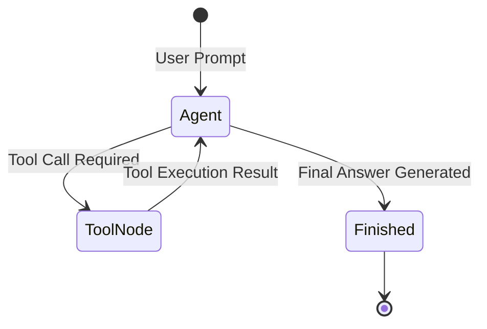

# 📹 Detailed Prerequisites To Start Learning Agentic AI With Free Videos And Materials

<div className="video-card" style={{border: '1px solid #30363d', borderRadius: '8px', padding: '16px', marginBottom: '24px', background: 'rgba(56, 139, 253, 0.05)'}}>
  <div style={{display: 'flex', gap: '16px', flexWrap: 'wrap'}}>
    <div><strong>Instructor:</strong> Krish Naik (Krish Naik)</div>
    <div><strong>Duration:</strong> 10m 19s</div>
    <div><strong>Playlist:</strong> Real-World Multi-Agent Frameworks (Krish Naik)</div>
    <div><strong>Watch Link:</strong> <a href="https://www.youtube.com/watch?v=Qs_j5wRbVr8" target="_blank" rel="noopener noreferrer">YouTube Lecture ↗</a></div>
  </div>
</div>

## 📌 Executive Summary & Learning Objectives

This lecture covers **Detailed Prerequisites To Start Learning Agentic AI With Free Videos And Materials**, focusing on production implementations, edge cases, and industry standards:
- Core intuition, architecture, and underlying mechanisms.
- Key differences between theoretical research implementations and scalable enterprise patterns.
- Concrete Python walkthroughs, error recovery, and performance optimization.

---

## 🏗️ Architecture & Conceptual Workflow



---

## 📖 Core Concepts & Technical Deep Dive

### 1. Architectural Foundations
In modern production AI engineering, **Detailed Prerequisites To Start Learning Agentic AI With Free Videos And Materials** is essential for ensuring reliability, low latency, and deterministic outcomes. As AI systems evolve from naive prompt-in / completion-out scripts into distributed systems, engineers must handle:
- **State management & consistency:** Ensuring intermediate states and tool invocations are tracked.
- **Error boundaries & recovery:** Graceful degradation when external LLMs or vector stores encounter rate limits or network partitions.
- **Resource utilization & cost efficiency:** Caching common queries and reducing unnecessary foundation model token expenditure.

### 2. Operational Considerations
- **Latency Optimization:** Pre-computing embeddings, utilizing asynchronous non-blocking event loops, and streaming tokens via Server-Sent Events (SSE).
- **Security & Sandboxing:** Validating inputs before ingestion, sanitizing LLM outputs, and isolating tool execution environments.

---

## 💻 Production Implementation Walkthrough

```python
# Production Implementation Blueprint
def run_production_pipeline():
    print("Executing production pipeline...")

if __name__ == "__main__":
    run_production_pipeline()
```

---

## 💡 Production Best Practices & Tips

:::tip Production Deployment Guideline
When deploying Detailed Prerequisites To Start Learning Agentic AI With Free Videos And Materials in enterprise environments, always configure automated retries with exponential backoff and telemetry tracing (such as OpenTelemetry or LangSmith).
:::

:::warning Common Failure Modes
Watch out for state contamination across concurrent requests. Ensure each session or user interaction uses an isolated thread ID or execution context.
:::

---

## 🎯 Key Takeaways & Quick Reference

| Dimension | Production Standard | Pitfall to Avoid |
| :--- | :--- | :--- |
| **Execution** | Async / Non-blocking with timeouts | Synchronous blocking calls in event loops |
| **Data Validation** | Strict Pydantic v2 schemas | Untyped dictionary access |
| **Monitoring** | Distributed tracing & latency percentiles | Relying only on standard console logs |

## ⏱️ Lecture Timeline & Key Topics

| Timestamp | Key Topic / Concept Discussed |
| :--- | :--- |
| **00:00:00** | hello all my name is krishak and welcome... |
| **00:02:42** | that I hope everybody knows about it but... |
| **00:05:10** | all have been given up right so one is... |
| **00:07:41** | complex workflows is being built in aent... |
| **00:10:17** | day thank you one... |


---

---

## 📜 Complete Lecture Transcript (English)

> **Language:** English | **Source:** `01 - 1-LangGraph Tutorial-Getting Started With Pydantic-Data Validations.en-orig.srt` | **Total Segments:** 16 | **Word Count:** ~5,562 words

<details>
<summary><b>Click to expand full chronological transcript (16 timestamped intervals)</b></summary>

#### ⏱️ [00:00 ➔ 00:02]

Hello all, my name is Krishna and uh welcome to my YouTube channel. I know many of you were expecting some live sessions on Langraph but I thought I will start creating recording videos because uh this recording videos will be referenced in the form of a playlist. So it'll be good that you go ahead and probably refer this in my YouTube channel whenever you can. Already in my previous video we had made announcement that we are going to start this Langraph series. Uh and I had actually written down the agenda over here. uh the first topic that we are going to cover uh up is related to pyic data validation and that is what we are going to discuss in this specific video. Now why pyntic is important since we are learning about lag graph but why do we require pyntic you know without pyntic can't we start lang graph uh that will be the question that many people will have so that is the reason uh I'll tell you guys before you start lang graph always make sure that you learn pyntic modules completely for the data validation part uh and it is really important so in this specific video I'll be talking about all pyntic uh I'll be showing you practical applications uh and why it will be used in langraph also I will tell you Okay. Now uh it's not like uh paidentic has just become famous right now and many people are using it you know uh but year by year if you see right if if you have already worked in fast API right so if you have already worked in fast API here that pyantic module is used a lot right pentic module is used a lot now why it is specifically used we will try to understand understand guys uh let's say uh I have an application okay and in this specific speific application. Let's say I'm making an API request. Okay, I'm making an API request and let's say that in through this particular API request, I get some kind of JSON data. Okay, I'm just giving you an example. Let's say that I'm getting the uh some kind of JSON data from the API request. Now, uh within the application for this particular JSON data, let's say there will be some kind of structure. Let's say here I'm getting values like name is

#### ⏱️ [00:02 ➔ 00:04]

equal to crash. Okay, name is equal to crash. Let's say age is equal to some value 35. And some more information is there. Okay. Uh here there are some information that is coming from the API. And this particular information is of a specific data type. Okay. Whenever I talk about uh the application which is calling this particular API is expecting some kind of information, right? In some specific format. Let's say the JSON format. Now inside this JSON format the values that I'm getting inside this particular fields or variables right it is of some data valid data types right let's say name name is coming with respect to string age is coming with respect to name and all right and it is necessary that we keep this kind of type hint okay we keep this kind of type hint with respect to the information that we are getting into the application right and to make sure that we have that schema fixed right we have schema of X2 it will definitely create some kind of class right so with respect to the class I will be having all these particular variables and I will define hey this should be string this should be integer this should be let's say float right but when I'm getting from the information from the API how do we validate that it is matching this specific information you know how do we validate that so that entire data validation now can be easily done with data Data validation can be easily done with pyic module. Now what is the advantage of using this? We will discuss about that. Right? Because this pyntic module the back end is completely written in rust. Since it is written in rust, this actually this entire process of data validation becomes much more quicker, right? If we are directly implementing or creating our model or classes uh inheriting this pyentic module. Okay. So internally this kind of data validation will automatically

#### ⏱️ [00:04 ➔ 00:06]

happen whenever any data is probably coming from API. Now why do you think in langraph we really want to use pyche? Because see understand right now we are getting this data from API right but when we talk about lang graph now lang graph is a kind of frameworks where we create complex workflows where we automate complex workflows let's say one of the workflow that I really want to create okay and um this workflow is for a task that I upload a YouTube video and this should get converted into a blog and here I don't want to include any human beings so what is my task task is that as soon as I upload a YouTube video, something should get triggered, some workflow should get triggered wherein I probably read the content from this YouTube then in my next workflow my LLM call is basically done with this information and this LLM creates the entire blog. So this entire process can be automated, right? I don't have to include any human beings. I don't have to probably go ahead and say that hey uh one person I don't have to probably go ahead and say hey you get the transcript design the blog instead LLM can do that part right so I don't have to probably include anyone because this kind of task LLM is now far more advanced it is trained well with the specific data right so that is the reason what we can do is that we can automate this entire workflow with the help of lang graph but here also you can see that with respect to every node this is basically called as nodes I We'll talk more about langraph as we go ahead. Whenever every node is basically getting executed here, what is being expected? Let's say here the output is expected that I need to have a title. This title should be a string type. Then I need to have a description. This should also be a string type. Right? This two information is just like the information that we are going to get from the model. Right? And this value needs to be populated from the LLM. My title should not have an

#### ⏱️ [00:06 ➔ 00:08]

integer. So that kind of data validation will automatically happen if we are inheriting or if we are creating this particular model which we can also create it over here by inheriting the pyic module right. So that is the reason it is important and whenever we talk about advanced LLM models this is just two fields when we are creating more complex workflows there will be different different fields and those fields will be populated the LLM should probably give me a structured output the LLM should be giving me a structured output and this structured output validation will be done by the pyntic module this is really important pyic module because initially we We will define a class and this will be inheriting the pyentic module with all the fields the LLM should output the structured output itself right so with all these fields let's say my LLM need to give an output of title description some information that all needs to be given in the form of a structured output and if LLM wants to probably give us in a structured output we need to create a specific class with all the variables inherited with this pyantic module. I know I've said lot many information but don't worry in this video we'll just focus on understanding about pying pent pyntic module and we'll try to see that how we can go ahead and create the classes and do everything as such. Okay but as we go ahead in the upcoming upcoming videos right with respect to lang graph you will understand how we'll be using this pidentic module. Okay so now let me go ahead and quickly open my VS code. Now in this specific VS code what we are basically going to do I have already created an environment. I'll create my first module that is called as pideantic. All these materials will be given uh in the uh description uh in the register in the link that is given in the description of this particular

#### ⏱️ [00:08 ➔ 00:10]

video. So uh in Krishna Academy we have crept this entirely as a free course. You can go ahead and uh download it from there. So now just to start with I will just go ahead and write intro.ip ynb. Okay. So we'll I'll start with IP YNB. But before I go ahead, I will just go ahead and install my IP kernel. Okay, because we will be requiring this. So once I go ahead and install the IP kernel here, you will be able to see that my installation will probably happen and then we should be able to select a kernel for this particular Jupyter notebook. Now step by step, we will start with how this pyantic module can be used for data validation. We'll create a simple model. When I say models, I'm basically talking about class, how we can inherit from a base model, how that entire data validation will happen and many more thing. Okay. So let this happen quickly. So once this is done, we will go ahead and select the kernel. I will go ahead and select the Python environment. Let me go ahead and create a markdown. And for this particular markdown, I will just go ahead and write some information over here. So here this is the first thing that we are going to discuss that is piantic basics creating and using models. Okay and I will just delete this. So let's see why this IP kernel is taking so much time. Yeah it is done. In the future classes I will also show you one more way like how you can use UV for handling the entire packages. Okay. So, Python basics creating and using models. Pi pining models are the foundation of data validation in Python. They use Python type annotation to define the structure and validate data at runtime. Okay, here is a detailed exploration of basic model creation with several examples. So, first of all, what I will do in order to use uh pyic you know first of all we need to import from pyic import base model. So, right now you can see over here pyantic is not coming up

#### ⏱️ [00:10 ➔ 00:12]

right. So what we will do, we will just go ahead and create one requirement.txt. Okay, because I will be requiring some libraries. So requirements dot txt. Okay. Now here I will just go ahead and write pyantic. Okay. And we will just go ahead and open my terminal and again go ahead and write pip install. Uh it is better that I hide my face so that you should be able to see my screen. Okay. pip install minus r requirement.txt. Okay. So once we do this the entire pyntic module will get installed. Okay perfect. Now what I will do I will just go over here. Now here you can see I will just go ahead and write from pentic pentic import base model. Okay model. So as soon as we import this base model now you'll be able to see that if I just hover through this what is this base model okay the name of the class defined on the model uh there are some information but it's okay I will just go ahead and show you but this you can just say that it is a base class for creating pyic models which performs the data validation so guys now we have imported from pyntic import base model okay what we are going to do is that first of all we are just going to start with a simple model which is inheriting this base model with some some of the required fields and we'll see that how the data validation happen. Okay. Now here I'm just going to go ahead and write class person and here we are going to inherit the base model. Sorry this is my base model and then we will just go ahead and create some variables like name is equal to str age is equal to int. Age colon int. Okay. And then here you have city colon str. Okay. So here what I am specifically saying is that hey the name value since we are inheriting this base model. Okay since this person model is our person class is

#### ⏱️ [00:12 ➔ 00:14]

inheriting from this base model that basically means here we are defining some variables the name should be of string type age should be of integer type city should be of str type. Okay. Now let's say that we will go ahead and create an instance. So let's say I will just go ahead and write person is equal to person. And here let's say that I go ahead and define name is equal to kish. Okay, kish. And then I have age is equal to age is equal to 35. Okay. And then I have something like city is equal to Bangalore. Okay. Since it is of string type. Okay. Now if I just go ahead and print person. Okay. And execute this. Here you can see all the specific information I'm able to see inside this person. Okay. And if you go ahead and see the type of person, okay, type of person here, you can see that is of main.person object, right? Now, now this is fine, right? You you you'll be able to see that, hey Chris, if we also create a data class, I think it'll work in the similar way. What additional thing you're basically doing, right? Uh let's say over here if you just say hey from data class import data class right you can also use this right so you use a decorator data class and you can use the same thing same thing and you don't have to inherit the base model right and here you should be able to print this too right right so here you are getting okay this is a person object and here you're getting name k so what is so different why we are inheriting base model. Now here is the magic that you'll be seeing. If I just go ahead and create my another object person one and let's say over here name is equal to is equal to 35. Instead of giving a string value city is str if instead of giving a string value if I give some value like 12 integer now what

#### ⏱️ [00:14 ➔ 00:16]

will happen here you'll be able to see that sorry this should be person one here you'll be able to see that uh person okay sorry I have to execute this okay so let's execute this base model now if I go ahead and execute it here you'll be able to see that I'm getting this specific error one validation error for person right so once we inherit base model this class validation will take place because of the piantic right so let's let's make this as person one and let's make this person now if I go ahead and execute the same thing for the previous one with respect to data class and if I just go ahead and use this okay and if I make this Bangalore 235 will I get an error the answer is no I'm not getting an errors That basically means the classes that we are creating or the model that we are creating where we are using this data class here the data validation is not at all happening right but what if happens that when I do data validation over here what is basically going to happen the data validation says that hey kish we are not going to make sure that we don't give uh anything other than specified in this specific class right so here city is str but you're giving as an integer so that is the reason you're getting this data validation now you understand if I just go ahead and fix this parameters and I tell my llm hey your structured output should come within this particular variable this can also be a dictionary and you should display the output in this way where my name should be string my age should be integer city should be strange how easy it becomes for you to get the output Right. So this is basically called as data validation and this is how we basically do a data validation with the help of pientic. Okay. Let's see one more example and this time we will be using some more additional fields. Okay. So the best

#### ⏱️ [00:16 ➔ 00:18]

part of inheriting pentic is that you the data validation will automatically happen right and this data validation is very very amazing. Why? Because the back end is rust. You can see that how fast the data validation will happen. Right? Right. So here you can you're getting in this val validation error. You can also handle this particular error which I will show you. Okay. Now let me just go ahead and show you one more method which is called as model with optional field. So here I have defined some fields like name, age and city. Right. So there is also a way which is called as optional fields. Okay. So optional fields how do we import it? So I will go ahead and write from typing import optional. Okay. Now inside this what I will do? So I will go ahead and create a class. Okay, let's say these are my class. It is inheriting the base model. The first parameter is ID with integer, name with str, department with str, salaries optional float. Now what does this optional float mean? Optional with default value. So here we are saying that hey this is an optional float value with none as the default value. Okay, default value. Okay. Now what will this optional do? Okay. Indicates the field can be none. Okay. So this field can be null. Okay. None. So here it is a float value. Here it is a boolean value. Okay. And by default the value will be true. Okay. Now what I will do? I will just go ahead and print this. Now see this. See this magic. Okay. I will just go ahead and print hey employees there ID is equal to 1. John is equal to name is equal to John. Department is equal to ID. I have not given this two values over here. Right? So if I just go ahead and print this employee one salary will be none is active is equal to true. See by default if I want to specify a specific field I can keep it as optional with a default value over here as none. Okay. So I hope

#### ⏱️ [00:18 ➔ 00:20]

you are able to understand this too. Right? Very simple. Okay. Let's say that I go ahead and write one more thing over here. Let's say employee to ID name JN department salary is 6,000 is active is equal to false you should be able to see this particular value by default this will become a floating point okay what happens if I remove this and I make it as integer automatic type casting will also happen is there a possibility of type casting into float the answer is yes it is possible so here we are able to write it down okay so just to define this I will also put a markdown so that you should be able to have some kind of uh references so that you can refer it over here. Okay. Okay. So let's see this. Okay. One by one we will read this. Okay. So here you can see that optional type indicates the field can be none. Default value is equal to none is equal to true makes the field optional. Okay. Required fields must still be provided. Pentic validates type even for optional field when the values are provided. Okay. Now similarly let's say that one of the field can also be a list. So for that list, how do we do it? Okay, so we can also create model with list values or list fields. So here what I'm going to do, I'll just go ahead and import base model list. So I'm created a classroom. Room number will be string. Since we are inheriting this pidentic base model, so here the data validation will be applied on all these variables. Students can be of type list of string. Okay. So here we can have uh a list of string values. Okay. So list of string values and capacity will be integer. Okay. So if I really want to go ahead and inherit this, it is a very simple way. I'll just go ahead and execute this. I will go ahead and write create classroom. Classroom room number A1 students Alice, Bob, Charlie, capacity is 30. So here you can see I'm giving a list of string variables. Right? And if I just go ahead and print the classroom, I should be able to get it. Okay. Now inside of this list if I just go ahead and provide like this uh

#### ⏱️ [00:20 ➔ 00:22]

like a dictionary or like a pupil let's see whether pupil will work whether type casting will happen that all things you can actually see yes so here you can see that type casting is also happening for this right but if you give something else like dictionary it is going to give you a data validation error right so I hope you are able to understand this okay let's try something good right what happens if I just give instead of list of string I give an integer Okay. So we will try to handle this with the try catch block. So I will write try colon. Okay. Let's say invalid val is equal to I'll just go ahead and write classroom. Okay. And then this will basically be my room number. Room number is A1 let's say. And then students I'll write crash, 1 2 3. It should be string but I'm writing 1 2 3 and let's say capacity here I'll specify is at 30. Okay. Now since I know I'm going to get an error. What kind of error I'm get going to get? See if you see over here if you don't provide the right uh values with respect to the data I'm going to get a validation error. Okay. Otherwise we can also get a value error. So I will just go ahead and write accept value error as e because we have not provided the right value. and then I'm going to get print. Okay. So here you can see one validation error for classroom student input should be a valid string type string type input value is equal to 1 2 3 input type is int. It is saying that hey you are providing an int. And how this is basically happening because of the pentic. Yeah pentic. So here you can just see this particular examples right. Let me show you one more very good way uh of so here we can also implement uh pyic models model with nested values okay let's say if I have some kind of models with a much more complex structure okay then we can also do that

#### ⏱️ [00:22 ➔ 00:24]

and let me show you one specific example for this also where you should be able to get an example very easily okay so here you should be able to see this first of all I created an address field this is inherit ing base model then customer I have created another class here this address is referring to this particular class that basically means this address will have this three values street city and zip code right so that is the reason we say this as nested model we are creating models in nested model and this customer you can see over here customer one I'm writing name then address I'm specifying in the form of key value pairs where street is equal to 1 2 3 all these values are there okay and then I can just go ahead and execute this so here you can See good output. One more very amazing thing is that what happens if I just go ahead and keep this zip as int. Okay. And here you can see zip code I'm giving as string. Will this get type casted? Will this be handled by pentic? The answer is yes. So you should be able to see that it is automatically converting the string into an integer value. Okay. So I hope you are able to understand all the specific stuff and I hope you are able to understand why do we use pyic? what are the different types of data validation and it is really really important to probably go ahead and do this kind of data validation itself. Okay. Now uh the next stuff uh that we are basically going to discuss about is pyic field customization and constraints. Okay. So this is what we are basically going to discuss about. This is also really really important. Uh there is a topic with respect to pyic fields which is specifically used you know for some kind of constraints. the field function in the pinetic analysis model fields beyond basic type hints. So there's a thing something called as type hints by allowing you to specify validation rules. So you can also specify some kind of validation rules. Now by default whatever uh data types you are specifying based on that that validation is basically getting applied. But on top of that if you want to add more

#### ⏱️ [00:24 ➔ 00:26]

validation how do we do it? Okay. So again I will just go ahead and import from pientic import base model import base model and then uh we'll just go ahead and import field. Okay now here uh let me go ahead and create some item. Okay so a class item I will go ahead and inherit with my base model. Okay and then here I have my name. Okay, string. And let me just go ahead and create this as a field. Okay. Now this field will be basically very important. Okay. Uh because here we will just go ahead and define some some constraints. Let's say the minimum length. I'll say that hey this field should have a minimum length of two. That basically means at least string value also you're mentioning you should have a minimum length of two. Then you have this max length. Max length you can basically have for 50. Okay let's say that you have max length you can have 50. So these are some kind of constraints on top of that validation that basically happens right by default a validation of str gets applied but on top of it I'm giving min length max length and all for a string right similarly if I just go ahead and apply let's say this is my second uh value price and I am saying that hey this is of float type I'm going to use this also as field whenever we have filled and sorry whenever we have float and integer we can go ahead and apply different different uh uh validation like greater than okay so it should be greater than zero and it should be less than let's say 1,000 okay let's say the price should be only between 0 to 100 right it should be greater than and less than th00and right and similarly I can still go ahead and apply one more like quantity right so quantity will be of integer type and here we are just going to use go ahead and use this as field and here also I can go ahead and write it should be greater than zero it cannot be less than zero So here uh just to give you an example

#### ⏱️ [00:26 ➔ 00:28]

u this is just like hey this is a required field here the value should be greater than zero and less than equal to 1,000 right you can go ahead and go ahead and define like this right it should be greater than zero and less than or equal to th00and and this should be greater than zero right now what happens if I just go ahead and apply this validation now see this I will just go ahead and print the item print the item. Now if I go ahead and execute this, this looks perfectly fine. Now what happens if I just make the price to minus one? It'll give us a validation error saying that hey the input should be greater than zero. It cannot be less than one. Right? So this is what it is and here you can see how fast this is and this is all possible because of this pyic model. Okay. And this is just like a basic field with constraints, right? We are just trying to put some kind of constraints. Okay. See uh here we have not even specified the default value but we can also specify some default value. We can specify some description and all the stuffs. Okay. Uh we can do that and based on that you can actually see this right now let's let's go ahead and uh do one more example. Okay. And this time we are going to create some fields with default value. Okay. So here uh let's go ahead and just execute this code. Now I think you should be able to understand this one more example. So here I've created a user the base model username field. This is just like the optional parameter. I'm just skipping this. Okay. Description also you can specify using unique username for the user. Why this will be useful? I will talk about it because here if I want to see the schema I should be able to see it. Okay. Now see in this age you can also specify default value inside the field. Okay. Then you have description users use uh user age default to 18 uh email strate user at the rategmail.com default some some information is over here with respect to the field okay and then here

#### ⏱️ [00:28 ➔ 00:30]

we are using Alice so let's print Alice right by default uh the value will be user at the rategmail.com if I specify anybody the value it should be that specific value will automatically get replaced right so here also you can basically We see this. Now you may be thinking Kish why all this specific information is required. The reason is very simple. I if I just go ahead and print my user user dot schema I should be able to see all the specific information. Let's see. So the schema should be a function. Uh so here you can see properties user description all the specific information. Now it also says that hey uh it is basically uh the schema method is deprecated. Use model.json JSON schema. Okay, great. I will just go ahead and write model_json schema. Okay, now see I'm getting this entire schema. So once we use this user.mod JSON schema here you can see that I'm able to get all the information like username, description, all the specific information. So that at least if you give the schema the developer should be able to understand like what kind of API request we should be giving back to the users right so this is really really amazing right now uh all the specific stuffs and there are multiple things that uh we will try to cover still there are a lot of topics I want to cover itself uh I will not make this video long uh this is just the part one okay the part two uh we'll try to upload it as soon as possible but let's go ahead and try this out and slowly After this I will be integrating with Langraph and then you'll be seeing some amazing things that will be happening out there. So yes uh this was it from my side. I hope you like this particular video. Uh I will see you all in the next video. Have a great day ahead. Thank you $1. Please make sure that you go ahead and practice it. Hit like u and yes make it to 1,000 likes at least uh because all this specific content are completely for free. So yeah, this was it for my side. I hope you like this particular video. I'll see you in the next video.

#### ⏱️ [00:30 ➔ 00:30]

Bye-bye.

</details>
