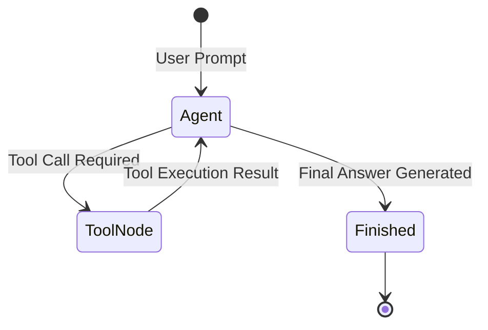

# 📹 What is Agentic AI? Important For GEN AI In 2025

<div className="video-card" style={{border: '1px solid #30363d', borderRadius: '8px', padding: '16px', marginBottom: '24px', background: 'rgba(56, 139, 253, 0.05)'}}>
  <div style={{display: 'flex', gap: '16px', flexWrap: 'wrap'}}>
    <div><strong>Instructor:</strong> Krish Naik (Krish Naik)</div>
    <div><strong>Duration:</strong> 22m 36s</div>
    <div><strong>Playlist:</strong> Real-World Multi-Agent Frameworks (Krish Naik)</div>
    <div><strong>Watch Link:</strong> <a href="https://www.youtube.com/watch?v=xOS0BhhdUbo" target="_blank" rel="noopener noreferrer">YouTube Lecture ↗</a></div>
  </div>
</div>

## 📌 Executive Summary & Learning Objectives

This lecture covers **What is Agentic AI? Important For GEN AI In 2025**, focusing on production implementations, edge cases, and industry standards:
- Core intuition, architecture, and underlying mechanisms.
- Key differences between theoretical research implementations and scalable enterprise patterns.
- Concrete Python walkthroughs, error recovery, and performance optimization.

---

## 🏗️ Architecture & Conceptual Workflow



---

## 📖 Core Concepts & Technical Deep Dive

### 1. Architectural Foundations
In modern production AI engineering, **What is Agentic AI? Important For GEN AI In 2025** is essential for ensuring reliability, low latency, and deterministic outcomes. As AI systems evolve from naive prompt-in / completion-out scripts into distributed systems, engineers must handle:
- **State management & consistency:** Ensuring intermediate states and tool invocations are tracked.
- **Error boundaries & recovery:** Graceful degradation when external LLMs or vector stores encounter rate limits or network partitions.
- **Resource utilization & cost efficiency:** Caching common queries and reducing unnecessary foundation model token expenditure.

### 2. Operational Considerations
- **Latency Optimization:** Pre-computing embeddings, utilizing asynchronous non-blocking event loops, and streaming tokens via Server-Sent Events (SSE).
- **Security & Sandboxing:** Validating inputs before ingestion, sanitizing LLM outputs, and isolating tool execution environments.

---

## 💻 Production Implementation Walkthrough

```python
# Production Implementation Blueprint
def run_production_pipeline():
    print("Executing production pipeline...")

if __name__ == "__main__":
    run_production_pipeline()
```

---

## 💡 Production Best Practices & Tips

:::tip Production Deployment Guideline
When deploying What is Agentic AI? Important For GEN AI In 2025 in enterprise environments, always configure automated retries with exponential backoff and telemetry tracing (such as OpenTelemetry or LangSmith).
:::

:::warning Common Failure Modes
Watch out for state contamination across concurrent requests. Ensure each session or user interaction uses an isolated thread ID or execution context.
:::

---

## 🎯 Key Takeaways & Quick Reference

| Dimension | Production Standard | Pitfall to Avoid |
| :--- | :--- | :--- |
| **Execution** | Async / Non-blocking with timeouts | Synchronous blocking calls in event loops |
| **Data Validation** | Strict Pydantic v2 schemas | Untyped dictionary access |
| **Monitoring** | Distributed tracing & latency percentiles | Relying only on standard console logs |

## ⏱️ Lecture Timeline & Key Topics

| Timestamp | Key Topic / Concept Discussed |
| :--- | :--- |
| **00:00:00** | hello all my name is Krish naak and... |
| **00:05:46** | respect to the recent news that are... |
| **00:11:53** | compare and say that hey compare between... |
| **00:17:09** | deploy this in an amazing way so this is... |
| **00:22:34** | great day... |


---

---

## 📜 Complete Lecture Transcript (English)

> **Language:** English | **Source:** `02 - Tutorials 2-Live Getting Started With LangGraph For Building AI Agents.en-orig.srt` | **Total Segments:** 35 | **Word Count:** ~10,722 words

<details>
<summary><b>Click to expand full chronological transcript (35 timestamped intervals)</b></summary>

#### ⏱️ [00:00 ➔ 00:02]

[Music] Heat. Hey. Hey. Hey. [Music] Hello guys, I hope I am audible. Let me just hear my voice also if I'm a Yeah, perfect. I'm audible. So, let's just wait for some time and then we will probably start. So if you're new to this channel, please make sure to hit like, press the bell notification icon because from today we are going to have one amazing series going forward, right? It'll be fun. It'll be super amazing. Okay, is there some prerequisite for this? Everything I'll discuss about it. Don't worry, we will go step by step. Do make sure to hit like because this is right now one of the most interesting session or series of session I will be coming up. Sayyad sik says also when video for MCP will come why there is so much urgent with respect to MCP let it evolve completely I don't want to upload it right now you know let it evolve still things are being developed once it comes to that particular stage I would be happy to discuss about it right but right now it's not the time to discuss because there's still many things that are being developed right now I want to show you examples with respect to different different frameworks also right Is lang graph the thing to get you job? Um see again I'll tell you what is important in langraph. Why langraph you should learn each and everything today

#### ⏱️ [00:02 ➔ 00:04]

right? Uh collab sir with whom? Yeah collab thank you for making this series perfect. Uh so today we will have this this is just an introduction session. We will start with something we'll try to understand what are the prerequisites and many things as such. Okay. Okay. Uh just let me know uh whether uh my screen is visible or not. I don't know whether this issue will come or not. I don't know exactly. Uh just give me a second. Yeah, just let me know if my screen is visible. Don't worry about agent protocol A2A. See things which are being developed. there's a right time to learn something, right? So, don't worry about it. So, just let me know if you are able to see my screen. Yeah. So, start building your own foundation model from scratch. Give me GPUs. Give me some amount of money. I'll be happy to do that. Okay. See, we are restricted. Main is cost, right? We'll pay for it. That is the major thing. Okay. Perfect. Great. So shall we go ahead and start? Yeah. So I hope everybody will be able to see my screen. I hope you are able to uh see all the information in the description of this particular video. Here our plan is basically to probably complete the entire series of videos and this specific series of video uh we will be learning how to build agentic AI system which is one of the most important thing that is currently going on. It's all about AI agents agentic AI everything as such you know companies are specifically focusing on developing this kind of agents for their software purpose. Okay. Uh recently I had also been to Nvidia GTC. So from there also I understood like many companies are

#### ⏱️ [00:04 ➔ 00:06]

probably building many things as such. Okay. So it's time that we take an opportunity to learn about this learn in an amazing way. Learn in such a way that we are able to build any kind of complex workflows. I'll discuss about what exactly workflow is and each and everything. Okay. So uh let's go ahead. Our agenda already my first video was on something called as pyntic. I hope everybody has seen that specific video. Yes or no? Just give me a quick yes if you have actually seen my pyic video because this is the core behind understanding Langraph and implementing amazing projects with the help of Langraph. Okay. Today uh in this session as we are just getting started I will just go ahead and write some topics. Okay. If you have not seen go ahead and check my YouTube channel that's it simple already the recorded videos uploaded. Okay. So here our main thing is that we will start getting we'll start with something very important. So what is the agenda of today's session? So since this is just the day one right the agenda that we are basically going to cover is to understand what is the difference between AI agents versus agentic AI. Okay. Now this is the topic whenever we discuss about what is agent uh AI agents versus agentic AI many people say that it is same. So please don't go ahead with this okay there's a pure difference between the AI agents and agentic AI that is what we are basically going to focus on. The second thing is that uh we will try to get an understanding about langraph. Why langraph? Why should we learn about langraph? what kind of problem statements we'll try to solve it you know and then I hope everybody also got a brief idea about lang chain so I will also talk about

#### ⏱️ [00:06 ➔ 00:08]

lang chain and many people say that hey langchain is not that good to probably go ahead and develop application to production okay so that misconcept also I'll try to clear it up okay so we will just go through this lang graph and then finally we will solve one amazing use case with the help of langraph a amazing use case basically means a simple use case so we'll just get started with all these things right so here we are just going to get started and we'll build or we will build an agentic we'll build or I can just write we will build a complex workflow not complex since this is our first one so we'll build a simple workflow using lang graph Okay. So all these specific topics we will try to cover. Now when I'm saying that we'll build simple workflow using langraph that basically means we are just going to go ahead and code each and everything. Uh while we are building we will be learning about various concepts over here. Okay. There are some important components. We'll talk about graphs. We'll talk about nodes. We'll talk about u functions within the nodes. Each and everything. Okay. So step by step we will try to cover it up. I hope you are super excited onto this and I hope you are uh you know you probably watching my series both from YouTube and uh LinkedIn. So please make sure to hit like and uh make sure to probably keep on practicing once I complete the session. Okay. Now the first question is that how do we proceed with understanding about AI agents versus agentic AI? Can anybody probably talk about that? You can write that information in the chat itself. Okay, come on. Let me know what is the difference between AI agents and agentic AI. So this is the first topic that we are going to discuss about what is the

#### ⏱️ [00:08 ➔ 00:10]

difference between AI agents versus agentic AI. Okay, let me know. Okay, is there any prerequisites to understand it? Right now the only prerequisites that you require is Python and some knowledge of generative AI. That's it. Okay. To start building application as such. Okay. So Tom Cohen says agentic AI is an app of AI agents. Amazing. Perfect. So one detailed video please on the road map of data science to geni to agent. I've already created that. No worries. Uh AI agent is nothing but it is called a single agent. Single agent called. Okay, perfect. Uh I have also got this response from Tom. AI agents is a software program whereas agentic AI is an entire automation of workflows using agents. Okay, perfect. This looks good. Okay. Um agentic AI multiple AI agents complex structure. Perfect. So here also we have some like agentic AI is a system of bunch uh system of bunch of AI agents working together. This looks good. AI agent is task focused while agentic AI is goal driven and act with more autonomy. Amazing explanation or Ali this is good. Okay so I think most of our my students only from the first batch of agentic AI I guess AI agent does one job when asked. Agentic AI thinks plan and does many things by itself. Okay. one point everybody's probably missing which we are going to discuss about AI agents using uses external tools agentic AI systems also uses external tools okay perfect so let me just go ahead and I hope many of you have answered uh correctly but again it is better that we try to break down this entire explanation completely right so

#### ⏱️ [00:10 ➔ 00:12]

first of all I will just go ahead and keep two different point one is AI agents and one is agentic AI, right? So, this will basically be my agentic AI. Okay, we basically say agentic AI is agentic AI systems. Okay, this is really important to understand. So, first thing over here, I will just go ahead and define a definition. AI agents refers to some software. Okay, some software programs. Okay. Designed to perform specific task. Specific task without human intervention. Okay. We can say human intervention. We can we can also say with a degree of autonomy. With a degree of autonomy. Does this make sense everyone? Simple definition over here says that AI agents refer to software programs designed to perform some specific task without human intervention or with a degree of autonomy. So there is some kind of degree of autonomy. We can also include human intervention that also we'll try to discuss about it. But this is what a specific definition looks like. Okay. Similarly, if I talk about agentic AI system, okay, these are like some kind of frameworks. It describes a framework where multiple AI agents, okay, can

#### ⏱️ [00:12 ➔ 00:14]

collaborate. Can collaborate and make decisions independently. Make decision independently. to achieve a larger goal. Larger goal. Okay. So, here is a basic definition that you can probably see over here, right? Frameworks where multiple AI agents can collaborate and make decision independently to achieve a larger goal. So, just by the definition, do you get a clear idea what is the exact difference between AI agents versus agentic AI system? Everyone can you give me a quick confirmation? Yes, please can you give me a quick confirmation? AI agents are specific application that perform task within a uh defined scope while agentic AI is a broad framework that allows for autonomous decision making and all. Perfect. Okay. So yes, definition may differ based on different different things based on different different LLMs that you're trying to generate. Okay. Now let me just give you a good example so that you should be able to understand. Okay. So some let's let's consider some examples. Let's consider some examples. Now let's say that and why we are specifically learning in the era where LLMs are very much famous right now. Right? So we are trying to learn in that. Let's say if I have a specific LLM. Okay. So let's say if I have a specific LLM. Now tell me let's say that I use some open AAI older LLM models. Okay. or I use any kind of models if I give an input will I be able to get an output right let's say that I give an input hey hi how are you then LLM will say that hey buddy I'm good I'm a very

#### ⏱️ [00:14 ➔ 00:16]

good AI agent oh sorry AI LLM model who can guide you in multiple things okay something like that but if I say hey please provide me please provide me provide me the recent recent news for date March oh sorry for the recent news for April 11th which is today if I ask this specific question do you think my LLM will be able to answer this is a very common question that you get right if I ask any question that is related to the recent thing I'll say hey tell me what is the temperature of Bangalore. What is the temperature of Bangalore currently? Will I be able to get the answer? No. Because the LLM do not have that specific information because LLM are specifically trained with data, right? They are trained with data and you know they they get they keeps on getting trained as they keep on getting more and more data itself, right? So here what we do we try to integrate this LLM with an external source with an external data source. Yes. Now this external data source can be an API. It can be some kind of databases. It can be some kind of something else you know it can be some some external things. Right? So if the LLM is not able to answer, then LLM is smart enough you know to probably push that request to some other external data source where they get that specific information and from this they get back the output in the kind of

#### ⏱️ [00:16 ➔ 00:18]

structured output they want right how the LLM want in that form of structured output this LLM will be able to convert it let's say they get the information in JSON then LLM converts that information is some kind of structured output and that information is sent as the output right it is basically send that as the output over here I hope you are able to understand now see something very important here LLM is working independently and redirecting a query to an external data source and getting the output over there don't you think there is some kind of degree of autonomy over here some kind of degree of autonomy. So here what is basically happening this entire this entire work that is specifically happening we can consider this as a basic example of an AI agent. Yeah, we can call this as a tool. We can call APIs. We can call databases. Whatever things we can call. But here you can see that LLM is smart enough to probably know that when to make a request to some external thing if it is not able to get the answer from itself. Let's say if I go ahead and ask hey LLM tell me about the research paper. Attention is all you need and I give the research paper name or number a unique identifier number. Right? So, LLM will not have that specific information. So, what it'll do, it'll go ahead and communicate with the external tool. And this external tool will be nothing but one of the tool that is available which is called as RSV tool, right? Where all the research papers are there. We can take a reference of that as an external database and get that particular information. Now you can just understand some kind of task is being performed and this entire application is able to do that specific single task right at one point of time it can communicate with the tool at one point of time it can communicate with some kind of

#### ⏱️ [00:18 ➔ 00:20]

APIs. Does this make sense everybody? Yeah. Yes. Yes or no? I hope you have got an understanding of clearly things right. Yeah. Yes. Yeah. Perfect. Right. So here one independent task not many task right here my simple task is that whenever I get an input I should get some kind of output and my LLM is probably integrated with some kind of tools or an API. You can integrate multiple things and get an output with respect to that. Okay. Now the next thing what we are going to discuss over here is that see we'll take an example of agentic AI system. Now now how does agentic AI system work right here whenever we talk about agentic AI system this is a broader framework. This is a broader framework. Now here instead of just one single AI agent, one single AI agent which is able to do a specific task here multiple agent a multiple AI agents will be available. Multiple AI agents will be available and the best part will be that they can communicate between each other. They can communicate within each other to solve a problem statement or to reach a specific goal. Reach a specific goal. Yeah. Now see this. This is the most amazing thing. Now let me talk about one very good example. Okay. Very very good example. Okay. I have a use case. you know I keep on uploading lot of YouTube

#### ⏱️ [00:20 ➔ 00:22]

videos. Okay. Now tell me if I want to develop an application wherein I need to convert my YouTube videos into a blog generating platform into some blogs right now tell me how many people I need to probably keep over here. Let's say as soon as I upload the YouTube video, there should be one person who is responsible in probably creating the script then converting the script into in the form of content, right? And for this particular content, he has to probably decide the title. He has he or she has to decide the description and he or she should also decide the code part, right? And then there should also be something like conclusion part. Right? Conclusion part. Yes or no? Do you agree? Just imagine one person doing all this work. Now that person needs to also have a good coding knowledge. That person also needs to have a good content knowledge. That person should also have a knowledge to create or write some amazing titles. Don't you think I can convert this entire work and give this entire task to an LLM to do it? Yes or no? Yes. Yes. Yes or no? Now just imagine here there are multiple tasks that is specifically happening. One task is to convert YT videos into script. This is my first task. then my script into content which is my second task and this task is divided into multiple subtask right now just imagine how many different kind of AI agents I'll be requiring over here agree yes or no let me know if you are able to understand guys come on give me a quick yes hit like are you able to understand

#### ⏱️ [00:22 ➔ 00:24]

this specific stuff what I'm actually saying it is very much clear that you really need to understand it why I teaching all this specific stuff that is the reason then only you'll be able to understand all this fundamental things that we are going to learn in langraph we are going to learn in probably in the upcoming sessions and all we'll see MCP also okay so here different different task work is specifically happening you can clearly see this right now for this kind of use case what should be my workflow my workflow should be something like this as soon as I upload my vet video so this is my YT video right it is uploaded I should probably define or disccurse this task where my LLM or I should probably write some kind of code which should convert my video video to or let me just create this. My first task let's imagine what is my first task. My first task is basically to convert my video YT video to some kind of transcript. Right? I have to probably do this task. Huh? Yes. Now, first thing is that I have to probably go ahead and create this YT to transcript. That basically means from the YT video, I should be able to create the transcript. So, we will just go ahead and write some kind of code over here for doing this. Okay. And the best part is that even Langchain has the integration of YT APIs where we can read the content from the video itself. Okay, second task. What is my second task? We will take this transcript. We will taste this transcript and probably create all the specific subtask wherein we are going to convert this into title. Then description, then the code part and then finally conclusion. Who will be doing the specific task? This task should be done by a separate AI agent. So this task of converting the YouTube

#### ⏱️ [00:24 ➔ 00:26]

video into transcript should be done by a separate agent. Now once this agent does the specific work then it passes this specific information to the next stage. Okay? I hope you are able to understand this over here guys. Right? So one agent is doing the work. The output of that specific agent is passed to the next agent and then the next agent will be able to perform that particular task. So this creates some kind of workflow right some work is basically transformed from one stage to the other stage like let's say instead of human being over here we are making the AI agent to do one task and then probably provide the output of that task to the other AI agent does this make sense so in langraph you'll be able to see that how we do we create this particular workflow first we will go ahead and start okay so this will basically be my start the next step will be that we will create some kind of task which is going to convert YT to transcript. Okay. Then YT2 transcript will once we get this particular transcript we will send it to the next one. The next is my AI agent which will be my blog generating agent. Blog generating agent. Once this block engine generating agent will create this will basically be my end. So this is the workflow that we are going to follow. Okay. The start will be that whatever input I'm giving based on that input it goes to the next step. The input will be nothing but the video URL. The YT video URL. Then we convert the YT video to a transcript. Then this transcript is basically done by my agent one. Then this agent one will give the output to the agent two. This is my agent two, right? We can also add some more things. Let's say the agent two, we will go ahead and add, hey, we can also add feedbacks. Go ahead and add some

#### ⏱️ [00:26 ➔ 00:28]

kind of feedbacks and tell that hey, regenerate this specific agent, re regenerate this entire uh transcript again with some changes, with some modification. So this cycle can keep on repeating. But the main thing that you can see over here is that the interaction between this independent agents are definitely there. And why we are doing this is to solve the final goal which is nothing but in this particular scenario creating an blog. Creating a blog. Does this make sense? Is if it is sequent sequential and mandatory steps do we need to use agents? Yes, use it. Because see LLM are smart enough to do all this kind of task, right? So I'll be happy to use this. Okay, I'll be happy to use this because automatically based on the input my LLM is going to give me the output. It need not always be sequential. We can also do conditional. Okay. And that is what I will be showing you as we go ahead with a very good example. Does this make sense everybody? Are you able to understand? Are you able to understand each and everything whatever I have discussed till now? because this is just a simple step because there are many things that we have to probably discuss as we go ahead. So if you if you like this please do make sure that you hit like. I'm putting a lot of effort in teaching you all this specific stuff. It is completely for free. Okay. Is it possible that in the near future we'll be having AI agents and they will do the they'll be doing the jobs? Yes. for every company is not they are looking to focus on building the AI agents. Okay, let me talk about some of the example. Okay, many companies have built their own chatbot. That chatbot may be interacting with an external database. It will interacting with some kind of APIs to give just the

#### ⏱️ [00:28 ➔ 00:30]

information. That is one very good example with respect to the AI agent itself. Yeah. And every company will keep on doing this because recently I I have spoken to many many people out there who are there in the industry. Everybody is focused in building these AI agents because this reduces cost. It automates so many different complex workflows, right? That is the most beautiful thing out there. Okay, clear everyone? Yes. Now let's move towards the practical application and let's do some kind of examples. Is is everybody ready to do some kind of examples? Yeah, I hope everybody's ready. Yes. So let's start with this example. Before we start coding part, right, we need to understand some of the key terminologies. Okay. Let's take this graph itself or let let me define a simple workflow. This is what is the workflow that I will be designing. Let's say I'm going to go ahead and start. Okay. After this particular start. So transcription or long YT video can lead to more computational power. Right? Yes, it can. But just imagine that all things will be happening back end, right? Every hundreds of videos will not be there. Only one video every day may be there. Max to max. Okay. Himmanu says I have built a agent which replacing team of 1500 financial. I that's enough to conclude the relevance. Yes. See now so much of data is basically there human being are very much skilled you know they have to be really skilled. You're not some storage device. Let that work the hard part of the work be done by a AI the other part the smart work should be done by the human being. Okay. So let's say that I'm going to probably go ahead and define this specific use case. Okay. And in

#### ⏱️ [00:30 ➔ 00:32]

this use case, the best part will be that what we are basically going to do. Okay, what we are going to do? Let's say this is my start. Okay, let's say tomorrow morning I wake up and I want to create this kind of workflow. So after starting I will just go ahead and play. Okay, I as soon as I get up I will go ahead and play. Okay, I'll wake up. I'll freshen up and I'll play. Okay, now let's say that I have two different options for playing. Either I can play badminton, either I can play cricket. So this is the complex workflow that I am defining from my side. Okay. Later on we'll add more complex workflow with the help of LLM. But I want to start with this example because here you'll understand some of the key terms that we specifically use in langraph. Okay. So from the play I have two conditions. I can either I can play badminton or cricket. Okay. So these are like my conditionals conditions either I can go through this stage or this stage and finally whichever stage I go I will play and I'll end my day okay or I'll end my morning. So let's say this is a workflow that I want to probably go ahead and execute it execute it or I want to automate using langraph. Automate using langraph. Okay I want to automate using lang graph. Now this is the steps that I really want to do it. Now here there are some key terms that everybody should remember. The first key terms is that whatever square boxes that you are seeing this square boxes are nothing but these are my nodes. Okay. So the first thing that we have understood that my square boxes are nothing but these are my nodes. Now what is nodes? Nodes are nothing but they are some kind of Python functions. Okay, Python functions. And

#### ⏱️ [00:32 ➔ 00:34]

we can also say this as some kind of task. Clear everybody? Does this make sense? Yeah. These are some kind of task. Okay. So nodes Python function task. Clear? The second thing is that over here I hope everybody's clear with this. The square boxes that you are seeing over here, these are nothing but nodes. Nodes are nothing but Python functions. or you can also say a task in this specific workflow. Okay. Then the next step we will go ahead and we'll try to see what is the next thing. So the second thing is nothing but we will call it as edges. Now what is this edges? Edges nothing but it connects the nodes. It connects the nodes. So from one node to the other node you will be able to see that it is connected and one type of edge is also there which is called as conditional edge. Conditional edge basically means wherever there is a condition whether I should go in this path or this path we will say it as conditional edge. Okay. Okay everybody. The third important component that is available over here is something called as state. Now what exactly state is? State is nothing but it is a schema. So I'll write it as state schema. It serves as the input for all nodes. Okay. For all nodes. So now let's say that here in this particular scenario you know that I have to create title I have to create description I have to create code part I have to create conclusion right so this actually is my state variables okay that needs to

#### ⏱️ [00:34 ➔ 00:36]

pass through every node it needs to probably reserve this entire information in every node and where it is basically reserved in the state schema. Okay. So this serves as a input for all the nodes, right? So in this particular scenario, whatever information we are generating in specific in form of fields, right? Let's say title, description, code part, conclusion, these are some kind of content and we want to save this information in all this particular nodes. So at that point of time, we will try to create this particular variable in our state schema. Does it make sense everybody? Yeah. Are you liking it? Yeah. Yes. Yes. Yes. Everybody, can I get a quick confirmation? Are you able to understand things or not? Yeah. Am I trying my level best to teach you? So, if you like it, please make sure to hit like, press the bell notification icon, share with all your friends. Everything that I'm trying to teach you, nowhere you'll get this kind of explanation. Even from the Langraph documentation, you'll not be able to get it. Okay? So just try to see this what I'm actually explaining. Okay. Then the fourth component. What is the fourth component? Fourth component component that you will be probably seeing is it it is called as state graph. State graph. Okay. Now what is the state graph? The explanation is very simple. It is nothing but the structure of the entire graph. Very clear. I hope this is very much simple. So based on this four components, one is the node. Now in this particular example, this is the node. This is the node. This is the

#### ⏱️ [00:36 ➔ 00:38]

node. Okay. Which are the edges? These are my edges. So here you can see these are my edges. Edges basically means the flow of information. State schema in this what is state schema? Uh we will define some kind of state schema like let's say a boolean variable whether I should be going over here or here. Okay. Or which sports I'm actually going to play that we'll discuss. And state graph actually indicates the entire structure of the graph. Okay. Now it's time that we should definitely do some kind of coding. Yeah. And some kind of coding whenever I say we have to probably do some kind of coding in this case. Okay. So let me do one thing. Let me quickly open my So if you remember this is my code today. I will be giving all the codes in my uh link that is present in the description. You can register it for completely for free. And there also uh we are recently announcing our new batch. If you are interested you can also join that. Okay. So we are announcing our 2.0 batch on data science on agentic AI. Okay. So 2.0 live agentic AI generative AI boot camp with with cloud boot camp. Okay. Here we are going to teach you everything that you require in order to build agentic AI system. Okay. All the information is basically given in the description. Here you'll be able to see the entire course detailed syllabus. It is up to you. Go ahead and join it. uh if you can because here we are completely developing completely from basics. This is like four to five months course. Okay. And we cover everything that is related to agent and generative AI with cloud. Okay. So if you are interested in this just go ahead and check it out in the description of this particular video. Okay. So this was the second information that I have. Now already whoever has seen my last video on pentic in the series of langraph. How

#### ⏱️ [00:38 ➔ 00:40]

many of you have seen the pyentic video? How many of you have seen the pyantic video? Everybody, can I get a quick yes if you have seen uh what's the cost of the course? You can just go ahead and check it out. Mohammad Rizawan in the description. It is available. Just go ahead and check it out. Okay. Um and you if you have any queries, you can also talk to our counseling team. Okay. So, have you seen the pyantic video? No, you've not seen it. Okay. So, I have already created that. If you go to my YouTube channel and search for Krishna. Okay. So here you can see uh Krishna. If I just go over here and if you just go ahead and see the playlist playlist option here you'll be able to see that this was the first tutorial pentic right. So it is a 30 minutes video. I would suggest please go ahead and have a look. Okay. Yeah. Udemy courses on not complete agentic AI agentic AI with lang graph will be separate with creoi it will be separate and all right so if you just go ahead and see the specific video here we have discussed about pyntic completely from basics uh this is must before we start langraph okay but in our live courses we take everything from basics and we cover it okay and this is what is my second session that is going on okay so here you can see my face and I've been teaching all this specific stuff okay so that is the playlist. Now what we are going to do, we are just going to go ahead and do the some coding over here. Okay, everybody is ready for the coding. I hope everybody knows how to create an environment variable. Yeah. Yes or no? And we will just start creating a simple graph. Okay, simple graph. We will try to create simple graph. And remember this graph this this workflow that we are defining we will try to create it. Okay, so here first of all I will just go ahead and create one langraph folder. So, langraph basics. Okay. Lang graph basics. This will basically be my second

#### ⏱️ [00:40 ➔ 00:42]

one. Okay. And here we are just going to create a simple graph, right? So, I will just go ahead and write simple graph ipy nb. Okay. Now, with respect to this simple graph, first of all, we have to go ahead and see in our requirement.txt what all specific things we require. Okay. Now, in our requirement.txt, txt I'm going to probably go ahead and import some of the libraries uh like this four libraries let's say so one is paidentic we have already imported it then we have langin we have lang graph we have langin core and langin community okay so all the specific libraries we are going to use it over here okay and then I will just go ahead and open this and then I will write pip install minus r requirement txt okay so here you'll be able to see that all these libraries will get started installing in my venv environment. Okay. So will that be live classes or existing videos that will be live classes. I usually take live classes. Our team takes an entire live classes. Uh you can just go ahead and explore out everything is given in the description of this particular video. You can even contact our counseling team to guide you what all things you know and based on that we will suggest you free resources or any kind of courses. Okay, perfect. So this is basically getting installed and then I will start working on my simple graph ipinb. Okay, and our main aim over here is basically to create u that simple workflow that we have discussed about. Okay. Uh in real time lang not preferable. Right. I'll tell you why Anil why people say that langchain is not preferable for production based application because lang chain when they initially created right there are lot of changes that they were continuously bringing. They were moving one module to the other module. They were taking one stuff to the other stuff. But that same thing is not happening with langraph. Right. Langraph is quite stable. Yes, we

#### ⏱️ [00:42 ➔ 00:44]

use some of the components from lang chain uh which we get that particular information but I think lang graph is much more stable uh when when we talk in terms of building aentic application okay can I show this video later uh this is recorded yes it is recorded you can check it out okay now let's go ahead and discuss about this everybody let's go ahead and create the simple graph are you ready we will try to create this entire simple graph okay first of all start play badminton cricket as I said there are nodes, right? There are one node, two node, three node, okay? Three nodes, right? Then there are edges. Edges are also there. There is one conditional edges. So, you will be seeing that how do we go ahead and define it? Everybody ready? Yes. Yes. Yes. Yes. Can I get a quick yes if you're ready? Yeah. So let's go ahead and first of all start uh with uh creating our state schema because initially as I've already told you the state schema will be important because we need to say that hey what inputs are probably going inside this particular graph. So for that what we do is that we will first of all go ahead and import from type extension from typing and extension import type dictionary. Okay, this type dictionaries we are specifically using because any type of time you know whenever my graph gets executed it should retain all the information inside this state schema in the form of dictionary okay like a in the form of JSON with the key value pair right so the first thing what I will do I will just go ahead and write class and this will basically be my state class and this will be inheriting my type dick that basically means whatever input I'm going to give it to my workflow will be having the variables that is present inside this. Okay. So here I will just go ahead and write graph_info. This will be your string type. Okay. So this is the information that will be flowing or that is available inside my state schema that

#### ⏱️ [00:44 ➔ 00:46]

will be flowing throughout my workflow. Okay. So everybody clear? Okay. So here uh let me also put some definition so that you should be able to understand each and everything what I'm writing. So here we are building a simple workflow graph using lang graph. Okay state first of all we define the state. First define the state of the graph. The state schema serves as the input for all nodes and edges in the graph. Let's use the type dictionary from the Python typing module as our schema which provides type hint for the keys. Okay. In the form of key value pairs. Is everybody clear till here? Yeah. Yes. Yes. You'll be seeing that we'll be building this entire stuff. Okay. Fine. Our state schema is ready. Okay. Now the next thing is that I will go again back to my this particular workflow. Now here we have to first of all think like how many nodes are there. There are three nodes. One is play node, one is badminton node, one is cricket node. This play node think about the logic it should have. we have to write some kind of logic which will decide either we have to go to the badminton or either we have to go to the cricket right node. So for this we will first of all go ahead and define our nodes itself right and nodes are nothing but it is python definition. So what I will do first node I will go ahead and create my python definition. I'll say hey definition start play. Okay and this start play as you all know my state schema should also be given as an input over here. So I will pass my state over here. Okay. And this state has that graph info value. Okay. I will go ahead and write print some print option and I'll say start start play node has been called. Okay. Start play node has been called. That basically means as soon as I go inside this I'm putting the specific information saying that hey start play

#### ⏱️ [00:46 ➔ 00:48]

node has been called. Okay start play node has been called. Okay then we are going to return something. Now this return is really important because whatever is my state schema variable that state schema variable is nothing but graph info. I should provide some information over here and what information I'll provide okay whatever the state graph info value that I had because any time of time whenever a node gets executed this variable needs to get updated based on that particular node. Okay. So here I will write state graph of info and I will add a message over here. I am planning to play. I am planning to play. So what happens is that as soon as this node gets executed inside my graph info this messages will get appended that is what is basically happening right so here we are writing this in the form of key value pairs the reason is because this is inheriting type date right it should be in the form of key value pairs so as soon as this nodes gets executed the start play nodes get executed this is the message that is basically getting appended okay similarly I will go ahead and define my Next node that is cricket. Okay. Now cricket is nothing but here also I will go ahead and write state. Okay. This will inherit the state. And here let me just go ahead and write the print statement saying that hey um cricket cricket node has been called has been called. Okay. And similar thing I'm just going to go ahead and update this particular message. I am planning to play was added when this node is basically getting executed start play. And in this particular case I will just go ahead and add cricket. So what will happen initially as soon as start play will get executed it will say it will append a message I'm planning to play and then if cricket gets executed it will append on top of that cricket. I'm planning to play cricket. Similarly, if

#### ⏱️ [00:48 ➔ 00:50]

badminton is selected, right? That was my third node. If badminton is selected, here you'll be able to see my badminton node has been called. Graph will get updated with the badminton. So that basically means my three node definition is done. Okay. And if you remember how many nodes I had play, badminton, cricket. Now how to go from this to this or this to this? That will define inside our state graph. not here. So initially we have defined all the Python function. Okay, simple definition with that you know and later on when we implement LLM right inside this all the LLM calls will happen and the content generation will happen. Okay, content generation will happen. Okay, now let's go to the next step. I hope till here everybody's clear. Can I get a quick yes? Yeah, I hope everybody's able to understand something. Maxwell says, "Love this course." Thank you. Yeah. Thank you. Thank you guys. Are you able to understand what I'm writing the code over here? And trust me, this is just the basic example, the capability that you'll be able to understand and solve some complex use cases. Ra it is quite amazing. My students, I'll tell you what kind of workflows they have implemented. Huge workflow. The entire software development life cycle workflow they have implemented it. you know from business planning to requirement understanding to requirement gathering to coding to probably implementing all the stuff that we do in the IT company it has been automated completely with the help of Langraph okay that is the power that we teach in the class you know and the kind of assignments that we give is quite amazing so you should definitely experience it okay now this is what we have done we have created all our three functions and we are good to go now let's observe in our workflow here we have some conditions. Okay, this condition is very important. We created

#### ⏱️ [00:50 ➔ 00:52]

our node definition but we did not define any conditions like whether we have to go over here or here. So for that we will create another function. Okay. So I will go over here. I will just go ahead and write it over here another function. So I'll execute this three node function. And now I will just go ahead and write import random. And here what I will basically do is that from typing import literal. Now literal basically means constant. Okay, constant. Now you know that why I'm using a constant because see if I go over here my play should decide whether it has to go to badminton or cricket. Okay, that is what it has to decide right and that is decided by this function. I'll say hey definition random play and here let me just go ahead and write state of state and this should return a literal okay okay literal of either cricket or badminton okay it should either return cricket or badminton that is what I want right my this random play random play should probably decide hey whether I should go towards badminton or cricket and that is the Then we have defined and this basically maps to the same function name cricket or badminton. See the same function name. You cannot write separate name. Okay. Then it'll not match. Okay. Now once I go inside this I will just go ahead and write graph info is equal to I will just go ahead and read my graph info that is present in my state schema. And here and no need to even read this because I don't require it. I'll just put some random condition. And I'll say hey if random dot random is greater than 0.5 I'll say I'm saying that hey if it is greater than.5 you just return cricket

#### ⏱️ [00:52 ➔ 00:54]

else return badminton that's it okay here what we are saying hey we are I'm just doing some dice throw 50/50 50% probability if random.random is greater than 0.5 return cricket otherwise return badmintton and that is what we are returning. So this function is deciding which part to go from this play option. Okay so I hope you are able to understand this is basically deciding which part to basically go. Okay and this is what is my another function that we have defined. So four different functions four nodes one is start play cricket badminton and random play to decide which part to basically go. Okay. Does this make sense everyone? Yeah. Does this make sense? Don't worry about MP MC MPC. It's a very simple thing. Learn something from basics. That is important. Okay. I know everybody's interested. I can show you 100 different types of code for MCP. You'll not understand anything unless and until your basic is not clear. Okay. Yes, everyone. Does this make sense everybody? Now it's my next step to design the entire graph. Okay, design the entire graph. Okay, I will give you the code. It'll be available in a description link. Okay, just go ahead and register it over there. Okay, ready? Ready with the next step wherein we are going to construct the entire graph. So for constructing the entire graph as you all know here you can see there is start, there is end. we have to go in this structure where I have play where I have badminton cricket and we'll connect all these graphs. So first of all we will import these two one is from ipython dot display import image display then from lang graph.graph import state graph state graph basically defines the entire structure of the graph and then we have the start and end node. Okay start and end node basically indicates the start of the graph and the end of the graph. Okay, this is what we are basically

#### ⏱️ [00:54 ➔ 00:56]

importing. Now we are just going to go ahead and build the graph. Okay. Now for building the graph I'll go ahead and write graph is equal to state graph and I will just go ahead and give the state away. I'm initializing my state graph. This is nothing but this is an empty graph. Okay. Now the first step is that we need to go ahead and add all the nodes. Add all the nodes. Now what all nodes we have basically created. Start play is one node. Cricket is one node. Badminton is one node. Okay. So first of all I will say hey graph graph dot add node and inside this add node I'm just going to go ahead and add one node which is called as start player. Okay this is the node name right the first parameter is the node name and the second parameter is my function name. Okay you can give any name over here but I'm just keeping the same name as the function. So this is my first node. The second node is again what? Cricket and bandmitten. Right? So I'll copy this. I'll paste it over here. I'll paste it over here. So this is my second node cricket. Here also I will just go ahead and write cricket. And here also I will just go ahead and write badminton. Here also I'll go ahead and write badminton. So this is what I have done. My three nodes are ready. Okay. All these specific nodes I require. Okay. You may be thinking Krish what about this? This we will add it in a conditional edge. Okay, not in not in nodes. Then we will go ahead and schedule the flow of the graph. Now I have added three nodes. Now one node from start to the next node we should try to connect it. Okay. So first of all what I will say I will say hey graph dot add edge. So we will start with the first one. The first edge is nothing but start from start to play. Okay, start to play. So here I will just go ahead and write

#### ⏱️ [00:56 ➔ 00:58]

start to play is nothing but the start play node. Okay, so this is my first edge. This is my first edge. Okay, from start to play. Then from play either I should go to badminton or cricket. Now here I have a conditional edge. So for conditional edge we need to add a conditional edge. So I will write graph dot add conditional edges. And here I will just go ahead and write start play. Okay. And here start play should call which function? The start play should call which function? It should call random play. Okay. Random play. Now random play output is either cricket or badminton. That basically means that node will get called automatically. Right? Because that is what the node is basically defined over here. Right? So that node will be called. That basically means this start play is going to get automatically integrated either with cricket or bminton. Okay? Then we go ahead with the next step here. I'm going to add graph.add edge and from my cricket I should be ending it. Okay. So this will basically go to end. And even from my badminton, I'm just going to go ahead and end it. Badminton, we are just going to go ahead and end it. Okay, that's it. We have scheduled the entire flow of the graph. Don't you feel this is the same flow start to play then from play random random plays got executed either it'll go to badminton or cricket then from here to here end right and that is what we have defined it over here right schedule the workflow of the graph now the next step is that we want to run this graph so before running we need to compile the graph so for compiling the graph I'll say hey graph builder one variable we'll create and I'll write craft dot compile okay that's it. This

#### ⏱️ [00:58 ➔ 01:00]

is basically compiling the graph. Okay. Now the next question arises, Kish, how do we see the graph? Like you have defined this graph over here. Can we see it visually? And can we just double check whether this particular graph is created in the right way? Yes, you can do that. So for this I will just go ahead and write view and we will use the same library that we have used even in mattplotly we use this. We will use this image and we'll use this display function graph builder.get get graph dot draw draw mermaid png. So once I specifically execute this, you will be able to see the magic. Be impressed with the magic. Okay, I'm getting some error. Uh it shows some error found edge starting at unknown node badinton. So badminton I have to probably make it as small. Okay. So this is the error that you have got. Now you should see this particular graph. Amazing. Does it make sense everyone? Yeah. Does it make sense? Beautiful. See this entire graph, right? The same graph we have created, we have drawn also, right? From start to start play, then from start play, either it should go to badminton or cricket and then end. Yeah. Now imagine any complex workflow and anything that you want to use in LLM, you can directly use it and execute it. Okay. Now it's time to execute this. Now the question rises how do you execute this? So for this we will just use one function which is called as invoke. So I'll write dot invoke and here I will pass what string information? I'm just going to go ahead and pass my graph info. And here I'm passing hey my name is kresh. So after this what all

#### ⏱️ [01:00 ➔ 01:02]

messages will get appended. Let's see. Okay. Now as soon as I give this information graph info. Why I'm giving graph info? Because if you see in my state schema graph_info is there. So first of all start play will get executed. So my my name is kish. I am planning to play then this random play will do either cricket or badminton. That is what is the kind of output that we are going to get. Let's see. So start and play node has been called. My badminton node has been called. My name is Kush. I'm planning to play badminton. Beautiful agree. Yes or no? Did you like it? Yes. So, sojata thus we can bind now tools, rce, viki, anything inside that particular node that I will be showing you as we go ahead in this particular series. But this is just a basic example where we are doing some amazing stuff over here. Yeah. And this is what is langraph. Now just go and watch in langraph any kind of workflows you should be able to understand it. It is very important to design this graph. So on what basis badminton has been decided by the agent because I think uh the random number is printed something over here based on this if random number is greater than.5. Yes. So let's see again executed. This time cricket has been called. So my random number was less than.5 majay everyone. Yes or no? And this is just the beginning of langraph because in the next session we will discuss much more complex topics much more beautiful things much more amazing use cases and we'll try to learn each and everything okay because there is

#### ⏱️ [01:02 ➔ 01:04]

something called as human feedback human in the loop all the stuffs will be there okay how does this tutorial compare to the boot camp I'll just give you a idea in boot camp what kind of use cases we'll do okay it is completely completely different completely amazing okay you'll just love it you know so this is the boot camp that is currently going on and if you see right uh langraph tutorials see all the specific stuff in langraph so here if you just I if I show you the video I know I don't know whether you'll be able to see it or not but we have integrated DRM in this see see this kind of use cases we discuss over here right the complexity of the use case is quite amazing the code we write more complex code we take doubt clearing session each and everything see this is the amazing code that we write if you probably you want to see on end to-end project how do we write an end to end project so I'll just show you the GitHub also you'll get an idea and this day before yesterday only we completed this project again a beautiful project altogether. I think uh it is this nontic AI project. Yeah, see this project. So this is the entire source code we write all in modular coding, right? See modular coding. This is how we teach in the class. You may be thinking Kish, do you just write teach in Jupyter notebook? know you write every code in modular fashion right with the help of class everything as such right so here it is uh just to show you I don't know whether that is we also do the deployment we show it in hugging face we show it in uh different different stuffs

#### ⏱️ [01:04 ➔ 01:06]

okay so here you'll be able to see so many different different projects we have basic ically doing. Yeah, this is just some use cases where we we write every code. See, all these are like basic chatbot tools, everything we basically created. Uh if you see some more examples, I think we have to restart this space. There's seven to eight different different use cases that we have solved over here. Okay. So how to do the deployment everything we teach in the class and this is some examples with respect to the code structure the diagrams everything see complex complex workflows and uh recently we also had this hackathon if you probably go ahead and see the hackathon uh the kind of complexity they have together see they have completely automated the entire software development life cycle see the code you'll just love it. Yeah. See in mobile app everything just imagine this is the kind of level we teach in the class which is important for every one of you like we don't teach in that way here more than people from 20 plus years of experience. Yeah. Everybody's welcome. You need to have some prerequisites everything. So we also have this hackathon demos where we conduct hackathons after every module so that people build amazing things. See all this just imagine the entire software development life cycle is getting automated. Yeah. That is the power like what we specifically focus on in teaching. Yeah. So uh how did you like this particular co uh uh video or this particular session? Just let me know. Okay. Whether did you like it or not? Uh did you learn some amazing things or

#### ⏱️ [01:06 ➔ 01:08]

not? Yeah, in the next session we will start building some more complex applications and uh yeah, we'll discuss more about it. Okay, so thank you everyone. Did you like it or not? If you have any questions, do let me know. Yeah. Uh Model Drift LLM is doing the task now. Yeah. Maxwell says we'll be signing up for the May boot camp. Can't wait. Thank you. Uh will you add more on agentic AI and Udemy? No. So uh in generative AI we course already we have added some uh aentic AI videos but aentic AI will be a different course uh and we are planning with respect to different different frameworks. Okay. Um can we get an access for boot camp 1.0? What you'll do with access? You can directly join that particular batch if you want. Okay. Love it. Thank you. Yes guys. So yeah uh this was it about this particular session. This is just the tutorial 2. In the tutorial three we will still build we'll start building chat bots complex chat bots itself. Okay. And uh there we are going to learn more things itself. So yes, do hit like. All the information regarding this will be given in the description. The materials will be uploaded in the description link. Uh just go ahead and check it out. Otherwise, my suggestion would be that just by directly by seeing the u materials, I would suggest go ahead and code along with me. Okay, that I would suggest. So thank you everyone and yes, as I said, uh go ahead and check out this particular course which we are coming up with. uh in order to just see the course just go ahead and go to krishnag.in okay in the live classes you

#### ⏱️ [01:08 ➔ 01:08]

have this 2.0 to batch see all the information everything there is also a number for the counseling team just go ahead and contact them they'll be able to help you out with any everything see my counseling team do not sell anything up front they'll first of all try to understand things and then they will suggest you either free content or paid content yeah so thank you uh this was it from my side I hope you like this uh particular session uh I will see you all in uh Sunday's session let's do this next session on Sunday or Monday it depends okay but you keep on learning from this and I'm sure it'll be available in the YouTube itself so thank you uh deployment of the model codes will that be shown on the cloud yes AWS hugging face uh we'll try to show it up okay thank you and yes keep on rocking keep on learning bye-bye have a great day take

</details>
