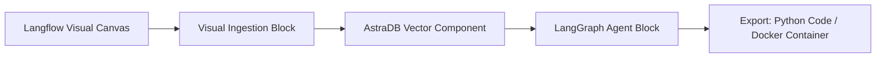

# 📹 End To End Agentic AI RAG With Langflow With Data Stax VectorDB

<div className="video-card" style={{border: '1px solid #30363d', borderRadius: '8px', padding: '16px', marginBottom: '24px', background: 'rgba(56, 139, 253, 0.05)'}}>
  <div style={{display: 'flex', gap: '16px', flexWrap: 'wrap'}}>
    <div><strong>Instructor:</strong> Krish Naik</div>
    <div><strong>Duration:</strong> 1535</div>
    <div><strong>Course:</strong> Module 4: Agentic AI & LangGraph</div>
    <div><strong>Watch Link:</strong> <a href="https://www.youtube.com/watch?v=zDKTnYDbMkE" target="_blank" rel="noopener noreferrer">YouTube Lecture ↗</a></div>
  </div>
</div>

## 📌 Executive Summary

Langflow is an open-source visual IDE for building, testing, and iterating on multi-agent RAG pipelines and LangGraph workflows. By abstracting components into modular visual nodes, Langflow accelerates rapid prototyping and visual debugging.

This lesson explores Langflow canvas navigation, connecting DataStax AstraDB vector stores, prompt playground testing, and exporting flows to production Python code.

---

## 🏗️ System Architecture & Execution Flow



---

## 📖 Core Concepts & Technical Deep Dive

### 1. Visual Prototyping to Production Pipeline
Langflow enables cross-functional teams to collaborate on prompt engineering, retrieval strategies, and agent tools visually, then export the validated flow directly into an executable Python API or Docker container.

### 2. Live Playground Debugging
Every node on the canvas displays its immediate runtime output, allowing engineers to inspect intermediate embeddings, chunk splits, and tool calls interactively.

---

## 💻 Production Implementation

```python
# Langflow exported pipeline blueprint
print("Langflow visual flow integration active.")
print("Exports cleanly to FastAPI REST microservices.")
```

---

## ⚙️ Production Gotchas & Best Practices

:::tip Component Isolation
Use Langflow for rapid prototyping and stakeholder alignment, then export the verified graph to pure Python for CI/CD unit testing and deployment.
:::

:::warning Version Control
Visual JSON flow definitions are difficult to diff in git. Commit both the `.json` flow and the generated `.py` script to version control.
:::

---

## 📊 Architectural Reference & Comparison

| Tool | Primary User | Best For | Output Format |
| :--- | :--- | :--- | :--- |
| **Langflow** | AI Engineers & Product Teams | Rapid visual prototyping | JSON flow + Python API |
| **Pure LangGraph** | Software Engineers | Complex, mission-critical logic | Native Python code |

---

## 📚 Key Takeaways & Enterprise Checklist

- [ ] **Architecture Verification:** Ensure your design addresses latency, decoupled interfaces, and strict data validation contracts.
- [ ] **Deterministic Testing:** Run unit tests and golden dataset evaluations before shipping changes to staging or production.
- [ ] **Security & Observability:** Enforce input/output guardrails, scrub sensitive credentials/PII, and capture distributed traces.
- [ ] **Scalability & Sizing:** Calibrate model parameters, context limits, and compute instance requirements against projected request concurrency.
