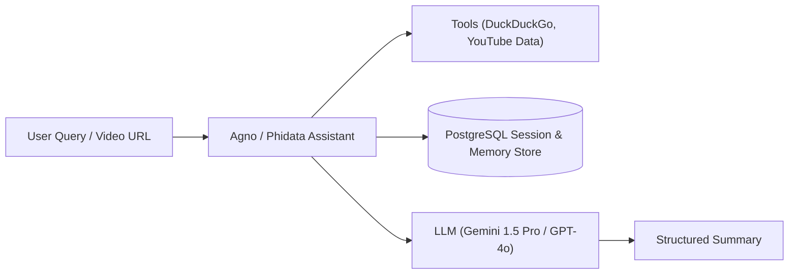

# 📹 End To End Video Summarizer Agentic AI With Phidata And Google Gemini

<div className="video-card" style={{border: '1px solid #30363d', borderRadius: '8px', padding: '16px', marginBottom: '24px', background: 'rgba(56, 139, 253, 0.05)'}}>
  <div style={{display: 'flex', gap: '16px', flexWrap: 'wrap'}}>
    <div><strong>Instructor:</strong> Krish Naik</div>
    <div><strong>Duration:</strong> 1017</div>
    <div><strong>Course:</strong> Module 4: Agentic AI & LangGraph</div>
    <div><strong>Watch Link:</strong> <a href="https://www.youtube.com/watch?v=Ih1LDnPijFU" target="_blank" rel="noopener noreferrer">YouTube Lecture ↗</a></div>
  </div>
</div>

## 📌 Executive Summary

Agno (formerly Phidata) is a lightweight, high-speed multi-agent framework designed to build autonomous agents equipped with memory, knowledge, and tools. Emphasizing clean Pythonic design and minimal boilerplate, Agno stores agent session states and vector memory in PostgreSQL.

This lesson explores Agno / Phidata architecture, creating tool-augmented agents, video summarizer pipelines, and multi-agent teams.

---

## 🏗️ System Architecture & Execution Flow



---

## 📖 Core Concepts & Technical Deep Dive

### 1. Minimalist Pythonic Design
Agno prioritizes simplicity: an `Agent` encapsulates the model, tools, instructions, and storage in a single concise declaration.

### 2. Multi-Modal Video & Document Agents
Agno has first-class integrations with multi-modal APIs (Google Gemini, OpenAI), enabling direct video file ingestion, transcript analysis, and timestamped summarization.

---

## 💻 Production Implementation

```python
# Blueprint for Agno (Phidata) Assistant
# from agno.agent import Agent
# from agno.models.google import Gemini
# from agno.tools.duckduckgo import DuckDuckGoTools

# agent = Agent(
#     name="Research Assistant",
#     model=Gemini(id="gemini-1.5-flash"),
#     tools=[DuckDuckGoTools()],
#     instructions=["Always provide links to sources."],
#     markdown=True
# )
# agent.print_response("What are the latest developments in quantum computing?")

print("Agno / Phidata multi-agent framework architecture initialized.")
```

---

## ⚙️ Production Gotchas & Best Practices

:::tip Use Gemini for Long Videos
When building video summarizers with Agno, leverage Google Gemini models with 1M+ token context windows to ingest complete video files natively.
:::

:::warning State Storage Persistence
Always configure a database storage adapter (e.g. `PostgresAgentStorage`) in production so agent memory persists across web application restarts.
:::

---

## 📊 Architectural Reference & Comparison

| Feature | Agno (Phidata) | CrewAI | LangGraph |
| :--- | :--- | :--- | :--- |
| **Design Philosophy** | Lightweight, direct Python | Role-playing personas | Low-level State Machines |
| **State Complexity** | Simple session key-value | Team task pass-through | Arbitrary cyclic state graph |
| **Learning Curve** | Low | Moderate | Moderate to High |

---

## 📚 Key Takeaways & Enterprise Checklist

- [ ] **Architecture Verification:** Ensure your design addresses latency, decoupled interfaces, and strict data validation contracts.
- [ ] **Deterministic Testing:** Run unit tests and golden dataset evaluations before shipping changes to staging or production.
- [ ] **Security & Observability:** Enforce input/output guardrails, scrub sensitive credentials/PII, and capture distributed traces.
- [ ] **Scalability & Sizing:** Calibrate model parameters, context limits, and compute instance requirements against projected request concurrency.
