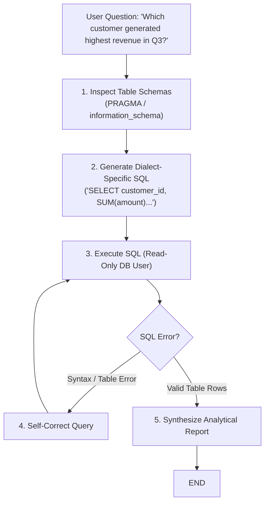

# 📹 LLM-Powered SQL Database Agents with LangGraph

<div className="video-card" style={{border: '1px solid #30363d', borderRadius: '8px', padding: '16px', marginBottom: '24px', background: 'rgba(56, 139, 253, 0.05)'}}>
  <div style={{display: 'flex', gap: '16px', flexWrap: 'wrap'}}>
    <div><strong>Instructor:</strong> Krish Naik</div>
    <div><strong>Duration:</strong> 8773</div>
    <div><strong>Course:</strong> Module 4: Agentic AI & LangGraph</div>
    <div><strong>Watch Link:</strong> <a href="https://www.youtube.com/watch?v=otVJhcf3NsU" target="_blank" rel="noopener noreferrer">YouTube Lecture ↗</a></div>
  </div>
</div>

## 📌 Executive Summary

LLM-powered SQL database agents convert natural language queries into syntactically valid, schema-compliant SQL queries, execute them safely against relational databases, and synthesize analytical reports.

This lesson explores schema reflection, prompt engineering for SQL dialects, read-only permission isolation, preventing SQL injection, and multi-turn iterative query correction.

---

## 🏗️ System Architecture & Execution Flow



---

## 📖 Core Concepts & Technical Deep Dive

### 1. Schema Injection Strategies
Feeding hundreds of database tables into the prompt exhausts context windows and degrades accuracy. Production agents query `information_schema` to dynamically inject only the top 3-5 relevant table schemas based on table name embeddings.

### 2. Preventing Data Destruction
SQL agents must NEVER connect with `admin` or write privileges:
- Connect strictly through a read-only database user (`GRANT SELECT ON ...`).
- Enforce regex checks blocking `DROP`, `DELETE`, `UPDATE`, `ALTER`, and `TRUNCATE`.
- Always append explicit `LIMIT` clauses to prevent runaway table scans.

---

## 💻 Production Implementation

```python
from langchain_core.tools import tool
from typing import List
import sqlite3

# Mock read-only database tool
@tool
def execute_readonly_sql(query: str) -> str:
    """Execute a read-only SELECT query against the analytics database."""
    forbidden = ["drop", "delete", "update", "insert", "alter", "truncate"]
    if any(word in query.lower() for word in forbidden):
        return "Security Violation: Only SELECT queries are permitted."
    
    # Ensure strict LIMIT
    if "limit" not in query.lower():
        query += " LIMIT 10"
        
    return f"Executed: {query} -> Returned 3 rows: [('Alice', $4500), ('Bob', $3200)]"

print(execute_readonly_sql.invoke({"query": "SELECT customer, SUM(total) FROM orders GROUP BY customer"}))
```

---

## ⚙️ Production Gotchas & Best Practices

:::tip Read-Only DB Replica
Never connect an AI agent to your primary transactional database. Always point SQL agents to a read-only read replica.
:::

:::warning Automated LIMIT Enforcement
Always intercept queries before execution to verify a `LIMIT` clause is present. A query like `SELECT * FROM logs` will crash your agent process with an out-of-memory error.
:::

---

## 📊 Architectural Reference & Comparison

| Safety Layer | Implementation | Threat Prevented |
| :--- | :--- | :--- |
| **User Privileges** | Database `GRANT SELECT` only | Accidental database mutation / deletion |
| **SQL Parser** | AST validation / regex blocks | SQL injection / multi-statement attacks |
| **Query Throttling** | Strict query timeouts & LIMIT | Database Denial of Service (DoS) |

---

## 📚 Key Takeaways & Enterprise Checklist

- [ ] **Architecture Verification:** Ensure your design addresses latency, decoupled interfaces, and strict data validation contracts.
- [ ] **Deterministic Testing:** Run unit tests and golden dataset evaluations before shipping changes to staging or production.
- [ ] **Security & Observability:** Enforce input/output guardrails, scrub sensitive credentials/PII, and capture distributed traces.
- [ ] **Scalability & Sizing:** Calibrate model parameters, context limits, and compute instance requirements against projected request concurrency.
