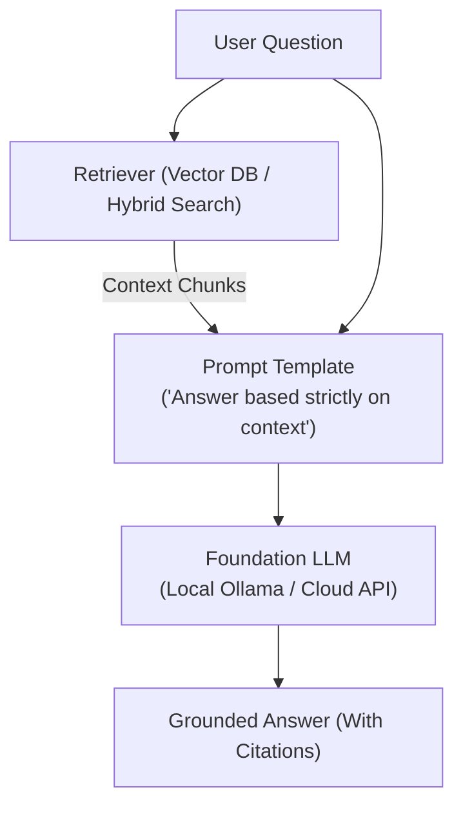

# 📹 Live demonstration of Agentic RAG with Langgraphh ｜ Explore GCP Vertex AI for Agents

<div className="video-card" style={{border: '1px solid #30363d', borderRadius: '8px', padding: '16px', marginBottom: '24px', background: 'rgba(56, 139, 253, 0.05)'}}>
  <div style={{display: 'flex', gap: '16px', flexWrap: 'wrap'}}>
    <div><strong>Instructor:</strong> Krish Naik (Krish Naik)</div>
    <div><strong>Duration:</strong> 146m 53s</div>
    <div><strong>Playlist:</strong> Real-World Multi-Agent Frameworks (Krish Naik)</div>
    <div><strong>Watch Link:</strong> <a href="https://www.youtube.com/watch?v=we3lpRR5G2k" target="_blank" rel="noopener noreferrer">YouTube Lecture ↗</a></div>
  </div>
</div>

## 📌 Executive Summary & Learning Objectives

This lecture covers **Live demonstration of Agentic RAG with Langgraphh ｜ Explore GCP Vertex AI for Agents**, focusing on production implementations, edge cases, and industry standards:
- Core intuition, architecture, and underlying mechanisms.
- Key differences between theoretical research implementations and scalable enterprise patterns.
- Concrete Python walkthroughs, error recovery, and performance optimization.

---

## 🏗️ Architecture & Conceptual Workflow



---

## 📖 Core Concepts & Technical Deep Dive

### 1. Architectural Foundations
In modern production AI engineering, **Live demonstration of Agentic RAG with Langgraphh ｜ Explore GCP Vertex AI for Agents** is essential for ensuring reliability, low latency, and deterministic outcomes. As AI systems evolve from naive prompt-in / completion-out scripts into distributed systems, engineers must handle:
- **State management & consistency:** Ensuring intermediate states and tool invocations are tracked.
- **Error boundaries & recovery:** Graceful degradation when external LLMs or vector stores encounter rate limits or network partitions.
- **Resource utilization & cost efficiency:** Caching common queries and reducing unnecessary foundation model token expenditure.

### 2. Operational Considerations
- **Latency Optimization:** Pre-computing embeddings, utilizing asynchronous non-blocking event loops, and streaming tokens via Server-Sent Events (SSE).
- **Security & Sandboxing:** Validating inputs before ingestion, sanitizing LLM outputs, and isolating tool execution environments.

---

## 💻 Production Implementation Walkthrough

```python
from langchain_core.prompts import ChatPromptTemplate
from langchain_core.runnables import RunnablePassthrough
from langchain_core.output_parsers import StrOutputParser
from langchain_community.chat_models import ChatOllama

# RAG Prompt with strict grounding
rag_template = """Answer the question based strictly on the provided context:
Context:
{context}

Question: {question}
Answer:"""

prompt = ChatPromptTemplate.from_template(rag_template)
llm = ChatOllama(model="llama3", temperature=0.1)

# Format documents helper
def format_docs(docs):
    return "\n\n".join(doc.page_content for doc in docs)

# Complete RAG Chain
rag_chain = (
    {"context": retriever | format_docs, "question": RunnablePassthrough()}
    | prompt
    | llm
    | StrOutputParser()
)
```

---

## 💡 Production Best Practices & Tips

:::tip Production Deployment Guideline
When deploying Live demonstration of Agentic RAG with Langgraphh ｜ Explore GCP Vertex AI for Agents in enterprise environments, always configure automated retries with exponential backoff and telemetry tracing (such as OpenTelemetry or LangSmith).
:::

:::warning Common Failure Modes
Watch out for state contamination across concurrent requests. Ensure each session or user interaction uses an isolated thread ID or execution context.
:::

---

## 🎯 Key Takeaways & Quick Reference

| Dimension | Production Standard | Pitfall to Avoid |
| :--- | :--- | :--- |
| **Execution** | Async / Non-blocking with timeouts | Synchronous blocking calls in event loops |
| **Data Validation** | Strict Pydantic v2 schemas | Untyped dictionary access |
| **Monitoring** | Distributed tracing & latency percentiles | Relying only on standard console logs |

## ⏱️ Lecture Timeline & Key Topics

| Timestamp | Key Topic / Concept Discussed |
| :--- | :--- |
| **00:00:01** | [Music]... |
| **00:36:14** | the industry only so I hope all of you... |
| **01:12:58** | clear to all of you this one this list... |
| **01:50:39** | yes from here only we have to invoke our... |
| **02:26:48** | thank you bye-bye thanks... |


---

---

## 📜 Complete Lecture Transcript (English)

> **Language:** English | **Source:** `09 - Iterative Workflows in LangGraph ｜ Agentic AI using LangGraph ｜ Video 8 ｜ CampusX.hi.srt` | **Total Segments:** 19 | **Word Count:** ~6,028 words

<details>
<summary><b>Click to expand full chronological transcript (19 timestamped intervals)</b></summary>

#### ⏱️ [00:00 ➔ 00:02]

हाय गाइज़, माय नेम इज नितेश एंड यू आर वेलकम टू माय YouTube चैनल। इस वीडियो में भी हम लोग अपना एजेंटिक एआई यूजिंग लैंडग्राफ प्लेलिस्ट कंटिन्यू करेंगे। और वीडियो को स्टार्ट करने के पहले मैं आपको दो चीजें बताऊंगा। फर्स्ट हमने अभी तक क्या-क्या कवर किया है इस प्लेलिस्ट में एंड सेकंड अ हम इस वीडियो में क्या कवर करने वाले हैं। ठीक है? तो हमने अभी तक इस प्लेलिस्ट में अपार्ट फ्रॉम लर्निंग द फंडामेंटल्स ऑफ़ एजेंटिक एआई एंड लैंग्राफ वर्क फ्लोस बनाना सीखा है। ठीक है? ऑन एंड प्रिसाइजली हमने तीन तरह के वर्क फ्लोस बनाना सीखा है। सबसे पहला जो वर्क फ्लो हमने बनाना सीखा है वो है सीक्वेंशियल वर्क फ्लोस। ऐसे वर्क फ्लोस जहां पे आप टास्क को एग्जीक्यूट करते हो इन अ लीनियर फैशन। पहले आप पहले टास्क को एग्जीक्यूट करते हो। उसके खत्म होने के बाद फिर सेकंड को एग्जीक्यूट करते हो। उसके बाद आप थर्ड को एग्जीक्यूट करते हो। और इस तरह से आप सीक्वेंशियली कितने भी टास्क को एग्जीक्यूट कर सकते हो। इसको हम सीक्वेंशियल वर्क फ्लोस बुलाते हैं। उसके बाद हमने सीखा अबाउट पैरेलल वर्क फ्लोस। सो पैरेलल वर्क फ्ल्लोस ऐसे वर्क फ्लोस हैं जहां पर कभी आप एक साथ एक से ज्यादा टास्क को साथ में एग्जीक्यूट करा सकते हो। और फिर हमने लास्ट वीडियो में सीखा कंडीशनल वर्क फ्लोस के बारे में। जहां पे आपके पास ऑप्शन होते हैं बहुत सारे अलग-अलग टास्क को एग्जीक्यूट करने के। बट आप उनमें से किसी एक ही टास्क को एग्जीक्यूट करते हो बेस्ड ऑन सम गिवन कंडीशन। ठीक है? तो ये तीन टाइप ऑफ वर्क फ्लोस अभी तक हमने सीखे हैं। आज की वीडियो में हम फोर्थ टाइप ऑफ वर्क फ्लो सीखने जा रहे हैं जिसका नाम है आइटरेटिव या फिर लूपिंग वर्क फ्लोस। आइट्रेटिव वर्क फ्लो एक ऐसा वर्क फ्लो है जहां पर आप दो के बीच में चलाते हो इन ऑर्डर टू इंप्रूव समथिंग। ठीक है? और ये भी एक बहुत इंपॉर्टेंट वर्क फ्ल्लो है। आगे जब आप थोड़े कॉम्प्लेक्स वर्क फ्लोस बनाओगे, वहां पे आपको देखने को मिलेगा कि बहुत जगहों पे आप आइट्रेटिव या फिर लूपिंग वर्क फ्लोस का इस्तेमाल कर रहे हो। ठीक है? अब आज का जो टॉपिक है आइट्रेटिव वर्क फ्लो, यह समझाने के लिए व्हाट आई विल डू इज आई विल टेक अ रियल लाइफ एग्जांपल। और उस रियल लाइफ एग्जांपल

#### ⏱️ [00:02 ➔ 00:04]

या फिर यूज़ केस की हेल्प से हम आइट्रेटिव वर्क फ्ल्लो बनाना सीखेंगे। लेट मी फर्स्ट डिस्क्राइब द रियल वर्ल्ड यूज़ केस दैट वी आर गोइंग टू सॉल्व। सो, यह मेरी लाइफ से कनेक्टेड है। अ एज़ यू नो, आई एम अ यूबर और मेरा काम है YouTube पे यह वीडियोस बनाना। बट अगर आपने मेरे बाकी के सोशल प्रोफाइल्स को देखा होगा जैसे कि Lindin या फिर X या फिर Instagram तो आपने देखा होगा कि मैं इन प्लेटफॉर्म्स पे उतना ज्यादा एक्टिव नहीं हूं। और उसका सिंपल सा रीज़न यह है कि YouTube से ही इतना टाइम चला जाता है कि बाकी चीजों में क्वालिटी कंटेंट बनाने का टाइम नहीं मिल पाता। बट बहुत लोगों ने मुझे सजेस्ट किया कि सिंस आप YouTube पर कंटेंट डालते हो, यू आर अ यूबर तो आपको बाकी के प्लेटफॉर्म्स पर भी एक्टिव रहना चाहिए। तो मुझे ये बात थोड़ी सही लगी एंड मल्टीपल टाइम्स मैंने ट्राई भी किया कि मैं जाकर के बाकी के प्लेटफॉर्म्स पे भी फोकस करूं। बट अगेन टाइम क्रंच की वजह से हो नहीं पा रहा है। सो मुझे लगा कि व्हाट इफ मैं एक ऑटोमेटेड वर्क फ्लो बनाऊं जो मेरे बिहाफ में इन प्लेटफॉर्म्स के ऊपर पोस्ट करना स्टार्ट कर दे। इससे मेरा टाइम भी बच जाएगा और बाकी प्लेटफॉर्म्स पर भी मैं ग्रो कर सकता हूं। द ओनली प्रॉब्लम इज कि इस तरह का ऑटोमेटेड सॉल्यूशन जो होगा उसमें कोई गारंटी नहीं है कि जो पोस्ट निकल के आएगा वो एक क्वालिटी पोस्ट होगा। हो सकता है कि बहुत मीडियाकर टाइप का पोस्ट हो, रेपिटेटिव पोस्ट हो और लोगों को ज्यादा वैल्यू क्रिएट होते हुए ना दिखाई दे। सो इसी प्रॉब्लम को सॉल्व करने के लिए हम आज एक वर्क फ्लो बनाने वाले हैं। ठीक है? सो अगर हम एक बार डिस्कस करें कि एग्जैक्टली ये वर्क फ्लो काम कैसे करेगा? तो है ये बहुत सिंपल वर्क फ्लो। वर्क फ्लो ये है कि आप अपने इस ऑटोमेटेड वर्क फ्लो को एक टॉपिक दोगे और आप बोलोगे कि इस टॉपिक के ऊपर मुझे एक पोस्ट क्रिएट करके दो। ठीक है? मान लो टॉपिक है एआई इन इंडिया। ठीक है? आपने यह टॉपिक दे दिया

#### ⏱️ [00:04 ➔ 00:06]

अपने वर्क फ्लो को। अब आपका वर्क फ्लो क्या करेगा? उस टॉपिक के ऊपर एक पोस्ट जनरेट करेगा। ठीक है? और आपको उस पोस्ट को उठा के प्लेटफार्म पे ले जाके डाल देना है। कोई भी प्लेटफार्म हो। फ्लो यही है। बट इस पूरे फ्लो में प्रॉब्लम क्या है? कि हाउ डू वी इवैल्यूएट और मेक श्योर कि यहां पे जो पोस्ट जनरेट हुआ है किसी एलएलएम की हेल्प से वो सच में एक क्वालिटी पोस्ट है। मोस्ट ऑफ द टाइम्स आप नोटिस करोगे कि अगर आप किसी एलएलएम को बोलोगे कि भाई मेरे लिए एक ट्वीट जनरेट कर दे या Lindin पोस्ट जनरेट कर दे तो फर्स्ट राउंड में या फर्स्ट गो में जो आउटपुट निकल के आता है वो उतना सेटिस्फेक्टरी नहीं होता है। तो इसी प्रॉब्लम को सॉल्व करने के लिए व्हाट वी कैन डू इज़ वी कैन यूज़ अ आइटरेटिव वर्क फ्लो। ठीक है? सो मैं आपको बताता हूं मैंने क्या वर्क फ्ल्लो बनाया है और उसमें कैसे हम लूप्स यूज करेंगे। सो हमारे वर्क फ्लो में तीन इंपॉर्टेंट कंपोनेंट्स हैं। पहला कंपोनेंट है जनरेशन का, दूसरा है इवैल्यूएशन का और तीसरा है ऑप्टिमाइजेशन का। मैं आपको समझाता हूं ये पूरी चीज काम कैसे कर रही है। सबसे पहले हम क्या करेंगे? यहां पर एक टॉपिक प्रोवाइड करेंगे हमारे वर्क फ्लो को और हम एक एलएलएम के पास उस टॉपिक को भेजेंगे और हम बोलेंगे कि इस टॉपिक पे हमें एक पोस्ट जनरेट करके दो। ठीक है? उसके बाद जैसे ही यह पोस्ट जनरेट हो जाएगा, हम उस जनरेटेड पोस्ट को एक इवैल्यूएटर के पास भेजेंगे। यह इवैल्यूएटर एक दूसरा एलएलएम है। और इस इवैल्यूएटर को हम बहुत स्ट्रिक्ट गाइडलाइंस देंगे कि हमें एग्जैक्टली किस तरह का पोस्ट चाहिए। ठीक है? जितना आप यहां पे अच्छे से डिस्क्राइब करोगे अपना इवैल्यूएशन क्राइटेरिया उतना बढ़िया आपको फाइनल आउटकम मिलेगा। ठीक है? तो मैं आपको दिखाऊंगा। मैंने एक प्र्प्ट बनाया है जिसमें मैंने बहुत क्लियरली ये लिखा हुआ है कि कब किस तरह के पोस्ट को आप अलऊ

#### ⏱️ [00:06 ➔ 00:08]

करोगे और किस तरह के पोस्ट को आप हटा दोगे। ठीक है? तो इस इवैल्यूएटर के पास यह पोस्ट जाएगा। अब इवैल्यूएटर का काम है या तो अप्रूव कर देना पोस्ट को या फिर उसको बोलना कि इसमें इंप्रूवमेंट की जरूरत है और दोबारा से जनरेट करवाना। ठीक है? तो मान लो अगर इवैल्यूएटर ने बोला कि द पोस्ट इज़ गुड। इट इज़ अप्रूव्ड। तो फिर क्या होगा? हमारा वर्क फ्लो एंड हो जाएगा। रियल लाइफ में यहां पर एंड नहीं होगा। रियल लाइफ में यहां पे ह्यूमन इन द लूप आएगा। ह्यूमन को दिखाया जाएगा वो पोस्ट कि देखो यह पोस्ट अप्रूव हुआ है। आप भी अप्रूव कर दो। और यहां पे अगर उसने अप्रूव कर दिया तो यहां पर हम एक एपीआई कॉल की हेल्प से उस पोस्ट को डाल देंगे प्लेटफार्म के ऊपर। बट अगर लेट्स से हमारे इवैल्यूएटर को लगता है कि हमारा जो पोस्ट है वो उतना बढ़िया नहीं है बेस्ड ऑन आर इवैल्यूएशन क्राइटेरिया तो वो क्या करेगा वो एक थर्ड एलएलएम के पास उस पोस्ट को भेजेगा उस थर्ड एलएलएम को हम ऑप्टिमाइजर बुला रहे हैं और इस ऑप्टिमाइजर को हमने क्या कर रखा है फिर से एक गाइडलाइन प्रोवाइड कर रखी है कि देखो तुमको ये पोस्ट को लेना है और उसको इस पर्टिकुलर फीडबैक के बेसिस पे इंप्रूव करना है। सो हमारा इवैल्यूएटर नॉट ओनली स्कोर कर रहा है बट साथ ही साथ एक फीडबैक भी जनरेट कर रहा है। ठीक है? तो इस ऑप्टिमाइजर को हमारा पोस्ट भी मिला और इवैल्यूएटर का अ फीडबैक भी मिला। इन दोनों चीजों के बेसिस पे वो एक नया पोस्ट जनरेट करेगा। और वो नया पोस्ट हम वापस कहां भेजेंगे? इवैल्यूएटर के पास। अब इवैल्यूएटर फिर से अपने इवैल्यूएशन क्राइटेरिया के बेसिस पे उस पोस्ट को जज करेगा। और फिर वापस वो यह डिसीजन लेगा कि इसको हम अप्रूव कर सकते हैं या फिर इसको और इंप्रूव करने की जरूरत है। और फिर यह सेम लूप चलता रहेगा। अगर किसी पॉइंट पे अप्रूव हो गया तो लूप खत्म हो जाएगा। अदरवाइज आप ये इवैल्यूएशन एंड ऑप्टिमाइजेशन के लूप में घूमते रहोगे। इन दो टास्क में आप घूमते रहोगे। तो आई रियली होप आपको समझ में आ गया कि यहां पे कैसे

#### ⏱️ [00:08 ➔ 00:10]

लूपिंग इनवॉल्वड है और कैसे लूपिंग को यूज करने से हमारा जो प्रॉब्लम है वो और बेटर तरीके से सॉल्व हो रहा है। ठीक है? तो चलो अब इस पूरे के पूरे वर्क फ्लो को हम लोग लैंग्राफ्ट में बिल्ड करते हैं। सो गाइस हमारा वर्क फ्लो बनाने के लिए मैंने एक नई फाइल बना ली है और इस फाइल में जो भी हमारे नेसेसरी इंपोर्ट्स हैं वो मैंने ले लिए हैं। अब यहां से हम अपना काम शुरू करेंगे। तो सबसे पहले आपको इस वर्क फ्लो में चाहिए पड़ेंगे तीन अलग-अलग एलएलएम्स। ठीक है? एक होगा आपका जनरेटर एलएलएम, एक होगा आपका इवैल्यूएटर एलएलएम और एक होगा आपका ऑप्टिमाइजर एलएलएम। ठीक है? अब इन एन आइडियल सिनेरियो जब आप इस प्रोजेक्ट को प्रॉपर्ली बिल्ड करोगे तो ये तीनों एलएलएम्स अलग-अलग होने चाहिए और ऐसे होने चाहिए कि अपने-अपने टास्क में एक्सेल करे। जैसे कि जनरेटर एलएलएम का काम क्या है? पोस्ट को जनरेट करना। ठीक है? तो यहां पे हमें एक ऐसा एलएलएम चाहिए जिसकी राइटिंग कैपेबिलिटी बहुत स्ट्रांग हो। जैसे कि जीपीटी का 4.5 वाला मॉडल। सिमिलरली इवैल्यूएटर का काम क्या है? पोस्ट को एक गिवन इवैल्यूएशन क्राइटेरिया के बेसिस पे इवैल्यूएट करना। अब यहां पे हमें आइडियली एक ऐसा एलएलएम चाहिए जिसको अगर आप एक टास्क देते हो तो वो उस टास्क को रिलीजियसली सॉल्व करें। ठीक है? तो यहां पे आपको थोड़ा सा एलएलएम्स का नॉलेज होना चाहिए। एलएलएम प्रोवाइडर्स का नॉलेज होना चाहिए। अभी सिंस हम एक डमी प्रोजेक्ट बना रहे हैं। मैं रफली सेम एलएलएम्स को ही यूज करूंगा फॉर जनरेटर, इवैलुएटर एंड ऑप्टिमाइजर। ठीक है? सो व्हाट आई विल डू इज़ मैं चैट ओपन एआई से यूज़ कर रहा हूं GPT4O को फॉर जनरेशन। उसके बाद इवैल्यूएशन के लिए आई एम यूजिंग GPT 4O मिनी। और फिर ऑप्टिमाइजेशन के लिए आई एम अगेन यूजिंग जीपीटी 4o ठीक है तो यह हो गए मेरे तीन एलएलएम्स अब फ्यूचर में जब आप इस प्रोजेक्ट को प्रॉपर्ली बिल्ड करोगे थोड़ा

#### ⏱️ [00:10 ➔ 00:12]

रिसर्च करना जनरेशन के लिए कौन अच्छा है इवैल्यूएशन के लिए कौन अच्छा है और यहां पे आप बस रिप्लेस कर देना अपने मॉडल के साथ ठीक है अब बात करते हैं कि हमारे इस वर्क फ्लो का स्टेट क्या होगा क्योंकि कभी भी आप लंग ग्राफ में कोई भी वर्क फ्लो बनाओ आपको पहले स्टेट डिफाइन करना होता है। अब स्टेट डिफाइन करने के पहले मैं आपको एक दो चीज और बता देता हूं। हमारे वर्क फ्लो के बारे में। मैंने डिसाइड किया है कि हम जो वर्क फ्लो बनाएंगे वो स्पेसिफिकली टारगेटेड होगा एक्स प्लेटफार्म के लिए Twitter जिसको बुलाते थे और हमारा जो वर्क फ्लो है वो हमें एक ट्वीट जनरेट करके देगा किसी भी गिवन टॉपिक के ऊपर। और उसमें भी मैंने यह डिसाइड किया है कि जो ट्वीट जनरेट होना चाहिए वो फनी एंड ओरिजिनल होना चाहिए। ठीक है? है तो मैंने बेसिकली हमारे टास्क को थोड़ा सा नैरो डाउन कर दिया है। तो उसी के हिसाब से अब हम अपना स्टेट डिफाइन करेंगे। तो लेट्स क्रिएट अ क्लास। लेट्स कॉल इट ट्वीट स्टेट। ठीक है? एंड दिस विल इनहेरिट फ्रॉम टाइप्ड डिक्शनरी। अब एक बार सोचने की कोशिश करते हैं कि हमारे इस पर्टिकुलर वर्क फ्लो में क्या-क्या टाइप के वेरिएबल्स की रिक्वायरमेंट है। आई गेस आप समझ पा रहे हो। सबसे पहले आपको एक टॉपिक बोल के वेरिएबल चाहिए होगा। जहां पे आप यूजर का दिया हुआ टॉपिक स्टोर करोगे। इसी टॉपिक के ऊपर ट्वीट जनरेट होगा। सिमिलरली आपको एक और वेरिएबल चाहिए होगा टू स्टोर द जनरेटेड ट्वीट। ठीक है? तो ये भी एक स्ट्रिंग होगा। उसके बाद दो चीजें और होंगी जो हमारा इवैल्यूएटर करके देगा। पहला वो एक इवैल्यूएशन जनरेट करके देगा। ठीक है? कि अप्रूव्ड या फिर नीड्स इंप्रूवमेंट। राइट? दो ही पॉसिबिलिटीज़ हैं। तो इसमें हम एक लिटरल यूज़ करेंगे। और लिटरल के अंदर दो ऑप्शंस हैं। अप्रूव्ड एंड नीड्स इंप्रूवमेंट। और इसके साथ-साथ हमारा इवैलुएटर एक फीडबैक

#### ⏱️ [00:12 ➔ 00:14]

भी जनरेट करेगा जो कि अगेन एक स्ट्रिंग होगा। और इसके अलावा व्हाट वी कैन डू इज यह पता करने के लिए कि कितने लूप्स चले इन ऑर्डर टू इंप्रूव द ट्वीट। हम एक वेरिएबल रखते हैं आइटरेशन बोल के और ये इंटीजर होगा। ठीक है? इसकी वैल्यू से हमें समझ में आएगा कि इवैल्यूएटर और ऑप्टिमाइजर के बीच में कितनी बार हम घूमे हैं। ठीक है? एंड लास्ट में हम एक मैक्स आइटरेशन बोल करके वेरिएबल ले रहे हैं। जो कि हम यूज करेंगे अपने वर्क फ्लो को क्लोज करने के लिए। क्योंकि कभी ऐसा हो सकता है कि आप इस लूप में इनफाइनाइटली फंस जाओ। इवैल्यूएटर बार-बार रिजेक्ट कर दे रहा है ट्वीट को। ऑप्टिमाइजर फिर नया बना के भेज रहा है। इवैल्यूएटर फिर रिजेक्ट कर दे रहा है। यह इनफाइनाइटली हो रहा है। इसका रीज़न कुछ भी हो सकता है। आपका इवैल्यूएशन क्राइटेरिया बहुत ज्यादा स्ट्रिक्ट है। और आपका एलएलएम उतना कैपेबल नहीं है। उतना बढ़िया ट्वीट जनरेट करने के लिए। तो कहीं ना कहीं पे इस लूप को ब्रेक करना पड़ेगा। तो उसी को ब्रेक करने के लिए हम एक मैक्स आइट्रेशन लिमिट लेके चलेंगे। हमारे केस में हम पांच से स्टार्ट करेंगे। बट अगेन आप अपने प्रोजेक्ट में अपने हिसाब से इस चीज को डिसाइड कर सकते हो। ठीक है? सो ये हो गया हमारा स्टेट। अब हम क्या करेंगे? हम हमारा ग्राफ बिल्ड करना शुरू करेंगे। तो वी विल क्रिएट अ वेरिएबल कॉल्ड ग्राफ जो कि स्टेट ग्राफ का ऑब्जेक्ट होगा और यहां पे हम अपना ट्वीट स्टेट पास करेंगे। अब यहां पर हमें अपने नड्स बनाने हैं। तो एज यू कैन सी हमारे पास हमारे वर्क फ्लो में तीन न्स हैं। जनरेशन का, इवैल्यूएशन का एंड ऑप्टिमाइजेशन का। तो हम क्या करेंगे? हम तीन नोड्स बनाएंगे। ऐड नोड। पहले नोड का नाम रख लेते हैं जनरेट। और इससे रिलेटेड जो फंक्शन होगा उसको हम बुला लेते हैं जनरेट ट्वीट। ऑब्वियसली यह फंक्शन अभी डिफाइंड

#### ⏱️ [00:14 ➔ 00:16]

नहीं है। फिर हम एक और नोड ऐड करते हैं। लेट्स कॉल इट इवैलुएट। और इससे एसोसिएटेड जो फंक्शन है उसका नाम रख लेते हैं इवैल्यूएट ट्वीट। एंड लेट्स ऐड द फाइनल वन। लेट्स कॉल इट ऑप्टिमाइज़। और इससे एसोसिएटेड फंक्शन का नाम है ऑप्टिमाइज ट्वीट। ठीक है? अब हम नेक्स्ट क्या करेंगे कि ये तीन फंक्शनंस हम बिल्ड करेंगे। जनरेट ट्वीट, इवैलुएट ट्वीट एंड ऑप्टिमाइज ट्वीट। और एक बार जब यह तीनों फंक्शनंस हम बना लेंगे, उसके बाद हम अपने एजेस क्रिएट करके अपना ग्राफ कंप्लीट करेंगे। तो गाइस, हम लोग सबसे पहले क्रिएट करेंगे हमारा जनरेट ट्वीट फंक्शन। इसके लिए हम लोग क्या करते हैं? ऊपर एक कोड सेल क्रिएट कर लेते हैं। और लेट्स क्रिएट दिस फंक्शन। फंक्शन का नाम है जनरेट ट्वीट। इसको इनपुट में एक स्टेट मिलेगा जिसका टाइप होगा ट्वीट स्टेट। अब यहां पे आपको क्या करना है? आपको एक बहुत सिंपल काम करना है। आपको एक प्र्प्ट क्रिएट करना है जहां पे आप अपने एलएलएम को डिटेल में बताओगे कि उसको किस टाइप का और किस टॉपिक के ऊपर ट्वीट क्रिएट करना है। फिर एक बार जब वह प्र्ट बन जाएगा तो आप उसको अपने जनरेटर एलएलएम के पास भेजोगे और जो भी रिस्पांस आएगा उसको आप रिटर्न कर दोगे। बस इतना ही काम है। अब प्र्प्ट जो है वह मैंने ऑलरेडी लिख रखा है। मैं आपको दिखाता हूं। सो ये रहा हमारा प्र्ट। मैं एक बार कॉपी पेस्ट करता हूं। फिर आपको दिखाता हूं। सो दिस इज़ आवर प्र्ट। ठीक है? सो, हमने क्या किया है? इस बार नॉर्मल एपस्ट्रिंग यूज़ करने के बदले हमने सिस्टम मैसेज और ह्यूमन मैसेज क्लासेस यूज़ की हैं। जो मैंने आपको पढ़ाया था लैंग चेन वाली प्लेलिस्ट में। और बेसिकली हमने मैसेजेस बोल के एक लिस्ट बना लिया और उस लिस्ट के अंदर हमने दो टाइप के मैसेजेस डाल रखे हैं। एक है सिस्टम मैसेज जहां पे हम बता रहे हैं कि यू आर अ फनी एंड क्लेवर

#### ⏱️ [00:16 ➔ 00:18]

Twitter इन्फ्लुएंसरर। और फिर सेकंड जो मैसेज है उसमें हमने ह्यूमन मैसेज डाला है जहां पर हम बहुत डिटेल में उसको डिस्क्राइब कर रहे हैं कि उसको किस टाइप का ट्वीट जनरेट करना है। देखो यहां पे क्या लिखा हुआ है दैट यू हैव टू राइट अ शॉर्ट ओरिजिनल एंड हिलरियस ट्वीट ऑन द टॉपिक जो टॉपिक स्टेट में डिफाइंड है। रूल्स ये हैं आपको क्वेश्चन आंसर फॉर्मेट यूज़ नहीं करना है। 280 कैरेक्टर से ज्यादा नहीं होना चाहिए। यूज़ ऑब्जरवेशनल ह्यूमर, आयरनी, सारकाज्म और कल्चरल रेफरेंसेस। थिंक इन मीम लॉजिक पंच लाइंस और रिलेटेबल टेक्स यूज सिंपल डे टू डे इंग्लिश और लास्ट में हम यह भी जनरेट कर रहे हैं कि ये कौन सा वर्जन ऑफ द ट्वीट है। सो यहां पे मैंने सिंपली अभी लिख दिया है कि ये जो भी आइटरेशन है करंट आइटरेशन उसमें हम वन ऐड कर देंगे। ठीक है? आई होप आपको समझ में आ रहा है। अ ये चीज़ अगर आप चाहो तो स्किप भी कर सकते हो। इट्स नॉट रिक्वायर्ड। अ एक काम करते हैं। फिलहाल इसको हटा देते हैं। बाद में अगर लगेगा इसकी जरूरत है तो हम उसको वापस ले आएंगे। ठीक है? तो यह हो गया हमारा प्र्प्ट। अब हमें क्या करना है? हमारे जनरेटर एलएलएम को इनवोक करना है और वहां पे हमें यह मैसेजेस वाला लिस्ट पास कर देना है। पलट के हमें जो मैसेज आएगा उसका हमें कंटेंट कंटेंट एक्सट्रैक्ट करना है और उसको हम वेरिएबल में स्टोर करेंगे। लेट्स कॉल इट रिस्पांस। और फिर हमें बस उस रिस्पांस को रिटर्न कर देना है। और यहां पे जो डिक्शनरी होगी उसका की वैल्यू एग्जैक्टली वही होगा जो हमने स्टेट में डिफाइन कर रखा है। तो हमारा ट्वीट विल बी रिस्पांस। ठीक है? और ये बन गया हमारा अ नेम ट्वीट स्टेट इज़ नॉट डिफाइंड। अच्छा मे बी हमने इसको चलाया नहीं था। अच्छा आई डोंट नो क्यों ऐसा हो रहा है। शुरू से एक बार सारे सेल्स हम लोग रन कर लेते हैं। दूसरा भी हमने रन कर लिया। ट्वीट स्टेट भी हमने रन

#### ⏱️ [00:18 ➔ 00:20]

कर लिया। और ये रहा हमारा फंक्शन और ये हमने अपना ग्राफ डिफाइन कर रखा है। ठीक है? तो ये तो हो गया हमारा पहला नोड। अब हम बनाएंगे इवैल्यूएशन वाला नोड। सो अगेन आई विल क्रिएट अ न्यू सेल एंड वी विल क्रिएट दिस फंक्शन बाय द नेम ऑफ इवैल्यूएट ट्वीट। इसको भी एक स्टेट मिलेगा जो कि ट्वीट स्टेट टाइप का होगा। और यहां पे आपको क्या करना है? यहां पर भी आपको सेम काम करना है। आपको बेसिकली एक प्र्प्ट डिफाइन करना है जो बहुत डिटेल में बताएगा कि आपका इवैल्यूएशन क्राइटेरिया क्या है और साथ ही साथ उस प्र्ट में आप अपना जनरेटेड ट्वीट को भी भेजोगे और आपका इवैल्यूएटर एलएलएम उस इवैल्यूएशन क्राइटेरिया के बेसिस पे आपके गिवन ट्वीट को इवैलुएट करेगा और आपको पलट के दो चीजें देगा। फर्स्ट अ एक इवैल्यूएशन रिजल्ट ऐज़ इन सेलेक्ट हुआ या रिजेक्ट हुआ और सेकंड एक फ़ीडबैक। ठीक है? तो यहां पे हमें क्या करना पड़ेगा? स्ट्रक्चरर्ड आउटपुट यूज़ करना पड़ेगा। ठीक है? सो दैट हम मेक श्योर करें कि हर बार जब हमारा एलएलएम रिटर्न करे कुछ भी रिस्पांस वो दो चीजों के फॉर्म में ही करे इवैल्यूएशन रिजल्ट के बेसिस पे एंड आपका फीडबैक के बेसिस पे। यही दो चीजें हमें पलट के मिलनी चाहिए। ठीक है? तो पहले मैं आपको एक बार प्र्प दिखाता हूं कि हमारा प्र्प्ट क्या है। अगेन मैंने बहुत डिटेल में यह प्र्प्ट क्रिएट किया है ऑब्वियसली वि द हेल्प ऑफ चार्ट जीपीटी। सो दिस इज द प्र्प्ट। एक बार आप गो थ्रू कर सकते हो। सिस्टम मैसेज है यू आर अ रूथलेस नो लाफ गिवन Twitter क्रिटिक। यू इवैल्यूएट ट्वीट्स बेस्ड ऑन ह्यूमर, ओरिजिनलिटी, वायरालिटी एंड ट्वीट फॉर्मेट। और फिर ह्यूमन मैसेज में हमने बताया है दैट यू हैव टू इवैलुएट द फॉलोइंग ट्वीट।

#### ⏱️ [00:20 ➔ 00:22]

यह हमारा स्टेट में डिफाइंड है हमारा ट्वीट। और यहां पे हमने अपनी क्राइटेरिया बताई है। सबसे पहले ओरिजिनलिटी पे हम चेक करेंगे कि क्या यह फ्रेश है। कहीं ऐसा तो नहीं है। आपने यह ट्वीट 100 बार पहले देख रखा है। हम ह्यूमर पे जज करेंगे, पंचनेस पे जज करेंगे, वायरलिटी पोटेंशियल पे जज करेंगे और फॉर्मेट पे जज करेंगे। और यहां पर हमने यह भी बता रखा है कि ऑटोमेटिकली रिजेक्ट कर देना ट्वीट को अगर क्वेश्चन आंसर फॉर्मेट में हो या 280 कररेक्टर से ज्यादा हो या फिर ट्रेडिशनल जोक्स हो। ठीक है? और यहां पे मैंने यह भी बता रखा है कि रिसोंड ओनली इन स्ट्रक्चरर्ड फॉर्मेट इवैल्यूएशन जहां पे बताया जाएगा या तो अप्रूव्ड या फिर नीड्स इंप्रूवमेंट एंड फीडबैक। जहां पे एक पैराग्राफ में स्ट्रेंथ और वीकनेस बताई जाएगी। ठीक है? तो ये हमारा प्र्प्ट रहने वाला है। अब इस प्र्प्ट को मॉडल के पास भेजने से पहले हमें स्ट्रक्चरर्ड आउटपुट का कांसेप्ट यूज़ करना पड़ेगा। सो व्हाट आई विल डू इज़ आई विल फर्स्ट क्रिएट अ स्कीमा कि पलट के जो रिस्पांस आएगा वो कैसा दिखना चाहिए। सो आई विल गो हियर एंड आई विल क्रिएट अ स्कीमा वि द हेल्प ऑफ़ पाइडेंटिक। सो यह हमारा ट्वीट इवैल्यूएशन स्कीमा है। इसमें हमें दो चीजें रखनी है। एक्चुअली पहले मैंने जब यह कोड लिखा था तो उसमें स्कोर भी ऐड किया था। बट हमें फिलहाल स्कोर की जरूरत नहीं है। वी विल जस्ट हैव अ इवैल्यूएशन व्हिच विल बी अ लिटरल जिसमें या तो अप्रूव्ड आएगा या तो नीड्स इंप्रूवमेंट आएगा। हमने डिस्क्रिप्शन भी दे रखा है और साथ ही साथ एक फ़ीडबैक होगा जहां पे हम लिखेंगे कंस्ट्रक्टिव फीडबैक फॉर द ट्वीट या रादर जस्ट राइट फीडबैक फॉर द ट्वीट। तो ये हो गया हमारा स्कीमा। और अब हम क्या करेंगे? एक वेरिएबल बनाएंगे स्ट्रक्चरर्ड इवैल्यूएटर एलएलएम बोल के जो कि होगा इवैल्यूएटर

#### ⏱️ [00:22 ➔ 00:24]

एलएलएम डॉट विद स्ट्रक्चरर्ड आउटपुट और यहां पे हम पास कर देंगे हमारा ट्वीट इवैल्यूएशन स्कीमा ठीक है तो इंस्टेड ऑफ यूजिंग इवैल्यूएटर एलएलएम वी विल बी यूजिंग स्ट्रक्चरर्ड इवैलुएटर एलएलएम ठीक है सो यहां पर हम लोग आते हैं और यहां पर हम लिखेंगे स्ट्रक्चरर्ड इवैल्यूएटर lminvok और यहां पे हम पास कर देंगे ऊपर लिखे हुए मैसेजेस को। इससे हमें पलट के एक रिस्पांस मिलेगा। और अब इस रिस्पांस के अंदर दो चीजें होंगी। इवैल्यूएशन रिजल्ट होगा एंड फीडबैक होगा। तो वी विल रिटर्न बोथ। हम पहले रिटर्न करेंगे इसको। फिर हम रिटर्न करेंगे इसको। ठीक है? यहां पे हम पास कर देंगे रिस्पांस डॉट इवैल्यूएशन। और यहां पे हम पास कर देंगे फीडबैक में रिस्पांस के अंदर का फीडबैक वाला एट्रिब्यूट। ठीक है? और ये हो गया हमारा सेकंड फंक्शन जो इवैल्यूएट करने का काम करेगा। अब हम लोग क्रिएट करेंगे अपना थर्ड फंक्शन ऑप्टिमाइज ट्वीट। तो एक नए सेल में लेट्स क्रिएट दिस फंक्शन। इसको भी एक स्टेट मिलेगा जो कि ट्वीट स्टेट टाइप का होगा। और यहां पे भी हमें क्या करना पड़ेगा? एक प्र्पों्ट डिफाइन करना पड़ेगा। उस प्र्ट में बेसिकली हम ये लिखेंगे कि देखो हमारे पास ये ट्वीट है इस टॉपिक के ऊपर और इसके ऊपर हमें ये फीडबैक मिला है। कैन यू इंप्रूव दिस? ठीक है? तो अगेन प्र्प्ट जो है वो मैंने यहां पे लिख रखा है। आई विल सिंपली कॉपी दिस प्र्ट एंड पेस्ट इट हियर। तो फिर से यहां पे देखो लिखा हुआ है यू पंच अप ट्वीट्स फॉर वायरलिटी एंड ह्यूमर बेस्ड ऑन गिवन फीडबैक। ये हमारा सिस्टम मैसेज है और हमारे ह्यूमन मैसेज में हमने लिखा है

#### ⏱️ [00:24 ➔ 00:26]

इंप्रूव द ट्वीट बेस्ड ऑन दिस फीडबैक। यह हमारा फीडबैक है। टॉपिक ऑफ द ट्वीट ये रहा और ओरिजिनल ट्वीट ये रहा। अब यहां पे बस हमने आगे लिख दिया है रीाइट इट एज अ शॉर्ट वायरल वर्दी ट्वीट। अवॉइड क्यूए स्टाइल एंड स्टे अंडर 280 कैरेक्टर्स। ठीक है? तो अब हम क्या करेंगे? हम यूज करेंगे हमारा ऑप्टिमाइजर एलएलएम। उसको हम लोग इनवोक करेंगे और पास कर देंगे मैसेजेस को। और इससे हमें पलट के फिर से एक रिस्पांस मिलेगा। हमें सिंपली उसका कंटेंट चाहिए। ठीक है? अब यहां पर क्या करना है आपको? अ सबसे पहले ये जो नया ट्वीट जनरेट हुआ है, यह रिटर्न करना है। बट साथ ही साथ आपको आइटरेशन का काउंट भी बढ़ाना है। अगर आपको याद हो, हम हमारे स्टेट के अंदर एक आइटरेशन काउंट लेके चल रहे हैं। तो वो भी हमें इंक्रिमेंट करना पड़ेगा। सो व्हाट वी विल डू इज़ हम यहां पे लिखेंगे आइटरेशन इज़ इक्वल टू अभी स्टेट के अंदर जो भी वैल्यू है आइटरेशन का उसमें +1 बिकॉज़ हमने एक बार और नया ट्वीट जनरेट किया और अब यहां पे हम लिखेंगे कि ट्वीट का नया वैल्यू इज़ रिस्पांस एंड आइटरेशन का नया वैल्यू इज़ जो भी आइटरेशन वेरिएबल के अंदर है। ठीक है? और यह हो गया गाइस हमारा थर्ड फंक्शन। ठीक है? तो इस पॉइंट पर हमारे तीनों नोड्स डिफाइन हो गए। अब हमें क्या करना है? इनके बीच में एजेस क्रिएट करने हैं। तो सबसे पहले हम क्या करेंगे? हम ग्राफ डॉट ऐड एच फंक्शन को कॉल करके वी विल क्रिएट एन एज बिटवीन स्टार्ट एंड जनरेट। ठीक है? बेसिकली यह वाला एज दिस एज। यह वाला एज हमने बनाया। ठीक है? उसके बाद हमें जनरेट और इवैलुएट के बीच में एक एज

#### ⏱️ [00:26 ➔ 00:28]

बनाना है। सो वी विल राइट ग्राफ डॉट ऐड एज जनरेट इवैल्यूएट। ठीक है? अब यहां पर मेन काम शुरू होता है। अब हमें नेक्स्ट क्या करना है कि इवैल्यूएट वाले नोड के रिजल्ट के बेसिस पर एक कंडीशनल एज क्रिएट करना है जो कि या तो एंड के पास जाएगी या फिर ऑप्टिमाइज के पास जाएगी। अब यह कंडीशनल एज बनाने के लिए हमें एक फंक्शन क्रिएट करना पड़ेगा जो हमारे लिए ये डिसीजन मेकिंग करेगा। सो हम अपने कोड में जाते हैं और ठीक ऊपर एक नया फंक्शन बनाते हैं। लेट्स कॉल दिस फंक्शन राउट इवैल्यूएशन। इसको भी स्टेट इनपुट में मिलेगी। और यहां पर हमें क्या करना है? बहुत सिंपल एक डिसीजन मेकिंग करना है। इफ स्टेट का इवैल्यूएशन इज इक्वल टू इक्वल टू अप्रूव्ड और स्टेट का आइटरेशन इज़ ग्रेटर दैन इक्वल टू स्टेट का मैक्स आइटरेशन। मतलब हम पांच बार से ज्यादा लूप में घूम चुके हैं। इन दोनों केसेस में हम रिटर्न कर देंगे अप्रूव्ड। एल्स वी विल रिटर्न नीड्स इंप्रूवमेंट। ठीक है? तो ये हमारा डिसीजन मेकिंग फंक्शन है। अब हम यहां पे आएंगे और हम यहां पे एक कंडीशनल एज क्रिएट करेंगे। सो कंडीशनल एज स्टार्ट कहां से होगा? इवैल्यूएट नोड से। और जाना कहां है? ये डिसीजन हमें हमारा राउट इवैल्यूएशन फंक्शन करके देगा। और डिसीजन यह है कि अगर हमें पलट के अप्रूव्ड मिल रहा है फंक्शन से तो हम भेज देंगे एंड नोड के पास और अगर हमें मिल रहा है नीड्स

#### ⏱️ [00:28 ➔ 00:30]

इंप्रूवमेंट तो हम भेज देंगे ऑप्टिमाइज नोड के पास। ठीक है? ये हमारा कंडीशनल एज हो गया। तो बेसिकली अभी हमने ये वाला डॉटेड दोनों एज बना दिया। अब हमें क्या करना है? बस यह लास्ट एज ड्रॉ करना है बिटवीन ऑप्टिमाइज़ एंड इवैल्यूएट। और यही हमारा लूप का काम करेगा। इवैल्यूएट से ऑप्टिमाइज़ तक कंडीशनल एज है और फिर यहां से वापस जाने के लिए नॉर्मल एज है। तो व्हाट यू विल डू इज़ आप सिंपली लिखोगे ग्राफ डॉट ऐड एज और यहां पे आप लिखोगे ऑप्टिमाइज़ से वापस इवैलुएट। एंड दैट्स इट गाइज़। दिस इज़ हाउ यू क्रिएट लूप्स इन लाइनग्राफ। आप सिंपली एजेस को मैनपुलेट कर रहे हो और कुछ नहीं। ठीक है? सो, हम क्या करेंगे? हम एक वेरिएबल में इस ग्राफ को कंपाइल करके स्टोर कर लेंगे और इस वर्क फ्लो को एक बार प्रिंट करके देखते हैं। एंड यू कैन सी दिस इज़ आवर वर्क फ्लो। स्टार्ट से जनरेट, जनरेट से इवैल्यूएट, इवैल्यूएट से इवैल्यूएशन रिजल्ट के बेसिस पे इदर वी आर गोइंग टू एंड ऑर वी आर गोइंग टू ऑप्टिमाइज़ एंड फिर ऑप्टिमाइज़ हो के वापस इवैल्यूएट के पास। एंड दिस इज़ द लूप। ठीक है? अब हम क्या करेंगे? इसको चला के देखेंगे। सो गाइज़, यहां पे मैंने एक इनिशियल स्टेट डिफाइन कर दिया है जिसमें मैं तीन चीजें प्रोवाइड कर रहा हूं। पहला टॉपिक क्या है जिसके ऊपर हमें ट्वीट जनरेट करना है। फिलहाल मैंने इंडियन रेल्वेज़ रखा है। आई फील कि इस टॉपिक में बहुत पोटेंशियल है। फनी ट्वीट जनरेट करने के लिए। आइट्रेशन हमने वन रखा है। बिकॉज़ दिस इज़ द फर्स्ट आइट्रेशन। और मैक्स आइट्रेशन हमने फाइव डिफाइन कर रखा है। और हमने वर्क फ्लो डॉट इनवोक को कॉल करके इनिशियल स्टेट को कॉल किया है। ठीक है? एक बार इसको रन करते हैं। एंड यू कैन सी हमारा ट्वीट जनरेट हो रहा है। यह देखो बोर्डिंग एंड इंडियन रेलवे ट्रेन इज़ लाइक गोइंग टू हॉगवर्ड्स। यू हैव नो क्लू व्हेन यू विल गेट देयर। यू

#### ⏱️ [00:30 ➔ 00:32]

विल मेक अनएक्सेक्टेड फ्रेंड्स एंड देयर इज़ अ स्लाइट स्लिम चांस। यू विल स्पॉट वाइल्ड क्रिएचर्स लाइक द टिकट चेकर। आई मीन या मतलब वी कैन कॉल दिस फनी। एक बार फिर से रन करते हैं। ओके। सो यहां पे हमारा कोड फट गया। देयर इज़ सम एरर वि मैक्स आइटरेशन। और ऐसा इसलिए हुआ बिकॉज़ इस बार डायरेक्टली हमारा ट्वीट अप्रूव नहीं हुआ है। नीड्स इंप्रूवमेंट वाले में गया है। और वहां पे कहीं पर मैक्स आइट्रेशन से रिलेटेड कुछ एरर है। सो व्हाट आई विल डू इज आई विल गो टू माय स्टेट फर्स्ट ऑफ ऑल। अच्छा ये एरर है। मैक्स आइट्रेशन यहां पे लिखा है और हमने यहां पे भेजा है आइटरेशंस। अब रन करते हैं। मैक्स आइट्रेशन तो फाइव है। फर्स्ट आइट्रेशन में ही सेलेक्ट हो गया। मैं एक बार एक्चुअली देखना चाहता हूं कि मल्टीपल आइट्रेशन में कैसे जा रहा है हमारा वर्क फ्लो। अभी भी एक ही आइट्रेशन है। एक बार और ट्राई करते हैं। पहली बार में ही सेलेक्ट हो जा रहा है हर बार। एक काम करते हैं। एक तरीका क्या है कि अभी हमने ना gpटी 4o ले रखा है जो कि थोड़ा पावरफुल मॉडल है। इंस्टेड ऑफ़ GPT4O लेट्स टेक GPT मिनी। और ऑप्टिमाइजर में भी। अच्छा यहां पे हमने ऑलरेडी एक एरर कर रखा था। हमने GPT 40 लिख रखा है 4O के बदले। और यह एरर इसलिए थ्रो नहीं हो रहा था बिकॉज़ ऑप्टिमाइजर के पास जा ही नहीं रहा था कंट्रोल फ्लो। यहां भी मेनी ले लेते हैं। और पूरी चीज को एक बार दोबारा रन करते हैं। मैंने मिनी इसलिए लिया ताकि थोड़ा सा वीक ट्वीट जनरेट हो और हमारा इवैल्यूएटर उसको रिजेक्ट कर दे। एक बार ट्राई करते हैं फिर से। देखो इस बार आइटरेशन टू पे गए हम लोग। मतलब फर्स्ट बार जो ट्वीट जनरेट हुआ वो रिजेक्ट हो गया। सेकंड टाइम जो जनरेट हुआ वो सेलेक्ट हुआ है। यह देखो। ओके। अब एक काम करते हैं। इसमें एक छोटा सा इंप्रूवमेंट लाते हैं। हम इंटरमीडिएट

#### ⏱️ [00:32 ➔ 00:34]

जितने भी आइटरेशंस हैं उनमें जो ट्वीट जनरेट हुआ है वो भी देखते हैं और उसके कॉस्पोंडिंग जो फीडबैक जनरेट हुआ है वो भी देखते हैं। ठीक है? वो इंटरेस्टिंग रहेगा। सो बेसिकली हम हमारे जनरेटेड ट्वीट्स और उसके कॉस्पोंडिंग जो फीडबैक है उसका एक हिस्ट्री मेंटेन करना चाह रहे हैं। तो इसके लिए हम क्या करेंगे? सबसे पहले ऊपर जाके हमारे स्टेट में चेंजेस करेंगे और यहां पे दो और एट्रिब्यूट्स ऐड करेंगे। पहला एट्रिब्यूट होगा ट्वीट हिस्ट्री बोल के। ठीक है? और ट्वीट हिस्ट्री में आप बेसिकली क्या करोगे कि जितने भी आपके ट्वीट्स आ रहे हैं उनको आप एक लिस्ट के अंदर स्टोर करते जाओगे। सो हम कुछ ऐसा कोड लिखेंगे एनोटेटेड लिस्ट ऑफ एसटीआर और यहां पर हमें एक रिड्यूसर फंक्शन यूज़ करना पड़ेगा। सो दैट हर अगला जो ट्वीट है वो पिछले वाले को रिप्लेस ना करे। तो हमने एक रिड्यूसर फंक्शन यूज़ किया था लास्ट वीडियो में। आई गेस हम सेम फंक्शन को यूज़ करेंगे। सो हम ऑपरेटर मॉड्यूल को इंपोर्ट कर रहे हैं और यहां पर हम ऑपरेटर डॉट ऐड फंक्शन को कॉल कर रहे हैं। इसका बेसिकली मतलब ये है कि हर अगले ट्वीट को हम इस लिस्ट में ऐड करते जा रहे हैं, मर्ज करते जा रहे हैं। ठीक है? और सिमिलरली हम एक और एट्रिब्यूट क्रिएट करेंगे जिसका नाम होगा फीडबैक हिस्ट्री। ठीक है? और बिल्कुल सेम फॉर्मेट में यहां पे भी चीज़ें होंगी। तो मैं स्टेट को एक बार दोबारा रन कर लेता हूं। अब देखो सिंपल फंडा है। जितनी बार भी ट्वीट जनरेट हो रहा है उतनी बार हम उस ट्वीट को उठा के ट्वीट हिस्ट्री में भी ऐड करेंगे। और जितनी बार फीडबैक जनरेट हो रहा है उतनी बार उस फीडबैक को हम फीडबैक हिस्ट्री में डालेंगे। तो ट्वीट हम लोग दो जगह जनरेट कर रहे हैं। एक जनरेट वाले फंक्शन के अंदर और एक ऑप्टिमाइज़ वाले फंक्शन के अंदर। तो देखो यहां पे हम क्या करेंगे? हम दो काम करेंगे। पहला तो ट्वीट के अंदर रिस्पांस

#### ⏱️ [00:34 ➔ 00:36]

को स्टोर कर रहे हैं। सेकंड हम ट्वीट हिस्ट्री में लिस्ट ऑफ रिस्पांस भेज देंगे। बिकॉज़ ये लिस्ट फॉर्मेट में भेजना जरूरी है ताकि सारे के सारे लिस्ट मर्ज होते जाएं। और यही सेम पीस ऑफ कोड एक बार इसको रन करते हैं। और नीचे जाते हैं ऑप्टिमाइज़ के पास। यहां पे भी हमें सेम कोड ऐड करना है। ठीक है? और इवैल्यूएट वाले में हमें क्या करना है? हमें यह कोड लिखना है। फीडबैक हिस्ट्री विल बी लिस्ट ऑफ दिस रिस्पांस डॉट फीडबैक जो उस पॉइंट पे जनरेट हुआ। ठीक है? एक काम कर लेते हैं जस्ट टू बी श्योर। ऊपर से सारा रन करते आते हैं ताकि कोई एरर ना हो। और अब हम इसे रन करते हैं। तो आइट्रेशन वन है तो ट्वीट हिस्ट्री में सिर्फ एक ही ट्वीट होगा। फीडबैक भी एक ही होगा। फिर से रन करते हैं। अभी भी एक ही है। मैं एक काम करता हूं। वीडियो पॉज करके देखता हूं कब मुझे एक से ज्यादा आइट्रेशन मिलते हैं और फिर मैं आपको आउटपुट दिखाता हूं। सो गाइस बार-बार इंडियन रेल्वेज के लिए एक ही बार में ट्वीट सेलेक्ट हो जा रहा था। तो मैंने क्या किया? थोड़ा दिमाग लगा के यहां पे एक जिबिश सा कुछ टेक्स्ट टाइप कर दिया और इसको चला दिया। तो इसके लिए भी उसने तीसरे आइटरेशन में फाइनली एक ट्वीट सेलेक्ट किया। सो उसने बोला जस्ट डाउनलोडेड दिस एंड नाउ आई कैन फाइनली एक्सप्रेस मायसेल्फ इन फ्लुएंट क्रिंज। उसको बेसिकली उसने कुछ फिगर आउट कर लिया अपने आप। बट स्टिल अगर आप इसको पढ़ोगे तो आपको थोड़ा फनी ही लगेगा। यहां पर आप देखो ट्वीट हिस्ट्री में फर्स्ट वाला ट्वीट भी है। उसके बाद सेकंड भी होगा, थर्ड भी होगा। एंड सेम फॉर फीडबैक हिस्ट्री। सो व्हाट वी कैन डू इज़ इनफैक्ट लेट्स स्टोर दिस इन अ वेरिएबल कॉल्ड रिजल्ट। देखो वह बार-बार रिजेक्ट कर रहा है और देखते हैं अभी रिजल्ट के अंदर क्या है। इस बार तो लग रहा है एक बार में उसने कुछ जनरेट कर दिया और अप्रूव भी हो गया। मैं एक्चुअली आपको सारे के सारे इंडिविजुअल आइटरेशंस दिखाना चाह रहा था। बार-बार एक बार में ही हो जा

#### ⏱️ [00:36 ➔ 00:37]

रहा है। लेट्स डू समथिंग एल्स। अ स्टिल वेटिंग। सो ठीक है। आप कोड ये चला के देख लेना। हो नहीं रहा है अभी। सो व्हाट वी कैन डू इज हम सिंपली यह कर सकते हैं। फॉर ट्वीट इन रिजल्ट का ट्वीट हिस्ट्री प्रिंट ऑल द ट्वीट्स तो आपको सारे ट्वीट्स एक-एक करके देखने लग जाएंगे। ठीक है? एक लास्ट ट्राई और दे देते हैं। जस्ट वांट कि वीडियो सही से खत्म हो। बैड लक। कोई नहीं आप करके देखो और आपके केस में अगर एक से ज्यादा आइट्रेशंस हो रहे हैं तो आप उसको सही से प्रिंट करके देखो। ठीक है? बट जो भी है हमने ये वर्क फ्लो प्लान किया था। अब ये वर्क फ्लो हमने बना लिया और इस प्रोसेस में हमने ये भी सीखा कि कैसे आप लूप्स क्रिएट कर सकते हो लैंग ग्राफ में। ठीक है? आगे चलके हम मे बी इसी वर्क फ्लो को थोड़ा और इंप्रूव करेंगे। जब हम टूल्स के बारे में पढ़ेंगे। ह्यूमन इन द लूप के बारे में पढ़ेंगे। ठीक है? आई रियली होप आपको यह वीडियो पसंद आया। अगर आपको वीडियो पसंद आया तो प्लीज लाइक करना। अगर आपने चैनल को सब्सक्राइब नहीं किया है, प्लीज डू सब्सक्राइब। मिलते हैं नेक्स्ट वीडियो में। बाय।

</details>
