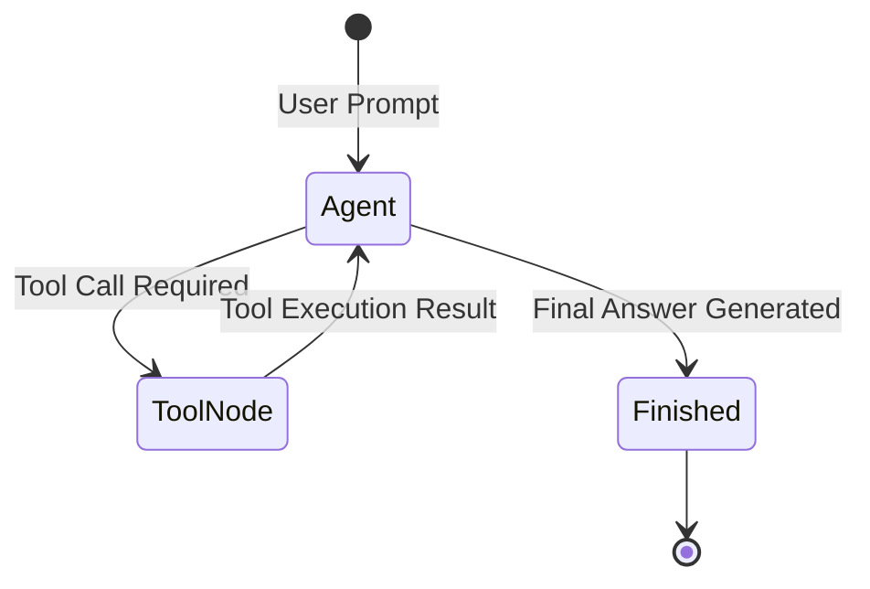

# 📹 Building Agentic AI App with CrewAI

<div className="video-card" style={{border: '1px solid #30363d', borderRadius: '8px', padding: '16px', marginBottom: '24px', background: 'rgba(56, 139, 253, 0.05)'}}>
  <div style={{display: 'flex', gap: '16px', flexWrap: 'wrap'}}>
    <div><strong>Instructor:</strong> Krish Naik (Krish Naik)</div>
    <div><strong>Duration:</strong> 136m 28s</div>
    <div><strong>Playlist:</strong> Real-World Multi-Agent Frameworks (Krish Naik)</div>
    <div><strong>Watch Link:</strong> <a href="https://www.youtube.com/watch?v=lLCck9FH6z4" target="_blank" rel="noopener noreferrer">YouTube Lecture ↗</a></div>
  </div>
</div>

## 📌 Executive Summary & Learning Objectives

This lecture covers **Building Agentic AI App with CrewAI**, focusing on production implementations, edge cases, and industry standards:
- Core intuition, architecture, and underlying mechanisms.
- Key differences between theoretical research implementations and scalable enterprise patterns.
- Concrete Python walkthroughs, error recovery, and performance optimization.

---

## 🏗️ Architecture & Conceptual Workflow



---

## 📖 Core Concepts & Technical Deep Dive

### 1. Architectural Foundations
In modern production AI engineering, **Building Agentic AI App with CrewAI** is essential for ensuring reliability, low latency, and deterministic outcomes. As AI systems evolve from naive prompt-in / completion-out scripts into distributed systems, engineers must handle:
- **State management & consistency:** Ensuring intermediate states and tool invocations are tracked.
- **Error boundaries & recovery:** Graceful degradation when external LLMs or vector stores encounter rate limits or network partitions.
- **Resource utilization & cost efficiency:** Caching common queries and reducing unnecessary foundation model token expenditure.

### 2. Operational Considerations
- **Latency Optimization:** Pre-computing embeddings, utilizing asynchronous non-blocking event loops, and streaming tokens via Server-Sent Events (SSE).
- **Security & Sandboxing:** Validating inputs before ingestion, sanitizing LLM outputs, and isolating tool execution environments.

---

## 💻 Production Implementation Walkthrough

```python
# Production Implementation Blueprint
def run_production_pipeline():
    print("Executing production pipeline...")

if __name__ == "__main__":
    run_production_pipeline()
```

---

## 💡 Production Best Practices & Tips

:::tip Production Deployment Guideline
When deploying Building Agentic AI App with CrewAI in enterprise environments, always configure automated retries with exponential backoff and telemetry tracing (such as OpenTelemetry or LangSmith).
:::

:::warning Common Failure Modes
Watch out for state contamination across concurrent requests. Ensure each session or user interaction uses an isolated thread ID or execution context.
:::

---

## 🎯 Key Takeaways & Quick Reference

| Dimension | Production Standard | Pitfall to Avoid |
| :--- | :--- | :--- |
| **Execution** | Async / Non-blocking with timeouts | Synchronous blocking calls in event loops |
| **Data Validation** | Strict Pydantic v2 schemas | Untyped dictionary access |
| **Monitoring** | Distributed tracing & latency percentiles | Relying only on standard console logs |

## ⏱️ Lecture Timeline & Key Topics

| Timestamp | Key Topic / Concept Discussed |
| :--- | :--- |
| **00:00:00** | to you live... |
| **00:30:17** | ask me I will teach you again okay so... |
| **01:06:56** | yes like uh I can use some type of other... |
| **01:40:20** | research analyst agent okay so I'll be... |
| **02:16:07** | everyone we'll just stop sharing... |


---

---

## 📜 Complete Lecture Transcript (Hindi / Hinglish)

> **Language:** Hindi / Hinglish | **Source:** `10 - How to build a Chatbot using LangGraph.hi-orig.srt` | **Total Segments:** 19 | **Word Count:** ~6,291 words

<details>
<summary><b>Click to expand full chronological transcript (19 timestamped intervals)</b></summary>

#### ⏱️ [00:00 ➔ 00:02]

हाय गाइज़, माय नेम इज नितेश एंड यू वेलकम टू माय YouTube चैनल। इस वीडियो में भी हम लोग अपना एजेंटिक एआई यूजिंग लैंग ग्राफ प्लेलिस्ट कंटिन्यू करेंगे। अह अभी तक इस प्लेलिस्ट में हमने दो चीजें मेनली सीखी हैं। फर्स्ट हमने सीखा है लैंग ग्राफ के फंडामेंटल्स अ थ्योरिटिकल फंडामेंटल्स प्लस एजेंटिक एआई के कुछ बेसिक्स। और उसके बाद हमने फिर बहुत बेसिक लेवल पे लैंग ग्राफ में आप वर्क फ्लोस कैसे बना सकते हो अलग-अलग टाइप के? उसके ऊपर हमने काम किया। हमने सीक्वेंशियल वर्क फ्लो बनाना सीखा। पैरेलल वर्क फ्लो बनाना सीखा, अ कंडीशनल वर्क फ्लो बनाना सीखा और फिर लास्ट वीडियो में हमने लूपिंग वर्क फ्लोस बनाने सीखे। तो इस पॉइंट पे आई कैन से कि हमें जो भी बेसिक्स चाहिए होते हैं एजेंटिक एआई एप्लीकेशनेशंस बनाने के लिए वो काइंड ऑफ आ गए हैं। तो अब हम क्या करेंगे? अब हम थोड़ा डीप ड्राइव करेंगे और कुछ यूज़फुल चीजें बिल्ड करेंगे विद द हेल्प ऑफ लनग्राफ। जैसे कि आज के वीडियो से हम एक नई चीज शुरू करने वाले हैं। सो मैंने यह प्लान किया है कि हम एक बहुत अच्छा चैट बॉट बनाएंगे यूजिंग लंग ग्राफ। अब मैं इसको अच्छा इसलिए बोल रहा हूं बिकॉज़ इस एक सिंगल चैटबॉट में कई तरह के फीचर्स हम ऐड करेंगे। जैसे कि पहला फीचर तो यह होगा कि आप इससे नॉर्मल चैटिंग कर पाओगे। जैसे कि आप किसी भी एलएलएम बेस्ड चैटबॉट के साथ कर पाते हो। बट इसके साथ-साथ हम इसमें रैक का भी फीचर ऐड करेंगे। मतलब कि अगर जरूरत पड़ी तो यह चैट बॉट हमारे डॉक्यूमेंट्स में से देख करके भी हमें आंसर बता पाएगा। फिर हम क्या करेंगे? इसी चैटबॉट में कुछ टूल्स ऐड करेंगे। सो अगर हमारे चैटबॉट को कुछ एक्शन लेने की जरूरत है तो वो भी इन टूल्स की हेल्प से हमारा चैटबॉट आसानी से ले पाएगा। और फिर हम यहीं पे रुकेंगे नहीं। हम इस चैटबॉट को एक यूआई देंगे और फिर हम इसमें लैंग्मिथ का इंटीग्रेशन भी करेंगे। एंड नॉट ओनली दिस इस चैटबॉट को बनाने के प्रोसेस में हम लैंग ग्राफ के कुछ एडवांस्ड कांसेप्ट्स भी पढ़ेंगे। जैसे कि हम पढ़ेंगे मेमोरी का कांसेप्ट। सो हम इस चैटबॉट में मेमोरी को इंप्लीमेंट

#### ⏱️ [00:02 ➔ 00:04]

करेंगे। हम यहां पे पढ़ेंगे पर्सिस्टेंस का कांसेप्ट। ठीक है? चेक पॉइंटर्स क्या होते हैं? पर्सिस्टेंस क्या होता है? ये सब हम यहां पे देखेंगे। इसके अलावा हम इस चैटबॉट में एचआईटीएल भी इंप्लीमेंट करेंगे एज इन ह्यूमन इन द लूप। फिर यहीं पर हम सीखेंगे रीिटाई का लॉजिक कैसे इंप्लीमेंट किया जाता है। फॉल्ट टॉलरेंस कैसे ऐड किया जाता है। सो बेसिकली मेरा प्लान ये है कि इस सिंगल चैटबॉट को बिल्ड करने के प्रोसेस में हम लंग ग्राफ के जितने भी एडवांस्ड टॉपिक्स हैं वो सब कुछ यहां पे कवर करें। ठीक है? अब आज का जो वीडियो है वो इस पूरे के पूरे सीक्वेंस का फर्स्ट वीडियो है। और आज की वीडियो में हम क्या करने वाले हैं? हम एक चैटबॉट बनाने वाले हैं। एक सिंपल चैटबॉट जो यूजर से चैटिंग कर सकता है और उसका प्रीवियस कॉन्वर्सेशन हिस्ट्री याद रख सकता है। ठीक है? इतना हम आज के वीडियो में करने वाले हैं और फिर सब्सक्वेंटली हम चीजें इसमें ऐड करते जाएंगे। इसकी कॉम्प्लेक्सिटी बढ़ाते जाएंगे। ठीक है? तो आई रियली होप आपको अभी तक का पूरा फंडा समझ में आ गया। अब लेट्स स्टार्ट बिल्डिंग आवर चैटबॉट। सो गाइस चार्टबॉट को बनाने के पहले एक बार चार्टबॉट का डिजाइन समझ लेते हैं। चार्टबॉट एसेंशियली होता तो एक वर्क फ्लो ही है। इट्स बेसिकली अ एलएलएम बेस्ड वर्क फ्लो जैसा वर्क फ्ल्लोस अभी तक हम बनाते आ रहे हैं। इनफैक्ट यह थोड़ा और सिंपल वर्क फ्लो होता है। मैंने यहां पे इसका एग्जैक्ट फ्लो चार्ट बना रखा है। सो यह चार्ट बॉट जो है यह एक सीक्वेंशियल वर्क फ्लो है जिसमें सिर्फ एक नोड होता है। ठीक है? यहां पे स्टार्ट पे आप क्या करते हो? यूजर का मैसेज भेजते हो। जैसे यूजर ने पूछा व्हाट इज द कैपिटल ऑफ इंडिया? तो वो मैसेज उठा करके आप अपने चैट नोड के पास भेजते हो। अब यह जो चैट नोड है यहां पर एक एलएलएम बैठा हुआ है। वो इस मैसेज को रिसीव करता है और फिर उस मैसेज के हिसाब से एक रिप्लाई जनरेट करता है। जैसे कि अगर यूजर का मैसेज है व्हाट इज द कैपिटल ऑफ इंडिया

#### ⏱️ [00:04 ➔ 00:06]

तो यह एलएलएम पलट के जनरेट करेगा। न्यू दिल्ली और वही हम एंड के पास भेज देंगे और हमारा वर्क फ्लो खत्म हो जाएगा और यही पूरी चीज आपको लूप में करते रहनी है जब तक यूजर आपके साथ चैट कर रहा है। तो फंडा यही है। आपको यह सिंपल सीक्वेंशियल वर्क फ्लो बनाना है विद द हेल्प ऑफ जस्ट वन नोड। ज्यादा इंपॉर्टेंट डिस्कशन ये है कि इस वर्क फ्लो से रिलेटेड स्टेट क्या होगा? कभी भी आप कोई भी वर्क फ्लो बनाते हो लैंग ग्राफ में तो सबसे पहले आप वहां पर एक स्टेट डिफाइन करते हो। तो यहां पर स्टेट जो है वो एक्चुअली होगा जितने भी मैसेजेस एक्सचेंज हो रहे हैं बिटवीन द यूजर एंड द एलएलएम खुद सोच के देखो ना एक चैट बॉट में क्या डेटा इंपॉर्टेंट है जो भी मैसेजेस हैं। राइट? तो हम क्या करेंगे? हम हमारे स्टेट में मैसेजेस बोल के एक एट्रिब्यूट के अंदर एक लिस्ट के अंदर सारे के सारे मैसेजेस को स्टोर करेंगे। जैसे कि यूजर ने बोला व्हाट इज द कैपिटल ऑफ इंडिया। तो यह मैसेज भी मैं इस लिस्ट में ऐड करूंगा। पलट के एलएलएम ने बोला न्यू दिल्ली। तो यह न्यू दिल्ली वाला मैसेज भी यहां पे ऐड होगा। उसके बाद मैंने फिर से पूछा कि व्हाट इज द कैपिटल ऑफ पोर्टल? तो वो मैसेज भी ऐड होगा। एलएलएम ने बोला लेसबन तो वो वाला भी ऐड होगा। तो बेसिकली जो भी कॉन्वर्सेशन हिस्ट्री है वो पूरी की पूरी कॉन्वर्सेशन हिस्ट्री को हम स्टेट के अंदर स्टोर करेंगे और यही हमारे स्टेट के अंदर रहने वाला है। ठीक है? तो चलो स्टार्ट करते हैं कोड करना। सो यहां पे मैंने एक नई फाइल बना ली है और जो भी नेसेसरी इंपोर्ट्स हैं मैंने ले लिए हैं। सबसे पहली चीज जो हम करेंगे वो है कि हम यहां पर अपना स्टेट डिफाइन करेंगे। तो वी आर क्रिएटिंग अ क्लास। लेट्स कॉल दिस क्लास चैट स्टेट। यह इन्हहेरिट करेगी टाइप्ड डिक्शनरी से और यहां पर सिर्फ एक एट्रिब्यूट होगा जिसका नाम होगा मैसेजेस। अब मैसेजेस जो है वो होगा एनोटेटेड लिस्ट ऑफ स्ट्रिंग्स। क्या

#### ⏱️ [00:06 ➔ 00:08]

लगता है आपको? लिस्ट ऑफ स्ट्रिंग रखना सही होगा? हां सही होगा। बट इससे बेटर होगा अगर आप स्ट्रिंग के बदले बेस मैसेज रखो। अब आप बोलोगे बेस मैसेज क्या होता है? सो अगर आपको लैंग चेन प्लेलिस्ट याद होगा तो वहां पर मैंने आपको मैसेजेस के बारे में पढ़ाया था। मैंने आपको बताया था कि जभी भी आप किसी एलएलएम से बात करते हो तो आप इन टर्म्स ऑफ मैसेजेस बात करते हो। ठीक है? दो-तीन टाइप के मैसेजेस मैंने आपको बताए थे। पहला बताया था ह्यूमन मैसेज जो ह्यूमन टाइप करके एलएलएम के पास भेजता है। व्हाट इज द कैपिटल ऑफ इंडिया? यह एक ह्यूमन मैसेज है। फिर सेकंड मैंने आपको बताया था एआई मैसेज। व्हाट इज द कैपिटल ऑफ इंडिया के बदले एलएलएम ने पलट के रिप्लाई किया न्यू दिल्ली। तो, यह जो न्यू दिल्ली है, यह एक एआई मैसेज है। बिकॉज़ यह एआई ने जनरेट किया है। ठीक है? फिर मैंने आपको सिस्टम मैसेज भी पढ़ाया था जो एक एलएलएम को रोल स्पेसिफाई करने के लिए यूज़ किया जाता है। दैट यू आर अ वेरी एक्सपीरियंस्ड डेटा साइंटिस्ट। आंसर द फॉलोइंग क्वेश्चंस अकॉर्डिंगली। नाउ दिस इज़ अ सिस्टम मैसेज। ठीक है? टूल मैसेज भी मैंने पढ़ाया था। अब ये जो चारों मैसेजेस टाइप हैं ह्यूमन मैसेज, एआई मैसेज, सिस्टम मैसेज, टूल मैसेज ये सारे के सारे टाइप्स इन्हहेरिट करते हैं बेस मैसेज से। तो जब मैंने यहां पे ये लिखा कि हमारे जो मैसेजेस हैं वो लिस्ट ऑफ बेस मैसेजेस हैं। इसका ये मतलब है कि इस लिस्ट के अंदर ह्यूमन मैसेज भी हो सकता है, एआई मैसेज भी हो सकता है, सिस्टम मैसेज भी हो सकता है, टूल मैसेज भी हो सकता है। तो हमने ये फ्लेक्सिबिलिटी ऐड कर दी। अब एक और चीज हमें यहां पे स्पेसिफाई करनी पड़ेगी और वो है एक रिड्यूसर फंक्शन। रिड्यूसर फंक्शन क्यों ऐड करना पड़ेगा? उसका रीज़न ये है कि मैंने आपको लास्ट वीडियो में बताया था कि स्टेट का नेचर ऐसा होता है कि यहां पे जभी भी आप कोई नई वैल्यू डालने जाते हो तो प्रीवियस वैल्यू अपडेट हो जाती है। रिप्लेस हो जाती है। जैसे कि मान लो यूजर ने बोला व्हाट इज द कैपिटल ऑफ इंडिया? यह पहला मैसेज है। तो यह पहला मैसेज जाके इस लिस्ट में स्टोर हो गया। अब पलट के एलएलएम ने जनरेट किया न्यू

#### ⏱️ [00:08 ➔ 00:10]

दिल्ली। तो अब इस न्यू दिल्ली को भी हमें इस लिस्ट में डालना है। तो जैसे ही आप इस न्यू दिल्ली को इस लिस्ट में भेजोगे, यह वाला मैसेज डिलीट हो जाएगा और सिर्फ न्यू दिल्ली रह जाएगा। फिर यूजर अगला क्वेश्चन पूछेगा व्हाट इज द कैपिटल ऑफ़ पोर्तुगल? तो फिर यह न्यू दिल्ली डिलीट हो जाएगा और यूजर का मैसेज वहां पे आ जाएगा। तो बेसिकली स्टेट की फितरत यह है कि वो प्रीवियस कोई भी चीज पड़ी हुई है उसको हटा देता है और नई चीज को रख लेता है। बट हमें ऐसा नहीं चाहिए। हमें पूरा का पूरा कॉन्वर्सेशन हिस्ट्री मेंटेन करना है। तो ये करने के लिए हमें क्या करना पड़ेगा? एक रिड्यूसर फंक्शन यूज करना पड़ेगा। जैसा हमने लास्ट वीडियो में भी किया था ऑपरेटर डॉट ऐड बोल के। उससे क्या हो रहा था कि पिछला वाला हट नहीं रहा था। नया वाला ऐड हो जा रहा था। यहां पर हम ऑपरेटर डॉट ऐड यूज़ करने के बदले एक स्पेशलाइज़्ड रिड्यूसर फंक्शन यूज़ करेंगे जिसका नाम होता है ऐड मैसेजेस। यह एक्चुअली लैंग ग्राफ में बिल्ट इन होता है। फ्रॉम लंग ग्राफ डॉट ग्राफ डॉट मैसेज इंपोर्ट ऐड मैसेजेस। अब यह काम तो बिल्कुल वैसे ही करता है जैसे ऑपरेटर डॉट ऐड करेगा। बट ये ज्यादा ऑप्टिमाइज्ड है टू वर्क विद बेस मैसेजेस। दैट इज व्हाई लंग्राफ में इट्स रिकमेंडेड कि कभी भी आप एक लिस्ट के अंदर मैसेजेस को अपेंड करना चाह रहे हो तो यूज ऐड मैसेजेस इंस्टेड ऑफ अ आपका ऑपरेटर डॉट ऐड ठीक है तो आई होप आपको ये बात समझ में आ गई और ये हमने अपना स्टेट डिफाइन कर लिया स्टेट डिफाइन हो गया अब हम अपना ग्राफ क्रिएट करेंगे तो हमारा ग्राफ विल बी इक्वल टू स्टेट ग्राफ और यहां पे हम अपना चैट स्टेट भेज देंगे और अब हमें क्या करना है? हमारे नोड्स ऐड करने हैं। तो न्स ऐड करने के लिए वी विल राइट ग्राफ डॉट ऐड नोड। और आपको मैंने बताया ही है कि हमारा जो वर्क फ्लो है उसमें सिर्फ एक ही नोड है और उस नोड का हम नाम रखने वाले हैं चैट नोड। और इससे एसोसिएटेड जो फंक्शन होगा उसका भी नाम

#### ⏱️ [00:10 ➔ 00:12]

होगा चैट नोड। ये फंक्शन अभी हमने बनाया नहीं है। ठीक है? तो एक काम करते हैं। ये फंक्शन हम लोग बना लेते हैं। सो इस फंक्शन का नाम है चैट नोड। इसको स्टेट मिल रहा है एज इनपुट जो कि चैट स्टेट टाइप का स्टेट है। और इस फंक्शन के अंदर हमें करना क्या है? हमें यूजर की जो क्वेरी है उसको उठाना है स्टेट के अंदर से और उसको भेजना है एलएलएम के पास और फिर जो भी रिस्पांस आ रहा है उसको हमें वापस स्टोर करना है स्टेट के अंदर राइट सो सबसे पहले हमें क्या करना पड़ेगा एक एलएलएम डिफाइन करना पड़ेगा राइट तो हम एक काम करते हैं यहां पर हम एक एलएलएम डिफाइन करते हैं जो कि चैट ओपन एi का होगा डिफॉल्ट मॉडल। ठीक है? अब सबसे पहले अ व्हाट वी विल डू इज़ कि वी विल एक्सट्रैक्ट जो भी मैसेजेस अभी हैं हमारे स्टेट के अंदर। तो वो हम एक्सट्रैक्ट करेंगे यूजिंग दिस। और फिर हम क्या करेंगे? हम lmm.invok को कॉल करेंगे और वहां पर यह मैसेजेस भेज देंगे। पलट के हमें एक रिस्पांस मिलेगा और अब उस रिस्पांस को हमें क्या करना है? रिटर्न कर देना है। तो, हम लिखेंगे मैसेजेस के अंदर लिस्ट के अंदर रिस्पांस। ठीक है? ये लिस्ट के अंदर हमने क्यों किया? बिकॉज़ यहां पे हमने लिस्ट डिफाइन कर रखा है। तो, हर नया मैसेज जो जनरेट हो रहा है, वो हम लिस्ट के अंदर भेज रहे हैं और वो लिस्ट जाकर के एकिस्टिंग लिस्ट के साथ मर्ज हो जा रही है। आई होप आपको समझ में आ रहा है। ये चीज़ हमने लास्ट वीडियो में भी किया था। ठीक है? तो ये बन गया हमारा चार्ट नोड। ओके? अब हम क्या करेंगे? हमारे एजेस क्रिएट करेंगे। सो हम लिखेंगे ग्राफ डॉट ऐड एज और हम स्टार्ट से स्टार्ट करेंगे और

#### ⏱️ [00:12 ➔ 00:14]

वहां से हम जाएंगे चार्ट नोड के पास। और फिर हम ग्राफ से स्टार्ट आई एम सॉरी ग्राफ डॉट ऐड एच पे जाएंगे। और इस बार चार्ट नोड से हमारा एच निकल के जाएगा एंड के पास। और यह हो गया हमारा ग्राफ। इस ग्राफ को हम कंपाइल कर लेते हैं। और जो भी ऑब्जेक्ट हमें मिल रहा है, उसको हम एक चार्ट बॉट बोल के वेरिएबल में स्टोर कर ले रहे हैं। इंस्टेड ऑफ़ वर्क फ्लो यहां पे हम चार्ट बॉट बुला रहे हैं। एक बार देख लेते हैं कि हमारा ये चार्ट बॉट वर्क फ्लो दिखता कैसा है। देखो बिल्कुल वैसा ही दिख रहा है। स्टार्ट चार्ट नोड एंड। ठीक है? तो अब एक काम करते हैं। इसको ट्राई आउट करते हैं एक बार। ठीक है? तो व्हाट वी विल डू इज हम एक इनिशियल स्टेट बनाते हैं। और इस इनिशियल स्टेट के अंदर मैं मैसेजेस बोल करके एट्रिब्यूट ले रहा हूं। और यह एक लिस्ट होगा। बिकॉज़ मैसेजेस इज़ अ लिस्ट। और इसके अंदर हम क्या कर रहे हैं? हम एक ह्यूमन मैसेज क्रिएट कर रहे हैं। जिसका कंटेंट है व्हाट इज द कैपिटल ऑफ इंडिया? और अब मैं क्या कर रहा हूं? मेरे चार्टबॉट को इनवोक कर रहा हूं विथ द हेल्प ऑफ़ इनिशियल स्टेट। और मैं इसको जैसे ही रन करूंगा यह देखो। यह रहा मेरा करंट स्टेट। अब इस स्टेट में आप नोटिस करो मैसेजेस जो एट्रिब्यूट है उसके अंदर एक लिस्ट है और उस लिस्ट के अंदर दो टाइप के मैसेजेस हैं। एक ह्यूमन मैसेज जो कि बोल रहा है व्हाट इज द कैपिटल ऑफ इंडिया? और एक एआई मैसेज जो मेरे एलएलएम ने रिप्लाई किया और उसका कंटेंट क्या है? द कैपिटल ऑफ इंडिया इज न्यू दिल्ली। ठीक है? अगर आपको एक्सट्रैक्ट करना है एग्जैक्टली अ आंसर को तो आप क्या करोगे? इसके अंदर से मैसेजेस को निकालोगे और मैसेजेस से -1 को निकालोगे तो आपको एi मैसेज मिल गया और आपको उसका कंटेंट चाहिए।

#### ⏱️ [00:14 ➔ 00:16]

तो ये रहा आपका आंसर। ठीक है? बन गया आपका चैट बॉट। आई नो आप लोग खुश नहीं हो। आप बोलोगे ये कैसा चैटबॉट है? मैं सिर्फ एक क्वेश्चन पूछ रहा हूं और वो आंसर कर दे रहा है और खत्म हो जा रहा है हमारा प्रोग्राम। चैटबॉट ऐसा थोड़ी होता है। चैटबॉट से आप चैट कर सकते हो। राइट? तो अभी हमने चैटिंग का फीचर डेवलप नहीं किया है। चैटबॉट का बेसिक स्केलेटन बनाया है। ठीक है? तो नेक्स्ट हम लोग क्या करेंगे? एक ऐसा कोड लिखेंगे जिसमें ये पूरी चीज हम एक लूप के अंदर कर रहे होंगे। ठीक है? जब तक यूजर एग्जिट नहीं बोलेगा या क्विट नहीं बोलेगा तब तक हम चैट करते रहेंगे। जैसे ही यूजर एग्जिट बोलेगा तब जाकर के प्रोग्राम रुकेगा। सो चैटबॉट वाला फील लाने के लिए हम क्या करेंगे? सबसे पहले एक वाइल लूप लिखेंगे। ठीक है? और इसका कंडीशन विल ऑलवेज बी ट्रू। मतलब ये लूप चलता रहेगा जब तक हम इसको एक्सप्लसिटली बंद नहीं करेंगे। ठीक है? और यहां पे अंदर हम क्या करेंगे? हम हमारे यूजर को बोलेंगे चैट करने के लिए, मैसेज टाइप करने के लिए। तो हम यूजर को बोल रहे हैं टाइप हियर। ठीक है? और यूजर पलट के हमें अपना मैसेज प्रोवाइड कर रहा है जिसको हम इस वेरिएबल में डाल रहे हैं। अब यहां पर हम एक सिंपल चेक लगाते हैं कि इफ यूजर मैसेज डॉट स्ट्रिप कोई भी अगर वाइट स्पेससेस हैं आगे या पीछे उसको हटा रहे हैं और उसको लोअर कर रहे हैं और हम बोल रहे हैं कि अगर यूजर के मैसेज में या तो एग्जिट है या तो क्विट है या तो बाय है। इनमें से अगर कुछ भी है तो लूप ब्रेक कर जाओ। चैटिंग खत्म हो जाएगी। प्रोग्राम बंद हो जाएगा। बट अगर इनमें से कुछ नहीं है वि मींस यूजर ने कुछ प्रॉपर मैसेज डाला है एलएलएम के लिए तो फिर हम क्या करेंगे?

#### ⏱️ [00:16 ➔ 00:18]

उसको प्रोसेस करेंगे। जैसे हम करते आ रहे हैं। सो हम क्या करेंगे? हम चैटबॉट डॉट इनवोक करेंगे और इनवोक के अंदर हम एक डिक्शनरी पास करेंगे। बेसिकली हमारा इनिशियल स्टेट पास करेंगे। जहां पर हम लिखेंगे मैसेजेस और मैसेजेस के अंदर अ लिस्ट के अंदर ह्यूमन मैसेज और ह्यूमन मैसेज का कंटेंट क्या हो जाएगा जो भी हमारा यूजर मैसेज है। बेसिकली ऊपर वाला सेम फ्लो। ठीक है? तो ये चैट बॉट को हमने इनवोक कर दिया। इससे पलट के हमें एक रिस्पांस मिला या फाइनल स्टेट मिला। इसी के अंदर हमारा एआई मैसेज है। तो अब हमें क्या करना है? आल्सो यहां पर हम एक काम कर लेंगे। यूजर जैसे ही अपना मैसेज हमें देगा हम उसको प्रिंट भी कर लेंगे। ठीक है? तो यूजर को उसका मैसेज भी दिखाई दे जाएगा। अब जब एआई का रिस्पांस आया तो हम प्रिंट करेंगे कि एआई ने बोला है रिस्पांस। रिस्पांस में सारे के सारे मैसेजेस हैं। रिस्पांस इज़ बेसिकली दिस ऑब्जेक्ट। यू कैन सी रिस्पांस इज़ बेसिकली दिस ऑब्जेक्ट। पूरा मैसेज आ रहा है तो इसमें ह्यूमन मैसेज भी होगा, एi मैसेज भी होगा। तो हम क्या करेंगे? रिस्पांस के अंदर सबसे पहले मैसेजेस को एक्सट्रैक्ट करेंगे। मैसेजेस के बाद हम लास्ट मैसेज को एक्सट्रैक्ट करेंगे और उसका कंटेंट निकालेंगे। ठीक है? तो ये हो गया गाइस हमारा कोड। ठीक है? सिंपल फ्लो है। लूप तब तक चलाना है जब तक यूजर ने एग्जिट, क्विट या बाय नहीं बोला। अगर इनमें से कुछ भी नहीं बोला है, कुछ अलग चीज बोली है, व्हाट इज द कैपिटल ऑफ इंडिया? ऐसा कोई मैसेज भेजा है, तो हमने हमारे चैट बॉक्स को इनवोक किया इस फॉर्म में। उससे पलट के हमें हमारी पूरी कॉन्वर्सेशन हिस्ट्री मिली। इंक्लूडिंग द सबसे रीसेंट वाला एआई मैसेज। हम सबसे रीसेंट वाले एआई मैसेज को डिस्प्ले कर रहे हैं। ठीक है? एक बार इसको रन करते हैं। देखो, यहां पे हम टाइप करेंगे। हाय। पता नहीं इतना टाइम क्यों लग गया। एक काम करते

#### ⏱️ [00:18 ➔ 00:20]

हैं। एक बार एग्जिट करते हैं। अच्छा नहीं आया था मैसेज। हेलो हाउ कैन आई असिस्ट यू? एक बार फिर से चलाते हैं। हाय। ठीक है। हेलो हाउ कैन आई असिस्ट यू? व्हाट इज द कैपिटल ऑफ इंडिया? थोड़ा सा कुछ यूआई बग है ये जुपिटर नोटबुक का। मैं नेक्स्ट टाइप करता हूं। व्हाट इज द कैपिटल ऑफ स्पेन? हां, देखो, यह मैसेज आया था बस यूआई में डिस्प्ले नहीं हो रहा था। था व्हाट इज़ द कैपिटल ऑफ़ स्पेन? मेड्रिड। व्हाट इज द अ कैपिटल ऑफ पोर्तगल? अ फिर से सेम प्रॉब्लम हो रही है। ये कुछ यूआई बग है। ये हमारे कोड का इशू नहीं है। व्हाट इज़ क्वांटम मैकेनिक्स? देखो अब ये आया लेसबन और ये रहा एआई का मैसेज। ठीक है? अब हम चाह तो यहां से बाय टाइप कर सकते हैं और हमारा प्रोग्राम बंद हो गया। ठीक है? तो अब यह जो आपकी स्क्रीन पे है आफ्टर अप्लाइंग दिस लॉजिक दिस सीम्स लाइक अ प्रॉपर चैट बॉट विदाउट अ यूआई। ऑब्वियसली यूआई हमने बिल्ड नहीं किया। हम सिंपली कंसोल में टाइप कर रहे हैं। बट या नाउ दिस इज़ गिविंग अस अ फील ऑफ़ अ चैटबॉट। राइट? बट इस चैटबॉट में एक बहुत बड़ी प्रॉब्लम है। ठीक है? क्या प्रॉब्लम है? मैं आपको दिखाता हूं। सो व्हाट आई विल डू इज़ मैं इस कोड को फिर से रन करूंगा और मैं बोलूंगा हाय माय नेम इज नितीश। तो यह बोल रहा है हेलो नितीश हाउ कैन आई असिस्ट यू? अब मैं बोल रहा हूं कैन यू टेल मी माय नेम। देखो क्या बोल रहा है। आई एम सॉरी बट आई डोंट हैव एक्सेस टू योर पर्सनल इनेशन। मैंने अभी जस्ट इसको अपना नाम बताया है। बट उसको याद नहीं है। एक और एग्जांपल लेते हैं। ऐड 10 2 100 110 नाउ ऐड 15 टू द रिजल्ट। देखो

#### ⏱️ [00:20 ➔ 00:22]

उसने कुछ गार्बेज वैल्यू दे दिया 25 जबकि होना क्या चाहिए था? 125। सो बेसिकली प्रॉब्लम यह हो रही है कि हमारा जो चैटबॉट है इसके पास मेमोरी नहीं है। पास्ट कॉन्वर्सेशन में हमने क्या बात की है वो इसको याद नहीं रह रहा है। अब आप सोचोगे आपके दिमाग में ये डाउट आएगा बट ऐसा क्यों हो रहा है? हम तो जितनी बार भी इनवोक कर रहे हैं हमारे चैटबॉट को हम पूरा का पूरा कॉन्वर्सेशन हिस्ट्री भेज रहे हैं। जब उसको पूरी की पूरी कॉन्वर्सेशन हिस्ट्री मिल रही है तो फिर वो इतने सिंपल क्वेश्चंस आंसर क्यों नहीं कर पा रहे? अब आई रियली वांट कि आप इस क्वेश्चन का आंसर दो। वीडियो को पॉज करो। कोड को देखो और सोच के बताओ कि क्या प्रॉब्लम है इस कोड में। क्यों हमारा चैट बॉट गजनी का आमिर खान बन गया है। चलो मैं बताता हूं। इसका रीजन यह है कि आप खुद देखो इस कोड में कर क्या रहे हो। आप लूप चला रहे हो। ठीक है? तो फर्स्ट टाइम जब लूप चला तो मैंने बोला हाय माय नेम इज नितीश। यूजर ने यह बोला। तो हमने क्या किया? इस मैसेज को पकड़ा। इसको इस लिस्ट में डाला और हमने हमारे चैटबॉट को इनवोक कर दिया। बेसिकली हमने इस फ्लो को ट्रिगर कर दिया। अब हाय माय नेम इज नितीश। इस चैट नोड के पास पहुंचा। तो चैट नोड ने पलट के यह मैसेज जनरेट किया। हेलो नितीश हाउ कैन आई असिस्ट यू? ठीक है? यह मैसेज एंड के पास गया और हमारा वर्क फ्लो एंड हो गया। उसका एग्जीक्यूशन खत्म हो गया। ठीक है? स्टेट में जो था सब हट गया। फिर क्या हुआ? दोबारा हम लूप में यहां पे पहुंचे। और फिर से हमने यूजर को बोला टाइप करो। अब यूजर नेट बोला कैन यू टेल मी माय नेम? तो अब हमने फिर से क्या किया? इस मैसेज को उठाया

#### ⏱️ [00:22 ➔ 00:24]

और इसको एक लिस्ट के अंदर डाल के फिर से हमने एलएलएम के पास भेजा। बट इस बार इस लिस्ट में सिर्फ यही मैसेज तो है। कैन यू टेल मी माय नेम? यह प्रीवियस दोनों मैसेज तो आए ही नहीं। क्योंकि वो तो प्रीवियस इनवोकेशन का पार्ट थे। दोबारा से जब आप इनवोक कर रहे हो चैटबॉट को तो आप सिर्फ इस मैसेज के साथ इनवोक कर रहे हो। एलएलएम को सिर्फ यह मैसेज दिखाई दे रहा है। सो बेसिक प्रॉब्लम यह है कि हम जितनी बार लूप कर रहे हैं उतनी बार इनवोक फंक्शन को कॉल कर रहे हैं। और इनवोक फंक्शन जभी भी कॉल होगा तो स्टेट एकदम स्क्रैच से शुरू होगी। इसमें कुछ भी प्रीवियस इनेशन नहीं होगा। सो टेक्निकली हमने सब कुछ सही किया। बस एक बहुत बड़ा फ्लॉ है कि हम बार-बार इनवोक कर रहे हैं हमारे चैटबॉट को फ्रॉम दिस लूप जिसकी वजह से प्रीवियस वाला सब कुछ इरेज़ हो जा रहा है और फिर से हर बार हम फ्रेश से स्टार्ट कर रहे हैं। एंड दिस इज़ द बिगेस्ट प्रॉब्लम। ठीक है? तो अब मैं आपको बताता हूं कैसे आप इस प्रॉब्लम को सॉल्व कर सकते हो। यहां पर हम एक कांसेप्ट यूज करेंगे लैंग्राफ का जिसको पर्सिस्टेंस बोला जाता है। अब मैं बहुत डिटेल में नहीं जाऊंगा इस कांसेप्ट के बिकॉज़ अगले वीडियो में मैं बहुत अच्छे तरीके से आपको पर्सिस्टेंस का कांसेप्ट समझाने वाला हूं। यहां पे बस मैं आपको यूज़ करके दिखाऊंगा। अब देखो पर्सिस्टेंस का बेसिक फंडा बहुत सिंपल है। अभी तक क्या हो रहा था कि जैसे ही आप इस वर्क फ्लो को ट्रिगर करते हो विद द हेल्प ऑफ इनवोक तो स्टेप बाय स्टेप सारे के सारे नोट्स एग्जीक्यूट होते चले जाते हैं। और ये सारे के सारे नोट्स स्टेट में चेंजेस करते चले जाते हैं। राइट? बट जैसे ही आप एंड पर पहुंचते हो आपका स्टेट जो है वो काइंड ऑफ मेमोरी से इरेज हो जाता है। फिर आप जब अगली बार इनवोक करोगे तो फिर से स्टेट की वैल्यूज़ जो हैं वो स्क्रैच से फिल होना शुरू होती हैं। राइट? यही होता है। पर्सिस्टेंस में यह फंडा होता है कि जब आपका एग्जीक्यूशन एंड पे पहुंचता है तो

#### ⏱️ [00:24 ➔ 00:26]

आप अपने स्टेट में रखी हुई चीजों को इरेज़ नहीं करते। इंस्टेड आप उसको कहीं पे स्टोर कर लेते हो। अब आपके पास मल्टीपल ऑप्शंस हैं स्टोर करने के। पहला ऑप्शन यह है कि आप उसको किसी डेटाबेस में स्टोर कर लो। सो दैट आप उसको कभी भी फ्यूचर में वापस ला पाओ। और सेकंड इज़ कि आप उसको अपने मेमोरी में एज इन रैम में स्टोर कर लो। कि जब तक आपका प्रोग्राम मेमोरी में है तब तक स्टेट के अंदर जो भी चीजें रखी हुई हैं वो एज इट इज़ रहेंगी। अगर आपको वापस चाहिए हैं तो आप उसको फच कर सकते हो। ठीक है? तो इंडस्ट्री में ज्यादा यूज किया जाता है डेटाबेस वाला सिस्टम। बट सिंस अभी हम बेसिक लेवल चैटबॉट बना रहे हैं तो हम मेमोरी में अपने स्टेट को स्टोर करेंगे। ठीक है? तो आई रियली होप आपको बेसिक फंडा समझ में आ गया। तो हमें ज्यादा चेंजेस नहीं करने। हमें क्या करना है? हमें हमारे कोड में जाना है और सबसे पहले एकदम टॉप पर एक इंपोर्ट ले लेना है और वह इंपोर्ट है फ्रॉम लैंग्राफ डॉट चेक पॉइंट डॉट मेमोरी इंपोर्ट मेमोरी सेवर ठीक है तो ये काइंड ऑफ़ एक मेमोरी है लंग ग्राफ में जो कि रैम में चीजों को स्टोर करती है। ठीक है? अभी बहुत सारी आपको नई चीजें दिखाई देंगी। डरना नहीं है। मैं आपको नेक्स्ट वीडियो में सब कुछ बहुत क्लियरली बताऊंगा। जैसे चेक पॉइंटर्स क्या होते हैं? अ कैसे चेक पॉइंटर्स की हेल्प से आप पर्सिस्टेंस इंप्लीमेंट करते हो? चेक पॉइंटर की हेल्प से आप और क्या-क्या कर सकते हो? मेमोरी कैसे इंप्लीमेंट कर सकते हो? फौल्ट टॉलरेंस कैसे ला सकते हो? ह्यूमन इन द लूप कैसे ला सकते हो? ये सारी चीजें हम ले नेक्स्ट वीडियो में डिस्कस करेंगे। फिलहाल अभी जो हमारा टास्क है, हमारा टास्क क्या है? हमारा चैटबॉट सब कुछ भूल जा रहा है। उसको याद दिलवाना है। यही हमारा टास्क है। एक बार इस टास्क को एग्जीक्यूट करते हैं विद द हेल्प ऑफ पर्सिस्टेंस। ठीक है? तो हमने ये इंपोर्ट ले लिया। अब आपको क्या करना है कि सबसे पहले जाकर के जब आप वर्क फ्लो बना रहे हो व्हिच इज़ दिस प्लेस। यहां पे आप अपना

#### ⏱️ [00:26 ➔ 00:28]

ग्राफ डिफाइन कर रहे हो। यहां पे आप क्या करते हो? आप एक चेक पॉइंटर बनाते हो। और ये जो चेक पॉइंटर है ये मेमोरी सेवर क्लास का ऑब्जेक्ट है। ठीक है? अब आप क्या कर रहे हो कि आप जब अपने ग्राफ को कंपाइल कर रहे हो तो कंपाइल करने के प्रोसेस में आप बताते हो कि हमारा जो ग्राफ है उसमें एक चेक पॉइंटर होगा और हमारे चेक पॉइंटर का नाम है चेक पॉइंटर ये वाला। ठीक है? मैं अगेन आपको बोल रहा हूं। आई नो आपको ये चीजें नहीं लग रही होंगी। चेक पॉइंटर क्या होता है? आपको नहीं समझ में आ रहा होगा। बट ट्रस्ट मी इट्स ऑल वेरी ईजी। इट्स जस्ट कि हमारे करंट वीडियो का टॉपिक नहीं है। बट हमें मजबूरी में यूज़ करना पड़ रहा है। तो हमने क्या किया? ग्राफ डिफाइन करते टाइम बता दिया कि हमारे ग्राफ में एक चेक पॉइंटर है और वो चेक पॉइंटर मेमोरी सेवर टाइप का है। ठीक है? अब बस हमें क्या करना है कि जभी भी हम हमारे ग्राफ को एज इन हमारे चैटबॉट को इनवोक करेंगे। तो इनवोक करते टाइम हमें बस एक छोटी सी चीज करनी है। क्या करना है? आपको बेसिकली एक थ्रेड डिफाइन करना है। ठीक है? और थ्रेड होता क्या है? थ्रेड इज बेसिकली वन इंटरेक्शन विद द चैटबॉट। राइट? अभी चैटबॉट लाइव है। ठीक है? तो कोई भी यूजर उससे बात कर सकता है। नितीश भी बात कर सकता है। राहुल भी बात कर सकता है। अमित भी बात कर सकता है। सब लोग एक साथ भी बात कर सकते हैं। राइट? तो नितीश का जो इंटरेक्शन हो रहा है चैटबॉट के साथ दैट इज़ वन थ्रेड। राहुल का जो इंटरेक्शन हो रहा है दैट इज़ वन थ्रेड। अमित का जो हो रहा है दैट इज़ वन थ्रेड। ठीक है? तो हम क्या कर रहे हैं? हम हमारे थ्रेड को एक आईडी प्रोवाइड कर रहे हैं जिससे हम आइडेंटिफाई करेंगे कि हमारा चार्टबॉट अभी किससे क्या बात कर रहा है। ठीक है? और फिर हम क्या करेंगे? जब हम इनवोक करने जाएंगे हमारे चैटबॉट को तो यहां पर आप एक कॉन्फिग वेरिएबल डिफाइन

#### ⏱️ [00:28 ➔ 00:30]

करोगे। और यह कॉन्फिग वेरिएबल जो होगा वो एक डिक्शनरी होगा जिसके अंदर एक की होगी कॉन्फिगरेबल और इस की वैल्यू होगी खुद एक डिक्शनरी और उस डिक्शनरी के अंदर एक की होगा थ्रेड आईडी और वो थ्रेड आईडी वही होगा जो आपने ऊपर डिफाइन कर रखा है। सो, यह एक बहुत कॉम्प्लेक्स सी चीज़ मैंने आपको लिख के दी। बेसिकली आपने एक कॉन्फ़िग वेरिएबल बनाया है जिसके कॉन्फ़िगरेबल की के अंदर एक डिक्शनरी है और उस डिक्शनरी के अंदर जो थ्रेड आईडी है वो एग्जैक्टली वही थ्रेड आईडी है जो आपने यहां पे डिफाइन कर रखी है। ठीक है? अब हम क्या करेंगे? वाइल इनवोकिंग अ दिस चैट बॉट हम नॉट ओनली हमारे मैसेजेस को भेजेंगे बट साथ ही साथ हम इस कॉन्फिग वेरिएबल को भी भेजेंगे। कॉन्फिग इक्वल टू कॉन्फिग। ठीक है? एक बार मैं आपको चीजें रन करके दिखाता हूं। फिर मैं आपको एक्सप्लेन करूंगा। ठीक है? सो हो क्या रहा है? मैं इसको जैसे ही रन करूंगा मैं लिखूंगा हाय माय नेम इज नितीश। तो बोल रहा है हेलो नितीश हाउ कैन आई असेस्ट यू? तो मैं बोलूंगा व्हाट इज माय नेम? ओ माय बैड। काफी बेइज्जती हो गई। एक्चुअली हमने क्या किया? हमने ऊपर वाली चीजों को रन नहीं किया। दैट्स व्हाई। इसको भी रन करना पड़ेगा। एक काम करते हैं। सबको रन कर लेते हैं। ठीक है? इसको यह एरर आ रहा है। इसको हटा देते हैं। कोई प्रॉब्लम नहीं है। हमारा हमें मतलब है इस वाले कोड से। इसको चलाते हैं। हाय माय नेम इज नितीश। हेलो नितीश। नाइस टू मीट यू। अब मैं बोलूंगा व्हाट इज माय नेम? देखो बोल रहा है योर नेम इज नितीश। हाउ कैन आई असिस्ट यू टुडे? ठीक है? एक और एग्जांपल लेते हैं। कैन यू ऐड 10 टू 100? यस ऑफ कोर्स इट्स 1110 नाउ कैन यू मल्टीप्लाई द रिजल्ट विद टू? ये देखो श्योर 110 * 2 =

#### ⏱️ [00:30 ➔ 00:32]

220। सो नाउ हो क्या रहा है कि हम जो भी मैसेजेस पास्ट में हमने जो भी इंटरेक्शन किया है जो भी हमारा कन्वर्सेशन हिस्ट्री रहा है वो पूरा का पूरा मिल रहा है हमारे चैटबॉट को एंड दैट इज व्हाई इट इज़ एबल टू आंसर ऑल दीज़ क्वेश्चंस। ठीक है? इनफैक्ट मैं आपको दिखा भी सकता हूं। अगर मैं नीचे जाऊं और लिखूं चैटबॉट डॉट गेट स्टेट और इसको रन करूं और यहां पे ऑब्वियसली आपको अपना कॉन्फिग बताना पड़ेगा क्योंकि आपको कॉन्फिग के थ्रू यह बताना पड़ेगा कि चैट कौन कर रहा था? नितीश कर रहा था तो उसका थ्रेड आईडी क्या है? ठीक है? तो ही आपको आपका स्टेट मिलेगा। सो ये देखो ये रहा हमारा अ स्टेट। इसमें आप देखना आपको सब कुछ दिखाई देगा। जितने भी मैसेजेस अभी तक हमने एक्सचेंज किए, अब यह बहुत बढ़िया तरीके से दिखाई नहीं दे रहा है। एक काम करते हैं। किसी jसon व्यूअर पे जाते हैं और इस पूरे आउटपुट को पेस्ट करके सही से समझते हैं। अच्छा मे बी ये एक काम करते हैं। ये वैल्यूस को उठाते हैं। एक्चुअली ये नहीं समझ पाएगा। सही बात है। दिस इज़ नॉट वैलिड jसon। ये Python का ऑब्जेक्ट है। अ जो भी है मतलब आपको खुद से अपने लैपटॉप पे चला करके थोड़ा देखना पड़ेगा। ये देखो यहां पे फर्स्ट मैसेज है। हाय माय नेम इज़ नितीश। जैसे-जैसे आप आगे जाओगे आपको इस स्टेट में सारे के सारे मैसेजेस जो भी अभी तक हमने एक्सचेंज किए हैं हमारे चैटबॉट के साथ वो सारे के सारे दिखने लगेंगे। बेसिकली पूरी की पूरी जो कन्वर्सेशन हिस्ट्री है वह हम कैप्चर करके स्टेट के अंदर रख पा रहे हैं। देखो थर्ड मैसेज व्हाट इज माय नेम। फिर आगे जाओगे तो वो बता देगा कि आपका नाम नितेश है। ठीक है? सो बेसिकली हो क्या रहा है? मैं आपको समझाता हूं। बिहाइंड द सीन्स। बिहाइंड द सीनंस पहली बार यूजर आया। उसने बोला हाय

#### ⏱️ [00:32 ➔ 00:34]

माय नेम इज नितीश। तो स्टेट में हमने स्टोर कर लिया। हाय माय नेम इज नितीश। ठीक है? फिर पलट के एआई ने बोला हेलो नितेश नाइस नाइस टू मीट यू। तो उसको भी हमने स्टेट में स्टोर कर लिया। उसके बाद क्या हुआ? यह लूप खत्म हो गया और हमारा वर्क फ्लो बंद हो गया। तो हमने क्या किया? इतना जो अभी तक स्टेट में था उसको हमने रैम में कहीं पे स्टोर कर लिया। ठीक है? फिर अगली बार फिर से हमने इनवोक किया चैटबॉट को और अब अगला मैसेज आया व्हाट इज माय नेम? तो जैसे ही व्हाट इज माय नेम आया तो हमारा वर्क फ्लो दोबारा से ट्रिगर हुआ। तो इस बार स्टेट स्क्रैच से स्टार्ट नहीं हुआ। हमारा लैंग्राफ रैम में गया और वहां पे जो स्टेट पड़ा हुआ था विद द प्रीवियस टू मैसेजेस उनको लेके आया। फिर ये जो थर्ड मैसेज है उसको प्रीवियस पड़े हुए दो मैसेजेस के साथ अपेंड कर दिया। और अपेंड इसलिए हुआ बिकॉज़ हमने रिड्यूसर फंक्शन कौन सा यूज़ कर रखा था? ऐड मैसेज। इसलिए फिर क्या हुआ? एआई ने रिप्लाई किया हां आपका नाम नितेश है। बताओ क्या करना है? तो यह मैसेज भी हमने स्टेट में ऐड किया और फिर सेकंड टाइम हमारा वर्क फ्लो क्लोज हो गया। तो फिर से हमने क्या किया? अभी तक जो चार मैसेज हैं उसको उठा के रैम में स्टोर कर दिया। फिर ट्रिगर हुआ थर्ड टाइम हमारा वर्क फ्लो। अगला मैसेज आया। कैन यू ऐड 10 टू 100? तो फिर से स्क्रैच से स्टेट स्टार्ट होने के बजाय लैंग ग्राफ गया रैेम के पास और फिर से स्टेट को फैच करके लाया। और फिर इस स्टेट में अभी चार मैसेजेस थे। उसमें उसने फिफ्थ मैसेज को ऐड किया। वि वाज कैन यू ऐड 100 टू 10। ठीक है? फिर उसका जो रिप्लाई आया वो भी स्टेट में ऐड हुआ। फिर वर्क फ्ल्लो खत्म हो गया। तो इस स्टेज पे फिर से हमने जाकर के सेव कर दिया स्टेट को मेमोरी के अंदर और फिर अगला आया और फिर जब एग्जिट हुआ तो फिर बंद हो गया। तो इस पॉइंट तक अगर आप जाकर देखो तो स्टेट

#### ⏱️ [00:34 ➔ 00:36]

के अंदर ये सारे के सारे मैसेजेस स्टर्ड हैं। और हर अगली बार जब हम स्टेट को कॉल कर रहे हैं, वर्क फ्लो को ट्रिगर कर रहे हैं तो अभी तक की पूरी कॉन्वर्सेशन हिस्ट्री हमें मिल रही है। अगर मैं इस पॉइंट पे मेमोरी से ही हटा दूं हमारे प्रोग्राम को जैसे कि यहां पे मैं अगर रिस्टार्ट प्रेस करूं तो अब क्या होगा? मैं रन ऑल करता हूं। देखो अब मैं अगर यहां पे पूछूं व्हाट इज माय नेम? तो वो नहीं बता पाएगा। उसका रीजन क्या है कि हमने जो मेमोरी चूज़ की थी वो RAM वाली थी। तो जैसे ही हमने प्रोग्राम से RAM से हमारे प्रोग्राम को हटाया तो वो स्टेट जो हमने स्टोर कर रखा था वो भी हट गया। अगर हमने यहां पे डेटाबेस वाली मेमोरी यूज़ की होती तो इस प्रोग्राम को क्लोज़ करके रिस्टार्ट करने के बाद भी वो स्टेट रिटेन हो पाता। दैट इज व्हाई मैंने आपको बोला कि जब प्रोडक्शन सेटअप में चैट बॉट्स बनते हैं तो वहां पर यह डेटाबसेस यूज होते हैं। बिकॉज़ ऐसा हो सकता है ना कि मैं चैटबॉट यूज कर रहा हूं। मैं WhatsApp यूज़ कर रहा हूं या कोई एi चैटबॉट यूज़ कर रहा हूं और मैं उससे आज बात कर रहा हूं और मैंने सेशन बंद कर दिया प्रोग्राम को अपनी मेमोरी से हटा दिया। अब मैं फ्राइडे को आया 4 दिन बाद। तो फिर से मैं अब बोलूंगा हाय उस दिन हमने क्या बात की थी। तो वो यहां पे याद रहेगा चैटब को बिकॉज़ वो प्रॉपर्ली जो स्टेट है वो कहां पे सेव्ड है? वो डेटाबेस के ऊपर सेव्ड है। आई रियली होप आपको समझ में आ रहा है पूरा का पूरा फंडा कि हो क्या रहा है। ठीक है? एंड आई रियली नो इस पॉइंट पे आपको बस एक चीज से प्रॉब्लम हुई होगी और वो प्रॉब्लम मोस्टली आपको हुई होगी कोड से। यह सब जो कोड आप देख रहे हो यह सब आपको थोड़ा सा डरावना लग रहा होगा। मे बी थ्रेड्स का कांसेप्ट अभी क्लियर नहीं होगा। चेक पॉइंटर्स का कांसेप्ट अभी क्लियर नहीं होगा। बट डोंट वरी। अगला जो वीडियो है वो टोटली मैं पर्सिस्टेंस के ऊपर बनाऊंगा। वहां पर मैं आपको थ्रेड्स के बारे में बताऊंगा, चेक पॉइंटर के बारे में बताऊंगा और मैं आपको यह भी बताऊंगा कि पर्सिस्टेंस की हेल्प से आप मेमोरी के अलावा और क्या-क्या फीचर्स इंप्लीमेंट कर सकते हो अपने लैंग्राफ वर्क फ्लोस के

#### ⏱️ [00:36 ➔ 00:36]

अंदर। ठीक है? तो आज वाला जो वीडियो है उसको आप पार्ट वन समझो। जहां पे हमने एक क्लिफ हैंगर पे खत्म किया। बट इसका आंसर आपको अगले वीडियो में बहुत प्रॉपर्ली मिल जाएगा। इट्स अ वेरी वेरीेंट फीचर ऑफ लनग्राफ। उसको समझना बहुत जरूरी है एक डेडिकेटेड वीडियो में। ठीक है? तो आई रियली होप आपको एटलीस्ट इतना समझ में आ गया कि चैटबॉट कैसे बिल्ड किया जाता है विद मेमोरी और यू आर एक्साइटेड टू लर्न अ न्यू कांसेप्ट कॉल्ड पर्सिस्टेंस। ठीक है? अगर आपको वीडियो पसंद आया तो प्लीज लाइक करना। अगर आपने चैनल को सब्सक्राइब नहीं किया है, प्लीज डू सब्सक्राइब। मिलते हैं नेक्स्ट वीडियो में। बाय।

</details>
