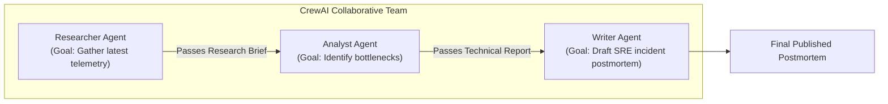

# 📹 Building Agentic AI App with CrewAI

<div className="video-card" style={{border: '1px solid #30363d', borderRadius: '8px', padding: '16px', marginBottom: '24px', background: 'rgba(56, 139, 253, 0.05)'}}>
  <div style={{display: 'flex', gap: '16px', flexWrap: 'wrap'}}>
    <div><strong>Instructor:</strong> Krish Naik</div>
    <div><strong>Duration:</strong> 8188</div>
    <div><strong>Course:</strong> Module 4: Agentic AI & LangGraph</div>
    <div><strong>Watch Link:</strong> <a href="https://www.youtube.com/watch?v=lLCck9FH6z4" target="_blank" rel="noopener noreferrer">YouTube Lecture ↗</a></div>
  </div>
</div>

## 📌 Executive Summary

CrewAI is a high-level multi-agent orchestration framework designed for role-playing, collaborative agent teams. By structuring workflows around Agents (defined by Roles, Goals, and Backstories), Tasks, and Crews, CrewAI enables autonomous teams of AI specialists to collaborate sequentially or hierarchically.

This guide details defining CrewAI agents, assigning specialized tools, designing dependent tasks, and orchestrating multi-agent collaboration.

---

## 🏗️ System Architecture & Execution Flow



---

## 📖 Core Concepts & Technical Deep Dive

### 1. Role-Playing Architecture
CrewAI agents perform significantly better when configured with detailed personas:
- `role`: The agent's function (e.g. "Senior Database Administrator").
- `goal`: Clear objective (e.g. "Optimize PostgreSQL query latency below 50ms").
- `backstory`: Contextual narrative guiding the agent's decision-making style.

### 2. Task Delegation & Process Types
- **Sequential Process:** Tasks execute in linear order, with each agent receiving the context and output of the preceding task.
- **Hierarchical Process:** A manager agent dynamically delegates tasks to specialized worker agents and reviews their outputs.

---

## 💻 Production Implementation

```python
from crewai import Agent, Task, Crew, Process

# 1. Define Specialized Agents
researcher = Agent(
    role="Senior Cloud Security Auditor",
    goal="Identify security misconfigurations in cloud infrastructure",
    backstory="You have 15 years experience auditing AWS IAM roles and VPC networks.",
    verbose=True,
    memory=True
)

writer = Agent(
    role="Technical Documentation Specialist",
    goal="Write actionable SRE remediation playbooks",
    backstory="You turn complex security audits into clear step-by-step developer guides.",
    verbose=True
)

# 2. Define Tasks with Clear Dependencies
audit_task = Task(
    description="Analyze IAM policies with wildcards ('*') in production.",
    expected_output="A bullet list of flagged IAM roles and risk scores.",
    agent=researcher
)

playbook_task = Task(
    description="Draft a remediation playbook explaining how to replace wildcards with least-privilege permissions.",
    expected_output="Markdown playbook with exact JSON policy examples.",
    agent=writer
)

crew = Crew(
    agents=[researcher, writer],
    tasks=[audit_task, playbook_task],
    process=Process.sequential
)

print("CrewAI Collaborative Multi-Agent Team assembled.")
```

---

## ⚙️ Production Gotchas & Best Practices

:::tip Expected Output Clarity
Always provide an explicit `expected_output` string on every Task. Vague task descriptions cause agents to wander and generate bloated responses.
:::

:::warning Delegation Overhead
Disable `allow_delegation=False` on worker agents unless strictly necessary. Unrestricted delegation can lead to circular conversational ping-pong between agents.
:::

---

## 📊 Architectural Reference & Comparison

| Entity | Configuration Attributes | Role in CrewAI |
| :--- | :--- | :--- |
| **Agent** | `role`, `goal`, `backstory`, `tools` | Autonomous worker persona |
| **Task** | `description`, `expected_output`, `agent` | Discrete unit of work |
| **Crew** | `agents`, `tasks`, `process` | Orchestration coordinator |
| **Process** | `sequential` or `hierarchical` | Execution topology |

---

## 📚 Key Takeaways & Enterprise Checklist

- [ ] **Architecture Verification:** Ensure your design addresses latency, decoupled interfaces, and strict data validation contracts.
- [ ] **Deterministic Testing:** Run unit tests and golden dataset evaluations before shipping changes to staging or production.
- [ ] **Security & Observability:** Enforce input/output guardrails, scrub sensitive credentials/PII, and capture distributed traces.
- [ ] **Scalability & Sizing:** Calibrate model parameters, context limits, and compute instance requirements against projected request concurrency.
