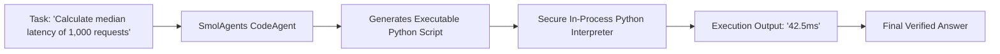

# 📹 Build AI Agents using HuggingFace's SmolAgents

<div className="video-card" style={{border: '1px solid #30363d', borderRadius: '8px', padding: '16px', marginBottom: '24px', background: 'rgba(56, 139, 253, 0.05)'}}>
  <div style={{display: 'flex', gap: '16px', flexWrap: 'wrap'}}>
    <div><strong>Instructor:</strong> Krish Naik</div>
    <div><strong>Duration:</strong> 6565</div>
    <div><strong>Course:</strong> Module 4: Agentic AI & LangGraph</div>
    <div><strong>Watch Link:</strong> <a href="https://www.youtube.com/watch?v=VSm5-CX4QaM" target="_blank" rel="noopener noreferrer">YouTube Lecture ↗</a></div>
  </div>
</div>

## 📌 Executive Summary

Hugging Face's SmolAgents is an ultra-lightweight library for building autonomous AI agents where the model writes and executes real Python code actions rather than emitting rigid JSON tool calls. Executing Python code directly allows agents to manipulate data, loop, and handle multi-variable computations with greater efficiency than JSON function calling.

This guide explores CodeAgent mechanics, sandboxed Python code execution, tool registration, and local open-source model integration.

---

## 🏗️ System Architecture & Execution Flow



---

## 📖 Core Concepts & Technical Deep Dive

### 1. Code Actions vs JSON Tool Calls
Traditional agents generate JSON payloads like `{"tool": "add", "args": {"a": 2, "b": 3}}`. SmolAgents' `CodeAgent` allows the LLM to write native Python scripts:
```python
results = [fetch_data(i) for i in range(5)]
final = sum(results) / len(results)
```
This reduces token usage and avoids multi-turn overhead for simple iterative tasks.

### 2. Sandboxed Safe Execution
SmolAgents restricts the execution environment to safe standard library modules and explicitly provided tool functions, blocking unsafe operations (`os.system`, `subprocess`).

---

## 💻 Production Implementation

```python
# Blueprint for Hugging Face SmolAgents CodeAgent
# from smolagents import CodeAgent, HfApiModel, tool

# @tool
# def fetch_weather(city: str) -> str:
#     """Get weather for a city."""
#     return f"Sunny and 22C in {city}."

# agent = CodeAgent(tools=[fetch_weather], model=HfApiModel())
# agent.run("What is the weather in Berlin?")

print("Hugging Face SmolAgents CodeAgent architecture initialized.")
```

---

## ⚙️ Production Gotchas & Best Practices

:::tip Complex Data Manipulation
Use `CodeAgent` when tasks require complex calculations, regex transformations, or data parsing that would be unwieldy to implement with multiple individual JSON tool calls.
:::

:::warning Sandboxing Security
Never run untrusted code agents with access to production file systems or external networks without strict Docker or WebAssembly container sandboxing.
:::

---

## 📊 Architectural Reference & Comparison

| Dimension | JSON Tool Calling | SmolAgents Code Actions |
| :--- | :--- | :--- |
| **Action Representation** | JSON dictionary | Executable Python script |
| **Data Flow** | Serialized back and forth | Variables kept in interpreter state |
| **Complex Logic** | Multiple slow LLM turns | Single-turn Python loops & conditionals |

---

## 📚 Key Takeaways & Enterprise Checklist

- [ ] **Architecture Verification:** Ensure your design addresses latency, decoupled interfaces, and strict data validation contracts.
- [ ] **Deterministic Testing:** Run unit tests and golden dataset evaluations before shipping changes to staging or production.
- [ ] **Security & Observability:** Enforce input/output guardrails, scrub sensitive credentials/PII, and capture distributed traces.
- [ ] **Scalability & Sizing:** Calibrate model parameters, context limits, and compute instance requirements against projected request concurrency.
