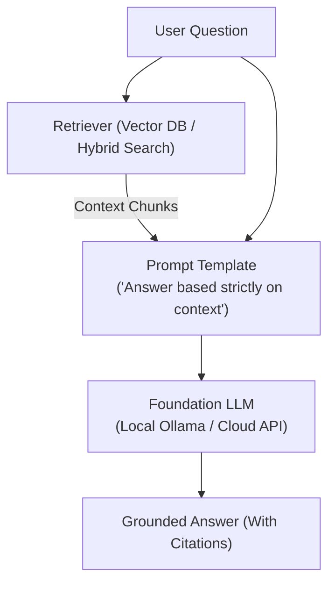

# 📹 End To End RAG Agent With DeepSeek-R1 And Ollama

<div className="video-card" style={{border: '1px solid #30363d', borderRadius: '8px', padding: '16px', marginBottom: '24px', background: 'rgba(56, 139, 253, 0.05)'}}>
  <div style={{display: 'flex', gap: '16px', flexWrap: 'wrap'}}>
    <div><strong>Instructor:</strong> Krish Naik (Krish Naik)</div>
    <div><strong>Duration:</strong> 12m 47s</div>
    <div><strong>Playlist:</strong> Real-World Multi-Agent Frameworks (Krish Naik)</div>
    <div><strong>Watch Link:</strong> <a href="https://www.youtube.com/watch?v=qNUbPw62-rk" target="_blank" rel="noopener noreferrer">YouTube Lecture ↗</a></div>
  </div>
</div>

## 📌 Executive Summary & Learning Objectives

This lecture covers **End To End RAG Agent With DeepSeek-R1 And Ollama**, focusing on production implementations, edge cases, and industry standards:
- Core intuition, architecture, and underlying mechanisms.
- Key differences between theoretical research implementations and scalable enterprise patterns.
- Concrete Python walkthroughs, error recovery, and performance optimization.

---

## 🏗️ Architecture & Conceptual Workflow



---

## 📖 Core Concepts & Technical Deep Dive

### 1. Architectural Foundations
In modern production AI engineering, **End To End RAG Agent With DeepSeek-R1 And Ollama** is essential for ensuring reliability, low latency, and deterministic outcomes. As AI systems evolve from naive prompt-in / completion-out scripts into distributed systems, engineers must handle:
- **State management & consistency:** Ensuring intermediate states and tool invocations are tracked.
- **Error boundaries & recovery:** Graceful degradation when external LLMs or vector stores encounter rate limits or network partitions.
- **Resource utilization & cost efficiency:** Caching common queries and reducing unnecessary foundation model token expenditure.

### 2. Operational Considerations
- **Latency Optimization:** Pre-computing embeddings, utilizing asynchronous non-blocking event loops, and streaming tokens via Server-Sent Events (SSE).
- **Security & Sandboxing:** Validating inputs before ingestion, sanitizing LLM outputs, and isolating tool execution environments.

---

## 💻 Production Implementation Walkthrough

```python
from langchain_core.prompts import ChatPromptTemplate
from langchain_core.runnables import RunnablePassthrough
from langchain_core.output_parsers import StrOutputParser
from langchain_community.chat_models import ChatOllama

# RAG Prompt with strict grounding
rag_template = """Answer the question based strictly on the provided context:
Context:
{context}

Question: {question}
Answer:"""

prompt = ChatPromptTemplate.from_template(rag_template)
llm = ChatOllama(model="llama3", temperature=0.1)

# Format documents helper
def format_docs(docs):
    return "\n\n".join(doc.page_content for doc in docs)

# Complete RAG Chain
rag_chain = (
    {"context": retriever | format_docs, "question": RunnablePassthrough()}
    | prompt
    | llm
    | StrOutputParser()
)
```

---

## 💡 Production Best Practices & Tips

:::tip Production Deployment Guideline
When deploying End To End RAG Agent With DeepSeek-R1 And Ollama in enterprise environments, always configure automated retries with exponential backoff and telemetry tracing (such as OpenTelemetry or LangSmith).
:::

:::warning Common Failure Modes
Watch out for state contamination across concurrent requests. Ensure each session or user interaction uses an isolated thread ID or execution context.
:::

---

## 🎯 Key Takeaways & Quick Reference

| Dimension | Production Standard | Pitfall to Avoid |
| :--- | :--- | :--- |
| **Execution** | Async / Non-blocking with timeouts | Synchronous blocking calls in event loops |
| **Data Validation** | Strict Pydantic v2 schemas | Untyped dictionary access |
| **Monitoring** | Distributed tracing & latency percentiles | Relying only on standard console logs |

## ⏱️ Lecture Timeline & Key Topics

| Timestamp | Key Topic / Concept Discussed |
| :--- | :--- |
| **00:00:00** | हेलो दोस्तों, मेरा नाम कुशक है और... |
| **00:03:24** | uncore olama do llms import olama l m... |
| **00:06:23** | लोडर लिख रहे हैं।  इसके बाद लोड करने के बाद हम... |
| **00:09:33** | लिखेगा। फिर यह दस्तावेज़ का विश्लेषण करेगा। यह... |
| **00:12:45** | दिन अच्छा रहे। अलविदा। अपना ख्याल रखें।... |


---

---

## 📜 Complete Lecture Transcript (Hindi / Hinglish)

> **Language:** Hindi / Hinglish | **Source:** `13 - Streaming in LangGraph ｜ CampusX.hi-orig.srt` | **Total Segments:** 13 | **Word Count:** ~4,307 words

<details>
<summary><b>Click to expand full chronological transcript (13 timestamped intervals)</b></summary>

#### ⏱️ [00:00 ➔ 00:02]

हाय गाइज़, माय नेम इज़ नितेश एंड यू आर वेलकम टू माय YouTube चैनल। इस वीडियो में भी हम लोग अपना एजेंटिक एआई यूज़िंग लंग ग्राफ प्लेलिस्ट कंटिन्यू करेंगे। सो पिछले कुछ वीडियोस में जैसा हमने प्लान किया था हम एक चैटबॉट डेवलप कर रहे हैं। और धीरे-धीरे उस चैटबॉट में हम फीचर्स और ऐड करते जा रहे हैं। सबसे पहले हमने एक बेसिक चैटबॉट बनाया था। जहां पे आप एक एलएलएम से बात कर पा रहे थे। फिर उसी में हमने शॉर्ट टर्म मेमोरी का फीचर ऐड किया। सो दैट हमारा चैटबॉट हमारे पास इंटरेक्शंस याद रख पाए। उसके बाद हमने उस चैटबॉट को एक यूआई दिया। आज हम अपने चैटबॉट की एक और प्रॉब्लम सॉल्व करने जा रहे हैं। सबसे पहले मैं आपको वो प्रॉब्लम दिखाता हूं और फिर मैं आपको बताता हूं कि क्या सॉल्यूशन है उस प्रॉब्लम को सॉल्व करने का। ठीक है? तो स्क्रीन पे अभी आपको हमारे चैटबॉट का यूआई दिख रहा होगा। सो यहां पे एक बार पहले चेक कर लेते हैं। चैटबॉट सही से रिप्लाई कर रहा है कि नहीं। यू कैन सी चैटबॉट रिप्लाई कर रहा है। अब देखो मैं क्या प्र्प रहा हूं। मैं क्या क्वेश्चन पूछ रहा हूं। मैं अ मेरे चैटबॉट को बोल रहा हूं दैट यू हैव टू राइट अ 500 वर्ड लॉन्ग ब्लॉग ऑन लेट्स से क्रिकेट। ठीक है? और मैंने एंटर मारा। अब आप देखो यहां पे क्या हो रहा है कि रिस्पांस नहीं आया अभी तक। अभी भी हमारा जो स्क्रीन है वह ब्लैंक है और फिर सडनली से एक साथ पूरा का पूरा 500 वर्ड्स का ब्लॉग अपीयर कर गया हमारे स्क्रीन पे। नाउ दिस इज अ प्रॉब्लम। प्रॉब्लम यह है कि जब आप अपने चैटबॉट से कुछ लंबा बड़ा आउटपुट डिमांड करते हो जैसा कि हमारे केस में हमने किया। तो हो क्या रहा है कि पहले वो पूरा का पूरा रिस्पांस एलएलएम के पास जनरेट हो रहा है और फिर वो एक साथ हमारे यूआई पे आ जा रहा है। अब इसमें दो प्रॉब्लम्स हैं। पहली प्रॉब्लम यह है कि यूजर को वेट करना पड़ रहा है 5 सेकंड्स 10 सेकंड्स डिपेंडिंग ऑन कितना बड़ा आउटपुट है। एंड सेकंड एक साथ यह पूरा रिस्पांस जब आपके स्क्रीन पे आ रहा है तो

#### ⏱️ [00:02 ➔ 00:04]

इट्स नॉट वेरी रीडेबल। राइट? अगर आपने चैट जीपीटी यूज़ किया होगा तो वहां पर आपने देखा होगा कि वहां पे जब बड़ा आउटपुट होता है तो उसका रिस्पांस इस तरीके से नहीं आता। वहां पे क्या होता है कि कैरेक्टर बाय कैरेक्टर आपका पूरा रिस्पांस टाइप होता हुआ दिखाई देता है। इस फीचर को हम स्ट्रीमिंग बोलते हैं और वही हम लोग इस पर्टिकुलर वीडियो में हमारे चैटबॉट में इंप्लीमेंट करने वाले हैं। सो दैट जब भी हम कोई बड़ा या लॉन्ग आउटपुट एक्सपेक्ट कर रहे हो हमारे चैटबॉट से तो हमें अब्रप्टली एक साथ अचानक से पूरा टेक्स्ट देखने के बजाय टोकन बाय टोकन टाइप राइटर फैशन में सारा आउटपुट दिखाई दे। इट इज अ मच बेटर यूजर एक्सपीरियंस। इनफैक्ट मैंने डेमो प्रिपेयर कर रखा है। मैं आपको साइड बाय साइड दिखाता हूं कि जब आप स्ट्रीमिंग इंप्लीमेंट करते हो किसी चैटबॉट में तो सेम आउटपुट आपको कैसा दिखाई देता है। सो अभी आपको जो मेरे स्क्रीन पे दिखाई दे रहा है वो हमारे ही चैटबॉट का एक डिफरेंट वेरिएंट है जहां पे मैंने ऑलरेडी स्ट्रीमिंग का फीचर ऐड कर दिया है। अब मैं आपको सेम प्र्प्ट लिख के दिखाता हूं। हम लिख रहे हैं राइट अ 500 वर्ड लॉन्ग ब्लॉग ऑन क्रिकेट। एंटर मारा एंड यू कैन सी दिस इज द आउटपुट। टोकन बाय टोकन फैशन में हमारा जो आउटपुट है वह एक टाइप राइटर इफेक्ट के साथ हमारे स्क्रीन पे आउटपुट को प्रिंट करता चला जा रहा है। और आई गेस आप अग्री करोगे दैट दिस इज अ मच बेटर यूजर एक्सपीरियंस फॉर द यूजर। दो फायदे हैं इसके जैसा मैंने अभी थोड़ी देर पहले आपको बताया। पहला यूजर को बहुत वेट नहीं करना पड़ रहा है रिस्पांस को देखने के लिए। सेकंड सिंस आप वर्ड बाय वर्ड चीजों को प्रिंट कर रहे हो तो आपके लिए जो आउटपुट है वो थोड़ा ज्यादा रीडेबल हो जाता है। राइट? जैसा आप ऑलरेडी फील कर पा रहे होंगे। तो हमारे आज के वीडियो का गोल ये है कि हमारा जो एकिस्टिंग चैटबॉट है उसमें हमें यह फीचर ऐड करना है स्ट्रीमिंग का। तो पहले मैं आपको थोड़ा स्ट्रीमिंग के बारे में थ्योरेटिकल फाउंडेशन दूंगा। स्ट्रीमिंग क्या होता है? क्यों रिक्वायर्ड होता है? फिर हम कोड में जाकर

#### ⏱️ [00:04 ➔ 00:06]

के चेंजेस करेंगे कि कैसे स्ट्रीमिंग को इंप्लीमेंट किया जा सकता है लंग ग्राफ में। ठीक है? तो आई होप आपको इस वीडियो का पूरा गोल समझ में आ गया। नाउ लेट्स स्टार्ट द वीडियो। तो गाइज़ एक बार फॉर्मली डिस्कस कर लेते हैं कि स्ट्रीमिंग होता क्या है? और स्ट्रीमिंग की जरूरत क्यों है हमें एलएलएम बेस्ड एप्लीकेशनेशंस बनाने के लिए। सो यहां पे मैंने एक डेफिनेशन लिखा है छोटा सा। एक बार उसको रीड आउट करते हैं। इन एलएलएम्स स्ट्रीमिंग मींस द मॉडल्स स्टार्ट सेंडिंग टोकंस एज सून एज़ दे आर जनरेटेड। इंस्टेड ऑफ वेटिंग फॉर द एंटायर रिस्पांस टू बी रेडी बिफोर रिटर्निंग इट। बेसिकली आपके पास एक एलएलएम है। आपने उसको कोई क्वेश्चन भेजा। जैसे कि व्हाट इज द रेसिपी ऑफ मेकिंग पास्ता? दो तरीके हो सकते हैं रिस्पांस को वापस लाने के। पहला तरीका यह होगा कि एलएलएम आंसर को सोचेगा और पूरा का पूरा आंसर पहले जनरेट करेगा और फिर वह पूरा का पूरा जनरेटेड आंसर एक साथ आपको मिलेगा। द सेकंड वे इज़ कि एलएलएम जैसे-जैसे आंसर जनरेट कर रहा है, टोकन बाय टोकन आपको आंसर मिलता चला जाएगा। दिस इज़ द मेन डिफरेंस। इसी को हम स्ट्रीमिंग बुलाते हैं। ठीक है? एंड आई एम प्रीटी श्योर आपने यह पर्टिकुलर इफेक्ट ऑलरेडी एक्सपीरियंस कर रखा होगा जब आप चैट जीपीटी जैसे किसी भी टूल के साथ इंटरेक्ट करते हो। ठीक है? आपको एक टाइप राइटर इफेक्ट मिलता है कि वर्ड्स ऐसा लग रहा है जैसे आपके सामने टाइप होते चले जा रहे हैं। इसी को स्ट्रीमिंग बोला जाता है। ठीक है? अभी जस्ट मैंने आपको दिखाया। अब एक बार डिस्कस करते हैं कि क्यों ऐसा लगता है सभी को कि स्ट्रीमिंग इज वेरी वेरीेंट फॉर एलएलएम बेस्ड एप्लीकेशनेशंस सच एज चैट बॉट्स। मल्टीपल रीज़ंस हैं। मैं आपको एक-एक करके रीज़ंस बताता हूं। सबसे पहला रीजन ये है कि यू गेट फास्टर रिस्पांस टाइम। राइट? आपने एक क्वेरी लिखा कि राइट एन एस्स ऑन

#### ⏱️ [00:06 ➔ 00:08]

टेररिज्म इन इंडिया। लेट्स से। अब ऑब्वियसली एस्स है या ब्लॉग है तो वो लेंथ में बड़ा होगा। उसमें हो सकता है 500 वर्ड्स हो, 1000 वर्ड्स हो। तो इतनी बड़ी चीज को जनरेट करने में एलएलएम को टाइम भी लगेगा। हो सकता है 510 सेकंड्स लग जाए। अब अगर आप स्ट्रीमिंग यूज नहीं कर रहे हो तो सोच के देखो क्या होगा? आपको 5 टू 10 सेकंड्स स्क्रीन पे कुछ भी नहीं दिख रहा है। अब हम तो फिर भी समझ सकते हैं कि हां एलएलएम इज टेकिंग सम टाइम। बट आप एक ऐसा यूजर को पकड़ो जो बहुत ज्यादा टेक से हैवी नहीं है। और वो मतलब बहुत कंफर्टेबल नहीं है टेक्निकल प्रोडक्ट्स यूज करने में। उसके शूज में जाकर देखो कि उसको कैसा फील होगा। उसको लगेगा कि ऐप फ्रीज कर गया है या मे बी काम नहीं कर रहा है और वह ऐप को बंद करके चला जा सकता है। तो बेसिकली आपके ऐप के ऊपर ड्रॉप ऑफ होगा जो कि अच्छी बात नहीं है। इससे बचाता है हमें स्ट्रीमिंग। तुरंत के तुरंत रिस्पांस आने लगता है तो फिर लगता है कि हां सब कुछ सही से काम कर रहा है। सेकंड इंपॉर्टेंट चीज है कि स्ट्रीमिंग मिमिक्स ह्यूमन लाइक कॉन्वर्सेशन। इट बिल्ड्स ट्रस्ट फील्स अलाइव एंड कीप्स द यूजर एंगेज्ड। अब ऑनेस्टली यह पॉइंट मुझे एक्सप्लेन करने की जरूरत नहीं है। आपने खुद कभी चैट जीपीटी के साथ बात की होगी तो आपने सच में ये फील किया होगा कि चैट जीपीटी से बात करना ऐसा लगता है जैसे हम किसी दूसरे इंसान से बात कर रहे हैं। इट फील्स अलाइव। राइट? और उसका आंसर क्या आएगा? एट एव्री मोमेंट वी आर एंगेज्ड। कि ओके नेक्स्ट क्या है? नेक्स्ट क्या है? राइट? पॉइंट नंबर थ्री स्ट्रीमिंग इज आल्सोेंट फॉर मल्टीमोडल यूआई। अभी तक हम बात कर रहे हैं चैट जीपीटी की जहां पर आप टेक्सचुअल मीडियम में बात कर रहे हो। आप मैसेज टाइप कर रहे हो चार्ट जीपीटी टेक्स्ट में आपको रिप्लाई कर रहा है। बट व्हाट इफ आप लेट्स से एक Alexa टाइप के डिवाइस से बात करो और वहां पे स्ट्रीमिंग इंप्लीमेंटेड नहीं है। सोच के देखो आपका एक्सपीरियंस कैसा रहेगा। आपने उसको कुछ एक

#### ⏱️ [00:08 ➔ 00:10]

मैसेज बोला बोल करके कि गिव मी द रेसिपी टू कुक पास्ता। अब अगर स्ट्रीमिंग इंप्लीमेंटेड नहीं है तो पहले यह डिवाइस क्या करेगा? पूरा का पूरा रिस्पांस जनरेट होने का वेट करेगा और फिर उसके बाद बोलना स्टार्ट करेगा। अगेन एक कॉन्वर्सेशन के बीच में सीमलेसनेस नहीं होगी। मैंने कुछ बोला उसके 10 सेकंड के बाद वो डिवाइस बोलना स्टार्ट कर रहा है। तो अगेन जो आपका यूजर एक्सपीरियंस होगा उस डिवाइस के ऊपर वो बहुत अजीब होगा। आपको मतलब बहुत कंफर्टेबल फील नहीं होगा उससे बात करने में और बेसिकली आपको ऐसा लगेगा जैसे आप किसी दूसरे इंसान से बात कर रहे हो और फोन पे सही से सिग्नल नहीं आ रहा है। राइट? पॉइंट नंबर थ्री स्ट्रीमिंग हैज़ बेटर यूजर एक्सपीरियंस फॉर लॉन्ग आउटपुट सच एज कोड। अब मान लो आपने अ चैट जीपीटी को बोला कि मुझे मुझे एक पर्टिकुलर चीज का कोड जनरेट करके दो। ठीक है? अ एक बेसिक वेबसाइट का कोड जनरेट करके दो। अब अगर स्ट्रीमिंग इंप्लीमेंटेड नहीं है तो ये सारा का सारा कोड वन गो में आपके स्क्रीन पे एक साथ आ जाएगा। राइट? अब इससे क्या होगा? आई एम प्रिटी श्योर आप इससे रिलेट कर पाते होगे कि अचानक से पूरा कोड अगर आपको स्क्रीन पर दिखा दिया जाए तो आपको उतने अच्छे से समझ नहीं आता है। आपको पता नहीं चलता है कि कहां पे क्या किया हुआ है। वर्सेस अगर वर्ड बाय वर्ड कोड प्रिंट हो रहा है आपके स्क्रीन पे तो आप उसको बेटर समझ पाते हो कि अच्छा कोड यहां से स्टार्ट हुआ नेक्स्ट लाइन में यह हो रहा है। उसकी नेक्स्ट लाइन में यह हो रहा है। तो इट इज़ अ मच बेटर यूजर इंटरफ़ेस अह या यूजर एक्सपीरियंस व्हेन यू प्रिंट वर्ड स्टेप बाय स्टेप स्पेशली व्हेन यू हैव रिस्पांसेस फॉर कोड्स एंड ऑल। ठीक है? अह एक और बहुत इंपॉर्टेंट बेनिफिट होता है स्ट्रीमिंग का कि अगर आपको रिस्पांस पसंद नहीं आ रहा चैट GPT का या किसी भी एलएलएम बेस्ड एप्लीकेशन का तो आप मिड वे ब्रेक कर सकते हो उसके

#### ⏱️ [00:10 ➔ 00:12]

रिस्पांस को। को आप स्टॉप कर सकते हो। इससे क्या होगा कि सारे के सारे टोकंस जनरेट नहीं होंगे और आप बीच में ही रिस्पांस को रोक दे रहे हो। तो आप एसेंशियली टोकंस बचा रहे हो और टोकंस बचाने का सिंपल मतलब है आप पैसे बचा रहे हो। बिकॉज़ जितने भी एलएलएम प्रोवाइडर्स हैं वो आपको नंबर ऑफ टोकंस यूसेज के बेसिस पे चार्ज करते हैं। तो यह भी एक बहुत इंपॉर्टेंट चीज है। एंड लास्टली सिर्फ एलएलएम का मैसेज दिखाने के लिए स्ट्रीमिंग यूज़ नहीं होता। आपको कई बार अपडेट्स दिखाने के लिए भी स्ट्रीमिंग यूज किया जाता है। जैसे मान लो आप किसी एi एजेंट से बात कर रहे हो तो एआई एजेंट को आपने बोला कि भाई आप मेरे लिए एक मूवी टिकट बुक कर दो। आप खुद सोचो कैसा लगेगा अगर 1 मिनट तक आपको कुछ भी दिखाई नहीं देगा और सडनली से एजेंट आपको बोलेगा कि आपकी टिकट बुक हो गई है तो वह 1 मिनट जो बीच में होगा ना वहां पे आप बहुत अनसर्टेन होगे और आपको डर लग रहा होगा कि क्या चल रहा है। बट स्ट्रीमिंग की हेल्प से आप क्या कर सकते हो कि एi एजेंट उस पूरे प्रोसेस को कैसे सॉल्व कर रहा है वह स्टेप बाय स्टेप बता सकते हो। जैसे अभी एजेंट ने बुक माय शो ओपन किया। अब उसने कोई पर्टिकुलर मूवी सेलेक्ट की। अब उसने सीट सेलेक्ट की। अब उसने पेमेंट मोड सेलेक्ट किया। अब वो पेमेंट कर रहा है। ये सारे अपडेट्स आप दे सकते हो विद द हेल्प ऑफ स्ट्रीमिंग। आगे हम जब एआई एजेंट्स बनाएंगे तो हम स्ट्रीमिंग की हेल्प से इस तरह के अपडेट्स यूजर को दिखाएंगे। ठीक है? तो ये कुछ बेनिफिट्स हैं स्ट्रीमिंग यूज़ करने के। नटशेल में बहुत छोटी सी चीज है। बट इट्स इनक्रेडिबली यूज़फुल। एक यूजर का जो यूजर एक्सपीरियंस होता है किसी भी एप्लीकेशन के ऊपर उसको 10x बढ़ा सकती है, इंप्रूव कर सकती है स्ट्रीमिंग। ठीक है? दैट इज व्हाई इसको पढ़ना और अपने एप्स में यूज़ करना इज़ अ वेरी वेरीरी स्मार्ट डिसीजन। ठीक है? सो नाउ दैट वी नो व्हाट इज़ स्ट्रीमिंग और स्ट्रीमिंग की जरूरत क्यों है? अब हम अपने एग्जिस्टिंग चैटबॉट

#### ⏱️ [00:12 ➔ 00:14]

वाले कोड में स्ट्रीमिंग का फीचर ऐड करेंगे। अब ऑनेस्टली स्ट्रीमिंग को इंप्लीमेंट करने के लिए आपको अपने एकिस्टिंग कोड में बहुत ज्यादा चीजें चेंज करने की जरूरत नहीं है। मैं यहां पर लैंग्राफ्ट के ऑफिशियल डॉक्यूमेंटेशन पे हूं। जहां पर इन लोगों ने बताया है कि कैसे आप स्ट्रीमिंग इंप्लीमेंट कर सकते हो। और इस गिवन एग्जांपल में आप आसानी से देख सकते हो कि जो इकलौता चेंज आपको करना है वो ये है कि अभी तक आप ग्राफ को बनाने के बाद उसको एग्जीक्यूट करने के लिए ग्राफ डॉट इनवोक फंक्शन को कॉल किया करते थे। अब इंस्टेड ऑफ़ दैट आप क्या करोगे? डॉट स्ट्रीम फंक्शन को कॉल करोगे। यह स्ट्रीम फंक्शन क्या करता है कि आपको पलट करके एक जनरेटर देता है या जनरेटर ऑब्जेक्ट देता है। अब आई रियली होप आपको जनरेटर्स के बारे में पता है। Python में जनरेटर्स क्या होते हैं? अ यहां पे मैंने सिंपल डेफिनेशन ऐड कर रखा है। इन Python अ जनरेटर इज़ अ स्पेशल टाइप ऑफ़ आइटरेटर दैट अलाउज़ यू टू जनरेट वैल्यूज़ ऑन द फ्लाई वन एट अ टाइम यूजिंग द यील्ड कीवर्ड इंस्टेड ऑफ़ रिटर्न। ठीक है? तो सिंस हमें ये जनरेटर मिल रहा है तो हम क्या कर सकते हैं? इस जनरेटर के ऊपर लूप चला करके बहुत आसानी से उसका कंटेंट प्रिंट कर सकते हैं वन टोकन एट अ टाइम। ठीक है? दैट इज द ओनली डिफरेंस। अब ट्रस्ट मी अगर आपको ये कोड अगर उतने अच्छे से समझ में नहीं आ रहा है तो आप एक बार मेरे चैनल पे जाके जनरेटर्स का एक वीडियो है उसको देख लेना। बहुत ही सिंपल कांसेप्ट होता है। आप एक फंक्शन बनाते हो और इंस्टेड ऑफ रिटर्निंग यू यूज द यील्ड कीवर्ड। ठीक है? और फिर आप नेक्स्ट नेक्स्ट फंक्शन को इंटरनली कॉल करके हर अगला एलिमेंट प्रिंट करते चले जाते हो उस जनरेटर का। ठीक है? सो अगेन थोड़ा एडवांस्ड Python कांसेप्ट है। बट अगर आपको नहीं आता है तो आप मेरे चैनल पे जाके चेक कर सकते हो। फिलहाल मैं आपको क्या करता हूं? इस कोड को इंटीग्रेट करके दिखाता हूं हमारे प्रोजेक्ट में। ठीक है? सो पहले हम लोग बैक एंड वाली साइड पे करके

#### ⏱️ [00:14 ➔ 00:16]

देखेंगे और फिर हम उसको स्ट्रीमलेट में इंटीग्रेट करेंगे। ठीक है? सो हम क्या कर रहे हैं? कोड में जा रहे हैं और कोड में ये रहा हमारा बैक एंड जहां पे हमने लैंग ग्राफ में एक ग्राफ बना रखा है। ठीक है? हम इस ग्राफ को चैटबॉट बुला रहे हैं। तो अभी तक हम क्या करते थे? हम ये कोड लिखते थे। चैटबॉट डॉट इनवोक और यहां पर हम अपना इनिशियल स्टेट पास करते थे। राइट? जैसा यहां पर आपको दिखाई दे रहा होगा। ये देखो। अब हम क्या करेंगे? इंस्टेड ऑफ यूजिंग इनवोक हम कॉल करेंगे स्ट्रीम को। सो इंस्टेड ऑफ इनवोक वी विल कॉल स्ट्रीम। यहां पे आपको तीन चीजें बतानी पड़ेंगी। पहला आपको अपना इनिशियल स्टेट बताना पड़ेगा। उसके लिए हम क्या करेंगे? यह कोड एज इट इज कॉपी कर लेंगे। ठीक है? और यहां पर हम क्या करेंगे? ऊपर में ह्यूमन मैसेज को इंपोर्ट कर लेंगे। और यहां कंटेंट में हम एक मैसेज में लिखेंगे व्हाट इज द रेसिपी टू मेक पास्ता। ठीक है? सेकंड चीज जो आपको बतानी पड़ेगी वो है आपका कॉन्फिग। सो कॉन्फिग में हम डायरेक्टली इस चीज को कॉपी कर लेते हैं। बेसिकली हमें एक थ्रेड आईडी प्रोवाइड करनी है। सो हम यहां आए और हमने लिख लिया कॉन्फ़िग इज़ इक्वल टू दिस। अब यहां पे आपको एक और चीज प्रोवाइड करनी होती है और वो है स्ट्रीम मोड। तो लंग ग्राफ में जब आप स्ट्रीमिंग करते हो तो आपको मल्टीपल मोड्स का ऑप्शन दिया गया है। एक मोड होता है अपडेट्स, एक होता है वैल्यूज़, एक होता है कस्टम और एक होता है मैसेजेस। ठीक है? तो फिलहाल आपको बस मैसेजेस से मतलब है। बिकॉज़ जब भी आप एलएलएम का रिस्पांस टोकन बाय टोकन स्ट्रीम करके दिखाना चाहते हो, आपको मैसेजेस की जरूरत पड़ती है। ठीक है? बाकी के जो मोड्स हैं आगे देखोगे जब हम एजेंटिक एप्लीकेशनेशंस बनाएंगे जहां पे हम टूल्स वगैरह यूज करेंगे वहां पे हम अ बाकी के जो

#### ⏱️ [00:16 ➔ 00:18]

मोड्स हैं उनको यूज़ करेंगे तो हम यहां पे लिख रहे हैं स्ट्रीम मोड इज इक्वल टू मैसेजेस ठीक है तो ये हो गया मेरा कोड अब ये कोड मुझे पलट करके एक ऑब्जेक्ट देगा जो कि एक जनरेटर है। पहले मैं आपको दिखाता हूं कि सच में ऐसा हो रहा है। सो मैं प्रिंट कर रहा हूं टाइप ऑफ स्ट्रीम सेव किया और हमने इस कोड को रन किया। एंड यू कैन सी द क्लास इज़ जनरेटर। मतलब हमें ये जनरेटर मिल रहा है। ठीक है? अब हमें क्या करना है? इस जनरेटर की हेल्प से टोकन बाय टोकन आउटपुट को प्रिंट करना है। तो अगेन हम हेल्प लेंगे इस कोड की। हम सिंपली क्या करेंगे? लूप कर जाएंगे इस जनरेटर के ऊपर। और कभी भी आप जनरेटर का आउटपुट प्रिंट करना चाहते हो तो आप उसके ऊपर लूप करते हो। बिकॉज़ आफ्टर ऑल इट्स एन आइटरेटर। ठीक है? अब यहां पर एक चीज आपको इस डॉक्यूमेंटेशन में जाके समझ में आएगा कि जभी भी आपको स्ट्रीम ऑब्जेक्ट मिलता है ये वाला। इसमें दो कंपोनेंट्स होते हैं। एक होता है मैसेज चंक जहां पे आपका मैसेज छुपा होता है। और सेकंड उसके साथ कुछ मेटा डेटा होता है। ठीक है? दैट इज़ व्हाई यहां पे कोड में इस तरीके से लिखा हुआ है। फॉर मैसेज चंक कॉमा मेटाडेटा इन। सो व्हाट वी विल डू इज हम इंस्टेड ऑफ सेविंग दिस ऑब्जेक्ट हम ऑन द गो यह कोड लिखेंगे फॉर मैसेज चंक कॉमा मेटा डेटा इन चैटबॉट डॉट स्ट्रीम अब इस लूप के अंदर हम जाएंगे और हम सिंपली चेक करेंगे कि क्या मैसेज चंक के अंदर कॉनेंट है कि नहीं अगर है तो हम क्या करेंगे उस कॉनेंट को प्रिंट कर देंगे ठीक है लाइक दिस और हम एंड में उस बार के बदले स्पेस को यूज़ करेंगे और नीचे वाले प्रिंट स्टेटमेंट को मैं हटा रहा हूं। सेव किया। दिस इज माय कोड। मैंने रन किया। एंड यू कैन सी हमारा जो आउटपुट है वो स्ट्रीम होने लग गया। तो आई होप आपको समझ में आया। द ओनली डिफरेंस वाज़ कि इंस्टेड ऑफ यूजिंग डॉट इनवोक वी आर यूजिंग डॉट स्ट्रीम। और

#### ⏱️ [00:18 ➔ 00:20]

फिर उस जनरेटर ऑब्जेक्ट के ऊपर हम लूप चला रहे हैं और उसके कंटेंट को प्रिंट कर रहे हैं वि द हेल्प ऑफ प्रिंट स्टेटमेंट। दैट्स द ओनली चेंज दैट वी डिड। अब हमें क्या करना है? यही पार्ट यह पूरी चीज हमें स्ट्रीमलेट में इंप्लीमेंट करनी है। यहां पर हमें कोई चेंजेस नहीं करने। यह हमारा बैक एंड है। तो, हम क्या करेंगे? यह जो पूरा पार्ट हमने अभी लिखा, इसको हटा देंगे और कोड जो है, उसको बिल्कुल उसी स्टेट में ले आएंगे जैसा ये पहले था। सो, बेसिकली इस कोड में बैक एंड वाले कोड में हमें कोई चेंजेस नहीं करने। हम इसको सेव कर रहे हैं। ठीक है? अब मूव करते हैं स्ट्रीमलेट वाली साइड। फ्रंट एंड वाली साइड वहां पे हमें मेन चेंजेस करने हैं। सो फ्रंट एंड वाले कोड के लिए मैंने एक नई फाइल बना ली है स्ट्रीम अंडरस्कोर फ्रंट एंड अंडरस्कोर स्ट्रीमिंग बोल के। एंड व्हाट आई विल डू इज़ कि हमारा जो पुराना फ्रंट एंड का कोड है, मैं इस पूरे को यहां पे पेस्ट कर दूंगा एज़ इट इज़। और यहां पे हम क्या करेंगे कि स्ट्रीमिंग इंप्लीमेंट करेंगे। ठीक है? सो आई रियली होप आपने लास्ट वीडियो देखा है और आपको ये पूरा फ्लो अच्छे से याद है। ठीक है? तो बेसिकली हमें क्या करना है? इतने पार्ट में चेंजेस करने हैं। दिस मच। इतने में हमें चेंजेस करने हैं। ठीक है? चेंजेस क्या करने हैं? मैं आपको बताता हूं। आपको बेसिकली ये जो कोड है जहां पे आप ग्राफ डॉट स्ट्रीम कर रहे हो उसको लेके आना है इंस्टेड ऑफ़ इनवोक। ठीक है? और ये पूरी स्ट्रीमिंग को करने के लिए हमें एक यूआई एलिमेंट लगेगा। अगर आप स्ट्रीमलेट के डॉक्स पर जाओगे तो वहां पर आपको सारे के सारे चैट एलिमेंट्स दिखाई देंगे जो भी आपके पास अवेलेबल है स्ट्रीमलेट में। इनमें से दो हमने ऑलरेडी यूज़ कर रखे हैं। चैट इनपुट चैट मैसेज ठीक है? इसके अलावा दो और हैं। एक है स्टेट स्टेटस कंटेनर जहां पे आप अगर एजेंट टाइप का एप्लीकेशन बना रहे हैं तो उसके अपडेट्स दिखा सकते हो। जैसे कि गेटिंग डेटा, सर्चिंग, फाउंड यूआरएल इस तरह का यूआई बनाने के लिए। और एक और है राइट स्ट्रीम बोल के। यहां पर देखो लिखा हुआ है राइट

#### ⏱️ [00:20 ➔ 00:22]

जनरेटर्स और स्ट्रीम्स टू द ऐप विद अ टाइप राइटर इफेक्ट। बेसिकली इस चीज को हमें यूज़ करना है। एसटी डॉट राइट स्ट्रीम बोल के एक फंक्शन है। उसमें आपको बस सिंपली अपना जनरेटर दे देना है। और ये राइट स्ट्रीम सारा का सारा यूआई पार्ट हैंडल कर लेगा। ठीक है? तो हम क्या करेंगे? हम बेसिकली इस कोड को छोड़ के जहां पर हम सेशन में एआई असिस्टेंट का मैसेज ऐड कर रहे हैं। बाकी का सारा कोड हटा देंगे। ये वाला। ठीक है? ये सारा कोड हम हटा देंगे। जहां पे हम एआई असिस्टेंट से रिस्पांस लेके आ रहे हैं। और हम सिंपली क्या करेंगे? यह कोड लिखेंगे विद एसटी डॉट चैट मैसेज। और उसके अंदर असिस्टेंट के रोल में व्हाट वी विल डू इज़ कि हम कॉल करेंगे एसटी डॉट राइट स्ट्रीम को। अब राइट स्ट्रीम को अपना काम करने के लिए एक जनरेटर चाहिए। और जनरेटर हमें मिलेगा कहां से? जब हम चैटबॉट डॉट स्ट्रीम फंक्शन को कॉल करेंगे। ठीक है? और स्ट्रीम फंक्शन को कॉल करने के लिए हमें तीन चीजों की जरूरत है। अ यहां पे एक्चुअली पीछे जाते हैं और एक बार कंट्रोल z करते हैं और ये पूरी चीज को हम लोग कॉपी कर लेते हैं। ये तीन चीजें हमें चाहिए। इनको मैं एक लाइन में ले आता हूं। ठीक है? अब जैसा मैंने आपको बताया था कि ये स्ट्रीम ऑब्जेक्ट हमें दो चीजें देता है। एक मैसेज चंक और दूसरा मेटा डेटा। तो हम क्या करेंगे? हम यहां पर सिंपल सा कोड लिखेंगे कि हमें मैसेज चंक डॉट कंटेंट चाहिए फॉर एव्री मैसेज चंक कॉमा मेटा डेटा इन दिस स्ट्रीम। ठीक है? एंड दैट्स इट गाइज़। ये रहा हमारा कोड। हम सिंपली क्या कर रहे हैं? एसटी डॉट राइट स्ट्रीम के अंदर चैटबॉट डॉट स्ट्रीम को कॉल कर रहे हैं। चैटबॉट डॉट स्ट्रीम से हमें दो चीजें मिल रही हैं। वन इज मैसेज चंक। सेकंड इज़

#### ⏱️ [00:22 ➔ 00:24]

मेटाडेटा। हम सिंपली मैसेज चंक का कंटेंट भेज दे रहे हैं राइट स्ट्रीम फंक्शन के पास और वो टाइप राइटर इफ़ेक्ट से उसको प्रिंट कर दे रहा है। ठीक है? दैट्स इट। और एक काम हम और करेंगे कि जब ये पूरा का पूरा रिस्पांस प्रिंट हो जाएगा विद द हेल्प ऑफ अ एसटी डॉट राइट स्ट्रीम हम उस पूरे रिस्पांस को स्टोर कर लेंगे इन अ वेरिएबल कॉल्ड एi मैसेज। ठीक है? और फिर हम क्या करेंगे? उसको सेशन में स्टोर कर लेंगे। तो ये सेशन में स्टोर करने वाला कोड मैं कट करूंगा और यहां पे ले आऊंगा। एंड दैट्स इट गाइस। दिस इज़ द कोड। अब मैं एक बार वापस जाता हूं और यहां पे ये जो चेंजेस मैंने किए ये हटा देता हूं बैक एंड से। ठीक है? एंड ये रहा गाइस हमारा कोड। हमने सिंपली क्या किया? हमने एसटी डॉट चैट मैसेज के अंदर एसटी डॉट राइट स्ट्रीम को कॉल किया और अंदर हमारा जनरेटर ऑब्जेक्ट भेज दिया और राइट स्ट्रीम ने स्ट्रीमिंग परफॉर्म की और फाइनल रिस्पांस को एआई मैसेज में डाल दिया। उसको हमने उठा के सेशन स्टेट में डाल दिया। ठीक है? तो अब एक काम करते हैं। इस कोड को रन करते हैं। चलो यहां पे हम लिखेंगे व्हाट इज द रेसिपी टू मेक पास्ता। एंड यू कैन सी हमें हमारा रिस्पांस दिख रहा है। राइट अ 500 ब्लॉग ऑन द टॉपिक ऑफ क्रिकेट इन इंडिया। ओके, दिस इज़ वियर्ड। क्रिकेट इन इंडिया के बारे में ऐसा क्यों आ रहा है? एक बार फिर से ट्राई करते हैं। राइट अ 500 वर्ड ब्लॉग ऑन अ टेररिज्म। सो देयर इज सम इशू। एक बार इसको डीबग करते हैं। ओो क्या स्टूपिड एरर है। और आई एम प्रीटी श्योर आप लोग देख रहे होंगे और फ्रस्ट्रेट हो रहे होंगे कि मैं क्या गलती कर रहा हूं। सो बेसिकली यहां पे मैंने हार्ड कोड कर दिया है। व्हाट इज द

#### ⏱️ [00:24 ➔ 00:24]

रेसिपी टू मेक पास्ता? ऑब्वियसली इंस्टेड हमें यूजर इनपुट देना है। राइट? तो हम यहां पे यूजर इनपुट डाल देंगे। सेव करेंगे और रीलोड करेंगे। राइट अ 500 वर्ड ब्लॉग ऑन क्रिकेट इन इंडिया। ठीक है? सही है। एक और चेक कर लेते हैं। व्हाट इज द रेसिपी टू मेक पास्ता या पिज़्ज़ा। ठीक है? सो नाउ दिस वन इज़ वर्किंग। ठीक है? तो, हमने हमारे चार्ट बॉट में एक छोटा सा बट बहुत इंपॉर्टेंट फीचर ऐड किया स्ट्रीमिंग का। इस प्रोसेस में हमने यह भी सीखा कि स्ट्रीमिंग होता क्या है? टेक्निकली स्ट्रीमिंग काम कैसे करता है? और स्ट्रीमिंग क्यों जरूरी है? ठीक है? तो, आई होप आपको यह वीडियो पसंद आया। और अगर वीडियो पसंद आया तो आप प्लीज लाइक करना। अगर आपने चैनल को सब्सक्राइब नहीं किया है तो प्लीज सब्सक्राइब। मिलते हैं नेक्स्ट वीडियो में।

</details>
