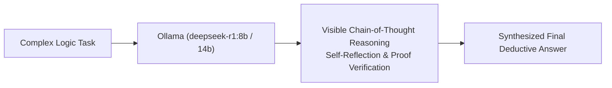

# 📹 End To End RAG Agent With DeepSeek-R1 And Ollama

<div className="video-card" style={{border: '1px solid #30363d', borderRadius: '8px', padding: '16px', marginBottom: '24px', background: 'rgba(56, 139, 253, 0.05)'}}>
  <div style={{display: 'flex', gap: '16px', flexWrap: 'wrap'}}>
    <div><strong>Instructor:</strong> Krish Naik</div>
    <div><strong>Duration:</strong> 767</div>
    <div><strong>Course:</strong> Module 4: Agentic AI & LangGraph</div>
    <div><strong>Watch Link:</strong> <a href="https://www.youtube.com/watch?v=qNUbPw62-rk" target="_blank" rel="noopener noreferrer">YouTube Lecture ↗</a></div>
  </div>
</div>

## 📌 Executive Summary

DeepSeek-R1 introduces open-weights reinforcement-learning-driven reasoning models. Exhibiting visible Chain-of-Thought reasoning (`<think>...</think>`), DeepSeek-R1 matches proprietary reasoning benchmarks on complex mathematical, logic, and multi-step agent tasks.

This lesson explores running DeepSeek-R1 locally with Ollama, parsing reasoning chains, and integrating DeepSeek-R1 as an analytical reasoning engine in LangGraph agents.

---

## 🏗️ System Architecture & Execution Flow



---

## 📖 Core Concepts & Technical Deep Dive

### 1. Pure Reinforcement Learning Reasoning
Unlike models trained predominantly on human demonstrations (SFT), DeepSeek-R1 utilizes large-scale reinforcement learning to discover complex reasoning strategies, self-correction patterns, and verification mechanisms autonomously.

### 2. Parsing the `<think>` Scratchpad
DeepSeek-R1 models emit their internal reasoning enclosed in `<think>...</think>` tags before delivering their final answer. For user-facing applications, stripping the thinking block or presenting it in an expandable accordion improves UI readability.

---

## 💻 Production Implementation

```python
from langchain_community.chat_models import ChatOllama
import re

llm = ChatOllama(model="deepseek-r1:8b", temperature=0.6)

def extract_thinking_and_answer(raw_text: str):
    think_match = re.search(r'<think>(.*?)</think>', raw_text, re.DOTALL)
    thinking = think_match.group(1).strip() if think_match else ""
    final_answer = re.sub(r'<think>.*?</think>', '', raw_text, flags=re.DOTALL).strip()
    return thinking, final_answer

response = llm.invoke("Prove why every prime number greater than 3 can be written as 6k +/- 1.")
thinking, answer = extract_thinking_and_answer(response.content)

print(f"Internal Reasoning ({len(thinking)} chars):\n{thinking[:150]}...\n")
print(f"Final Solution:\n{answer}")
```

---

## ⚙️ Production Gotchas & Best Practices

:::tip Temperature for Reasoning Models
DeepSeek-R1 documentation recommends keeping temperature between 0.5 and 0.7 to avoid repetitive token loops during internal reasoning.
:::

:::warning Context Size with Long Thoughts
DeepSeek-R1 can spend 2,000+ tokens purely inside the `<think>` block before beginning its answer. Allocate at least an 8,192 token context window.
:::

---

## 📊 Architectural Reference & Comparison

| Metric | Standard Llama 3 | DeepSeek-R1 |
| :--- | :--- | :--- |
| **Reasoning Approach** | Direct Next-Token Generation | Extended Chain-of-Thought (`<think>`) |
| **Math / Code Accuracy**| Good | State-of-the-Art (Matches o1) |
| **Inference Latency** | Low | Moderate to High (due to thinking tokens) |

---

## 📚 Key Takeaways & Enterprise Checklist

- [ ] **Architecture Verification:** Ensure your design addresses latency, decoupled interfaces, and strict data validation contracts.
- [ ] **Deterministic Testing:** Run unit tests and golden dataset evaluations before shipping changes to staging or production.
- [ ] **Security & Observability:** Enforce input/output guardrails, scrub sensitive credentials/PII, and capture distributed traces.
- [ ] **Scalability & Sizing:** Calibrate model parameters, context limits, and compute instance requirements against projected request concurrency.
