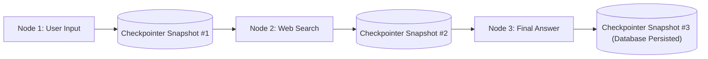

# State Persistence & Database Checkpointing (MemorySaver & SQLite)

<div className="video-card" style={{border: '1px solid #30363d', borderRadius: '8px', padding: '16px', marginBottom: '24px', background: 'rgba(56, 139, 253, 0.05)'}}>
  <div style={{display: 'flex', gap: '16px', flexWrap: 'wrap', alignItems: 'center'}}>
    <div><strong>Curators:</strong> Unified Masterclass (CampusX & Krish Naik)</div>
    <div><strong>Module:</strong> Module 4: Agentic AI & LangGraph</div>
    <div><strong>Focus:</strong> Beginner to Production</div>
  </div>
</div>

## 🎯 What You'll Learn
- Understand how checkpointers save a snapshot of the entire graph state after every node execution.
- Differentiate in-memory checkpointing (`MemorySaver`) from disk persistence (`SqliteSaver`).
- Inspect and modify historical states using `app.get_state(config)`.

---

## 💡 Concept & Architecture

In production, AI agent interactions don't happen in a single execution. A user might message a customer service bot today, log out, and return tomorrow to continue the discussion.

If your server restarts or crashes, where does the conversation state go?

**LangGraph Checkpointers** solve this:
- After **every single node execution**, LangGraph writes an atomic snapshot of the entire state to a persistent database (SQLite or PostgreSQL).
- Each snapshot is keyed by a `thread_id` and a unique checkpoint timestamp.
- If the server crashes, the agent immediately resumes from the exact node where it left off!

### System Architecture & Data Flow



---

## 💻 Step-by-Step Code Walkthrough

Below is the complete implementation broken down into digestible parts so you can understand every line.

### Part 1: Step 1: Setting up an SQLite Database Checkpointer

```python
import sqlite3
from typing import TypedDict
from langgraph.graph import StateGraph, START, END
from langgraph.checkpoint.sqlite import SqliteSaver

class CounterState(TypedDict):
    current_count: int

def increment_node(state: CounterState):
    new_val = state.get("current_count", 0) + 1
    print(f"[NODE]: Incremented count to {new_val}")
    return {"current_count": new_val}

# Initialize the graph
builder = StateGraph(CounterState)
builder.add_node("increment", increment_node)
builder.add_edge(START, "increment")
builder.add_edge("increment", END)

# In production, connect to a persistent SQLite database file:
# conn = sqlite3.connect("agent_checkpoints.db", check_same_thread=False)
# checkpointer = SqliteSaver(conn)

# For testing in memory:
conn = sqlite3.connect(":memory:", check_same_thread=False)
checkpointer = SqliteSaver(conn)

app = builder.compile(checkpointer=checkpointer)
```

#### 🔍 In-Depth Explanation:
`SqliteSaver` binds to an SQLite connection. After every node runs, the state is serialized into an SQLite table.

### Part 2: Step 2: Multi-Turn Execution with Thread Isolation

```python
# Configure session for User A (thread-101)
config_a = {"configurable": {"thread_id": "thread-101"}}

# Run 1: First increment
app.invoke({"current_count": 0}, config=config_a)

# Run 2: Second increment on same thread
app.invoke({}, config=config_a)

# Inspect current snapshot
state_snapshot = app.get_state(config_a)
print("Persisted State for Thread 101:", state_snapshot.values) # {'current_count': 2}
```

#### 🔍 In-Depth Explanation:
Because `thread_id` matches, LangGraph automatically loads the previous count (`1`), increments it, and updates the database.

---

## ⚠️ Beginner Tips & Best Practices

:::tip Use PostgresSaver in Kubernetes
SQLite is ideal for single-server or local edge setups. For multi-replica Kubernetes clusters, use `langgraph-checkpoint-postgres` so all pods share the central state.
:::

:::warning Don't Store Giant Binary Files in State
Never put raw 10MB PDF bytes or base64 images directly in the State schema. Store files in S3 and put only the URL or document ID in the LangGraph state.
:::

---

## 📝 Key Takeaways & Summary

- Checkpointers snapshot the complete state after every node execution.
- `thread_id` isolates concurrent conversations across different users.
- State persistence enables crash resilience and multi-day agent workflows.

