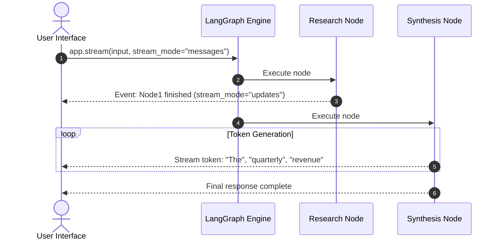

# Real-Time Streaming in LangGraph: Tokens & State Updates

<div className="video-card" style={{border: '1px solid #30363d', borderRadius: '8px', padding: '16px', marginBottom: '24px', background: 'rgba(56, 139, 253, 0.05)'}}>
  <div style={{display: 'flex', gap: '16px', flexWrap: 'wrap', alignItems: 'center'}}>
    <div><strong>Curators:</strong> Nitish Singh (CampusX)</div>
    <div><strong>Module:</strong> Module 4: Agentic AI & LangGraph</div>
    <div><strong>Focus:</strong> Beginner to Production</div>
  </div>
</div>

## 🎯 What You'll Learn
- Differentiate between streaming final LLM tokens and streaming intermediate graph node transitions.
- Master LangGraph's streaming modes: `values`, `updates`, and `messages`.
- Build an interactive terminal UI that renders agent thoughts in real time.

---

## 💡 Concept & Architecture

When an agent takes 15 seconds to run multiple research nodes, keeping the user in the dark is bad UX.

LangGraph provides three distinct streaming modes:
1. **`stream_mode="updates"`**: Yields only the specific state keys modified by each node as soon as that node finishes.
2. **`stream_mode="values"`**: Yields the entire updated state snapshot after each step.
3. **`stream_mode="messages"`**: Streams token-by-token text directly from inside LLM nodes as they are generated!

### System Architecture & Data Flow



---

## 💻 Step-by-Step Code Walkthrough

Below is the complete implementation broken down into digestible parts so you can understand every line.

### Part 1: Step 1: Streaming Node Updates with stream_mode='updates'

```python
from typing import TypedDict
from langgraph.graph import StateGraph, START, END

class ResearchState(TypedDict):
    query: str
    status: str
    result: str

def fetch_data(state: ResearchState):
    return {"status": "data_fetched", "result": "Found 12 relevant papers."}

def analyze_data(state: ResearchState):
    return {"status": "analysis_complete", "result": "Analyzed key findings."}

workflow = StateGraph(ResearchState)
workflow.add_node("fetch", fetch_data)
workflow.add_node("analyze", analyze_data)
workflow.add_edge(START, "fetch")
workflow.add_edge("fetch", "analyze")
workflow.add_edge("analyze", END)

app = workflow.compile()

# Stream node completion updates
print("Streaming intermediate node updates:")
for update in app.stream({"query": "Quantum AI"}, stream_mode="updates"):
    # update is a dictionary: {node_name: {updated_keys}}
    for node_name, state_patch in update.items():
        print(f"--> Completed [{node_name}]: New Status = '{state_patch['status']}'")
```

#### 🔍 In-Depth Explanation:
`stream_mode='updates'` fires immediately when each node finishes, allowing you to update UI status bars (e.g. 'Fetching data... Completed!', 'Analyzing data... Completed!').

---

## ⚠️ Beginner Tips & Best Practices

:::tip Use stream_mode=['updates', 'messages'] Together
In modern LangGraph, you can pass a list of modes: `stream_mode=['updates', 'messages']`. This gives you both high-level node status changes and token-by-token text streaming.
:::

:::warning Async Streaming in Production
Always use `app.astream()` when streaming inside web servers like FastAPI to prevent thread starvation under concurrent traffic.
:::

---

## 📝 Key Takeaways & Summary

- LangGraph supports streaming intermediate node status updates and token-level LLM output.
- `stream_mode='updates'` provides milestone notifications for multi-step agent tasks.
- `stream_mode='messages'` provides real-time streaming text directly to end users.

