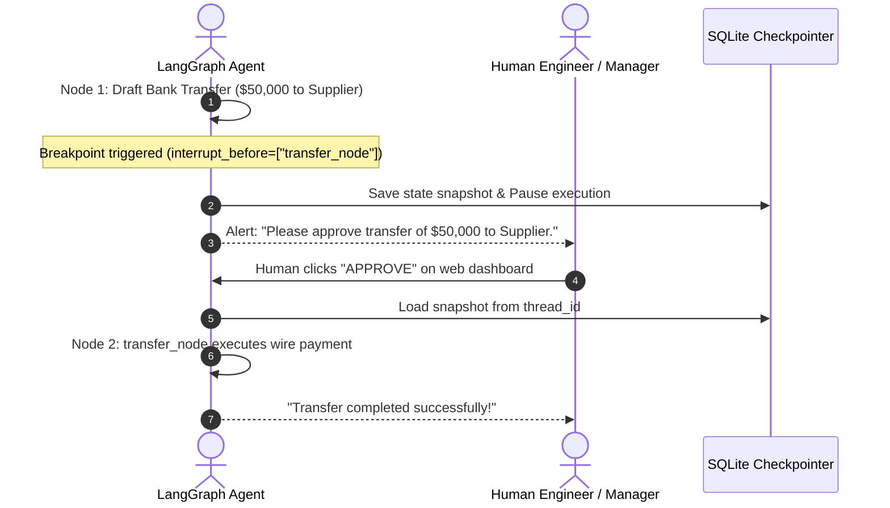

# Human-in-the-Loop (HITL): Breakpoints & Approval Gates

<div className="video-card" style={{border: '1px solid #30363d', borderRadius: '8px', padding: '16px', marginBottom: '24px', background: 'rgba(56, 139, 253, 0.05)'}}>
  <div style={{display: 'flex', gap: '16px', flexWrap: 'wrap', alignItems: 'center'}}>
    <div><strong>Curators:</strong> Nitish Singh (CampusX)</div>
    <div><strong>Module:</strong> Module 4: Agentic AI & LangGraph</div>
    <div><strong>Focus:</strong> Beginner to Production</div>
  </div>
</div>

## 🎯 What You'll Learn
- Understand why critical actions (financial transfers, database deletes, emails) require human approval.
- Use `interrupt_before` and `interrupt_after` to pause graph execution automatically.
- Resume or modify graph state after receiving human approval.

---

## 💡 Concept & Architecture

Never let an autonomous AI agent execute irreversible actions without human supervision!
- ❌ **Unsafe:** Agent generates a database migration script and automatically executes `DROP TABLE users;`.
- ✅ **Safe (Human-in-the-Loop):** Agent drafts the SQL script, pauses execution, displays the script to a senior engineer on a dashboard, and waits for explicit approval before running it.

LangGraph provides native **Breakpoints** (`interrupt_before` / `interrupt_after`):
- When execution reaches a designated node, LangGraph halts execution and commits the current state to the database checkpointer.
- A human reviews the state, modifies it if needed, and issues a resume command.

### System Architecture & Data Flow



---

## 💻 Step-by-Step Code Walkthrough

Below is the complete implementation broken down into digestible parts so you can understand every line.

### Part 1: Step 1: Configuring Breakpoints with interrupt_before

```python
from typing import TypedDict
from langgraph.graph import StateGraph, START, END
from langgraph.checkpoint.memory import MemorySaver

class PaymentState(TypedDict):
    amount: float
    recipient: str
    is_executed: bool

def prepare_payment(state: PaymentState):
    print(f"[PREPARE]: Drafted wire transfer of ${state['amount']} to {state['recipient']}.")
    return {}

def execute_payment(state: PaymentState):
    print(f"[CRITICAL ACTION]: Wire transfer of ${state['amount']} successfully transferred!")
    return {"is_executed": True}

builder = StateGraph(PaymentState)
builder.add_node("prepare", prepare_payment)
builder.add_node("execute", execute_payment)

builder.add_edge(START, "prepare")
builder.add_edge("prepare", "execute")
builder.add_edge("execute", END)

# Attach checkpointer and set breakpoint BEFORE execute node runs
checkpointer = MemorySaver()
app = builder.compile(
    checkpointer=checkpointer,
    interrupt_before=["execute"] # Pauses execution before this node!
)
```

#### 🔍 In-Depth Explanation:
`interrupt_before=['execute']` tells LangGraph to stop right before entering `execute`. The graph will save its state and exit cleanly.

### Part 2: Step 2: Executing, Pausing, and Resuming the Graph

```python
config = {"configurable": {"thread_id": "payment-tx-999"}}

# Phase 1: Start execution - will stop automatically at breakpoint
print("--- PHASE 1: STARTING TRANSACTION ---")
app.invoke({"amount": 50000.0, "recipient": "Acme Corp", "is_executed": False}, config=config)

# Check state to verify it paused
state = app.get_state(config)
print("Next node scheduled to run:", state.next) # ('execute',)
print("Is payment executed yet?:", state.values["is_executed"]) # False

# Phase 2: Human approves the action - resume execution by passing None
print("\n--- PHASE 2: HUMAN APPROVAL RECEIVED ---")
app.invoke(None, config=config)

# Verify execution completed
final_state = app.get_state(config)
print("Final Execution Status:", final_state.values["is_executed"]) # True
```

#### 🔍 In-Depth Explanation:
Calling `app.invoke(None, config=config)` signals to LangGraph: 'Resume execution from where you paused on this thread.' The `execute` node runs and the transaction finishes.

---

## ⚠️ Beginner Tips & Best Practices

:::tip You Can Edit State Before Resuming
Before calling `app.invoke(None)`, a human can edit the state using `app.update_state(config, {'amount': 25000})`. This allows correcting mistakes before actions execute.
:::

:::warning Checkpointers are Required for Breakpoints
You cannot use `interrupt_before` without compiling the graph with a `checkpointer`. Breakpoints rely on persisted state snapshots to resume.
:::

---

## 📝 Key Takeaways & Summary

- Human-in-the-Loop guarantees that high-stakes actions are verified by human judgment.
- `interrupt_before` pauses execution and saves an atomic snapshot to the checkpointer.
- Calling `invoke(None)` on the same thread resumes the paused workflow.

