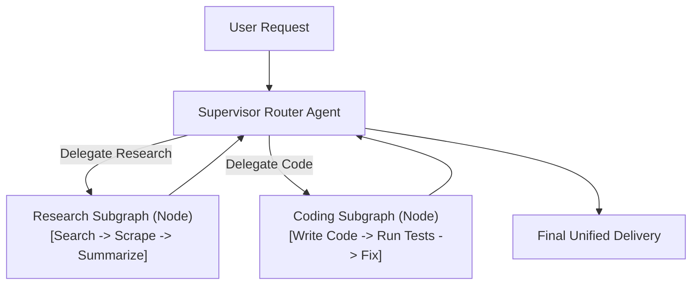

# Hierarchical Multi-Agent Systems & Subgraphs

<div className="video-card" style={{border: '1px solid #30363d', borderRadius: '8px', padding: '16px', marginBottom: '24px', background: 'rgba(56, 139, 253, 0.05)'}}>
  <div style={{display: 'flex', gap: '16px', flexWrap: 'wrap', alignItems: 'center'}}>
    <div><strong>Curators:</strong> Unified Masterclass (CampusX & Krish Naik)</div>
    <div><strong>Module:</strong> Module 4: Agentic AI & LangGraph</div>
    <div><strong>Focus:</strong> Beginner to Production</div>
  </div>
</div>

## 🎯 What You'll Learn
- Understand why monolithic single-agent prompts fail on complex enterprise tasks.
- Build independent, reusable Subgraphs with their own local states.
- Implement the Supervisor Agent pattern to delegate tasks to specialist teams.

---

## 💡 Concept & Architecture

When you give one single prompt to an LLM with 30 different tools (SQL query, email, web search, code execution, PDF parsing), the model gets confused, selects the wrong tools, and burns tokens.

The enterprise solution is **Hierarchical Multi-Agent Architecture**:
1. **Supervisor Agent:** A high-level router that understands the project roadmap and delegates work.
2. **Specialist Subgraphs:** Independent modular sub-teams:
   - **Research Subgraph:** Specializes purely in search and retrieval.
   - **Coding Subgraph:** Specializes purely in writing and testing code.
   - **Auditing Subgraph:** Verifies compliance and security.

Each Subgraph is an independent `StateGraph` compiled and embedded directly as a single node inside the parent graph!

### System Architecture & Data Flow



---

## 💻 Step-by-Step Code Walkthrough

Below is the complete implementation broken down into digestible parts so you can understand every line.

### Part 1: Step 1: Building an Independent Research Subgraph

```python
from typing import TypedDict
from langgraph.graph import StateGraph, START, END

# 1. State schema for the child subgraph
class SubgraphState(TypedDict):
    query: str
    findings: str

def search_step(state: SubgraphState):
    print("   [CHILD SUBGRAPH]: Performing in-depth search...")
    return {"findings": f"Detailed research findings for: '{state['query']}'"}

child_builder = StateGraph(SubgraphState)
child_builder.add_node("search_step", search_step)
child_builder.add_edge(START, "search_step")
child_builder.add_edge("search_step", END)

# Compile child subgraph
research_subgraph = child_builder.compile()
```

#### 🔍 In-Depth Explanation:
`research_subgraph` is a self-contained state machine that can be tested, versioned, and executed independently.

### Part 2: Step 2: Embedding the Subgraph as a Node in the Master Graph

```python
# 2. Master Parent Graph State
class ParentState(TypedDict):
    user_goal: str
    report: str

def supervisor_node(state: ParentState):
    print("[SUPERVISOR]: Analyzing goal and dispatching research sub-team...")
    # In a full app, an LLM router decides which subgraph to invoke
    return {}

# Define a parent node that invokes the compiled child subgraph
def run_research_team(state: ParentState):
    # Pass input to subgraph and receive child output
    child_result = research_subgraph.invoke({"query": state["user_goal"]})
    return {"report": child_result["findings"]}

parent_builder = StateGraph(ParentState)
parent_builder.add_node("supervisor", supervisor_node)
parent_builder.add_node("research_team", run_research_team)

parent_builder.add_edge(START, "supervisor")
parent_builder.add_edge("supervisor", "research_team")
parent_builder.add_edge("research_team", END)

master_app = parent_builder.compile()

# Execute master graph
final_output = master_app.invoke({"user_goal": "Evaluate LoRA vs QLoRA for fine-tuning"})
print("\nMaster Graph Output:", final_output["report"])
```

#### 🔍 In-Depth Explanation:
The parent graph delegates the complex research task to the `research_subgraph`. This isolates concerns and keeps code modular and maintainable.

---

## ⚠️ Beginner Tips & Best Practices

:::tip Use Subgraphs to Encapsulate Tool Sets
Keep each specialist sub-agent equipped with no more than 3-5 specific tools. This maximizes tool-calling reliability and eliminates prompt confusion.
:::

:::warning Map State Schemas Carefully
If the child subgraph uses different state keys than the parent, create an explicit adapter node (like `run_research_team`) to translate keys between parent and child.
:::

---

## 📝 Key Takeaways & Summary

- Subgraphs decompose giant monolithic agents into modular, testable teams.
- A supervisor agent routes goals to specialized subgraphs.
- Subgraphs can be embedded directly as standard nodes within parent graphs.

