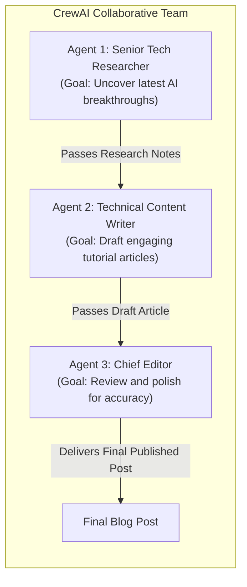

# Multi-Agent Collaboration with CrewAI

<div className="video-card" style={{border: '1px solid #30363d', borderRadius: '8px', padding: '16px', marginBottom: '24px', background: 'rgba(56, 139, 253, 0.05)'}}>
  <div style={{display: 'flex', gap: '16px', flexWrap: 'wrap', alignItems: 'center'}}>
    <div><strong>Curators:</strong> Krish Naik</div>
    <div><strong>Module:</strong> Module 4: Agentic AI & LangGraph</div>
    <div><strong>Focus:</strong> Beginner to Production</div>
  </div>
</div>

## 🎯 What You'll Learn
- Understand the core abstractions of CrewAI: Agent, Task, Crew, and Process.
- Implement role-playing agents with specialized roles, goals, and backstories.
- Compare CrewAI (high-level role-playing) with LangGraph (low-level fine-grained state control).

---

## 💡 Concept & Architecture

While LangGraph provides low-level control over graph state and cycles, **CrewAI** provides a high-level, human-centric abstraction for multi-agent teamwork:
- **Agents:** Autonomous team members assigned a specific **Role**, **Goal**, and **Backstory**.
- **Tasks:** Specific deliverables assigned to an agent, specifying expected outputs.
- **Crew:** The collective team of agents and tasks.
- **Process:** How work flows between agents (Sequential vs Hierarchical).

CrewAI agents communicate autonomously: an agent can delegate a subtask to another agent, critique their coworker's output, and collaborate until the project is delivered.

### System Architecture & Data Flow



---

## 💻 Step-by-Step Code Walkthrough

Below is the complete implementation broken down into digestible parts so you can understand every line.

### Part 1: Step 1: Installing CrewAI and Tools

```python
pip install crewai langchain-openai
```

#### 🔍 In-Depth Explanation:
Installs the CrewAI multi-agent orchestration framework.

### Part 2: Step 2: Defining Role-Playing Agents and Tasks

```python
from crewai import Agent, Task, Crew, Process
from langchain_openai import ChatOpenAI

llm = ChatOpenAI(model="gpt-4o-mini", temperature=0.2)

# 1. Define Specialist Agents with explicit personas
researcher = Agent(
    role="AI Systems Analyst",
    goal="Uncover the core architectural differences between LangGraph and CrewAI.",
    backstory="You are a senior infrastructure architect who evaluates agentic frameworks for enterprise adoption.",
    verbose=True,
    llm=llm
)

writer = Agent(
    role="Technical Documentation Engineer",
    goal="Transform technical research notes into clean, beginner-friendly Markdown tutorials.",
    backstory="You are an expert educator known for explaining complex distributed AI systems simply.",
    verbose=True,
    llm=llm
)

# 2. Define Sequential Tasks with expected outputs
task_research = Task(
    description="Analyze the primary use cases where CrewAI beats LangGraph, and where LangGraph beats CrewAI.",
    expected_output="A structured 3-point bullet comparison with concrete use cases.",
    agent=researcher
)

task_write = Task(
    description="Using the research findings, write a 2-paragraph summary for junior engineers.",
    expected_output="A clear, readable markdown summary paragraph with actionable guidance.",
    agent=writer
)

# 3. Assemble the Crew
crew = Crew(
    agents=[researcher, writer],
    tasks=[task_research, task_write],
    process=Process.sequential,
    verbose=True
)

print("CrewAI team configured and ready for kickoff.")
# In production: result = crew.kickoff()
```

#### 🔍 In-Depth Explanation:
Each agent has a clear identity and goal. The `Process.sequential` setting guarantees that the researcher finishes their deliverable before the writer begins.

---

## ⚠️ Beginner Tips & Best Practices

:::tip When to Choose CrewAI vs LangGraph
Choose **CrewAI** for role-playing scenarios, brainstorming teams, and content workflows. Choose **LangGraph** for deterministic state machines, human approval checkpoints, and low-latency production APIs.
:::

:::warning Verbose Mode Token Costs
Setting `verbose=True` prints internal thoughts to the console. Keep an eye on token consumption because autonomous inter-agent dialogue can consume many tokens.
:::

---

## 📝 Key Takeaways & Summary

- CrewAI structures multi-agent collaboration around human personas (Role, Goal, Backstory).
- Tasks define explicit deliverables and expected output formats.
- Crews execute workflows sequentially or via an autonomous hierarchical manager.

