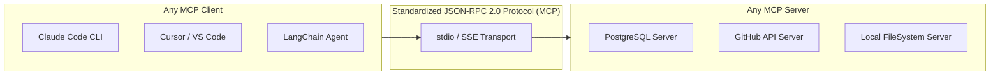

# Model Context Protocol (MCP): The USB-C Standard for AI

<div className="video-card" style={{border: '1px solid #30363d', borderRadius: '8px', padding: '16px', marginBottom: '24px', background: 'rgba(56, 139, 253, 0.05)'}}>
  <div style={{display: 'flex', gap: '16px', flexWrap: 'wrap', alignItems: 'center'}}>
    <div><strong>Curators:</strong> Unified Masterclass (CampusX & Krish Naik)</div>
    <div><strong>Module:</strong> Module 5: Model Context Protocol (MCP) & Claude Code</div>
    <div><strong>Focus:</strong> Beginner to Production</div>
  </div>
</div>

## 🎯 What You'll Learn
- Understand the N x M integration nightmare and how MCP provides a standardized client-server protocol.
- Master the three core primitives of MCP: Resources, Prompts, and Tools.
- Compare local stdio process transports with remote Server-Sent Events (SSE) network transports.

---

## 💡 Concept & Architecture

Before the **Model Context Protocol (MCP)**, if you wanted an AI model to access GitHub, Slack, Postgres, and Google Drive, every single AI tool (Cursor, Claude Desktop, ChatGPT, LangChain) had to write separate custom connectors for each service.
This created an **N x M nightmare**: 10 AI clients × 100 data sources = 1,000 brittle custom integrations!

Anthropic introduced **MCP** as an open standard (analogous to **USB-C for AI**):
- Developers build an **MCP Server** for their service once (e.g. Postgres MCP Server).
- Any **MCP Client** (Claude Code, Cursor, VS Code, LangChain) can plug into that server and immediately access its data and tools without custom code!

### The Three MCP Primitives:
1. **Resources:** Read-only data exposed to the LLM (like files, logs, database tables).
2. **Prompts:** Pre-configured prompt templates and multi-step workflows.
3. **Tools:** Callable executable functions (like running queries, making API calls, editing files).

### System Architecture & Data Flow



---

## 💻 Step-by-Step Code Walkthrough

Below is the complete implementation broken down into digestible parts so you can understand every line.

### Part 1: Step 1: Understanding an MCP JSON-RPC Request and Response

```python
# Under the hood, MCP communicates using standardized JSON-RPC 2.0 messages:

# 1. Client asks the server what tools are available:
# --> {"jsonrpc": "2.0", "id": 1, "method": "tools/list"}

# 2. Server replies with tool schemas:
# <-- {
#   "jsonrpc": "2.0",
#   "id": 1,
#   "result": {
#     "tools": [
#       {
#         "name": "get_weather",
#         "description": "Fetch current weather",
#         "inputSchema": {"type": "object", "properties": {"city": {"type": "string"}}}
#       }
#     ]
#   }
# }

# 3. Client calls the tool:
# --> {"jsonrpc": "2.0", "id": 2, "method": "tools/call", "params": {"name": "get_weather", "arguments": {"city": "Tokyo"}}}
```

#### 🔍 In-Depth Explanation:
Because MCP uses strict JSON-RPC 2.0, servers and clients can be written in different programming languages (e.g. a Python MCP server communicating with a TypeScript client).

---

## ⚠️ Beginner Tips & Best Practices

:::tip Use FastMCP for Fast Server Development
Instead of writing raw low-level protocol handlers, use Python's `FastMCP` library. It provides clean decorators similar to FastAPI.
:::

:::warning stdio Requires Subprocess Spawning
When running local MCP servers over `stdio`, the server must never print raw statements with `print()`. Any stdout message that is not valid JSON-RPC will crash the client parser.
:::

---

## 📝 Key Takeaways & Summary

- MCP is the universal open standard connecting AI applications to enterprise tools and data.
- It decouples clients from data sources, eliminating redundant integration code.
- MCP standardizes three core capabilities: Resources (read), Prompts (templates), and Tools (write/execute).

