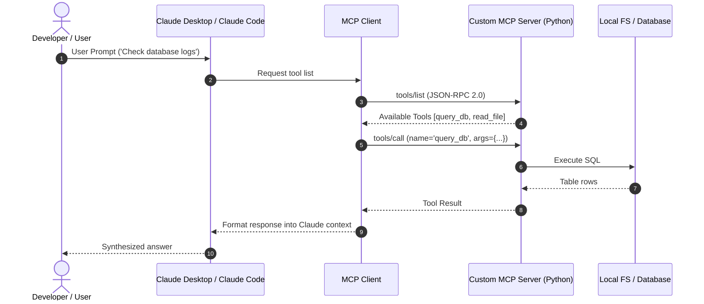

# 📹 Model Context Protocol - The Why ｜ MCP Trilogy

<div className="video-card" style={{border: '1px solid #30363d', borderRadius: '8px', padding: '16px', marginBottom: '24px', background: 'rgba(56, 139, 253, 0.05)'}}>
  <div style={{display: 'flex', gap: '16px', flexWrap: 'wrap'}}>
    <div><strong>Instructor:</strong> Nitish Singh (CampusX)</div>
    <div><strong>Duration:</strong> 52m 1s</div>
    <div><strong>Playlist:</strong> Model Context Protocol Masterclass (CampusX)</div>
    <div><strong>Watch Link:</strong> <a href="https://www.youtube.com/watch?v=Zmy439spZB4" target="_blank" rel="noopener noreferrer">YouTube Lecture ↗</a></div>
  </div>
</div>

## 📌 Executive Summary & Learning Objectives

This lecture covers **Model Context Protocol - The Why ｜ MCP Trilogy**, focusing on production implementations, edge cases, and industry standards:
- Core intuition, architecture, and underlying mechanisms.
- Key differences between theoretical research implementations and scalable enterprise patterns.
- Concrete Python walkthroughs, error recovery, and performance optimization.

---

## 🏗️ Architecture & Conceptual Workflow



---

## 📖 Core Concepts & Technical Deep Dive

### 1. Architectural Foundations
In modern production AI engineering, **Model Context Protocol - The Why ｜ MCP Trilogy** is essential for ensuring reliability, low latency, and deterministic outcomes. As AI systems evolve from naive prompt-in / completion-out scripts into distributed systems, engineers must handle:
- **State management & consistency:** Ensuring intermediate states and tool invocations are tracked.
- **Error boundaries & recovery:** Graceful degradation when external LLMs or vector stores encounter rate limits or network partitions.
- **Resource utilization & cost efficiency:** Caching common queries and reducing unnecessary foundation model token expenditure.

### 2. Operational Considerations
- **Latency Optimization:** Pre-computing embeddings, utilizing asynchronous non-blocking event loops, and streaming tokens via Server-Sent Events (SSE).
- **Security & Sandboxing:** Validating inputs before ingestion, sanitizing LLM outputs, and isolating tool execution environments.

---

## 💻 Production Implementation Walkthrough

```python
from mcp.server.fastmcp import FastMCP

# Initialize FastMCP Server
mcp = FastMCP("Production AI Tools Server")

@mcp.tool()
def calculate_token_cost(input_tokens: int, output_tokens: int, model: str = "gpt-4o") -> dict:
    """Calculate total API cost given token counts."""
    rates = {
        "gpt-4o": {"input": 2.50 / 1_000_000, "output": 10.00 / 1_000_000},
        "claude-3-5-sonnet": {"input": 3.00 / 1_000_000, "output": 15.00 / 1_000_000},
    }
    rate = rates.get(model, rates["gpt-4o"])
    cost = (input_tokens * rate["input"]) + (output_tokens * rate["output"])
    return {"model": model, "total_cost_usd": round(cost, 6)}

if __name__ == "__main__":
    # Runs stdio transport protocol for Claude Desktop & Claude Code
    mcp.run(transport="stdio")
```

---

## 💡 Production Best Practices & Tips

:::tip Production Deployment Guideline
When deploying Model Context Protocol - The Why ｜ MCP Trilogy in enterprise environments, always configure automated retries with exponential backoff and telemetry tracing (such as OpenTelemetry or LangSmith).
:::

:::warning Common Failure Modes
Watch out for state contamination across concurrent requests. Ensure each session or user interaction uses an isolated thread ID or execution context.
:::

---

## 🎯 Key Takeaways & Quick Reference

| Dimension | Production Standard | Pitfall to Avoid |
| :--- | :--- | :--- |
| **Execution** | Async / Non-blocking with timeouts | Synchronous blocking calls in event loops |
| **Data Validation** | Strict Pydantic v2 schemas | Untyped dictionary access |
| **Monitoring** | Distributed tracing & latency percentiles | Relying only on standard console logs |

## ⏱️ Lecture Timeline & Key Topics

| Timestamp | Key Topic / Concept Discussed |
| :--- | :--- |
| **00:00:00** | Hi Guys, My name is Nitesh and welcome... |
| **00:12:37** | understand this concept in detail.  First of all, let us... |
| **00:25:29** | created tools for campaign management.  The IT department... |
| **00:38:41** | on your machine where your AI... |
| **00:51:58** | do subscribe.  See you in the next video.  Bye.... |


---

---

## 📜 Complete Lecture Transcript (English)

> **Language:** English | **Source:** `02 - Model Context Protocol - The Why ｜ MCP Trilogy ｜ CampusX.en.srt` | **Total Segments:** 26 | **Word Count:** ~7,721 words

<details>
<summary><b>Click to expand full chronological transcript (26 timestamped intervals)</b></summary>

#### ⏱️ [00:00 ➔ 00:02]

Hi Guys, My name is Nitesh and welcome to my YouTube channel.  So if you have seen my last video then you will remember that I have started a new playlist on this channel and the name of this playlist is Model Context Protocol MCP.  And my motivation behind starting this playlist is that this particular term MCP has become very popular in the last one year.  And it looks like MCP will become an industry standard in the next three to five years. Which basically means that everyone in the industry will have to integrate MCP into their software. And that is why I have received a lot of messages and responses from you people that sir please cover MCP.  So that is why I was studying MCP for the last 30-40 days. I was trying to implement it on my laptop and what did I do ?  Planned a curriculum.  Now according to that curriculum I have decided that I will add three videos in this playlist.  The first video will be The Why, the second will be The What, and the third will be The How.  And my goal will be to teach you MCP in depth through these three videos. Now if we talk about today 's video, today's video is the first video of this playlist.  And in this we will cover The Why Aspect of MCP. So basically my goal in this video is to teach you in depth why MCP was needed. What is the problem that MCP solves and I'm going to take a very storytelling approach to explain this whole thing. I will start from the very beginning when Chat GPT came into the picture and whatever has happened from there till today, I will tell you all those things in a story like fashion and the benefit of this will be that I will be able to develop a very deep intuition in your mind as to

#### ⏱️ [00:02 ➔ 00:04]

why MCP is needed as a technology.  Ok? So I really hope I was able to explain to you in the first 1 minute what our goal is in this video and now if you found everything right, everything is sounding right then now let's start the video.  So Guys our story starts on 30th November 2022 the day ChartGPT was released and with in five days ChartGPT crossed the mark of 1 million users and in next 2 months crossed the mark of 100 million users. And these are not small numbers. In fact, before Chart GPT, no software had achieved such crazy numbers. Whether you talk about Google or Facebook or Twitter.  Infact Chart gpt is a completely different class of software. Software like never before. And Chat GPT gives you a capability that no software has given you before. And that capability is that you can talk to machines just like you talk to a human being. In your natural language.  Just think about it, our relationship with machines is probably 500-600 years old.  Earlier there used to be mechanical machines.  Then came electrical machines and then in the last 50 years we have been working a lot with computers. But our relationship in these 500-600 years has been mostly transactional.  Which basically means that if I want anything from my machine, I simply perform an action and I get the result in return. I am feeling hot.  I have to turn on the fan. I'll go and press the switch.  I have to do some calculations.  I'll press the buttons on the calculator. I have to fill a form. I will simply type things on the keyboard and press a button and the machine will do our work. This is a transactional relationship where we get our work done by talking in a very subtle way.

#### ⏱️ [00:04 ➔ 00:06]

But with the advent of Chat GPT, you can talk to computers just like you talk to a human being.  You can express yourself if you want.  From the front, the machine can also express itself.  You can engage in a thoughtful discussion with your computer. You can in fact make him your work partner.  All this became possible after the advent of Chat GPT.  That is why I am saying that Chat GPT is a completely different class of software. Ok?  Now like any other software, when Chat GPT was launched, its adoption happened slowly.  In fact, if you ask me, the adoption of Chat GPT happened in three stages.  So the first stage I am calling The Stage of Pure Wonder.  I still remember around the first week of December, one of my students messaged me on WhatsApp and said, Sir, please try out this particular chart bot once. It's crazy good.  And I still remember the whole next day I was talking to Chat GPT.  And I was shocked at how intelligent this chatbot is. And I am pretty sure you all must have experienced the same thing when you talked to Chat GPT for the first time. So throughout this entire stage, I think people did only one thing and that was satisfy their inner curiosity. So basically people asked weird questions to Chart GPT.  Like I'm pretty sure someone asked to explain quantum physics from a cat's perspective.  Or someone else might have asked what would happen if gravity were reversed?  Or someone might have asked you to write a song about pizza in Shakespearean style.  And basically we were asking these crazy questions and Chat GPT was intelligently responding.  And

#### ⏱️ [00:06 ➔ 00:08]

we were taking screenshots of it and posting it on Lindin, Instagram, WhatsApp. So in short, what happened in this first wave of adoption was that social media exploded and we were constantly seeing screenshots of what questions people asked and what the chatbots replied.  So nothing meaningful happened here but our curiosity was somewhat satiated.  Then comes the second wave of adoption. I am calling this a professional adoption. Because once that initial period was over , our curiosity subsided a bit and we understood Chart GPT a little.  So a question automatically came to our mind that this fun we are having with Chart GPT is fine.  But is this chatbot intelligent enough to help us in our professional work?  So this was the first time when a lawyer went and put a 50 page contract in Chat GPT and said, friend, summarize this and make two more charts, GPT did it.  Maybe this was the first time when a coder pasted his code and said that an error is occurring here.  Can you debug this?  And the chart was done by GPD.  Or maybe a teacher like me went and said, friend, I have to plan the curriculum and I do n't feel like studying everything.  Can you do this for me?  And the chart was done again by GPD. So this was the first time we all collectively realized that this was not just a tool for fun. In fact, this chatbot has got serious potential and it can become our work partners.  Meaning, if we want, we can double our productivity with the help of this software. And this also happened earlier where it used to take you 6 hours to do any work. With the help of Chat GPT, you might have been able to do that work in 3 hours. So what happened next was that after this wave of adoption, people all over the world saw a productivity boom and collectively everyone's productivity increased.

#### ⏱️ [00:08 ➔ 00:10]

Everyone's way of working became a little easier. And here Chat GPD showed his true power.  And then comes the third wave of adoption which is the API revolution. What happened at this particular stage was that Chat GPT, that is, Open AI did not just release Chat GPT.  They also released the API for their GPT models to the general public. He said that if you want, you can integrate chatting capabilities like Chat GPT into your existing software. And it has happened too.  Many companies realized that our software, Alldo, is very good.  But it would be great if we could somehow bring intelligent features like Chat GPT into our software.  And this was the first time Microsoft went ahead and added the Co-Pilot feature to Word, Excel, and Powerpoint.  Which was basically a way to communicate with their software in a natural way.  Then Google came forward and integrated AI into Gmail, Docs Sheets and Drive.  And this was the first time new age tools started coming in like cursors or perplexity.  And what happened was that now AI was not restricted to just chat and GPT.  The software we were already using also started getting AI capabilities.  So in short, what happened was that after this wave of adoption, AI became a little more accessible.  If I need AI, I can't find it in Chat GPT alone.  I can also find it in different software around me. So in these three waves you can say that LLMs have completely come into our world. So with the advent of Chat GPT and its API, all the software around us became AI enabled.  And along with this, it also became possible to make sure that AI becomes very accessible.  But

#### ⏱️ [00:10 ➔ 00:12]

with this accessibility a new problem emerged and I call this problem the problem of fragmentation. So what I mean to say is that there are a lot of softwares around us which we use on a daily basis.  And with the advent of Chat GPT and its APIs, all those softwares became AI enabled.  For example, we use Notion.  We also use Slack.  And both of them are AI enabled. But the problem is that Notion's AI has no idea what's going on in Slack's AI.  Or if we use VS Code and we have installed Coding Assistant there.  So this coding assistant has no idea what discussions are going on in Microsoft Teams. So basically, suddenly we realized that we were living in multiple AI worlds.  There's an AI world of Notion, there's an AI world of Slack, there's an AI world of our VS Code coding assistant, and so on.  And if we want to get even a small task done, we have to juggle between these multiple AI worlds. Some information is lying in one place. Some information is lying elsewhere.  And our job is to go to all those places, merge that information and get our work done. Now think about it.  We never wanted this problem that we are facing. Our vision when we first saw and used Chat GPT was that we wish we could get a unified AI agent who understands our entire work end to end and not only that when I get stuck in any problem, that unified AI agent can also solve any of my problems. This Was Our Vision.  But instead what did we get?  We found five different AI tools.  Get some work done with this AI tool.  Get some work done by other AI tools.

#### ⏱️ [00:12 ➔ 00:14]

And so on.  Now the task of creating the unified AI agent that we had to create is actually not easy.  And the biggest problem in the way of creating this unified AI agent is the problem of context.  Which we will understand next. Now let's talk about context. Context is a very fundamental concept in MCP.  In fact, it is so fundamental that even the name MCP has context. ModelContext Protocol.  So let's do one thing.  Let us take some time and understand this concept in detail.  First of all, let us understand in very simple words what is context?  So in simplest words context is everything and AI can see when it generates a response. When AI generates a response, whatever things it sees while generating that response are called context.  A more formal definition would be that context refers to the information that the LLM uses to generate a response.  Now that information can be conversation history or external documents.   Let us understand through an example.  Suppose you are talking to Chat GPD about quantum physics.  You asked what is quantum physics? Where to learn quantum physics?  What are the good books? Now suddenly you asked how difficult is it to learn this particular topic?  Now how does Chat GPT know what is being talked about ?  The Answer is Conversation History. ChartGPT will quickly go through the entire conversation history and realize that the user is talking about quantum physics. So he will understand that you are asking how difficult it is to study quantum physics and he will immediately give you the answer.  So in this particular scenario, your

#### ⏱️ [00:14 ➔ 00:16]

conversation history is the context of your AI model.  Ok? While typing the next response, your AI can look at the entire conversation history and print its response with its help. Ok?  So I hope you understood the context roughly.  Now in this particular example the context is shown in a very simple way. Basically in the form of a conversation history, but context isn't necessarily that simple.  Especially if you talk about professional use cases.  So now let me take another example to explain to you how difficult context can be to understand.  So let's talk about a software engineer and what goes on in a particular day in his life and understand what the context is there.  Ok?  So let's say I'm a software developer and I work at a startup.  We have a product.  Suppose there is a tech product where people purchase courses.  Just like Yumi. Now suddenly I was given a requirement and I was told that I have to add the feature of two factor authentication in our website so that our website becomes a little more secure.  So how does this whole thing happen?  Let me tell you that.  So what will happen first? A ticket will be raised on some software like Jira and that ticket will be assigned to me that I have to develop this feature.  What should I do now to develop this feature ?  First I will go to the gate and pull the most updated code base from there to my machine. Right?  And then obviously if I want to do two factor authentication then for that I will have to go into the database and understand what our existing schema looks like. So I will use some software like My Sequel which our company is using

#### ⏱️ [00:16 ➔ 00:18]

and by entering that software I will study the schema of the database.  Suddenly I remember that I also have to follow certain security guidelines in order to implement the two-factor authentication.  So what should I do?  I will go to Google Drive and from there I will pick up a security document with the help of which I will implement this entire two factor authentication. Finally, if I get stuck somewhere, I will go and talk to my teammates or take help with the help of some software like Slack.  So in this particular case, if you can see, what I have to do is to develop a two factor authentication system, this is my task.  But the context related to this task exists in many places.  Now this is not as simple as in our last example where our entire context existed in just one conversation history. Here in this scenario our context is existing simultaneously at multiple places. Now think for yourself, if I have to do this work of developing two factor authentication with the help of AI let's say chart GPT, then how will I approach it ?  First I will go to cumin. From there, I will copy whatever is written in the ticket about how to implement this entire solution.  I will paste the chart GT.  After that I will go into the code base.   I will copy the code of 10-12 files.  I will paste the code of our existing authentication system in the chart GPT. After that I will go to my sequel.   I will copy the schema.  I will paste the chart on GPT. After that I will fetch my security documents.   I will paste the chart GPT of the specifications written there.  After that, if there are any discussions in Slack, I will copy them.  I will paste it on four GPTs and finally after pasting so much, after 20 minutes I will ask my first

#### ⏱️ [00:18 ➔ 00:20]

question, how to implement two factor authentication in such a system.  Now I guess you can see how scattered the context is and how difficult it is to create the context and how time consuming it is and this is the biggest problem.  Our problem is that before asking a simple question, we have to copy thousands of lines of code and put it on Chat GPT first.  Meaning, in a way, if you say so, we developers have become human APIs in a way.  And what is our job?  Our job is to assemble context for software like Chat GPT. So we are basically human APIs. And in a way, it would not be wrong to say that in this context assembly that we are doing, we are spending more time rather than actually developing the product. Apart from this, you have to keep in mind all the time that what context have you provided to the AI, what is left, has the AI ​​forgotten, what needs to be summarized and told, this whole thing is not scalable at all, think about it, if you have a code base of such a company where the code base is of 500 lines, then can you summarize it for your AI or can you copy paste that entire context in chart.gpt, so it is not at all possible that you assemble context from different places in this way and give it to your AI.  And that is why I am saying that it is very difficult to create a unified AI agent. Because the biggest challenge we face is context assembly.  In a real professional scenario, your context exists across systems. And being able to copy and paste all of that stuff into one place and then talk to Chat GPT or any

#### ⏱️ [00:20 ➔ 00:22]

AI software is a very, very difficult thing to do, and at scale, it's not at all possible.  So if I summarize the problem in this context, the main problem is that if we want our AI chatbot to understand all the things related to our work and help us in solving the problems, then it is important that it can see all our work. Basically, all our work should be part of its context.  But the problem is that our context , our work, is scattered.  So then showing all that work to AI became a very laborious task.  Because we are manually copying and pasting things.  And as your project gets bigger, the more tools you work with, this copy-paste thing will fail you. Ideally, it would have been nice if somehow a software like Chat GPT could automatically fetch the necessary context from all the places, then we would not have to do all this manual copy-paste work and guess what, this problem was solved eventually.  So what happened?  Open AI released a new concept in mid-2023 called function calling.  Now this was a very simple but very powerful concept. What you can do with the help of function calling is that you can make your LLM call an external function. Which basically means that now your LLM will not be useful only for chatting. But if needed, he can also complete any task.  So what happens in function calling is that you provide some set of functions to your LLM and you also give a description about each of your functions to the LLM

#### ⏱️ [00:22 ➔ 00:24]

that this particular function does this work. Ok?  Now suppose we gave a function to our LLM by saying load file.  And we have given this description that if in future the user wants to load the content of any file then you can use this function.  So what will happen now is that when the user receives such a request like read the content of the file abc.txt then instead of doing normal chatting LLM will understand that the user is asking it to do some work.  So what will he do immediately ?  It will scan the list of functions and whichever function description matches the given task, what LLM will automatically do is ask to call that function with the right set of arguments like here it will say call load file with this argument abcxt and then what we will do is call this load file function with this input and our task will be executed. Now this is a very small concept but it was path breaking because for the first time now you can not only chat with LLM but you can also get any task executed as well. So then some kind of architecture started coming into the picture that there is an LLM through which we have connected many functions. Many tools are connected.  A tool for fetching weather data from the Weather API. A tool for running queries on a database.  Another tool is GetB to fetch information from your repository.  Another tool is for searching the web.  So basically you can create different functions for your different tasks. And each function will internally tell us how to execute that given task. And the

#### ⏱️ [00:24 ➔ 00:26]

only job of your LLM is to read the user's props and understand which tool to invoke.  And this was a very revolutionary idea.  After its arrival, there was a shower of tools.  Any company that was already working with LL.M.s. He realized the power of tools and started building a variety of tools to make context assembly seamless to his workflow. Like first of all they created tools for enterprise software. Like every company uses your sales force, uses Slack, uses Google Drive, uses databases. So first of all the companies told their developers to do one thing.  You can create a sales force integration tool for our AI chatbot.  Similarly, you can create a Slackbot tool for Slack.  You can create connectors to Google Drive.  You can create tools to run queries on the database or you can create a Gate integration tool. So that is where our context exists.  By connecting to these we can fetch the context at any time.  Then companies also created internal tools.  For example, HR departments created separate functions to access employee data. Made the tools.  The finance team built tools for accounting systems.   The marketing team created tools for campaign management.  The IT department created tools for infrastructure management.  And what happened at this point?  The new AI-first software also started creating a variety of tools.  For example, Cursor, our AI-powered code editor, has built-in file system access tools that allow you to access any file on your local file system and search it intelligently.  Similarly, Perplexity has become a tool for web browsing and real-time information retrieval. A

#### ⏱️ [00:26 ➔ 00:28]

subscription based feature called Chat GPT Plus has come in Chat GPT with the help of which you can do browsing.  You can upload files.  You can execute the codes.  Cloud launched a feature called Computer User Bol with the help of which he can completely control your computer. So basically, within these six months of the introduction of function calling, there has been a flood of tools all over the AI ​​world.  Ok ?  And now let's see how our software scenario, where the context was scattered, is panning out with the advent of these tools. So I am still that developer and I was given the same task that I have to implement two factor authentication and to do this work I need the help of four GPTs.  But now I have all the necessary tools.  As soon as a ticket is raised on Jira and assigned to me, now what I can do is rather than manually going to Jira and copying and pasting the contents of the ticket, I directly tell Chat GPT to go and check whether I have a new ticket assigned on Jira or not and since Chat GPT is connected to Jira through a tool, all this work is done behind the scenes in an automated manner. Then I found out that yes, I have been assigned a new ticket.  I have to develop two factor authentication.  So I quickly asked Code Chat GPT, can you get the most updated code base from Getb?  So again, the entire code base is connected through a tool.  Then I told Chart GPT that I need a schema to create two factor authentication. So since I am connected to my sequel with the help of a tool, the schema also came to charge GPT.  Then I said, freshen up the security guidelines and bring them from the drive.  The connector for the drive was also exhausting.  And finally I asked him what my team members were talking about on Slack about this particular thing and to fetch that information also.  Now this entire context has been assembled.  Now I

#### ⏱️ [00:28 ➔ 00:30]

asked my question that now that you can see everything. Tell me how I can build a two factor authentication system.  Now you can see the power of tools that previously scattered context is now connected to our AI Chatub Chart GPT.  And now Chat GPT can actually see my entire work and since it can see my entire work then obviously it can help me in doing that entire work in a very good way. So, in this way, we solved the context assembly problem that was preventing us from becoming a full-fledged unified AI partner by introducing tools.  Now when this function calling slush tools solution came, people thought that they have solved the context assembly problem at least for a few days but after some time they realized that even though this tools solution works and brings you the entire context, but there is a big flaw in this approach. What is a flaw?  Let me explain to you.  So as I told you, you have to provide context to your AI. Context is scattered across different tools.  So what do you do?  You write a function for each tool. Like this code I show you.  This is the code of the calculator I'm sorry chatbot that we are creating in our Lang Graph playlist and we have added two tools to that chatbot. A calculator tool and a tool to fetch the stock value of any company in the stock market.  And you see, we have created one function each associated with these two tools. This is one function.  This is another function.  So the basic principle is that you have to write the code of a function for each of your tools. Now let

#### ⏱️ [00:30 ➔ 00:32]

me tell you how this thing is problematic. So let's say there's a scenario where we work with three different AI chatbots in the company we work with. One is a normal chatbot through which we can ask anything related to the company.  The second is a coding agent.  So, all the developers in our company , software developers, use this coding agent. And there is another chatbot called Analytics Agent Bol Ke.  So, we provide this chartbot to all our data analysts to do data analysis, to do automated data analysis.  Now let's assume for a moment that our company works with some 20 different Sass tools. Like Jira, Slack, Geeb, My Sequel Drive, and 15 more such tools.  So now think for yourself how many functions we will have to write. How many such functions will we have to write?  I guess you can understand that if you have n i chatbots and you have m different tools or services then you will have to code in total n across m integrations or functions. Now this is a small number. These numbers can be even larger in larger companies. Maybe you work with more chatbots or you work with more Sass tools or internal tools. Now making so many functions, writing so many functions, coding so many functions is a development nightmare, think about it because you will have to write your own authentication method for each function. Each tool will have its own data format.  There will be API patterns.  Each tool will require different error handling methods.  So basically coding this much is a separate task in itself.  You basically have to set up a separate software team

#### ⏱️ [00:32 ➔ 00:34]

just to create these integrations. Ok?  Apart from this there are other problems also.   The problem is maintenance.  Let's say you have three chatbots.  There are 20 integrations. How many functions did you have to write in total? 60 functions.  Now you also have to maintain these 60 functions. If tomorrow Google Drive makes some changes to its API, then automatically all your Google Drive integrations will fail.  All three or four of your chat bots are no longer able to communicate with Google Drive. So again you have to go and debug that.  Right?  Then apart from this there is the problem of security. When you work in big companies, you make sure that your software does all the work securely.  But since you have written 60 different integrations and each one has its own attribute.  Have your API keys.  So you cannot manage all these from a single place. All this information is lying in different files.  So your security is fragmented and there it is possible that some hack may be performed in some way. And the fourth problem is that in this whole approach both your cost and time are getting wasted.  Think about how time is being wasted.  If I have a chatbot and I want to connect 20 tools with it, then I have to write individual integrations for all the 20 tools. I'm basically having to create 20 functions like this.  Which is a very complex thing in itself.  So it will take time to code every integration, every function. So my chatbot should be fully functional.  This may take 2 to 3 months.  Right?  After that there is cost involved.  I basically have to set up a whole team which is completely dedicated to this integration part.  Handle it. Now I have to look at their salaries. Now think about it, what was my end goal?

#### ⏱️ [00:34 ➔ 00:36]

Why am I doing this whole thing?  So that the work of my existing developers becomes easier.  Now their work will be easier. I have to hire other developers to do this work. Just see the irony in this. You went to make something easy but it became more difficult instead.  So what I'm trying to say is that these tools and function calling solutions that we implemented in order to solve the context assembly problem actually brought with it an integration problem at scale, which again people found very difficult to solve.  Now let us summarize the integration problem of this function calling slush tools.  The basic overview of the problem is that our company is using multiple AI chatbots. Our company may be using Perplexity.  You are simultaneously using the cursor and also using chat GBT. And we want these three chatbots to connect to GH.  Now the problem is that to get this done we will have to create three separate integrations.  One for Perplexity&getb, one for Cursor& getb and one for ChatGPT&getb.  And the problem is that these three integrations will look different from each other.  So the problem is that every AI tool is building its own way to call every API.   It would have been nice if we had somehow made sure that rather than making three integrations, we would have made just one single integration of GateB and the same integration would have worked with Perplexity, the same would have worked with Cursor, the same would have worked with Chat GPT. This is what we want to achieve and this is how we can

#### ⏱️ [00:36 ➔ 00:38]

solve this integration problem. And then who came to solve this problem ?  MCP Model Context Protocol. So come on guys let's talk about MCP now.   Let me tell you in very simple words how MCP works.  So there are two entities in MCP.  One is the client and the other is the server.  And the entire communication takes place between these two entities. Ok?  Now you should not start thinking that what new thing has come called client or what new thing has come called server.  Actually, the client in MCP is your AI chatbot. Ok?  Basically your chat could be GPT , Cursor, Perplexity or your own AI chatbot.  That's what we're calling a client.  And the server is basically the service to which you want to connect your AI chatbot. Like Ghub or Google Drive or Slack.  Ok?  Now the general architecture of any MCP application looks something like this: you have a single client and it is connected to many servers. Connected to many tools.  Meaning one AI chatbot is connected with multiple AI tools. So one tool became ghub became one, Google Drive became one, Slack became one. Now, this entire communication, this entire conversation that is taking place between the client and the servers, the language in which it is happening is called MCP or Model Context Protocol.  Ok?  So I really hope you are understanding whatever I have said till now. Now I know this curiosity might be coming in your mind that how can I make my AI chatbot an MCP client and how can I make my tools an

#### ⏱️ [00:38 ➔ 00:40]

MCP server. Now the answer to this is that if you read the MCP protocol properly, read its documentation properly, then you can write this entire code yourself from scratch which will establish this MCP communication between client and server.  But Anthropic gives you a ready-made library or SDK.  So if you want to make your AI chatbot an MCP compatible client, you don't have to do anything. You will need to install an MCP client SDK on your machine where your AI chatbot is running.  And if you want to make your tools MCP compliant server then again you have a library called MCP Server SDK, you will use it to build your tools.  Ok?  This is the biggest difference.  This is how your MCP clients are being created.  This is what your MCP servers are being created from.  Now let us go to a little technical level and understand how MCP is different from function or tool calling.  Which we read just before this. So what you do in function or tool calling is that whatever tool you want to connect to, you write a function to access its API inside your AI chatbot which I also showed you a while ago. In our chatbot, we created two different tools. One with a calculator, one with stocks. So what happens is that here also a kind of client server model is being followed. For example, if we want to connect our AI chartbot to a weather tool, then obviously somewhere on the server there will be an API for the weather tool which is probably written in Fast API and will look something like this.  So this kind of became our server.  And then what we do to access this is

#### ⏱️ [00:40 ➔ 00:42]

we write a function in the code of our AI chatbot. Ok?  And here we write the code to hit this API and fetch the data.  So this kind of became our client side.  So this is normal function or tool calling.  Now let me tell you what changes happen in MCP. So there will be a server in MCP also. Weather one where weather data will be recorded. Ok?  The server that will be created here will be created with the help of MCP library.   The code is a little different but internally it is using the same API.  Ok?  The main difference comes from the client side.  On the client side, you don't need to write any code for your AI chatbot. Since you have already integrated and configured the client and server. And they are speaking the same language that is Model Context Protocol.  So, you don't need to write separate code to fetch data from this API.  The server handles all this work.  So let me explain it to you once again at a technical level. In function calling, there is a server code which is written by the company and there is a client code which is written by you and when both these codes work together then the entire task is completed. In MCP, the server is doing all the heavy lifting.  There is nothing you need to do in MCP server and client side. All you have to do is connect the client and server. Once both are connected. Started speaking the same language.  So our clients know.  Our AI tool knows that it has access to this server and can fetch the tool of its choice from within that server to get its work done. So this is the major difference between

#### ⏱️ [00:42 ➔ 00:44]

MCP and function slash tool calling.  That in MCP server does the heavy lifting on the client side, on the AI ​​chatbot side you don't have to do anything, just make the connection and sit back.  Ok?  So suppose if you are creating a GH server in MCP then it is the responsibility of the GH server to do everything.  The entire business logic will be implemented on this server.   The authentication work will be implemented on the server.  The rate limiting server will handle the API.  The server will see what the data format translation LL understands in front of it.  The error handling code will also be written on the server itself and it will send the correct error codes to the client if something goes wrong.  And what does your client have to do ?  Simply connect to this server and speak the same language. MCP. This is the biggest difference between function tool calling and mcp.  I really hope you are getting a little understanding. We will study this in great detail in the upcoming videos. But right now I just wanted to give you an overview.  Now let us discuss what benefits come from implementing this particular logic and this particular method. So as I said, the biggest benefit of MCP is that here you do not have to do anything on the client side.  All the heavy lifting is being done by the servers.  So this is what happened after the arrival of MCP, all the famous service providers like GH, Google Drive, Slack, all of them created their own official MCP servers. Which basically means that any MCP compliant AI tool can easily connect with these servers.  Now the benefit of this is that the integration problem you had was, suppose you have three chatbots in your company and you

#### ⏱️ [00:44 ➔ 00:46]

want to connect them with 10 services, then you had to write 3 * 10 i.e. 30 unique integrations. Now you don't have to do this.  Now if you want to connect to 10 MCP servers, you need only 10 integrations and those integrations are also being written on the server side.  The service provider is writing it himself. You don't need to write any integration on the client side. You can simply configure your AI tool to connect with the server. So where there were m+n integrations earlier, now there are only m+n integrations instead and even in that the work of writing the actual code has been delegated to the server site.   The client has nothing to do.  This is the first benefit.  The second benefit is there is no maintenance overhead.  Since I am not writing any code on my site to make the connection, then there cannot be any problem there. If the API is updated tomorrow, it will cause a server headache.  The server will update its code.  I don't need to do anything on my site.  There will be no changes at the client site.  Thirdly, reduced cost and time.  Suppose I want to connect my AI chatbot with 10 different services. So earlier I had to create those 10 integrations which took time.  But what should I do today?  I want to create a simple AI chatbot and 10 servers are already available.  I will connect with them directly on day one.  So, on day one itself, I will easily get whatever work I need for 10 servers. So time is being saved here. And obviously the cost is being saved because I don't have to hire separate engineers to create and maintain these integrations.  And the last point is that we get better security.  Why?  Because when you connect an AI chatbot to multiple

#### ⏱️ [00:46 ➔ 00:48]

services, you simply have to maintain one JSON file.  You have to maintain a config file where all your connections are written in one place. For example, this part that you see is the code to connect my AI chatbot to GH.  This is it.  That's all the code I need.  Here I have given my personal access token etc.  And it's now connected to my Get account.  Similarly, this is the only code connecting my AI chatbot to Notion. Again I have given my API key etc. here.  Ok?  Now managing or auditing this single file is much simpler than the old case where we had different API keys in 10 different files for 10 different tools. Right?  So this is a much better security model as well.  So these are the main benefits of MCP.  Again everything is dependent on just one simple fact and that fact is that in MCP the entire heavy lifting is done by the server on the client side the AI ​​chatbot has to do nothing.  You basically have to maintain a JSON file like this to connect to various servers and that's it. Your work is done.  So I have given you an overview of how MCP works. But now I want to discuss one more thing with you. And that is how is MCP becoming so popular so fast ?  What is the reason why the MCP ecosystem is growing so rapidly and why does it seem that MCP will become the industry standard in the next three to five years? Now the reason behind that is very simple. You can understand this entire dynamics very easily. So what is happening is that some very famous AI

#### ⏱️ [00:48 ➔ 00:50]

chatbots are openly saying that they support MCP.  CLOT Desktop said that we support MCP cursor Winds Perplexity also said that we support MCP.  Now as soon as these chatbots said that they support MCP, pressure started building on many services. Services like GitHub, Sc, Google Drive Extra.  The pressure started building because these companies see that in the future, all the work that people will do will be done through these AI tools.  So now it will not be like before that if I want to access any document in Drive, then I will open Drive google.com and go there and read the document.   Instead, people will simply tell their chatbot to get this document from this folder in my drive.  So let's also know that whatever traction they are going to get in the future, whatever users are going to come, they are going to come through these AI tools. So if these AI tools are supporting MCP then I should also create MCP servers with my API.  Because once I create an MCP server, any MCP compliant compatible tool can easily connect to my server. He doesn't need to write any custom code. So what is going on in this affair? MCP servers are being created for all your famous services.  Now what is interesting is that the more MCP servers are created, the more the MCP ecosystem will benefit. Yesterday a company created a new AI chatbot.  All he needs to do is simply make his AI chatbot an MCP compatible client.  And if he creates it, then on day one itself he can connect thousands of MCP servers with his chatbot without writing any piece of code.  So the basic funda is that more AI

#### ⏱️ [00:50 ➔ 00:51]

clients are coming.  More AI chatbots are coming out as clients, and many are also becoming servers.  A lot of servers are being created.  So there is pressure on new chatbots that they should connect with these servers.  So the new clients who are being added automatically become MCP compliant.  Ok?  So basically a network effect is being created due to which this ecosystem is growing exponentially. So more adoption, more standardization, more ecosystem value and if any client or any server, basically any AI chatbot or any tool is not adopting MCP then it means that it will be cut off from this massive ecosystem that is being created. And he would have to write a lot of custom code in order to make sure that his AI chatbot interacts correctly with all the services, which again would be foolish. That is why MCP is positioning itself perfectly and it looks like it will become an industry standard in the next three to five years.  Ok?  So with that I will conclude this video.  I really hope I was able to explain to you in a story way why MCP is needed. I started right from day one and brought you to the scenario that exists today. I really hope the video was long but not boring and you were able to derive some value. Now in the next video we will go into great detail at the architecture level and understand how MCP works.  The What of MCP.  So I really hope you are excited for the next video.  If you liked this video please like it.  If you have not subscribed to this channel, please do subscribe.  See you in the next video.  Bye.

</details>
