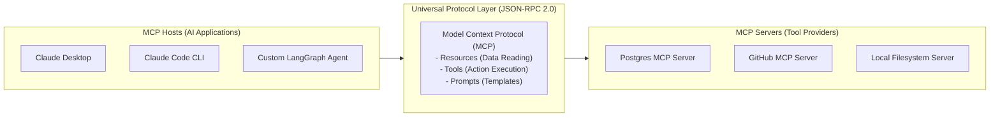

# 📹 Model Context Protocol - The Why

<div className="video-card" style={{border: '1px solid #30363d', borderRadius: '8px', padding: '16px', marginBottom: '24px', background: 'rgba(56, 139, 253, 0.05)'}}>
  <div style={{display: 'flex', gap: '16px', flexWrap: 'wrap'}}>
    <div><strong>Instructor:</strong> Nitish Singh (CampusX)</div>
    <div><strong>Duration:</strong> 3121</div>
    <div><strong>Course:</strong> Module 5: MCP & Claude Code</div>
    <div><strong>Watch Link:</strong> <a href="https://www.youtube.com/watch?v=Zmy439spZB4" target="_blank" rel="noopener noreferrer">YouTube Lecture ↗</a></div>
  </div>
</div>

## 📌 Executive Summary

The Model Context Protocol (MCP) is an open standard introduced by Anthropic that standardizes how AI assistants discover and connect to external data sources, tools, and developmental environments. Before MCP, every tool and data provider required custom, brittle integration code. MCP establishes a universal client-server protocol over JSON-RPC 2.0.

This lesson explores the motivation behind MCP, the $N \times M$ integration problem, and the architectural roles of Hosts, Clients, and Servers.

---

## 🏗️ System Architecture & Execution Flow



---

## 📖 Core Concepts & Technical Deep Dive

### 1. The $N \times M$ Integration Problem
Without a common standard, connecting $N$ AI models/clients to $M$ enterprise tools requires writing $N \times M$ custom integrations. MCP collapses this into $N + M$: each client implements the MCP client specification once, and each tool exposes an MCP server once.

### 2. The Three Core MCP Primitives
- **Resources:** Passive data sources that provide read-only context (files, database tables, API logs).
- **Tools:** Executable functions that perform external actions (creating GitHub PRs, writing files, executing queries).
- **Prompts:** Reusable workflow templates exposed by servers to guide complex multi-step tasks.

### 3. Transport Layers
MCP supports two primary transports:
- `stdio`: Standard input/output for local processes running on the user's workstation.
- `SSE (Server-Sent Events)`: HTTP-based streaming transport for distributed remote microservices.

---

## 💻 Production Implementation

```python
from mcp.server.fastmcp import FastMCP

# Define a minimal FastMCP server
mcp = FastMCP("Enterprise Telemetry Service")

@mcp.tool()
def check_service_latency(service_name: str) -> str:
    """Check p99 latency for an enterprise microservice."""
    return f"Service '{service_name}' latency is 18ms (Status: HEALTHY)"

@mcp.resource("config://app-settings")
def get_app_settings() -> str:
    """Read enterprise environment configuration."""
    return "ENVIRONMENT=PRODUCTION\nLOG_LEVEL=INFO"

if __name__ == "__main__":
    mcp.run(transport="stdio")
```

---

## ⚙️ Production Gotchas & Best Practices

:::tip Stdio for Local Tools
Use `stdio` transport for CLI tools and desktop integrations (Claude Desktop) because it requires zero network configuration or authentication certificates.
:::

:::warning Granular Permissions
Always design tools with least-privilege principles. A database MCP server should expose specific parametrized query functions rather than an open `execute_sql` tool.
:::

---

## 📊 Architectural Reference & Comparison

| MCP Entity | Protocol Role | Example |
| :--- | :--- | :--- |
| **Host** | The orchestrating AI application | Claude Desktop, Claude Code, Cursor |
| **Client** | Connects host to an individual server | In-process MCP Client connector |
| **Server** | Exposes tools, resources, and prompts | GitHub MCP Server, SQLite MCP Server |
| **Transport** | Wire protocol mechanism | `stdio` (local process) or `SSE` (HTTP) |

---

## 📚 Key Takeaways & Enterprise Checklist

- [ ] **Architecture Verification:** Ensure your design addresses latency, decoupled interfaces, and strict data validation contracts.
- [ ] **Deterministic Testing:** Run unit tests and golden dataset evaluations before shipping changes to staging or production.
- [ ] **Security & Observability:** Enforce input/output guardrails, scrub sensitive credentials/PII, and capture distributed traces.
- [ ] **Scalability & Sizing:** Calibrate model parameters, context limits, and compute instance requirements against projected request concurrency.
