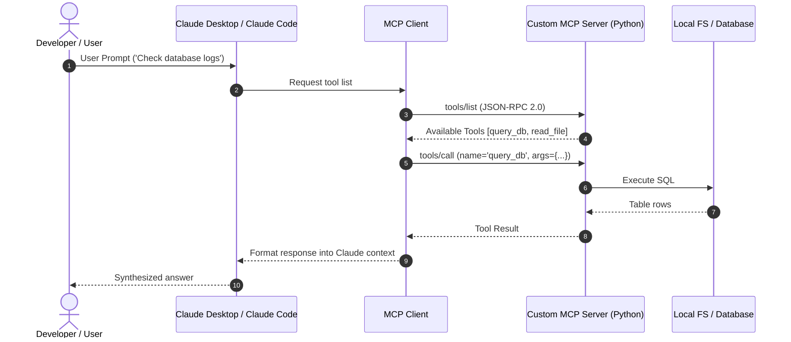

# 📹 MCP Architecture ｜ Model Context Protocol Architecture

<div className="video-card" style={{border: '1px solid #30363d', borderRadius: '8px', padding: '16px', marginBottom: '24px', background: 'rgba(56, 139, 253, 0.05)'}}>
  <div style={{display: 'flex', gap: '16px', flexWrap: 'wrap'}}>
    <div><strong>Instructor:</strong> Nitish Singh (CampusX)</div>
    <div><strong>Duration:</strong> 77m 9s</div>
    <div><strong>Playlist:</strong> Model Context Protocol Masterclass (CampusX)</div>
    <div><strong>Watch Link:</strong> <a href="https://www.youtube.com/watch?v=nQa31xdXbGk" target="_blank" rel="noopener noreferrer">YouTube Lecture ↗</a></div>
  </div>
</div>

## 📌 Executive Summary & Learning Objectives

This lecture covers **MCP Architecture ｜ Model Context Protocol Architecture**, focusing on production implementations, edge cases, and industry standards:
- Core intuition, architecture, and underlying mechanisms.
- Key differences between theoretical research implementations and scalable enterprise patterns.
- Concrete Python walkthroughs, error recovery, and performance optimization.

---

## 🏗️ Architecture & Conceptual Workflow



---

## 📖 Core Concepts & Technical Deep Dive

### 1. Architectural Foundations
In modern production AI engineering, **MCP Architecture ｜ Model Context Protocol Architecture** is essential for ensuring reliability, low latency, and deterministic outcomes. As AI systems evolve from naive prompt-in / completion-out scripts into distributed systems, engineers must handle:
- **State management & consistency:** Ensuring intermediate states and tool invocations are tracked.
- **Error boundaries & recovery:** Graceful degradation when external LLMs or vector stores encounter rate limits or network partitions.
- **Resource utilization & cost efficiency:** Caching common queries and reducing unnecessary foundation model token expenditure.

### 2. Operational Considerations
- **Latency Optimization:** Pre-computing embeddings, utilizing asynchronous non-blocking event loops, and streaming tokens via Server-Sent Events (SSE).
- **Security & Sandboxing:** Validating inputs before ingestion, sanitizing LLM outputs, and isolating tool execution environments.

---

## 💻 Production Implementation Walkthrough

```python
from mcp.server.fastmcp import FastMCP

# Initialize FastMCP Server
mcp = FastMCP("Production AI Tools Server")

@mcp.tool()
def calculate_token_cost(input_tokens: int, output_tokens: int, model: str = "gpt-4o") -> dict:
    """Calculate total API cost given token counts."""
    rates = {
        "gpt-4o": {"input": 2.50 / 1_000_000, "output": 10.00 / 1_000_000},
        "claude-3-5-sonnet": {"input": 3.00 / 1_000_000, "output": 15.00 / 1_000_000},
    }
    rate = rates.get(model, rates["gpt-4o"])
    cost = (input_tokens * rate["input"]) + (output_tokens * rate["output"])
    return {"model": model, "total_cost_usd": round(cost, 6)}

if __name__ == "__main__":
    # Runs stdio transport protocol for Claude Desktop & Claude Code
    mcp.run(transport="stdio")
```

---

## 💡 Production Best Practices & Tips

:::tip Production Deployment Guideline
When deploying MCP Architecture ｜ Model Context Protocol Architecture in enterprise environments, always configure automated retries with exponential backoff and telemetry tracing (such as OpenTelemetry or LangSmith).
:::

:::warning Common Failure Modes
Watch out for state contamination across concurrent requests. Ensure each session or user interaction uses an isolated thread ID or execution context.
:::

---

## 🎯 Key Takeaways & Quick Reference

| Dimension | Production Standard | Pitfall to Avoid |
| :--- | :--- | :--- |
| **Execution** | Async / Non-blocking with timeouts | Synchronous blocking calls in event loops |
| **Data Validation** | Strict Pydantic v2 schemas | Untyped dictionary access |
| **Monitoring** | Distributed tracing & latency percentiles | Relying only on standard console logs |

## ⏱️ Lecture Timeline & Key Topics

| Timestamp | Key Topic / Concept Discussed |
| :--- | :--- |
| **00:00:00** | हाय गाइस, माय नेम इज नितेश एंड यू वेलकम... |
| **00:19:59** | फंक्शन को कॉल करके यह वाला इशू क्रिएट... |
| **00:38:47** | टूल्स का नाम भेजेगा। बोलेगा कि मेरे पास... |
| **00:57:40** | फिर से उसने परमिशन ली। ये रहे मेरे... |
| **01:17:07** | में। बाय।... |


---

---

## 📜 Complete Lecture Transcript (Hindi / Hinglish)

> **Language:** Hindi / Hinglish | **Source:** `03 - MCP Architecture ｜ Model Context Protocol Architecture ｜ CampusX.hi.srt` | **Total Segments:** 39 | **Word Count:** ~12,953 words

<details>
<summary><b>Click to expand full chronological transcript (39 timestamped intervals)</b></summary>

#### ⏱️ [00:00 ➔ 00:02]

हाय गाइस, माय नेम इज नितेश एंड यू वेलकम टू माय YouTube चैनल। इस वीडियो में हम लोग अपना एमसीपी प्लेलिस्ट कंटिन्यू करेंगे। सो अगर आपको याद होगा पिछला जो वीडियो था वहां पर मैंने आपको बहुत डिटेल में यह समझाया था कि एमसीपी की जरूरत क्यों है? और आज का जो वीडियो है वो उसी वीडियो का कंटिन्यूएशन है और आज के वीडियो में हम व्हाट एस्पेक्ट के ऊपर बात करेंगे एमसीपी के। मैंने सोचा है कि व्हाट एस्पेक्ट में मैं मेनली तीन चीजें कवर करूंगा। पहला एमसीपी का आर्किटेक्चर जो कि बहुत इंपॉर्टेंट है। दूसरा एमसीपी का लाइफ साइकिल। क्लाइंट और सर्वर एक दूसरे से कैसे बात करते हैं? स्टेप बाय स्टेप उस पूरे प्रोसेस को हम डिकोड करेंगे। एंड थर्डली हम एमसीपी के कुछ एडवांस्ड कांसेप्ट्स जो हैं उनको भी टच करेंगे। बट द प्रॉब्लम इज दिस कि जब मैं यह वीडियो रिकॉर्ड करने बैठा तो आई रियलाइज्ड कि ये तीनों के तीनों टॉपिक्स को अगर मैं एक सिंगल वीडियो में डालूंगा तो वो वीडियो बहुत बड़ा हो जाएगा। सो मैंने यह डिसाइड किया है कि मैं इस व्हाट वाले वीडियो को तीन पार्ट्स में डिवाइड करूंगा। फर्स्ट पार्ट में मैं आपको एमसीपी का आर्किटेक्चर बताऊंगा। दूसरे पार्ट में एमसीपी का लाइफ साइकिल, थर्ड पार्ट में एडवांस कांसेप्ट्स। तो ये जो वीडियो आप अभी देख रहे हो आज का वीडियो इसमें मैंने बहुत डिटेल में एमसीपी का आर्किटेक्चर कवर किया है। इनफैक्ट अभी जो आपके स्क्रीन पे दिखाई दे रहा है ये एमसीपी का आर्किटेक्चर है और इस वीडियो में हम इस पूरे के पूरे आर्किटेक्चर को फर्स्ट प्रिंसिपल से समझेंगे। हम एकदम बेसिक वर्जन से शुरू करेंगे इस आर्किटेक्चर के और फिर धीरे-धीरे हम उसमें और डिटेल्स ऐड करते-करते वीडियो के एंड में इस डायग्राम तक पहुंचेंगे और इस पूरे प्रोसेस में मेरी यही उम्मीद रहेगी, मेरा यही गोल रहेगा कि मैं आपको एमसीपी का आर्किटेक्चर बहुत सॉलिड तरीके से समझा पाऊं। तो आई होप आप इस वीडियो के लिए एक्साइटेड हो बिकॉज़ मैं भी हूं। लेट्स स्टार्ट द वीडियो। सो अगर हम बात करें सिंपलेस्ट वर्जन ऑफ द

#### ⏱️ [00:02 ➔ 00:04]

आर्किटेक्चर की तो एमसीपी के आर्किटेक्चर में सिर्फ दो चीजें होती हैं। एक होता है होस्ट और दूसरा होता है सर्वर। अब आई नो इस पॉइंट पे आपके दिमाग में ये डाउट आ रहा होगा कि मैंने लास्ट वीडियो में होस्ट के बदले क्लाइंट बताया था। आई नो बट डोंट वरी। इस वीडियो को एकदम स्क्रैच से समझो। पिछले वीडियो को भूल जाओ। सो दो चीजें हैं। एक होस्ट है और एक सर्वर है। अब एक बार क्विकली डिस्कस करते हैं कि ये होस्ट और सर्वर होते क्या हैं? कोई खास नई चीज नहीं है। होस्ट जो है वो बेसिकली हमारा एआई चैट बॉट है जिसके साथ यूजर इंटरेक्ट करता है। ठीक है? सो यूजर को कोई भी क्वेश्चन आया दिमाग में वो एक प्र्प्ट के थ्रू होस्ट को पूछेगा और बिहाइंड द सीन्स हमारा जो होस्ट है वो किसी एलएलएम से कनेक्टेड होगा या तो वो ओपन एआई का एलएलएम हो सकता है या एंथ्रोपिक का एलएलएम हो सकता है या फिर जेमिनाई का एलएलएम हो सकता है। तो ये अभी जो आपको दिखाई दे रहा है लेफ्ट साइड ऑफ द स्क्रीन ये जो होस्ट का सेटअप दिखाई दे रहा है ये बेसिकली एक एआई चार्ट बॉट है। ठीक है? अब वो बना बनाया एआई चैटबॉट भी हो सकता है। जैसे कि क्लॉट डेस्कटॉप या कर्सर आईडी या फिर कस्टम मेड चैटबॉट भी हो सकता है जो आपने खुद बनाया है। जैसे हमने लंग ग्राफ वाली प्लेलिस्ट में खुद का चार्टबॉट बनाया था। बट सेटअप सेम रहता है। ठीक है? अब बात कर लेते हैं सर्वर की। तो सर्वर इज़ बेसिकली अ टूल जिसके पास कैपेबिलिटी है कोई एक पर्टिकुलर टास्क एग्जीक्यूट करने की। अब यह सर्वर गीब का भी हो सकता है जिसकी हेल्प से आप बहुत आसानी से किसी गिट रेपोजिटरी को मैनेज कर सकते हो या फिर स्लैक का हो सकता है जिसकी हेल्प से आप किसी स्लैक चैनल के मैसेजेस रीड या राइट कर सकते हो या फिर यह सर्वर Google ड्राइव का भी हो सकता है जिसकी हेल्प से आप अपने ड्राइव अकाउंट की फाइल्स को मैनपुलेट कर सकते हो। सो बेसिक

#### ⏱️ [00:04 ➔ 00:06]

फंडा यही है कि देयर आर टू एंटटीज वन इज होस्ट एंड द सेकंड इज सर्वर और सारा का सारा कम्युनिकेशन इन्हीं दो एंटिटीज के बीच में हो रहा होता है। मैं आपको एक एग्जांपल के थ्रू समझाता हूं। मान लो यूजर ने एक क्वेश्चन पूछा आर देयर एनी न्यू कमिट्स ऑन द गीब रेपो? तो होगा क्या कि सबसे पहले यूजर इस क्वेश्चन को एज अ प्र्प्ट होस्ट के पास भेजेगा। अब होस्ट का बहुत सिंपल काम है। वो क्या करेगा? इस प्र्प्ट को एज इट इज़ एआई एज इन एलएलएम के पास भेजेगा। एलएलएम इस क्वेश्चन को पढ़ेगा और रियलाइज़ करेगा कि इसका आंसर उसके ट्रेनिंग डेटा में नहीं है। व्हिच मींस उसको कोई ना कोई एक्सटर्नल टूल या सर्वर की जरूरत है इस क्वेश्चन को आंसर करने के लिए। फिर वो जाकर के चेक करेगा कि उसके पास कौन-कौन से सर्वर्स अवेलेबल हैं। और वो रियलाइज करेगा कि हां मेरे पास एक गेट का सर्वर है। तो वो इमीडिएटली होस्ट को बताएगा कि आई डोंट नो द आंसर टू दिस क्वेश्चन। बट इन ऑर्डर टू फाइंड द आंसर गो एंड आस्क द GitHub सर्वर। अब होस्ट क्या करेगा? झट से जाकर के GitHub के सर्वर से बात करेगा और उसको अपना क्वेरी दे देगा। Ghub का सर्वर बिहाइंड द सीन्स चेक करेगा कि क्या GH रेपो में कोई नए कमिट्स आए हैं। और जो भी नए कमिट्स आए हैं उनका लिस्ट वापस होस्ट को पकड़ा देगा। अब होस्ट ये इंफॉर्मेशन ले के वापस एलएलएम के पास जाएगा। अब एलएलएम के पास आंसर करने के लिए सफिशिएंट इनेशन है। तो अब एलएलएम अपना आंसर वापस होस्ट को बताएगा और होस्ट वही आंसर यूआई के थ्रू यूजर को दिखाएगा। सो दिस इज द ओवरऑल सिंपलीफाइड वर्जन ऑफ एमसीपीस आर्किटेक्चर। अब गाइज़ एमसीपी आर्किटेक्चर का जो सबसे सिंपलेस्ट वर्जन था वो तो हमने समझ लिया। अब हम एक काम करेंगे। हम इस सिंपल वर्जन में थोड़ा सा और रिफाइनमेंट ऐड करेंगे। ठीक है? अभी तक की

#### ⏱️ [00:06 ➔ 00:08]

समरी ये रही है कि एमसीपी आर्किटेक्चर में दो मेन पार्टीज हैं। एक है होस्ट दूसरा है सर्वर। और पूरा का पूरा कम्युनिकेशन इन दोनों पार्टीज के बीच में चल रहा है। बट यह बात पूरी तरीके से सही नहीं है। इन रियलिटी आपका जो होस्ट होता है वो कभी भी सर्वर के साथ डायरेक्टली बात नहीं करता है। होस्ट को जब भी सर्वर से बात करनी होती है तो होस्ट अपने एक हेल्पर फ्रेंड के पास जाता है और हमारे केस में वो हेल्पर है एमसीपी क्लाइंट। सो क्लाइंट इज बेसिकली दैट एंटिटी जो होस्ट को हेल्प करती है सर्वर से कम्युनिकेट करने में। सो कोई भी डायरेक्ट कम्युनिकेशन बिटवीन होस्ट एंड सर्वर इज़ नॉट पॉसिबल। ईच कम्युनिकेशन विल बी वाया द क्लाइंट। ठीक है? अब अगर हम थोड़ा सा ज़ूम इन करें क्लाइंट के ऊपर। तो क्लाइंट की जो सबसे बड़ी खूबी है वो यह है कि क्लाइंट कैन स्पीक द सेम एमसीपी लैंग्वेज दैट द सर्वर स्पीक्स। एंड दैट इज व्हाई क्लाइंट के लिए इट्स सुपर इजी टू कम्युनिकेट विद द सर्वर। अब एक काम करते हैं। फिर से सेम एग्जांपल के थ्रू देखते हैं कि क्लाइंट के आ जाने से पूरा का पूरा कम्युनिकेशन कैसे चेंज हो रहा है। सो फिर से हमारे यूजर ने हमारे चैटबॉट एज इन होस्ट से पूछा कि बताओ क्या मेरे गिट रपोजिटरी में कोई रीसेंट कमिट्स हुए हैं या नहीं? अब होस्ट क्या करेगा? इस प्र्प्ट को लेगा और उससे एक हाई लेवल रिक्वेस्ट जनरेट करेगा कि फाइंड द रीसेंट कमिट्स इन द गेट रेपोजिटरी और यह हाई लेवल रिक्वेस्ट वो क्लाइंट को दे देगा। अब क्लाइंट का काम क्या है कि वो इस हाई लेवल रिक्वेस्ट को एक एमसीपी कंपैटिबल रिक्वेस्ट में कन्वर्ट करेगा। और एक बार

#### ⏱️ [00:08 ➔ 00:10]

जब वो कन्वर्ज़ हो जाएगा तो फिर क्लाइंट उस रिक्वेस्ट को सर्वर के पास भेज देगा। अब सिंस वो रिक्वेस्ट एमसीपी के फॉर्मेट में है तो सर्वर उसको आसानी से पढ़ सकता है, समझ सकता है और उसके बाद सर्वर अपना काम स्टार्ट करेगा और अपना काम खत्म होने के बाद वो पलट के फिर से एक स्ट्रक्चरर्ड एमसीपी रिस्पांस जनरेट करेगा और वो रिस्पांस क्लाइंट के पास आता है। और अब क्लाइंट का एक और काम क्या है कि वो इस स्ट्रक्चरर्ड एमसीपी रिस्पांस को ट्रांसलेट करता है एक ऐसे लैंग्वेज में जिसको होस्ट समझ पाए और अपना काम कर पाए। ठीक है? तो दिस इज़ द प्रोसेस क्लाइंट के आ जाने के बाद। अब थोड़ी सी और बात करते हैं इस क्लाइंट सर्वर रिलेशनशिप के बारे में। इस कम्युनिकेशन के बारे में। सो एमसीपी में क्लाइंट और सर्वर के बीच जो रिलेशनशिप होता है यह एक वन ऑन वन रिलेशनशिप होता है। जिसका सिंपल मतलब है कि आपका जो क्लाइंट है वो एक बार में सिर्फ एक ही सर्वर के साथ कनेक्ट हो सकता है और बात कर सकता है। अगर आपके सिस्टम में आपने अपने होस्ट के साथ एक और सर्वर कनेक्ट कर दिया। मान लो पहला सर्वर था गेट का दूसरा है स्लैक का। तो अब आपका यह क्लाइंट जो कि फिलहाल कनेक्टेड है गेट वाले सर्वर के साथ वो डायरेक्टली कम्युनिकेट नहीं कर सकता इस दूसरे सर्वर के साथ बिकॉज़ द रिलेशनशिप इज़ वन ऑन वन। तो अब अगर होस्ट को इस नए सर्वर के साथ बात करनी है तो इसके लिए उसको एक और क्लाइंट की जरूरत पड़ेगी। और यह नया क्लाइंट फिर से वन ऑन वन तरीके से कनेक्ट हो जाएगा स्लैक के सर्वर के साथ। सिमिलरली अगर आपका होस्ट एक और सर्वर के साथ कनेक्ट हुआ तो फिर से इस सर्वर के साथ बात करने के लिए भी हमें एक थर्ड क्लाइंट चाहिए होगा और ये थर्ड क्लाइंट वन ऑन वन तरीके से इस थर्ड सर्वर से बात करेगा। तो नटशेल में यह जो अभी आपको दिखाई दे रहा है ये है

#### ⏱️ [00:10 ➔ 00:12]

एमसीपी का आर्किटेक्चर और इस पूरी चीज को अगर आप थोड़ा और अच्छे तरीके से समझना चाहते हो तो मैं आपको एक एनालॉजी देता हूं। मान लो आपको किसी से बात करनी है, कॉल करना है तो कॉल करने के लिए आप किस चीज का इस्तेमाल करते हो? ऑब्वियसली फोन का और फोन को कॉल लगाने के लिए किस चीज की जरूरत होती है? नेटवर्क की। Airtel का नेटवर्क हुआ या Jio का नेटवर्क हुआ। राइट? बट आपका फोन डायरेक्टली जाकर नेटवर्क के साथ कम्युनिकेट नहीं करता है। इस काम के लिए एक डिवाइस होता है। एक हेल्पर डिवाइस जिसे हम सिम बुलाते हैं। राइट? तो फोन इस केस में होस्ट है। सिम एमसीपी क्लाइंट है। और यह जो नेटवर्क है Airtel का या Jio का यह आपका सर्वर है। आई होप आप यह एनालॉजी समझ पा रहे हो। और इस केस में भी फोन वाले केस में भी अगर आपको ऐसी रिक्वायरमेंट है कि आपको एक से ज्यादा नेटवर्क्स के साथ कनेक्ट करना है। मतलब आपको Airtel का नेटवर्क भी चाहिए, Jio का नेटवर्क भी चाहिए, Vodafone का नेटवर्क भी चाहिए। तो आप क्या करोगे? आप अपने फोन पे मल्टीपल सिम्स इंस्टॉल करोगे। वन फॉर Airtel, वन फॉर Jio, वन फॉर Vodafone। एंड अगेन सिम का नेटवर्क के साथ एक वन ऑन वन रिलेशनशिप होगा। ठीक है? तो बिल्कुल यही चीज एमसीपी आर्किटेक्चर में देखने को मिलती है। अगर मैं समराइज करूं आपके लिए तो बेसिक फंडा ये है कि एमसीपी में एक होस्ट एज इन एक एआई चैट बॉट कैन कनेक्ट टू मल्टीपल सर्वर्स एक सर्वर गेटब का एक स्लैक का एक ड्राइव का। बट होस्ट डायरेक्टली इन सर्वर्स के साथ लो लेवल कम्युनिकेशन नहीं करता। इस लो लेवल कम्युनिकेशन को अचीव करने के लिए होस्ट क्या करता है? पर क्लाइंट पर सर्वर बेसिस पर एक क्लाइंट इंस्टॉल कर लेता है और फिर हर क्लाइंट की रिस्पांसिबिलिटी है कि वो अपने-अपने

#### ⏱️ [00:12 ➔ 00:14]

रिस्पेक्टिव सर्वर के साथ जो भी कम्युनिकेशन हो उसको एंड टू एंड हैंडल करें। सो दिस इज द आर्किटेक्चर दैट एमसीपी फॉलोस। अब आपको यह क्वेश्चन आ रहा होगा कि यह आर्किटेक्चर फॉलो करने का फायदा क्या हुआ? सो दो फायदे हुए। पहला फायदा यह हुआ कि आपका जो आर्किटेक्चर है वह डीकपल्ड है। डीकंपल्ड होने का मतलब है देयर इज अ सेपरेशन ऑफ कंसर्न। खुद सोच के देखो आपका होस्ट गीहब से क्या बात कर रहा है और आपका होस्ट ड्राइव से क्या बात कर रहा है या स्लैक से क्या बात कर रहा है। इन दोनों कम्युनिकेशन चैनल्स को आपस में एक दूसरे के बारे में कुछ भी नहीं पता। राइट? तो देयर इज़ अ सेपरेशन ऑफ़ कंसर्न। गेट से अपना अलग तरीके से बात हो रही है। ड्राइव से अलग तरीके से बात हो रही है। स्लैक से अलग तरीके से बात हो रही है। तो इस डीकपलिंग की वजह से एक सेंस ऑफ सेफ्टी आ जाती है सिस्टम में। सो कल को अगर मान लो गेटब वाले कम्युनिकेशन लाइन में कुछ प्रॉब्लम आ भी जाए तो भी स्लैक वाला कम्युनिकेशन लाइन सही से काम करेगा या फिर ड्राइव वाला कम्युनिकेशन लाइन सही से काम करेगा। तो सेफ्टी का एक सेंस डेवलप हो रहा है। एंड सेकंड इज कि आप चीजें पैरेलली कर सकते हो। सोच के देखो अगर यूजर की साइड से कोई ऐसा रिक्वेस्ट आया जहां पे मुझे स्लैक से भी कुछ काम करवाना है और गेट से भी कुछ काम करवाना है। तो सिंस मेरे पास दो सेपरेट क्लाइंट्स हैं। इन दोनों सर्वर्स से बात करने के लिए। मैं ये दोनों टास्क पैरेलली भी करवा सकता हूं। जिससे ओवरऑल मेरा जो टास्क एग्जीक्यूशन होगा वो फास्ट होगा। तो पहला बेनिफिट है डीकपलिंग और सेकंड बेनिफिट है स्केलेबिलिटी। स्केलेबिलिटी का मतलब यह है कि इस आर्किटेक्चर की हेल्प से आप एक होस्ट के साथ कितने भी सर्वर्स को कनेक्ट कर सकते हो। आपको बेसिकली क्या करना होगा? पर सर्वर बेसिस पे एक-एक क्लाइंट डालते रहना पड़ेगा होस्ट के अंदर।

#### ⏱️ [00:14 ➔ 00:16]

जितने आपके सर्वर्स उतने क्लाइंट्स होस्ट के अंदर और आपका यह सेटअप कितना भी बड़ा स्केल कर सकता है। तो ये दो मेजर फायदे हैं इस आर्किटेक्चर के। तो अभी तक आई होप आपको जितना भी मैंने बताया एमसीपी आर्किटेक्चर के बारे में सब कुछ बहुत आसानी से समझ में आ गया। सो आई होप अभी तक के हमारे डिस्कशन के बेसिस पे आपको होस्ट, क्लाइंट और सर्वर के बारे में क्लियर आईडिया हो गया होगा। अब हम क्या करेंगे कि हमारे इस डिस्कशन में थोड़ा सा और डिटेल ऐड करेंगे। थोड़ा सा हम इस आर्किटेक्चर को और रिफाइन करेंगे। और नेक्स्ट हम पढ़ेंगे प्रिमिटिव्स के बारे में। प्रिमिटिव्स इज़ आल्सो अ वेरीेंट कांसेप्ट इन एमसीपी आर्किटेक्चर। तो एक बार क्विकली डिस्कस करते हैं कि प्रिमिटिव्स होते क्या है? अगर मैं आपको एकदम सिंपल डेफिनेशन बताऊं। तो प्रिमिटिव्स का डेफिनेशन यह है कि प्रिमिटिव्स आर थिंग्स द सर्वर कैन ऑफर टू होस्ट। बेसिकली इस पूरे आर्किटेक्चर में सर्वर होस्ट को क्या-क्या ऑफरिंग प्रोवाइड करता है? उसी को हम प्रिमिटिव्स बुलाते हैं। ठीक है? और सर्वर इन टोटल हमें तीन तरह की चीजें प्रोवाइड करता है। क्या-क्या? पहला टूल्स जिसकी हेल्प से आप कोई भी काम करवा सकते हो सर्वर से। दूसरा रिसोर्सेज, कुछ डॉक्यूमेंट्स या स्टैटिक नॉलेज और तीसरा प्र्प्ट्स। एक बार इन तीनों को क्विकली डिस्कस करते हैं। तो टूल्स क्या होते हैं? टूल्स आर बेसिकली एक्शंस द एi कैन आस्क द सर्वर टू परफॉर्म। सो मान लो आपने अपने एi चैटबॉट या होस्ट को GH सर्वर के साथ कनेक्ट कर रखा है तो फिर GitHub सर्वर हमें क्या-क्या चीजें करके दे सकता है उनको ही हम टूल्स बुलाएंगे। सो अगर मेरा GH सर्वर मुझे झट से यह बता सके कि मेरे GHub रेपोजिटरी में कितने कमिट्स पड़े हैं। दैट इज वन टूल।

#### ⏱️ [00:16 ➔ 00:18]

अगर मेरा गेट सर्वर मुझे यह बता पाए कि मेरे GH रेपो में अभी कितने इशूज़ हैं, एक्टिव इशूज़ हैं। वो भी एक तरह का टूल हो गया। एक तरह का फंक्शनैलिटी हो गया। मेरा गेट सर्वर मुझे यह भी बता सकता है कि मेरे गेट प्रोफाइल में नंबर ऑफ गेट रेपोजिटरीज कितनी हैं। तो इस तरह की चीजें जो करके दे रहा है मेरा गेट सर्वर इसी को हम टूल्स बुलाते हैं। सिमिलरली अगर आपका एi होस्ट कनेक्टेड है Google ड्राइव सर्वर से तो Google ड्राइव किस तरह के टूल्स या फंक्शनैलिटी आपको दे पाएगा? Google ड्राइव हमें फंक्शनैलिटी देगा किसी पर्टिकुलर फाइल या फोल्डर को सर्च करने का ऑन योर ड्राइव अकाउंट। या फिर इट कैन गिव यू अ फंक्शनैलिटी जिसकी हेल्प से आप नई फाइल्स क्रिएट कर सकते हो अपने Google अकाउंट पे। राइट? तो आई रियली होप आपको फर्स्ट प्रिमिटिव समझ में आ गया जो कि है टूल्स। सेकंड प्रिमिटिव है रिसोर्सेज। रिसोर्सेज आर बेसिकली स्ट्रक्चरर्ड डेटा सोर्सेस दैट द एi कैन रीड। सो बेसिकली आपके सर्वर पे कुछ डॉक्यूमेंट्स होते हैं जिनको आपका होस्ट एज इन एi चैटबॉट फैच कर सकता है। सो अगर हम GitHub सर्वर का एग्जांपल लें तो GitHub सर्वर में आप क्या कर सकते हो कि आप किसी भी GH रपोज़िटरी का रीड मी फाइल फैच करके ला सकते हो। तो यह जो रीड मी फाइल वहां पर पड़ी हुई है यह एक तरह की स्टैटिक रिसोर्स है। सिमिलरली मान लो आपने अपने एआई चार्टबॉट या होस्ट को कनेक्ट किया एक डेटाबेस सर्वर के साथ तो वहां पे आप किसी डेटाबेस का स्कीमा फैच करके ला सकते हो एज एन रिसोर्स। तो सिंपल डिफरेंशिएशन ये है कि अगर जो चीज आप लाना चाहते हो अपने पास वो स्टैटिक इन नेचर है मतलब वो बदल नहीं रही है तो वो रिसोर्स के अंदर आएगी और अगर कुछ डायनेमिक है जैसे कि कमिट्स कितने हैं Ghub रेपो में वो तो चेंज होता रहेगा। इशूज़ कितने हैं Ghub रेपो में चेंज होता रहेगा। कितने नंबर ऑफ़ GH रपोज़िटरीज़ हैं आपके अकाउंट में चेंज होता रहेगा। तो इस

#### ⏱️ [00:18 ➔ 00:20]

तरह की चीजों को फैच करने के लिए आपके पास टूल्स होते हैं। आई होप आपको अभी तक ये दोनों चीजें समझ में आ गई। अब बात करते हैं थर्ड प्रिमिटिव की जो कि थोड़ा सा कंफ्यूजिंग है। सो मैं आपको समझाता हूं। थर्ड प्रिमिटिव है प्र्प्स। सो प्र्प्ट्स के बारे में यहां पे लिखा हुआ है दैट प्र्प्स आर प्रीडफाइंड प्र्प टेंप्लेट्स और इंस्ट्रक्शंस दैट द सर्वर ऑफर्स टू हेल्प शेप द एआईस बिहेवियर। ठीक है? अब इसको एक एग्जांपल के थ्रू समझते हैं। सो मान लो आपके पास यह सेटअप है। आपके पास एक एआई चैटबॉट या होस्ट है जो कि एक सिंगल सर्वर से कनेक्टेड है। और वो सर्वर गेट हब का सर्वर है। ठीक है? और सिंस ये सर्वर है तो इसके अंदर तीन चीजें हैं ऑफर करने के लिए। इसके पास टूल्स भी हैं। इसके पास रिसोर्सेज भी हैं और इसके पास प्र्प्स भी हैं। ठीक है? अब हमारा यूजर आया और उसने हमारे चैटबॉट को बोला क्रिएट एन इशू फॉर अ बग। द लॉग इन बटन डजंट वर्क। ठीक है? तो हमारा जो यूजर है वो हमारे गिट रपोजिटरी में एक इशू क्रिएट करना चाहता है। और इशू क्या है कि हमारा लॉग इन बटन जो वेबसाइट में है वो काम नहीं कर रहा। ठीक है? अब होगा क्या? पूरा फ्लो कैसा रहेगा कि हमारा होस्ट हमारे क्लाइंट को बोलेगा। एक बार मैं ये लेजर पॉइंटर ऑन कर रहा हूं। सो हमारा होस्ट क्या करेगा? वह हमारे क्लाइंट को बोलेगा कि तुम जाओ इस सर्वर के पास और पता करो कौन सा टूल हमें इशू क्रिएट करने में हेल्प कर सकता है। तो पता चला कि ये एक टूल है क्रिएट इशू बोल के। तो अब क्या होगा? बिहाइंड द सीन्स हमारा जो एआई होस्ट है वो एक टेक्स्ट जनरेट करेगा जिसमें लिखा होगा टाइटल है लॉग इनब और बॉडी है द लॉग इन बटन डजंट वर्क और हमारा होस्ट यह टेक्स्ट दे देगा क्लाइंट को और बोलेगा जाओ सर्वर को बोलो क्रिएट इशू फंक्शन को कॉल करके यह वाला इशू क्रिएट

#### ⏱️ [00:20 ➔ 00:22]

करने गेट रेपो के ऊपर यह पूरा फ्लो ठीक है। द ओनली प्रॉब्लम इज कि यह जो आपने टेक्स्ट जनरेट करवाया अपने एलएलएम से या एi होस्ट से यह थोड़ा सा वेग है। आप जनरली जब गिट रेपो पे इशूज़ क्रिएट करते हो वो थोड़े ज्यादा डिस्क्रिप्टिव होने चाहिए। राइट? बट सिंस हमने अपने एलएलएम को एआई होस्ट को कोई गाइडलाइंस नहीं दी थी कि इशू क्रिएट करते टाइम क्या फॉर्मेट यूज़ होना चाहिए। तो उसने अपनी मर्जी से एक वेग तरीके से इशू क्रिएट करने को बोला। व्हिच इज नॉट अ वेरी गुड वे ऑफ डूइंग इट। तो इसी प्रॉब्लम को सॉल्व कौन करता है? प्र्प प्रिमिटिव। सो प्र्प्ट प्रिमिटिव में क्या होता है कि आप सर्वर के ऊपर एक इस तरह का प्र्प्ट क्रिएट करके रख देते हो। सो सबसे पहले आप अपने प्र्प प्रिमिटिव का नाम रखते हो। नाम है इशू रिपोर्ट प्र्प। उसको एक डिस्क्रिप्शन दे देते हो। सो सो दैट आपका एलएलएम पढ़ के समझ जाए कि इस पर्टिकुलर प्र्प को वो कब यूज़ कर सकता है। तो यहां लिखा हुआ है राइट क्लियर डिटेल्ड गेटब इशूज़ और यहां पे लिखा हुआ है रोल सिस्टम और कंटेंट ऑलवेज इंक्लूड टाइटल स्टेप्स टू रिप्रोड्यूस एक्सपेक्टेड एक्चुअल एनवायरमेंट। ये सारी चीजें होनी चाहिए जब आप इशू क्रिएट कर रहे हो। तो सीन्स अब ये इंस्ट्रक्शन मिल गया मेरे एलएलएम को। तो अब वो जो टेक्स्ट जनरेट करेगा वो कुछ ऐसा दिखाई देगा। पहले क्लियरली लिखा रहेगा टाइटल है लॉग इन बटन में बग स्टेप्स टू रिप्रोड्यूस क्या है लॉग इन पेज ओपन करो क्रेडेंशियल्स डालो लॉग इन बटन को प्रेस करो एक्सपेक्टेड बिहेवियर था कि लॉग इन हो जाना चाहिए बट एक्चुअल बिहेवियर क्या हुआ नथिंग इज़ हैपनिंग और एनवायरमेंट क्या है जहां पे हमने इसको टेस्ट किया Chrome Mac OS तो ये अब क्या होगा कि यह पर्टिकुलर टेक्स्ट जाएगा क्लाइंट के थ्रू सर्वर पे और यह बेटर तरीका है। तो इसमें चेंज क्या हुआ कि हमने सर्वर पर एक गाइडलाइन सॉर्ट ऑफ क्रिएट करके रख दिया। अब मेरा एआई होस्ट में जो एलएलएम है वो उस गाइडलाइन को पढ़ करके बेटर तरीके से सर्वर को यूज़

#### ⏱️ [00:22 ➔ 00:24]

करना सीख रहा है। तो बेसिकली प्र्प प्रिमिटिव का फंडा यही है कि उसकी हेल्प से एक एआई होस्ट सर्वर को बेटर तरीके से यूज़ करना सीखता है। और यह हर केस में काम नहीं आता। कुछ स्पेशलाइज़्ड केसेस हैं जहां पे यह आपको हेल्पफुल लगेगा। बट अगेन यह ऑप्शन एमसीपी में आपको मिलता है। ठीक है? तो नटशेल में प्रिमिटिव्स आर बेसिकली ऑफरिंग्स दैट अ होस्ट दैट अ सर्वर गिव्स टू द होस्ट एंड देयर आर थ्री मेन ऑफरिंग्स टूल्स बेसिकली कोई एक्शन परफॉर्म करवाना है। रिसोर्सेज कोई स्टैटिक डॉक्यूमेंट देना है एंड प्र्प्ट्स गाइड करना है एआई को एआई के रिस्पांस को। ठीक है? तो आई होप आपको यहां तक समझ में आ गया। अब एमसीपी आपको सिर्फ प्रिमिटिव्स ही नहीं देता। उन प्रिमिटिव्स के साथ डील करने के लिए कुछ स्टैंडर्ड ऑपरेशंस या फंक्शनंस भी देता है। सो यहां पर मैंने एक लिस्ट बना रखा है। मैं आपको जल्दी से बताता हूं। जैसे कि टूल्स वाले प्रिमिटिव के साथ डील करने के लिए आपको दो फंक्शनंस मिलते हैं। एक है टूल्स स्लैश लिस्ट। जिसकी हेल्प से आपका जो क्लाइंट है होस्ट के अंदर वह डायरेक्टली सर्वर से यह पूछता है कि बताओ भाई तुम क्या-क्या टूल्स प्रोवाइड कर सकते हो? सो अगर मैं इस फंक्शन को कॉल करूं क्लाइंट की तरफ से तो ये फंक्शन जाएगा सर्वर पे और सर्वर के अंदर जितने भी टूल्स हैं जितनी भी फंक्शनैलिटीज हैं उसका लिस्ट निकाल के लाएगा। सो मेरा गेट अगर सर्वर है तो लिस्ट कुछ ऐसे दिखाई देगी कि देयर इज़ अ फंक्शन टू क्रिएट एन इशू। देयर इज़ अ फंक्शन टू पुश द कोड। देयर इज़ अ फंक्शन टू कमिट द कोड। देयर इज़ अ फंक्शन टू रीड द नंबर ऑफ़ रेपोज़िटरीज़। ठीक है? तो जितने भी फंक्शनंस अवेलेबल हैं उन सारे फंक्शनंस का लिस्ट आपको दिखने लग जाएगा। फिर सिमिलरली टूल्स के साथ डील करने का एक और फंक्शन है टूल्स स्लश कॉल। इस फंक्शन की हेल्प से आप जिस फंक्शनैलिटी को यूज़ करना चाहते हो उसको कॉल कर सकते हो। ठीक है? सो मान लो अगर मैं एक नया इशू क्रिएट करना चाहता

#### ⏱️ [00:24 ➔ 00:26]

हूं। तो मैं क्या करूंगा? मैं सिंपली क्रिएट इशू को कॉल कर दूंगा। और जो मैं आर्गुमेंट पास करूंगा उस आर्गुमेंट के बेसिस पर वो फंक्शन एग्जीक्यूट हो जाएगा। यहां देखो लिखा हुआ है क्लाइंट टेल्स द सर्वर प्लीज रन दिस पर्टिकुलर टूल विद दीज़ पर्टिकुलर आर्गुमेंट्स। ठीक है? तो टूल्स के साथ काम करने के लिए दो स्टैंडर्ड ऑपरेशंस हैं। रिसोर्सेज के साथ काम करने के लिए एक्चुअली आपके पास चार स्टैंडर्ड ऑपरेशंस हैं। रिसोर्सेज स्लैश लिस्ट ये आपको बताएगा कि आपके सर्वर पे कितने स्टैंड स्टैटिक डॉक्यूमेंट्स अवेलेबल हैं जिनको आप फैच करके ला सकते हो। रिसोर्स स्लैश रीड इसकी हेल्प से कोई पर्टिकुलर डॉक्यूमेंट आप रीड कर सकते हो। ठीक है? यहां पे देखो साथ में लिखा हुआ है व्हाट रिसोर्सेज आर अवेलेबल? क्लाइंट यह पूछ रहा है रीड में गिव मी द कंटेंट ऑफ दिस रिसोर्स क्लाइंट पूछ रहा है। ठीक है? और सिमिलरली रिसोर्सेज स्लैश सब्सक्राइब एंड अनसस्क्राइब बोल के भी दो फंक्शनंस हैं। सो बेसिकली अगर डॉक्यूमेंट में कोई चेंजेस हो रहे हैं तो फिर सर्वर बता देगा। ठीक है? अगर आपने सब्सक्राइब किया और अनसस्क्राइब किया तो चेंजेस होने पे आपको पता नहीं चलेगा क्लाइंट को। ठीक है? एंड थर्डली प्र्प्ट्स के लिए भी यही दो फंक्शनंस हैं। अ प्र्प्ट स्लैश लिस्ट लिस्ट जो आपको सेट ऑफ ऑल फंक्शनंस बताता है। एंड प्र्प्ट स्लैश गेट जो कि आपको कोई स्पेसिफिक प्र्प टेंपल्लेट ला के देता है। ठीक है? तो आई होप आपको समझ में आ रहा है। अगेन ये थोड़ा प्रैक्टिकल है। जब हम अगले वीडियो में कोड करेंगे खुद से एक अपना सर्वर बनाएंगे तो वहां पे मैं आपको दिखाऊंगा कि इन फंक्शनंस को कैसे इंप्लीमेंट किया जाता है। ठीक है? आई होप यहां तक आपको चीजें समझ में आ गई। तो अब एक काम करते हैं। अभी तक हमने जितना भी डिस्कशन किया है उसको समराइज कर लेते हैं। इस एक सिंगल इमेज में हमारा अभी तक का सारा डिस्कशन समराइज हो सकता है। सो एमसीपी के आर्किटेक्चर के बारे में हमने ये पढ़ा कि एक चीज होती है होस्ट जो कि बेसिकली हमारा एआई चैटबॉट है और उसको हम क्या कर सकते हैं? मल्टीपल सर्वर्स के साथ कनेक्ट कर सकते हैं। जैसे कि स्लैक सर्वर,

#### ⏱️ [00:26 ➔ 00:28]

गीब सर्वर, Google ड्राइve सर्वर। बस एक चीज का आपको ख्याल रखना है कि हर सर्वर से कनेक्ट करने के लिए कम्युनिकेट करने के लिए आपको एक सिंगल क्लाइंट चाहिए। सो अगर आप तीन सर्वर के साथ कनेक्ट कर रहे हो तो आपको तीन अलग क्लाइंट्स चाहिए। ठीक है? और आपका हर सर्वर जो है वो आपको कुछ प्रिमिटिव्स ऑफर करता है। सो वो तीन प्रिमिटिव्स हैं टूल्स, रिसोर्सेज, प्र्प्ट्स और फिर एमसीपी उन प्रिमिटिव्स के साथ बात करने के लिए भी आपको कुछ स्टैंडर्ड मेथड्स या फंक्शनंस ऑफर करता है। जैसे कि स्लैश लिस्ट, स्लैश कॉल। ठीक है? तो इतना ही हमने अभी तक पढ़ा है। आई रियली होप अभी तक का जो भी डिस्कशन है वो बिल्कुल क्लियर है आपके दिमाग में। तो गाइस अब हम अपने डिस्कशन को थोड़ा और आगे बढ़ाते हैं और अभी तक जितना भी हमने एमसीपी आर्किटेक्चर पढ़ा है उसमें थोड़ा सा और डिटेलिंग ऐड करते हैं। अब हमें दो फाइनल चीजें और डिस्कस करनी है। और वो दो फाइनल चीजें हैं एमसीपी आर्किटेक्चर का डेटा लेयर एंड ट्रांसपोर्ट लेयर। हालांकि ये दोनों कांसेप्ट्स थोड़े से टेक्निकल हैं। बट ट्रस्ट मी अगर आप इन दोनों को सही से समझ जाते हो तो फिर आपको एमसीपी आर्किटेक्चर का कंप्लीट नॉलेज हो जाएगा। तो एक काम करते हैं। सबसे पहले शुरू करते हैं हम लोग एमसीपी के डेटा लेयर से। ठीक है? अब सबसे पहले ये डिफाइन कर लेना सही रहेगा कि डेटा लेयर होता क्या है? सो यहां पर मैंने एक छोटा सा डेफिनेशन लिखा है। द डेटा लेयर इज द लैंग्वेज एंड ग्रामर ऑफ द एमसीपी इकोसिस्टम दैट एवरीवन अग्रीस अपॉन टू कम्युनिकेट। ठीक है? बहुत ही सिंपल डेफिनेशन है। बट इसको और अच्छे से समझने के लिए एक बार हम पीछे जाते हैं इस समरी डायग्राम में। सो अगर आपको याद होगा अभी तक मैंने कांस्टेंटली एक बात बोली है कि क्लाइंट और सर्वर एक दूसरे के साथ बात करते हैं और वो जो बातचीत होती है वो जिस

#### ⏱️ [00:28 ➔ 00:30]

लैंग्वेज में हो रही है उसी को हम एमसीपी बुला रहे हैं। बट अभी तक हमने उस लैंग्वेज के बारे में कोई डिटेल्ड डिस्कशन नहीं किया। वो लैंग्वेज दिखता कैसा है? उस लैंग्वेज का ग्रामर क्या है? उसको लिखा कैसे जाता है? क्या रूल्स हैं? ये सब हमने डिस्कस नहीं किया। और यही सब आपको डिस्कस करना होता है और समझना होता है जब आप डेटा लेयर के बारे में पढ़ते हो। ठीक है? तो वही अब हम करेंगे। हम इस लैंग्वेज को इन एंड आउट समझेंगे। इसके ग्रामर को इन एंड आउट समझेंगे। बट ये सब कुछ करने के पहले मैं आपको एक बहुत इंपॉर्टेंट फैक्ट बताना चाहता हूं एमसीपी के डेटा लेयर के बारे में। और वो फैक्ट यह है कि एमसीपी में jसon आरपीसी 2.0 सर्व्स एज द फाउंडेशन ऑफ द डेटा लेयर। अब आई नो ये स्टेटमेंट थोड़ा सा कंफ्यूजिंग है स्पेशली बिकॉज़ इसमें एक कंप्लीटली नया टर्म आ गया jसon आरपीसी। बट यहां पे सिंपल भाषा में ये लिखा हुआ है कि ये जो एमसीपी वाला लैंग्वेज है इसका जो ग्रामर है वो हमें प्रोवाइड करता है jसon आरपीसी। jसon आरपीसी गिव्स अस द रूल्स टू राइट द लैंग्वेज ऑफ एमसीपी। ठीक है? आई नो सब थोड़ा सा ट्रिकी हो गया है। बट इसको ब्रेक डाउन करते हैं स्टेप बाय स्टेप। तो डेटा लेयर आपको समझ में आ गया। अब ये समझ में आ रहा है कि डेटा लेयर को समझने के लिए jसon आरपीसी कुछ इंपॉर्टेंट चीज है। वो समझनी पड़ेगी। तो एक काम करते हैं। लेट्स टेक अ पॉज। थोड़ा पीछे जाते हैं और एक बार jसon आरपीसी क्या है? इसको समझने की कोशिश करते हैं। ठीक है? तो सबसे पहले इसका फुल फॉर्म क्या होता है? jसon आरपीसी का फुल फॉर्म होता है जावास्क्रिप्ट ऑब्जेक्ट नोटेशन रिमोट प्रोसीजर कॉल। अब आई एम प्रीटी श्योर आपने jसon के बारे में पहले सुना होगा। हमने बहुत बार डिस्कशन किया है इस YouTube चैनल पे अबाउट jसon। बट हो सकता है आपने आरपीसी के बारे में पहली बार सुना हो। सो आरपीसी भी वैसे बहुत फेमस टर्म है।

#### ⏱️ [00:30 ➔ 00:32]

स्पेशली अगर आप डिस्ट्रीब्यूटेड कंप्यूटिंग बैकग्राउंड से आते हो तो वहां पर आरपीसी बहुत यूज़ किया जाता है। बट कोई बात नहीं अगर आपने नहीं सुना है तो मैं आपको फिर से डिटेल में समझाऊंगा। ठीक है? सो आरपीसी के बारे में यहां पे मैंने एक पैरा में सिंपली डिफाइन कर रखा है। एक बार उसको रीड करते हैं। फिर समझते हैं। अ रिमोट प्रोसीजर कॉल अलाउस अ प्रोग्राम टू एग्जीक्यूट अ फंक्शन ऑन अनदर कंप्यूटर एज़ इफ इट वर लोकल। हाइडिंग द डिटेल्स ऑफ द नेटवर्क कम्युनिकेशन एंड डेटा ट्रांसफर। दिस एब्स्ट्रैक्शन मेक्स इट इज़ टू बिल्ड डिस्ट्रीब्यूटेड एप्लीकेशनेशंस। सो सिंपल भाषा में अगर बोला जाए अगर आप डिस्ट्रीब्यूटेड एप्लीकेशन बना रहे हो। डिस्ट्रीब्यूटेड एप्लीकेशन बनाने का मतलब एक ऐसा एप्लीकेशन जिसका एक कंपोनेंट एक मशीन पे पड़ा हुआ है। दूसरा कंपोनेंट दूसरी मशीन पे पड़ा हुआ है। तो इस तरह के सिनेरियो में आरपीसी आपको हेल्प करता है। कंसीडर अ सिनेरियो कि आप एक प्रोग्राम लिख रहे हो। बट वो प्रोग्राम को जिन फंक्शनंस की जरूरत है, जिन डिपेंडेंसीज की जरूरत है, जिन लाइब्रेरीज की जरूरत है, वो सब एक दूसरे मशीन पे पड़े हुए हैं। तो ऑब्वियसली जब आप उस प्रोग्राम को एग्जीक्यूट करोगे तो उसके सही एग्जीक्यूशन के लिए आपको उन फंक्शनंस को भी कॉल करना पड़ेगा जो इस पॉइंट पे दूसरी मशीन पे पड़े हुए हैं। तो आरपीसी आपको यह करने में हेल्प करता है। इनफैक्ट आरपीसी उन फंक्शनंस को ऐसे कॉल करता है जिससे यह लगता है कि वह फंक्शनंस दूसरी मशीन पे ना हो करके आप ही के मशीन पे हैं। ठीक है? इसका एक सिंपल एग्जांपल अगर मैं आपको दूं तो इंस्टेड ऑफ राइटिंग ऐड ब्रैकेट 2 3 जिस तरीके से आप फंक्शनंस को कॉल करते हो। आप सिंपली एक आरपीसी रिक्वेस्ट भेजते हो कि प्लीज रन ऐड विद पैरामीटर्स 2 एंड थ्री। इतना सिंपल हो जाता है। दूसरे मशीन के ऊपर फंक्शनंस को एग्जीक्यूट करना। ठीक है? सो दिस इज व्हाट आरपीसी इज। इट्स बेसिकली कॉलिंग अ प्रिमोट

#### ⏱️ [00:32 ➔ 00:34]

प्रोसीजर और फंक्शन। ठीक है? दैट्स इट। सो अभी अगर आपको कंप्लीटली आरपीसी नहीं भी समझ में आया कोई बात नहीं। हम इसकी टेक्निकिटीज़ में घुसेंगे। फिलहाल एक काम करते हैं। वापस आते हैं Jason आरपीसी पे। आरपीसी हमने समझ लिया। लेट्स टॉक अबाउट Jसon RPC। सो नाम से भी समझ में आ रहा है इसका काम। jसon आरपीसी इज़ बेसिकली अ मैरिज बिटवीन आरपीसी एंड jसon यहां पे ये डेफिनेशन पढ़ो। jसon आरपीसी कंबाइंस द कॉनसेप्ट ऑफ रिमोट प्रोसीजर कॉल्स विथ द सिंपलीसिटी ऑफ़ jसon अलाउंग डेवलपर्स टू स्ट्रक्चर आरपीसी रिक्वेस्ट एंड रिस्पांस इन अ स्टैंडर्डाइज्ड jसon फॉर्मेट। सिंपल भाषा में आपको रिमोट प्रोसीजर कॉल्स लिखने हैं। अपने मशीन पे प्रोग्राम के लिए आपको दूसरे मशीन के फंक्शनंस को कॉल करना है। ये आप कैसे करोगे? यूजिंग आरपीसी बट वो आरपीसी के जो रिक्वेस्ट आपको लिखने हैं वो आप किस में लिख रहे हो? jसon में जो कि एक स्टैंडर्ड काइंड ऑफ लैंग्वेज है। इस तरह के कम्युनिकेशन के लिए। तो इन्हीं दोनों का जो मैरिज है या मिक्सचर है उसी को हम jसon आरपीसी बुलाते हैं। ठीक है? और करली जो वर्जन चल रहा है Jसon RPC का वो वर्जन टू है। दैट इज़ व्हाई दिस कंप्लीट टर्म jसon RPC 2.0 अब इस पॉइंट पे भी अगर आपको चीजें समझ नहीं आ रही हैं तो अब मैं आपको प्रॉपर एग्जांपल के थ्रू समझाता हूं कि JSON RPC दिखता कैसा है? काम कैसे करता है? सो मान लो अ मुझे एक रिक्वेस्ट करना है। मैं अपने मशीन पर एक प्रोग्राम रन कर रहा हूं। बट उस प्रोग्राम को अपना काम करने के लिए एक फंक्शन की जरूरत है। वो फंक्शन एक दूसरे मशीन पे पड़ा हुआ है। तो मुझे एक रिमोट प्रोसीजर कॉल करना है। बट वो मैं करूंगा किससे? jसon आरपीसी से। तो मेरा रिक्वेस्ट कुछ ऐसा दिखाई देगा। ये देखो ये जो अभी आपके स्क्रीन पे है ये एक jसon आरपीसी रिक्वेस्ट है। सो मेरा मशीन जो है क्लाइंट मशीन वो सर्वर से इस तरीके से कुछ रिक्वेस्ट कर रहा है। देखो इसके कंपोनेंट्स क्या है? आपने बेसिकली एक

#### ⏱️ [00:34 ➔ 00:36]

डिक्शनरी जैसा स्ट्रक्चर बनाया। उसके अंदर आपने पहला की लिखा jसon आरपीसी और उसका वैल्यू 2.0। सो इस लाइन में आप स्पेसिफाई कर रहे हो कि इस पर्टिकुलर रिक्वेस्ट के लिए आई एम यूजिंग jसon आरपीसी और उसका भी वर्जन टू। उसके बाद सेकंड लाइन में आप बता रहे हो उस फंक्शन का नाम जिसको आप एग्जीक्यूट करना चाहते हो, कॉल करना चाहते हो सर्वर के ऊपर। उस फंक्शन का नाम है ऐड। ठीक है? थर्ड लाइन में आप बता रहे हो कि आप उस फंक्शन को किन पैरामीटर्स की हेल्प से कॉल करना चाहते हो। सो मैं उस फंक्शन में टू और थ्री का इनपुट देना चाहता हूं और मैं चाहता हूं वो फंक्शन वहां पर एग्जीक्यूट हो सर्वर पे और वहां से रिजल्ट मुझे भेजे फॉर दीज़ आउट इनपुट्स। ठीक है? एंड लास्टली देयर इज़ एन आईडी। ये बेसिकली एक आईडी है जो मुझे मैच करना होता है जब वहां से पलट के रिस्पांस आएगा। ठीक है? तो दिस इज़ हाउ अ JSON आरपीसी रिक्वेस्ट लुक्स लाइक। अब ये मैंने भेजा सर्वर पे। अब सर्वर सामने से रिस्पॉन्ड करेगा। ठीक है? तो सर्वर का जो रिस्पांस होगा वो भी jसon आरपीसी में होगा और उसका रिस्पांस कुछ कुछ ऐसा दिखाई देगा। वो भी यहां पे लिखेगा jसon आरपीसी वर्जन 2.0 ये जरूरी है कि वर्जन मैच करे। ठीक है? उसके बाद अगली चीज वो बताएगा रिजल्ट क्या है? तो उसने सीधे-सीधे सर्वर पे अ फंक्शन को कॉल किया। रिजल्ट उसको जो मिला उसको यहां पे रिजल्ट पैरामीटर में रिजल्ट की में भेज रहा है। एंड लास्ट में आईडी वन। बेसिकली आईडी मैच करने के लिए। तो ये वापस जब क्लाइंट के पास आएगी तो क्लाइंट मैच करेगा कि हां मैंने आईडी वन भेजा था। वहां से भी पलट के आईडी वन आ रहा है। मतलब ये सही है। मैं इसको एक्सेप्ट कर सकता हूं। ठीक है? तो दिस इज़ हाउ अ रिक्वेस्ट रिस्पांस वर्क्स इन JSON आरपीसी। इसको आप थोड़ा बहुत रेस्ट एपीआई की तरह समझ सकते हो। रेस्ट एपीआई में भी हम सिमिलर काम करते हैं। हम दो मशीनंस के बीच में कम्युनिकेशन करते हैं। राइट? बट वो रेस्ट एपीआई के प्रिंसिपल पे बेस्ड है। वहां पे गेट, पोस्ट इस तरह के वर्ब्स यूज किए जाते हैं। ये थोड़ा सा उसका एक डिफरेंट वेरिएंट है। डिफरेंट फ्लेवर है। ठीक है? अब इसी में मान लो हमने यहां

#### ⏱️ [00:36 ➔ 00:38]

से मेथड बोला ऐड। अब मान लो सर्वर पे ऐड बोल के कोई मेथड नहीं है। तो इस केस में क्या होगा? वहां से जो रिस्पांस आएगा वो कुछ ऐसा दिखाई देगा। कि अभी भी मैं Jसon आरपीसी के लैंग्वेज में बात कर रहा हूं। बट इंस्टेड ऑफ़ शोइंग मी द रिजल्ट वो मुझे एक एरर भेज रहा है। और एरर मैसेज क्या है? मेथड नॉट फाउंड और उसने एक कोड भी मुझे दे दिया। कोड क्या है? -32 601 तो जैसे HTTP में एरर कोड्स होते हैं। 404 500 सिमिलरली यहां पे आरपीसी में भी jसon आरपीसी में भी एरर कोड्स होते हैं। स्टैंडर्डाइज़्ड एरर कोड्स होते हैं। और यहां पे फिर से आईडी आ गई जिसको मेरा क्लाइंट मैच करेगा समझने के लिए कि किस रिक्वेस्ट के लिए कौन सा रिस्पांस आया है। ठीक है? तो दिस इज व्हाट jसon आरपीसी इज। अब समझने की चीज ये है कि एमसीपी में जो कम्युनिकेशन हो रहा है बिटवीन द क्लाइंट एंड द सर्वर वो कम्युनिकेशन कुछ इस तरीके से लिखा जाता है। दिस इज़ द ग्रामर ऑफ़ दैट लैंग्वेज। दिस इज़ द रूल। ये रूल्स फॉलो किए जाते हैं उस कम्युनिकेशन के लिए। आई रियली होप आपको अभी तक थोड़ा बहुत ये सब समझ में आ रहा है। तो चलो गाइस अब मैं आपको दिखाता हूं कि कैसे एमसीपी का डेटा लेयर jसon आरपीसी को यूज़ करता है रिक्वेस्ट और रिस्पांस जनरेट करने के लिए। ठीक है? तो मैं आपको अलग-अलग सिनेरियोस दिखाऊंगा और मैं आपको दिखाऊंगा कि अलग-अलग सिनेरियोस में रिक्वेस्ट कैसा दिखाई देता है। रिस्पांस कैसा दिखाई देता है। ठीक है? सो सबसे पहले अ मान लो एक सिनेरियो ये है कि हमने फर्स्ट टाइम हमारे GitHub सर्वर को कनेक्ट किया हमारे एi चैटबॉट से तो हमारा एi चैटबॉट क्या चाहेगा वो चाहेगा ये जानना कि GitHub सर्वर के पास कौन से टूल्स अवेलेबल है और मैंने आपको बताया था ये पता करने के लिए आपके पास एक स्टैंडर्ड ऑपरेशन होता है एक स्टैंडर्ड फंक्शन होता है टूल्स स्लश लिस्ट तो अब इस फंक्शन को jसon आरपीसी पीसी में कैसे कॉल किया जाता

#### ⏱️ [00:38 ➔ 00:40]

है वो देखो। सो ये रहा हमारा क्लाइंट का रिक्वेस्ट। क्लाइंट एग्जैक्टली ये स्ट्रक्चरर्ड मैसेज फॉर्म करेगा। jसon आरपीसी 2.0 एक आईडी बनाएगा। ठीक है? अभी फिलहाल मैंने वन रखा है आईडी में। मेथड का नाम टूल्स स्लश लिस्ट। ठीक है? जैसे वहां पे ऐड था। और कोई पैराटर्स नहीं भेजेगा। बिकॉज़ इसको इस पर्टिकुलर मेथड को कोई पैराटर्स की जरूरत नहीं है। अब यह रिक्वेस्ट उठ के जाएगा सर्वर के पास। सर्वर को jसon आरपीसी में बात करना आता है तो वो अपना काम करेगा और पलट के कुछ ऐसा रिस्पांस जनरेट करेगा। ठीक है? Jसon RPC 2.0 आईडी सेम मैच कर गया। रिजल्ट में वो टूल्स के अंदर एक लिस्ट के अंदर अपने सारे टूल्स का नाम भेजेगा। बोलेगा कि मेरे पास एक टूल है लिस्ट इशूज़ बोल के जो कि सारे के सारे रेपोजिटरी के इशूज़ निकाल के बता सकता है। और सेकंड टूल है लिस्ट पुल्स बोल के जो सारे के सारे पीआर्स बता सकता है। अब यहां पे और भी टूल्स होंगे। राइट? मैंने फिलहाल दो एग्जांपल टूल्स लिखे हैं। ठीक है? प्लस ये जो अह jसon आरपीसी मैसेज है, यह एग्जैक्टली ऐसा नहीं दिखाई देगा। थोड़ा सा और ज्यादा उसमें टेक्निकिटी होगी। मैं बस आपको सिंपलीफाइड वर्जन दिखा रहा हूं। बट रफली स्केलेटन ऐसा ही होगा। ठीक है? तो ये हो गया टूल्स डिस्कवर करने का तरीका। फिर मान लो कि नॉर्मल बातचीत हो रही है क्लाइंट और सर्वर में और क्लाइंट चाहता है कि वो कोई एक पर्टिकुलर टूल यूज़ करें सर्वर के ऊपर और वो लिस्ट इशूज़ वाला टूल यूज़ करना चाहता है। तो उसके लिए मैंने आपको बताया था कि कौन सा स्टैंडर्ड फंक्शन होता है? टूल्स स्लश कॉल। तो अब रिक्वेस्ट की बॉडी कुछ ऐसी दिखाई देगी। फिर से jसon RPC 2.0 आईडी कुछ और होगा। मेथड का नाम टूल्स कॉल इस बार मुझे पैराटर्स भेजने होंगे। ठीक है? तो पैराटर्स मुझे बता दिए जाएंगे पहले से ही। जब मैं यहां पे टूल्स

#### ⏱️ [00:40 ➔ 00:42]

का लिस्ट देखूंगा ना तो इस पर्टिकुलर रिस्पांस में मुझे हर फंक्शन का क्या-क्या पैरामीटर्स रिक्वायर्ड है वो बता दिया जाएगा। तो ये इंफॉर्मेशनेशन क्लाइंट के पास होगी। तो उसी इंफॉर्मेशनेशन के बेसिस पे वो पैराटर्स में बोलेगा कि हां नेम ये है और आर्गुमेंट्स ये है। ठीक है? तो ये रिक्वेस्ट जाएगी सर्वर के पास। सर्वर अपना काम करेगा। पलट के फिर से रिसोंड करेगा। तो उसने बोला कि फिलहाल देयर आर टू इशूज़ इन दैट पर्टिकुलर गेट रेपो। आईडी टाइटल स्टेट ओपन सेकंड ये रहा। ठीक है? तो इस तरीके से मुझे किसी पर्टिकुलर टूल को मैं कॉल कर सकता हूं। सिमिलरली आपके पास एक और प्रिमिटिव होता है रिसोर्सेज का। तो मान लो मैं देखना चाहता हूं कि सर्वर पे कौन-कौन से रिसोर्सेज अवेलेबल है। तो क्लाइंट ये jसon आरपीसी लिखेगा। 2.0 आईडी3 मेथड में रिसोर्सेज स्लैश लिस्ट स्टैंडर्ड मेथड है। कोई पैराटर्स की जरूरत नहीं है। ठीक है? अ फिर वहां से रिस्पांस कुछ ऐसा आएगा कि मेरे पास ये दो डॉक्यूमेंट्स हैं। ये आप यूज़ कर सकते हो। अब मुझे कोई एक पर्टिकुलर डॉक्यूमेंट अगर रीड करना है तो मैं क्या करूंगा? एज एन क्लाइंट क्या करेगा? वो ये jसon आरपीसी फॉर्म करेगा। ठीक है? यहां पे उसने इस मेथड को कॉल किया। रिसोर्सेज स्लैश रीड मैंने आपको बताया था और पैरामीटर में वो यूआरएल पास कर देगा। ठीक है? फिर पलट के रिस्पांस में इस तरीके से चीजें दिखाई देंगी। यहां पे आपको यूआरएल और यहां पे उस पर्टिकुलर डॉक्यूमेंट में जो भी टेक्स्ट है वो आ जाएगा क्लाइंट के पास। ठीक है? अ एक और इंटरेस्टिंग चीज है। अ हालांकि अभी हमने डिस्कस नहीं किया ये। बट jसon आरपीसी में आप क्या कर सकते हो कि आप एक साथ मल्टीपल रिक्वेस्ट भेज सकते हो सर्वर के पास। यह पॉसिबल होता है। तो इसको बोला जाता है बैचिंग ऑफ रिक्वेस्ट। तो मान लो मैं एक साथ दो चीजें करवाना चाहता हूं। मैं इशूज़ भी लिस्ट करवाना चाहता हूं और पुल रिक्वेस्ट भी देखना चाहता हूं। तो

#### ⏱️ [00:42 ➔ 00:44]

व्हाट आई कैन डू इज मैं एक लिस्ट के अंदर ये आरपीसी लिखूंगा। एक आरपीसी कॉल एक jस ऑन आरपीसी कॉल आपका हो गया इशूज़ को लिस्ट करने के लिए और एक हो गया आपका पुल रिक्वेस्ट फैच करने के लिए। ठीक है? और उसी के हिसाब से आपको रिस्पांस भी मिल जाएगा सर्वर से। सर्वर आपको फिर से दोनों का रिस्पांस साथ में मर्ज करके देगा। तो बैचिंग इज़ आल्सो पॉसिबल इन jसon आरपीसी। उसके बाद अगली एक और चीज जो मैंने अभी तक आपको नहीं बताई है बट आगे मैं आपको बताऊंगा कि यहां पर आप नोटिफिकेशंस भेज सकते हो। मतलब यह है कि क्लाइंट चाहे तो नोटिफिकेशन भेज सकता है सर्वर को या चाहे तो सर्वर नोटिफिकेशन भेज सकता है क्लाइंट को। अब नोटिफिकेशन और नॉर्मल रिक्वेस्ट रिस्पांस में क्या डिफरेंस है वो मैं एक बार क्लेरिफाई कर देता हूं। सो रिक्वेस्ट रिस्पांस का फंडा क्या है? कि अगर कोई रिक्वेस्ट जनरेट हुआ क्लाइंट की साइड से और वो सर्वर के पास पहुंचा तो सर्वर की रिस्पांसिबिलिटी है कि वो पलट के एक रिस्पांस जनरेट करेगा। राइट? तो बेसिकली फॉर एव्री रिक्वेस्ट देयर हैज़ टू बी अ रिस्पांस। ये एक इंपॉर्टेंट बात है। बट नोटिफिकेशन के केस में क्या होता है कि आप नोटिफिकेशन जनरेट कर रहे हो। मान लो क्लाइंट ने सर्वर के लिए एक नोटिफिकेशन जनरेट किया तो सर्वर की कोई रिस्पांसिबिलिटी नहीं है उसको रिप्लाई करने की। नोटिफिकेशन इज़ लाइक फायर एंड फॉरगेट। सर्वर ने अगर नोटिफिकेशन भेजा तो क्लाइंट बस देख लेगा। रिप्लाई करने की जरूरत नहीं है। तो यही डिफरेंस होता है। रिक्वेस्ट और नोटिफिकेशन में। रिक्वेस्ट को एक रिस्पांस चाहिए होता है। नोटिफिकेशन को कोई रिस्पांस नहीं चाहिए होता है। ठीक है? तो यहां पर jसon आरपीसी में इफ यू वांट आप नोटिफिकेशंस भेज सकते हो। जैसे थोड़ी देर पहले मैंने आपको बताया था कि आपके पास एक सब्सक्राइब और अनसस्क्राइब मेथड होता है रिसोर्सेज में। सब्सक्राइब करने से क्या होगा कि आपका सर्वर जभी भी

#### ⏱️ [00:44 ➔ 00:46]

डॉक्यूमेंट में चेंजेस होंगे वो नोटिफाई करेगा क्लाइंट को कि देखो इस डॉक्यूमेंट में चेंजेस हुए हैं। तो ये काम करने के लिए आपको नोटिफिकेशन का कांसेप्ट यूज़ करना पड़ेगा। तो यह देखो एक यह एग्जांपल नोटिफिकेशन है जो सर्वर भेज रहा है क्लाइंट के पास और नोटिफिकेशन क्या है कि यह पर्टिकुलर जो फाइल है यह अपडेट हुई है। ठीक है? नाम क्या है? किसने अपडेट किया? कब अपडेट किया? ये सारा इनेशन मैं क्लाइंट के पास भेज रहा हूं। बिकॉज़ उसने सब्सक्राइब कर रखा है। ठीक है? अब यहां पे एक इंटरेस्टिंग चीज क्या है देखने वाली कि इस पर्टिकुलर अ पूरे के पूरे jसon आरपीसी बॉडी में आईडी यूज़ नहीं हो रहा है। आईडी इसलिए यूज़ नहीं हो रहा है बिकॉज़ पलट के हमें रिस्पांस नहीं चाहिए। जब भी आपको पलट के रिस्पांस चाहिए तो आपके रिक्वेस्ट में एक आईडी होगा और रिस्पांस पलट के सेम आईडी पे रिप्लाई करेगा। जैसा अभी तक हो रहा था। ये देखो। अभी तक ऐसा हो रहा था कि आप जभी भी जो आईडी भेज रहे थे रिक्वेस्ट में रिस्पांस में वही आ रहा था। नोटिफिकेशन में ऐसी जरूरत नहीं होती। ठीक है? तो नोटिफिकेशन भी एक बहुत इंपॉर्टेंट कांसेप्ट है और एमसीपी का भी बहुत इंपॉर्टेंट कांसेप्ट है। मैं आगे आपको बताऊंगा फिलहाल बस याद रखना कि jसon आरपीसी की वजह से आपका एमसीपी आर्किटेक्चर में नोटिफिकेशन भेजने का फीचर आ गया। और लास्टली मैं आपको एक एरर एग्जांपल दिखा देता हूं। हालांकि मैंने थोड़ी देर पहले भी बताया। मान लो हमारे क्लाइंट ने अ लिस्ट इशूज़ फंक्शन को कॉल किया। ठीक है? और उसने जिस रेपोजिटरी का नाम बताया वो हमारे गेटब पे अवेलेबल ही नहीं है। तो पलट के जो एरर रिस्पांस आएगा वो कुछ ऐसा आएगा। ठीक है? jसon आरपीसी आईडी सेम है और एरर में एक एरर कोड आएगा जैसा मैंने बोला jसon आरपीसी में अलग-अलग एरर कोड्स होते हैं। मैं आपको बताऊंगा क्या-क्या एरर कोड्स होते हैं। एंड दिस इज़ द मैसेज दैट वी आर गेटिंग मिसिंग रिक्वायर्ड फील्ड रेपो। अच्छा ठीक है। एरर यहां पे ये था कि जब क्लाइंट ने कॉल किया इस फंक्शन को तो उसने

#### ⏱️ [00:46 ➔ 00:48]

सिर्फ ओनर का नाम भेजा। रेपो का नाम भेजा ही नहीं। तो ऑब्वियसली वहां से पलट के आपको एक एरर आएगा कि भाई कौन से रेपोजिटरी के इशूज़ बताऊं। तुमने रेपोजिटरी का नाम ही नहीं बताया। ठीक है? तो, यह एक काइंड ऑफ अ मैंने जल्दी में आपको बता दिया कि jसon आरपीसी की हेल्प से आप कैसे रिक्वेस्ट, रिस्पांस स्ट्रक्चर करते हो। क्लाइंट अपना काम कैसे करता है, सर्वर अपना काम कैसे करता है। ठीक है? तो आई रियली होप आपको अब थोड़ा सा आईडिया लग गया। आई नो दिस इज़ अ वेरी टेक्निकल टॉपिक। और मोस्ट लाइकली आपको इतना लो लेवल पे कोड लिखने की जरूरत भी नहीं पड़ेगी। लाइब्रेरीज़ हैं, अह वह इंटरनली यह सारा काम कर देती हैं। बस आपको कॉन्सप्चुअल समझ हो, इसके लिए मैंने यह पूरी चीज़ दिखाई। अब गाइज़, यह डेटा लेयर का डिस्कशन कंक्लूड करने के पहले मैं एक लास्ट क्वेश्चन आंसर करना चाहता हूं। और वो क्वेश्चन यह है कि एंथ्रोपिक वालों ने एमसीपी का आर्किटेक्चर डिजाइन करते टाइम। क्यों ऐसा सोचा कि डेटा लेयर का पूरा का पूरा जो काम होगा, वह हम jसon आरपीसी से कराएंगे। आई मीन यह क्वेश्चन थोड़ा लॉजिकल इसलिए है बिकॉज़ सोच के देखो एसेंशियली हम करना क्या चाहते हैं? हम हमारे पास दो मशीनंस हैं। एक है हमारी होस्ट वाली मशीन जहां पे हमारा एआई चार्ट बॉट चल रहा है। और दूसरी मशीन है हमारी सर्वर वाली मशीन जहां पे GH का कोड रखा रखा हुआ है। राइट? और हम चाहते क्या हैं कि हम अपने होस्ट मशीन से GH वाली मशीन के कुछ फंक्शनंस कॉल करवा पाएं। राइट? एग्जैक्टली यही काम कर रहे हैं हम। हमें पता करना है कि हमारे GitHub सर्वर पे हमारे Ghub रेपो में कितने इशूज़ हैं। यह इसका काउंट चाहिए। तो एसेंशियली व्हाट वी आर डूइंग इज़ कि हम अपने मशीन से रिमोट मशीन पे एक फंक्शन को एग्जीक्यूट करके उसका रिजल्ट अपने पास लाना चाहते हैं। अब ये काम करने का एक तरीका रेस्ट एपीआई भी तो हो सकता था। सोच के देखो। तो रेस्ट एपीआईस एग्जैक्टली यही काम करते हैं। हमने

#### ⏱️ [00:48 ➔ 00:50]

फास्ट एपीआई में इनके बारे में पढ़ाई भी की थी। आप सिंपली क्या करते? गेट की एपीआई को यूज़ कर लेते। तो क्यों अ एंथ्रोपी की टीम ने सोचा कि रेस्ट एपीआई से बेटर रहेगा jसon आरपीसी। ये एक डिस्कशन करना जरूरी है। बिकॉज़ तब आप थोड़ा माइंडसेट समझ पाओगे कि ऐसा क्या है एमसीपी में जो रेस्ट एपीआई यह काम नहीं कर सकता। jसon आरपीसी कर सकता है। ठीक है? तो मैं आपको पांच रीज़ंस देता हूं। एक्चुअली उससे ज्यादा रीज़ंस हैं। बट मैं आपको पांच मेन रीज़ंस देता हूं। सबसे पहला जो रीज़न है वो ये है कि jसon आरपीसी जो है वो एक लाइट वेट प्रोटोकॉल है। लाइट वेट होने का क्या मतलब है? मैं इसको कंपेयर करता हूं रेस्ट एपीआई से। तो रेस्ट एपीआई में भी आप क्या कर रहे हो? एक मशीन पे बैठ करके दूसरे मशीन के फंक्शनंस को कॉल कर रहे हो। बट सिंस रेस्ट एपीआई बिहाइंड द सीनंस http थ्रू http के थ्रू कम्युनिकेशन करता है तो रेस्ट एपीआई में आपके बहुत सारे हेडर्स अटैच हो जाते हैं रिक्वेस्ट में बहुत सारा मेटा डेटा अटैच हो जाता है तो बेसिकली वो पूरा का पूरा जो रिक्वेस्ट है उसको क्रिएट करना थोड़ा मेहनत का काम है। उसमें कुछ एरर आ जाए तो उसको डीबग करना मेहनत का काम है। प्लस उसको एक जगह से दूसरी जगह भेजना सिंस उसमें ज्यादा चीजें हैं तो वह थोड़ा सा टाइम टेकिंग है कॉस्टली है। jसon आरपीसी में मैंने आपको दिखाया कि एक रिक्वेस्ट कितना सिंपल दिखाई देता है। ये देखो इतना सिंपल है हमारा एक jसon आरपीसी का रिक्वेस्ट। यहां पे आपको कोई हेडर्स नहीं दिख रहे। कोई मेटा डेटा नहीं दिख रहा। बहुत सिंपल एक jसon में आपने सिंपली टेक्स्ट लिखा है और इसको आप यूज़ कर रहे हो टू एस्टैब्लिश द कम्युनिकेशन। इसको लिखना आसान है। इसको डीबग करना आसान है और इसको ओवर अ ट्रांसपोर्ट मीडियम भेजना भी आसान है। एक मशीन से दूसरे मशीन के पास। ये एक बहुत बड़ा रीज़न था jसon आरपीसी को सेलेक्ट करने के लिए। सेकंड jसon आरपीसी सपोर्ट्स बाय डायरेक्शनल कम्युनिकेशन। अगर

#### ⏱️ [00:50 ➔ 00:52]

आप रेस्ट एपीआई की बात करो। वहां पे भी क्लाइंट सर्वर आर्किटेक्चर होता है। बट वो एक वन वे कम्युनिकेशन है। हमेशा आपका क्लाइंट रिक्वेस्ट भेजता है सर्वर के पास। सर्वर रिस्पॉनड करता है। बट jसon आरपीसी में एक्चुअली टू वे कम्युनिकेशन हो सकता है। अभी तक मैंने आपको जो दिखाया उसमें क्लाइंट रिक्वेस्ट फॉर्म कर रहा था। सर्वर के पास भेज रहा था। बट इसका उल्टा भी पॉसिबल है। अगर आप चाहो तो आपका सर्वर एक रिक्वेस्ट जनरेट कर सकता है क्लाइंट के लिए और क्लाइंट रिसोंड करेगा। दिस इज़ आल्सो पॉसिबल। इनफैक्ट आगे के कुछ वीडियोस में मैं आपको थोड़े कुछ एडवांस्ड कांसेप्ट्स पढ़ाऊंगा जहां पर यह चीज होगी। ठीक है? थर्ड jसon आरपीसी इज ट्रांसपोर्ट एग्नोस्टिक। सबसे पहले ट्रांसपोर्ट का कांसेप्ट समझ लो। अभी हम आगे ट्रांसपोर्ट लेयर भी पढ़ेंगे। वहां पे भी सेम कांसेप्ट होगा। ट्रांसपोर्ट का बेसिक फंडा ये है कि अभी तक हम क्या कर रहे हैं? एक मशीन पे बैठ के दूसरे मशीन के फंक्शन को कॉल कर रहे हैं। राइट? तो ये इन दोनों मशीनंस के बीच में जो कम्युनिकेशन हो रहा है वो किस चीज के थ्रू हो रहा है? उसी को हम ट्रांसपोर्ट बोलते हैं। ठीक है? तो रेस्ट एपीआई के केस में ये जो ट्रांसपोर्ट होता है वो HTTP होता है। राइट? बट jसon आरपीसी में ऐसा कोई फिक्स ट्रांसपोर्ट डिफाइंड नहीं है। इनफैक्ट jसon RPC इज़ फ्लेक्सिबल। यह HTP के साथ भी काम कर लेगा। यह एसटीD आईo के साथ भी काम कर लेगा। यह वेब सॉकेट्स के साथ भी काम कर लेगा। इनफैक्ट अगर आप चाहो तो अपना खुद का कस्टम ट्रांसपोर्ट भी लिख सकते हो। और jसon आरपीसी उसको भी सपोर्ट कर लेता है। अब मैं ट्रांसपोर्ट लेयर में आपको एग्जैक्ट रीज़ बताऊंगा कि ट्रांसपोर्ट एग्नोस्टिक होने से क्या फायदा हो रहा है। थोड़ी देर के बाद ट्रस्ट मी आपको यह पॉइंट बिल्कुल क्लियर हो जाएगा कि jसon आरपीसी के ट्रांसपोर्ट एग्नोस्टिक होने से एमसीपी को क्या फायदा मिलता है। ठीक है? फोर्थ पॉइंट इट सपोर्ट्स बैचिंग। रेस्ट एपीआई में आप एक बार में एक ही रिक्वेस्ट भेज सकते हो सर्वर के पास। अगर आपको दूसरा रिक्वेस्ट भेजना है तो आपको दोबारा से काम

#### ⏱️ [00:52 ➔ 00:54]

करना पड़ेगा। यहां पे मैंने आपको दिखाया कि आप कैसे jसon आरपीसी में बैचिंग कर सकते हो। और यह एi की दुनिया में ना आपको कई बार ऐसा सिनेरियो आएगा जहां पे आपको एक साथ मल्टीपल रिक्वेस्ट सर्वर के पास भेजनी पड़ेंगी। तो उसमें काम आता है jसon आरपीसी। बिकॉज़ उसमें बैचिंग का सपोर्ट है। एंड द लास्ट पॉइंट इज़ आरपीसी सपोर्ट्स नोटिफिकेशन। सो अगेन रेस्ट एपीआई में आपके पास नोटिफिकेशन का फीचर नहीं होता। आपके पास अ सिंपली आप एक रिक्वेस्ट लिख सकते हो और आपको पलट के रिस्पांस आएगा। आप वहां पे नोटिफिकेशन नहीं भेज सकते। वहां पे अ वन रिक्वेस्ट वन रिस्पांस मॉडल फॉलो होता है। बट यहां पे इफ यू वांट आप नोटिफिकेशन मार सकते हो। पलट के रिस्पांस नहीं आएगा। ये फीचर आपके पास है। ठीक है? और इसके अलावा और भी पांच छह रीज़ंस हैं जितना मैंने स्टडी किया डॉक्यूमेंट्स को डॉक्यूमेंटेशन को एमसीपी के देयर आर मल्टीपल रीज़ंस जिसकी वजह से एंथ्रोपिक की टीम ने सोचा कि इंस्टेड ऑफ यूजिंग सम अदर प्रोटोकॉल वी आर गोइंग टू यूज़ jसon आरपीसी। ठीक है? तो आई नो ये पूरा डिस्कशन थोड़ा सा टेक्निकल हो गया डेटा लेयर वाला। बट मैंने आपको पहले ही बोला था। ये थोड़ा टेक्निकल है भी। बट आई ट्राइड माय लेवल बेस्ट कि मैं आपको सबसे सिंपलीफाइड एक्सप्लेनेशन दे पाऊं। आई रियली होप मैं आपको थोड़ा बहुत समझा पाया कि डेटा लेयर क्या होता है? उसकाेंस क्या है? jसon आरपीसी उसमें कैसे की रोल प्ले करता है। सो गाइज़ अभी तक हमने काफी कुछ पढ़ा एमसीपी आर्किटेक्चर में। बस एक लास्ट चीज पढ़नी बाकी है और वो है एमसीपी आर्किटेक्चर का ट्रांसपोर्ट लेयर। तो सबसे पहले मैं आपको यह बताऊंगा कि ट्रांसपोर्ट लेयर होता क्या है और फिर हम इसके डिटेल्स में जाएंगे। तो यहां पर मैंने एक डेफिनेशन लिखा है। डेफिनेशन में यह लिखा हुआ है कि द ट्रांसपोर्ट लेयर इज द मैकेनिज्म दैट मूव्स jसon आरपीसी मैसेजेस बिटवीन द क्लाइंट एंड सर्वर। सिंपल डेफिनेशन है बट फिर भी मैं आपको समझाता हूं। अभी तक हमने जितना भी डिस्कशन किया उसमें एक बात बहुत

#### ⏱️ [00:54 ➔ 00:56]

क्लियर है कि एमसीपी में दो पार्टीज के बीच में कम्युनिकेशन होता है। क्लाइंट एंड सर्वर और ये दोनों एक दूसरे से कम्युनिकेट इसलिए कर पाते हैं बिकॉज़ ये सेम लैंग्वेज में बात करते हैं। राइट? और हमने उस लैंग्वेज के मैकेनिक्स को भी समझा। उसके ग्रामर को भी समझा। हमने ये सीखा कि वो जो लैंग्वेज है जिसमें क्लाइंट सर्वर से कम्यूनिकेट कर रहा है और सर्वर क्लाइंट से कम्यूनिकेट कर रहा है वो Jason आरपीसी में लिखा हुआ है। वो रिक्वेस्ट जो क्लाइंट लिख रहा है वो रिस्पॉन्स जो सर्वर दे रहा है वो दोनों ही Jason आरपीसी में लिखे हुए हैं। बट अभी तक हमने ये डिस्कस नहीं किया कि ये जो मैसेजेस क्लाइंट लिख रहा है या सर्वर लिख रहा है ये एक दूसरे तक पहुंच कैसे रहे हैं। व्हाट इज द मीडियम जिसके थ्रू यह पूरा का पूरा मैसेज ट्रैवल कर रहा है? इसी क्वेश्चन का आंसर है ट्रांसपोर्ट लेयर। ट्रांसपोर्ट लेयर इज दैट मैकेनिज्म इन एमसीपी जिसकी हेल्प से आपके jसon आरपीसी मैसेजेस क्लाइंट से सर्वर और सर्वर से क्लाइंट तक पहुंचते हैं। अब ट्रांसपोर्ट लेयर में हमेशा एक मोड ऑफ ट्रांसपोर्ट होता है। और वो मोड ऑफ ट्रांसपोर्ट इस बात पे डिपेंड करता है कि आप किस तरह के सर्वर के साथ डील कर रहे हो। अब आप सोचोगे किस तरह के सर्वर का क्या मतलब हुआ। सर्वर तो एक ही टाइप का होता है ना। नहीं सर्वसर्स एक्चुअली दो टाइप के होते हैं एमसीपी में। शायद आपको पता होगा। अगर नहीं पता है तो फिर ध्यान से सुनो। एमसीपी में आपको दो टाइप के सर्वर्स मिलेंगे। एक होते हैं आपके रिमोट सर्वर्स और दूसरे होते हैं आपके लोकल सर्वर्स। ठीक है? मैं इन दोनों को डिफाइन करता हूं। पहले बात करते हैं लोकल सर्वर की। तो लोकल सर्वर एक ऐसा सर्वर है जो उसी कंप्यूटर पर चल रहा होता है जिस कंप्यूटर पर होस्ट चल रहा होता है। बेसिकली एक ऐसा सर्वर जो होस्ट के कंप्यूटर पे इंस्टॉल्ड है उसको हम लोकल सर्वर बुलाते हैं। और

#### ⏱️ [00:56 ➔ 00:58]

रिमोट सर्वर क्या हुआ? रिमोट सर्वर एक ऐसा सर्वर है जो किसी दूसरे कंप्यूटर पे इंस्टॉल्ड है ऑन अ नेटवर्क या फिर इंटरनेट। ठीक है? तो ये दो टाइप के सर्वर्स आपको हमेशा देखने को मिलेंगे। एमसीपी में। इनफैक्ट मैं आपको एक डेमो भी दिखाता हूं दोनों टाइप के सर्वर्स का। सो मेरे मशीन में मैंने क्लाउड डेस्कटॉप इंस्टॉल कर रखा है और मैंने बहुत सारे एमसीपी सर्वर्स भी इंस्टॉल कर रखे हैं। मैं आपको पहले दिखाता हूं एक लोकल सर्वर। सो मैंने एक लोकल सर्वर इंस्टॉल कर रखा है जिसका नाम है फाइल सिस्टम सर्वर। इस सर्वर की खासियत क्या है कि यह मेरे ही लैपटॉप पर इंस्टॉल्ड है। और अगर मैं इससे पूछूं कि किसी भी पर्टिकुलर डायरेक्टरी में कौन सी फाइल है? तो यह सर्वर मुझे बता देगा। ठीक है? मैं आपको एक एग्जांपल देता हूं। मान लो मैंने पूछा इज़ देयर अ पython फाइल ऑन माय डेस्कटॉप? अब ऑटोमेटिकली क्लॉड समझ जाएगा कि उसको फाइल सिस्टम वाले सर्वर के पास जाना चाहिए। देखो अब फाइल सिस्टम वाला सर्वर ट्रिगर हो गया। मुझसे परमिशन ली जा रही है और अब वो मेरा डेस्कटॉप जाकर सर्च कर रहा है कि क्या कोई Python फाइल है या नहीं? तो फिलहाल वो बोल रहा है कि कोई Python फाइल नहीं है। ठीक है? मैंने बोला लिस्ट डाउन ऑल द फोल्डर्स दैट आर प्रेजेंट ऑन माय डेस्कटॉप। फिर से उसने परमिशन ली। ये रहे मेरे फोल्डर्स जो फिलहाल मेरे डेस्कटॉप पे हैं। इनफैक्ट एक हेलो डॉटpy फाइल भी है। पिछले वाले क्वेश्चन में वो खोज नहीं पाया समहऊ। बट यू गेट द आईडिया यह एक लोकल सर्वर है और ऑब्वियसली इस सर्वर का लोकल होना जरूरी है क्योंकि अदरवाइज ये बता ही नहीं पाएगा

#### ⏱️ [00:58 ➔ 01:00]

कि मेरे मशीन में कौन से फोल्डर में कौन सी फाइल है। राइट? तो ये एग्जांपल हुआ लोकल सर्वर का। अब मैं आपको एग्जांपल देता हूं एक रिमोट सर्वर का। सो मेरे मशीन में मैंने एक GitHub एमसीपी सर्वर भी इंस्टॉल कर रखा है जो कि एक रिमोट सर्वर है। सो मैं उससे बात करके दिखाता हूं। सो आई विल से कैन यू लिस्ट डाउन माय टॉप फाइव मोस्ट स्टार्ट रेपोजिटरीज। अब फिर से क्लॉड समझ जाएगा कि उसको गेट वाले एमसीपी सर्वर को यूज़ करना चाहिए। देखो उसने अपने आप पिक कर लिया। सर्च कर रहा है मेरी रिपोजिटरीज को। और यह रही मेरी टॉप फाइव सबसे ज्यादा स्टार रेपोजिटरीज। ठीक है? और यह एग्जांपल है एक रिमोट सर्वर का। तो आई होप आपको सबसे पहले यह डिस्टिंशन समझ में आ गया कि एमसीपी सर्वर्स दो दो टाइप के होते हैं। रिमोट एंड लोकल। अब एक और बहुत इंपॉर्टेंट चीज अगर आप एक लोकल सर्वर के साथ डील कर रहे हो तो आपके ट्रांसपोर्ट लेयर में जो मोड ऑफ ट्रांसपोर्ट यूज़ होता है उसको हम एसटीडी आईo बुलाते हैं। ठीक है? और अगर आप एक रिमोट सर्वर के साथ डील कर रहे हो तो आपके ट्रांसपोर्ट लेयर में जो मोड ऑफ ट्रांसपोर्ट यूज़ होता है उसको हम HTTP एसएससी बुलाते हैं। ठीक है? अब हम क्या करेंगे? इन दोनों मोड ऑफ ट्रांसपोर्ट्स को एक-एक करके डिस्कस करेंगे। पहले हम बात करेंगे लोकल सर्वर एंड एसटीडीआईओ ट्रांसपोर्ट के बारे में। अब सबसे पहले तो एसटीडीआईओ का फुल फॉर्म क्या होता है? एसटीडीआईओ का फुल फॉर्म होता है स्टैंडर्ड इनपुट आउटपुट। आई एम प्रीटी श्योर आपने यह टर्म कभी ना कभी सुना होगा। स्पेशली अगर आपने अपने कॉलेज या स्कूल डेज में प्रोग्रामिंग की है C++ में या Python में या Java में किसी भी लैंग्वेज में जब आप प्रोग्रामिंग करते हो तो वहां पे आपको एसटीडीio का कांसेप्ट पढ़ाया जाता है। अगर आपने नहीं पढ़ा है कोई बात नहीं। एक बार

#### ⏱️ [01:00 ➔ 01:02]

यहां पे हम लोग स्क्रैच से डिस्कस करेंगे। सो एसटीडीओ का बेसिक फंडा ये है कि एसटीडीio रेफर्स टू द बिल्ट इन स्ट्रीम्स एव्री प्रोग्राम हैज़। ठीक है? ठीक है? एंड देयर आर टू पॉसिबल स्ट्रीम्स। वन इज़ स्टैंडर्ड इनपुट। ठीक है? एंड सेकंड इज़ स्टैंडर्ड आउटपुट। सो बेसिक फंडा ये है कि कोई भी प्रोग्राम को जब आप रन करते हो जब वो एग्जीक्यूट हो रहा होता है। ठीक है? तो उसका जो प्रोसेस होता है वो दो तरीकों से एक्सटर्नल वर्ल्ड से कम्युनिकेट कर सकता है। एक तरीका है स्टैंडर्ड इनपुट के थ्रू जिसके थ्रू वो एक्सटर्नल वर्ल्ड से कुछ इनपुट ले सकता है और दूसरा तरीका है स्टैंडर्ड आउटपुट जिसकी हेल्प से वो एक्सटर्नल वर्ल्ड में कुछ आउटपुट भेज सकता है। अब आपको यह कांसेप्ट इसलिए पढ़ाया जाता है प्रोग्रामिंग में बिकॉज़ वहां पे भी आप स्टैंडर्ड इनपुट और स्टैंडर्ड आउटपुट यूज़ करते हो। सो जब आप अपना पहला हेलो वर्ल्ड प्रोग्राम लिखते हो तो आप इनपुट कीबोर्ड से लेते हो। सो प्रोग्राम के लिए कीबोर्ड बाहरी दुनिया है। एक्सटर्नल दुनिया है। तो आपको कीबोर्ड से इनपुट लेना है। तो वो हम स्टैंडर्ड इनपुट से लेते हैं। और जब आप आउटपुट प्रिंट करते हो मॉनिटर के ऊपर तो मॉनिटर आपके लिए एक्सटर्नल दुनिया है प्रोग्राम के लिए। तो वो स्टैंडर्ड आउटपुट के थ्रू होता है। अब एमसीपी में एससीडीओ एससीडीआईओ का कांसेप्ट क्यों आ रहा है? बिकॉज़ जब आप लोकल सर्वर्स के साथ काम करते हो तो एमसीपी क्या करता है? एमसीपी एसटीडी आईo को बहुत स्मार्टली एज ट्रांसपोर्ट लेयर यूज़ करता है बिटवीन द क्लाइंट एंड द सर्वर। अब ऑब्वियस क्वेश्चन आपके दिमाग में आ रहा होगा कैसे? यह पूरी चीज काम कैसे करती है? तो बहुत आसान है। तीन स्टेप्स में पूरा काम होता है। फर्स्ट स्टेप में क्या होता है कि आपका जो होस्ट है एआई चार्ट बॉट वो आपके सर्वर को एज अ सब प्रोसेस सेम मशीन पे लॉन्च करता है। ठीक है? तो जैसे ही होस्ट सर्वर को लॉन्च करता है सेम मशीन पे

#### ⏱️ [01:02 ➔ 01:04]

एज अ सब प्रोसेस तो एक पेरेंट चाइल्ड रिलेशनशिप इस्टैब्लिश हो जाता है बिटवीन द होस्ट एंड द सर्वर। और इसका यह मतलब हुआ कि आपके होस्ट के पास कंट्रोल आ जाता है सर्वर के स्टैंडर्ड इनपुट और आउटपुट का। और अब इस कंट्रोल की हेल्प से होस्ट क्या करता है? या होस्ट का क्लाइंट क्या करता है? बहुत आसानी से jसon आरपीसी मैसेजेस भेजता है सर्वर के स्टैंडर्ड इनपुट में। और सर्वर इन मैसेजेस को रिसीव करता है, रीड करता है, प्रोसेस करता है और फिर अपना आउटपुट वापस स्टैंडर्ड आउटपुट के थ्रू भेजता है होस्ट के पास। दिस इज़ हाउ दिस एंटायर कम्युनिकेशन वर्क्स। अब आई नो थ्योरी में आपको यह सब बहुत लग रहा होगा कि हां, ठीक है, होता होगा इस तरीके से। बट व्हाट इफ मैं आपको एक छोटा सा डेमो दिखाऊं जिसमें ये तीनों स्टेप्स मैं आपको करके दिखाऊंगा। ठीक है? सो ध्यान देना। सो इस पॉइंट पे मेरा सेटअप कुछ ऐसा है कि मेरे मशीन पे डेस्कटॉप पे एक Python फाइल है हेलो डॉटpy और इस Python फाइल में कुछ खास नहीं लिखा हुआ यहां पे सिंपली ये कोड है कि पहले यूजर से मैं कुछ इनपुट मांग रहा हूं। बेसिकली मैं उसका नाम मांग रहा हूं और फिर जैसे ही मुझे नाम मिल जा रहा है तो मैं हेलो उसका नाम प्रिंट कर रहा हूं। हेलो वर्ल्ड प्रोग्राम है। ठीक है? अब देखो मैं इस प्रोग्राम को चलाऊंगा कैसे? मैं क्या करूंगा? मैं यहां पे सिंपली अपने टर्मिनल पे जाऊंगा और यहां पे ये कमांड लिखूंगा। Python 3 हेलो डॉटpy और मैं जैसे ही एंटर मारूंगा अब मेरा Python प्रोग्राम मुझे अपना नाम टाइप करने को बोल रहा है। तो मैंने यहां पे टाइप किया नितीश और मैंने एंटर मारा और मुझे क्या दिखाई दे रहा है? हेलो नितीश।

#### ⏱️ [01:04 ➔ 01:06]

व्हाट इफ आई व्हाट इफ आई टेल यू कि अभी जस्ट मैंने आपको ये तीन स्टेप्स करके दिखाए। तो शायद आप बोलोगे कि कैसे? यह तो हम सालों से करते आ रहे हैं। कमांड प्र्ट से हम Python फाइल्स को रन करते हैं। इसमें नया क्या है? नया क्या है कि बिहाइंड द सीन्स आप ये पूरा प्रोसेस देख रहे हो। स्टेप वन की बात करते हैं। द होस्ट लॉन्चेस द सर्वर एज़ अ सब प्रोसेस ऑन द सेम मशीन। यहां पर हमारा जो टर्मिनल है वो होस्ट की तरह काम कर रहा है। और हमारी ये जो Python फाइल है, यह सर्वर की तरह काम कर रही है। और हम क्या कर रहे हैं? हम होस्ट की हेल्प से हमारे सर्वर को लॉन्च कर रहे हैं एज अ सब प्रोसेस। ठीक है? तो जैसे ही हमने यह स्टेप वन किया तो मेरे होस्ट एज इन मेरे टर्मिनल के पास मेरे सर्वर एज इन मेरे Python फाइल का एसटीडी आईo का कंट्रोल आ गया। अब स्टेप टू में मैंने क्या किया? मैंने एक मैसेज लिख के भेजा सर्वर के स्टैंडर्ड इनपुट में। सो यहां पे मैंने जो नितीश लिखा एंटर मारा यह मैसेज स्टैंडर्ड इनपुट के थ्रू सीधे गया मेरी Python फाइल के पास बिकॉज़ इन दोनों के स्टैंडर्ड इनपुट आउटपुट कनेक्टेड है। अब मेरे Python फाइल ने इस इनपुट को रिसीव किया प्रोसेस किया और उसने अपना आउटपुट बनाया हेलो नितीश और उसने स्टैंडर्ड आउटपुट के थ्रू वो मैसेज वापस किसके पास भेजा? टर्मिनल के पास। तो एग्जजेक्टली यही चीज होती है जब आप अपने ही मशीन पर एक लोकल सर्वर इंस्टॉल करते हो। मेरा क्लॉट डेस्कटॉप क्या कर रहा है? बिहाइंड द सीन्स फाइल सिस्टम वाले एमसीपी सर्वर को स्टार्ट कर दे रहा है और फिर वो एक jसon आरपीसी रिक्वेस्ट क्रिएट करके इसी तरीके से स्टैंडर्ड इनपुट के थ्रू भेज दे रहा है। वहां पे मेरा फाइल सिस्टम उसको रिसीव कर रहा है। अपना काम कर रहा है। आउटपुट निकाल रहा है और वापस स्टैंडर्ड इनपुट के थ्रू भेज दे रहा है। और ये सारा काम इसलिए हो पा रहा है बिकॉज़ होस्ट और सर्वर के बीच

#### ⏱️ [01:06 ➔ 01:08]

में देयर इज़ दिस पेरेंट चाइल्ड रिलेशनशिप। वो इसलिए इस एस्टैब्लिश हुआ बिकॉज़ होस्ट ने चाइल्ड को एज इन सर्वर को एज अ सब प्रोसेस स्टार्ट किया और उसको सर्वर का स्टैंडर्ड इनपुट आउटपुट का कंट्रोल मिल गया। ठीक है? तो आई रियली होप मैं आपको समझा पाया ये पूरी चीज काम कैसे करती है। अ सो आपको ये समझ में आ गया। अब एक बार क्विकली डिस्कस करते हैं कि एससीडीआईओ को एज अ ट्रांसपोर्ट यूज करने का फायदा क्या है? तीन बड़े फायदे हैं। पहला फायदा यह है कि द कम्युनिकेशन इज वेरी वेरी फास्ट। खुद सोच के देखो ना आप लिटरली सेम मशीन पे दो प्रोसेससेस के बीच में डेटा एक्सचेंज कर रहे हो। ऑब्वियसली फास्ट होगा। अब थोड़ी ना ऐसा है कि हमारा सर्वर यूएस में किसी डेटा सेंटर में है। सेम मशीन के ऊपर है। और दे आर लिटरली कनेक्टेड बिकॉज़ एक प्रोसेस ने दूसरे प्रोसेस को स्टार्ट किया है। तो द प्रोसेस ऑफ़ सेंडिंग द मैसेज इज़ वेरी वेरीरी फास्ट। सेकंड, दिस ट्रांसपोर्ट एसटीडीio इज़ वेरी वेरी सिक्योर। बिकॉज़ यहां पे कोई नेटवर्क पोर्ट्स वगैरह हमने ओपन किए ही नहीं है। सब कुछ सेम मशीन पे हो रहा है। तो, फिर किसी तरह का अटैक होना पॉसिबल ही नहीं है। एंड थर्ड, इट इज़ वेरी सिंपल टू इंप्लीमेंट। बिकॉज़ आपके सारे के सारे लैंग्वेजज़ यह एसटीडीओ को सपोर्ट करते हैं। तो, एक्चुअली एमसीपी में इसको इंप्लीमेंट करने में ज्यादा मेहनत नहीं लगी। ठीक है? तो आई होप आपको यह पूरी चीज समझ में आ गई। यह डेमो भी समझ में आ गया और अब आप क्लियर हो कि कैसे एक होस्ट लोकल सर्वर के साथ ओवर एसटीडीio कम्युनिकेट करता है। तो गाइज़ अब बात कर लेते हैं दूसरे टाइप के सर्वर्स के बारे में जो कि है रिमोट सर्वर्स और मैंने आपको बताया रिमोट सर्वर्स के केस में एमसीपी जो ट्रांसपोर्ट मैकेनिज्म यूज़ करता है वो होता है HTTP प्लस एसएससी। ठीक है? अब HTTP को यूज करने का प्राइमरी रीजन यह है कि सोच के देखो HTTP इंटरनेट पे सबसे पॉपुलर एप्लीकेशन प्रोटोकॉल है।

#### ⏱️ [01:08 ➔ 01:10]

लिटरली हमारा होस्ट HTTP की हेल्प से दुनिया में कहीं भी सर्वर हो उस तक पहुंच सकता है। तो यह सबसे प्राइमरी रीजन है रिमोट सर्वर्स के लिए एचटीटीपी को यूज करने का एज अ मोड ऑफ ट्रांसपोर्ट। ठीक है? अब एक बार बात करते हैं कि एग्जैक्टली ये पूरा का पूरा ट्रांसपोर्टेशन हो कैसे रहा है? ये पूरा का पूरा मैकेनिज्म काम कैसे कर रहा है? सो होता क्या है कि रिमोट सर्वर्स के केस में आपका जो होस्ट है वो एचटीटीपी रिक्वेस्ट भेजता है सर्वर के पास। और ये एचटीटीपी रिक्वेस्ट एक्चुअली पोस्ट रिक्वेस्ट होता है। ठीक है? एचटीटी में मैंने आपको पढ़ाया था अलग-अलग टाइप के रिक्वेस्ट आप कर सकते हो, गेट कर सकते हो, पोस्ट कर सकते हो, पुट कर सकते हो। तो यहां पर हमारा जो होस्ट रिक्वेस्ट भेजता है वो पोस्ट रिक्वेस्ट होता है और उसमें हम क्या करते हैं? एक jसon पे लोड ऐड कर देते हैं। और उस jसon पेलोड के अंदर ही हम अपने jसon आरपीसी मैसेजेस को रखते हैं। तो दिस इज़ हाउ दिस एंटायर थिंग वर्क्स। और अच्छी बात यह है कि सिंस हम HTTP को यूज कर रहे हैं तो HTTP के साथ जितने भी स्टैंडर्ड ऑथेंटिकेशन मेथड सपोर्टेड है वो सब हम यहां पे यूज़ कर सकते हैं। जैसे कि अगर आपको किसी पर्टिकुलर सर्वर से कनेक्ट करने के लिए एपीआई कीज़ प्रोवाइड करनी है तो वो आप बहुत आसानी से प्रोवाइड कर सकते हो यूजिंग HTTP। ठीक है? तो ज्यादा यहां पे कुछ डिस्कस करने का है नहीं बिकॉज़ हमने ऑलरेडी काफी कुछ डिस्कस कर रखा है HTTP के बारे में। हां नई चीज जो है वो है एसएससीई। तो एक बार डिस्कस करते हैं कि एसएससी क्या होता है? सो एसएससी का फुल फॉर्म होता है सर्वर सेंट इवेंट्स और ये एचटीटीपी का ही एक एक्सटेंशन है ऐसा आप मान सकते हो। सो एसएससी को बनाया गया है या यूज़ किया जा रहा है फॉर स्ट्रीमिंग। आपको मैंने कुछ दिन पहले लैंग्राफ में पढ़ाया भी था स्ट्रीमिंग का कांसेप्ट। सो

#### ⏱️ [01:10 ➔ 01:12]

जब आप एi मॉडल्स से बात करते हो तो आपको जो रिस्पांस चाहिए होता है वो स्ट्रीम करता हुआ दिखना चाहिए। ऐसा मैंने आपको बताया था इट्स अ बेटर यूजर एक्सपीरियंस। तो आपको अगर स्ट्रीमिंग रिस्पांस चाहिए अपने सर्वर से तो उसी के लिए आप एसएसई यूज़ करते हो। सो यहां पे देखो लिखा हुआ है एसएससी होता क्या है? टेक्निकली एसएससी को यूज़ करके जो हमारा सर्वर है वह मल्टीपल मैसेजेस भेज सकता है टू द क्लाइंट ओवर अ सिंगल ओपन कनेक्शन। सो अगर एक पॉइंट पे मेरा होस्ट स्लैश क्लाइंट मेरे सर्वर से कनेक्टेड है वाया कनेक्शन तो उस कनेक्शन पे एसएससी के हेल्प से मेरा सर्वर मल्टीपल मैसेजेस भेज सकता है टू द क्लाइंट। तो एक सिंगल बड़ा jसon भेजने के बजाय हमारा सर्वर क्या करता है कि वो डेटा की स्ट्रीमिंग चालू कर देता है। वो चंक बाय चंक डेटा को भेजने लगता है। जैसे जो डेटा रेडी हुआ उसने उसको भेज दिया। तो इससे हमें इस तरीके से डेटा आते हुए दिखाई देता है जैसे कि स्ट्रीमिंग हो रही है। ठीक है? और यह आइडियल है। एसएससी को यूज करना आइडियल है। इफ यू आर डीलिंग विद अ लॉन्ग रनिंग टास्क या फिर आपको इंक्रीमेंटल अपडेट्स चाहिए। और सोच के देखो ये दोनों चीजें एi वर्ल्ड में बहुत इंपॉर्टेंट है। लॉन्ग रनिंग टास्क तो होते ही हैं। मान लो आप किसी एजेंट के साथ डील कर रहे हो और वो एक सीरीज ऑफ़ टास्क परफॉर्म कर रहा है। तो फिर इट विल टेक सम टाइम। तो आपके यूजर को आप अपडेट्स देते रहना चाहोगे। जैसे वहां पे सर्वर पे कुछ हुआ वो अपडेट आप यूजर तक पहुंचाना चाहोगे। ठीक है? तो इस चीज के लिए हम एसएससी को यूज करते हैं। सो आई गेस आपको समझ में आ गया रिमोट सर्वर्स और उनका ट्रांसपोर्ट मैकेनिज्म काम कैसे करता है। तो नटशेल में हमने दोनों चीजें कवर कर ली। हमने ट्रांसपोर्ट लेयर के अंदर लोकल सर्वर्स के साथ कैसे काम करना है वो भी देख लिया और रिमोट सर्वर के साथ काम कैसे करना है वो भी देख लिया। अब एक बार मैं आपको थोड़ा सा इस लेक्चर में पीछे लेके

#### ⏱️ [01:12 ➔ 01:14]

जाना चाहूंगा। सो अगर आपको याद होगा जब मैंने आपको यह पढ़ाया कि हम jसon आरपीसी को क्यों यूज करते हैं एमसीपी में तो वहां पर मैंने आपको एक रीजन दिया था कि jसon आरपीसी को यूज़ करने का एक बड़ा रीज़न यह होता है कि jसon आरपीसी ट्रांसपोर्ट एग्नोस्टिक होता है। व्हिच मींस कि आप इसको अलग-अलग टाइप के ट्रांसपोर्ट्स के साथ इंप्लीमेंट कर सकते हो। अब नाउ दैट आपने ट्रांसपोर्ट लेयर पढ़ लिया तो आई गेस अब आपको ये स्टेटमेंट समझ में आ रहा होगा। सोच के देखो हमने क्या किया? हमने लोकल सर्वर के लिए एसटीडी आईo ट्रांसपोर्ट यूज़ किया और रिमोट सर्वर के लिए HTTP प्लस एसएससी यूज़ किया। बट दोनों केसेस में हमारा मैसेज लिखने का तरीका सेम था। व्हिच वाज़ JSON आरपीसी। और ऐसा हम इसलिए कर पाए बिकॉज़ Jसon RPC को फर्क नहीं पड़ता कि उसको किस मोड ऑफ ट्रांसपोर्ट से एक जगह से दूसरी जगह लेके जाया जा रहा है। वो दोनों मोड्स को सपोर्ट कर रहा है। आप JSON RPC को HTDIO के साथ भी यूज़ कर लो, HTTP के साथ भी यूज़ कर लो। कोई फर्क नहीं पड़ता। और यही इंपॉर्टेंट रिक्वायरमेंट थी एमसीपी में। एंथ्रोपिक वालों को पता था कि कुछ सर्वर्स रिमोट होंगे और कुछ सर्वर्स लोकल होंगे। अगर वह रेस्ट एपीआई को यूज करते इंस्टेड ऑफ jसon आरपीसी तो रिमोट सर्वर वाला काम तो वह कर लेते बट लोकल सर्वर्स के साथ वो डील नहीं कर पाते बिकॉज़ http लोकल काम नहीं करेगा। आपको लोकल सर्वर्स के लिए भी फिर वेब सर्वर सेटअप करना पड़ता अपने मशीन में जो कि खुद में हेक्टिक हो जाता और यू नो उसमें बहुत सारा एडिशनल कॉम्प्लेक्सिटी है। ठीक है? तो दैट इज व्हाई दे चूज़ jसon RPC जो लोकल के साथ भी काम कर रहा है। HTDIO के साथ रिमोट के साथ भी काम कर रहा है HTTP के साथ और अगर फ्यूचर में कोई और मोड ऑफ ट्रांसपोर्ट की जरूरत पड़ी मान लो वेब सॉकेट्स की तो उसके साथ भी आरपीसी jसon आरपीसी काम कर लेगा। तो यही ब्रिलियंस है

#### ⏱️ [01:14 ➔ 01:16]

एमसीपी के आर्किटेक्चर का कि इन लोगों ने डेटा लेयर और ट्रांसपोर्ट लेयर को अलग-अलग कर दिया। कल को अगर ट्रांसपोर्ट लेयर आप बदल भी दो, कोई नया ट्रांसपोर्ट ले आओ, तो भी आपको अपने डेटा लेयर में कोई चेंजेस करने की जरूरत नहीं है। एंड दिस इज़ वन ऑफ द मोस्टेंट थिंग्स अबाउट एमसीपी आर्किटेक्चर। ठीक है? तो आई रियली होप मैं आपको ये पॉइंट कन्व कर पाया। दिस वाज़ एनेंट पॉइंट। थोड़ा हमें सोचना चाहिए उन लोगों की तरह जिन लोगों ने ये सारी चीजें बनाई हैं। तो आप थोड़ा बेटर क्वेश्चंस आंसर कर पाओगे ड्यूरिंग योर इंटरव्यूज। ठीक है? तो या तो गाइज यह रहा हमारा फाइनल एमसीपी आर्किटेक्चर जितना भी हमने अभी तक पढ़ा इस वीडियो में वो सब आपको इस एक सिंगल डायग्राम में दिखाई देगा। ठीक है? तो फिर से एक बार समराइज कर लेते हैं वीडियो को खत्म करने के पहले। सो हमारे पास एक होस्ट है जो कि बेसिकली एक एआई चैटबॉट है जो यूजर से मैसेजेस लेता है और उसको एक एलएलएम के पास भेजता है। अब कुछ काम करने के लिए उसको एक्सटर्नल सर्वर्स की जरूरत है। बट यह होस्ट डायरेक्टली इन सर्व से कनेक्ट नहीं कर सकता। इसके लिए वो क्लाइंट्स को रखता है। सो फॉर एव्री सर्वर दैट यू हैव आपके पास एक क्लाइंट होता है। क्लाइंट और सर्वर के बीच में वन ऑन वन रिलेशनशिप होता है। ठीक है? सर्वर्स दो टाइप के होते हैं। एक होते हैं आपके लोकल जो सेम मशीन पे चल रहे होते हैं। एक होते हैं रिमोट जो दूसरे मशीन पे इंटरनेट पे चल रहे होते हैं। सर्वर कोई भी हो उनके अंदर तीन प्रिमिटिव्स होते हैं, टूल्स होते हैं, रिसोर्सेज होते हैं, प्र्ट्स होते हैं। यही तीन चीजें सर्वर होस्ट को ऑफर करता है। अब क्लाइंट और सर्वर के बीच में जो कम्युनिकेशन हो रहा होता है, वह हो रहा होता है यूजिंग json आरपीसी 2.0 और इनके बीच में जो मैसेजेस ट्रांसमिट हो रहे हैं। तो वह ट्रांसमिट करने का जो मीडियम है वह एसटीdio है फॉर लोकल सर्वर्स और http

#### ⏱️ [01:16 ➔ 01:17]

एसएससी है फॉर रिमोट सर्वर्स। दिस इज़ द एंटायर एमसीपी आर्किटेक्चर। और मुझे ऐसा लगता है कि यह आर्किटेक्चर मैंने आपको बहुत फर्स्ट प्रिंसिपल से बना के दिखाया है। हमने एकदम फंडामेंटल वर्जन सबसे बेसिक वर्जन से शुरू किया। धीरे-धीरे हम उसमें रिफाइनमेंट लाते गए। लाते गए और अब फाइनली हम इस जगह पे हैं जहां पे हमारे सामने पूरा एमसीपी का आर्किटेक्चर है। एंड आई एम प्रीटी श्योर अगर आपने वीडियो यहां तक देखा होगा तो आप इनमें से हर कंपोनेंट को एक्सप्लेन कर पाओगे किसी के भी सामने। तो विथ दैट आई विल कंक्लूड दिस वीडियो ऑन एमसीपी आर्किटेक्चर। काफी मेहनत लगी इस वीडियो में। आई रियली होप यह पूरी मेहनत वेस्ट नहीं हुई। आपको एमसीपी का आर्किटेक्चर अच्छे से समझ में आ गया। अगर आपको एमसीबी का आर्किटेक्चर अच्छे से समझ में आ गया तो ये बहुत अच्छी बात है। बिकॉज़ आगे के वीडियोस में फिर आप चीजों को विजुअलाइज कर पाओगे और वो बहुत इंपॉर्टेंट होता है। ठीक है? तो अगर आपको यह वीडियो पसंद आया तो प्लीज लाइक करना। अगर आपने चैनल को सब्सक्राइब नहीं किया है तो प्लीज सब्सक्राइब। मिलते हैं नेक्स्ट वीडियो में। बाय।

</details>
