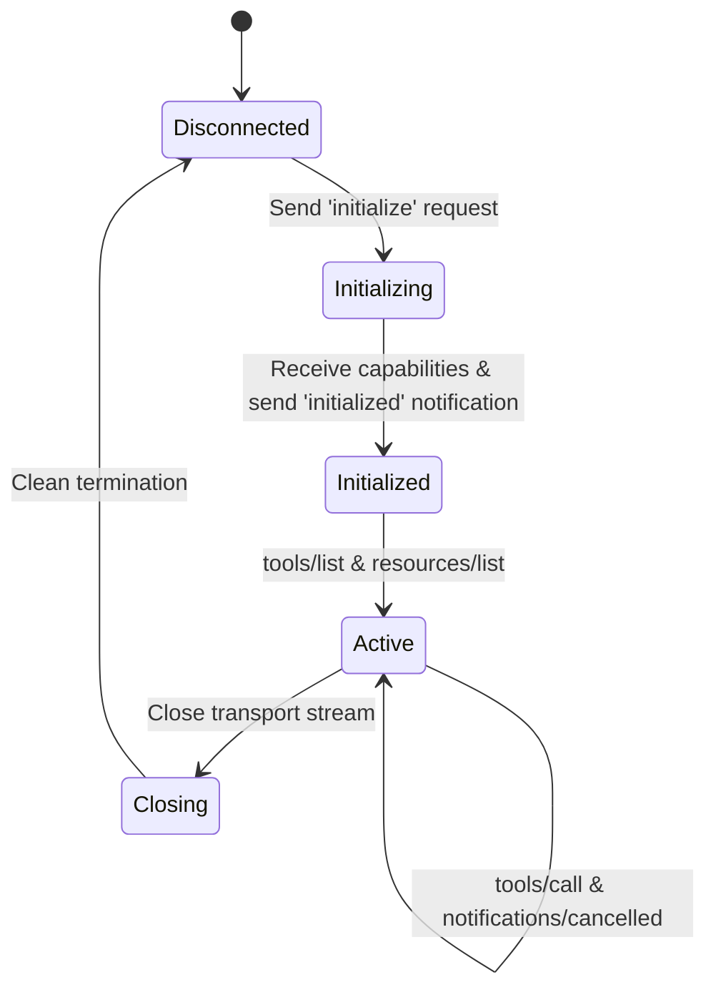

# 📹 The MCP Lifecycle

<div className="video-card" style={{border: '1px solid #30363d', borderRadius: '8px', padding: '16px', marginBottom: '24px', background: 'rgba(56, 139, 253, 0.05)'}}>
  <div style={{display: 'flex', gap: '16px', flexWrap: 'wrap'}}>
    <div><strong>Instructor:</strong> Nitish Singh (CampusX)</div>
    <div><strong>Duration:</strong> 3305</div>
    <div><strong>Course:</strong> Module 5: MCP & Claude Code</div>
    <div><strong>Watch Link:</strong> <a href="https://www.youtube.com/watch?v=sBHeMcxupmE" target="_blank" rel="noopener noreferrer">YouTube Lecture ↗</a></div>
  </div>
</div>

## 📌 Executive Summary

Every Model Context Protocol connection follows a deterministic, stateful lifecycle: Initialization Handshake, Capabilities Negotiation, Active Operation (Tool Invocations, Resource Subscriptions, Notifications), and Graceful Shutdown.

This lesson explores the handshake sequence, protocol ping health checks, handling connection drops, and cleanup routines.

---

## 🏗️ System Architecture & Execution Flow



---

## 📖 Core Concepts & Technical Deep Dive

### 1. The Handshake Protocol
Before any tool can be executed, the client issues an `initialize` request specifying client metadata and supported capabilities. The server replies with server information and its capability flags, concluding with an `initialized` notification.

### 2. Dynamic Notifications & Real-Time Updates
Servers can emit `notifications/tools/list_changed` or `notifications/resources/updated` to notify the client dynamically when tools or data resources change without requiring connection re-establishment.

---

## 💻 Production Implementation

```python
# Lifecycle state monitor blueprint
class MCPLifecycleState:
    DISCONNECTED = "DISCONNECTED"
    INITIALIZING = "INITIALIZING"
    ACTIVE = "ACTIVE"
    CLOSED = "CLOSED"

print("MCP Lifecycle State Monitor initialized.")
```

---

## ⚙️ Production Gotchas & Best Practices

:::tip Dynamic Tool Discovery
Listen for `notifications/tools/list_changed` events on the client side so tools dynamically added on the server appear in the LLM's toolset immediately.
:::

:::warning Graceful Handshake Timeouts
Set an explicit 5-second timeout on the `initialize` handshake. If the server fails to respond, kill the subprocess to avoid hanging the host UI.
:::

---

## 📊 Architectural Reference & Comparison

| Lifecycle Phase | Active Methods | Success Criteria |
| :--- | :--- | :--- |
| **Handshake** | `initialize`, `notifications/initialized` | Both parties agree on protocol version |
| **Operational** | `tools/call`, `resources/read`, `ping` | Reliable request-response matching |
| **Termination** | Transport close (`EOF` / `SIGTERM`) | Clean resource deallocation |

---

## 📚 Key Takeaways & Enterprise Checklist

- [ ] **Architecture Verification:** Ensure your design addresses latency, decoupled interfaces, and strict data validation contracts.
- [ ] **Deterministic Testing:** Run unit tests and golden dataset evaluations before shipping changes to staging or production.
- [ ] **Security & Observability:** Enforce input/output guardrails, scrub sensitive credentials/PII, and capture distributed traces.
- [ ] **Scalability & Sizing:** Calibrate model parameters, context limits, and compute instance requirements against projected request concurrency.
