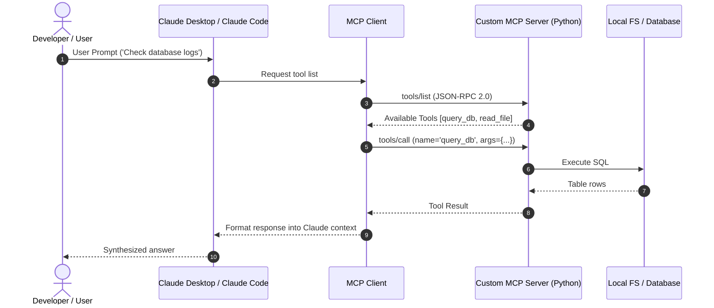

# 📹 The MCP Lifecycle ｜ MCP Trilogy

<div className="video-card" style={{border: '1px solid #30363d', borderRadius: '8px', padding: '16px', marginBottom: '24px', background: 'rgba(56, 139, 253, 0.05)'}}>
  <div style={{display: 'flex', gap: '16px', flexWrap: 'wrap'}}>
    <div><strong>Instructor:</strong> Nitish Singh (CampusX)</div>
    <div><strong>Duration:</strong> 55m 5s</div>
    <div><strong>Playlist:</strong> Model Context Protocol Masterclass (CampusX)</div>
    <div><strong>Watch Link:</strong> <a href="https://www.youtube.com/watch?v=sBHeMcxupmE" target="_blank" rel="noopener noreferrer">YouTube Lecture ↗</a></div>
  </div>
</div>

## 📌 Executive Summary & Learning Objectives

This lecture covers **The MCP Lifecycle ｜ MCP Trilogy**, focusing on production implementations, edge cases, and industry standards:
- Core intuition, architecture, and underlying mechanisms.
- Key differences between theoretical research implementations and scalable enterprise patterns.
- Concrete Python walkthroughs, error recovery, and performance optimization.

---

## 🏗️ Architecture & Conceptual Workflow



---

## 📖 Core Concepts & Technical Deep Dive

### 1. Architectural Foundations
In modern production AI engineering, **The MCP Lifecycle ｜ MCP Trilogy** is essential for ensuring reliability, low latency, and deterministic outcomes. As AI systems evolve from naive prompt-in / completion-out scripts into distributed systems, engineers must handle:
- **State management & consistency:** Ensuring intermediate states and tool invocations are tracked.
- **Error boundaries & recovery:** Graceful degradation when external LLMs or vector stores encounter rate limits or network partitions.
- **Resource utilization & cost efficiency:** Caching common queries and reducing unnecessary foundation model token expenditure.

### 2. Operational Considerations
- **Latency Optimization:** Pre-computing embeddings, utilizing asynchronous non-blocking event loops, and streaming tokens via Server-Sent Events (SSE).
- **Security & Sandboxing:** Validating inputs before ingestion, sanitizing LLM outputs, and isolating tool execution environments.

---

## 💻 Production Implementation Walkthrough

```python
from mcp.server.fastmcp import FastMCP

# Initialize FastMCP Server
mcp = FastMCP("Production AI Tools Server")

@mcp.tool()
def calculate_token_cost(input_tokens: int, output_tokens: int, model: str = "gpt-4o") -> dict:
    """Calculate total API cost given token counts."""
    rates = {
        "gpt-4o": {"input": 2.50 / 1_000_000, "output": 10.00 / 1_000_000},
        "claude-3-5-sonnet": {"input": 3.00 / 1_000_000, "output": 15.00 / 1_000_000},
    }
    rate = rates.get(model, rates["gpt-4o"])
    cost = (input_tokens * rate["input"]) + (output_tokens * rate["output"])
    return {"model": model, "total_cost_usd": round(cost, 6)}

if __name__ == "__main__":
    # Runs stdio transport protocol for Claude Desktop & Claude Code
    mcp.run(transport="stdio")
```

---

## 💡 Production Best Practices & Tips

:::tip Production Deployment Guideline
When deploying The MCP Lifecycle ｜ MCP Trilogy in enterprise environments, always configure automated retries with exponential backoff and telemetry tracing (such as OpenTelemetry or LangSmith).
:::

:::warning Common Failure Modes
Watch out for state contamination across concurrent requests. Ensure each session or user interaction uses an isolated thread ID or execution context.
:::

---

## 🎯 Key Takeaways & Quick Reference

| Dimension | Production Standard | Pitfall to Avoid |
| :--- | :--- | :--- |
| **Execution** | Async / Non-blocking with timeouts | Synchronous blocking calls in event loops |
| **Data Validation** | Strict Pydantic v2 schemas | Untyped dictionary access |
| **Monitoring** | Distributed tracing & latency percentiles | Relying only on standard console logs |

## ⏱️ Lecture Timeline & Key Topics

| Timestamp | Key Topic / Concept Discussed |
| :--- | :--- |
| **00:00:00** | Hi Guys, My name is Nitish and welcome... |
| **00:13:50** | and he shared his implementation info... |
| **00:27:24** | by the client to the server to initialize it.  The... |
| **00:41:38** | initialize.  So in the initialization fuzz... |
| **00:55:03** | in the next video.  Bye.... |


---

---

## 📜 Complete Lecture Transcript (English)

> **Language:** English | **Source:** `04 - The MCP Lifecycle ｜ MCP Trilogy ｜ CampusX.en.srt` | **Total Segments:** 28 | **Word Count:** ~8,948 words

<details>
<summary><b>Click to expand full chronological transcript (28 timestamped intervals)</b></summary>

#### ⏱️ [00:00 ➔ 00:02]

Hi Guys, My name is Nitish and welcome to my YouTube channel.  In this video also we will continue our MCP playlist. So, so far in this playlist we have covered two important things.  First we covered in detail why we need MCP and then we covered the architecture of MCP in great detail in the last video.  In today's video, we are taking this journey forward and I am going to teach you a very important concept which we call the MCP Life Cycle. So basically the architecture that we covered in the last video where I told you things like what is a host?  What is a client?  What is a server?  In today's video, we'll look at how that entire architecture works together. What things are done step by step ?  In what order are these steps done to make sure that the MCP functions properly, we're going to cover all that in today's video. And trust me, when we code in the future, create our own servers, create our own clients, this particular video on MCP life cycle will be very useful to you. Because we will code based on today's things later. Ok?  So, variant video in a nutshell.  Please make sure you watch it end to end.  Ok?  Now let's start the video.  So come on guys, let's start our discussion now.  First of all I will tell you what is MCP life cycle ?  Here I have written a definition. The MCP life cycle describes the complete sequence of steps that govern how a host and a server establish, use, and end a connection during a session.  Ok?  So first of all let us define what this session is. So what happens is that a session is basically one continuous connection between the client and the server.  Ok?  Let me explain it to you through an example.  Suppose your host is Cloud Desktop and you

#### ⏱️ [00:02 ➔ 00:04]

have a server of Ghub and you have connected the server of Ghub with your Cloud Desktop.  So what will happen? What will CLUT Desktop do automatically when you start it? Behind the Scenes will connect to the server with GateB. Ok?  And then until you close your cloud desktop, there is a continuous connection between your cloud desktop and your Gateway server and that connection is what we call a session. Ok?  Now what is the MCP life cycle ?  That the sequence of steps that are followed in this entire session during this entire duration in order to establish use and end the connection is what we call the MCP life cycle. Basically, till now we have read about the architecture of MCP, how it works during a session step by step, that rule book is what we are calling MCP life cycle.  Ok?  I hope this is clear to you.  Now there are three stages in the MCP life cycle.  The first stage is initialization.  The second step is normal operation and the third stage is shutdown.  Initialization is the stage where your host or client tries to connect to your server at the start of a session. Operation is that stage where you are sending user's queries to the server and the server is responding to you and shutdown is that stage where you break your session which is a continuous connection either by closing the host or by closing the desktop or by shutting down the server. Shutting down the server is sometimes not in your control, so mostly shutdown happens when you shut down your host as well as the client, so

#### ⏱️ [00:04 ➔ 00:06]

now we are going to read these three stages in detail. So first of all let me tell you about stage one or fuzz one which is initialization. So what happens in initialization is that your client and server interact for the first time.  In fact, the MCP documentation states that the initialization fuzz must be the first interaction between the client and the server. Ok?  So this is the first interaction.  Now here you do two things during this fuzz. First you check the version compatibility of the MCP between your client and your server. So MCP is a protocol and it is continuously evolving.  Which means that there are different versions of MCP present.  So first of all you check whether your client and your server are on the same protocol version or not.  Because if it is not on the same protocol version, then it is possible that when you do normal communication or call methods, some code may get corrupted.  That's why this is the first thing checked during the initialization fuzz.  And the second thing that's very important is that the client and your server exchange and negotiate capabilities with each other. In simple words, the client tells the server what it can do. Similarly, the server tells the client what it can do. So basically, you can call this entire initialization fuzz a handshake.  Here they are shaking hands and agreeing upon terms about how they will communicate in the future. Ok?  Now we can break down the initialization fuzz into three steps. First comes step number one.  So what happens in step number one is that your client sends an initialize request to the server which

#### ⏱️ [00:06 ➔ 00:08]

looks something like this.  Ok?  Now what you're going to see in this initialize request is that you're calling a method on the server called initialize. Ok?  And here you are sending three important things to the server.  First you are sending your edge n client its protocol version which appears in some date format. Ok?  Second, your client is sending its capabilities of what it can do to the server.  So here we have currently sent two capabilities.  The first is Roots.  Through roots, you give access to the directory of your host system to the server.  Ok?  And the second is sampling, with the help of which if the server ever needs AI, it can get its work done through the host's AI. Again, these are slightly advanced concepts that we will cover next.  For now, just understand that the server, I'm sorry, the client told the server what it could do for the server.  And the third important information is that you as a client send your implementation information.  In this, basically you send what is the name of the client and which version he is currently on. Ok?  So your initialize request looks something like what you have on your screen right now.  So this is step one.  Now what happens in step two is that as soon as this request reaches the server, the server responds in return.  Ok? And in return he again tells these three things to the client.  First of all he tells his protocol version.  Ok?  So this lets both parties know which MCP version they are operating on. Second, here the server is showing its capabilities.  So he told me that I have the capability of tools.  Which means I have some functions that the client can use.  Second, I have some resources that the client can also use. And the third server shares its implementation info,

#### ⏱️ [00:08 ➔ 00:10]

what is its name?  It is a file system server. And on which version does it exist? Ok?  So that's step two of the initialization fuzz.  Now comes the third and final step.  What happens here is that as soon as the whole initialization thing is successful.  Meaning the client's request went to the server and the server's response came to the client.  So now what becomes the responsibility of the client is that it sends a notification back to the server to tell it that the connection is successful and we call this notification initialized notification and it looks something like this. Ok?  Obviously this is a notification so no ID is involved here. This means that the server no longer needs to say anything.  But as soon as we send this notification to the server, the client and server are now connected for this entire session.  And now the client can get any work done as per his wish from the server.  Now in this whole initialization fuzz you have to take care of two things.  Two important rules are there.  First, the client should not send requests other than pings before the server has responded to the initialize request.  This means that in step one when the client is sending the initialize request to the server.  So apart from the initialize request, it cannot send anything else.  He can't call any tool.  Ca n't get a list of tools.  All that is not allowed at this stage.  Yes, one thing it is allowed to do is send a ping request. Now what is a ping request. I'll tell you a little later in this video.  The butt is a very small thing.  So this is a very important rule. What is the second important rule?  That your server will also not serve any kind of request before the initialized notification arrives. Ok?  It says here The server should not send requests other than pings and login before receiving the initialized notification.  The server is not allowed to do anything else until step three is completed.

#### ⏱️ [00:10 ➔ 00:12]

Yes, he can also do two things. One can send pings which I will teach you a little later and can also send login statements.  Basically, if he wants to lock something and tell it to the server, then the server can tell him those things.  So these are two important rules that you have to remember.  The summary of this is that until these three things which we discussed, Step One, Step Two, Step Three are not done, then these two parties are not allowed to exchange any other type of message between themselves. Ok?  Obviously, if any more messages are exchanged then the system may crash. Because there has not been a proper handshake between the two parties yet. Ok?  So I really hope I was able to explain to you the first phase of the MCP life cycle. Now I will do one thing.  I will show you something very interesting.  I will also show you practically whatever we just discussed by running it with the help of CLOT desktop head.  Now guys before showing you the practical, let me explain the setup to you once.  What have I done?  I have already installed Cloud Desktop on my machine. And not only that, I have also installed an MCP server on the cloud desktop.  And my MCP server name is File System. With the help of this MCP server I can talk to files at any location on my machine. I can find out how many files I have on my desktop. I can create a new file on my desktop or any other location. So basically this MCP server helps me to manipulate the file system. Ok?  This particular MCB server is a type of local server.  Basically it is running on my machine.  Ok ?  And obviously the entire communication between the CLOT desktop and the file system which is the MCP server is happening through STDIO.  Ok?  What have I done now ?  I have opened my terminal here on the left right side and

#### ⏱️ [00:12 ➔ 00:14]

I have entered a command there, so whatever logging is happening behind the scenes, whatever logging is being performed by CLOUT Desktop, I will be able to show you those logs here and in those logs only you will see which JSON RPC messages are being exchanged between the client which is CLOUT Desktop and the server which is file system.  Ok?  So right now you may not be able to see anything on the screen in the terminal.  This is a very big command that I have written.  What will happen with its help is that whatever is printed on the terminal will be very beautified and will appear well. Generally what happens is that the output that comes in the terminal shows many things together so it is difficult to understand what is written.  So this entire command that I have written is doing two things.  The first is filtering out certain log messages. Second is beautifying.  Whatever you see, you will understand it well. So now see what I will do?  I'll start up the cloud desktop.  What happens behind the scenes once I start Cloud Desktop ?  Upon startup, Clot will connect to the server containing the desktop file system, and the entire handshake will take place during that connection time.   The initialization fuzz will happen and you'll see all the JSON RPC messages I've discussed with you so far. Ok?  So look what I'm doing.  I'm starting Claude. Ok?  This clot is starting.  You want to focus on the terminal window. Look at this.  Look at this. Now if I look here, you will see the output very clearly. First the client hits a method called initialize on the server.  He told me what his protocol version was? In his capabilities he did not share any capability and he shared his implementation info that my name is Claude AI, this is my version.  Ok?  And I'm talking about JSON RPC2. And this ID is zero of my request.  Now the server

#### ⏱️ [00:14 ➔ 00:16]

sends back to the client that I am on this protocol which is a different protocol by the way.  Ok? So it's a bit of a protocol mismatch happening. I will tell you how to handle this a little later.  But this communication happened.  Then in Capabilities the server told me that I have the Tools capability. I don't even have a prop.  I do n't even have the resources.  And told my implementation info. Its name is Secure File System Server and it is running on version 20.  Again JSON is RPC2.  The ID is exactly the same as the one requested. Ok?  Now look what the client did to the server ?  He quickly hit the notification with an initialized saying without an ID. Ok?  And this completes all our three steps. What you see is the first step.  This is the second step and this is the third step.  Ok?  Now you might be seeing more things after this.  But we will first discuss the theory and then I will tell you.  But I really hope you can see practically how MCP is working.  How the entire life cycle is being triggered.  As soon as I start my client it is trying to connect behind the scenes to the server and exactly the same things are happening that we read in the theory.  Now before we move on to the next phase of the MCP life cycle, I want to have two important discussions with you.  The first is over version negotiation. So if you remember the practical demo I showed you a while ago, I told you that the client is sharing a protocol version with the server where it is telling which version of MCP it is using.  Similarly, the server is also sharing a protocol version. Now if there is a mismatch between these two versions then what happens is what we have to discuss. This is called version negotiation.  So let's take an example.  Here is our client's request where this is the protocol version. This is the protocol version and here is the response from the server which has a different protocol version.  You can see.  Now

#### ⏱️ [00:16 ➔ 00:18]

what happens in this case is that your client goes into its config file and checks which MCP versions it supports and it checks whether this particular version is in its supported list or not.  If it comes then the client will send the notification with the initialized one.  If it does not arrive, the client will disconnect from the server at this point and there will be no further communication between the client and the server. This is called version negotiation.  I hope you understood the concept.  So what happened in our case right now was that the version sent by the server was supported by the client. That is why the connection between the two has been established and further conversation can take place.  I hope this concept is clear to you.  I have one more discussion to do with you and that is what is capability negotiation?  So here I have written client and server capabilities establish which protocol features will be available during the session. So during this entire initialization phase, one very important thing that the client and server do is tell each other what capabilities they have and this is very important for further communication.  The client knows what it can demand from the server.  The server knows what it can demand from the client. So basically the expectation gets set. Ok?  So here I just want to tell you what capabilities exist in the client and the server. So if you talk about the client, then the client majorly provides you three capabilities.  The first is the capability of the routes. Basically what the client does in this is that it gives access to its base directory to the server.  Ok?

#### ⏱️ [00:18 ➔ 00:20]

For example, suppose you are working with cursor ID, then cursor ID is an AI host in which a client is running and you want to connect cursor ID with the server having file system, now what cursor ID will do during this connection is that it will give access of its roots as in the project folder on which you are basically creating the project to the file system. So that in future if ever a user comes and says create a new file then the file system will immediately give him root access since he has access to that base directory and can create new files there or do manipulations there.  The second is the sampling capability. What is the sampling capability, as I told you in the last video, MCP is a bidirectional protocol.  Meaning, here it is not just that the client is sending a request to the server.  Sometimes there are situations where the pay server sends a request to the client.  Sampling is one true scenario.  So what happens in sampling is that your server can ask for some help from the client.  Basically, if the server ever needs to use AI, it can get its work done by speaking to the client. Because the client has its own AI. Ok?  An example of this is that suppose you had told server A to summarize all the documents lying on the server and tell me what the summary is?  Now suppose there are thousands of documents and their summary has to be extracted.  So the server would rather implement its own AI to summarize the documents.  What will he do?   I will tell the client to generate this summary for me. And the client will generate this summary through its AI.  Ok?  So this is a bit of an advanced concept.  We will study further and also see it practically.  This is what butt sampling means.  A third capability is elicitation.  So what happens in elicitation is that your

#### ⏱️ [00:20 ➔ 00:22]

server may demand some incomplete information from the client.  For example, our client is connected to a GH server and my client told the server to fetch the names of all the repositories from my GitHub account. But he did not provide the API to connect to GHub. So in this case the server will understand that incomplete information has come from the client side.  So he will send a message in return that I also need API.  So here the server is making a request to the client for providing some incomplete information.  So this is what we call elicitation. Again, this is a slightly advanced concept. We will discuss this in detail later.  So these are the three major capabilities that the client is offering. If you talk about the server, then the server offers you four main capabilities. We have already discussed three of these.  There is a tool with the help of which you can get any work done from the server.  There is a resource with the help of which you can fetch any static document.  One is called Prapts, with the help of which you understand how to get the work done from the server. Ok?  And what login is, is that through login basically your server is able to send login statements to the client. So suppose you are getting some long running task performed from the server.  Let's say you're getting a booking performed. Ok?  If you are performing booking of any train from the server then now there are multiple stages in booking.  Fill the form , then make the payment, then get the confirmation.  So it's a long running task.  So what will the server do in case of a long running task ?  The client will be periodically notified that the form has been filled.  This login request goes to the client.  The payment has been made. This log is gone.  The client has received the confirmation.  This log is passed

#### ⏱️ [00:22 ➔ 00:24]

to the client.  So basically the login that you have read in Python, that login feature is with the server.  The server can log a basic set of statements and it can send those statements to the client.  Ok?  So this is also an important aspect.  Again we will cover this in the future.  So we have discussed the capabilities. Apart from this, there is one more thing which we all call capabilities.  So in sub capabilities you will see two sub capabilities. One is list changed and the other is subscribed. You also got to see both of these.  I guess you might even remember it.  Look here, when you were communicating, you could not see this place. But I guess you must have seen it in our slide just one second. Look, here I showed you the list changed and subscribed.  What are these two ?  I'll tell you quickly. So the concept of list changed is very simple. A So let's say when you connected to the server, it had five tools. Ok?  Now during the session a new tool has been added to the server.  So what will the server do ?  A notification will be sent to the client saying, look, I have a new tool. So this is what happens when the list changes.  Similarly, he had five resources.  Now another new addition has been made.  So he will send a notification saying, look, a sixth resource has also been added to me. Ok?  So this is a way to tell if something has been added or removed from the server.  Then there is another sub capability called subscribe. With the help of subscription, if there are any changes in any particular resource, then you send notification for it from the server to the client. So suppose you are connected to the GitHub server and in any particular repo of yours, there is a Read Me file which you have listed as a resource on the server, if there are some changes in it, then the notification of those changes will be

#### ⏱️ [00:24 ➔ 00:26]

sent to your client because it is subscribed.  Ok? So all these things are a bit practical. Honestly I am just giving you an overview at this point.  But later when we create our own servers and clients, I will show you how to create these features in this playlist. Ah, then you will understand better what is happening. Ok?  So, this is also a very important thing during the initialization is the negotiation of the fuzz capability.  This sets the expectations and further proper communication takes place between the client and the server.  Now that we are totally in control of the initialization fuzz.  We understood everything.  Now we move to the next stage.  On to the next fuzz, which is Operation Fuzz.  So look what happens here in Operation Fuzz ?  I have written During the Operation Fuzz the client and the server exchange messages according to the negotiated capabilities.  Ok?  Based on the discussions that have taken place so far in the initialization fuzz, you communicate further in the operation fuzz.  Here you have to take care of two things.  First you have to respect the negotiated protocol version. Ok?  You will frame JSON RPC messages according to the protocol version guidelines.  And second, you can only use those capabilities that were successfully negotiated.  I was told that this is my capability.  You will talk about that later.  Ok?  Now this entire operation fuzz, you can divide it into two parts.  The first part is where your client tries to figure out exactly which tools the server is giving it access to. So far what the server has told me is that I support the tools.  I support resources.  I support the PRT.  But we have not received this information exactly yet.   The client has not yet received information about which

#### ⏱️ [00:26 ➔ 00:28]

tools are available within the tools server.  So this is exactly what you do in Capability Discovery. So what the client does here is send a JSON RPC request where it hits this method. Tools slash list when he wants to know about the tools and what tools are available.  When he wants to know about resources, he hits resources slash list. When he wants to know about the props, he hits the prop end point of the prop slash list.  Ok?  And in return a message like this comes from the server that these are the tools that I support - list repos, get file, search code, create issue, list PRs.  Ok?  So, this is the first part of Operation Fuzz.  You actually find out exactly what tools, exactly what resources the server is offering us.  Now what's interesting is that this capability discovery happens automatically.  As soon as your initialization fuzz is over, your client automatically creates and sends this request.  Ok? And that is why if you remember here apart from these three steps which were initialization ones.  Apart from this, a lot of information also came on the screen.  Why did you come?  Now let me tell you.  So what happened here?  The first request was sent by the client to the server to initialize it.  The client had told him about it and then the client had said that it has been initialized.  The connection has been established.  Now look what happened immediately after that?  The client executed three batch requests.  The first tool is with slash list, the second is with prop slash list, the third is with resource slash list and see their IDs, ID one two and three, now see the server is responding to the client saying look, all these tools are available with me, read file, its description, what does it expect in the input, okay, there are some additional properties, what is schema,

#### ⏱️ [00:28 ➔ 00:30]

you will get all that, read multiple files is a tool, write file is a tool, edit file is a tool, create directory is a tool.  List Directory is a tool.  The directory tree is a tool.  In this way, the server is sending complete details of all the tools as these functions available to the server. Ok?  Look here, ID is one.  Meaning it is the response to the first request. Apart from that the server is telling two more things. That is for your second request where you are asking to show the list of props. He is saying method not found.  And generating an error code.  Basically, if you remember, the client had told me in the beginning that I only have the capability of tools. But what Claude did here was that he also asked, tell me which prints are you keeping with you and which resources are you keeping.  So since both these things are not available to the server, it returns a method not found error.  And here also the error of method not found was sent. But what in a nutshell just happened?  We did capability discovery which happened automatically. So you have to remember this initialization gets triggered automatically as soon as the fuzz is finished.  And what will happen is that your client will give this complete list of tools to your host and your host will store it somewhere properly and then in future as soon as any user request comes, it will understand that request and map out which tool from the list of tools available with me is the best to do this task and then it will call that tool which is the second step of operation phase where you do the tool calling. So the user asked you one thing, tell me there is a file on my desktop whose name is hello.py, what is written in it ?  Suppose the user asks this, then there is a request form like this from the client side where you are hitting the tools slash call end

#### ⏱️ [00:30 ➔ 00:32]

point.  You tell it which specific tool you need and send it whatever arguments it needs to do its job and then your client in turn serves that request and extracts the contents of that file for you. Ok?  So I do one thing.  Let me show you how this whole thing happens.  Ok?  So what I will do is I will ask questions to my clot.  A can you tell me what is written in the hello.py file on my desktop which is located on my desktop.  Ok?  Now look, as soon as I press enter, you will see the further communication.  Look, now he is taking permission from me.  At first I did Alav Vance.  Now look what you see here is that the client has hit a tool slash call endpoint to the server and told it that it needs to access the list allowed dictionaries. Ok?  Then it is asking me for permission to use another file with another tool. Look what happened here.  So what happened first was that the client asked the server to first tell me which directories I have permission to access. So the server sent to the client that you can only access the desktop right now.  Now based on this information the client called the read file function and said that I want the content of hello.py on the desktop. Now the server in turn responded to the client that look, this code is written in that file and the same code was displayed to me by Cloud here. Ok?  So this is how

#### ⏱️ [00:32 ➔ 00:34]

the Operation Fuzz carries out.  It is divided into two parts. In the first part you discover capabilities.  What are the exact tools, what are the exact resources, what are the exact points.  And in the second part, you can call any particular tool or resource as per your requirement and the server will respond to you. So this is the normal operation fuzz of the MCP life cycle.  Now let's talk about the last fuzz of the MCP life cycle which is the shutdown fuzz.  And basically what happens in shutdown fuzz is that your session which is running between the client and the server gets terminated.  And there are only two main reasons for termination.  The first is that your client shuts down or your server shuts down.  Ok ?  So look here it is written that generally one side initiates the shutdown and typically that is the client.  The server generally does not shutdown the session.   What is interesting here is that during the shutdown phase your client and server do not exchange any JSON RPC messages with each other.  By now you might have noticed the initialization fuzz and the end operation fuzz. In both phases, the heavy lifting of communication was done through JSON RPC messages. But here in the shutdown fuzz you will not see any JSON RPC messages.  In fact, here the responsibility of causing this entire shutdown lies with the transport layer.  Ok ?  So I told you that there can be two types of servers.  There are local servers that run on your machine.  One is the remote server. Run remotely on another machine.  The transport you use to work with the local server is STDIO.  And the transport used to work with the remote one is http.  So let us do one thing.  Let

#### ⏱️ [00:34 ➔ 00:36]

us see exactly how the transport layer is performing the shutdown in both cases.  Let's talk about STDIO first.  Suppose we are working with a local server.   We're working with the file system and we need to shut down.  So there are two cases. The first is Client Initiated Shutdown.  Let's assume that is what happens generally.  The client said that I have to shut down.  So what will happen in this case is that your client will close the input stream of your server.  Ok? Basically it will close the STD that is present in it. I told you in the last video that what happens in STdio is that your client starts the server as a sub process. Which means the client has control over the server's STD in and STD out, so it will close the input stream from its side and wait for the server to exit.  But suppose if the server does not exit then in this case the client takes the help of the operating system. It sends a low level signal to the operating system which we call sig term. And its full form is signal terminate.  So basically through the signal our client is telling the OS to go and tell the server that it has to shut down. Ok?  Then your client waits for a while.  If the server still does not shut down, your client again sends a low-level signal to the OS, which we call SIG KILL.  Its full form is Signal Kill.  So here he is forcing the OS to go and shut down the server.  Ok?  So the basic difference between sig term and sig kill is that sig term is like you are politely telling the server to pick up his stuff and go. And in Sig Kill you are saying angrily that let's go now.  Ok?  Ok?  So this is the only difference.  And if the server initiated a shutdown, I wrote it wrong here.

#### ⏱️ [00:36 ➔ 00:38]

Client Initiated Shutdown is written only.  But this is a second case.  A Server Initiated Shutdown should occur in this.  Should not happen here.  There should be a pay me here. sometimes happens.  So what happens in that case?  The client closes its output stream.  A server closes its output stream to the client. Ok?  And he exits.  It shuts down by itself.  Ok?  But again this second thing is rare.  Do n't focus so much on this.  What I told you above, this whole thing is more common.  Generally the client controls the shutdown. Servers don't.  Ok?  But here I just wrote that what would have happened if the server had done it ?  Again I have made a mistake here. It should be a server initiated shutdown and should be replaced here.  Ok ?  Now let's talk about how shutdown happens in case of remote servers?  The transport here is HTTP.  So what happens in a Client Initiated Shutdown?  Which is a common case where your client closes the HTTP connection it has open to your server.  Ok?  And if it is a server initiated shutdown, suppose the server which is running remotely somewhere wants to shutdown, then in that case the server closes the HTTP connection from its side and what happens in this case is that the client should be prepared to handle such a dropped connection because if the shutdown has happened from the server side then something went wrong with the server and it has shut down suddenly.   The region could be anything.  There was overloading or something happened.  Because of that the server was shut down and mid process shutdown was done.  So in this case the client should have the capability to handle the shutdown properly.  If there is any running task, close it gracefully and try to reconnect with the server.  Ok?  So there is nothing special here.  The simple point here is that if the client is initiating the shutdown, which is a common thing, it should happen.  So basically, it terminates the post connection that it has created

#### ⏱️ [00:38 ➔ 00:40]

in http.  That's it.  This is the only thing that happens in the HTTP version of the transport layer.  Ok?  So now let me do one thing, let me show you again practically how the shutdown is happening.  So this is our example.  A what I will do is I will not do anything. I will simply close this clot desktop of mine which is open.  Ok?  So as soon as the client is closed, the shutdown will be triggered automatically and you will see it in the logs. Ok?  So what I'll do is I'll simply press my keyboard and it'll turn off.  Ok?  And now look what is written here.  If I can show you properly, look, an event has happened here and what is written in that event?  Server transport closed.  Ok?  And if I can maximize this, there's no meta data there right now.  Ok?  But this message is locked or the server is down. Ok?  And what is worth observing is that you did not see any JSON RPC message during the shutdown process, which I had also told you.  Ok?  So these are the three stages or three phases of MCP life cycle.  What you see in this terminal window is your entire MCP life cycle: initialization, operation, and shutdown.  So, whatever I told you till now in MCP life cycle, it was kind of a regular flow. Generally you will see the same thing.  The matter will start with initialization, then the operations will be performed.  After that there will be a shutdown. But sometimes what happens is that some special cases arise in this entire MCP life cycle.  So I want to discuss those special cases with you. Ok?  So the first special case you'll see is pings.  I

#### ⏱️ [00:40 ➔ 00:42]

talked about this a while ago and I told you that we will discuss it a little further. So now let us discuss what exactly pings are? So here it is written that ping is a lightweight request response method defined in MCP.  Ok?  What is the purpose of ping?  To Check Weather The Other Site Host And Server Is Still Alive And The Connection Is Responsive.  Ok?  So as I said, sometimes it can happen that long running tasks are going on and there is a connection between the client and the server but no message exchange has taken place for a long time.  So what happens in this case?  Periodically one side keeps sending pings to the other side. Ok?  And a ping request looks something like this.  So here it is written Jason version two.  An ID is attached to the ping request.  And the name of the method is ping.  Now the interesting thing is that this particular request can be made by the client to the server and the server can also make it to the client. Both ways are possible.  And whenever one party sends a ping request to the other party, there should be a response from the other party which looks something like a response came on the same request ID.  The result is empty.  Because this is a ping request.  Ok?  So this is what the ping request response methods do. Now let's talk about when ping is useful?  In what scenarios should you use ping?  So it's useful for checking if the other side is up before full initialize.  So in the initialization fuzz when you are trying to establish a connection with the other party then in that case you can send a ping request. The server can send it, the client can also send it. In fact, it also sends it.  And second is if the server is performing a long running task and there has been no communication

#### ⏱️ [00:42 ➔ 00:44]

between the client and the server for a long time then what the client can do is send periodic pings.  The advantage of this is that the connection between the client and the server does not drop silently. Sometimes what happens is that if there is no active communication going on between these two parties, then your operating system or proxy or firewall feels that this connection is not required and it gets closed.  What happens by sending a pink is that your OS or proxy thinks that active communication is going on here.  Let this line continue.  So that 's Pink's job.  The next special case is error handling.  So obviously it will not always happen that your client will send a request and that request will be correct and in return the correct response will also come from the server. Sometimes something might go wrong. So how does MCP handle this kind of mess ?  We will study the same in error handling. Ok?  It is written here that error handling in MCP is how the host and server signal that something went wrong with a request.  Ok?  Now the error handling in MCP is basically done in the same way as error handling is done in JSON RPC. In fact, MCP has inherited the entire standard error object from JSON RPC. So the error codes that you would get in JSON RPC in any other distributed system, you will see the same in MCP.  Ok? First of all let us discuss where errors can occur? In what scenarios can you see errors ?  So the first error you will see is in the initialization fuzz.  If the protocol versions between the two parties mismatch, then you will have to handle an error there.  The second scenario is that you are making a call to a method that the server never specified.  Did not negotiate at all.  Third scenario could be that you are calling a particular tool and you are passing invalid arguments.

#### ⏱️ [00:44 ➔ 00:46]

Fourth scenario: There may be some problem with the server.  Meaning basically the server went down.  So there is some internal server failure while processing the request. Fifth One is timed out.  So what happens is that the concept of timeout is that the client sends a request to the server.  But the client has already decided that I will wait only for this much time for the response to come.  If it takes more time than that then it times out and then you have to handle the error there. Now we will read about time out after some time.  And the last scenario is that the JSON RPC message you sent from the client or the server has a syntax problem or is not properly formatted in some way.  There was some problem in it.  There was a syntactical issue. Ok?  So these are the scenarios.  Sum of the Scenarios Most Common Scenarios. Apart from this, there can be other scenarios also.  Now let me show you what the standard error object structure of JSON RPC MCP looks like. So a typical error object would look like this in MCP. So json will be the RPC version.  It will be against any particular request.  There will be a dictionary of error words in which you will see three things.  The first will be the code.  This code will tell you what kind of error you made. Then the second thing will be message.  This will tell the other party what mistake has been made. And thirdly, you get some optional information which helps you in debugging. So you will see the standard error object like this. In fact, if you remember, when we connected to the server with the file system, our client asked us, tell me which scripts do you have ?  So what we see when we turn around is that this is an error object. Ok?  Method Not Found was the message. This was the code.  There was no data in it. Because it is optional.  Ok?  But this is how

#### ⏱️ [00:46 ➔ 00:48]

an error object structure looks like.  Ok?   Let me tell you some common error codes. Like this one you might be seeing -32601 this is a standard code.  Like in HTTP, there is 404 Not Found, 500 Server Failure.  Similarly, here are the standard error codes for JSON RPC. Here is the list.  You can see this by pausing the video. -32601 means method not found.  Exactly what we saw here.  Ok?  Aa, I have also given the scenario here.  602 means that you passed invalid parameters to the tool. He needed the file.  You sent the path. 600 means invalid request.  Ok?  This means that the method you are hitting does not exist. 700 means that your request body is not a valid JSON and if you are seeing anything above 32,000 then it could be authentication failure, rate limit exceeded, quota error, internal issues or anything else.  Ok?  So these are your standard error codes.  You do n't need to remember too much, though. But you should have a rough idea about some common error codes and after reading the description you will understand the rest.  The next special case scenario is time out.  The concept of time out is very simple.  Suppose your client sent a request to the server but your server is taking too much time to respond.  Now what is the problem in this situation that your user will remain seated.  I will keep waiting which is not a good thing.  So what you can do here is define a threshold.  You can define a time out that after this much time you do not have to wait.  The request has to be cancelled. This is called time out. Look here it is written time out is about ensuring the request does not hang forever. Ok?  What is the purpose?  The first purpose is that you want to avoid unresponsive or overloaded

#### ⏱️ [00:48 ➔ 00:50]

servers.  So suppose you are dealing with a remote server which has a lot of clients connected to it and it has to handle a lot of clients, then it may happen that the server is taking a lot of time to handle your request, then you will not wait forever, you will cancel your request and inform the user, secondly, whatever resources are being used to continue the request, whatever memory CPU utilization is there, you do not want to hold it infinitely, you will free it. As soon as you know that I am not going to respond.  And the third, ah, very important thing is that you will be able to give feedback to your users that something has gone wrong. Otherwise, the poor guy will keep waiting for hours for a response.  So this is the main purpose of time out.  How exactly does Time Out work step by step?   Let me tell you.  So what happens is that when you build a client, write the client code, you will use an MCP SDK. Now the MCP SDK gives you the feature to set a timeout on a request basis inside your client. For example, suppose you set a timeout of 30 seconds for a particular request.  What did you do now?  You sent a request from the client to the server and the server took more than 30 seconds to respond back.  So what will happen with this?  The client will trigger a timeout. Ok?  Now what will happen as soon as the timeout is triggered is that behind the scenes the client will send a cancellation notification to the server and will tell it to stop whatever request it has sent last.  I do n't want his answer.  And in response to this, your server will stop processing the request and will not give any reply in return. Ok?  So this is how step by step time out works.   Let me quickly show you what the

#### ⏱️ [00:50 ➔ 00:52]

cancellation notification looks like. So let's say your client sent this particular request.  The request is to scan all the files in the entire code base and tell in which files the term MCP appears.  Ok?  Obviously, if there was a very large code base, then it would be taking a lot of time for the server to answer this query. So it's been a long time.  The timeout duration has been exceeded.  The threshold has been crossed.  So what can the client do now ?  One can send a notification like this. This is how the cancellation notification looks like.  So here it is written JSON RPC two method name is notifications slash cancelled and request ID in parameters is seven.  The request ID is seven because the request that the client sent a while ago had an ID of seven.  And you also tell the reason that the time out has passed.  It's been more than 30 seconds.  So this is how time outs work.  The final special case scenario is progress notification.  So sometimes what happens is that your client gives some long running task to your server and it would be good if in that long running task your server keeps telling the client periodically how much progress has been made so far. For example, suppose you have connected to Ghub server and you have said that this is my repository. Scan all its files and tell which files have security vulnerability.  Ok ?  So this is a long running task. You are going and checking all the files in your code base. Right?  So it would be nice if I was told that so far I have tracked 200 out of 400 files. 250 out of 400 files have been tracked. 300 out of 400 files have been tracked. So with this the user will know how much time will be taken finally and how much work has been done so far. This is the advantage of progress notification.  Ok?  So look here

#### ⏱️ [00:52 ➔ 00:54]

I have written that the purpose of progress notification is to let the client know that a long running request is still making progress.  Ok?  So what happens?  The whole process is that when the client requests to go and scan all the files in his repo, then you add a progress token in the meta data of the request.  Ok?  And then what happens?  The server keeps sending progress notifications on that progress token. Ok?  So this whole scenario looks something like this.  This is your client.  He sent a request that you scan this particular repository using the search code function. Ok ?  But at the same time we sent a progress token in the meta data.  The name of the token can be anything.  There is token intake here.  Ok ?  Now the server understood that I had to keep giving constant updates about how much work had been done so far.  So what will he do? He will hit a notification notification slush progress.  Obviously this is a notification so we don't need an ID.  But he has to show progress against this particular progress token. So he will tell the progress token in his parameters. Progress will tell me that out of 100 I am currently at 60.  And a message can also be sent that searching 600 out of 1000 files.  So basically I have done 60% of the work out of 100% and this notification will be received by the client.   The client will display this notification to the user in a well- formed manner.  So the user will have real time feedback on how much progress his work has made so far. If I give you an example of this, I don't know exactly whether MCP is being used behind the scenes or not.  But if you have ever used Research Assistant in Chart GPT or any other chat bot, then after you enter a query,

#### ⏱️ [00:54 ➔ 00:55]

you see a progress bar showing that so much research has been done and so much is left. So from this you get an idea as a user that how much longer do I have to wait. So this is just for a better user experience.  Ok?  Otherwise the work is already happening behind the scenes.  But because of this progress notification you are getting much better feedback as a user.  Ok ?  So, these are some special cases I had to tell you about and this MCP life cycle I had to teach you.  I covered all of this throughout this video.  I really hope I was able to simplify things for you.  And now I feel like we're ready to actually code something in MCP. Read a lot.  We read Y, read the architecture, read the MCP life cycle.  Now what will we do with the next video?   Will jump into practical things.  Ok?  We will build our own servers.  MCP Servers We will create our own MCP clients. So that part we're going to explore a little bit now. If you liked today's video, please like it. If you have not subscribed to the channel , please do subscribe.  See you in the next video.  Bye.

</details>
