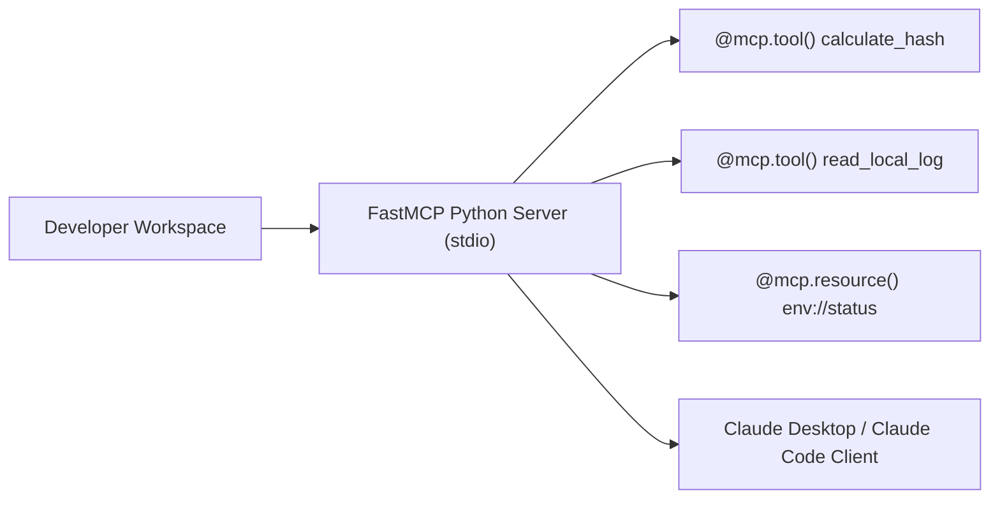

# 📹 How to Build Local MCP Servers

<div className="video-card" style={{border: '1px solid #30363d', borderRadius: '8px', padding: '16px', marginBottom: '24px', background: 'rgba(56, 139, 253, 0.05)'}}>
  <div style={{display: 'flex', gap: '16px', flexWrap: 'wrap'}}>
    <div><strong>Instructor:</strong> Nitish Singh (CampusX)</div>
    <div><strong>Duration:</strong> 4331</div>
    <div><strong>Course:</strong> Module 5: MCP & Claude Code</div>
    <div><strong>Watch Link:</strong> <a href="https://www.youtube.com/watch?v=tc2oOznpdE0" target="_blank" rel="noopener noreferrer">YouTube Lecture ↗</a></div>
  </div>
</div>

## 📌 Executive Summary

Building local MCP servers allows developers to expose local databases, file trees, Git repositories, and development utilities directly to Claude Desktop and Claude Code. The official `FastMCP` Python library simplifies server creation using intuitive Python decorators.

This guide explores setting up a local FastMCP server, defining tools with `@mcp.tool()`, defining readable resources with `@mcp.resource()`, and debugging over stdio.

---

## 🏗️ System Architecture & Execution Flow



---

## 📖 Core Concepts & Technical Deep Dive

### 1. FastMCP Decorator Ergonomics
FastMCP inspects Python type annotations and docstrings automatically to generate JSON Schema definitions:
- `@mcp.tool()`: Exposes a callable tool. The docstring becomes the tool description.
- `@mcp.resource("uri://...")`: Exposes a readable URI resource.
- `@mcp.prompt()`: Exposes a parameterized prompt template.

### 2. Testing Stdio Servers with the MCP Inspector
Debugging stdio servers can be challenging because standard print statements corrupt the JSON-RPC wire protocol. Anthropic provides the `@modelcontextprotocol/inspector` web utility to test tools interactively:
`npx @modelcontextprotocol/inspector python server.py`

---

## 💻 Production Implementation

```python
from mcp.server.fastmcp import FastMCP
import os

# Create an enterprise local tool server
mcp = FastMCP("Local Developer Toolkit")

@mcp.tool()
def count_lines_in_file(filepath: str) -> str:
    """Count total lines of code in a specified project file."""
    if not os.path.exists(filepath):
        return f"Error: File '{filepath}' does not exist."
    with open(filepath, "r", encoding="utf-8", errors="ignore") as f:
        count = sum(1 for _ in f)
    return f"File '{filepath}' contains {count} lines."

@mcp.resource("system://disk-usage")
def get_disk_usage() -> str:
    """Return free disk space on root volume."""
    import shutil
    total, used, free = shutil.disk_usage("/")
    return f"Total: {total // (2**30)}GB | Free: {free // (2**30)}GB"

if __name__ == "__main__":
    mcp.run(transport="stdio")
```

---

## ⚙️ Production Gotchas & Best Practices

:::tip Never Use print() in Stdio Servers
Writing raw `print()` statements in a stdio server corrupts the standard output stream used for JSON-RPC messages. Always log to standard error (`sys.stderr`) or use Python's `logging` module.
:::

:::warning Path Sandboxing
Always validate that file paths are constrained to your designated workspace directory to prevent arbitrary file reading across the host system.
:::

---

## 📊 Architectural Reference & Comparison

| Decorator | Input Type | Output Type | Primary Use Case |
| :--- | :--- | :--- | :--- |
| `@mcp.tool()` | Function with typed args | String / Dict | Executing actions, calculations, APIs |
| `@mcp.resource()` | URI pattern string | String / Binary | Providing read-only reference data |
| `@mcp.prompt()` | Template arguments | Formatted Prompt | Standardized multi-step prompts |

---

## 📚 Key Takeaways & Enterprise Checklist

- [ ] **Architecture Verification:** Ensure your design addresses latency, decoupled interfaces, and strict data validation contracts.
- [ ] **Deterministic Testing:** Run unit tests and golden dataset evaluations before shipping changes to staging or production.
- [ ] **Security & Observability:** Enforce input/output guardrails, scrub sensitive credentials/PII, and capture distributed traces.
- [ ] **Scalability & Sizing:** Calibrate model parameters, context limits, and compute instance requirements against projected request concurrency.
