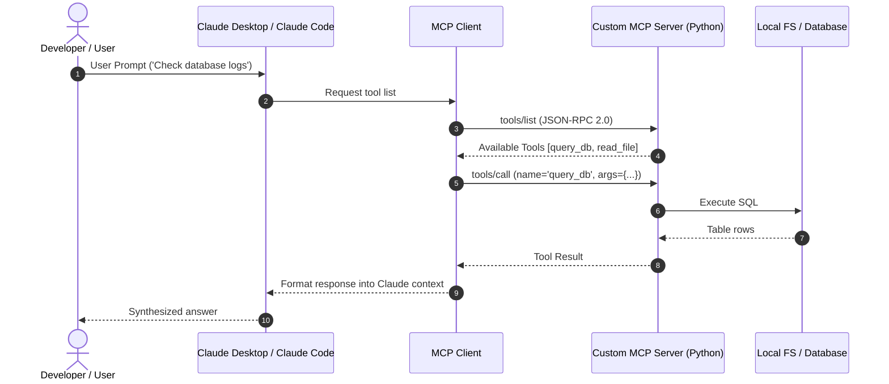

# 📹 How to Build Local MCP Servers ｜ MCP Trilogy

<div className="video-card" style={{border: '1px solid #30363d', borderRadius: '8px', padding: '16px', marginBottom: '24px', background: 'rgba(56, 139, 253, 0.05)'}}>
  <div style={{display: 'flex', gap: '16px', flexWrap: 'wrap'}}>
    <div><strong>Instructor:</strong> Nitish Singh (CampusX)</div>
    <div><strong>Duration:</strong> 72m 11s</div>
    <div><strong>Playlist:</strong> Model Context Protocol Masterclass (CampusX)</div>
    <div><strong>Watch Link:</strong> <a href="https://www.youtube.com/watch?v=tc2oOznpdE0" target="_blank" rel="noopener noreferrer">YouTube Lecture ↗</a></div>
  </div>
</div>

## 📌 Executive Summary & Learning Objectives

This lecture covers **How to Build Local MCP Servers ｜ MCP Trilogy**, focusing on production implementations, edge cases, and industry standards:
- Core intuition, architecture, and underlying mechanisms.
- Key differences between theoretical research implementations and scalable enterprise patterns.
- Concrete Python walkthroughs, error recovery, and performance optimization.

---

## 🏗️ Architecture & Conceptual Workflow



---

## 📖 Core Concepts & Technical Deep Dive

### 1. Architectural Foundations
In modern production AI engineering, **How to Build Local MCP Servers ｜ MCP Trilogy** is essential for ensuring reliability, low latency, and deterministic outcomes. As AI systems evolve from naive prompt-in / completion-out scripts into distributed systems, engineers must handle:
- **State management & consistency:** Ensuring intermediate states and tool invocations are tracked.
- **Error boundaries & recovery:** Graceful degradation when external LLMs or vector stores encounter rate limits or network partitions.
- **Resource utilization & cost efficiency:** Caching common queries and reducing unnecessary foundation model token expenditure.

### 2. Operational Considerations
- **Latency Optimization:** Pre-computing embeddings, utilizing asynchronous non-blocking event loops, and streaming tokens via Server-Sent Events (SSE).
- **Security & Sandboxing:** Validating inputs before ingestion, sanitizing LLM outputs, and isolating tool execution environments.

---

## 💻 Production Implementation Walkthrough

```python
from mcp.server.fastmcp import FastMCP

# Initialize FastMCP Server
mcp = FastMCP("Production AI Tools Server")

@mcp.tool()
def calculate_token_cost(input_tokens: int, output_tokens: int, model: str = "gpt-4o") -> dict:
    """Calculate total API cost given token counts."""
    rates = {
        "gpt-4o": {"input": 2.50 / 1_000_000, "output": 10.00 / 1_000_000},
        "claude-3-5-sonnet": {"input": 3.00 / 1_000_000, "output": 15.00 / 1_000_000},
    }
    rate = rates.get(model, rates["gpt-4o"])
    cost = (input_tokens * rate["input"]) + (output_tokens * rate["output"])
    return {"model": model, "total_cost_usd": round(cost, 6)}

if __name__ == "__main__":
    # Runs stdio transport protocol for Claude Desktop & Claude Code
    mcp.run(transport="stdio")
```

---

## 💡 Production Best Practices & Tips

:::tip Production Deployment Guideline
When deploying How to Build Local MCP Servers ｜ MCP Trilogy in enterprise environments, always configure automated retries with exponential backoff and telemetry tracing (such as OpenTelemetry or LangSmith).
:::

:::warning Common Failure Modes
Watch out for state contamination across concurrent requests. Ensure each session or user interaction uses an isolated thread ID or execution context.
:::

---

## 🎯 Key Takeaways & Quick Reference

| Dimension | Production Standard | Pitfall to Avoid |
| :--- | :--- | :--- |
| **Execution** | Async / Non-blocking with timeouts | Synchronous blocking calls in event loops |
| **Data Validation** | Strict Pydantic v2 schemas | Untyped dictionary access |
| **Monitoring** | Distributed tracing & latency percentiles | Relying only on standard console logs |

## ⏱️ Lecture Timeline & Key Topics

| Timestamp | Key Topic / Concept Discussed |
| :--- | :--- |
| **00:00:00** | हाय गाइस, माय नेम इज नितेश एंड यू वेलकम... |
| **00:17:54** | एसडीके है एटलीस्ट उसका जो शुरू वाला... |
| **00:35:30** | योर सर्वर विद क्लॉट डेस्कटॉप। तो इसके... |
| **00:53:55** | जितना भी खर्चा हुआ है अक्रॉस ऑल कैटेगरीज... |
| **01:12:09** | में।... |


---

---

## 📜 Complete Lecture Transcript (Hindi / Hinglish)

> **Language:** Hindi / Hinglish | **Source:** `06 - How to Build Local MCP Servers ｜ MCP Trilogy ｜ CampusX.hi.srt` | **Total Segments:** 37 | **Word Count:** ~11,454 words

<details>
<summary><b>Click to expand full chronological transcript (37 timestamped intervals)</b></summary>

#### ⏱️ [00:00 ➔ 00:02]

हाय गाइस, माय नेम इज नितेश एंड यू वेलकम टू माय YouTube चैनल। इस वीडियो में भी हम लोग अपना एमसीपी प्लेलिस्ट कंटिन्यू करेंगे। वीडियो को स्टार्ट करने के पहले आई वुड गिव यू अ क्विक रिककैप कि अभी तक हमने इस प्लेलिस्ट में क्या-क्या कवर किया है। सो मैंने स्ट्रक्चरली इस पूरे के पूरे प्लेलिस्ट को तीन पार्ट्स में डिवाइड किया था। फर्स्ट पार्ट वाज़ व्हाई, देन व्हाट, एंड देन हाउ। और इन तीनों के पहले मैंने आपको एक ट्रेलर दिखाया था। जहां पर मैंने आपको एक न्यूज़ लेटर क्रिएशन प्रोसेस को ऑटोमेट करके दिखाया था विद द हेल्प ऑफ एमसीपी। ठीक है? जस्ट टू इंस्पायर यू कि क्यों आपको एमसीपी पढ़ना चाहिए। उसके बाद हमने व्हाई वाले वीडियो में बहुत डिटेल में कवर किया था कि व्हाई शुड वी स्टडी एमसीपी? पुरानी चीजों के ऊपर ऐसा क्या इंप्रूवमेंट ले एमसीपी आ रहा है कि आपको एमसीपी पढ़ना चाहिए। फिर व्हाट को मैंने दो पार्ट्स में कवर किया था। फर्स्ट हमने पढ़ा था एमसीपी का आर्किटेक्चर और फिर हमने पढ़ा था एमसीपी लाइफ साइकिल। और फिर मैंने आपको बताया था कि हाउ मैं तीन पार्ट्स में कवर करूंगा। एक्चुअली तीन से चार पार्ट हो गए। मैं आपको बताता हूं कैसे। फर्स्ट जो लास्ट वीडियो आपने देखा वहां पर मैंने आपको प्रैक्टिकली एमसीपी का एक फ्लेवर दिया। बट वहां पर हमने खुद के ना तो सर्वर्स बनाए ना तो क्लाइंट्स बनाए। हमने रेडीमेड सर्वर्स यूज़ किए। जैसे कि Google ड्राइve का सर्वर और हमने क्लाइंट के लिए क्लाउड डेस्कटॉप यूज़ किया। ठीक है? बट मैंने आपको बताया था कि अब अगले एक-द वीडियोस में मैं आपको खुद के एमसीपी क्लाइंट्स और एमसीपी सर्वर्स बना के दिखाऊंगा। ठीक है? तो आज का जो वीडियो है उसमें मेरा गोल है कि मैं आपको खुद के सर्वर्स बनाना सिखाऊं। खुद के एमसीपी सर्वर्स। अब इसमें भी एक्चुअली हमें दो

#### ⏱️ [00:02 ➔ 00:04]

वीडियोस लगेंगे। आज के वीडियो में हम सिर्फ और सिर्फ लोकल सर्वर्स बनाना सीखेंगे। और नेक्स्ट जो वीडियो होगा वहां पर हम रिमोट सर्वर्स बनाना सीखेंगे। ठीक है? जहां पर हम एक सर्वर को बना के उसको रिमोटली कहीं पे होस्ट करेंगे और फिर उस सर्वर को कोई भी एक्सेस कर पाएगा। ठीक है? और हाउ में फिर एक और पार्ट आएगा हाउ टू बिल्ड योर ओन एमसीपी क्लाइंट्स। होपफुली यह एक सिंगल वीडियो में कवर हो जाएगा। ठीक है? तो इन शॉर्ट इतने वीडियोस अभी तक हमने इस प्लेलिस्ट में डाले हैं। 1 2 3 4 दिस वास द फिफ्थ आई गेस आज का वीडियो इज द सिक्स्थ वन और कुछ और एडवांस कांसेप्ट्स हम लोग यहां पे कवर करने की कोशिश करेंगे जब मैं ये सारे वीडियोस बना लूंगा। ठीक है? बट या ये एक हाई लेवल मैप है या ओवरव्यू है कि इस प्लेलिस्ट में हमें क्या-क्या करना है और अभी तक हमने क्या-क्या किया। ठीक है? तो अब ज़ूम इन करते हैं आज के वीडियो के ऊपर जहां पे हमारा गोल है कि हम खुद का एक लोकल एमसीपी सर्वर बनाएं। ठीक है? अब इस वीडियो में मैं सोच रहा था कि मैं आपको किस तरह का एमसीपी सर्वर बना के दिखाऊं। अ सो जनरली मैंने YouTube पे जो देखा है वो ऐसा था कि या तो लोगों ने बहुत सिंपल एमसीपी सर्वर्स बनाए हैं जैसे कि कैलकुलेटर टूल टाइप का सर्वर या फिर आपको थोड़े एडवांस्ड टाइप के सर्वर्स देखने को मिलेंगे। ठीक है? अ सिंस हम पहली बार बना रहे हैं तो हम ना बहुत सिंपल अप्रोच लेंगे ना बहुत एडवांस अप्रोच लेंगे। हम एक इंटरमीडिएट लेवल का एमसीपी सर्वर बनाएंगे जिसका डिफिकल्टी लेवल इंटरमीडिएट होगा बट वो यूज़फुल होगा। ठीक है? अ सो व्हाट वी आर गोइंग टू डू इज़ कि हम एक एक्सपेंस

#### ⏱️ [00:04 ➔ 00:06]

ट्रैकर एमसीपी सर्वर बनाएंगे। सो बेसिक आईडिया यह है इस एमसीपी सर्वर का कि आप अपने चैटबॉट जैसे कि क्लॉट डेस्कटॉप से बात करके इस एक्सपेंस ट्रैकर को मैनेज कर सकते हो। आप सिंपली हाई लेवल इंग्लिश में लिख दोगे कि यार आज मैंने मिल्क खरीदा है ₹20 का। इसको ऐड कर देना और वह जाकर के डेटाबेस में एंट्री कर देगा। सो दैट आप दो दिन बाद आके यह पूछ पाओ कि बताओ लास्ट 7 दिनों में मैंने टोटल कितना खर्चा किया या फिर आप यह पूछ पाओ कि इस महीने मेरा एंटरटेनमेंट पे कितना खर्चा हुआ है? तो बेसिकली अभी तक एक्सपेंस ट्रैकिंग जो की जाती है वो एप्स के थ्रू की जाती है। आपको बहुत फॉर्म्स वगैरह फिल करके एक्सपेंसेस डालने होते हैं और फिर वहां पे आप इस तरह के नेचुरल क्वेश्चंस तो नहीं पूछ सकते हो। आप ग्राफ्स वगैरह के थ्रू समझते हो कि आपका खर्चा कितना रहा है। यहां पर हम उस पूरे प्रोसेस को नेचुरल लैंग्वेज के थ्रू करेंगे। बिकॉज़ हमारे पास एलएलएम की पावर है। ठीक है? इतना समझाने में एक्चुअली इतना मजा नहीं आ रहा। मैं एक काम करता हूं। पहले आपको एक डेमो दिखाता हूं। बिकॉज़ ये एमसीपी सर्वर मैंने बहुत पहले ही बना लिया था। और मैं खुद पर्सनली भी इसको यूज़ कर रहा हूं। तो मैं आपको एक बार दिखाता हूं कि यह काम कैसे करता है। फिर आई होप आपको अच्छा लगेगा और फिर हम इस वीडियो में यह पर्टिकुलर एमसीपी सर्वर बनाना सीखेंगे। सो गाइस डेमो के लिए मैंने क्लॉड डेस्कटॉप ओपन कर लिया है। बिकॉज़ मैंने जो एक्सपेंस ट्रैकर एमसीपी सर्वर बनाया है उसको मैंने क्लॉड के साथ ही इंटीग्रेट कर रखा है। इनफैक्ट मैं आपको दिखा भी सकता हूं। यहां पे ये आइकॉन है। यहां पे अगर आप देखो तो ये एक्सपेंस ट्रैकर एमसीपी सर्वर इंटीग्रेटेड है। ठीक है? तो अब मैं क्या करता हूं? मैं आपको कुछ क्वेरीज़ रन करके दिखाता हूं। इनफैक्ट मैंने यहां पे कुछ सैंपल क्वेरीज़ भी लिख रखी हैं। मैं एग्जैक्टली इनको चला के दिखाऊंगा। ठीक है? तो सबसे पहले मैं आपको दिखाता हूं कि कैसे आप एक नया एक्सपेंस ऐड कर सकते हो डेटाबेस में। ठीक है? तो यहां पे जैसे एग्जांपल है कि ऐड 500 ट्रैवल

#### ⏱️ [00:06 ➔ 00:08]

एक्सपेंस फॉर कैब राइट यस्टरडे। ठीक है? काफी ओपन एंडेड है। हम एकदम नेचुरल लैंग्वेज में बता रहे हैं। और बिहाइंड द सीन्स आप देखोगे कि क्लॉड हमारे लिए ये एक्सपेंस हमारे डेटाबेस में ऐड कर देगा। देखो वो ऑलरेडी कर भी रहा है। सो अमाउंट हो गया 500। कैटेगरी उसने खुद से डिड्यूस कर लिया और एक नोट ऐड कर दिया। डेट उसने समझ लिया कि यस्टरडे मतलब ये है। ठीक है? और उसने एक्सपेंस ऐड कर दिया। अब मैं आपको दिखाता हूं कि हम एक्सपेंस देख कैसे सकते हैं। सो लेट्स से मुझे देखना है कि मैंने सेप्टेंबर में कितना खर्चा किया है। सो व्हाट आई विल डू इज़ आई विल सिंपली कॉपी दिस एंड आई विल पेस्ट इट हियर। मैं बेसिकली बोल रहा हूं कि शो मी ऑल एक्सपेंसेस फ्रॉम सेप्टेंबर। यहां पे हम थोड़ा सा इसको और ब्यूटीफाई कर सकते हैं बाय सेइंग इन टेबुलर फैशन। ठीक है? अब वो एक्सपेंस सारे रिट्रीव कर रहा है। उसने खुद से एक स्टार्ट डेट और एंड डेट समझ लिया। हमने सितंबर बोला तो स्टार्ट डेट हो गया फर्स्ट सितंबर और एंड डेट हो गया 38 सितंबर। और यह देखो यू कैन सी टोटल सिक्स एक्सपेंसेस 16,000 और ये रहा पूरा का पूरा टेबल। ठीक है? हम लोग थोड़े और डिफिकल्ट क्वेरीज भी पूछ सकते हैं। जैसे हम समराइज करवा सकते हैं कोई चीज। जैसे कि मुझे समराइज करवाना है कि मैंने अगस्त में टोटल कितना खर्चा किया। अ लेट्स से किसी पर्टिकुलर कैटेगरी में मुझे निकलवाना है। मान लो कैटेगरी है हेल्थ ऑन हेल्थ एंटर। देखो कैटेगरी हेल्थ डिसाइड हो गई। स्टार्ट डेट एंड डेट हो गया। यह अगस्त का डेट है। ठीक है? तो यह कह रहा है कि यू डिडंट स्पेंड एनीथिंग ऑन हेल्थ एक्सपेंसेस इन

#### ⏱️ [00:08 ➔ 00:10]

अगस्त फॉर कंपैरिजन इन सितंबर यू स्पेंट 870 ऑन हेल्थ। ठीक है? तो वो मुझे बता पा रहा है। एक लास्ट क्वेरी और देखते हैं। इस महीने हमारा ट्रैवल पे कितना खर्चा रहा है? ठीक है? अलऊ वंस। यह देखो ₹500 ट्रैवल पर खर्चा हुआ है। ठीक है? यहां पर उसने अपना कुछ-कुछ फीडबैक भी दिया है। आई नोटिस यू हैव सम ट्रांसपोर्ट रिलेटेड एक्सपेंस कैटेगराइज्ड इन द ट्रांसपोर्ट एंड ट्रांसपोर्टेशन टोटलिंग 2610 फॉर द मंथ व्हिच इंक्लूड्स कैब। बेसिकली दो अलग कैटेगरीज क्रिएट हो रखी हैं। यह क्यों हुआ? मैं आपको थोड़ी देर बाद वीडियो में बताऊंगा। बट यू गेट द आईडिया। मैं पर्सनली हमेशा एक्सपेंस ट्रैकिंग के साथ बहुत स्ट्रगल करता हूं। बिकॉज़ मुझे वो बहुत कंबरसम लगता है। एक ऐप ओपन करना और फिर वहां पे फॉर्म में सब कुछ फिल करना। तो ये पर्टिकुलर एमसीपी सर्वर मुझे पर्सनली बहुत यूज़फुल लगता है। बिकॉज़ मैं दिन भर बात कर रहा होता हूं चैट जीपीटी या क्लॉट के साथ। यहां पे व्हाट आई कैन डू इज़ आई कैन सिंपली राइट अ सेंटेंस। अपने एक्सपेंसेस में ऐड कर दूंगा। एंड जब मुझे जो भी चाहिए होगा जिस तरह का भी एनालिसिस चाहिए होगा मैं बहुत आसानी से निकाल सकता हूं। तो ये एक बहुत यूज़फुल एमसीपी सर्वर हो सकता है आपकी पर्सनल लाइफ के अंदर। तो आज की वीडियो में हम एग्जैक्टली यही बनाने वाले हैं। ठीक है? आई रियली होप यू आर एक्साइटेड फॉर दिस। अब गाइस इस सर्वर को बनाने के पहले मैं आपके साथ हमारा जो प्लान ऑफ एक्शन रहने वाला है, उसको डिस्कस करना चाहता हूं कि एग्जैक्टली हम कैसे स्टेप बाय स्टेप इस सर्वर को बनाएंगे। तो आज के वीडियो में सबसे पहले मैं आपको एक डेमो सर्वर या फिर आप बोल सकते हो एक बेसिक लेवल सर्वर बनाना सिखाऊंगा। वही कैलकुलेटर सर्वर आप समझ सकते हो। अ ये डेमो सर्वर हम इसलिए बनाएंगे ताकि हम एक बार जो पूरा का पूरा प्रोसेस होता है एमसीपी सर्वर को बनाने का वो अच्छे से समझ लें। ठीक है? तो हम यहां पे सारा का सारा

#### ⏱️ [00:10 ➔ 00:12]

जो इंस्टॉलेशन वाला स्टेप है वो हम समझ लेंगे। सर्वर को रन कैसे करना है वो हम समझ लेंगे। क्लॉट डेस्कटॉप के साथ इंटीग्रेट कैसे करना है वो हम समझ लेंगे। एक बार जैसे ही आपको यह पूरा फ्लो समझ में आ जाएगा फिर हम क्या करेंगे? बहुत ही इंक्रीमेंटल फैशन में हम अपना एक्सपेंस ट्रैकर टूल बिल्ड करेंगे। ठीक है? तो पहले एकदम बेसिक फैसिलिटी ऐड करेंगे। बेसिक फीचर ऐड करेंगे। फिर हम उसमें और फीचर्स धीरे-धीरे ऐड करते जाएंगे। तीन से चार आइटरेशन में हमारे पास एक प्रॉपर फंक्शनिंग एक्सपेंस ट्रैकर टूल हो जाएगा और यह फिलहाल एक लोकल सर्वर होगा। इसका मतलब यह है कि यह लोकल सर्वर एज इन ये सर्वर एमसीपी सर्वर हमारे ही मशीन पे चल रहा होगा और क्लॉट डेस्कटॉप हमारे ही मशीन पे एसटीdio ट्रांसपोर्ट के थ्रू कम्युनिकेशन कर रहा होगा। इतना हम लोग आज के वीडियो में करेंगे। फिर नेक्स्ट वीडियो में व्हाट आई विल डू इज़ कि मैं इसी लोकल सर्वर को पकडूंगा। इसको थोड़ा सा इंप्रूव करूंगा। इंप्रूव एज इन थोड़ा सा इसको और प्रोडक्शन रेडी करूंगा और फिर मैं इसको एक रिमोट सर्वर में कन्वर्ट कर दूंगा। ठीक है? और इसको हम कहीं पे होस्ट कर देंगे किसी सर्विस के ऊपर। सो दैट पूरी दुनिया में कहीं भी कोई भी बैठ के अपने क्लॉट डेस्कटॉप से या अपने एमसीपी क्लाइंट से हमारे इस एक्सपेंस ट्रैकर टूल को यूज़ कर पाएगा। ठीक है? तो ये मेरा पूरा प्रोडक्ट रोड मैप है कि हम इस पूरे प्रोडक्ट को कैसे बनाने वाले हैं। आई रियली होप ये पूरी चीज क्लियर हो गई। आज के वीडियो में हमारा पूरा फोकस रहने वाला है इतने पार्ट के ऊपर। ठीक है? तो चलो अब हम लोग स्टार्ट करते हैं। अब गाइस कोड करने के पहले मैं आपके सामने एक छोटा सा क्लेरिफिकेशन देना चाहता हूं। ठीक है? सो एमसीपी जो है वो एक प्रोटोकॉल है। राइट? और प्रोटोकॉल का मतलब होता है कि बेसिकली यह एक सेट ऑफ रूल्स है। और इन्हीं रूल्स को फॉलो करके आप अपने खुद के एमसीपी

#### ⏱️ [00:12 ➔ 00:14]

सर्वर्स और क्लाइंट्स बना सकते हो। बट अगर आप खुद से स्क्रैच से कोड करने जाओगे और ये सारे रूल्स आप खुद से कोड करोगे Python में इन ऑर्डर टू बिल्ड योर ओन सर्वर और क्लाइंट। तो प्रॉब्लम ये है कि फर्स्ट ऑफ़ ऑल इट्स वेरी वेरीरी कॉम्प्लेक्स फॉर अ बिगिनर। अ क्योंकि इतने सारे प्रोटोकॉल्स, इतने सारे रूल्स को साथ में ले आना और फिर उनसे सर्वर बिल्ड करना इज अ डिफिकल्ट थिंग टू डू। सेकंड इट्स रिडंडेंट। मान लो आपको दो अलग सर्वर्स बनाने हैं। तो फिर आपको दोनों सर्वर्स को बनाने के प्रोसेस में क्या करना पड़ेगा? सेम सेट ऑफ रूल्स को रिपीट करना पड़ेगा। व्हिच इज नॉट अ साइन ऑफ अ गुड प्रोग्रामर। तो होता क्या है आज की डेट में कि अगर आपको खुद के अपने एमसीपी सर्वर्स या क्लाइंट्स बनाने हैं तो आपके पास रेडीमेड लाइब्रेरीज अवेलेबल हैं। आप उन लाइब्रेरीज को यूज़ करते हो और विदाउट राइटिंग सच कॉम्प्लेक्स बोईलर प्लेट कोड आप बहुत आसानी से अपने सर्वर्स बना सकते हो। बट देयर इज़ अ बिग कंफ्यूजन। आप आज अगर YouTube पर जाओ और सर्च करो हाउ टू बिल्ड एमसीपी सर्वर्स तो आपको दो अलग लाइब्रेरीज का नाम देखने को मिलेगा। कुछ वीडियोस में आपको एमसीपी एसडीके बोल के एक लाइब्रेरी दिखाई जाएगी और फिर कुछ दूसरे वीडियोस में आपकोस्ट एमसीपी नाम की लाइब्रेरी दिखाई देगी। और उससे भी बड़ा कंफ्यूजन तब होता है जब आप यह नोटिस करते हो कि हालांकि इन दोनों लाइब्रेरीज का नाम अलग है बट अंदर जो कोड लिखा जा रहा है वो काइंड ऑफ सेम है। तो मैं भी जब सीख रहा था खुद के सर्वर्स बनाना तो आई आल्सो फेस्ड दिस कंफ्यूजन कि भाई दो अलग लाइब्रेरीज क्यों एक्सिस्ट कर रही हैं? तो मैं एक काम करने वाला हूं। अब मैं आपको अगले 5 मिनट में बहुत स्टोरी वाले तरीके से समझाने वाला हूं कि यह जो पूरा का पूरा एमसीपी का इकोसिस्टम है वो 2023 के बाद अभी तक कैसे

#### ⏱️ [00:14 ➔ 00:16]

इवॉल्व हुआ है। कौन-कौन सी लाइब्रेरीज हैं वो साथ में कैसे काम करती हैं? ये सब कुछ आपको 5 मिनट के बाद समझ में आ जाएगा। ठीक है? तो क्रोनोलॉजिकली बात करते हैं। 2023 की एंड में मॉडल कॉन्टेक्स्ट प्रोटोकॉल आया था एंथ्रोपिक की साइड से और उस पॉइंट पे लोगों ने यह रियलाइज किया कि यार हमें अपना खुद का एमसीपी सर्वर या फिर क्लाइंट बनाना चाहिए। बट उस टाइम पे लोगों की प्रॉब्लम क्या हुई कि वो लोग खुद से स्क्रैच से इस प्रोटोकॉल को इंप्लीमेंट करने में लग गए और उन्होंने वही दो प्रॉब्लम्स फेस की। पहला इट वास कॉम्प्लेक्स। हर किसी के बस की बात नहीं थी एमसीपी सर्वर्स बनाना और सेकंड मल्टीपल सर्वर्स बनाने के लिए आपको ढेर सारा रिडंडेंट कोड लिखना पड़ रहा था। तो इस पॉइंट पे एंथ्रोपिक ने यह डिसाइड किया कि एक काम करते हैं। हम एक लाइब्रेरी बना के देते हैं लोगों को जिससे एमसीपी सर्वर बनाने का काम आसान हो जाएगा। तो इस पॉइंट पे उन्होंने अपना ऑफिशियल पython एसडीके रिलीज़ किया जिसको हम एमसीपी एसडीके बुलाते हैं। ठीक है? इस एमसीपी एसडीके के अंदर तीन सब लाइब्रेरीज थी। एक था एमसीp डॉट सर्वर, एक था एमसीp डॉट क्लाइंट और एक था एमसीp.cl। सो एमसीपी सर्वर वो सब लाइब्रेरी है जिसकी हेल्प से आप अपने खुद के सर्वर्स बना सकते हो। एमसीपी क्लाइंट वो सब लाइब्रेरी है जिसकी हेल्प से आप अपने खुद के क्लाइंट्स बना सकते हो। और एमसीp.clआई वो लाइब्रेरी है जिसकी हेल्प से आप कमांड लाइन में अह एमसीपी के कमांड्स एग्जीक्यूट कर सकते हो। जैसे आपको अगर खुद का एमसीपी सर्वर रन करना है तो आप सीएलआई के थ्रू कर सकते हो। आपको डिबगिंग करनी है आप सीएलआई के थ्रू कर सकते हो। तो आज की डेट में भी आप बहुत आसानी से पिप इंस्टॉल एमसीपी ब्रैकेट सीएलआई ये कमांड लिख करके इन तीनों चीजों को साथ में अपने प्रोजेक्ट में इंस्टॉल कर सकते हो। ठीक है? तो दिस वाज़ द फर्स्ट स्टेज ऑफ़ दिस एंटायर

#### ⏱️ [00:16 ➔ 00:18]

क्रोनोलॉजी। अब यह सब कुछ ठीक था। बट जब पहली बार एमसीपी एसडीके आया और लोगों ने इसको यूज किया तो उन लोगों ने एक प्रॉब्लम रियलाइज की। प्रॉब्लम यह थी कि यह जो एमसीपी एसडीके है एटलीस्ट इसका जो पहला वर्जन था वो बहुत ही वर्बोस एंड बॉईलर प्लेट हैवी था। इसका सिंपल मतलब यह है कि अगर आपको एक सिंपल सा एमसीपी सर्वर भी बनाना है तो आपको ढेर सारा कोड लिखना पड़ता था। जैसे कि ये एग्जांपल देखो। ये एक कोड है अ एक बहुत सिंपल एमसीपी सर्वर का जहां पे आपको दो नंबर्स को ऐड करना है। और यह कोड लिखा गया है एमसीपी एसडीके में। एंड यू कैन सी जस्ट दो नंबर्स को ऐड करने वाला एमसीपी सर्वर का कोड कितना बड़ा दिखाई दे रहा है। एंड इट्स मोस्टली बिकॉज़ यहां पे बहुत सारा बोईलर प्लेट कोड है। और आपको ट्रांसपोर्ट वगैरह खुद से हैंडल करना है। जिसकी वजह से छोटा सा काम करने के लिए भी आपको इतना सारा कोड लिखना पड़ रहा है। एंड ऑब्वियसली देख के भी डर लग रहा है। तो एक बिगिनर के लिए इट्स नॉट वेरी फ्रेंडली। तो यह एक बड़ी प्रॉब्लम बन गई और बहुत ज्यादा लोग इस एसडीके की हेल्प से एमसीपी सर्वर्स नहीं बना पा रहे थे। तो फिर अ वन गाय आइडेंटिफाइड दिस प्रॉब्लम। सो यह एक बंदा है। हिज नेम इज जेरेमिया लोविन। इफ आई एम प्रोनाउंसिंग इट करेक्टली। सो ही इज़ द सीईओ ऑफ़ प्रीफेक्ट। सो प्रीफेक्ट एक टूल है। एक एमलॉप्स टूल बोल सकते हो आप। मतलब हमारे लिए तो एमलॉप्स टूल ही है। इट इज़ काइंड ऑफ़ लाइक एयर फ्लो। ठीक है? ठीक है? एयर फ्लो का थोड़ा और बिगिनर फ्रेंडली वर्जन है। तो दिस गाय आइडेंटिफाइड दिस प्रॉब्लम कि जो एमसीपी एसडीके है एटलीस्ट उसका जो शुरू वाला वर्जन है वो बहुत बिगिनर फ्रेंडली नहीं है। तो व्हाट ही डिड ही रोट एन

#### ⏱️ [00:18 ➔ 00:20]

अब्स्ट्रैक्शन ऑन टॉप ऑफ दिस एमसीपी एसडीके बाय द नेम ऑफ़ फास्ट एमसीपी। बेसिकली उसने एमसीपी एसडीके को यूज करके अपनी एक लाइब्रेरी बना दी एमसीपी एसडीके के ऊपर जिसको उसने फास्ट एमसीपी बुलाया। अब फास्ट एमसीपी की खासियत क्या है कि यह बहुत बिगिनर फ्रेंडली है और इसकी हेल्प से आप बहुत झट से एमसीपी सर्वर्स बना सकते हो। यह रहा उसका एक एग्जांपल। यह सेम कोड है जहां पर आप फिर से वही दो नंबर्स को ऐड करने वाला एमसीपी सर्वर बना रहे हो। एंड यू कैन सी कितना ईजीली आप यह कर पा रहे हो। यू कैन ईज़ली कंपेयर दीज़ टू पीसेस ऑफ कोड। यह एमसीपी एसडीके में लिखा हुआ है और यह फास्ट एमसीपी में लिखा हुआ है। तो फिर जैसे ही यह फास्ट एमसीपी वाली चीज आई तो पीपल रियलाइज़ कि दिस इज़ अ मच बेटर अप्रोच टू क्रिएट एमसीपी सर्वर्स एंड एमसीपी क्लाइंट्स। यह इतना फेमस हो गया कि फिर आगे चल के एमसीपी एसडीके ने इसको अडॉप्ट ही कर लिया। मतलब यह हुआ कि अब एमसीपी एसडीके के अंदर एमसीp डॉट सर्वर के अंदरस्ट एमसीपी डिफॉल्ट आने लग गया। और आप यह सिंपल लाइन लिख केस्ट एमसीपी को इंपोर्ट कर सकते थे और इस तरीके से अपने सर्वर्स बना सकते थे। दिस वाज़ लाइक इसका एनालॉजी बिल्कुल होगा जैसे टेंसर फ्लो और केराज़ के साथ हुआ। टेंसर फ्लो शुरू में आया था। बहुत डिफिकल्ट था। तो फिर केराज़ लाइब्रेरी आ गई जो कि टेंसर फ्लो के टॉप पे ही बनी हुई थी। बट बहुत सिंपल तरीके से आप खुद के न्यूरो नेटवर्क्स बना सकते थे। फिर केराज़ इतना फेमस हो गया कि टेंसर फ्लो टू में केराज़ ही आपका काइंड ऑफ मेन लाइब्रेरी बन गई जिसकी हेल्प से आप कोड करते थे। तो यहां पे भी कुछ वैसा ही हुआ। ठीक है? तो, अभी यह बाय द वे फास्ट एमसीपी

#### ⏱️ [00:20 ➔ 00:22]

वर्जन वन है। ठीक है? तो, अभी तक की कहानी क्या रही? एमसीपी प्रोटोकॉल आया। अपने सर्वर्स बनाने के लिए एंथ्रोपिक ने एमसीपी एसडीके निकाला जो थोड़ा सा डिफिकल्ट था। तो फिर फास्ट एमसीपी लाइब्रेरी आई। दोनों मर्ज हो गई। ठीक है? दिस इज़ द स्टोरी टिल नाउ। अब उसके बाद क्या हुआ किस्ट एमसीपी के जो क्रिएटर हैं जो मैंने अभी आपको दिखाया ही रियलाइज्ड किस्ट एमसीपी को और बहुत तरीकों से स्केल किया जा सकता है। उसमें बहुत सारे फीचर्स ऐड किए जा सकते हैं। वहीं पे एमसीपी एसडीके का जो फोकस था वो था कि वो सिर्फ एमसीपी पे ही फोकस करें। उसके स्पेक्स के अराउंड ही फोकस करें। तो अराउंड 2025 में क्या हुआ कि यह दोनों पार्टीज ब्रेकआउट कर गई। मतलब फास्ट एमसीपी ने अपना अलग रास्ता ले लिया और ये एक इंडिपेंडेंट लाइब्रेरी की तरह अ काइंड ऑफ एस्टैब्लिश हो गया। इनफैक्ट अभी रिसेंटली रिसेंटली तो नहीं कुछ महीनों पहलेस्ट एमसीपी टू आया है जो कि खुद में एक इंडिपेंडेंट लाइब्रेरी है और आप उसको पिप इंस्टॉलस्ट एमसीपी करके इंस्टॉल कर सकते हो। ठीक है? अभी भी फास्ट एमसीपी एसडीके के अंदर फास्ट एमसीपी ही चलता है। बट वो वर्जन 1.0 है। बट अगर आप पिप इंस्टॉलस्ट एमसीपी करोगे तो आप एमसीपी एसडीके इंस्टॉल ना करके सिर्फ फास्ट एमसीपी इंस्टॉल करोगे वो भी वर्जन टू। ठीक है? तो इस पॉइंट पे आपके पास दो ऑप्शंस हैं एमसीपी सर्वर्स बनाने के। या तो आप पिप इंस्टॉल या तो आप पिप इंस्टॉल एमसीपी सीएलआई करो जिसकी हेल्प से आप एमसीपी एसडीके इंस्टॉल कर रहे हो और उसके अंदरस्ट एमसीपी को यूज़ करके सर्वर्स बना रहे हो या फिर सेकंड ऑप्शन है कि आप सिर्फ फास्ट एमसीपी इंस्टॉल करो और आप सिर्फ और सिर्फस्ट एमसीp 2.0 की हेल्प से अपना पूरा का पूरा सर्वर और क्लाइंट बनाओ। ठीक है? तो ये अभी करंट स्टेटस है। एंड दैट इज

#### ⏱️ [00:22 ➔ 00:24]

व्हाई मैंने आपको बोला कि अभी आपको दोनों तरह के वीडियोस देखने को मिलेंगे। फास्ट एमसीपी वाले भी और एमसीपी एसडीके वाले भी। बट दोनों के अंदर का कोड सेम है। आपको यही कोड देखने को मिलेगा। बिकॉज़ यह कोड एक्चुअली फास्ट एमसीपी में लिखा हुआ है। तो ये सारा कंफ्यूजन थोड़ा सा होता है लोगों को इसलिए मैंने आपके सामने क्लेरिफाई कर दिया। आई रियली होप मैंने यहां पे टाइम वेस्ट नहीं किया। इनफैक्ट अगर मैं आपको एक साइड नोट दूं तो ऐसा पहले भी हो चुका है। इस तरह का सिनेरियो पहले भी रोल आउट हुआ है। फॉर एग्जांपल जब डब्ल्यूएस जीआई आया था। ठीक है? वेब सर्वर गेटवे इंटरफ़ेस जिसकी हेल्प से आपके Python एप्स वेब सर्वर से बात कर सकते थे। यह भी एक काइंड ऑफ प्रोटोकॉल था, स्पेसिफिकेशन था जस्ट लाइक एमसीपी। तो डब्ल्यूएसजीआई में भी कोड करना या बैक एंड सर्वर्स बनाना पython में थोड़ा सा डिफिकल्ट था। तो इस प्रॉब्लम को सॉल्व करने के लिए फ्लास्क बोल के एक लाइब्रेरी आई। ठीक है? जिसने इस पूरे कोड को बहुत सिंपलीफाई कर दिया। अब ये लिखा हुआ है डब्ल्यूएसजीआई के ही ऊपर। बट आप फ्लास्क यूज़ करते हो टू बिल्ड योर पython बैक एंड। ठीक है? तो ओवरटाइम क्या हुआ? अब लोग डब्ल्यूएसजीआई को भूल गए। सब लोग फ्लास्क इस्तेमाल करते हैं। ठीक है? तो डब्ल्यूएसजीआई इज इक्विवेलेंट टू एमसीपी एसडीके और फ्लास्क इन दिस केस इज़ इक्विवेलेंट टू फास्ट एमसीपी। ठीक है? और मैंने इस वीडियो में डिसाइड किया है कि मैं फास्ट एमसीपी वाला अप्रोच लूंगा। बिकॉज़ मुझे पर्सनली ऐसा लग रहा है कि फास्ट एमसीपी ही फ्यूचर में स्टैंडर्ड बन जाएगा। अ एमसीपी एसडीके काइंड ऑफ एक लो लेवल स्पेसिफिकेशन है और पास्ट एमसीपी एक डेवलपर फ्रेंडली एब्स्ट्रैक्शन है। तो जनरली सॉफ्टवेयर की दुनिया में यही होता

#### ⏱️ [00:24 ➔ 00:26]

है कि जो भी चीजें डेवलपर फ्रेंडली होती हैं वही चीजें अ रेस जीतती हैं। तो दैट इज़ व्हाई मैं इस वीडियो में फास्ट एमसीपी यूज़ करूंगा। बट आप चाहो तो एमसीपी एसडीके भी यूज़ कर सकते हो। ऑनेस्टली कोड लिखने में कोई डिफरेंस नहीं होगा। बस कौन सी लाइब्रेरी यूज कर रहे हो उसमें डिफरेंस है। एट द एंड कोड आप फास्ट एमसीपी में ही लिखोगे। ठीक है? तो आई होप ये जो पूरा डिस्कशन हुआ यह आपके लिए क्लियर है। एक और साइड नोट मैं आपको देना चाहूंगा। शायद आपको ये पर्टिकुलर नेमिंग किसी और लाइब्रेरी की याद दिला रहा होगा।स्ट एमसीपी। आई गेस आपके दिमाग में घंटी बजी और वो लाइब्रेरी हैस्ट एपीआई। अब ज्यादा तो नहीं बताऊंगा इस पॉइंट पे मैं आपको बट इतना बता सकता हूं कि इन दोनों लाइब्रेरीज के बीच में भी कुछ कनेक्शन है जो मैं आपको वीडियो के एंड में बताऊंगा। ठीक है? सो नाउ दैट दिस एंटायर कंफ्यूजन इज़ क्लियर। अब हम लोग अपना अ डेमो सर्वर सेटअप करते हैं। डेमो एमसीपी सर्वर। सो गाइज़, हम यह बहुत बेसिक सा एमसीपी सर्वर बनाने वाले हैं। अ इस एमसीपी सर्वर में बेसिकली दो टूल्स होंगे। एक टूल होगा जिसकी हेल्प से आप डाइस रोल कर सकते हो। ठीक है? जहां पर वन से लेकर सिक्स के बीच में कोई वैल्यू आएगी। एंड सेकंड आप यहां पर दो नंबर्स को ऐड कर सकते हो। ये दो टूल्स आपके पास अवेलेबल रहेंगे इस पर्टिकुलर एमसीपी सर्वर में। ठीक है? आई नो बहुत सिंपल है। बट ट्रस्ट मी अभी हमारा फोकस एक अच्छा सर्वर बनाने के ऊपर नहीं है। पूरा प्रोसेस सीखने के ऊपर है कि खुद का सर्वर बनाया कैसे जाता है। ठीक है? इनफैक्ट मैंने सर्वर बनाने के सारे के सारे जो स्टेप्स हैं वो यहां पे लिस्ट डाउन कर दिए हैं। सो दैट हम एक-एक करके स्टेप्स कंप्लीट करते जाएं। तो चलो स्टार्ट करते हैं। सबसे पहले आपको क्या करना है कि आपको अपने मशीन पे यूवी इंस्टॉल करना है। सो यूवी इज दिस न्यू पैकेट मैनेजर जो पिप से बहुत ज्यादा फास्ट

#### ⏱️ [00:26 ➔ 00:28]

है और एमसीपी सर्वर्स बनाने के लिए फास्ट एमसीपी आपको यूवी यूज करने को रिकमेंड करता है। ठीक है? तो व्हाट यू हैव टू डू इज़ यू हैव टू गो टू योर टर्मिनल और कमांड प्र्ट और वहां पे आपको अगर आपके मशीन पे पिप काम कर रहा है तो सिंपली ये कोड ये कमांड लिखना है पिप इंस्टॉल यूवी जैसे ही आप ये कमांड रन करोगे आपके मशीन पे यूवी इंस्टॉल हो जाएगा मेरे मशीन पे मैंने ऑलरेडी इंस्टॉल कर रखा है दैट इज़ व्हाई इट सेस रिक्वायरमेंट ऑलरेडी सेटिस्फाइड। ठीक है? अब आपको क्या करना है? अपने मशीन पे एक नया प्रोजेक्ट फोल्डर सेटअप करना है। ठीक है? सो मैं क्या कर रहा हूं? मैं डेस्कटॉप पे जा रहा हूं। और यहां पे आई एम क्रिएटिंग दिस न्यू फोल्डर। और इस न्यू फोल्डर का मैं नाम रख रहा हूं। मैं इसका नाम डायरेक्टली एक्सपेंस ट्रैकर एमसीपी सर्वर रख रहा हूं। मैं बाद में इसी के अंदर कोड बस चेंज कर दूंगा एक्सपेंस ट्रैकिंग वाला। ठीक है? तो हमने सेकंड काम भी कर लिया। उसके बाद हमें इस बने हुए फोल्डर को वीएस कोड में ओपन करना है। तो हम क्या करेंगे? वीएस कोड ओपन करेंगे और फाइल ओपन फोल्डर डेस्कटॉप पे जाके वी विल ओपन दिस फोल्डर। ठीक है? तो अभी ये फोल्डर खाली पड़ा हुआ है। उसके बाद हमें क्या करना है कि हमें इस खाली फोल्डर में यूवी को इनिशियलाइज़ करना है। तो इसके लिए हम टर्मिनल ओपन करेंगे और यहां पे लिखेंगे यूवी इनट डॉट डॉट का मतलब करंट डायरेक्टरी। जैसे ही आप एंटर मारोगे यहां पे कुछ फाइल्स जनरेट हो जाएंगी। और यहां पे एक मेन डॉटpy है। यहीं पे हम अपना कोड लिखेंगे। तो ये चीज़ हो गई। अब हमें क्या करना है? यूवी की हेल्प से अपने इस प्रोजेक्ट मेंस्ट एमसीपी को इंस्टॉल करना है और उसका कमांड होता है यूवी ऐडस्ट एमसीपी। अगर यह सेम काम आप पिप

#### ⏱️ [00:28 ➔ 00:30]

से कर रहे होते तो आप लिखते पिप इंस्टॉलस्ट एमसीपी। सो हम यहां पे लिखेंगे यूवी ऐड एमसीपी। और आप देखोगे कि बहुत सारी और डिपेंडेंसीज इंस्टॉल हो गई हैं। ठीक है? अब इस पॉइंट पे अगर आप चाहो तो चेक कर सकते हो किस्ट एमसीपी सही से इंस्टॉल हुआ है कि नहीं। तोस्ट एमसीपी के साथ भी उसका खुद का एक सीएलआई आता है कमांड लाइन इंटरफ़ेस। तो आप डायरेक्टली ये कमांड लिख सकते होस्ट एमसीपी अ वर्जन। तो ये आपको मल्टीपल चीजें बता देगा कि एमसीपी का कौन सा वर्जन है। तो 2.11 है। मैंने जैसा बोला था कि एमसीपी टू हम यूज़ करेंगे। एमसीp का कौन सा वर्जन है? Python का कौन सा वर्जन है? और प्लेटफार्म Mac OS है और ये रहा रूटपाथ MCP का जहां पे इंस्टॉल्ड है। ठीक है? तो ये सब कुछ अगर सही से आपको दिखाई दे रहा है, इट मींस आपके प्रोजेक्ट फोल्डर में आपनेस्ट एमसीp सही से इंस्टॉल कर लिया। ठीक है? अब आपको क्या करना है? एक बेसिक सर्वर बनाना है। तो हम यही सर्वर यूज़ करने वाले हैं। मैं इसको कॉपी कर रहा हूं। एंड व्हाट आई विल डू इज आई विल सिंपली रिप्लेस मेन डॉटpy का कोड विद दिस कोड। ठीक है? मैं आपको थोड़ा सा एक ओवरव्यू दे देता हूं कि ये पूरी चीज है क्या? सो आप क्या करते हो? सबसे पहले एमसीपी सेस्ट एमसीपी को क्लास को इंपोर्ट करते हो। उसके बाद यहां पे इस पर्टिकुलर लाइन में आप अपना एक सर्वर इंस्टेंस क्रिएट कर रहे हो। एक एमसीपी सर्वर इंस्टेंस क्रिएट कर रहे हो। यहां पे आप मल्टीपल चीजें बता सकते हो। तो फिलहाल आपने नाम बताया है कि इस सर्वर का नाम डेमो सर्वर है। अब यहां से चीजें बहुत आसान है। आपको जितने भी टूल्स ऐड करने हैं, आप उनके लिए एक-एक फंक्शन बना दो। जैसे आपको डाई रोल करने के लिए एक अ फंक्शन चाहिए या टूल चाहिए। तो आपने उसके लिए एक Python फंक्शन बना दिया। ठीक है? तो ये Python फंक्शन क्या करता है? आप इस Python फंक्शन को बताते हो कि आपको कितना अ डाइस रोल करना है। 1 2 3 4 और वो

#### ⏱️ [00:30 ➔ 00:32]

उतने डाइस रोल करके आपको आंसर बता देता है। अब इस पॉइंट पे ये एक Python फंक्शन है। इसको एमसीपी टूल बनाने के लिए आपको क्या करना पड़ता है? ये डेकोरेटर ऐड करना पड़ता है। सो यहां पे आपने जिस नाम से सर्वर बनाया है आप लिखते हो @ दैट नेम डॉट टूल और आपका ये फंक्शन अब एक एमसीपी टूल बन गया। सिमिलरली आपको दो नंबर्स को ऐड करने का टूल बनाना था। आपने फंक्शन बना दिया और उस फंक्शन के ऊपर ये डेकोरेटर लगा दिया और आपका काम हो गया वो फंक्शन एक एमसीपी टूल बन गया। ठीक है? और फिर आपको अगर अपने सर्वर को रन करना है उसके लिए ये कमांड होता है एमसीपी डॉट रन। दैट्स इट। इतना ही सिंपल है।स्ट एमसीपी को यूज़ करके खुद के एमसीपी सर्वर बनाना। ठीक है? तो इस पॉइंट पे हमने ये वाला काम भी कर लिया। ठीक है? दिस मच इज डन। नाउ वी विल टेस्ट दिस सर्वर। एक बार हम चेक करेंगे कि क्या यह सर्वर सही से काम कर रहा है कि नहीं। तो हमारे पास एक डिबगिंग टूल होता है जो कि काफी फेमस है। इसका नाम है एमसीपी इंस्पेक्टर। ठीक है? अगेन फास्ट एमसीपी जब आप इंस्टॉल करोगे तो वो साथ में आता है आपके पास। तो हमें क्या करना है? हमें बेसिकली यह कमांड रन करना है। सो वी विल राइट यूवी रनस्ट एमसीपी अ डीबग है। आई गेस डेव डेव आपकी फाइल का नाम मेन डॉट पीवाई। जैसे ही आप इसको रन करोगे बिहाइंड द सीन एक सर्वर स्टार्ट होगा और ये रहा आपका एन एमसीपी इंस्पेक्टर। तो ये एक टूल है जो अगेन एंथ्रोपिक की साइड से आया है। इसकी हेल्प से आप चेक कर सकते हो कि आपका एमसीपी सर्वर सही से काम कर रहा है कि नहीं। सो अगर आपने पोस्टमैन के साथ काम किया है एपीआईस बनाते हुए तो दिस इज़ लाइक अ सिमिलर टूल बट फॉर एमसीपी सर्वर्स।

#### ⏱️ [00:32 ➔ 00:34]

ठीक है? तो यहां पे आपको बस चेक कर लेना है कि आपका ट्रांसपोर्ट टाइप क्या है। फिलहाल हमारा जो ट्रांसपोर्ट टाइप है वो एसdीडीio है। बिकॉज़ हमारा सर्वर और हमारा क्लाइंट सेम मशीन पे चल रहे हैं। और आगे आपको यहां पे कुछ चेंजेस नहीं करने हैं। आपको सिंपली कनेक्ट पे क्लिक करना है। अगर आप कनेक्ट हो गए इट मींस कि आपका सर्वर सही से काम कर रहा है। यहां पे आपको अलग-अलग ऑप्शंस दिखाई दे रहे हैं। रिसोर्सेज, प्र्प्ट्स, टूल्स जो आपके तीन प्रिमिटिव्स होते हैं। फिलहाल हमारे एमसीपी सर्वर में कोई रिसोर्सेज नहीं है। कोई प्र्प्स भी नहीं है। हमारे पास सिर्फ टूल्स हैं। हम टूल्स पे क्लिक करेंगे। अब यहां पे हमें लिस्ट टूल्स का ऑप्शन आ रहा है। तो जैसे ही आप लिस्ट टूल्स पे क्लिक करोगे होगा क्या? बिहाइंड द सीन एक आपका आरपीसी jसon आरपीसी मैसेज जाएगा जो बोलेगा सर्वर को कि टूल स्लैश लिस्ट बताओ। यहां पे आपको हिस्ट्री में अभी तक जितना भी कम्युनिकेशन हुआ है jसon आरपीसी में वो दिखाया जाएगा। तो अभी तक इनिशियलाइज़ वाला कम्युनिकेशन हुआ है। यू कैन सी कैपेबिलिटीज एक्सचेंज हुई हैं। अब मैं लिस्ट टूल पे जैसे ही क्लिक करूंगा नोटिस करना। यहां पे चेंज होगा। टूल स्लैश लिस्ट को हमने कॉल किया। अब सामने से हमें पता चला कि हमारे पास दो टूल्स हैं। एक रोल आइस है, एक ऐड नंबर्स हैं। तो अगर आप चाहो तो यहीं पे ऐड नंबर्स को टेस्ट कर सकते हो। मैंने इस पे क्लिक किया। यहां पे मैंने दो नंबर्स बताए और यहां पे नीचे जाके मैंने क्या किया? रन टूल पे क्लिक किया। फिर से रन टूल पे क्लिक करने पे देखना। यहां हिस्ट्री में चेंज होगा। अब देखो मैंने टूल कॉल किया। यहां पर मुझे रिजल्ट दिखाई दे रहा है कि रिजल्ट इज 11 और यहां पर आपको दिखाई दे रहा है कि कैसे jसon आरपीसी मैसेजेस एक्सचेंज हो रहे हैं। ठीक है? कोई नोटिफिकेशन आएगा तो वो यहां से आएगा। आप यहां पे पिंग कर सकते हो। सैंपलिंग एलिसिटेशन ऑथराइजेशन जो भी हमने डिस्कशन किया अभी तक वॉट वाले सेक्शन में वो सब कुछ आपको यहां पे देखने को मिल सकता है। तो दिस इज़ अ वेरी गुड टूल टू डीबग योर एमसीपी सर्वर। आप डायरेक्टली उसको क्लॉड में इंटीग्रेट करने के बाद चेक करो। वहां पे सही नहीं रहेगा। इट्स मच बेटर कि आप बनाओ और फिर उसको एमसीपी इंस्पेक्टर की हेल्प से चला के देख लो। ठीक है? तो

#### ⏱️ [00:34 ➔ 00:36]

फिलहाल हमारा सर्वर सिंस बहुत सिंपल है और काम कर रहा है तो हम इस स्टेप में ज्यादा टाइम नहीं लगाएंगे और हमने अपना सर्वर टेस्ट कर लिया दैट इट इज़ वर्किंग प्रॉपर्ली। अब होता है आपको अपने सर्वर को रन करना होता है। ठीक है? तो रन करने के लिए आपको क्या करना पड़ेगा? ये कमांड चलाना पड़ेगा। यूवी रन फास्ट एमसीपी रन। ठीक है? सो व्हाट आई विल डू इज़ मैं एक और इंस्टेंस लेता हूं कमांड प्र्प्ट का और यहां पे मैं लिखता हूं यूवी रनस्ट एमसीपी रन मेन डॉट py और ये देखो गाइस ये आपका एमसीपी सर्वर स्टार्ट हो गया। यहां पे सारा डिटेल आपको बताया गया है। सर्वर का नाम क्या है? कौन सा ट्रांसपोर्ट यूज़ हो रहा है? फास्ट एमसीपी एमसीपी एसडीके वर्जन क्या है? डॉक्स कहां पे मिलेंगे? कहां पे आप डिप्लॉय कर सकते हो? आपका सर्वर अब स्टार्ट हो चुका है आपके मशीन पे। तो अब आपके मशीन पे जितने भी क्लाइंट्स हैं वो इस सर्वर के साथ कनेक्ट कर सकते हैं। ठीक है? आई होप आपको ये बात समझ में आ रही है। तो सिंस अभी हमारे पास कोई कस्टम क्लाइंट नहीं है, तो हम इस तरीके से कनेक्ट नहीं करेंगे। इंस्टेड हम क्या करेंगे? हम डायरेक्टली एक कमांड लिख के अह अपने सर्वर को इंस्टॉल कर लेंगे क्लॉट डेस्कटॉप के ऊपर। उसके लिए आपको क्या करना है? मैं आपको बताता हूं। पहले मैं क्या कर रहा हूं? यह दोनों टर्मिनल विंडोज़ बंद कर रहा हूं। एंड आई एम ओपनिंग अ न्यू वन। एंड मैं आपको दिखाता हूं कि आपको क्या करना पड़ता है इन ऑर्डर टू इंटीग्रेट योर सर्वर विद क्लॉट डेस्कटॉप। तो इसके लिए आपके पास एक कमांड है व्हिच इज़ दिस वन। यूवी रनस्ट एमसीपी इंस्टॉल क्लॉट डेस्कटॉप आपकी फाइल का नाम। सो आप यह कोड लिखोगे। आप लिखोगे यूवी रनस्ट एमसीp इंस्टॉल ठीक है और इंस्टॉल आप कौन से क्लाइंट पे करना चाहते हो क्लाउड डेस्कटॉप के ऊपर और आपकी फाइल का नाम क्या है मेन डॉटpy ठीक है अब यहां पे आप और

#### ⏱️ [00:36 ➔ 00:38]

चीजें ऐड कर सकते हो आप चाहो तो अपने सर्वर को एक नाम दे सकते हो कुछ एनवायरमेंट वेरिएबल्स ऐड कर सकते हो वो आपके ऊपर है बट फिलहाल हम नहीं कर रहे हैं मैं आपको आगे दिखाऊंगा फिलहाल आपको इस सिंपल कमांड को रन करना है देखो क्या बोल रहा है सक्सेसफुल ली इंस्टॉल्ड डेमो सर्वर इन क्लॉड डेस्कटॉप। अब मैं क्या करूंगा? क्लॉड को ओपन करूंगा। अब देखो, क्लॉड को ओपन करते ही एक प्रॉब्लम हो गई कि डेमो सर्वर से कनेक्ट नहीं कर पा रहा है क्लॉड। उसका रीज़न यह है मैं आपको बताता हूं। अगर आप सेटिंग्स पे जाओ, डेवलपर्स पे जाओ, तो यू कैन सी ये डेमो सर्वर ऐड नहीं हुआ सही से। और उसका रीज़न यह है कि जब आप एडिट कॉन्फ़िग में जाओगे और क्लड की फाइल को देखोगे तो यहां पर आप नोटिस करोगे कि लास्ट में हमारा सर्वर ऐड तो किया गया है। यह डेमो सर्वर है हमारा। यह ऐड तो किया गया है बट यहां पे जो कमांड है उसमें सिर्फ यूवी लिखा हुआ है। तो अगर आपके साथ भी सेम प्रॉब्लम हो रही है तो आपको क्या करना है? यूवी को उसके एब्सोल्यूट पाथ से रिप्लेस करना है। तो इसके लिए आपको टर्मिनल पे जाना है और टर्मिनल पे जाके आपको लिखना है व्हिच यूवी जो आपको पाथ बता देगा यूवी का। आपको इसको कॉपी करना है और यहां पे रिप्लेस कर देना है। फाइल को सेव कर लो, क्लोज कर लो। एक बार क्लॉट डेस्कटॉप को ओपन करो और कंप्लीटली बंद कर दो और फिर से स्टार्ट करो। अब होपफुली यह प्रॉब्लम नहीं आनी चाहिए। कैसे पता? यहां पे आपको दिखाई देने लगेगा डेमो सर्वर। और उसको हम लोग ऑन कर लेंगे। उसके अंदर फिलहाल हमें रोल डाइस और ऐड नंबर दो टूल्स मिल रहे हैं। तो लेट्स से मैंने बोला रोल अ डाई। ठीक है? वो समझ गया। अलऊ वंस यू रोल अ टू। ठीक है? सिमिलरली आई कैन से रोल टू डाइस। अलऊ। ठीक है? तो एक में चार आया, एक में तीन

#### ⏱️ [00:38 ➔ 00:40]

आया। ठीक है? ऐड 234 एंड 567 अलव वंस एंड यू कैन सी हमारा काम हो रहा है। एंड विद दैट हमने सीखा कि कैसे आप एक बेसिक एमसीपी सर्वर बना के क्लॉट डेस्कटॉप के साथ उसको इंटीग्रेट कर सकते हो। ठीक है? तो दिस वाज़ अ गुड फर्स्ट स्टेप। अब बस हमें क्या करना है कि इस सिंपल सर्वर को हम रिप्लेस कर देंगे विथ आवर एक्सपेंस ट्रैकर सर्वर। ठीक है? तो आई होप आपको अभी तक के फ्लो में कोई प्रॉब्लम नहीं है। अब हमारा जो एक्सपेंस ट्रैकर एमसीपी सर्वर है उसमें मेनली तीन फीचर्स रहेंगे। फर्स्ट फीचर रहेगा टू ऐड एक्सपेंस। आपने कोई भी खर्चा किया आप बहुत आसानी से उसको ऐड कर पाओगे। सेकंड फीचर रहेगा लिस्ट एक्सपेंस। बेसिकली मैं देख सकता हूं कि मैंने क्या-क्या खर्चे किए हैं। और तीसरा होगा समराइज। जहां पर मैं बेसिकली सिंपल वर्ड्स में पूछ सकता हूं कि मैंने इस महीने कितना खर्चा किया। ठीक है? या फिर लास्ट महीने एक पर्टिकुलर कैटेगरी में कितना खर्चा किया। ठीक है? ये क्वेश्चंस मैं पूछ सकता हूं। तो ये तीन फीचर्स हम लोग इंप्लीमेंट करेंगे। अ कहने को हम और भी फीचर्स इंप्लीमेंट कर सकते हैं। इनफैक्ट आपको करना चाहिए वीडियो देखने के बाद। यू कैन ऐड अ फीचर ऑफ एडिट एक्सपेंस। जहां पे कोई एकिस्टिंग एक्सपेंस में आपको कुछ चेंज करना है तो आप कर सकते हो। जैसे गलती से आपने बोल दिया कि कैब राइड के ₹500 लगे बट सच में ₹300 लगे थे तो आप उसको चेंज कर पाओ। और एक और फीचर हो सकता है डिलीट एक्सपेंस का। जहां पे आप किसी एक्सपेंस को कंप्लीटली डिलीट करना चाहते हो। तो यह फीचर भी आप ऐड कर सकते हो। सिमिलरली आप क्रेडिट ऐड करने का भी फीचर डाल सकते हो। आपकी सैलरी आई या फिर आपको

#### ⏱️ [00:40 ➔ 00:42]

कहीं से पैसे मिले तो आप वो चीजें भी यहां पे ऐड कर सकते हो। तो बेसिकली आप इसको एक प्रॉपर एक्सपेंस ट्रैकर बना सकते हो। सिंस हम सीखने के लिए यह पूरी चीज कर रहे हैं ना कि इसको एज अ प्रोडक्ट डेवलप कर रहे हैं। दैट इज़ व्हाई मैं सिर्फ तीन फीचर्स लेके चलूंगा। बट आई वुड हाइली रिकमेंड कि आप वीडियो देखने के बाद ट्राई आउट करो। ठीक है? तो ये हो गया हमारा फीचर रोड मैप। अब हम करेंगे कैसे इस पूरी चीज को वो मैं आपको बताता हूं। सो हम एक डेटाबेस यूज़ करेंगे टू स्टोर ऑल द ट्रांजैक्शंस और एक्सपेंसेस। ठीक है? अब इन अ रियल प्रोडक्शन सेटअप आप कोई प्रॉपर डेटाबेस यूज़ करोगे लाइक ओरेकल या फिर Myscule या पोस्ट ग्रे। बट सिंस अभी हमारा फोकस एमसीपी सर्वर बनाने के ऊपर है। तो वी आर गोइंग टू यूज़ सीक्वलाइit जो कि सबसे आसान है सेटअप करना और ये सीक्वलाइट जो डेटाबेस है ये हमारे प्रोजेक्ट फोल्डर के अंदर स्टर्ड होगा। ठीक है? तो जो भी ट्रांजैक्शंस ऐड होंगी मैं आपको झट से दिखा भी पाऊंगा। ठीक है? बट अगेन अगर आप प्रॉपर्ली इस प्रोजेक्ट को करना चाहते हो रिप्लेस सीक्वलाइit विद सम अदर प्रॉपर डेटाबेस। ठीक है? तो देखो कोड मैंने ऑलरेडी लिख रखा है और हम क्या करेंगे? हम स्टेप बाय स्टेप अ इस चीज पूरी चीज को डेवलप करेंगे। तो सबसे पहले मैं आपको दिखाता हूं कि कैसे आप ऐड एक्सपेंस एंड लिस्ट एक्सपेंस वाला फीचर ऐड कर सकते हो अपने एमसीपी सर्वर में। ठीक है? तो मैंने कोड लिख रखा है ऑलरेडी। लेट मी शो इट टू यू। सो मैंने क्या किया है? हमारे प्रोजेक्ट फोल्डर में फिलहाल के लिए एक टेस्ट डॉटpy बना दिया है। दिस इज़ अ बेसिकली अ टेंपरेरी फाइल। अ इसका कोई काम नहीं है हमारे एमसीपी सर्वर में। यहां पे बस मैं अपना कोड टेस्ट कर रहा हूं कि सही

#### ⏱️ [00:42 ➔ 00:44]

से चल रहा है कि नहीं। ठीक है? तो कोड मोस्टली सेम है। जो स्केलेटन है वो बिल्कुल सेम है। आप फिर से क्या कर रहे हो? आप फास्ट एमसीपी इंपोर्ट कर रहे हो। यहां पे आप अपना एमसीपी सर्वर बना रहे हो। उसके बाद आपने कुछ टूल्स बना रखे हैं जिसको आप एमसीp डॉट रन से चला रहे हो। तो स्केलेटन कोड सेम है। डिफरेंस कहां पे आ रहा है वो मैं आपको बताता हूं। सबसे पहला डिफरेंस इस लाइन में आ रहा है। यहां पे हम क्या कर रहे हैं कि अपने प्रोजेक्ट फोल्डर के अंदर एक्सपेंसेस डॉट डीबी बोल करके एक डेटाबेस फाइल क्रिएट कर रहे हैं। जहां पे हमारे सारे ट्रांजैक्शंस स्टोर होंगे। ठीक है? उसके बाद ये एक फंक्शन है। इसका काम है हमारे डेटाबेस को इनिशियलाइज करना। बेसिकली जैसे ही यह फंक्शन कॉल होगा तो हम यह सीक्वल क्वरी रन करेंगे। इस सीक्वल क्वेरी में क्या लिखा हुआ है कि अगर यह टेबल एक्सपेंसेस नाम का टेबल नहीं बना हुआ है तो बना दो विद द फॉलोइंग कॉलम्स और क्या-क्या कॉलम्स होने वाले हैं एक होगा आईडी व्हिच विल बी यूनिक फॉर एव्री ट्रांजैक्शन डेट ट्रांजैक्शन कब हुआ अमाउंट कितने पैसों का ट्रांजैक्शन हुआ कैटेगरी जैसे कि ट्रैवल सब कैटेगरी जैसे कि कैब राइड नोट एक साइड नोट ऐड कर देंगे कि वो ट्रांजैक्शन किस बारे में था। जैसे कैब राइट टू एयरपोर्ट तो यह नोट हो गया। ठीक है? तो बेसिकली इस फंक्शन के अंदर हम क्या कर रहे हैं? चेक कर रहे हैं कि ये टेबल एग्ज़िस्ट करता है या नहीं। अगर नहीं करता है, तो हम ये टेबल क्रिएट कर रहे हैं विद द फॉलोइंग स्कीमा। ठीक है? तो दिस इज़ द अ फंक्शन। अब हम इस फंक्शन को एग्जीक्यूट कर रहे हैं। हमारा टेबल बन गया। अब हम यहां पे दो टूल्स बना रहे हैं। ये हमारा पहला टूल है। अ इसकी हेल्प से हम क्या कर सकते हैं? एक नया एक्सपेंस ऐड कर सकते हैं। ठीक है? तो यहां पे आपको बस इनपुट में चाहिए होगा। किस डेट पे ट्रांजैक्शन हुआ? कितने अमाउंट का ट्रांजैक्शन हुआ? कैटेगरी क्या था? सब कैटेगरी क्या था? और नोट क्या था? ठीक है?

#### ⏱️ [00:44 ➔ 00:46]

और अंदर का कोड बहुत सिंपल है। अगर आपने कभी डेटाबेसिस के साथ काम किया है तो इट इज़ अ वेरी वेरी सिंपल कोड। आप बेसिकली क्या कर रहे हो? सीक्वल थ्री लाइब्रेरी की हेल्प से कनेक्ट कर रहे हो अपने डेटाबेस के साथ। आपको पलट के कर्सर ऑब्जेक्ट मिल रहा है। उसकी हेल्प से आप एग्जीक्यूट फंक्शन को कॉल करके कोई भी सीक्वल क्वरी को एग्जीक्यूट करा रहे हो। ठीक है? दैट्स इट। आपको बस इतना ही करना है। यहां पे एक काम हम और कर सकते हैं कि यहां पे हम एक डिस्क्रिप्शन ऐड कर सकते हैं। हमेशा एमसीपी टूल में एक डिस्क्रिप्शन होना चाहिए। तो हमने ये डिस्क्रिप्शन ऐड कर दिया। ऐड अ न्यू एक्सपेंस एंट्री टू द डेटाबेस। ठीक है? तो, यह बन गया हमारा ऐड एक्सपेंस वाला डेटा टूल। ठीक है? अब अगला जो टूल है, उसका काम है आपके डेटाबेस में जितने भी ट्रांजैक्शंस हैं, उन सबको शो करना। ठीक है? अ फिलहाल हम कोई फ़्टर नहीं लगा रहे हैं कि गिवन डेट रेंज में बताओ कितने ट्रांजैक्शंस हुए हैं। वी आर गिविंग ऑल द ट्रांजैक्शंस ऑल एट वंस। ठीक है? तो इसके लिए अगेन कोड बहुत सिंपल है। हमने कनेक्ट किया हमारे डेटाबेस के साथ और हम ये क्वेरी रन कर रहे हैं। बेसिकली हमारे टेबल से हमें सब कुछ ला के दो और असेंडिंग ऑर्डर में अरेंज कर दो। ठीक है? और यहां पे हम उनको प्रॉपर्ली डिस्क्रिप्शन के साथ वापस भेज रहे हैं। रिटर्न कर रहे हैं। ठीक है? अगेन वेरी सिंपल डेटाबेस कोड। अ अगर आपने कभी भी कोई भी डेटाबेस की क्लास की है, यह कोड आपको बहुत स्ट्रेट फॉरवर्ड लगेगा। ठीक है? अगर आपको नहीं समझ में आ रहा है तो आई वुड रिकमेंड जस्ट इस कोड को पेस्ट कर दो चैट जीपीटी में वो आपको लाइन बाय लाइन डिस्क्रिप्शन दे देगा। ठीक है? अ यहां पे भी हम क्या कर सकते हैं? एक डिस्क्रिप्शन ऐड कर सकते हैं। एंड दिस इज़ द डिस्क्रिप्शन लिस्ट ऑल एक्सपेंस एंट्रीज फ्रॉम द डेटाबेस। ठीक है? तो ये हो गया हमारा फर्स्ट वर्जन ऑफ़ द एमसीपी सर्वर। इस पर्टिकुलर वर्जन में हमें दो काम करने को मिल रहे हैं। पहला वी कैन ऐड अ न्यू एक्सपेंस एंड वी कैन शो और वी कैन

#### ⏱️ [00:46 ➔ 00:48]

डिस्प्ले ऑल द ट्रांजैक्शंस टिल नाउ। ठीक है? तो अब हम क्या करेंगे? कुछ खास नहीं करना है। हम इस पूरे कोड को कॉपी करेंगे और हमारा जो मेन डॉट py फाइल है यहां पे हम रिप्लेस कर देंगे और सेव कर देंगे। दैट्स इट। ठीक है? अब ऑटोमेटिकली क्या होगा? अगली बार जब क्लॉड डेस्कटॉप रिस्टार्ट होगा, उसको यह अपडेटेड एमसीपी सर्वर दिखाई देगा। ठीक है? तो, एक काम करते हैं। क्लॉड को दोबारा से स्टार्ट करते हैं। ठीक है? लेट्स चेक यहां पे वी हैव सम हाउ वी डोंट हैव द एक्सपेंस ट्रैकर टूल। एक काम करते हैं। एक नए टर्मिनल में जाते हैं। एंड लेट्स राइट यूवी रनस्ट एमसीपी इंस्टॉल क्लाउड डेस्कटॉप हमारी फाइल का नाम मेन डॉटpy ठीक है अब एक काम करते हैं बंद करते हैं क्लॉड को दोबारा से स्टार्ट करते हैं ठीक है यहां पे एरर आ रहा है और आपको पता है एरर क्यों आ रहा है सो हम लोग जाएंगे टर्मिनल पे और हम लोग इस पाथ को कॉपी करेंगे और यहां पर अपडेट कर देंगे। सो वी हैव आवर एक्सपेंस ट्रैकर यहां पे यूवी के बदले आ जाएगा पूरा पाथ। सेव क्लोज क्लॉड को बंद किया। क्लॉड को दोबारा स्टार्ट किया। अब एक बार चेक कर लेते हैं। सो यह रहा हमारा एक्सपेंस ट्रैकर। यह रहे

#### ⏱️ [00:48 ➔ 00:50]

उसमें ऐड एक्सपेंस और लिस्ट एक्सपेंस वाले टूल। ठीक है? नाउ लेट्स राइट ऐड एन एक्सपेंस। कैब राइड टू दिल्ली लास्ट संडे फेयर वास ₹00 ठीक है? मैं ऑलवेज अलऊ कर रहा हूं बिकॉज़ मुझे पता है यह एमसीपी सर्वर हार्मलेस है। ठीक है? यह ऐड हो गया। लेट्स ऐड वन मोर। ऐड एक्सपेंस ग्रोसरीज यस्टरडे। फॉर 500 अब इस बार वह मुझसे परमिशन नहीं लेगा। ठीक है? हो गया। एक काम करते हैं। लेट्स चेक कि सच में हमारे डेटाबेस में एंट्रीज हो रही हैं। सो ये रहा एक्सपेंसेस डॉट डीबी। बन गया ये डेटाबेस। इस पे क्लिक किया। यू कैन सी दो ट्रांजैक्शंस आपको दिखाई दे रही हैं। कैटेगरीज़ ट्रांसपोर्टेशन। सब कैटेगरी एक्चुअली क्लॉड ने ऐड नहीं किया है। उसने ऐड नहीं किया। दैट इज़ व्हाई यहां पे खाली है। नोट में तो चीजें ऐड हो रही हैं। ठीक है? बाकी सब कुछ सही है। डेट्स वगैरह उसे खुद खुद से फिगर आउट कर लिया। मैंने यस्टरडे बोला तो उसने 26 का डेट डाला है। बिकॉज़ आज 27 है। तो या दिस थिंग इज़ वर्किंग। ठीक है? तो हमने अपना फर्स्ट वर्जन ऑफ एक्सपेंस ट्रैकर बनाया। अब इसको थोड़ा सा इंप्रूव करते हैं। सो गाइज़ नेक्स्ट हम लोग अपने एक्सपेंस ट्रैकर एमसीपी सर्वर को थोड़ा सा इंप्रूव करेंगे। सो अगर आपको याद होगा हमारे पास एक लिस्ट एक्सपेंसेस बोल के फंक्शन है जो हमें सारे के सारे एक्सपेंसेस एक साथ ला के देता है। अब ऑब्वियसली ये चीज़ उतनी यूज़फुल नहीं है। जनरली आप क्या करते हो कि आप किसी डेट रेंज के अंदर एक्सपेंसेस देखना चाहते हो। जैसे कि लास्ट मंथ मेरे क्या एक्सपेंसेस

#### ⏱️ [00:50 ➔ 00:52]

थे या लास्ट वीक मेरे क्या एक्सपेंसेस थे? कल मेरे क्या एक्सपेंसेस थे। ठीक है? तो हमने क्या किया है? हमने इस टूल को थोड़ा सा चेंज किया है। इसमें हमने दो अ पैराटर्स ऐड किए हैं। स्टार्ट डेट एंड एंड डेट बोल के। और अब यह फंक्शन क्या करता है कि यह एक गिवन डेट रेंज में हमें सारे एक्सपेंसेस निकाल के देता है। और अंदर हमने बस क्वेरी में थोड़ा सा चेंज किया है। पहले हम सारे के सारे एक्सपेंसेस फच कर रहे थे। अब हम एक वेयर क्लॉज़ लगा रहे हैं। और बिटवीन दीज़ टू डेट्स सारे के सारे एक्सपेंसेस फेच कर रहे हैं। बाकी कोड में कोई भी चेंज नहीं है। ठीक है? तो व्हाट वी विल डू इज़ कि हम सबसे पहले इस कोड को कॉपी करेंगे और अपनी मेन डॉट py फाइल में जाएंगे। ये रहा पुराना कोड। हम यहां पे जो लिस्ट एक्सपेंसेस फंक्शन है इसको रिप्लेस कर देंगे विथ द न्यू वर्जन। ठीक है? सेव कर लिया। अब हम जाएंगे क्लॉट डेस्कटॉप पे। क्लॉट डेस्कटॉप पे बाय द वे मैंने बोला है क्लॉट को कि कुछ टेस्ट ट्रांजैक्शंस ऐड कर दो। तो उसने बहुत सारे टेस्ट ट्रांजैक्शंस ऐड किए हैं। वह भी मैं आपको दिखा देता हूं। सो अगर आप यहां पे आओगे इनफैक्ट एक बार फिर से इसको ओपन करते हैं। यह देखो बहुत सारे टेस्ट ट्रांजैक्शंस उसने ऐड किए हैं। ठीक है? तो अब हम लोग क्या कर सकते हैं? एक बार पहले तो क्लोज करना पड़ेगा हमें प्लॉट को और फिर से स्टार्ट करना पड़ेगा। बिकॉज़ हमने अपने एमसीपी सर्वर में चेंजेस किए हैं। और अब हम क्या करेंगे? पिछले वाले चार्ट में ही जाके हम यह पूछेंगे शो मी ऑल द एक्सपेंसेस फ्रॉम सितंबर फर्स्ट वीक। अब वो ऑटोमेटिकली फिगर फिगर आउट कर लेगा कि स्टार्ट डेट क्या है और एंड डेट क्या है? यह देखो। स्टार्ट डेट है एक, एंड डेट

#### ⏱️ [00:52 ➔ 00:54]

है सेवन। तो मैं इसको ऑलवेज अलऊ कर रहा हूं। यह देखो। दीज़ आर माय एक्सपेंसेस। 1 सितंबर को यह सब कुछ था। थर्ड को यह था। मैं चाहूं तो मैं टैबुलर फैशन में भी प्रिंट करवा सकता हूं। अ सो मैं बोल सकता हूं लिस्ट माय एक्सपेंसेस फ्रॉम द लास्ट वीक। इन टेबुलर मैनर। ठीक है? अब वो ऑटोमेटिकली फिगर आउट कर लेगा लास्ट वीक का डेट्स क्या है और यह रहे मेरे लास्ट वीक के खर्चे। ठीक है? तो यू कैन सी चार ट्रांजैक्शंस में 3500 का खर्चा हुआ। ठीक है? तो ये हमने एक छोटा सा फीचर इंप्रूवमेंट किया हमारे एक्सपेंस ट्रैकर में। अब हम एक और फीचर ऐड करेंगे टू समराइज़। सो नेक्स्ट जो फीचर हम ऐड करने जा रहे हैं अपने इस एमसीपी सर्वर में वह है कि हम अपने एक्सपेंसेस को समराइज करना चाहते हैं। बेसिकली हम चाहते हैं कि हम ऐसे क्वेश्चंस पूछ पाएं कि बताओ लास्ट वीक ट्रांसपोर्ट पे हमने कितना खर्चा किया? लास्ट वीक हमने ग्रोसरी पे कितना खर्चा किया? या लास्ट मंथ हमने एंटरटेनमेंट पे कितना खर्चा किया? तो वी नीड अ समरी टोटल वैल्यू इन अ गिवन डेट रेंज फॉर अ पर्टिकुलर कैटेगरी। ठीक है? तो, हम इसके लिए एक टूल बनाएंगे। सो, यह देखो, यहां पे लिखा हुआ है समराइज़ एक्सपेंसेस बाय कैटेगरी विद इन एन इंक्लूसिव डेट रेंज। ठीक है? तो, यह फंक्शन का नाम है समराइज़। इसको तीन आर्गुमेंट्स मिलेंगे। स्टार्ट डेट, एंड डेट और कैटेगरी का नाम। कैटेगरी का नाम ऑप्शनल है। अगर कैटेगरी का नाम दिया जाएगा तो उस गिवन डेट रेंज में उस कैटेगरी में टोटल कितना खर्चा हुआ वो बताया जाएगा। अगर कैटेगरी का नाम नहीं दिया गया है तो एक गिवन डेट रेंज में टोटल जितना भी खर्चा हुआ है अक्रॉस ऑल कैटेगरीज वो बताया जाएगा। ठीक है? तो यहां पे आप

#### ⏱️ [00:54 ➔ 00:56]

देख सकते हो अगेन सिंपल सा ही कोड है। बस लंबा इसलिए लग रहा है बिकॉज़ क्वेरी को ब्रेक डाउन किया है बिकॉज़ एक कंडीशन आ गई है कि कैटेगरी हो भी सकता है नहीं भी हो सकता है। तो हमने यहां पर एक बेस क्वेरी लिखी है। जहां पे हमने सिंपली लिखा है कि सेलेक्ट कैटेगरी और सम एज़ टोटल अमाउंट फ्रॉम द एक्सपेंसेस टेबल वेयर डेट बिटवीन दीज़ टू डेट्स। ठीक है? अब अगर कैटेगरी भी आ गई पिक्चर में तो हम अपने इस बेस क्वरी में ये चीज अपेंड कर रहे हैं। एंड कैटेगरी इक्वल टू क्वेश्चन मार्क। कैटेगरी की वैल्यू हमें मिल जाएगी। और लास्ट में फिर हम ये भी ऐड कर रहे हैं। ग्रुप बाय कैटेगरी ऑर्डर बाय कैटेगरी असेंडिंग ऑर्डर। ठीक है? और बाकी का कोड बिल्कुल सेम है। तो अगेन अगर आपको सीक्वल क्वेरीज़ लिखनी आती हैं तो फिर ये सब कुछ आपको बहुत आसान लगेगा। ठीक है? तो फिर से हम क्या करेंगे? फिलहाल हमने सारा कोड टेस्ट py में लिखा है। मैं इसको इस नए टूल को कॉपी करूंगा और इसको पेस्ट कर दूंगा मेन डॉट py में। सो यहां पे अभी दो ही टूल्स हैं। ये आ गया हमारा थर्ड टूल। ठीक है? सेव करेंगे और एक बार क्लॉड पे जाएंगे हम और क्लॉड को बंद कर देंगे। एंड वी विल स्टार्ट इट अगेन। और एक बार टूल्स में जाते हैं। यहां पर एक्सपेंस ट्रैकर में जाते हैं। नाउ यू कैन सी हमारे पास समराइज का भी ऑप्शन है। ठीक है? तो वापस जाते हैं हमारे इस चार्ट में। एंड लेट्स लेट्स आस्क अ व्हाट वाज़ माय टोटल एक्सपेंस ऑन एजुकेशन लास्ट वीक? ठीक है? ठीक है? उसने एक्चुअली क्वेरी नहीं किया बिकॉज़ जस्ट लास्ट जो उसके पास डेटा था उसके बेसिस पे उसने आंसर कर दिया। सो मैं अपना क्वेरी चेंज कर लेता हूं। सो आई विल आस्क

#### ⏱️ [00:56 ➔ 00:58]

टोटल एक्सपेंस ऑन एजुकेशन इन लास्ट 10 डेज। अब देखो वो समराइज फंक्शन को कॉल कर रहा है। स्टार्ट डेट 18 है। एंड डेट 27 है। कैटेगरी एजुकेशन है। अलऊ वंस। देखो 1800 उसका आउटपुट आ गया। ठीक है? ऑनलाइन कोर्स सब्सक्रिप्शन में ₹1800 लगे। सो दिस इज द न्यू फीचर दैट वी हैव ऐडेड इन आवर एमसीपी सर्वर। नेक्स्ट गाइस हम लोग अपने एक्सपेंस ट्रैकर एमसीपी सर्वर में एक छोटा सा इंप्रूवमेंट करेंगे। बट वो इंप्रूवमेंट बहुत इंपॉर्टेंट है। सो मैं आपको बताता हूं प्रॉब्लम क्या है। सो प्रॉब्लम यह है कि जब हम कोई नया एक्सपेंस ऐड करते हैं तो डेट और कैटेगरी क्लॉड खुद ब खुद फिगर आउट करता है। ठीक है? जैसे अगर मैंने बोला ऐड अ न्यू एक्सपेंस यूडेडमी कोर्स परचेस ऑन लास्ट फ्राइडे। ₹999 तो देखो क्या हो रहा है। अमाउंट तो हमने बताया। यह जो कैटेगरी है ना यह क्लॉड खुद से फिगर आउट कर रहा है। अब यहां पर प्रॉब्लम हो सकती है। ऐसा हो सकता है कि आज क्लॉड एजुकेशन लिख रहा है। कल अपस्किलिंग लिख सकता है या एजुकेशन की स्पेलिंग में ई स्मॉल में लिख सकता है। तो होगा क्या इससे कि हमारे डेटाबेस में इर्रेगुलर एंट्रीज आ सकती हैं जो कि बाद में एनालिसिस करने के टाइम प्रॉब्लम कर सकती हैं। हमें चाहिए है एक कंसिस्टेंट अह स्कीमा कंसिस्टेंट एंट्रीज़ जिससे बाद में एनालिसिस आसान हो जाए। तो अब मैं क्या कर रहा हूं? जैसे एक और प्रॉब्लम मुझे जस्ट देख के समझ में आई। हमारे डेटाबेस में हमने अ सब कैटेगरी भी बना रखा है एज़ अ कॉलम। बट यहां पे यू कैन सी क्लॉड उसको

#### ⏱️ [00:58 ➔ 01:00]

कंप्लीटली इग्नोर कर रहा है। ठीक है? तो व्हाट वी कैन डू इज हम फोर्स कर सकते हैं क्लॉड को कि हमारे गिवन कैटेगरीज और सब कैटेगरीज में से ही वो चूज़ करें ताकि हर बार सिमिलर चीज ही सेलेक्ट हो। ठीक है? तो इसके लिए हम क्या करेंगे कि हम अपने एमसीपी सर्वर में एक रिसोर्स ऐड करेंगे। एंड दैट रिसोर्स विल बी अ jसon फाइल। और उस jसon फाइल में हम सारी की सारी पॉसिबल कैटेगरीज़ का नाम लिख देंगे। और उन कैटेगरीज के अंदर जो भी पॉसिबल सब कैटेगरीज हैं उनका भी नाम लिख देंगे। और हम क्या करेंगे? हम उस रिसोर्स को यूज करेंगे एक्सपेंस ऐड करते टाइम। देखो यह पूरी चीज काम कैसे करती है। सबसे पहले आपको आपके प्रोजेक्ट फोल्डर में एक jसon फाइल चाहिए जिसमें आपने सारे के सारे कैटेगरीज का नाम लिख रखा है। यू कैन सी यहां पे मैंने ऑलमोस्ट सारी कैटेगरीज का नाम लिख रखा है। और फिर आप किसी एक पर्टिकुलर कैटेगरी में जाओगे तो उस कैटेगरी के सब कैटेगरीज़ भी लिखे हुए हैं। यू कैन सी फॉर एव्री कैटेगरी वी हैव गॉट सब कैटेगरीज़। ठीक है? अब हम क्या कर रहे हैं? हम अपने एमसीपी सर्वर में जाकर के एक रिसोर्स ऐड कर रहे हैं बाय राइटिंग @ mcp डॉट रिसोर्स। ठीक है? और वहां पे वी आर क्रिएटिंग अ फंक्शन कॉल्ड कैटेगरीज़ जिसका सिंपल काम क्या है कि वो इस jसon फाइल को ओपन कर रहा है। कैटेगरीज़ पाथ में अगर आप देखो तो हमने बेसिकली jसon फाइल का पाथ दे रखा है और हम उसको ओपन करके बस रीड कर रहे हैं और जो भी कंटेंट हमें मिल रहा है Jसon फाइल का वो हम रिटर्न कर रहे हैं। दिस इज़ द रिसोर्स दैट वी आर गोइंग टू प्रोवाइड टू क्लॉट। ठीक है? तो व्हाट वी विल डू इज वी विल फर्स्ट कॉपी दिस कोड वी विल गो टू मेन डॉट py एंड यहां पे नीचे सारे टूल्स के नीचे हम इस कोड को डाल देंगे और कैटेगरीज का जो पाथ है उसको भी मैं कॉपी कर लूंगा

#### ⏱️ [01:00 ➔ 01:02]

उसको टॉप ऑफ द फाइल हम ऐड कर सकते हैं यहां पे सेव और अब हम क्या करेंगे? हम क्लॉड पे वापस जाएंगे। पहले तो क्लॉड को हम लोग बंद करेंगे। फिर से स्टार्ट करेंगे। ठीक है? अब एक बार वापस सेम चैट पर जाते हैं। और यहां पे देखो इस बार आप प्लस बटन पे जब जाओगे ना तो यहां पे आपको ऐड फ्रॉम एक्सपेंस ट्रैकर दिखाई देगा। और इसमें अगर आप जाओगे तो कैटेगरीज दिखाई देगी। आप इस पे क्लिक कर लो। देखो वो पूरा का पूरा जो jसon फाइल का कंटेंट था वो मेरे पास आ गया है। यह देखो यह पूरा कॉनेंट मेरे पास आ गया है। एज रिसोर्स। नाउ व्हाट आई कैन डू इज़ ऐड अ न्यू ट्रांजैक्शन [संगीत] कुछ भी लिखते हैं। लेट्स से कैब राइड टू एयरपोर्ट लास्ट वेडनेसडे 700 ठीक है और आगे हम लिखेंगे पेच कैटेगरी फ्रॉम द पेस्टेड टेक्स्ट या रिसोर्स। ठीक है? यह देखो। अब कैटेगरी ट्रांसपोर्ट आ रही है जो हमने उसको स्पेसिफाई की और अब उसको सब कैटेगरी भी पिक करनी पड़ रही है। ठीक है? नाउ दिस इज़ अ मच बेटर अप्रोच। इसकी हेल्प से वी कैन एनश्योर कि हर बार कंसिस्टेंट कैटेगरी एंड सब कैटेगरी इनेशन डेटाबेस में ऐड हो। ठीक है? तो ये एक बहुत इंपॉर्टेंट चीज थी जो मुझे आपको दिखानी थी। ठीक है? सो या गाइस फिलहाल हम इतनी ही चीजें ऐड कर रहे हैं हमारे एक्सपेंस ट्रैकिंग सर्वर में। बट आई वुड रिकमेंड कि आप यहां पे और भी फीचर्स ऐड करो। ठीक है? आपको कुछ करना नहीं है। आपको सिंपली मेन डॉटpy में नए-नए टूल्स ऐड करते जाने हैं। क्लॉट को रिस्टार्ट करना है और आपको वो नए टूल्स दिखने लग जाएंगे। पर्सनली स्पीकिंग दिस इज

#### ⏱️ [01:02 ➔ 01:04]

अ वेरी यूजफुल एमसीपी सर्वर एट लीस्ट फॉर मी बिकॉज़ अभी तक मेरे को बहुत परेशानी होती थी। ऐप इंस्टॉल करना पड़ता था और फॉर्म वगैरह फिल करना पड़ता था। दिस फील्स मच मच नेचुरल। ठीक है? यहां पे आप बहुत डिटेल्ड एनालिसिस भी कर सकते हो। अगर आप थोड़ा सा मेहनत करो तो क्लॉट कैन गिव यू वेरी डिटेल्ड एनालिसिस। आपको सिंपली बस एंट्रीज़ सही से करते जाना है। ठीक है? तो प्लीज मेक श्योर आप यहां पे डिलीट एक्सपेंस, एडिट एक्सपेंस ये सब फीचर्स ऐड करो। क्रेडिट ऐड करने का भी फीचर ऐड कर सकते हो। बजट ऐड करने का फीचर ऐड कर सकते हो। यू कैन एक्चुअली कन्वर्ट दिस इंटू अ प्रॉपर एक्सपेंस ट्रैकिंग एमसीपी सर्वर। तो गाइज़ वीडियो को एंड करने के पहले आपके साथ एक छोटा सा इंटरेस्टिंग डिस्कशन करना चाहता हूं। सो अगर आपको याद होगा थोड़ी देर पहले वीडियो में मैंने आपको एक साइड नोट दिया था कि फास्ट एमसीपी और फास्ट एपीआई काइंड ऑफ रिलेटेड है। अब मैं आपको बताता हूं कैसे। सो फास्ट एपीआई को बनाने के प्रोसेस में जो क्रिएटर्स थे उन्होंनेस्ट एपीआई को काफी स्टडी किया और जो प्रिंसिपल्स यूज़ किए गए हैंस्ट एपीआई में उन्हीं प्रिंसिपल्स को यूज़ किया गया हैस्ट एमसीपी के अंदर। तो यू कैन से कि इन दोनों लाइब्रेरीज़ का जो डिज़ाइन फिलॉसफी है वो काइंड ऑफ सेम है। ठीक है? और इसके अलावा फास्ट एमसीपी को फास्ट एपीआई के साथ कंपैटिबल बनाया गया है। इसका मतलब यह है कि आप बहुत आसानी से एक फास्ट एपीआई ऐप से एक फास्ट एमसीपी सर्वर बना सकते हो। और इसका उल्टा भी ट्रू है। अगर आपके पास एक फास्ट एमसीपी सर्वर है, आप उससे बहुत आसानी से एक फास्ट एपीआई ऐप बना सकते हो। अब आप सोचोगे मैं ऐसा क्यों करूंगा? मुझे क्या फायदा है? तो मैं आपको समझाता हूं। सो अभी एमसीपी नया है। राइट?

#### ⏱️ [01:04 ➔ 01:06]

तो एमसीपी इंप्लीमेंट कैसे हो रहा है वो मैं आपको बताता हूं कि जनरली हमारे पास कंपनीज़ हैं कंपनीज़ लाइक Google, Microsoft बहुत सारी सॉफ्टवेयर कंपनीज़ और इन सॉफ्टवेयर कंपनीज़ के खुद के प्रोडक्ट्स हैं। राइट? एक एग्जांपल ले लेते हैं। मान लो CPS X एक कंपनी है। और CPS X का अभी एक प्रोडक्ट है। और वह प्रोडक्ट क्या है? एक्सपेंस ट्रैकर एप्लीकेशन जो आपने अभी इस वीडियो में देखा। अब हमारा यह जो प्रोडक्ट है यह आपको मल्टीपल प्लेटफॉर्म्स पे मिल जाएगा। आप इसको वेबसाइट के थ्रू एक्सेस कर सकते हो अकाउंट बना के। आप इसको Android ऐप के थ्रू एक्सेस कर सकते हो। आप इसको iPhone के थ्रू एक्सेस कर सकते हो। तो हमारा फ्रंट एंड इन तीनों जगहों पे चलता है। और हमारा बैक एंड हमने क्या किया है? हमने लिख रखा है इनस्ट एपीआई। बेसिकली हमने एपीआई बना रखी हैं। यही एपीआई वेबसाइट को भी पावर कर रही हैं। यही एपीआई Android ऐप को भी पावर कर रही हैं। यही एपीआई iPhone ऐप को भी पावर कर रही हैं। ठीक है? तो इस पॉइंट पे दिस इज़ द आर्किटेक्चर दैट वी हैव। ठीक है? तो ये चीज मैं आपको थोड़ा और अच्छे से दिखाऊं। इसके लिए मैंने एक डेमो प्रोजेक्ट भी बना रखा है। सो यह वीएस कोड में अगर आप देखो तो यह फाइल है मेन डॉटpy और यहां पे हमने क्या किया है? बिल्कुल जो चीजें अभी इस वीडियो में हमने की थी उसी का एक फ़स्ट एपीआई एप्लीकेशन बना रखा है। यू कैन सी यहां पे भी हमारा एक डेटाबेस है एक्सपेंसेस डॉट डीबी। ये यहां पे आपको दिख रहा है। यहां पे भी हमने एक डेटाबेस को इनिशियलाइज़ किया है। यहां पे हमने एक पाइडेंटिक क्लास बनाया है। हमारे हर एक्सपेंस को अ वैलिडेट करने के लिए। उसके बाद हमारे पास कुछ एंड पॉइंट्स हैं। स्लैश एक्सपेंसेस एक एंड पॉइंट है जिसकी हेल्प से हम एक्सपेंसेस ऐड करेंगे।

#### ⏱️ [01:06 ➔ 01:08]

अ गेट एक्सपेंसेस एक एंड पॉइंट है और गेट एक्सपेंस समरी एक एंड पॉइंट है। तो ये तीन एंड पॉइंट्स हैं। बिल्कुल वही तीन फीचर्स हैं हमारे पास। इनफैक्ट मैं आपको दिखाता हूं ये काम कैसे करते हैं। सो ये देखो ये रहा हमारास्ट एपीआई डॉक्स। यू कैन सी दीज़ आर द थ्री अ एंड पॉइंट्स। सो मैं एक काम करता हूं। मैं आपको ऐड एक्सपेंस वाला एंड पॉइंट चला के दिखाता हूं। सो यहां पे हम डेट में गए और हमने लिखा 209 2025। यह हमारा डेट है। खर्चा हुआ ₹1000 का। खर्चे की कैटेगरी है एंटरटेनमेंट। और नोट है लेट्स से Netflix सब्सक्रिप्शन। ठीक है? और मैंने एग्जीक्यूट पे क्लिक किया। एंड यू कैन सी इसने अपना काम कर दिया। मैं आपको अगर डेटाबेस में ले जाके दिखाऊं तो यू कैन सी यह एंटरटेनमेंट वाली चीज़ ऐड हुई है। Netflix का सब्सक्रिप्शन ₹1000 का। ठीक है? और पहले से भी दो ट्रांजैक्शन थे। मैं टेस्ट कर रहा था। तो बेसिकली हमारे पास ये तीन एंड पॉइंट्स हैं और इस एपीआई को हम हमारे वेबसाइट से भी कनेक्ट कर सकते हैं। हमारे Android ऐप से भी कनेक्ट कर सकते हैं। तो राइट नाउ CPS X इस पोजीशन में है कि CPS X का एक प्रोडक्ट है एक्सपेंस ट्रैकर और वो तीन अलग-अलग प्लेटफॉर्म्स पे चल रहा है। उसके यूज़र्स हैं। अब अचानक से CPS X ने सुना कि एमसीपी बोल करके एक नई टेक्नोलॉजी आई है जिसकी हेल्प से आप अपने एकिस्टिंग एप्लीकेशन को कनेक्ट कर सकते हो विद एप्लीकेशनेशंस लाइक क्लड डेस्कटॉप और चैट जीपीटी तो फिर ऑब्वियसली मैं एज अ बिज़नेस ओनर यही सोचूंगा ना कि जितने अलग-अलग प्लेटफॉर्म्स पे मेरा एप्लीकेशन चलेगा उतना फायदा है। तो अब मुझे क्या करना पड़ेगा कि मुझे एक

#### ⏱️ [01:08 ➔ 01:10]

एमसीपी सर्वर बनाना पड़ेगा। तो सर एमसीपी सर्वर बनाने के प्रोसेस में यह जो मैंने मेहनत की हैस्ट एपीआई एप्लीकेशन लिखने में यही मेहनत मुझे दोबारा से करनी पड़ेगी। राइट? तो अब मैंस्ट एमसीपी जैसा कोई लाइब्रेरी यूज़ करके पूरा का पूरा कोड फिर से लिखूंगा। राइट? जो हमने अभी इस वीडियो में लिखा भी। यही मेहनत बचाने के लिएस्ट एमसीपी आपको ऑप्शन देता है कि आप डायरेक्टली अपने फास्ट एपीआई एप्लीकेशन को कन्वर्ट कर सकते हो इंटू अ फास्ट एमसीपी सर्वर कैसे मैं आपको दिखाता हूं। यहां पे देखो मैंने एक और फाइल बनाई है। इस फाइल का नाम है server डॉटpy। अब यहां पे देखो मैंने क्या किया है? मैंनेस्ट एमसीपी सेस्ट एमसीp को इंपोर्ट किया। फिर मैंने मेन वाली फाइल से ऐप को इंपोर्ट किया। ऐप क्या है? हमारास्ट एपीआई ऐप ये ठीक है। अब देखो मैं यहां पे एक एमसीपी सर्वर बना रहा हूं। लेकिन एमसीपी सर्वर बनाने का तरीका देखोस्ट एमसीp डॉट फ्रॉमस्ट एपीआई फंक्शन जो मेरा ऐप होगा वो ये वाला ऐप होगा जो मैंने इंपोर्ट किया और यहां पे मैंने एक नाम डाल दिया। दैट्स इट। अब मुझे इसके अलावा कुछ भी कोड नहीं लिखना है। वो ऑटोमेटिकली इंटेलिजेंट है। वह समझ जाएगा कि मुझे फास्ट एपीआई वाले एप्लीकेशन को कन्वर्ट करना है इंटू अ एमसीपी सर्वर और मैंने उसको बस रन कर दिया। दैट्स इट गाइस। मुझे और कुछ भी नहीं करना। अब देखो एज अ कंपनी मुझे कितना फायदा हो रहा है। मुझे दोबारा से यह पूरा का पूरा सर्वर का डेवलपमेंट करने की जरूरत नहीं है। अगर मैं चाहूं तो कुछ एक्स्ट्रा टूल्स ऐड कर सकता हूं अपने सर्वर में। बट फिलहाल मुझे नहीं है जरूरत। तो मैं एक काम करता हूं। मैं आपको यह फाइल चला के दिखाता हूं। मैं जा रहा हूं न्यू टर्मिनल में और यहां पर मैं लिख रहा हूं यूवी रनस्ट एमसीपी डेव मेन डॉट नॉट मेन डॉट हमारे सर्वर का नाम

#### ⏱️ [01:10 ➔ 01:12]

है सर्वर डॉटpy यह क्या करेगा? बिहाइंड द सीन एमसीपी इंस्पेक्टर को स्टार्ट करेगा। यह रहा हमारा एमसीपी इंस्पेक्टर। हम कनेक्ट कर जाएंगे। फिलहाल कोई रिसोर्सेज नहीं है, प्र्प्ट्स नहीं है। टूल्स पे जाते हैं। लिस्ट टूल्स। यह देखो हमारे पास तीन टूल्स हैं। ठीक है? हम ऐड एक्सपेंस वाले पे जाते हैं। एक डेट ऐड करते हैं। मान लो 15 925 अमाउंट है ₹2000। कैटेगरी है शॉपिंग और यहां पर कुछ भी लिख दिया। परचेस्केट बैट ठीक है और रन टूल पर क्लिक किया देखो सक्सेस दिखा रहा है कैसे पता हम जाएंगे हमारे डेटाबेस में एंड यू कैन सी शॉपिंग 2000 क्रिकेट बैट खरीदा अब आप क्या कर सकते हो बहुत आसानी से आप जाकर के इसको क्लॉट डेस्कटॉप में इंस्टॉल कर सकते हो कौन सा कमांड यूवी रन एमसीp इंस्टॉल क्लॉट डेस्कटॉप सर्वरpy मेक श्योर आप पिछले वाले को हटा दो। ठीक है? तो बहुत आसानी से यह क्लॉट डेस्कटॉप में इंस्टॉल भी हो गया। तो दिस इज़ द मेन बेनिफिट ऑफ यूजिंगस्ट एमसीपी।स्ट एमसीपी आपको इस तरह के फीचर्स दे रहा है। तो एज अ कंपनी मेरे लिए डेवलपमेंट टाइम बहुत रिड्यूस हो जाता है। ठीक है? तो आई होप आपको ये पूरी चीज़ इंटरेस्टिंग लगी। मैंने पहले सोचा मैं क्यों पढ़ाऊं उतना जरूरी नहीं है। बट मुझे ऐसा लगता है कि गोइंग फॉरवर्ड ये फीचर बहुत यूज़ होगा। ठीक है? तो इट्स अ न्यू फीचर बट इट्स अ वेरी वेरीरी इंटरेस्टिंग एंड यूज़फुल फीचर। सो या गाइस विथ दैट आई विल कंक्लूड दिस वीडियो। हमने एक लोकल सर्वर बनाया खुद का। बहुत इजी भी नहीं था, बहुत डिफिकल्ट भी नहीं था। बट आई वुड से एक यूज़फुल एमसीपी सर्वर बनाया। और अब अगले वीडियो में हम इसी को रिमोट सर्वर में कन्वर्ट करेंगे। ठीक है? तो आई होप आपको

#### ⏱️ [01:12 ➔ 01:12]

यह पूरा वीडियो पसंद आया। अगर वीडियो को आप अगर आपको वीडियो पसंद आया तो प्लीज लाइक करना और अगर आपने इस चैनल को सब्सक्राइब नहीं किया है प्लीज डू सब्सक्राइब। मिलते हैं नेक्स्ट वीडियो में।

</details>
