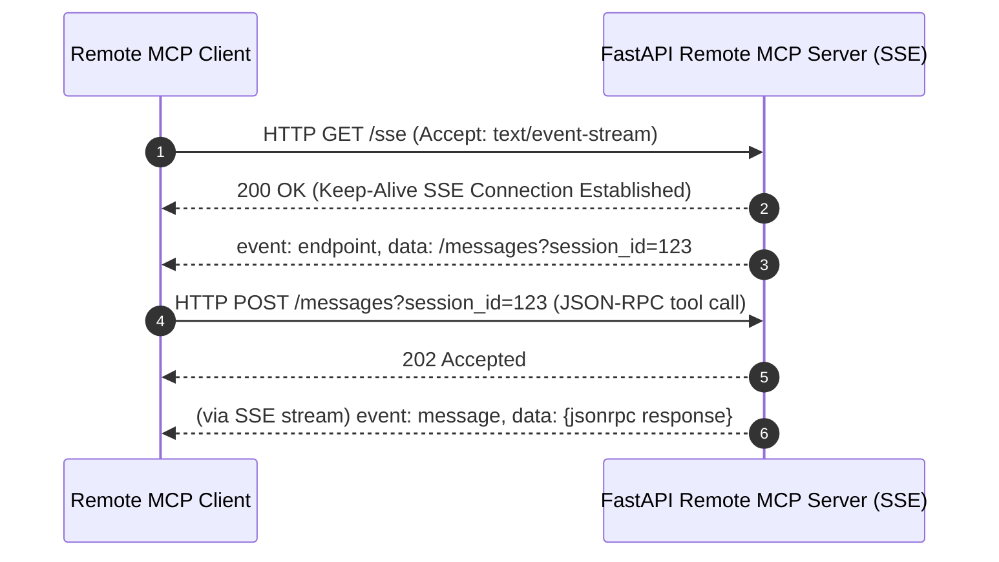

# 📹 How to Build & Deploy Remote MCP Servers

<div className="video-card" style={{border: '1px solid #30363d', borderRadius: '8px', padding: '16px', marginBottom: '24px', background: 'rgba(56, 139, 253, 0.05)'}}>
  <div style={{display: 'flex', gap: '16px', flexWrap: 'wrap'}}>
    <div><strong>Instructor:</strong> Nitish Singh (CampusX)</div>
    <div><strong>Duration:</strong> 2749</div>
    <div><strong>Course:</strong> Module 5: MCP & Claude Code</div>
    <div><strong>Watch Link:</strong> <a href="https://www.youtube.com/watch?v=GF7-ZzUausU" target="_blank" rel="noopener noreferrer">YouTube Lecture ↗</a></div>
  </div>
</div>

## 📌 Executive Summary

While local servers run over `stdio` on a single machine, enterprise tools require centralized, remote deployment accessible to distributed teams. Remote MCP servers operate over HTTP using Server-Sent Events (SSE) for server-to-client streaming and HTTP POST for client-to-server requests.

This guide details building remote MCP servers with Starlette/FastAPI, configuring Bearer Token authentication, CORS, and deploying to cloud infrastructure.

---

## 🏗️ System Architecture & Execution Flow



---

## 📖 Core Concepts & Technical Deep Dive

### 1. The SSE Transport Pattern
Standard HTTP request-response is half-duplex. MCP SSE transport uses:
- A persistent `GET /sse` stream where the server sends streaming messages and notifications to the client.
- A standard `POST /messages?session_id=...` endpoint where the client submits JSON-RPC requests.

### 2. Authentication & Multi-Tenancy
Remote servers must enforce authentication. Standard patterns include Bearer JWT tokens in the `Authorization` header during the initial SSE handshake and TLS termination.

---

## 💻 Production Implementation

```python
from mcp.server.fastmcp import FastMCP

# Remote FastMCP server configured with SSE transport
mcp = FastMCP("Cloud Analytics MCP Server")

@mcp.tool()
def query_cloud_metric(metric_name: str) -> str:
    """Query centralized cloud monitoring metrics."""
    return f"Metric '{metric_name}': 99.98% uptime over past 30 days."

# Run on port 8000 using SSE transport
if __name__ == "__main__":
    mcp.run(transport="sse")
```

---

## ⚙️ Production Gotchas & Best Practices

:::tip Session Management
Ensure session IDs generated during the `/sse` handshake are validated on every subsequent `/messages` POST request to prevent cross-session eavesdropping.
:::

:::warning HTTPS Requirement
Never deploy remote MCP servers over plain HTTP in production. Always enforce TLS/HTTPS encryption to protect transmitted tool arguments and database credentials.
:::

---

## 📊 Architectural Reference & Comparison

| Transport | Networking Protocol | Best Suited For | Security Boundary |
| :--- | :--- | :--- | :--- |
| **stdio** | Standard I/O Subprocess | Local Desktop / CLI tools | OS Process Isolation |
| **SSE** | HTTP / Server-Sent Events | Centralized Enterprise Services | TLS + Bearer Tokens |

---

## 📚 Key Takeaways & Enterprise Checklist

- [ ] **Architecture Verification:** Ensure your design addresses latency, decoupled interfaces, and strict data validation contracts.
- [ ] **Deterministic Testing:** Run unit tests and golden dataset evaluations before shipping changes to staging or production.
- [ ] **Security & Observability:** Enforce input/output guardrails, scrub sensitive credentials/PII, and capture distributed traces.
- [ ] **Scalability & Sizing:** Calibrate model parameters, context limits, and compute instance requirements against projected request concurrency.
