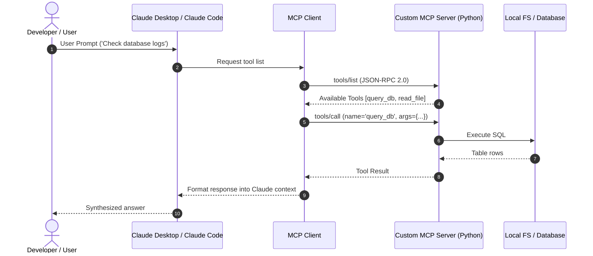

# 📹 How to Build & Deploy Remote MCP Servers ｜ MCP Trilogy

<div className="video-card" style={{border: '1px solid #30363d', borderRadius: '8px', padding: '16px', marginBottom: '24px', background: 'rgba(56, 139, 253, 0.05)'}}>
  <div style={{display: 'flex', gap: '16px', flexWrap: 'wrap'}}>
    <div><strong>Instructor:</strong> Nitish Singh (CampusX)</div>
    <div><strong>Duration:</strong> 45m 49s</div>
    <div><strong>Playlist:</strong> Model Context Protocol Masterclass (CampusX)</div>
    <div><strong>Watch Link:</strong> <a href="https://www.youtube.com/watch?v=GF7-ZzUausU" target="_blank" rel="noopener noreferrer">YouTube Lecture ↗</a></div>
  </div>
</div>

## 📌 Executive Summary & Learning Objectives

This lecture covers **How to Build & Deploy Remote MCP Servers ｜ MCP Trilogy**, focusing on production implementations, edge cases, and industry standards:
- Core intuition, architecture, and underlying mechanisms.
- Key differences between theoretical research implementations and scalable enterprise patterns.
- Concrete Python walkthroughs, error recovery, and performance optimization.

---

## 🏗️ Architecture & Conceptual Workflow



---

## 📖 Core Concepts & Technical Deep Dive

### 1. Architectural Foundations
In modern production AI engineering, **How to Build & Deploy Remote MCP Servers ｜ MCP Trilogy** is essential for ensuring reliability, low latency, and deterministic outcomes. As AI systems evolve from naive prompt-in / completion-out scripts into distributed systems, engineers must handle:
- **State management & consistency:** Ensuring intermediate states and tool invocations are tracked.
- **Error boundaries & recovery:** Graceful degradation when external LLMs or vector stores encounter rate limits or network partitions.
- **Resource utilization & cost efficiency:** Caching common queries and reducing unnecessary foundation model token expenditure.

### 2. Operational Considerations
- **Latency Optimization:** Pre-computing embeddings, utilizing asynchronous non-blocking event loops, and streaming tokens via Server-Sent Events (SSE).
- **Security & Sandboxing:** Validating inputs before ingestion, sanitizing LLM outputs, and isolating tool execution environments.

---

## 💻 Production Implementation Walkthrough

```python
from mcp.server.fastmcp import FastMCP

# Initialize FastMCP Server
mcp = FastMCP("Production AI Tools Server")

@mcp.tool()
def calculate_token_cost(input_tokens: int, output_tokens: int, model: str = "gpt-4o") -> dict:
    """Calculate total API cost given token counts."""
    rates = {
        "gpt-4o": {"input": 2.50 / 1_000_000, "output": 10.00 / 1_000_000},
        "claude-3-5-sonnet": {"input": 3.00 / 1_000_000, "output": 15.00 / 1_000_000},
    }
    rate = rates.get(model, rates["gpt-4o"])
    cost = (input_tokens * rate["input"]) + (output_tokens * rate["output"])
    return {"model": model, "total_cost_usd": round(cost, 6)}

if __name__ == "__main__":
    # Runs stdio transport protocol for Claude Desktop & Claude Code
    mcp.run(transport="stdio")
```

---

## 💡 Production Best Practices & Tips

:::tip Production Deployment Guideline
When deploying How to Build & Deploy Remote MCP Servers ｜ MCP Trilogy in enterprise environments, always configure automated retries with exponential backoff and telemetry tracing (such as OpenTelemetry or LangSmith).
:::

:::warning Common Failure Modes
Watch out for state contamination across concurrent requests. Ensure each session or user interaction uses an isolated thread ID or execution context.
:::

---

## 🎯 Key Takeaways & Quick Reference

| Dimension | Production Standard | Pitfall to Avoid |
| :--- | :--- | :--- |
| **Execution** | Async / Non-blocking with timeouts | Synchronous blocking calls in event loops |
| **Data Validation** | Strict Pydantic v2 schemas | Untyped dictionary access |
| **Monitoring** | Distributed tracing & latency percentiles | Relying only on standard console logs |

## ⏱️ Lecture Timeline & Key Topics

| Timestamp | Key Topic / Concept Discussed |
| :--- | :--- |
| **00:00:00** | हाय गाइस, माय नेम इज नितीश एंड यू वेलकम... |
| **00:10:52** | वैल्यू है 100। तो लेट्स रन दिस टूल।... |
| **00:22:32** | अ... |
| **00:34:25** | रहा है। तो या हमने एक प्रॉब्लम सॉल्व कर... |
| **00:45:46** | नेक्स्ट वीडियो में। बाय।... |


---

---

## 📜 Complete Lecture Transcript (Hindi / Hinglish)

> **Language:** Hindi / Hinglish | **Source:** `07 - How to Build & Deploy Remote MCP Servers ｜ MCP Trilogy ｜ CampusX.hi-orig.srt` | **Total Segments:** 23 | **Word Count:** ~6,939 words

<details>
<summary><b>Click to expand full chronological transcript (23 timestamped intervals)</b></summary>

#### ⏱️ [00:00 ➔ 00:02]

हाय गाइस, माय नेम इज नितीश एंड यू वेलकम टू माय YouTube चैनल। इस वीडियो में भी हम लोग अपना एमसीपी प्लेलिस्ट कंटिन्यू करेंगे और वीडियो को शुरू करने के पहले एक बार मैं आपको बता देता हूं कि हम आज के वीडियो में क्या कवर करने वाले हैं। सो अगर आपको याद होगा तो लास्ट जो वीडियो था इस प्लेलिस्ट में वहां पे मैंने आपको लोकल एमसीपी सर्वर्स बनाना सिखाया था। विद द हेल्प ऑफ अ लाइब्रेरी कॉल्डस्ट एमसीपी। आज हम क्या करेंगे? हम इसी लाइब्रेरी को यूज करके रिमोट एमसीपी सर्वर्स बनाना सीखेंगे। ठीक है? अब मैंने पास्ट में आपको बता रखा है कि लोकल एंड रिमोट एमसीपी सर्वर्स के बीच में क्या डिफरेंस होता है। लोकल सर्वर एक ऐसा एमसीपी सर्वर है जो आपके ही मशीन पे चल रहा होता है। मतलब जिस मशीन के ऊपर एमसीपी होस्ट और क्लाइंट रन कर रन कर रहे होते हैं। उसी मशीन के ऊपर लोकल एमसीपी सर्वर भी रन कर रहे होते हैं। ठीक है? बट रिमोट एमसीपी सर्वर्स आर डिफरेंट। रिमोट एमसीपी सर्वर्स आर सर्वर्स व्हिच आर रनिंग ऑन अ डिफरेंट मशीन ऑन इंटरनेट। ठीक है? रिमोट एमसीपी सर्वर का फायदा क्या है? ओवर लोकल एमसीपी सर्वर अगर आप एक साथ मल्टीपल क्लाइंट्स को सर्व करना चाहते हो तो फिर आप रिमोट एमसीपी सर्वर की हेल्प से यह कर सकते हो। सेकंड रिमोट एमसीपी सर्वर्स जनरली इंटरनेट पर किसी सर्वर के ऊपर रन कर रहे होते हैं जो कि खुद बहुत पावरफुल मशीनंस होती हैं। तो आप ऐसे समझो कि रिमोट एमसीपी सर्वर्स ज्यादा पावरफुल होते हैं इन टर्म्स ऑफ कंप्यूट। तो आप उनसे ज्यादा कंप्यूट इंटेंसिव टास्क करवा सकते हो। कुछ नुकसान भी होते हैं रिमोट एमसीपी सर्वर के। अ जैसे लोकल एमसीपी सर्वर सिंस सेम मशीन के ऊपर रन कर रहा है तो ये फास्ट होता है। बिकॉज़ सारा का सारा कम्युनिकेशन सेम मशीन के ऊपर हो रहा होता है। बट रिमोट एमसीपी सर्वर थोड़े रिलेटिवली स्लो होते

#### ⏱️ [00:02 ➔ 00:04]

हैं बिकॉज़ इनका कम्युनिकेशन ओवर इंटरनेट या फिर ओवर सम नेटवर्क हो रहा होता है। बट एज अ रूल ऑफ थंब आप याद रखो कि जितने भी फ्यूचर में आपको एंटप्राइज एमसीपी सर्वसर्स दिखाई देंगे। एंटरप्राइज मतलब बड़ी कंपनीज़ के एमसीपी सर्वर्स दिखाई देंगे। वो मोस्टली रिमोट होंगे। ठीक है? सो इस सेंस में रिमोट एमसीपी सर्वर्स को पढ़ना बहुतेंट हो जाता है। ठीक है? तो आज के वीडियो में नॉट ओनली मैं आपको रिमोट एमसीपी सर्वर्स बनाना सिखाऊंगा बट एट द सेम टाइम हम उसको डिप्लॉय भी करेंगे। सो दैट कोई भी पूरी दुनिया में हमारे एमसीपी सर्वर्स को यूज़ कर पाए। ठीक है? तो आई होप आपको यह तो समझ में आ गया कि हम आज के वीडियो में क्या कवर करने वाले हैं। अब मैं आपको स्टेप बाय स्टेप प्लान ऑफ एक्शन बताता हूं। सो अगर स्टेप बाय स्टेप बात करें तो सबसे पहले इस वीडियो में मैं आपको एक बहुत सिंपल रिमोट एमसीपी सर्वर बनाना सिखाऊंगा। ठीक है? सो बहुत बेसिक फंक्शनैलिटी होगी। जैसे कि दो नंबर्स को ऐड करना या फिर एक रैंडम नंबर जनरेट करना। इस तरह का बेसिक रिमोट सर्वर बनाएंगे हम और अच्छी बात क्या होती है यह बात मैंने आपको थोड़ी देर पहले नहीं बताई बट अच्छी बात यह है कि आपको कोड पॉइंट ऑफ व्यू से अ कोई चेंजेस नहीं करने होते हैं। कोड पॉइंट ऑफ व्यू से एक लोकल एमसीपी सर्वर और एक रिमोट एमसीपी सर्वर ऑलमोस्ट सेम दिखाई देते हैं। तो कोडिंग पॉइंट ऑफ व्यू से हम कुछ नया नहीं सीखेंगे। बट स्टिल कुछ चेंजेस आपको करने पड़ेंगे इन ऑर्डर टू मेक मेक अ रिमोट एमसीपी सर्वर। तो हम सबसे पहले एक सिंपल रिमोट सर्वर बनाना सीखेंगे। फिर हम क्या करेंगे कि हम इस सिंपल रिमोट सर्वर में अपना एक्सपेंस ट्रैकिंग वाला जो एमसीपी सर्वर है उसका कोड फिट कर देंगे। ठीक है? उसके बाद हम अपने एक्सपेंस ट्रैकिंग वाले एमसीपी सर्वर को डिप्लॉय करेंगे। डिप्लॉय करने के लिए

#### ⏱️ [00:04 ➔ 00:06]

हमारे पास मल्टीपल ऑप्शंस हैं। आप एडब्ल्यूएस के ऊपर भी कर सकते हो। तो आप रेंडर जैसे प्लेटफार्म के ऊपर भी कर सकते हो। बट हम आज जिस प्लेटफार्म को यूज़ करेंगे उसका नाम हैस्ट एमसीp क्लाउड। सो यह जो लाइब्रेरी हैस्ट एमसीपी इनका ही एक सर्विस हैस्ट एमसीपी क्लाउड बोल के व्हिच इज़ अ फ्री सर्विस राइट नाउ। आप बहुत आसानी से इस सर्विस को यूज़ करके अपने रिमोट सर्वर्स को डिप्लॉय कर सकते हो। मैं आपको दिखाऊंगा कैसे। ठीक है? फिर फोर्थ स्टेप में हम क्या करेंगे कि हम कुछ प्रॉब्लम्स आइडेंटिफाई करेंगे अपने सिंपल सेटअप में और उन प्रॉब्लम्स को हम रेक्टिफाई करेंगे। ठीक है? तो ये चार चीजें हम लोग आज इस वीडियो में कवर करने वाले हैं। ठीक है? तो आई होप आपको पूरा एजेंडा क्लियर हो गया। नाउ लेट्स स्टार्ट द वीडियो। चलो गाइस अब मैं आपको स्टेप बाय स्टेप तरीके से बताता हूं कि कैसे आप एक टेस्ट रिमोट सर्वर बना सकते हो। नॉट ओनली हम इस सर्वर को बनाएंगे बट मैं साथ ही साथ आपको डिप्लॉय करके भी दिखा दूंगा यह सर्वर। ठीक है? तो यहां पर मैंने सारे स्टेप्स लिखे हैं। हम इन सारे स्टेप्स को फॉलो करेंगे। तो सबसे पहला स्टेप है कि आपको अपने मशीन पे यूवी इंस्टॉल करना पड़ेगा। यह मैंने आपको लास्ट वीडियो में भी बताया था लोकल रिमोट सर्वर सेटअप करते टाइम। तो आपको अपने मशीन के टर्मिनल या कमांड प्र्ट पे जाना है और वहां पे यू हैव टू सिंपली टाइप पिप इंस्टॉल यूवी। मेरे मशीन पे यूवी ऑलरेडी इंस्टॉल्ड है तो इसलिए दिखाई दे रहा है रिक्वायरमेंट ऑलरेडी सेटिस्फाइड। ठीक है? इसके बाद आपको क्या करना है कि आपको एक नया फोल्डर बनाना है। ठीक है? तो हम हमारे डेस्कटॉप पे एक नया फोल्डर बना लेते हैं और इस फोल्डर का नाम रख लेते हैं अम टेस्ट रिमोट सर्वर। ठीक है? उसके बाद हमें क्या करना है? इस नए फोल्डर को वीएस कोड में ओपन करना है। तो हम एक बार वीएस कोड में जाएंगे। फाइल ओपन फोल्डर

#### ⏱️ [00:06 ➔ 00:08]

टेस्ट रिमोट सर्वर पे हम जाएंगे। ये बन गया हमारा ये ओपन हो गया हमारा फोल्डर। इसके बाद आपको क्या करना है? इस नए फोल्डर में यूवी को इनिशियलाइज करना है। तो हम यहां से एक नया टर्मिनल ओपन करेंगे और हम यहां पे लिखेंगे यूवी इनट डॉट और हमारा यूवी इनिशियलाइज़ हो गया इस पर्टिकुलर फोल्डर में। अब हम क्या करेंगे? यूवी की हेल्प सेस्ट एमसीपी को ऐड करेंगे। सो, हम लिखेंगे यूवी ऐड एमसीपी। एंड यू कैन सी फास्ट एमसीपी ऐड हो गया। उसके बाद अब हमें क्या करना है? हमें अपने टेस्ट रिमोट सर्वर का कोड यहां पर ऐड करना है मेन डॉट py फाइल में। तो मैं आपको कोड दिखाता हूं। मैंने कोड ऑलरेडी लिख रखा है। सो ये कोड है। मैं इसको कॉपी पेस्ट करता हूं। आपको देख के समझ में आ जाएगा वैसे यहां पे क्या चल रहा है। तो ये एक बहुत ही सिंपल कोड है। जहां पे हम एक बहुत बेसिक लेवल एमसीपी सर्वर बना रहे हैं। ठीक है? सो यहां पे हमने अपना सर्वर इनिशियलाइज किया। इस सर्वर में दो दो टूल्स हैं। पहला टूल है जिसकी हेल्प से आप दो गिवन नंबर्स को ऐड कर सकते हो। और दूसरा टूल है जिसकी हेल्प से आप एक गिवन रेंज में रैंडम नंबर जनरेट करवा सकते हो। और इसके अलावा एक रिसोर्स है जो आपको सर्वर के बारे में कुछ इंफॉर्मेशन देता है। दैट्स इट। जो मेन चेंज आपको दिखाई देगा इस कोड में इन कंपैरिजन टू अ लोकल एमसीपी सर्वर वो आपको यहां पर दिखाई देगा। सो अगर आपको याद होगा हमने लास्ट कोड में एज इन लास्ट वीडियो के कोड में जो लाइन यहां पे लिखी थी वो था एमसीp डॉट रन लाइक दिस। तो जब आप सिर्फ एमसीपी डॉट रन लिखते हो तो फास्ट एमसीपी में इसका मतलब होता है कि आप अपना ट्रांसपोर्ट एसटीडी आईo सेट कर रहे हो। बट यहां पे देखो हमने

#### ⏱️ [00:08 ➔ 00:10]

क्या किया है? हमने ट्रांसपोर्ट सेट किया है HTTP। तो यहां पे हम बोल रहे हैं कि हम जो ट्रांसपोर्ट चाहते हैं अपने एमसीपी सर्वर के लिए वो है स्ट्रीमेबल HTTP। ठीक है? और हमने यहां पे होस्ट में बता दिया है कि हम किसी भी टाइप के IP एड्रेस से रिक्वेस्ट लेने को रेडी हैं। और यहां पे हमने अपना एक पोर्ट डिफाइन कर दिया है। तो दिस इज़ द ओनली चेंज एंड दिस इज़ द मोस्टेंट चेंज दैट यू हैव टू डू इन ऑर्डर टू मेक अ रिमोट एमसीपी सर्वर। बाकी का कोड अगर आप देखो तो बिल्कुल सेम है। कुछ भी डिफरेंट नहीं है। बिल्कुल वैसे ही कोड लिखा गया है जैसे आप किसी लोकल एमसीपी सर्वर का कोड लिखते हो। ठीक है? तो आई होप आपको ये चीज समझ में आ गई। अब अगर हम आगे बढ़ें तो हमें क्या करना है? हमें एक बार इस सर्वर को चला के देख लेना है कि को ये कोड सही से काम कर रहा है कि नहीं। तो हम वापस जाते हैं एक बार अ टर्मिनल के पास और आपको ये कमांड रन करना है। ठीक है? कमांड हैस्ट एमसीp रन सर्वर डॉटpy सर्वरpy नहीं होगा हमारे केस इट वुड बी मेन डॉटpy hfन hfन ट्रांसपोर्ट http hfन hfन होस्ट 0.0.0.0 और फिर आपको पोर्ट बताना है। अगर आपको ये कमांड बहुत ज्यादा बड़ा और हार्ड टू रिमेंबर लग रहा है तो आप सिंपली क्या कर सकते हो? यहां पे यूवी रन अपनी फाइल का नाम भी कर सकते हो। ये देखो यहां पे आपका सर्वर स्टार्ट हो गया। ठीक है? सर्वर का नाम है सिंपल कैलकुलेटर सर्वर। ट्रांसपोर्ट जो यूज़ हो रहा है वो है स्ट्रीमेबल HTTP। सर्वर का यूआरएल आपको दिखाई दे रहा है। एंड आपका सर्वर स्टार्ट हो चुका है। ठीक है? तो यहां तक का काम हमने कर लिया। अब हम क्या करेंगे? एक बार अपने सर्वर को अ डीबग करेंगे। डीबग करेंगे इन द सेंस अ चला करके देखेंगे एमसीपी इंस्पेक्टर में कि सब कुछ सही से काम कर रहा है कि नहीं। ठीक है? तो व्हाट वी विल डू इज़ हम एक और टर्मिनल ओपन कर लेते हैं।

#### ⏱️ [00:10 ➔ 00:12]

और यहां पे हम ये कमांड लिखते हैं। यूवी रनस्ट एमसीp डेव मेन डॉट py ये कमांड एमसीपी इंस्पेक्टर को ओपन कर देगा। यू कैन सी हम क्या करेंगे? यहां पे ट्रांसपोर्ट सेलेक्ट करेंगे। स्ट्रीमबल एचटीटीp और विल क्लिक ऑन कनेक्ट। ठीक है? हम कनेक्ट हो गए। अब यहां पे देखो रिसोर्सेज में अगर मैं लिस्ट रिसोर्सेज पे जाऊं तो ये हमारे पास रिसोर्स है सर्वर इनफो जहां पे ये सारी चीज आपको देखने को मिल रही है। ठीक है? कोई प्र्प्ट नहीं है हमारे सर्वर पे। टूल्स पे जाते हैं। लिस्ट टूल्स पे जाते हैं। तो हमारे पास दो टूल्स हैं। मान लो हम रैंडम नंबर वाला चेक करते हैं। तो मान लो हमारी मिनिमम वैल्यू है 10 और मैक्सिमम वैल्यू है 100। तो लेट्स रन दिस टूल। द रिजल्ट इज़ 22 रैंडम नंबर है। ठीक है? तो यहां पे हमारा जो सर्वर है वो सही से चल रहा है। ठीक है? तो अब हम क्या कर सकते हैं? इस सर्वर को डिप्लॉय कर सकते हैं। तो डिप्लॉय करने के लिए हम क्या करेंगे? हमस्ट एमसीपी क्लाउड को यूज़ करेंगे। तो यूआरएल हैस्ट एमसीp डॉट क्लाउड। आपको सबसे पहले यहां पे जाके एक अकाउंट बनाना पड़ेगा। ठीक है? मैंने ऑलरेडी बना रखा है। तो, यह इनका पेज है जहां पर इन लोगों ने मुझे दो ऑप्शंस दिए हैं। या तो मैं इनका कोई टेंपलेट यूज़ कर सकता हूं टू क्रिएट माय रिमोट एमसीपी सर्वर या फिर मैं अपना खुद का कोड डिप्लॉय कर सकता हूं। बट खुद का कोड डिप्लॉय करने के लिए आपको पहले क्या करना पड़ेगा? आपको अपने इस कोड को गेट पे पुश करना पड़ेगा। ठीक है? तो क्या करते हैं? सबसे पहले गेट पर जाते हैं। और एक नई रेपोजिटरी क्रिएट कर लेते हैं। सो

#### ⏱️ [00:12 ➔ 00:14]

इसका नाम है टेस्ट रिमोट एमसीपी सर्वर। ठीक है? अ टेस्ट एमसीपी सर्वर हो गया इसका डिस्क्रिप्शन। आगे मुझे कुछ चेंज नहीं करना है। क्रिएट रिपोजिटरी। और यहां पर मैं क्या करूंगा? मैं इस पाथ को कॉपी कर लूंगा। अब सबसे पहले व्हाट आई विल डू इज़ कि मैं अपने कोड में जाऊंगा और गेट इनिशलाइज कर लूंगा। ठीक है? गेट इनिशलाइज आई गेस पहले से हो गया होगा। हां, पहले से हो रखा है। अब मैं क्या करूंगा? मैं गेट स्टेटस करूंगा टू चेक क्या-क्या नई फाइल्स हैं। तो दीज़ आर द न्यू फाइल्स। उसके बाद व्हाट आई विल डू इज़ कि आई विल डू गेट ऐड डॉट। और फिर मैं लिखूंगा गेट कमिट। - m मेरे कमिट का नाम हो जाएगा इनिशियल कमिट अब मैं क्या करूंगा अपना रिमोट ऐड कर दूंगा सो उसका कमांड होता है गेट रिमोट ऐड ओरिजिन गेट रिमोट ऐड ओरिजिन यहां पे मुझे वो एड्रेस पेस्ट कर देना है मेरे मेरी रिपोजिटरी का मैंने एंटर मारा। रिमोट ऐड हो गया। अब मुझे सिंपली पुश कर देना है। गेट पुश ओरिजिन मेन। ठीक है? पुश हो गया। एक बार यहां पे चलते हैं। चेक कर लेते हैं सब कुछ यहां पे आया है कि नहीं। यू कैन सी सब कुछ आ गया। ये रहा हमारा मेन डॉटpy। दिस इज़ द कोड। तो या वी आर रेडी नाउ। सो हम क्या करेंगे? एमसीपी क्लाउड पे जाएंगे और यहां पे डिप्लॉय फ्रॉम योर ओन कोड ऑप्शन पे जाएंगे। ठीक है? यहां पे जैसे ही आप यह ऑप्शन पे क्लिक करोगे आपकोस्ट एमसीp क्लाउड पहले बोलेगा कि GitHub अकाउंट

#### ⏱️ [00:14 ➔ 00:16]

कनेक्ट करो। तो मैंने ऑलरेडी कनेक्ट कर रखा है। आप कर लेना। बहुत सिंपल प्र्ट्स आएंगे। आपको बस ओके ओके करना है। ठीक है? अब यहां पे आपको आपकी रीसेंट रेपोज़िटरीज दिखने लग जाएंगी। जैसे हमने जो बनाया टेस्ट रिमोट एमसीपी सर्वर वह दिख रहा है। तो मैं इसको सेलेक्ट कर लूंगा और यहां पे बस मुझे इस बटन पे प्रेस करना है। डिप्लॉय टेस्ट रिमोट एमसीपी सर्वर और बिहाइंड द सीन सारा काम फास्ट एमसीपी क्लाउड खुद कर लेगा। यहां पे इफ यू वांट आप इस नाम को बदल सकते हो। यह बेसिकली आपके रिमोट एमसीपी सर्वर के यूआरएल का पार्ट होगा। तो आप कुछ अपना नाम, अपनी कंपनी का नाम डाल सकते हो। फिलहाल मैं चेंज नहीं कर रहा हूं। यह रैंडमली जनरेट होता है। ठीक है? बेसिकली आपके रिमोट सर्वर का एड्रेस ये होगा। ठीक है? यहां पे आपको एक एंट्री पॉइंट का नाम देना है। आपकी कौन सी फाइल में आपका कोड है? तो हमारा है मेन डॉटpy में। अ कोई ऑथेंटिकेशन हम नहीं देना चाहते। अभी अ डिस्कवरेबल ऑप्शन अगर आप सेलेक्ट करते हो तो फास्ट एमसीपी का जो एक क्यूरेटेड पेज है वहां पे आपका एमसीपी सर्वर लिस्ट होने लग जाएगा। अगेन मुझे इसकी रिक्वायरमेंट नहीं है। ठीक है? तो दीज़ आर द सेटिंग्स। मैंने डिप्लॉय पे क्लिक किया। अब यहां पर हमारा एमसीपी सर्वर का बिल्ड रेडी हो रहा है। ठीक है? सो मैं एक बार वीडियो पॉज करता हूं। जैसे ही यह कंप्लीट हो जाता है, मैं आपको दिखाता हूं कि यह कैसा दिखाई दे रहा है। एंड या गाइस, एज़ यू कैन सी हमारा रिमोट एमसीपी सर्वर डिप्लॉय हो गया। जस्ट लाइक दैट। अब हम क्या करेंगे? इस रिमोट एमसीपी सर्वर को यूज़ करेंगे इन आवर क्लॉड डेस्कटॉप। ठीक है? सो, आपको क्या करना है? इस यूआरएल को कॉपी करना है और इस यूआरएल को आप अपने किसी भी फ्रेंड या कलीग के साथ शेयर कर सकते हो। आपके फ्रेंड और कलीग को बस इतना करना पड़ेगा कि उसको अपने मशीन पे क्लॉड डेस्कटॉप ओपन करना पड़ेगा। सो आपको क्या करना है कि क्लॉड में सेटिंग्स पे जाना है। सेटिंग्स में आपको कनेक्टर्स का ऑप्शन मिलेगा। आपको कनेक्टर्स पे जाना है। और यहां पे क्लॉड

#### ⏱️ [00:16 ➔ 00:18]

ने एक नया फीचर ऐड किया है जिसकी हेल्प से आप कस्टम एमसीपी रिमोट सर्वर्स ऐड कर सकते हो। ठीक है? कैसे? एकदम बॉटम में आपको ऐड कस्टम कनेक्टर का ऑप्शन मिलेगा। अब यहां पे मैं आपको एक डिस्क्लेमर देना चाहूंगा। जो भी लोग क्लॉड के फ्री प्लान पे हो उनको यह ऐड कस्टम कनेक्टर का ऑप्शन नहीं मिलेगा। ठीक है? यह ऑप्शन सिर्फ प्रो प्लान के ऊपर अवेलेबल है। फिलहाल फ्यूचर में आई एम प्रीटी श्योर यह ऑप्शन सभी के पास हो जाएगा। दिस इज लाइक अ बीटा फीचर राइट नाउ। तो अगर आप यह वीडियो देख रहे हो और आपके पास प्रो प्लान नहीं है। आप वीडियो में थोड़ा आगे बढ़ो। अगर हमने टाइम स्टैंप्स ऐड कर रखे होंगे तो वहां पे मैंने आपको एक तरीका बताया है। एक जुगाड़ बताया है जिसकी हेल्प से आप अपना रिमोट एमसीपी सर्वर क्लॉट डेस्कटॉप के साथ ऐड कर सकते हो। इवन इफ यू आर ऑन अ फ्री प्लान। ठीक है? बट फिलहाल वीडियो में आगे बढ़ते हैं। मैं दिखाता हूं आप कैसे प्रो प्लान के ऊपर कनेक्ट कर सकते हो अपने रिमोट एमसीपी सर्वर को। तो हमें इस पे क्लिक करना है। यहां पे आपको एक नाम प्रोवाइड करना है। सो मैंने लिख दिया नितिश टेस्ट एमसीपी सर्वर। ठीक है? यहां पे आपको अपना यूआरएल दे देना है। ठीक है? यहां पे वो आपसे एक कंफर्मेशन मांग रहा है। हम बोलेंगे ऐड और यह ऐड हो गया। ठीक है? मैं एक बार क्लॉड को बंद कर रहा हूं। दोबारा स्टार्ट कर रहा हूं। एंड नाउ इफ आई क्लिक यह देखो यहां पे दिखाई दे रहा है नितेश टेस्ट एफ एमसीपी सर्वर। और इसमें हमारे दो टूल्स हैं। ऐड एंड रैंडम नंबर। सो यहां पर अगर मैं लिखूं जनरेट रैंडम नंबर बिटवीन 11 एंड 20। ठीक है? तो अब वो हमसे परमिशन ले रहा है।

#### ⏱️ [00:18 ➔ 00:20]

हमने अलऊ कर दिया। एंड यू कैन सी दिस इज़ द रैंडम नंबर। तो इतना सिंपल है फास्ट एमसीपी की हेल्प से एक रिमोट एमसीपी सर्वर बनाना और उसका यूआरएल किसी के साथ भी शेयर करना। और अगर उस बंदे के पास प्रो प्लान है तो वो इतना ईजीली उस रिमोट सर्वर को ऐड कर सकता है अपने क्लॉट डेस्कटॉप में। ठीक है? अभी थोड़ी देर बाद मैं आपको बताऊंगा कि अगर आपके पास प्रो प्लान नहीं है तो आप यह काम कैसे कर सकते हो। अब गाइज़ एक बेसिक लेवल रिमोट एमसीपी सर्वर तो हमने बना लिया बट हमारा जो मेन गोल है वो यह है कि हम अपने एक्सपेंस ट्रैकर सर्वर को एक रिमोट एमसीपी सर्वर में कन्वर्ट करना चाहते हैं और उसको डिप्लॉय करना चाहते हैं। तो यह पूरा प्रोसेस हम रिपीट नहीं करेंगे। इंस्टेड हम स्मार्टली काम करेंगे। व्हाट वी विल डू इज़ कि जो हमारा कोड है एक्सपेंस ट्रैकर वाला जो हमने लास्ट वीडियो में लिखा था पूरा का पूरा हम उस कोड पे जाएंगे और उस कोड को एज़ इट इज़ पेस्ट कर देंगे हमारे टेस्ट एमसीपी सर्वर में। सो बेसिकली व्हाट आई एम ट्राइंग टू से इज़ कि ये हमारा एक्सपेंस ट्रैकर एमसीपी सर्वर है जो लास्ट वीडियो में हमने बनाया था। ये उसका मेन डॉटpy है। ठीक है? दिस इज़ द कोड। सो व्हाट आई विल डू इज आई विल सिंपली कॉपी दिस कोड एंड आई विल गो टू माय वीएस कोड एंड इन वीएस कोड आई विल सिंपली रिप्लेस दिस कोड विद द एक्सपेंस ट्रैकर वाला कोड। ठीक है? और उसमें ये वाला पार्ट मैं हटा दूंगा। सो अब क्या हुआ है कि सेम प्रोजेक्ट में हमने अपना एक्सपेंस ट्रैकर वाला कोड ऐड कर दिया। ठीक है? एक चीज और आपको करनी पड़ेगी और वो यह है कि आपके पास एक कैटेगरीज json फाइल होनी चाहिए। तो वो भी मैं कॉपी कर रहा हूं और यहां पे मैं एक नई फाइल बना ले बना ले रहा हूं। इसका नाम है कैटेगरीज डॉट jसon और मैं इसको पेस्ट कर दे रहा हूं।

#### ⏱️ [00:20 ➔ 00:22]

ठीक है? तो अब ये कोड होपफुली सही से काम करना चाहिए। तो सबसे पहले एक बार हम इसको एमसीपी इंस्पेक्टर में चेक कर लेंगे। वहां पर अगर सही से काम कर रहा होगा तो फिर हम क्या करेंगे? हम इसको डिप्लॉय कर देंगे, पुश कर देंगे। ठीक है? सो व्हाट आई विल डू इज़ मैं एक बार इस कोड को रन कर लेता हूं। बाय रनिंग यूवी रन मेन डॉट py इससे क्या होगा? हमारा डेटाबेस बन जाएगा। ठीक है? यह हमारा डेटाबेस बन गया। नाउ आई विल सिंपली राइट दिस कोड यूवी रन फास्ट एमसीपी डेव मेन डॉट पीवाई तो ये रहा हमारा [संगीत] एमसीपी इंस्पेक्टर एक बार इसे कनेक्ट करते हैं। कनेक्ट हो गए टूल्स पे जाते हैं। लिस्ट टूल्स पे जाते हैं। ये देखो हमारे टूल्स हमें दिखाई दे रहे हैं। ठीक है? तो अगर मैं लिस्ट एक्सपेंस पे जाऊं और यहां पर मैं अगर एक डेट डाल दूं 1 09 2025 एंड डेट डाल दूं मैं 309 2025 और अगर मैं इसको रन करूं तो देयर इज़ सम एरर स्टार्ट डेट इज़ अ रिक्वायर्ड प्रॉपर्टी आई गेस कुछ फॉर्मेटिंग का इशू है। इट हैज़ टू बी अ स्ट्रिंग। आई गेस चेक कर लेते हैं एक बार। सम इशू इज़ देयर। अ ठीक है। मतलब फिलहाल यहां पे दिखाई दे रहा है कि हमारे कोड्स हमारे टूल्स डिस्कवर हो पा रहे हैं। रिसोर्स भी डिस्कवर हो पा रहे हैं। तो एक काम करते हैं। इसको डिप्लॉय करते हैं। उसको क्लॉट डेस्कटॉप में चला के देखेंगे। अगर वहां पे नहीं चलेगा तो फिर हम लोग डीबग करेंगे। ठीक है? तो फिलहाल हमें क्या

#### ⏱️ [00:22 ➔ 00:24]

करना है कि हमें सिंपली अपडेटेड कोड को पुश कर देना है गेट पे औरस्ट एमसीपी क्लाउड इज़ इंटेलिजेंट इनफ टू अंडरस्टैंड कि GitHub रेपोज़िटरी में चेंजेस हुए हैं। तो वो एक नया बिल्ड उससे क्रिएट करने लग जाएगा। मैं आपको दिखाता हूं कैसे। सबसे पहले मैंने लिखा गेट स्टेटस। सो फिलहाल तीन फाइल्स में चेंजेस हुए हैं। मॉडिफाइड डॉट मॉडिफाइड में मेन डॉटpy हुआ है और दो नई फाइल्स बनी हैं। सो हम लिखेंगे अ वैसे तो आई एम नॉट श्योर मुझे डेटाबेस को अपलोड करना चाहिए कि नहीं। चलो फिलहाल कर लेते हैं। बट आई गेस हमें नहीं करना चाहिए। वो अपने आप रन होते टाइम क्रिएट हो जाएगा। इन दैट केस आपको सिंपली एक्सपेंसेसdb को गेट इग्नोर फाइल में डालना होगा। बट चलो एक बार हम लोग पहले चला के देखते हैं। फिर जो भी प्रॉब्लम्स होंगी उनको हम आइडेंटिफाई करेंगे। तो वी विल राइट गेट ऐड गेट कमिट माइनस एम एक्सपेंस ट्रैकिंग कोड एडेड गेट पुश ओरिजिन मेन पुश हो गया। इफ आई गो बैक टू गेट hub एंड इफ आई सर्च फॉर टेस्ट रिपोज़िटरी और यहां पे एक्सपेंसेसd आ गया। मेन डॉटpy आ गया। यू कैन सी। ठीक है? अब मजेदार चीज क्या है कि अगर आपस्ट एमसीp डॉट क्लाउड पे जाओगे तो वहां पे देखो उसने आइडेंटिफाई कर लिया है कि एक नया कमिट आया है और उस नए कमिट के ऊपर वो बिल्ड स्टार्ट कर देगा। ठीक है? बाकी सब कुछ बिल्कुल सेम रहेगा।

#### ⏱️ [00:24 ➔ 00:26]

सो एक काम करते हैं वेट करते हैं इसको डिप्लॉय होने का। एंड एज़ यू कैन सी हमारा जो सबसे रीसेंट कमिट है वह भी अब प्रोडक्शन में चला गया। तो लेट्स चेक दिस। तो हम लोग फिर से क्या करेंगे? क्लॉट डेस्कटॉप ओपन करेंगे और इसको पहले एक बार हमें रिस्टार्ट करना पड़ेगा। सो रिस्टार्ट किया। अब यहां पे हमें यह हमारा टेस्ट सर्वर तो दिखाई दे रहा है। अब इसके टूल्स में अगर आप जाओगे तो देखो हमें ऐड एक्सपेंस, लिस्ट एक्सपेंस समराइज़ दिखाई दे रहा है। ठीक है? सो, मैं आपको दिखाता हूं। कैन यू टेल मी अबाउट ऑल ऑफ माय एक्सपेंसेस इन सितंबर। ठीक है? वो डेट पे हिट कर रहा है। एंड वो बोल रहा है कि अभी फिलहाल सितंबर में कोई भी एक्सपेंसेस नहीं है। ऑब्वियस बात है। हमने नया डेटाबेस बना के अपलोड किया है। या फिर एक्चुअली वहां पे नया डेटाबेस क्रिएट हुआ होगा। तो फिलहाल वहां पर कोई एक्सपेंसेस नहीं है। तो एक एक्सपेंस ऐड करते हैं। ऐड एन एक्सपेंस। सो समथिंग लाइक नवरात्रि डिनर लास्ट नाइट। 1000 ठीक है? उसने फिगर आउट कर लिया सब कुछ अलाउ वंस। अब देखो यहां पर एक प्रॉब्लम आ रही है और यह प्रॉब्लम मुझे आई थी जब मैंने यह चीज ट्राई आउट की थी वीडियो बनाने के पहले कि यहां पे लिखा आ रहा है आई अपोलजाइज बट आई एम अनेबल टू ऐड द एक्सपेंस राइट नाउ बिकॉज़ द डेटाबेस इज़ सेट टू रीड ओनली मोड। सो ये जो कोड हमने यहां पे लिखा है सीक्वलit का उसके हिसाब से हमारा जो डेटाबेस है वो अभी

#### ⏱️ [00:26 ➔ 00:28]

रीड ओनली मोड में एटलीस्ट जब हम इसको डिप्लॉय कर रहे हैं ऑन अ सर्वर उसकी वजह से हमारा कोई भी एक्सपेंस हम ऐड नहीं कर सकते। तो मैंने थोड़ा चैट जीपीटी से बात किया तो उसने एक कोड सजेस्ट किया। वो एग्जैक्ट कोड मैं यहां पे पेस्ट करने वाला हूं। अ अब ऑनेस्टली मैं बहुत इन डेप्थ नहीं जा रहा इस कोड के कि हमने एग्जैक्टली क्या चेंजेस किए हैं। बेसिकली हम एक नई डायरेक्टरी बनाने का कमांड दे रहे हैं। हम बस इस कोड को एज इट इज़ यूज़ कर लेंगे। ठीक है? बिकॉज़ अगेन हमारा एंड गोल इस पॉइंट पे ये नहीं है कि हम सीक्वल सीक्वलाइ डेटाबेस के फंडामेंटल्स सीखें। हमारा गोल है कि हम रिमोट सर्वर्स कैसे बनाया जाता है, कैसे डिप्लॉय किया जाता है, यह सीखना चाहते हैं। तो, आप यह कोड डायरेक्टली यूज़ कर सकते हो। व्हाट आई विल डू इज़ हमारा जो एकिस्टिंग कोड है उसको मैं रिप्लेस कर दूंगा विद दिस पीस ऑफ़ कोड। ठीक है? बाकी कुछ भी चेंज नहीं किया। और अब हम क्या करेंगे? फिर से गेट स्टेटस करेंगे। गेट ऐड करेंगे। गेट कमिट करेंगे। यहां पर लिख देंगे ऐड राइट या फिर रीड ओनली इशू सॉल्यूशन गेट पुश ओरिजिन मेन ठीक है हमने पुश कर दिया अब यहां पे देखो उसने फिर से पकड़ लिया कि एक नया कमिट हुआ है गेट पे तो वो एक नया बिल्ड क्रिएट कर रहा है फास्ट एमसीपी क्लाउड ठीक है? अगेन आई विल पॉज द वीडियो। इसको एक बार डिप्लॉय होने देते हैं। फिर चेक करेंगे कि क्या हम एक्सपेंस ऐड कर पा रहे हैं कि नहीं। सो गाइज़, हमारा यह थर्ड कमिट भी हमने प्रोडक्शन में डिप्लॉय कर दिया। अब एक बार चेक करते हैं कि यह काम कर रहा है कि नहीं। तो, इसके लिए हमें एक बार क्लॉट को

#### ⏱️ [00:28 ➔ 00:30]

रिस्टार्ट करना पड़ेगा। और लेट्स ऐड एन एक्सपेंस। [संगीत] ट्रिप टू रेलवे स्टेशन। 15th सितंबर कैब राइड ₹00 ठीक है अलऊ वंस देखो अब हो रहा है डन आई हैव ऐडेड द कैब राइट एक्सपेंस एक बार चेक कर लेते हैं शो मी ऑल ऑफ माय एक्सपेंस सेस इन सितंबर यह देखो दो एक्सपेंसेस हैं। एक जो हमने अभी ऐड किया और एक मैंने थोड़ी देर पहले टेस्ट करने के लिए ऐड किया था। वही नवरात्रि डिनर वाला एक्सपेंस। तो दिस मींस कि हमारा जो डेटाबेस है अब हम उसमें लिख भी पा रहे हैं और उसे रीड भी कर पा रहे हैं। तो अब हमने एक रिमोट एक्सपेंस ट्रैकर एमसीपी सर्वर बना लिया है और मजे की बात क्या है कि यह यूआरएल मैं किसी के साथ भी शेयर कर सकता हूं और वो बंदा अपने मशीन पे क्लॉट डेस्कटॉप पे इस एमसीपी सर्वर को ऐड करके एक्सपेंस ट्रैकिंग कर सकता है। राइट? तो अब यह ट्रूली एक पावरफुल फीचर है जो आप दूसरों के साथ शेयर कर सकते हो। अब हम क्या करेंगे? इस रिमोट एमसीपी सर्वर में कुछ फ्लॉस हैं। कुछ ऑब्वियस फ्लॉस हैं। उन फ्लॉस को हम दूर करेंगे ताकि ये एक परफेक्ट रिमोट एमसीपी सर्वर बन जाए। सो जो सबसे पहला ऑब्वियस लॉ है हमारे इस एमसीपी सर्वर का वो यह है कि हमारा पूरा का पूरा सर्वर जो है एमसीपी सर्वर यह सिंक्रोनसली रन करता है व्हिच बेसिकली मींस कि हमारे सारे के सारे टूल्स एंड रिसोर्सेज एंड हमारे सारे डेटाबेस ऑपरेशंस दे आर सिंक्रोनस और इन सिंपल वर्ड्स दे आर

#### ⏱️ [00:30 ➔ 00:32]

ब्लॉकिंग व्हिच बेसिकली मींस कि अगर एक यूजर आया और उसने मान लो हम्म। ऐड एक्सपेंस टूल को कॉल कर लिया। अब बिहाइंड द सीन्स ऐड एक्सपेंस टूल डेटाबेस को यूज़ कर रहा है। तो इस पॉइंट पे अब हमारा सर्वर इज नॉट यूज़बल फॉर अदर यूज़र्स। दूसरे यूज़र्स को लाइन में खड़ा हो के वेट करना पड़ेगा। फिर सेकंड यूजर अपना रिक्वेस्ट फुलफिल करेगा। तो थर्ड, फोर्थ, फिफ्थ सारे यूज़र्स को वेट करना पड़ेगा। ठीक है? तो व्हाट वी कैन डू इज़ कि हम अपने इस सिंक्रोनस सर्वर को असिंक्रोनस में कन्वर्ट कर सकते हैं। ठीक है? बाय यूजिंग असिंक अवेट फीचर ऑफ़ Python। ठीक है? इनफैक्ट हम दो चेंजेस करेंगे। पहला हम अपने सारे टूल्स का एक असिंक्रोनस वर्जन बनाएंगे और सेकंड हम अपने डेटाबेस को भी असिंक्रोनस बनाएंगे। बेसिकली हमारे डेटाबेस ऑपरेशंस भी पैरेलली हो पाएंगे। उसके लिए हम सीक्वलाइट के बदले इसका एक भाई है एक दूसरी लाइब्रेरी है जिसको हम एआईओ सीक्वलाइit बोलते हैं वो लाइब्रेरी यूज़ करेंगे। अ वो लाइब्रेरी बेसिकली आपका असिंक्रोनस डेटाबेस ऑपरेशंस में हेल्प करती है। एआईओ मतलब असिंक्रोनस आईओ इनपुट आउटपुट। ठीक है? तो अगेन कोड थोड़ा सा आपको हो सकता है उतना कंफर्टेबल ना लगे इस पॉइंट ऑफ टाइम पे बट मैं आपको बता दूंगा कि मैंने क्या-क्या चेंजेस किए हैं। अ मीनवाइल आप क्या कर सकते हो कि आप Python में जो असिंक अवेट फीचर है उसके बारे में थोड़ा पढ़ सकते हो। सो ये रहा हमारा अपडेटेड कोड। मैं आपको कुछ ऑब्वियस चेंजेस बताता हूं। सबसे पहले हम सीक्वलाइट लाइब्रेरी के बदले एआईओ सीक्वलाइट लाइब्रेरी को यूज़ कर रहे हैं। उसके बाद आप देखोगे जितने भी हमारे फंक्शनंस हैं हम उनका असिंक अवेट वर्जन यूज़ कर रहे हैं। सेम विद टूल्स हम उनका असिंक्रोनस वर्जन यूज़ कर रहे हैं। ठीक है? यू कैन सी। अब ऐसा करने से क्या होगा कि मान लो हमारा एक यूजर आया और उसने

#### ⏱️ [00:32 ➔ 00:34]

ऐड एक्सपेंस को कॉल किया या यूज़ करना चाहता है। तो इस पॉइंट पे कोई दूसरा यूजर साथ में ऐड एक्सपेंस को यूज़ कर सकता है या फिर किसी दूसरे टूल को भी यूज़ कर सकता है। बिकॉज़ बिहाइंड द सीन हमारा डेटाबेस भी असिंक्रोनसली काम कर सकता है। ठीक है? तो दिस इज़ द चेंज दैट वी हैव मेड। ऑलदो ये कोड अभी तक मैंने टेस्ट नहीं किया है। मैं आपके सामने अभी फर्स्ट टाइम टेस्ट करूंगा। सो व्हाट यू हैव टू डू इज़ फर्स्ट ऑफ ऑल यू हैव टू डू यूवी ऐड ए आई ओ सीक्वलाइit ये लाइब्रेरी आपको ऐड करनी है अपने प्रोजेक्ट में। ठीक है? ऐड हो गया। अब बस आपको अपना ये नया कोड पुश करना है गेटब पे। सो गेट स्टेटस गेट ऐड गेट कमिट ऐड अ सिंक फीचर गेट पुश ओरिजिन मेन एंड वी आर डन। सो इस पॉइंट पे नया कमिट डिटेक्ट हो गया है और बिल्ड हो रहा है हमारा डिप्लॉयमेंट। सो या गाइस फाइनली हमारा यह कोड प्रोडक्शन में पुश हो गया है। बीच में दो बार फेल किया था डिप्लॉयमेंट। उसका रीज़न था कोड में कुछ माइनर बग्स थे वो मैंने रॉल्व कर लिए हैं। और जो सबसे अपडेटेड कोड है वो गेट पे अपलोड हो चुका है और यहां पे प्रोडक्शन में डिप्लॉय हो चुका है। एक बार टेस्ट कर लेते हैं। हालांकि कोई परफॉर्मेंस गेन हम क्वांटिफाई नहीं कर पाएंगे। बिकॉज़ आई एम द ओनली यूजर। अ बट अगर सब कुछ सही से चल रहा है तो एटलीस्ट कुछ कोड फटा नहीं है। ठीक है? तो एक बार क्लॉट डेस्कटॉप को रिस्टार्ट कर रहा हूं मैं। और यहां पर लेट्स से आई एम राइटिंग ऐड एन एक्सपेंस लेट्स से

#### ⏱️ [00:34 ➔ 00:36]

ऑनलाइन कोर्स सब्सक्रिप्शन लास्ट सैटरडे 500 ठीक है अलऊ वंस सो या हम ऐड कर पा रहे हैं व्हिच बेसिकली मींस कि असिंक्रोनस वाला फीचर ऐड करने के बाद भी हमारा एमसीपी सर्वर सही से काम कर रहा है। तो या हमने एक प्रॉब्लम सॉल्व कर ली कि हमारा जो एमसीपी सर्वर था वो ब्लॉकिंग नेचर था। ब्लॉकिंग नेचर का था। अब हमने उसमें असिंक्रोनस सपोर्ट ऐड कर लिया है। ठीक है? तो वो एक साथ मल्टीपल कॉकरेंट यूज़र्स को हैंडल कर सकता है। ठीक है? अब बात करते हैं एक सेकंड प्रॉब्लम की जो मैंने आपको थोड़ी देर पहले बताया था। और प्रॉब्लम यह थी कि जिन लोगों के पास क्लॉट डेस्कटॉप का प्रो प्लान नहीं है वो लोग डायरेक्टली इस एमसीपी सर्वर को एज कनेक्टर ऐड नहीं कर पा रहे थे। राइट? मैंने आपको बताया था कि अगर आप सेटिंग्स में जाओगे वहां से कनेक्टर्स में जाओगे तो शायद आपको यह ऐड कस्टम कनेक्टर बटन नहीं दिखाई देगा। बिकॉज़ यह फीचर अभी सिर्फ प्रो प्लान वालों के पास है। अ हालांकि मैंने जितना पढ़ा है यह फीचर फ्यूचर में सबके पास रोल आउट हो जाएगा। बट अभी दे आर टेस्टिंग दिस विद द प्रो प्लान यूज़र्स। तोस्ट एमसीपी के पास एक जुगाड़ है। उन्होंने एक तरीका बनाया है जिसकी हेल्प से आपको ऐड कस्टम कनेक्टर वाले तरीके की जरूरत नहीं पड़ेगी। देयर इज़ एन अल्टरनेट वे। वो मैं आपको दिखाता हूं। उससे क्या फायदा होगा कि इवन इफ यू आर ऑन द फ्री प्लान तो भी आप यह रिमोट एमसीपी सर्वर अपने क्लॉट डेस्कटॉप से कनेक्ट कर पाओगे। सो फास्ट एमसीपी में इस प्रॉब्लम को सॉल्व करने के लिए एक प्रॉक्सी सर्वर क्रिएट करने का ऑप्शन दिया गया है। सो बेसिक फंडा यह है कि यह आपका क्लॉट डेस्कटॉप है और यह आपका रिमोट एमसीपी सर्वर है

#### ⏱️ [00:36 ➔ 00:38]

और अब अगर आप फ्री प्लान पे हो तो आप डायरेक्टली क्लॉट डेस्कटॉप को इस रिमोट एमसीपी सर्वर से कनेक्ट नहीं कर सकते। तो आप क्या करोगे? आप बीच में एक प्रॉक्सी सर्वर बनाओगे। ठीक है? और यह प्रॉक्सी सर्वर एक लोकल एमसीपी सर्वर होगा। और मैंने आपको बताया था लास्ट वीडियो में कि आप फ्री प्लान के ऊपर भी लोकल एमसीपी सर्वर कनेक्ट कर सकते हो। बेसिकली आपको क्या करना होता है? वो कमांड रन करना होता है। ठीक है? उससे ऑटोमेटिकली क्लड के jसon फाइल में ऐड हो जाता है कॉन्फ़िगरेशन। तो होगा क्या कि हम इस प्रॉक्सी सर्वर को कनेक्ट करेंगे क्लॉड डेस्कटॉप के साथ और यह प्रॉक्सी सर्वर इन टर्न बात करेगा इस रिमोट एमसीपी सर्वर के साथ रिमोट एमसीपी सर्वर पलट के बात करेगा प्रॉक्सी के साथ प्रॉक्सी वो इनेशन देगा क्लॉट डेस्कटॉप को तो ये सेटअप हम लोग करने वाले हैं वी आर गोइंग टू बिल्ड दिस लोकल प्रॉक्सी सर्वर ठीक है अब ये चीज करने के लिए व्हाट आई विल डू इज़ सबसे पहले मैं क्लॉट डेस्कटॉप पे जाऊंगा और वहां से हमारा जो यह टेस्ट एमसीपी सर्वर है इसको डिस्कनेक्ट कर दूंगा। ठीक है? नॉट ओनली डिस्कनेक्ट कर दूंगा मैं इसको रिमूव कर दूंगा। तो इस पॉइंट पे मैं अब अपने रिमोट एमसीपी सर्वर से बात नहीं कर सकता। ठीक है? अब मैं क्या करूंगा नेक्स्ट कि मैं जाऊंगा वीएस कोड में और वहां से मैं ओपन रीसेंट से प्रॉक्सी सर्वर फोल्डर में जाऊंगा। यह फोल्डर मैंने बिल्कुल वैसे ही बनाया जैसे मैंने लास्ट वीडियो में एक लोकल सर्वर बनाया था। एक नया डायरेक्टरी बनाया। वहां पर यूवी इनिशियलाइज किया और यह कोड मैंने ऐड कर दिया। दिस इज द कोड। ठीक है? बहुत सिंपल कोड है। मैं आपको एक बार दिखाता हूं। देखो, हमस्ट एमसीपी सेस्ट एमसीपी को इंपोर्ट कर रहे हैं। और हमें सिंपली इस फंक्शन को कॉल करना है।स्ट एमसीपी एज

#### ⏱️ [00:38 ➔ 00:40]

प्रॉक्सी। और यहां पे आपको दो चीजें करनी है। पहला यहां पे आपको अपने रिमोट एमसीपी सर्वर का यूआरएल डालना है जो आपको कहां से मिलेगा? इस जगह से ये आपको यहां पे रिप्लेस कर देना है लाइक दिस। और सेकंड यहां पे आप अपने प्रॉक्सी सर्वर का कुछ नाम डाल दोगे। मैंने इसका नाम रखा है नितीश सर्वर प्रॉक्सी। ठीक है? और यहां पे नेम इक्वल टू मेन में मैंने एमसीp डॉट रन कर दिया। अब एमसीp डॉट रन किया है। इसका मतलब ये कौन से ट्रांसपोर्ट पे चल रहा है? ये एसटीdio पे चल रहा है। दिस इज अ लोकल सर्वर। ठीक है? तो हम एक काम करते हैं। सबसे पहले इसको टेस्ट करते हैं कि क्या ये एमसीपी इंस्पेक्टर पे काम कर रहा है। अगर वहां पे काम कर रहा है तो फिर हम इसको ऐड कर देंगे क्लॉट डेस्कटॉप में। सो हम क्या करते हैं? टर्मिनल पे जाते हैं और यह कमांड लिखते हैं यूवी रनस्ट एमसीपी डेव मेन डॉट py ठीक है। अब यहां पे ट्रांसपोर्ट टाइप हो जाएगा एसटीdio और हम कनेक्ट पे जाएंगे। कनेक्ट कर गए लिस्ट पे जाएंगे। अब यहां पे थोड़ा सा डिले हो रहा है। बिकॉज़ यह रिमोटली कनेक्ट कर रहा है हमारे रिमोट सर्वर से। देखो कैटेगरीज बोल करके कैटेगरीज क्यों है? आई डोंट नो। टूल्स पे जाते हैं एक बार। लिस्ट टूल्स ये देखो ऐड एक्सपेंस, लिस्ट एक्सपेंस, समराइज़ ये सब दिखाई दे रहा है। व्हिच बेसिकली मींस कि हमारा प्रॉक्सी सर्वर हमारे रिमोट सर्वर से कनेक्ट कर पा रहा है। तो अब हम क्या करेंगे? वी विल गो टू वीएस कोड एंड वी विल रन दिस कमांड। यूवी रन पास्ट एमसीपी इंस्टॉल क्लाउड डेस्कटॉप मेन डॉटpy बिल्कुल वही कमांड जो हमने लास्ट वीडियो में रन किया था। क्या बोल

#### ⏱️ [00:40 ➔ 00:42]

रहा है? सक्सेसफुली इंस्टॉल्ड इन क्लॉड डेस्कटॉप। एक बार क्लॉड को बंद करते हैं। दोबारा स्टार्ट करते हैं। अब देखो यहां पर बोल रहा है कि प्रॉक्सी सर्वर स्टार्ट नहीं हो पा रहा है। उसका रीज़न क्या है? अगेन हमने लास्ट वीडियो में देखा था। प्रॉब्लम ये है कि हमारे कमांड से कॉन्फिग फाइल में तो चेंजेस हो गए हैं। यू कैन सी नितेश प्रॉक्सी सर्वर के नाम से एक एंट्री क्रिएट हो गई है। बट यहां पे यूवी का कंप्लीट पाथ नहीं है। सो हम क्या करेंगे? टर्मिनल पे जाएंगे एंड वी विल राइट वि यूवी और हम इस पूरे पाथ को कॉपी करेंगे और यहां पे पेस्ट कर देंगे। सेव क्लोज क्लोज क्लॉड दोबारा ओपन किया। अब यहां पर कोई एरर मैसेज नहीं आ रहा है। यहां पर चलते हैं और नितीश सर्वर प्रॉक्सी पर अगर जाओ तो देखो आपको वो तीनों चीजें दिखाई दे रही हैं। लेट्स से हमने बोला लिस्ट ऑल सेप्टेंबर एक्सपेंसेस। सो यह बोल रहा है कि इट अपीयर्स देयर आर नो एक्सपेंसेस रिकॉर्डेड फॉर सितंबर 2025। एक काम करते हैं। ऐड एंड एक्सपेंस बोलते हैं। अम कुछ भी बोल देते हैं। ग्रोसरी लास्ट सैटरडे 500। ठीक है? अब ये बोल रहा है कि ऐड कर दिया इसने लिस्ट ऑल सितंबर एक्सपेंसेस। सो थोड़ा सा पूरा प्रोसेस स्लो हो गया है बिकॉज़ इनडायरेक्ट फॉर्म ऑफ कम्युनिकेशन हो रहा है। बट या इट्स वर्किंग काम कर रहा है। ठीक है? तो ये एक जुगाड़ है प्रॉक्सी सर्वर वाला। यह आप ट्राई आउट कर सकते हो। इससे

#### ⏱️ [00:42 ➔ 00:44]

आपका फ्री प्लान पे भी आप कनेक्टर्स एज इन रिमोट एमसीपी सर्वर्स ऐड कर पाओगे। ठीक है? अब एक लास्ट और प्रॉब्लम की मैं बात करना चाहता हूं जो शायद आप लोगों ने पहले ही आइडेंटिफाई कर ली होगी। बट चलो अगर आपने नहीं भी की है तो एक बार उसके बारे में बात करते हैं। उसके लिए एक बार मैं वापस जाता हूं हमारे मेन कोड पे। अब देखो यह एक बहुत ही बड़ा लॉजिकल फ्लॉ है हमारे कोड में। फ्लॉ यह है कि अगर आपका एमसीपी सर्वर 10 यूज़र्स ऐड कर यूज़ कर रहे होंगे साथ में या अलग-अलग भी। तो किसी भी यूजर को किसी भी दूसरे यूजर का ऐड किया हुआ एक्सपेंस दिखाई देगा। सोच के देखो। हमने जो टेबल बनाया है इसमें हमने यूजर आईडी नाम से कोई कॉलम बनाया ही नहीं है। व्हिच बेसिकली मींस कि देयर इज़ दिस सेंट्रल डेटाबेस जहां पे कितने भी यूज़र्स अपने एक्सपेंस ऐड कर रहे हैं। तो जैसे ही कोई एक यूजर बोलेगा कि मेरे सितेंंबर के एक्सपेंसेस दिखाओ। हमारे पास कोई तरीका नहीं है पता करने का कि कौन सा यूजर पूछ रहा है। एंड दैट इज व्हाई हर यूजर को हम सारे यूज़र्स का सारा एक्सपेंस दिखा देंगे। तो बेसिकली दिस इज़ अ बिग बिग लॉजिकल फ्लॉ एंड आई एम प्रीटी श्योर आप थोड़ा बहुत सोच पा रहे होंगे कि इसका सशन क्या है? स्पेशली अगर आपने पास्ट में डेटाबेस के साथ काम किया है। द स्यूशन इज़ कि आप यहां पर हर एंट्री को करते टाइम एक यूजर आईडी स्पेसिफाई करो। सो जब यूजर बोलेगा कि मुझे यह एक्सपेंस ऐड करना है तो एक्सपेंस के डिटेल्स के साथ उसका यूजर आईडी भी हम लॉक करेंगे डेटाबेस में और फिर फ्यूचर में जब यूजर पूछेगा कि मेरे एक्सपेंसेस बताओ सेप्टेंबर के तो हम उस पर्टिकुलर यूजर का जो यूजर आईडी है उसके कॉस्पोंडिंग जितने एक्सपेंसेस हैं वो फच करके दिखाएंगे। बट देयर इज़ अ प्रॉब्लम। प्रॉब्लम यह है कि यूजर आईडी कॉलम तो ऐड करना कोई बड़ी बात नहीं है। बट हम तो लॉग इन नहीं करवा रहे

#### ⏱️ [00:44 ➔ 00:45]

हैं। हम डायरेक्टली चैट करवा रहे हैं एलएलएम को हमारे डेटाबेस के साथ। तो देयर इज़ नो ऑथेंटिकेशन इन बिटवीन। तो हाउ डू वी नो कि सामने वाला यूजर अगर बोल रहा है कि वो यूजर नंबर 1 2 3 है तो हम मान लें कि वो यूजर नंबर 1 2 3 है। तो देयर इज़ आल्सो अ नीड ऑफ़ ऑथेंटिकेशन इस पूरे के पूरे प्रोसेस में। तो बेसिकली हमारा यह सिस्टम अभी फौल्टी है। अ दिस इज़ नॉट अ गुड कैंडिडेट फॉर अ रिमोट एमसीपी सर्वर। लोकल एमसीपी सर्वर आप फिर भी इसको यूज़ कर सकते हो। बिकॉज़ सिर्फ आप ही यूज़ कर रहे होगे अपने मशीन पे। बट आप इसको सर्वर पे दूसरों के साथ शेयर नहीं कर सकते। सो व्हाट वी नीड टू डू इज वी नीड टू ब्रिंग ऑथेंटिकेशन इन दिस एंटायर फ्लो। तो अब हम धीरे-धीरे उस कैटेगरी में मूव कर रहे हैं जहां पे मैंने आपको बताया था कि हम कुछ एडवांस्ड एमसीपी फीचर्स डिस्कस करेंगे जैसे कि सैंपलिंग, एलिसिटेशन एंड ऑथेंटिकेशन। तो गोइंग फॉरवर्ड अब हम दो चीजें कवर करने वाले हैं। नेक्स्ट वीडियो में मैं आपको एक खुद का एमसीपी क्लाइंट बनाना सिखाऊंगा। सो दैट आप क्लॉट डेस्कटॉप पे रिलाई ना करो। आप अपने एमसीपी क्लाइंट से भी एक्सेस कर पाओ इन सर्वर्स को। और फिर हम धीरे-धीरे एडवांस कांसेप्ट्स में घुस जाएंगे। वी विल स्टार्ट विद ऑथेंटिकेशन। इस प्रॉब्लम को सॉल्व करेंगे। और इसके अलावा और भी कुछ चीजें हम पढ़ेंगे। सेशंस क्या होते हैं? अह सैंपलिंग कैसे की जाती है? एलिसि एलिसिटेशन कैसे होता है? ये सारी चीजें हम लोग पढ़ेंगे। सो मैं आपको इस पॉइंट पे एक क्लिफ हैंगर पर छोड़ रहा हूं। बट आई होप आप गुस्सा नहीं होगे। सो अगर आपको यह वीडियो पसंद आया तो प्लीज लाइक करना और अगर आपने इस चैनल को सब्सक्राइब नहीं किया है तो प्लीज डू सब्सक्राइब। मिलते हैं नेक्स्ट वीडियो में। बाय।

</details>
