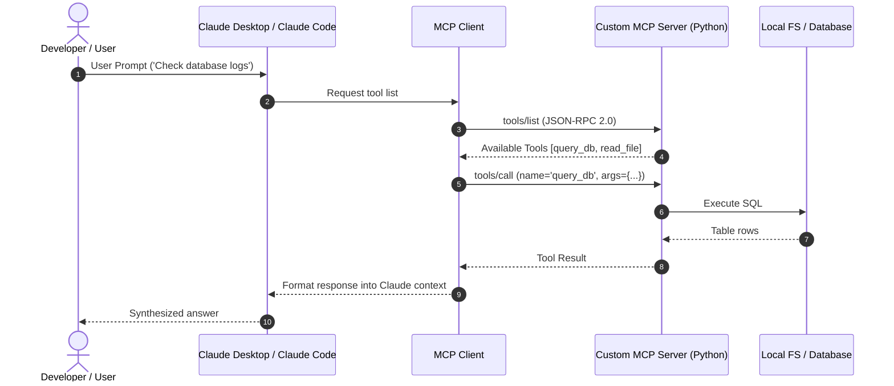

# 📹 How to build MCP Clients ｜ MCP Trilogy

<div className="video-card" style={{border: '1px solid #30363d', borderRadius: '8px', padding: '16px', marginBottom: '24px', background: 'rgba(56, 139, 253, 0.05)'}}>
  <div style={{display: 'flex', gap: '16px', flexWrap: 'wrap'}}>
    <div><strong>Instructor:</strong> Nitish Singh (CampusX)</div>
    <div><strong>Duration:</strong> 40m 0s</div>
    <div><strong>Playlist:</strong> Model Context Protocol Masterclass (CampusX)</div>
    <div><strong>Watch Link:</strong> <a href="https://www.youtube.com/watch?v=o4ajsc-tSBc" target="_blank" rel="noopener noreferrer">YouTube Lecture ↗</a></div>
  </div>
</div>

## 📌 Executive Summary & Learning Objectives

This lecture covers **How to build MCP Clients ｜ MCP Trilogy**, focusing on production implementations, edge cases, and industry standards:
- Core intuition, architecture, and underlying mechanisms.
- Key differences between theoretical research implementations and scalable enterprise patterns.
- Concrete Python walkthroughs, error recovery, and performance optimization.

---

## 🏗️ Architecture & Conceptual Workflow



---

## 📖 Core Concepts & Technical Deep Dive

### 1. Architectural Foundations
In modern production AI engineering, **How to build MCP Clients ｜ MCP Trilogy** is essential for ensuring reliability, low latency, and deterministic outcomes. As AI systems evolve from naive prompt-in / completion-out scripts into distributed systems, engineers must handle:
- **State management & consistency:** Ensuring intermediate states and tool invocations are tracked.
- **Error boundaries & recovery:** Graceful degradation when external LLMs or vector stores encounter rate limits or network partitions.
- **Resource utilization & cost efficiency:** Caching common queries and reducing unnecessary foundation model token expenditure.

### 2. Operational Considerations
- **Latency Optimization:** Pre-computing embeddings, utilizing asynchronous non-blocking event loops, and streaming tokens via Server-Sent Events (SSE).
- **Security & Sandboxing:** Validating inputs before ingestion, sanitizing LLM outputs, and isolating tool execution environments.

---

## 💻 Production Implementation Walkthrough

```python
from mcp.server.fastmcp import FastMCP

# Initialize FastMCP Server
mcp = FastMCP("Production AI Tools Server")

@mcp.tool()
def calculate_token_cost(input_tokens: int, output_tokens: int, model: str = "gpt-4o") -> dict:
    """Calculate total API cost given token counts."""
    rates = {
        "gpt-4o": {"input": 2.50 / 1_000_000, "output": 10.00 / 1_000_000},
        "claude-3-5-sonnet": {"input": 3.00 / 1_000_000, "output": 15.00 / 1_000_000},
    }
    rate = rates.get(model, rates["gpt-4o"])
    cost = (input_tokens * rate["input"]) + (output_tokens * rate["output"])
    return {"model": model, "total_cost_usd": round(cost, 6)}

if __name__ == "__main__":
    # Runs stdio transport protocol for Claude Desktop & Claude Code
    mcp.run(transport="stdio")
```

---

## 💡 Production Best Practices & Tips

:::tip Production Deployment Guideline
When deploying How to build MCP Clients ｜ MCP Trilogy in enterprise environments, always configure automated retries with exponential backoff and telemetry tracing (such as OpenTelemetry or LangSmith).
:::

:::warning Common Failure Modes
Watch out for state contamination across concurrent requests. Ensure each session or user interaction uses an isolated thread ID or execution context.
:::

---

## 🎯 Key Takeaways & Quick Reference

| Dimension | Production Standard | Pitfall to Avoid |
| :--- | :--- | :--- |
| **Execution** | Async / Non-blocking with timeouts | Synchronous blocking calls in event loops |
| **Data Validation** | Strict Pydantic v2 schemas | Untyped dictionary access |
| **Monitoring** | Distributed tracing & latency percentiles | Relying only on standard console logs |

## ⏱️ Lecture Timeline & Key Topics

| Timestamp | Key Topic / Concept Discussed |
| :--- | :--- |
| **00:00:00** | हाय गाइस, माय नेम इज नितीश एंड यू वेलकम... |
| **00:09:27** | चाहूंगा कि इस पूरे कोड में आपको असिंक... |
| **00:19:52** | हमारा एलएलएम कि A 12 देना, B1 देना। तो... |
| **00:30:28** | चलेगा रिस्पांस के अंदर जितने टूल कॉल्स... |
| **00:39:58** | में। बाय।... |


---

---

## 📜 Complete Lecture Transcript (English)

> **Language:** English | **Source:** `08 - How to build MCP Clients ｜ MCP Trilogy ｜ CampusX.hi-orig.srt` | **Total Segments:** 20 | **Word Count:** ~6,788 words

<details>
<summary><b>Click to expand full chronological transcript (20 timestamped intervals)</b></summary>

#### ⏱️ [00:00 ➔ 00:02]

हाय गाइस, माय नेम इज नितीश एंड यू वेलकम टू माय YouTube चैनल। इस वीडियो में हम लोग अपना एमसीपी प्लेलिस्ट कंटिन्यू करेंगे। अह वीडियो को स्टार्ट करने के पहले मैं आपके सामने एक बार अपोलजाइज करना चाहूंगा कि इस वीडियो को बनाने में काफी डिले हो गया और उसका प्राइमरी रीज़न ये था कि मैंने एक छोटा सा ब्रेक लिया था YouTube से। दैट इज़ व्हाई मैं वीडियो नहीं बना पा रहा था। ठीक है? सो अब एक बार वीडियो को स्टार्ट करने के पहले एक क्विक रिवीजन ले लेते हैं कि हमने इस प्लेलिस्ट में अभी तक क्या-क्या कवर किया है। सो इस प्लेलिस्ट में अभी तक मैंने सात वीडियोस डाले हैं और इस प्लेलिस्ट को शुरू करने के पहले मैंने आपको बताया था कि दिस विल बी लाइक अ मिनी प्लेलिस्ट जहां पे आपको एमसीपी का एक बेसिक आईडिया लग जाएगा। और कॉनसेप्चुअली मैंने इस पूरे के पूरे प्लेलिस्ट को तीन पार्ट्स में डिवाइड किया था। व्हाई, व्हाट, हाउ? तो वीडियो की शुरुआत की थी मैंने एक ट्रेलर वीडियो से जहां पर मैंने आपको एमसीपी का पोटेंशियल दिखाया था विद द हेल्प ऑफ अ एग्जांपल जहां पे मैंने एक न्यूज़ लेटर बनाने का पूरा प्रोसेस दिखाया था। कैसे आप एमसीपी से ये कर सकते हो। फिर हम वाई वाले पार्ट में घुस गए टू अंडरस्टैंड कि एमसीपी की जरूरत क्या है? फिर आया सबसे डिटेल्ड पार्ट इस प्लेलिस्ट का व्हिच वाज़ द वॉट पार्ट जहां पे हमने दो बहुत इंपॉर्टेंट चीजें देखी। फर्स्ट एमसीपी का आर्किटेक्चर। हमने एक डीप ड्राइव लिया और सेकंड एमसीपी लाइफ साइकिल। एमसीपी एग्जैक्टली काम कैसे करता है शुरू से एंड तक वो हमने देखा। फिर हम हाउ वाले पार्ट में आ गए और हाउ वाले पार्ट में हमने सबसे पहले तो देखा कि प्रैक्टिकली आप एमसीपी को यूज़ कैसे करते हो। फिर हमने खुद के सर्वर्स बनाना सीखा। खुद के सर्वर्स में भी हमने दोनों टाइप के सर्वर्स बनाना सीखा। हमने लोकल सर्वर्स भी बनाए और हमने रिमोट सर्वर्स भी बनाए। अब हम इस प्लेलिस्ट का आखिरी कंपोनेंट कवर करेंगे। दैट इज हाउ टू बिल्ड एमसीपी क्लाइंट्स। सो अभी तक आपने देखा होगा कि जो भी सर्वर्स हमने बनाए उनको यूज़ करने के लिए हमें क्लॉट डेस्कटॉप को यूज़ करना पड़ा जिसके अंदर खुद का क्लाइंट होता है। बट व्हाट इफ आप अपना खुद का चैटबॉट बना रहे हो। तो उस चैटबॉट को आप कैसे एमसीपी सर्वर

#### ⏱️ [00:02 ➔ 00:04]

से कनेक्ट कर सकते हो वो हम आज के वीडियो में देखेंगे बाय मेकिंग आवर ओन क्लाइंट। तो क्लाइंट बनाने के जितना मैंने रिसर्च किया देयर आर मल्टीपल वेज़ मल्टीपल लाइब्रेरीज जैसे कि अगर आप चाहो तो आप एमसीपी की ऑफिशियल लाइब्रेरी की हेल्प से भी क्लाइंट बना सकते हो। अगर आप चाहो तो एमसीपी जो लाइब्रेरी हमने कवर की है उसकी हेल्प से भी क्लाइंट बना सकते हो। एंड देयर इज़ दिस थर्ड ऑप्शन अ जिसका नाम है लैंगचेन एमसीपी अप्टर्स। सो अगर आप इस लाइब्रेरी के बारे में जाकर पढ़ोगे तो यहां लिखा हुआ है दिस लाइब्रेरी प्रोवाइड्स अ लाइट वेट रैपर दैट मेक्स एमसीपी टूल्स कंपैटिबल विद लैंग चेन एंड लैंग्राफ्ट। तो ये एक छोटी सी रैपर लाइब्रेरी है जिसकी हेल्प से आप अ लैंग चेन और लैंग ग्राफ में अ एमसीपी क्लाइंट्स बना सकते हो। ठीक है? तो वी आर गोइंग टू यूज़ दिस पर्टिकुलर लाइब्रेरी टू बिल्ड आवर क्लाइंट्स एमसीपी क्लाइंट्स। और उसका सिंपल रीजन ये है। एक्चुअली दो रीज़ंस हैं। पहला रीजन ये है कि ये मुझे सबसे सिंपल तरीका लगा एमसीपी क्लाइंट्स बनाने का। सेकंड सिंस ये बहुत क्लोजली लैंग चेन और लैंग्राफ के यूनिवर्स से कनेक्टेड है। तो ये हमें ज्यादा काम आएगा। बिकॉज़ हम ऑलरेडी लैंग्राफ और लैंग चेन के साथ काम करते आ रहे हैं। ठीक है? तो बिकॉज़ ऑफ़ दीज़ टू रीज़ंस हम इस लाइब्रेरी को यूज़ कर रहे हैं। बट ट्रस्ट मी सिंस आपको कांसेप्ट्स अब पता चल गए हैं तो आप बहुत आसानी से बाकी दोनों लाइब्रेरीज में भी ये काम कर सकते हो। ठीक है? तो आज का हमारा गोल बहुत सिंपल सा है। वी आर गोइंग टू मेक अ चैटबॉट। एक एमसीपी चैटबॉट हम बनाने वाले हैं। जहां पे आप नॉट ओनली नॉर्मल चैटिंग कर सकते हो। बट हमने कुछ एमसीपी सर्वर्स भी अटैच किए हैं बिहाइंड द सीन्स इस पर्टिकुलर चैटबॉट के साथ। आप उन एमसीपी सर्व से भी बात कर सकते हो। तो मैंने क्या किया है? मैंने इस चैटबॉट के साथ दो एमसीपी सर्वर्स अटैच किए हैं। एक है मैथ्स एमसीपी सर्वर जिसकी हेल्प से आप मैथमेटिकल कैलकुलेशंस कर सकते हो। सेकंड वही एक्सपेंस ट्रैकिंग वाला

#### ⏱️ [00:04 ➔ 00:06]

एमसीपी सर्वर मैंने अटैच किया है। जिसकी हेल्प से आप अपने एक्सपेंसेस ट्रैक कर सकते हो। एक्सपेंसेस ऐड कर सकते हो। ठीक है? तो ये दोनों एमसीपी सर्वर्स बिहाइंड द सीन इस चैटबॉट के साथ अटैच्ड हैं। और ये पूरा चैटबॉट इज वर्किंग एज अ नाइस जीयूआई। ठीक है? तो इस पूरे वीडियो में हमारा जो प्लान ऑफ अटैक है वो यह है कि हमें एक चैटबॉट बनाना है जो बिहाइंड द सीन्स दो एमसीपी सर्वर्स के साथ कनेक्टेड होगा। एक होगा मैथ्स वाला और एक होगा एक्सपेंस ट्रैकिंग वाला। और इसमें भी थोड़ी वैरायटी लाने के लिए यह जो मैथ सर्वर है यह एक लोकल एमसीपी सर्वर होगा और एक्सपेंस ट्रैकिंग वाला एक रिमोट एमसीपी सर्वर होगा। तो दोनों फ्लेवर देने के लिए मैंने ये दोनों एमसीपी सर्वर्स रखे हैं। तो हमारा प्लान ऑफ एक्शन बहुत सिंपल है। हम सबसे पहले एकदम स्क्रैच से कोड लिख करके लोकल वाला जो एमसीपी सर्वर है मैथ्स वाला उसको कनेक्ट करेंगे। उसके बाद हम एक्सपेंस ट्रैकिंग वाला जो हमारा रिमोट सर्वर है उसको कनेक्ट करेंगे। और फिर हम इस पूरे के पूरे कोड को एक यूआई में कन्वर्ट कर देंगे विद द हेल्प ऑफ स्ट्रीम। मजे की बात यह है कि आप चाहो तो और दूसरे एमसीपी सर्वर्स भी यहां पे कनेक्ट कर सकते हो। मैं आपको बताऊंगा कैसे? बहुत ही सिंपल है। और उससे क्या फायदा होगा कि जो भी मैंने आपको एमसीपी सर्वर्स दिखाए हैं इस पूरे प्लेलिस्ट में फॉर एग्जांपल मैंने जो आपको मानिम वाला सर्वर दिखाया है जिसकी हेल्प से आप बहुत खूबसूरत विजुअलाइजेशंस बना सकते हो। उसको भी आप अपने पर्सनल चैटबॉट के साथ अपने खुद के चैटबॉट के साथ अटैच कर पाओगे। ठीक है? तो ऑल इन ऑल दिस इज़ गोइंग टू बी अ वेरी इंटरेस्टिंग वीडियो और आई एम वेरी वेरीरी होपफुल कि आप ये पूरा वीडियो देखोगे बिकॉज़ अगर आप पूरा नहीं देखोगे तो फिर शायद आप चीजों को समझ नहीं पाओगे। ठीक है? सो नाउ दैट द इंट्रोडक्शन इज़ क्लियर। लेट्स स्टार्ट द वीडियो। तो चलो गाइस अब हम लोग कोड करना स्टार्ट करते हैं। स्टेप बाय स्टेप हम अप्रोच करेंगे इस पूरी चीज को। सबसे पहले हम क्या करेंगे कि अपने

#### ⏱️ [00:06 ➔ 00:08]

एमसीपी क्लाइंट को बना करके उसे हम एक लोकल एमसीपी सर्वर के साथ कनेक्ट करेंगे। फिर हम उसको रिमोट एमसीपी सर्वर के साथ कनेक्ट करेंगे। ठीक है? तो पहले एक बार मैं आपको दिखा देता हूं कि हमारा यहां लोकल एमसीपी सर्वर है कौन सा। तो ये मैंने एक छोटा सा मैथ्स सर्वर बनाया है जो आपके लिए अरिथममेटिक कैलकुलेशंस करके दे सकता है। ठीक है? वही सिंपल प्लस माइनस, मल्टीप्लिकेशन एक्सट्रा। और ये फिलहाल मेरे मशीन पे है। मेरे डेस्कटॉप पे है। वि मींस दिस इज अ लोकल एमसीपी सर्वर। ठीक है? तो एक बार मैं आपको ये टेस्ट करके दिखा देता हूं। फिर हम क्लाइंट को बनाना शुरू करेंगे। तो आई विल गो टू टर्मिनल और मैं कमांड लिखूंगा यूवी रनस्ट एमसीp बिकॉज़ ये हमनेस्ट एमसीपी में बनाया है। डेव मेन डॉट पीवाई। यह कमांड एमसीपी इंस्पेक्टर को स्टार्ट करेगा और वहां पर आप टेस्ट कर सकते हो कि यह सर्वर सही से काम कर रहा है कि नहीं। ठीक है? दिस इज द सर्वर। एक बार इससे कनेक्ट कर जाते हैं। अ कुछ तो यहां पे वार्निंग आई है बट आई गेस टूल्स काम कर रहे हैं। देखो ये रहे हमारे टूल्स। ठीक है? छह अरिथमैटिक ऑपरेशंस हैं। ऐड सब्ट्रैक्ट। मान लो हम मॉड्यूलस को यूज़ करना चाहते हैं। तो यहां पे हमने लिखा 21। यहां पे हमने लिखा सेवन और रन टूल पे क्लिक किया। आंसर आया ज़ीरो। ठीक है? तो दिस इज़ आवर लोकल एमसीपी सर्वर। ठीक है? अब हमें क्या करना है? हमें अपना क्लाइंट बनाना है और उस क्लाइंट को इस सर्वर के साथ कनेक्ट करना है। ठीक है? फिलहाल मैं इस टूल को बंद कर दे रहा हूं। यह जो एमसीपी इंस्पेक्टर टूल है उसको भी मैं बंद कर दे रहा हूं। सो मैंने यहां पे स्टेप बाय स्टेप चीजें लिख रखी हैं। हम इन स्टेप्स को फॉलो करेंगे। सबसे पहले आपको क्या करना है? आपको यूवी इंस्टॉल करना है। ठीक है? मैं एक बार साइज थोड़ा बड़ा कर देता हूं। सो आपको लिखना है पिप इंस्टॉल यूवी। मेरे मशीन पे ऑलरेडी इंस्टॉल्ड है। अ आप कर

#### ⏱️ [00:08 ➔ 00:10]

लेना। उसके बाद सेकंड काम आपको क्या करना है कि यू हैव टू क्रिएट अ न्यू फोल्डर। तो मैंने डेस्कटॉप पे ये फोल्डर बना लिया है। फिलहाल इसके अंदर कुछ भी नहीं है। ठीक है? तो नेक्स्ट व्हाट वी विल डू इज़ कि हम इस फोल्डर को ओपन कर लेंगे वीएस कोड में। ठीक है? ये हमारा फोल्डर हो गया। और उसके बाद हमें क्या करना है? हमें इस फोल्डर के अंदर यूवी को इनिशियलाइज़ करना है। सो वी विल राइट यूवी इनट डॉट। ठीक है? इनिशियलाइज़ हो गया। उसके बाद हमें क्या करना है? ये कुछ डिपेंडेंसीज़ को इंस्टॉल करना है। ठीक है? ठीक है? क्या-क्या डिपेंडेंसीज़ हैं? लंग चेन है, लंगचेन ओपन एi है, लंग चेन एमसीपी अप्टर्स है जिसकी हेल्प से हम क्लाइंट को बिल्ड करेंगे। Python. आपको पता ही है स्ट्रीमलेट UI के लिए। ठीक है? तो एक काम करते हैं। इस कमांड को रन करते हैं। एंड यू कैन सी हमारा पूरा का पूरा इंस्टॉल कंप्लीट हो गया। ठीक है? अब हम क्या करेंगे? यहां पे हम अपना क्लाइंट बिल्ड करेंगे। अब क्लाइंट हम स्टेप बाय स्टेप बिल्ड करेंगे। ठीक है? तो मल्टीपल वर्जनंस होंगे हमारे क्लाइंट के। तो सबसे पहले वर्जन को हम क्लाइंट 1py बुला रहे हैं। ठीक है? और यहां पे अब हमें क्या करना है? अपना कोड लिखना स्टार्ट करना है। सो अब क्लाइंट को हम लोग बहुत स्टेप बाय स्टेप डेवलप करेंगे। सबसे पहले मैं आपको ये दिखाता हूं कि कैसे आप क्लाइंट को सर्वर के साथ कनेक्ट कर सकते हो। कोड लिखने के पहले एक चीज आपको बताना चाहूंगा कि इस पूरे कोड में आपको असिंक अवेट फंक्शनैलिटी दिखाई देगी Python की। सो अगर आपको असिंकावेट नहीं आता है तो प्लीज मेक श्योर आप एक क्विक वीडियो देख के आ जाओ सो दैट आपको ये कोड थोड़ा और बेटर समझ में आए। ठीक है? तो सबसे पहले आपको क्या करना है? आपको इंपोर्ट करना है असिंकाओ को। सेकंड आपको लैंगचेन एमसीपी अप्टर्स डॉट क्लाइंट से इंपोर्ट करना है मल्टी सर्वर एमसीपी क्लाइंट। मल्टी सर्वर एमसीपी क्लाइंट हम इसलिए यूज कर रहे हैं बिकॉज़ हम अपने इस क्लाइंट को मल्टीपल

#### ⏱️ [00:10 ➔ 00:12]

सर्वर्स के साथ कनेक्ट करेंगे। उसके बाद एक काम करते हैं। सबसे पहले स्केलेटन कोड लिख लेते हैं। तो सबसे पहले आपको चाहिए है एक मेन फंक्शन और ये जो मेन फंक्शन है ये असिंक्रोनोस होगा। ठीक है? इसीलिए इसके आगे हमने लगा दिया है असिंक कीवर्ड। ठीक है? और उसके बाद एक काम और करते हैं। ये कोड भी लिख लेते हैं। तो ये हो गया हमारा स्केलेटन कोड। सिंपल सा कोड है। अ हमारे पास एक मेन फंक्शन है जो कि असिंक्रोनसली रन हो रहा है। और इफ नेम इक्वल टू मेन के अंदर से हम इस मेन फंक्शन को कॉल कर रहे हैं विद द हेल्प ऑफ़ असिंक आईo डॉट रन। ठीक है? इससे क्या होगा? यह मेन फंक्शन असिंक्रोनसली रन हो जाएगा। अब आता है सवाल कि कैसे आप इस क्लाइंट को सर्वर के साथ कनेक्ट कर सकते हो? तो ये काम हम दो स्टेप्स में करेंगे। पहले स्टेप में हमें क्या करना होगा कि जिस सर्वर के साथ हम कनेक्ट करना चाहते हो अपने क्लाइंट को उस सर्वर का कॉन्फ़िगरेशन इंफॉर्मेशनेशन हमें देना पड़ेगा और वो कॉन्फ़िगरेशन इनेशन यहां पे मैंने पेस्ट कर दिया। अब देखने में तो ये डरावना लग रहा होगा। बट ऑनेस्टली ये चीज़ आप पहले देख चुके हो। कहां पे देखा है आपने? जब मैंने आपको सर्वसर्स कनेक्ट करना सिखाया था क्लॉट डेस्कटॉप के साथ तो वहां पर मैंने आपको दिखाया था कि कैसे आप जो लोकल रिमोट लोकल एमसीपी सर्वर्स होते हैं उनको आप क्लॉट डेस्कटॉप के साथ कनेक्ट करते हो हम जो क्लड का कॉन्फिगन फाइल है उसको ओपन करते हैं और वहां पे इस तरह का कॉन्फिग को पेस्ट करते हैं। ठीक है? तो यहां पे भी हम सेम काम कर रहे हैं। हम जिस एमसीपी सर्वर के साथ कनेक्ट करने जा रहे हैं, मैंने उसका नाम मैथ रखा है और मैंने ये बताया है ट्रांसपोर्ट एसटीडीआईओ है। व्हिच मींस कि ये सर्वर आपका एक लोकल एमसीपी सर्वर है। उसके बाद आगे जो दो चीजें हैं ये उस लोकल एमसीपी सर्वर को स्टार्ट करने का कमांड है। ठीक है? सो अगर आप देखो कमांड में मैंने क्या लिखा है? कमांड में मैंने यूवी का पाथ दिया है। तो इस पूरी चीज को आप हटा के सिर्फ यूवी इमेजिन कर सकते हो। उसके बाद आगे जो

#### ⏱️ [00:12 ➔ 00:14]

आर्गुमेंट्स हैं वो भी बहुत सिंपल है। यहां पे हमने लिखा है यूवी यूवी के आगे रन रन के आगे फास्ट एमसीपी उसके बाद रन और ये पाथ है हमारी मेन डॉटpy फाइल का जो अभी मैंने आपको दिखाया डेस्कटॉप के ऊपर एमसीp मैथ सर्वर बोल के फोल्डर है। उसके अंदर मेन डॉट py है। यहीं पे मैंने कोड लिख रखा है अपने सर्वर का। ठीक है? तो इन अ वे मैंने यहां पे एक कमांड दिया है जिसकी हेल्प से हमारा क्लाइंट इस सर्वर को स्टार्ट कर सकता है। बिकॉज़ मैंने आपको बताया था आर्किटेक्चर वाले वीडियो में कि जब भी एसटीडीआईओ के ऊपर कम्युनिकेशन हो रहा होता है लोकल सर्वर्स के साथ आप काम कर रहे होते हो तो क्लाइंट जो होता है वो स्टार्ट करता है सर्वर को। तो इसीलिए हमने ये कमांड यहां पे प्रोवाइड किया। अब आपको क्या करना है? यहां पे आना है और आपको सिंपली मल्टी सर्वर एमसीपी क्लाइंट का एक इंस्टेंस क्रिएट करना है और यहां पे आपको सर्वर्स ऑब्जेक्ट सर्वर्स जो डिक्शनरी हमने क्रिएट की है इसका इंफॉर्मेशन पास कर देना है और इससे हमें पलट के एक क्लाइंट मिल जाएगा। और अब मुझे क्या करना है? नेक्स्ट काम मुझे इस क्लाइंट की हेल्प से हमारे लोकल एमसीपी सर्वर पे जो भी टूल्स हैं उनको फैच करना है। तो मैं लिखूंगा अवेट क्लाइंट डॉट गेट टूल्स और इस कमांड की हेल्प से क्या होगा? जितने भी टूल्स मेरे इस लोकल एमसीपी सर्वर पे हैं वो सब मुझे मिल जाएंगे। और उसको मैं इस वेरिएबल में स्टोर कर रहा हूं। और एक काम करते हैं। प्रिंट करके भी देख लेते हैं कि इन टूल्स के अंदर हमें क्या मिल रहा है। तो मैंने सेव किया इस पूरे कोड को। अभी तक कुछ खास हमने किया नहीं है। सिंपली ये कॉन्फ़िगरेशन बताया है। ये ऑब्जेक्ट बनाया है और इस ऑब्जेक्ट की हेल्प से हमने उस सर्वर के सारे टूल्स फैच किए हैं। ठीक है? सो, एक बार रन करते हैं इसको। अब यहां पे देखो आपको सबसे पहले एक चीज़ दिखाई देगी कि आपके क्लाइंट ने सर्वर को स्टार्ट किया। ठीक है? ट्रांसपोर्ट एसटीडी आईo है और उसके बाद यह जो आपको एक बड़ी सी लिस्ट

#### ⏱️ [00:14 ➔ 00:16]

दिखाई दे रही है, यह लिस्ट है एक्चुअली आपके टूल्स की लिस्ट। ठीक है? सो, आपको यहां पे दिखाई देगा सबसे पहला जो टूल है, उसका नाम है ऐड। उसके बाद जो दूसरा टूल है उसका नाम है सबट्रैक्ट। सिमिलरली और आगे के टूल्स हैं मल्टीप्लाई, डिवाइड और जो भी हैं। ठीक है? पावर हो गया और लास्ट में एक मॉड्यूलस होगा। तो यहां पर हमें क्या मिल गया? इन सारे टूल्स का एक्सेस मिल गया। एक काम और कर लेते हैं। हम इस लिस्ट को ये जो लिस्ट हमें मिला है टूल्स का इसको हम लोग एक डिक्शनरी में कन्वर्ट कर देते हैं। और उस डिक्शनरी का फॉर्मेट कुछ ऐसा होगा। अ हम इसको बुलाएंगे नेम टूल्स बोल के। और फॉर्मेट ऐसा होगा कि यहां पर टूल का नाम होगा और यहां पर वो टूल खुद होगा। इस फॉर्मेट में लाने के लिए क्या करेंगे? हम एक लूप चलाएंगे फॉर ईच टूल इन टूल्स लिस्ट। व्हाट वी आर डूइंग इज कि ऊपर एक नेम टूल बोल करके डिक्शनरी बना ले रहे हैं। एम्प्टी डिक्शनरी और यहां पे हम लिख रहे हैं ये कोड नेम्ड टूल के अंदर टूल डॉट नेम को फेच कर रहे हैं। ठीक है? यह जो ऑब्जेक्ट है स्ट्रक्चर टूल इसका नेम एट्रिब्यूट को फच कर रहे हैं जिसमें टूल का नाम है और उसके अंदर हम इस पूरी की पूरी चीज को डाल दे रहे हैं। और ऐसा करने के बाद मैं आपको दिखाता हूं कि नेम टूल कैसा दिख रहा है। और फिलहाल मैं ये टूल्स यहां पे प्रिंट नहीं करूंगा। ठीक है? सेव किया। रन किया। अब ये थोड़ा सा बेटर तरीके से स्ट्रक्चरर्ड है। ये एक डिक्शनरी बन गई। उसमें ऐड बोल के एक टूल है और ये रहा उस टूल का पूरा डेफिनेशन। ठीक है? फिर सबट्रैक्ट बोल के एक टूल है। ये उसका पूरा डेफिनेशन है। ठीक है? तो आई होप आपको यहां तक चीजें समझ में आ गई।

#### ⏱️ [00:16 ➔ 00:18]

हमने अभी तक क्या अचीव किया? हमने अपने क्लाइंट को सर्वर के साथ कनेक्ट किया और उस सर्वर के जितने भी टूल्स थे उनको हम फैच करके ले आए और उनको हम डिस्प्ले कर पा रहे हैं। ये हमने अभी तक अचीव किया है। अब टूल्स तो हमने बना लिए बट टूल्स को यूज़ करेगा कौन? द आंसर इज़ एलएलएम। तो हमें यहां पर एक एलएलएम चाहिए। तो हम ओपन एi का एलएलएम यूज़ करेंगे जैसा हम अभी तक करते आ रहे हैं। अ सो मैंने यहां पे एक डॉट एनबी फाइल बना ली है। वहां पे मैंने अपना ओपन एआई एपीआई की डाल दिया है। ये सब आपको ऑलरेडी आता है। और यहां पे हमें दो इंपोर्ट्स लेने पड़ेंगे। हमें सबसे पहले फ्रॉम डॉट वी हैव टू इंपोर्ट लोड डॉट फंक्शन और इस फंक्शन को हम लोग कॉल भी कर लेंगे। सेकंड हमें चाहिए होगा फ्रॉम लैंगचेन ओपन एआई इंपोर्ट चैट ओपन एआई और हम क्या करेंगे मेन फंक्शन के अंदर जाएंगे और इस जगह पे वी विल क्रिएट अ एलएलएम चैट ओपन एआई और लेट्स यूज़ gp5 मैंने कभी यूज़ नहीं किया एपीआई के थ्रू और नेक्स्ट हम क्या करेंगे हम इस एलएलएम में टूल्स को बाइंड कर देंगे। तो, हम लिखेंगे एलएलएम विथ टूल्स, यह एक नया एलएलएम हो गया। एंड दिस विल बी इक्वल टू एलएलएम डॉट बाइंड टूल्स और हम बाइंड टूल्स में आपका टूल्स को ऐड कर देंगे। अ कंफ्यूज मत होना। हम ये डिक्शनरी को ऐड नहीं कर रहे। ये आगे काम आएगी। फिलहाल हम इस लिस्ट को ऐड कर रहे हैं डायरेक्टली इस टूल्स को। और अब हम क्या करेंगे? हम एक सिंपल सा प्र्ट लिखेंगे। और प्र्प होगा व्हाट इज द प्रोडक्ट ऑफ लेट्स से 12 एंड 15 और हम क्या करेंगे? हम लिखेंगे अवेट

#### ⏱️ [00:18 ➔ 00:20]

एलएलएम विद टूल्स डॉट ए इनवोक और यहां पे हम अपना प्र्ट पास कर देंगे और इससे हमें रिस्पांस मिलेगा। हम उस रिस्पांस को प्रिंट करेंगे। तो पूरा फंडा बहुत सिंपल है। यह प्रिंट भी नहीं करते हैं। फिलहाल हमने देख लिया टूल कैसा दिखाई देता है। सो पूरा फंडा बहुत क्लियर है। हमने क्लाइंट को सर्वर के साथ कनेक्ट किया। टूल्स को फैच किया। उन टूल्स के साथ हमने एक नया एलएलएम बनाया और अब उस एलएलएम से हम एक क्वेश्चन पूछ रहे हैं। जिस क्वेश्चन में स्कोप है टूल को यूज़ करने का। ठीक है? तो रिस्पांस देख के हमें समझ में आ जाएगा कि क्या हमारा जो एलएलएम है वो इन टूल्स को आइडेंटिफाई एंड यूज कर पा रहा है कि नहीं। ठीक है? तो लेट्स रन दिस कोड। फिर से स्टार्ट हुआ हमारा सर्वर। एंड ये देखो ये है रिस्पांस। और इस रिस्पांस में हमें चाहिए है टूल कॉल्स बोल के एक एट्रिब्यूट। सो हुआ क्या कि टूल कॉल हुआ नहीं। सिंस यह एक सिंपल कैलकुलेशन था। आपके एलएलएम ने खुद से वह कैलकुलेशन कर दिया। तो मैं एक काम करता हूं। मैं प्र्ट चेंज करता हूं। मैं बोलता हूं यूजिंग द मैथ टूल। लेट्स से थोड़ा सा उसको गाइड कर रहे हैं। रन किया हमने फिर से। एंड यू कैन सी इस बार कंटेंट एंप्टी है। व्हिच मींस टूल कॉल हुआ है। ठीक है? लेट मी फाइंड दिस फॉर यू। यह देखो यहां पर यह टूल कॉल्स बोल के एक लिस्ट है। लिस्ट इसलिए है बिकॉज़ ऐसा हो सकता है कि एक साथ मल्टीपल टूल कॉल्स हो जाए। बट फिलहाल सिर्फ एक ही टूल कॉल हुआ है और उस टूल का नाम है मल्टीप्लाई और ये आर्गुमेंट्स उस टूल को देने को बोल रहा है हमारा एलएलएम कि A 12 देना, B1 देना। तो अभी तक का प्रोग्रेस यह है कि क्लाइंट सर्वर से कनेक्ट हो गया है। क्लाइंट के

#### ⏱️ [00:20 ➔ 00:22]

पास एक एलएलएम है और उस एलएलएम के पास इन टूल्स का एक्सेस है। और अब हम जब प्र्प कर रहे हैं तो हमारा एलएलएम समझ पा रहा है कि उसको कौन से टूल को इनवोक करना चाहिए। ठीक है? तो उसका डेफिनेशन हमारे पास आ गया। बट अभी काम आधा ही हुआ है। नेक्स्ट काम क्या है कि हमें इस टूल को इनवोक करना है। इनवोक करना है मतलब इस टूल का अभी बस हमें बताया जा रहा है कि यह टूल आप यूज़ करो विद दिस इनपुट। बट इसको यूज़ करना भी तो पड़ेगा ना। तो नेक्स्ट स्टेप में हम यही करेंगे। हम इस टूल को यूज़ करेंगे। तो यह करने के लिए हम सबसे पहले क्या करेंगे कि ये जो एलएलएम का रिस्पांस है इसके अंदर से हम सबसे पहले ये फाइंड आउट करेंगे कि एलएलएम हमें कौन सा टूल यूज़ करने को बोल रहा है। तो ये कैसे एक्सट्रैक्ट होगा? बहुत सिंपल है। हम लिखेंगे रिस्पांस डॉट टूल कॉल्स। ठीक है? टूल कॉल्स एक लिस्ट है तो हम उसमें से ज़ीरोथ आइटम को निकालेंगे। मतलब फर्स्ट आइटम को निकालेंगे और उसका भी हमें सिंस इट इज़ अ डिक्शनरी अ तो हम क्या करेंगे? उस डिक्शनरी का नेम एट्रिब्यूट को फैच करेंगे। ठीक है? इससे हमें पता चल जाएगा कि एलएलएम हमें कौन सा टूल यूज करने को बोल रहा है। एंड यू कैन सी हमें मल्टीप्लाई टूल यूज़ करने को बोला जा रहा है। नेक्स्ट हम ये फाइंड आउट करेंगे कि उस मल्टीप्लाई टूल को हमें इनपुट क्या देने को बोला जा रहा है। ठीक है? तो एक काम करते हैं। इसको एक वेरिएबल में स्टोर कर लेते हैं। लेट्स कॉल इट सेलेक्टेड टूल। ठीक है? और व्हाट वी कैन डू नेक्स्ट इज कि इसको हम लोग कॉपी कर लेंगे और यहां पे लिखेंगे सेक्टेड टूल आर्गुमेंट्स और यहां पे हम डाल देंगे आर्स को और अब हम प्रिंट कर देंगे दोनों ही चीजों को। हम प्रिंट कर देंगे सेलेक्टेड टूल को और हम प्रिंट कर देंगे जो आर्गुमेंट है।

#### ⏱️ [00:22 ➔ 00:24]

सो अब इस कोड को अगर हम रन करें एंड यू कैन सी हमें बोला जा रहा है मल्टीप्लाई टूल को कॉल करने विद दी आर्गुमेंट्स। ठीक है? तो अब हमें यही काम करना है। तो देखो कैसे हम इस टूल को इनवोक करेंगे। सो हमारे पास हमारे सारे टूल्स नेम्ड टूल्स बोल के डिक्शनरी के अंदर हैं। ठीक है? अब हम क्या करेंगे? उस डिक्शनरी के अंदर से कौन से टूल को फैच करेंगे? मल्टीप्लाई वाले को। और मल्टीप्लाई वाले का नाम हमें सेक्टेड टूल वेरिएबल में मिल रहा है। ठीक है? और इसको इनवोक करने के लिए आप लिखोगे ए इनवोक और ए इनवोक के अंदर आप यहां पर भेज दोगे सेक्टेड टूल आर्गुमेंट्स और यह पूरी चीज आप अवेट के अंदर करोगे और इससे पलट के आपको मिल जाएगा टूल का रिजल्ट और वह मैं आपको दिखाता हूं। ठीक है? यह रहा हमारा कोड। एक बार फिर से रन करते हैं। एंड यू कैन सी द टूल रिजल्ट इज कमिंग आउट टू बी 180. ओके। सो अभी तक स्टेप बाय स्टेप अगर आप समझो तो हमने क्या-क्या किया? क्लाइंट को सर्वर से कनेक्ट किया। एलएलएम को हमने टूल्स प्रोवाइड कर दिए। एक प्र्प्ट भेजा। एलएलएम ने आइडेंटिफाई किया कि उसको कौन सा टूल किस इनपुट के साथ यूज करना चाहिए। हमने उस टूल को कॉल किया और वो आर्गुमेंट्स पास किए। टूल ने हमें रिजल्ट दे दिया। अब बस लास्ट स्टेप क्या हुआ है? क्या बचा हुआ है? कि हमें इस रिजल्ट को उठाना है और उसको वापस एलएलएम को देना है और बताना है कि टूल ने हमें यह रिजल्ट दिया है। आप यूजर को आंसर बता दो। तो इसके लिए हमें क्या करना पड़ेगा? हमें टूल मैसेज को यूज़ करना पड़ेगा। सो टूल मैसेज के लिए हमें सबसे पहले लैंग चेन कोर के अंदर से मैसेजेस के अंदर से इंपोर्ट करना पड़ेगा टूल मैसेज। और हम यहां पर आएंगे और यहां

#### ⏱️ [00:24 ➔ 00:26]

पर विल क्रिएट अ टूल मैसेज और इस टूल मैसेज में जो कंटेंट होगा वो होगा टूल का रिजल्ट और जो टूल यह मैसेज जनरेट कर रहा है उसका नाम सेक्टेड टूल के अंदर ऑलरेडी है। ठीक है? तो यह बन गया मेरा टूल मैसेज। अब बस हमें क्या करना है? हमें अपने एलएलएम विद टूल्स को उठाना है और उसको फिर से इनवोक करना है विद थ्री थिंग्स। फर्स्ट जो इनिशियल प्र्प था फिर उसका जो रिस्पांस था और फिर जो टूल मैसेज था। बेसिकली मैं पूरी हिस्ट्री पास कर रहा हूं। मैं सबसे पहले टूल को आई एम सॉरी एलएलएम को ये प्र्प्ट भी भेज रहा हूं। फिर उसने जो इनिशियल रिस्पांस दिया था जहां पर उसने मुझे बोला था कि मल्टीप्लाई वाले टूल को कॉल करो विद दीज़ आर्गुमेंट्स वो भी भेज रहा हूं और फाइनली टूल ने क्या रिजल्ट दिया वो भी भेज रहा हूं। ठीक है? और ये हो जाएगा मेरा फाइनल रिस्पांस। और इसी को मैं प्रिंट कर दूंगा। ठीक है? फाइनल रिस्पांस डॉट कॉनेंट। बिकॉज़ आई एम श्योर कि इस बार कंटेंट आएगा। ठीक है? तो एक बार रन करते हैं और एक काम करते हैं। ये जो अननेसेसरी प्रिंट स्टेटमेंट्स हैं इनको हटा देते हैं। वी डोंट नीड देम नाउ। ठीक है? तो दिस इज़ द एंटायर फ्लो सेव। लेट्स रन दिस। ओके? सो, द प्रॉब्लम इज़ दिस कि टूल मैसेज को बनाने के टाइम आपको टूल का आईडी भी देना पड़ता है। ठीक है? और टूल का आईडी आपको इस रिस्पांस में मिलेगा। जब टूल कॉल्स आपके पास आता है ना तो एक काम करते हैं। यहां पर हम लोग एक वेरिएबल और बना लेते हैं। सेलेक्टेड टूल आईडी बोल के। और ये हो जाएगा आपका रिस्पांस डॉट टूल कॉल्स

#### ⏱️ [00:26 ➔ 00:28]

का ज़ीरोथ का आईडी वाला वेरिएबल। एंड व्हाट वी विल डू इज़ यहां पे टूल नेम के बदले वी विल प्रोवाइड आईडी एंड द आईडी इज़ सेलेक्टेड टूल आईडी। ठीक है? अब रन करते हैं। एंड होपफुली एरर रॉल्व हो जाएगा। आई गेस द नेम इज़ टूल कॉल आईडी। फाइनल रिस्पांस 180 आ गया। ठीक है? तो, यह हमें एलएलएम ने बताया। एंड दिस इज़ द एंटायर फ्लो गाइज़। ठीक है? एक बार अगर आप देख लो तो बहुत सिंपल है। हमने क्लाइंट को सर्वर के साथ कनेक्ट किया। उस सर्वर के सारे टूल्स फैच किए। उन सारे टूल्स को बहुत अच्छे तरीके से एक डिक्शनरी में स्टोर कर लिया। एलएलएम बनाया। एलएलएम को टूल्स का पावर दिया। यहां पे क्वेश्चन पूछा। टूल ने हमें बताया कि कौन सा अह एलएलएम ने हमें बताया कि उसको कौन सा टूल यूज़ करना चाहिए। उस टूल का हमने सारा डिटेल फैच कर लिया। उसका नाम, कौन से आर्गुमेंट्स चाहिए उसका आईडी। फिर हमने उस टूल कॉल को एग्जीक्यूट किया। टूल मैसेज में रिजल्ट को डाला और दोबारा से एलएलएम को पूरा का पूरा हिस्ट्री दे दिया कि सबसे पहले क्या पूछा गया था? तुमने क्या रिप्लाई दिया? टूल ने क्या आंसर किया? और ये सब कुछ हमने एलएलएम के पास भेजा और जो फाइनल रिस्पांस था वो हमें मिल गया। और इस प्रोसेस में हमने अपने एमसीपी क्लाइंट को एमसीपी सर्वर के साथ कम्युनिकेट करवाया। अब ऐसा नहीं है कि आप नॉर्मल चैटिंग यहां पे नहीं कर सकते। आप यहां पर सिंपल चीजें भी पूछ सकते हो व्हाट इज द कैपिटल ऑफ इंडिया। ठीक है? और इस केस में आपका आईएलएम समझ जाएगा कि उसको कोई टूल कॉल करने की जरूरत नहीं है। एमसीपी यूज़ करने की जरूरत नहीं है। कोड फट गया। कोड इसलिए फट गया बिकॉज़ ये आगे वाले कोड की जरूरत नहीं थी। और

#### ⏱️ [00:28 ➔ 00:30]

कोई टूल कॉल हुआ नहीं। तो ये आगे का कोड वाज़ नॉट नेसेसरी। ठीक है? एक काम करते हैं। इस प्रॉब्लम को हेल्प हैंडल करते हैं कि अगर नॉर्मल कुछ क्वेश्चन पूछा जाए जहां पे टूल की जरूरत नहीं है तो नॉर्मल आंसर मिले और अगर टूल को कॉल किया गया एमसीपी को कॉल किया गया तो वो वाला कोड भी सही से काम करे। तो ये रहा गाइस सॉल्यूशन। हमने सिंपली एक इफ स्टेटमेंट लगा दिया कि जो फर्स्ट रिस्पांस आया है एलएलएम से अगर टूल्स कॉल बोल के एक एट्रिब्यूट नहीं है तो सिंपली रिस्पांस का कंटेंट प्रिंट कर दो और रिटर्न कर दो। बेसिकली यहीं से कोड को खत्म कर दो मेन फंक्शन को। बट अगर ये एट्रिब्यूट है तो फिर आप आगे का कोड एग्जीक्यूट करो। ठीक है? तो एक बार इसको रन करके देखते हैं। व्हाट इज द कैपिटल ऑफ इंडिया के ऊपर। अब कोई एरर नहीं आना चाहिए। एंड यू कैन सी एलएलएम का रिप्लाई इज़ न्यू दिल्ली। बट अगर यहां पे मैं कोई क्वेश्चन पूछूंगा व्हाट इज द रिमेंडर? ऑफ 2314 23 डिवाइडेड बाय 7 तो अब टूल कॉल होगा। ठीक है? एलएलएम का रिप्लाई इज़ टू। आई होप इट इज़ करेक्ट। ठीक है? आप क्रॉस चेक कर लेना। सो या गाइस ये हमने एक बेसिक सेटअप कंप्लीट कर लिया। ठीक है? अब हम नेक्स्ट देखेंगे कि कैसे आप अपने इस क्लाइंट के साथ मल्टीपल लाइब्रेरीज आई एम सॉरी मल्टीपल एमसीपी सर्वर्स को कनेक्ट कर सकते हो। अभी फिलहाल हमने सिर्फ एक एमसीपी सर्वर के साथ कनेक्ट किया है। अब मैं आपको दिखाता हूं कैसे आप इसको एक सेकंड एमसीपी सर्वर के साथ कनेक्ट कर सकते हो। एक छोटा सा चेंज गाइस मैंने और किया है और वो चेंज यह है कि अभी तक हमारा जो कोड था वो सिर्फ एक टूल कॉल को हैंडल कर सकता है। हमने इस तरीके से कोड लिखा था बट ऐसा हो सकता है कि आपका जो एलएलएम है वो आपको एक

#### ⏱️ [00:30 ➔ 00:32]

से ज्यादा टूल्स को कॉल करने का सजेशन दें। तो इन दैट केस हमारा कोड फेल कर जाएगा। इसलिए मैंने क्या किया? मैंने एक लूप के अंदर ये सारा काम कर दिया। जो भी हम टूल का इंफॉर्मेशन फैच कर रहे थे और जो भी हम टूल को एग्जीक्यूट कर रहे थे ये सारा काम हम लूप के अंदर कर रहे हैं और लूप कितनी बार चलेगा रिस्पांस के अंदर जितने टूल कॉल्स आइटम होंगे हमारे पास। ठीक है? दैट्स द ओनली चेंज दैट वी हैव डन। अब इससे ये फ्लैक्सिबिलिटी आ गई कि आपका एलएलएम आपको एक बार में एक टूल बोले एग्जीक्यूट करने या पांच टूल्स बोले एग्जीक्यूट करने आप वो कर सकते हो। ठीक है? तो ये फ्लेक्सिबिलिटी हमारे पास आ गई। अब नेक्स्ट हम क्या करेंगे? यहां पर एक और सर्वर ऐड करेंगे। और इस बार जो सर्वर हम ऐड करेंगे वो एक रिमोट एमसीपी सर्वर होगा। सो जो रिमोट एमसीपी सर्वर हम कनेक्ट करने वाले हैं अपने क्लाइंट के साथ वह एग्जैक्टली वही रिमोट एमसीपी सर्वर है जो मैंने लास्ट वीडियो में आपको बना के दिखाया था और डिप्लॉय करके दिखाया था। ठीक है? सो हमने एक्सपेंस ट्रैकिंग का एक एमसीपी सर्वर बनाया था और उसको एमसीp डॉट क्लाउड इस प्लेटफार्म पे डिप्लॉय किया था। ये सब कुछ आपको इस लास्ट वीडियो में देखने को मिल जाएगा। प्लीज मेक श्योर आप ये वीडियो देखो। ठीक है? सो ये रहा हमारा एमसीपी सर्वर और हम इसको अटैच करेंगे कनेक्ट करेंगे अपने क्लाइंट के साथ। तो इसके लिए हमें क्या करना है कि हमारा ये जो कोड है इसमें सिंपली सर्वर्स के अंदर जाकर के एक दूसरा सर्वर का डेफिनेशन या कॉन्फ़िगरेशन ऐड कर देना है। ठीक है? और मैं इस सर्वर को बुला रहा हूं एक्सपेंस। और इसका ट्रांसपोर्ट है स्ट्रीमबल HTTP बिकॉज़ यह एक रिमोट एमसीपी सर्वर है और यहां पे हम उसका यूआरएल प्रोवाइड कर देंगे। यूआरएल कहां से मिलेगा? ये फास्ट एमसीपी क्लाउड से यहां पे हमारा यूआरएल है। ठीक है? एंड दैट्स इट गाइज़। इसके अलावा मुझे कुछ नहीं करना है। मैंने एक चेंज और कर दिया है कोड में।

#### ⏱️ [00:32 ➔ 00:34]

मैंने प्र्ट में ये प्र्प्ट लिख दिया है। ऐड एन एक्सपेंस ₹800 फॉर गोसरीज ऑन फोर्थ नवंबर। ठीक है? अब इस कोड को हम चलाएंगे और आप देखोगे फर्स्ट ऑफ ऑल कि हमारे पास और एडिशनल टूल्स आ गए हैं। बिकॉज़ हमने एक और सर्वर ऐड किया है और इस बार अ एक्सपेंस ट्रैकर वाले टूल्स को यूज़ करेगा हमारा एलएलएम। इनफैक्ट मैंने एक कोड और लिखा है यहां पे। एक छोटा सा कोड मैंने और ऐड किया है कि जितने भी नेम्ड टूल्स हैं, मैंने उनका नाम प्रिंट कराया है। जस्ट टू शो यू कि इस बार सिर्फ हमारे पास मैथ्स वाले टूल्स ही नहीं है। एक्सपेंस ट्रैकिंग वाले टूल्स भी हैं। ठीक है? सो अगर मैं इसको रन करूं देखो यहां पर हमारे अवेलेबल टूल्स में ऐड, सबट्रैक्ट, मल्टीप्लाई तो है ही बट साथ में ऐड एक्सपेंस, लिस्ट एक्सपेंस और समराइज भी आ गया। व्हाई? बिकॉज़ हमारा मल्टी सर्वर एमसीपी क्लाइंट इज़ नाउ कनेक्टेड टू मल्टीपल सर्वर्स। ठीक है? नाउ लेट्स होप कि ये सारा काम सही से हो जाए। ये देखो ये रहा हमारा फाइनल रिस्पांस। योर एक्सपेंस हैज़ बीन एडेड। डेट ये है, कैटेगरी ये है, अमाउंट ये है। उसके आगे उसने कुछ और सवाल भी पूछा है। बट यू गेट द आईडिया। ठीक है? तो इस तरीके से अब हमने अपने एमसीपी क्लाइंट में दो सर्वर्स को ऐड किया। अब मैं आपको एक और एमसीपी सर्वर ऐड करके दिखाता हूं। सो अगला जो एमसीपी सर्वर हम इंस्टॉल करेंगे या कनेक्ट करेंगे हमारे एमसीपी क्लाइंट के साथ वो है मानिम का एमसीपी सर्वर। सो अगर आपको याद होगा तो मैंने आपको इस पर्टिकुलर वीडियो में द हाउ वाले वीडियो में बताया था कि कैसे आप थ्री ब्लू वन ब्राउन जैसे एनिमेशन वीडियोस बना सकते हो विद द हेल्प ऑफ दिस पर्टिकुलर एमसीपी सर्वर। ठीक है? तो ये एमसीपी सर्वर को हमने कनेक्ट किया था क्लॉट डेस्कटॉप के साथ टू क्रिएट सच एनिमेशंस। बट अब हम रादर दैन कनेक्टिंग दिस टू क्लॉड डेस्कटॉप। इसको हम अपने खुद के क्लाइंट के साथ कनेक्ट करेंगे। ये पर्टिकुलर एग्जांपल मैं आपको सिर्फ इसलिए दिखा रहा हूं क्योंकि अभी तक जो दो सर्वर्स मैंने अटैच किए या कनेक्ट किए क्लाइंट के साथ वो मेरे बनाए हुए थे। ये पहला ऐसा एमसीपी सर्वर होगा जो किसी और ने बनाया है बट हम उसको यूज़ कर

#### ⏱️ [00:34 ➔ 00:36]

पाएंगे अपने क्लाइंट के साथ। तो अगेन आपको कुछ करना नहीं है। इस वीडियो में मैंने आपको जो कॉन्फ़िगरेशन दिखाया था, आपको एज इट इज उस कॉन्फ़िगरेशन को ऐड कर देना है। और बस वहां पे ट्रांसपोर्ट आपको एसटीडी आईo रखना है। सेम सेटअप फॉलो करना है। ये एमसीपी सर्वर आपके मशीन पे होना चाहिए। और ये सारे कमांड्स एंड आर्गुमेंट्स आपको एज़ इट इज़ पास करने हैं। अगर आपको नहीं समझ में आ रहा है, आई वुड रिकमेंड आप जाके यह वीडियो देखो। स्पेशली इस मार्क से 15 मिनट से लेके 33 मिनट के बीच में। वहां पे मैंने पूरा सेटअप करके दिखाया है क्लॉट डेस्कटॉप के साथ। आपको बस ये पीस ऑफ कोड चाहिए। इसको आप यहां पे अटैच कर दो। ठीक है? और एक चेंज और किया मैंने अपने इस कोड में और वो चेंज ये है कि मैंने यहां पे प्र्प्ट में लिखा है ड्रॉ अ ट्रायंगल रोटेटिंग इन प्लेस यूजिंग द मानिम टूल। ठीक है? अब रन करके देखते हैं कि क्या ये कोड काम कर रहा है कि नहीं। अब आप देखना कि हमारे टूल्स में नंबर ऑफ टूल्स बढ़ जाएंगे। यह देखो एग्जीक्यूट म्यूम कोड भी आ गया। क्लीन अप मानिम टेंपरेरी डायरेक्टरी भी आ गया। ठीक है? और अब वेट करते हैं। देखते हैं सच में क्या वीडियो जनरेट होता है या नहीं। एंड यू कैन सी ये रहा हमारा एनिमेशन वीडियो। एंड यू कैन क्लियरली सी एमआरएम जो एमसीपी सर्वर है वह काम कर रहा है। ठीक है? तो ये एक अच्छी चीज आपने सीख ली कि आप इंटरनेट से कोई भी सर्वर उठा के लाओ। उसको आप अपने क्लाइंट के साथ कैसे कनेक्ट करोगे। ये मैंने आपको बता दिया। अब यहां पे हमारा क्लाइंट का काम ऑलमोस्ट कंप्लीट हो गया है। एक-दो इंप्रूवमेंट्स यहां पे करते हैं। अ मैं आपको बताता हूं क्या-क्या इंप्रूवमेंट्स हम करेंगे। सो एक्चुअली एक ही इंप्रूवमेंट हमें करना है और वो इंप्रूवमेंट यह है कि अभी तक हम सारा का सारा जो कम्युनिकेशन कर रहे हैं हमारे एलएलएम और हमारे एमसीपी क्लाइंट से वो हमारे टर्मिनल विंडो के थ्रू कर रहे हैं। बट मैंने आपको वीडियो के शुरुआत में बताया था कि हम इंस्टेड बिल्ड करेंगे एक स्ट्रीमलेट बेस्ड जीयूआई जिसके थ्रू ये सारा काम होगा। तो जो इंप्रूवमेंट हमें

#### ⏱️ [00:36 ➔ 00:38]

करना है वो ये है कि ये जो पूरा का पूरा लॉजिक हमने यहां पे डेवलप किया है इसको एक स्ट्रीमलेट ऐप में कन्वर्ट करना है। ठीक है? तो मैंने क्या किया है? मैंने ये कोड ऑलरेडी लिख दिया है। एक नई फाइल बना दी क्लाइंट 2.py बोल के और इसके अंदर बिल्कुल सेम कोड है। मतलब लॉजिक सेम है। बिल्कुल सेम कोड नहीं है। ये कोड है स्ट्रीम का। और आप चाहो तो इसको एक बार जाके देख सकते हो। अ मैं ये पूरा कोड स्क्रैच से लिख के नहीं दिखाना चाहता। बिकॉज़ दिस वीडियो इज़ नॉट अबाउट हाउ टू बिल्ड GUI यूजिंग स्ट्रीमलेट। इंस्टेड हमें एमसीपी क्लाइंट बनाना सीखना था। तो हमने दोनों लॉजिक को मर्ज करके ये कोड लिख दिया है। थोड़ा डिस्क्रिप्टिव सा ही लिखा है मैंने चार्ट जीपीटी की हेल्प से। तो आप लोग एक बार जाके रीड कर सकते हो। बट लॉजिक इज़ प्रिटी मच द सेम। मैं आपको दिखाता हूं कि ये काम कैसे करेगा। यहां पे सर्वर वाला पार्ट आपको बिल्कुल सेम दिखाई देगा। फिर आपको अ यहां पे हमने चैट पॉट एलएलएम जो बनाया है वो सेम दिखाई देगा। यहां पे हमने अपना क्लाइंट बनाया है। यहां पे हम टूल्स फैच करके ला रहे हैं। वो सारा लॉजिक बिल्कुल सेम है। आपको थोड़ा सा स्ट्रीमलेट आना चाहिए इन ऑर्डर टू अंडरस्टैंड दिस कोड। ठीक है? तो मैं एक काम करता हूं। इसको मैं चला के दिखाता हूं आपको। और चलाने के लिए व्हाट वी विल डू इज़ कि एक नए टर्मिनल में हम इनफैक्ट मैं पुराने वाले टर्मिनल्स को क्लोज कर देता हूं। और लेट्स स्टार्ट विद अ न्यू टर्मिनल। और यहां पर हमें बस लिखना है स्ट्रीम रन। हमारी फाइल का नाम दैट इज क्लाइंट 2.py एंड यू कैन सी दिस इज द जीयूआई। यहां पे हम एक बार चैट करके देखते हैं। ठीक है? इट्स वर्किंग। नेक्स्ट लेट्स से शो मी ऑल द एक्सपेंसेस फ्रॉम लास्ट टू वीक्स। एंड यू कैन सी हमने जो एक एक्सपेंस ऐड किया था ग्रोसरीज का वह दिखाई दे रहा है। देयर इज ओनली वन प्रॉब्लम। ₹800 के बदले ₹800 दिखा रहा है। तो ठीक है दिस इज़ सम माइनर इशू। अ

#### ⏱️ [00:38 ➔ 00:39]

लेट्स आल्सो रन वन मोर प्र्प्ट। लेट्स से व्हाट इज द रिमेंडर? डिवाइडेड बाय 23 एंड इट सेस इट इज 13 ठीक है आप चेक कर सकते हो लास्टली अ मेक एन एनिमेशन वीडियो ऑफ अ सर्कल यूजिंग मम टूल एंड यू कैन सी दिस इज द वीडियो ठीक है काफी बढ़िया है। तो ये रहा हमारा जीयूआई एमसीपी क्लाइंट और इसमें हमने तीन सर्वर्स ऐड किए। बट मैंने आपको यह तरीका बता दिया है कि कैसे आप इसमें जितने मर्जी एमसीपी सर्वर्स ऐड कर सकते हो। ठीक है? तो वि दैट वी हैव कवर्ड हाउ टू बिल्ड एमसीपी क्लाइंट्स। ठीक है? ये एक वीडियो बचा हुआ था और काफी मैसेजेस आ रहे थे आपकी तरफ से। आई रियली होप ये वीडियो आपकी हेल्प करेगा। और अब हम क्या कर रहे हैं? हम वापस अपना फोकस लेके जा रहे हैं लैंडग्राफ्ट प्लेलिस्ट की तरफ जो इससे भी ज्यादा टाइम से पेंडिंग पड़ा हुआ है। एंड आई एम गेटिंग अ लॉट ऑफ़ कमेंट्स एंड मैसेजेस कि आप प्लीज उसको कंप्लीट करो। अ हमने ये एमसीपी वाला स्टार्ट ही इसीलिए किया था प्लेलिस्ट बिकॉज़ लैंडग्राफ में मुझे आपको एमसीपी पढ़ाना था। तो मैं अब वापस जाके लैंग्राफ्ट प्लेलिस्ट कंप्लीट करूंगा। आई नो यहां पे कुछ वीडियोस बाकी हैं थोड़े एडवांस टॉपिक्स के ऊपर। सैंपलिंग हुआ, एलिसिटेटिशन हुआ, अ ऑथेंटिकेशन हुआ बट वो हम कवर करेंगे। बट फर्स्ट आई वुड लाइक टू फोकस ऑन द लैंडग्राफ्ट प्लेलिस्ट। तो दैट इज़ माय प्लान गोइंग फॉरवर्ड। सो दैट्स इट फॉर द वीडियो गाइस। आई होप आपको यह वीडियो पसंद आया। अगर आपको वीडियो पसंद आया तो प्लीज लाइक करना और अगर आपने इस चैनल को सब्सक्राइब नहीं किया है तो प्लीज डू सब्सक्राइब। मिलते हैं नेक्स्ट वीडियो में। बाय।

</details>
