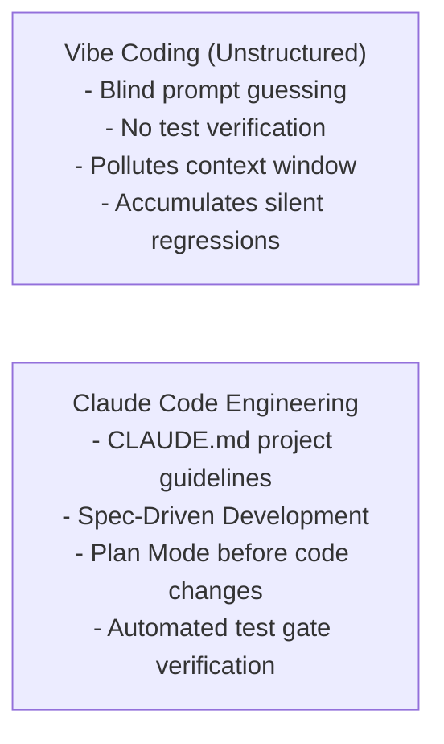

# 📹 Making Code Changes using Claude Code ｜ How to Add Image as Context

<div className="video-card" style={{border: '1px solid #30363d', borderRadius: '8px', padding: '16px', marginBottom: '24px', background: 'rgba(56, 139, 253, 0.05)'}}>
  <div style={{display: 'flex', gap: '16px', flexWrap: 'wrap'}}>
    <div><strong>Instructor:</strong> Nitish Singh (CampusX)</div>
    <div><strong>Duration:</strong> 1322</div>
    <div><strong>Course:</strong> Module 5: MCP & Claude Code</div>
    <div><strong>Watch Link:</strong> <a href="https://www.youtube.com/watch?v=-Lt-ntUDj-g" target="_blank" rel="noopener noreferrer">YouTube Lecture ↗</a></div>
  </div>
</div>

## 📌 Executive Summary

AI-assisted software development has evolved from unstructured "vibe coding" (blindly accepting generated code snippets) into rigorous, spec-driven engineering. Claude Code CLI provides an autonomous, agentic coding environment built for software engineers who require precision, test verification, and architectural discipline.

This lesson explores the engineering philosophy of Claude Code: context window hygiene, spec-driven development, test-first verification, and human oversight.

---

## 🏗️ System Architecture & Execution Flow



---

## 📖 Core Concepts & Technical Deep Dive

### 1. The Pitfalls of Vibe Coding
Unstructured AI coding leads to codebase degradation: models hallucinate non-existent internal libraries, introduce security regressions, and blow out context windows with sprawling, repetitive changes.

### 2. The Core Tenets of Claude Code Discipline
1. **Spec First:** Write clear architectural specifications and interfaces before writing implementation code.
2. **Context Hygiene:** Keep context clean using `/compact` and subagents to prevent context saturation.
3. **Automated Verification:** Run local test suites (`pytest`, `npm test`) immediately after every code modification.
4. **Inspect Diffs:** Never accept multi-file changes without reviewing unified git diffs.

---

## 💻 Production Implementation

```python
# CLAUDE.md project guidelines blueprint
"""
# Project Guidelines (CLAUDE.md)

## Commands
- Test Suite: pytest tests/ -v
- Lint & Format: ruff check . --fix
- Run Server: uvicorn main:app --reload

## Architectural Rules
- All database queries must use SQLAlchemy 2.0 async sessions.
- Enforce strict Pydantic v2 schemas on all endpoint request bodies.
- Never commit AWS credentials or API keys; use environment variables.
"""
print("Claude Code Engineering Discipline Guidelines initialized.")
```

---

## ⚙️ Production Gotchas & Best Practices

:::tip Establish CLAUDE.md Early
Create a comprehensive `CLAUDE.md` file at the root of your repository before starting work. This file acts as persistent memory for the coding agent.
:::

:::warning Review Git Diffs
Always inspect the unified git diff before allowing the agent to commit changes. Automated agents can occasionally touch unintended configuration files.
:::

---

## 📊 Architectural Reference & Comparison

| Dimension | Vibe Coding | Disciplined Agentic Coding |
| :--- | :--- | :--- |
| **Specifications** | Vague one-line prompts | Detailed PRDs / Spec-Driven markdown |
| **Verification** | Hope it runs | Automated test suites (`pytest`, `npm test`) |
| **Context Management**| Bloated single thread | Subagents + `/compact` context resets |
| **Code Review** | Blind acceptance | Line-by-line unified git diff inspection |

---

## 📚 Key Takeaways & Enterprise Checklist

- [ ] **Architecture Verification:** Ensure your design addresses latency, decoupled interfaces, and strict data validation contracts.
- [ ] **Deterministic Testing:** Run unit tests and golden dataset evaluations before shipping changes to staging or production.
- [ ] **Security & Observability:** Enforce input/output guardrails, scrub sensitive credentials/PII, and capture distributed traces.
- [ ] **Scalability & Sizing:** Calibrate model parameters, context limits, and compute instance requirements against projected request concurrency.
