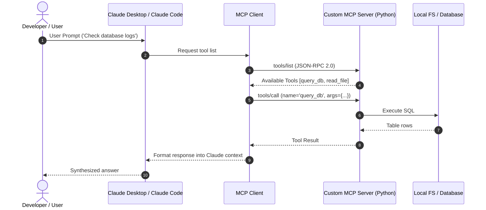

# 📹 Context Window Management in Claude Code

<div className="video-card" style={{border: '1px solid #30363d', borderRadius: '8px', padding: '16px', marginBottom: '24px', background: 'rgba(56, 139, 253, 0.05)'}}>
  <div style={{display: 'flex', gap: '16px', flexWrap: 'wrap'}}>
    <div><strong>Instructor:</strong> Nitish Singh (CampusX)</div>
    <div><strong>Duration:</strong> 35m 7s</div>
    <div><strong>Playlist:</strong> Agentic Coding with Claude Code (CampusX)</div>
    <div><strong>Watch Link:</strong> <a href="https://www.youtube.com/watch?v=lN5tLx2_7HQ" target="_blank" rel="noopener noreferrer">YouTube Lecture ↗</a></div>
  </div>
</div>

## 📌 Executive Summary & Learning Objectives

This lecture covers **Context Window Management in Claude Code**, focusing on production implementations, edge cases, and industry standards:
- Core intuition, architecture, and underlying mechanisms.
- Key differences between theoretical research implementations and scalable enterprise patterns.
- Concrete Python walkthroughs, error recovery, and performance optimization.

---

## 🏗️ Architecture & Conceptual Workflow



---

## 📖 Core Concepts & Technical Deep Dive

### 1. Architectural Foundations
In modern production AI engineering, **Context Window Management in Claude Code** is essential for ensuring reliability, low latency, and deterministic outcomes. As AI systems evolve from naive prompt-in / completion-out scripts into distributed systems, engineers must handle:
- **State management & consistency:** Ensuring intermediate states and tool invocations are tracked.
- **Error boundaries & recovery:** Graceful degradation when external LLMs or vector stores encounter rate limits or network partitions.
- **Resource utilization & cost efficiency:** Caching common queries and reducing unnecessary foundation model token expenditure.

### 2. Operational Considerations
- **Latency Optimization:** Pre-computing embeddings, utilizing asynchronous non-blocking event loops, and streaming tokens via Server-Sent Events (SSE).
- **Security & Sandboxing:** Validating inputs before ingestion, sanitizing LLM outputs, and isolating tool execution environments.

---

## 💻 Production Implementation Walkthrough

```python
from mcp.server.fastmcp import FastMCP

# Initialize FastMCP Server
mcp = FastMCP("Production AI Tools Server")

@mcp.tool()
def calculate_token_cost(input_tokens: int, output_tokens: int, model: str = "gpt-4o") -> dict:
    """Calculate total API cost given token counts."""
    rates = {
        "gpt-4o": {"input": 2.50 / 1_000_000, "output": 10.00 / 1_000_000},
        "claude-3-5-sonnet": {"input": 3.00 / 1_000_000, "output": 15.00 / 1_000_000},
    }
    rate = rates.get(model, rates["gpt-4o"])
    cost = (input_tokens * rate["input"]) + (output_tokens * rate["output"])
    return {"model": model, "total_cost_usd": round(cost, 6)}

if __name__ == "__main__":
    # Runs stdio transport protocol for Claude Desktop & Claude Code
    mcp.run(transport="stdio")
```

---

## 💡 Production Best Practices & Tips

:::tip Production Deployment Guideline
When deploying Context Window Management in Claude Code in enterprise environments, always configure automated retries with exponential backoff and telemetry tracing (such as OpenTelemetry or LangSmith).
:::

:::warning Common Failure Modes
Watch out for state contamination across concurrent requests. Ensure each session or user interaction uses an isolated thread ID or execution context.
:::

---

## 🎯 Key Takeaways & Quick Reference

| Dimension | Production Standard | Pitfall to Avoid |
| :--- | :--- | :--- |
| **Execution** | Async / Non-blocking with timeouts | Synchronous blocking calls in event loops |
| **Data Validation** | Strict Pydantic v2 schemas | Untyped dictionary access |
| **Monitoring** | Distributed tracing & latency percentiles | Relying only on standard console logs |

## ⏱️ Lecture Timeline & Key Topics

| Timestamp | Key Topic / Concept Discussed |
| :--- | :--- |
| **00:00:00** | हाय गाइस, माय नेम इज नितेश एंड यू वेलकम... |
| **00:08:14** | प्रॉपर्ली मैनेज करना स्पेशली व्हाइल... |
| **00:17:11** | आपके टूल स्कीमाज़ होते हैं। सो क्लॉट कोड... |
| **00:26:18** | एक कमांड है स्लश कॉम्पैक्ट बोल के जो कि... |
| **00:35:06** | में। बाई।... |


---

---

## 📜 Complete Lecture Transcript (Hindi / Hinglish)

> **Language:** Hindi / Hinglish | **Source:** `05 - Model Context Protocol ｜ The How ｜ How to connect MCP Servers to Claude Desktop ｜ CampusX.hi.srt` | **Total Segments:** 24 | **Word Count:** ~7,569 words

<details>
<summary><b>Click to expand full chronological transcript (24 timestamped intervals)</b></summary>

#### ⏱️ [00:00 ➔ 00:02]

हाय गाइस, माय नेम इज नितीश एंड यू आर वेलकम टू माय YouTube चैनल। इस वीडियो में भी हम लोग अपना एमसीपी प्लेलिस्ट कंटिन्यू करेंगे। सो इस प्लेलिस्ट की शुरुआत में मैंने आपको बताया था कि इस प्लेलिस्ट को मैं तीन पार्ट्स में डिवाइड करने वाला हूं। फर्स्ट पार्ट में मैं आपको बताऊंगा कि एमसीपी की जरूरत क्यों है? फिर सेकंड पार्ट में मैं आपको बताऊंगा कि एमसीपी एग्जैक्टली होता क्या है? और फिर थर्ड पार्ट में मैं आपको प्रैक्टिकली एमसीपी को यूज़ करना सिखाऊंगा। सो, अभी तक हमने दो चीजें कर ली हैं। हमने व्हाई पढ़ लिया है एमसीपी का। एमसीपी क्यों यूज़ होता है और हमने व्हाट भी पढ़ लिया है। व्हाट में हमने दो चीजें पढ़ी। पहला हमने एमसीपी का आर्किटेक्चर पढ़ा और फिर हमने एमसीपी का लाइफ साइकिल पढ़ा। अब आज के वीडियो से हम एमसीपी का हाउ वाला पार्ट स्टार्ट करने वाले हैं। जहां पे मैं आपको डिटेल में समझाऊंगा कि कैसे आप एमसीपी को अपने प्रोजेक्ट में इंप्लीमेंट कर सकते हो। अब इस हाउ पार्ट के लिए मैंने सोचा है कि मैं आपको तीन वीडियोस में पूरी चीज करके दिखाऊंगा। सो आज का जो वीडियो है वो हाउ पार्ट का फर्स्ट वीडियो होगा। ठीक है? तो अभी तक आपको ये तो समझ में आ ही गया होगा कि एमसीपी में सारा कम्युनिकेशन क्लाइंट और सर्वर के बीच में होता है। तो आज के वीडियो में मैं आपको यह कम्युनिकेशन प्रैक्टिकली करवा के दिखाऊंगा बिटवीन दीज़ टू पार्टीज। बस एक इंपॉर्टेंट डिटेल यह है कि हम जो क्लाइंट यूज़ करेंगे वो एक रेडीमेड क्लाइंट होगा। अ हम क्लॉट डेस्कटॉप यूज़ करेंगे और हम जो सर्वर्स भी यूज़ करेंगे वो भी ऑलरेडी एग्ज़िस्टिंग सर्वर्स होंगे। जैसे कि Google ड्राइव का सर्वर। तो बेसिकली आज के वीडियो में ना तो हम अपना खुद का एमसीपी क्लाइंट बनाने जा रहे हैं और ना ही खुद के एमसीपी सर्वर्स बनाने जा रहे हैं। आज हम लोग प्योरली एमसीपी को एक्सपीरियंस करेंगे वि द हेल्प ऑफ रेडीमेड टूल्स। बट एक बार जैसे ही ये अंडरस्टैंडिंग आपको मिल जाएगी फिर हम नेक्स्ट वीडियो में क्या करेंगे कि फिर से सेम एमसीपी का ये कम्युनिकेशन देखेंगे। बट इस बार हम क्या करेंगे कि क्लॉट डेस्कटॉप से अपना खुद का एमसीपी सर्वर कनेक्ट करेंगे। व्हिच बेसिकली मींस कि नेक्स्ट

#### ⏱️ [00:02 ➔ 00:04]

वीडियो में मैं आपको हमारा खुद का एमसीपी सर्वर बना के दिखाऊंगा। ठीक है? और फिर थर्ड पार्ट में व्हाट आई विल डू इज़ कि अगेन सेम क्लाइंट सर्वर कम्युनिकेशन दिखाऊंगा। बट इस बार क्लाइंट भी हमारा होगा। हम क्लॉट डेस्कटॉप ना यूज़ करके अपना खुद का एमसीपी क्लाइंट बनाएंगे जो कि हमारे खुद के एमसीपी सर्वर के साथ कम्युनिकेट करेगा। ठीक है? तो इन तीन वीडियोस में आई एम प्लानिंग टू कवर द एंटायर हाउ ऑफ एमसीपी। अब आज के वीडियो को लेके मेरा एग्जैक्ट प्लान ऑफ़ एक्शन यह रहेगा कि हम सबसे पहले अपने मशीन पे क्लॉट डेस्कटॉप इंस्टॉल करेंगे। और फिर मैं क्लॉट डेस्कटॉप को चार अलग एमसीपी सर्वर्स के साथ कनेक्ट करके दिखाऊंगा। सो मैंने आपको बताया था कि दो तरह के सर्वर्स होते हैं। एक होते हैं आपके लोकल सर्वर्स जो आपकी मशीन पे इंस्टॉल होते हैं और दूसरे होते हैं रिमोट सर्वर्स जो इंटरनेट पे कहीं पे मौजूद होते हैं। तो हम दो लोकल सर्वर्स के साथ क्लॉट डेस्कटॉप को कनेक्ट करेंगे और दो रिमोट सर्वर्स के साथ। ठीक है? कौन-कौन से लोकल सर्वर्स? हम एक फाइल सिस्टम सर्वर को यूज़ करेंगे जिसकी हेल्प से आप अपने मशीन पे अलग-अलग डायरेक्टरीज को मैनपुलेट कर पाओगे। एंड सेकंड हम एक बहुत इंटरेस्टिंग एमसीपी सर्वर कनेक्ट करेंगे क्लॉट डेस्कटॉप के साथ जिसका नाम है मानिम। अब शायद आपने इसका नाम सुना होगा या नहीं भी सुना होगा। बट ट्रस्ट मी इट इज़ वेरी इंटरेस्टिंग और ये चीज देख के आपको मजा आ जाएगा। और अगर बात करें रिमोट सर्वर की तो हम दो रिमोट सर्वर्स के साथ कनेक्ट करेंगे क्लॉट डेस्कटॉप को। फर्स्ट वुड बी Google ड्राइव का सर्वर जिसकी हेल्प से आप अपने Google ड्राइव अकाउंट को मैनपुलेट कर पाओगे। एंड सेकंड वुड बी एक्स का सर्वर, Twitter का सर्वर जिसकी हेल्प से हम ट्वीट्स रीड कर पाएंगे और अपने ट्वीट्स पोस्ट कर पाएंगे। ठीक है? तो ये चार सर्व्सर्स मैं आपको कनेक्ट करके दिखाने वाला हूं। अब आई नो आपके दिमाग में शायद ये क्यूरोसिटी आ रही होगी कि क्यों मैं दो-दो सर्वर्स दिखा रहा हूं। मैं लोकल में भी दो सर्वर दिखा रहा हूं और मैं रिमोट में भी दो सर्वर दिखा रहा हूं। एक-एक सर्वर से भी तो काम हो जाता। तो उसके पीछे

#### ⏱️ [00:04 ➔ 00:06]

एक बहुत स्ट्रांग रीजनिंग है और वो समझने के लिए आपको समझना पड़ेगा कनेक्टर्स का कांसेप्ट जो हम नेक्स्ट डिस्कस करेंगे। अब कनेक्टर्स का कांसेप्ट समझने के पहले आपको एक चीज बता दूं कि क्लॉट डेस्कटॉप के साथ आप किसी भी एमसीपी सर्वर को दो तरीके से कनेक्ट कर सकते हो। पहला और सबसे नॉर्मल तरीका है कि आप कॉन्फ़िगरेशन फाइल यूज करो। सो इस तरीके में क्या होता है कि आपके जो एi होस्ट हैं जैसे कि क्लॉट डेस्कटॉप हुआ या कर्सर आईडी हुआ। इन एi होस्ट्स के पास एक कॉन्फिग फाइल होती है जो कि बेसिकली एक jसon फाइल है। आप उस jसon फाइल को ओपन करते हो और वहां पर आप अपने एमसीपी सर्वर के डिटेल्स को ऐड करते हो। मैंने कुछ पास्ट वीडियोस में यह आपको दिखाया भी है। और इस तरीके से आप एमसीपी सर्वर को कनेक्ट कर सकते हो क्लॉट डेस्कटॉप जैसे एi होस्ट के साथ। बट अब एक सेकंड तरीका भी आ गया है और वही तरीका है कनेक्टर्स को यूज़ करने का। तो चलो अब मैं आपको समझाता हूं कि कनेक्टर्स होते क्या हैं। सो एकदम सिंपल शब्दों में अ कनेक्टर इज अ बिल्ट इन फीचर दैट लिंक्स क्लॉड टू एमसीपी सर्वर्स ऑटोमेटिकली विदाउट द नीड फॉर मैनुअल सेटअप और कॉन्फ़िगरेशन। सो, बेसिकली कनेक्टर्स की हेल्प से आप अपने क्लॉड डेस्कटॉप को एमसीपी सर्वर्स के साथ कनेक्ट कर सकते हो। और यह करने के लिए आपको कोई भी कॉन्फ़िगरेशन फाइल में जाके कोई भी एडिट्स करने की जरूरत नहीं है। यह सिंपली आप एक बटन प्रेस करके कर लोगे। यही होता है कनेक्टर का फंडा। अब एक बार समझते हैं कि कनेक्टर्स एक्जिस्ट क्यों करते हैं? सो होता क्या है कि क्लॉड के जो मोस्टली यूज़र्स हैं, दे आर नॉन टेक्निकल एंड यूज़र्स। उनको इतना टेंशन नहीं लेना है। उनको सिंपली क्या चाहिए कि वह क्लॉट डेस्कटॉप को यूज कर पाएं और उसको अपने एकिस्टिंग एप्लीकेशनेशंस के साथ कनेक्ट कर पाएं। जैसे कि Google ड्राइव के साथ या नोशन के साथ या स्लैक के साथ। सो दैट क्लॉड डेस्कटॉप कॉन्टेक्स्ट ले पाए उनके

#### ⏱️ [00:06 ➔ 00:08]

एप्लीकेशन से। बट प्रॉब्लम यह है कि इन एमसीपी सर्वर्स को कनेक्ट करने के लिए आपको थोड़ा सा टेक्निकल नॉलेज चाहिए। आपको कॉन्फ़िगरेशन फाइल ओपन करना पड़ेगा। एमसीपी सर्वर के गेटअप पेज से जाके कॉन्फ़िगरेशन डिटेल्स उठा के पेस्ट करना पड़ेगा उन कॉन्फ़िग फाइल्स में। तो यह नॉन टेक्निकल यूज़र्स के लिए थोड़ा सा मुश्किल काम है। तो यहीं पर एंथ्रोपिक ने सोचा कि व्हाट इफ हम जो कुछ कॉमन सास टूल्स हैं उनके लिए डायरेक्ट कनेक्टर्स बना दें जो लगभग सभी लोग यूज़ करते हैं। तो फिर रादर देन गोइंग दैट कॉन्फ़िगरेशन वाला पाथ यू कैन डायरेक्टली क्लिक द बटन एंड कनेक्ट द एमसीपी सर्वर। ठीक है? सो कनेक्टर का जो सिस्टम है वो सिंपली क्या करता है कि एमसीपी सर्वर से कनेक्ट करने की जो पूरी टेक्निकिटी है उसको बिहाइंड द सीन खुद ब खुद हैंडल कर लेता है। ठीक है? ऑथेंटिकेशन का काम है, साइन इन करवाना है, एपीआई कीज़ हैंडल करनी है। वो सब बिहाइंड द सीन्स हो रहा है। और एज एन एंड यूजर मुझे सिंपली बटन प्रेस करना है। मुझे कोई टेक्निकल काम नहीं करना। तो इसको आप ऐसे समझो कि कनेक्टर्स के आने से एमसीपी सर्वर्स के साथ कनेक्ट करने का जो काम है वो और इजी हो गया और ज्यादा सेफ हो गया। बिकॉज़ यह सारा का सारा कोड एंथ्रोपी की टीम ने खुद लिखा है। तो सेफ्टी दे विल एश्योर एंड साथ ही साथ कंसिस्टेंट भी हो गया। सो पहले क्या होता था? कॉन्फ़िगरेशन फाइल में जाके एडिट करने के बाद जब आप चलाते थे अपने सर्वर को तो बहुत बार सर्वर सही से लोड नहीं होता था। बट जब आप कनेक्टर के थ्रू ये काम करते हो तो आपका जो काम करने का फ्रीक्वेंसी है, सही से काम करने का जो फ्रीक्वेंसी है वो हाई रहता है। बेसिकली आपका जो परफॉर्मेंस है वो कंसिस्टेंट रहता है। वो आपको क्फिग फाइल वाले रास्ते में थोड़ी सी प्रॉब्लम होगी। ठीक है? तो इन सिंपल वर्ड्स यूजिंग कनेक्टर्स इज़ मोर सेफ, मोर इज़ियर एंड मोर कंसिस्टेंट। ठीक है? इसको आप ऐसे बोल सकते हो कि कनेक्टर्स आर लाइक एप स्टोर फॉर एमसीपी सर्वर्स। आप

#### ⏱️ [00:08 ➔ 00:10]

अभी क्लॉट डेस्कटॉप ओपन करो या चार्ट gpटी ओपन करो। वहां पे प्लस का ऑप्शन आएगा। वहां पे लिखा होगा कनेक्ट टूल्स और नीचे आपको कुछ टूल्स का नाम दिखाया जाएगा। तो वहां पे वो एक तरह से लिस्टिंग क्रिएट हो गई कि दीज़ आर द एमसीपी सर्वर्स दैट यू कैन कनेक्ट डायरेक्टली टू योर एi होस्ट। ठीक है? तो ये एक एप स्टोर जैसा बन गया। तो ये फंडा है कनेक्टर्स का। अब ये पूरी चीज सुनने के बाद शायद आपको यह डाउट आ रहा होगा कि अगर कनेक्टर्स इतनी ही अच्छी चीज है तो फिर हम सारे के सारे एमसीपी सर्वर्स को फोर्स क्यों नहीं करते कनेक्टर्स के थ्रू कनेक्ट होने में? मतलब व्हाई डू वी हैव द अदर ऑप्शन? हम जेएस ऑन फाइल वाला ऑप्शन क्यों दे रहे हैं? हर एमसीपी सर्वर को सिंपली बोलते हैं कि तुम कनेक्टर के थ्रू ही कनेक्ट हो। अब इस पूरी चीज में दो प्रॉब्लम्स हैं। क्यों हम हर एमसीपी सर्वर के लिए कनेक्टर नहीं यूज कर सकते? इसके पीछे दो रीज़न है। पहला रीज़न यह है कि कनेक्टर्स आर क्यूरेटेड एंड मैनेज्ड। सो बेसिकली आपको जितने भी कनेक्टर्स दिखाई देते हैं वो फेमस सैस टूल्स के हैं। Google ड्राइव का है, नोशन का है, Cवा का है। तो, यह ऐसे टूल्स हैं जो एंथ्रोपी की टीम को पता है कि सब लोग यूज़ करते हैं। तो उन्होंने क्या किया? इन एमसीपी सर्वर्स को उठाया और इनके अराउंड एक कनेक्ट कनेक्टर का रैपर बना दिया। सो दैट एंड यूजर को सिर्फ बटन क्लिक करके कनेक्शन मिल जाए। बट यह सारा का सारा कोड एंथ्रोपी की टीम को खुद से लिखना पड़ा। दे रोट द एंटायर कोड। दे होस्टेड इट एंड दे आर मेंटेनिंग इट। राइट? अपार्ट फ्रॉम दिस कनेक्टर्स क्रिएट करने में आपको ओथ लॉग इन फ्लोस हैंडल करने हैं। सिक्योरिटी पैचेस देखने हैं, रेट लिमिटिंग करनी है और आपको यह एनश्योर करना है कि पूरा का पूरा जो एमसीपी सर्वर यूज़ करने का एक्सपीरियंस है वो स्टेबल रहे और यह सारी चीज में मेहनत लगती है। अब अगर हम फोर्स करें कि हर एमसीपी सर्वर का खुद का कनेक्टर होना चाहिए तो आप सोच के देखो कि एंथ्रोपिक की टीम के ऊपर कितना लोड आ

#### ⏱️ [00:10 ➔ 00:12]

जाएगा। दुनिया में हजारों एमसीपी सर्वर्स हैं और डेली 10-15 नए सर्वसर्स मे बी उससे ज्यादा बन के आ रहे हैं। अब एंथ्रोपिक की टीम को क्या करना पड़ेगा? हर एमसीपी सर्वर के अराउंड कनेक्टर्स लिखने पड़ेंगे। और यह बिल्कुल भी स्केलेबल नहीं है। पॉसिबल ही नहीं है कि एक कंपनी दुनिया भर के एमसीपी सर्वर्स के लिए कनेक्टर बनाने बैठ जाए। तो यह पहला रीज़न है। दूसरा रीज़न यह है कि एमसीपी इज़ एन ओपन स्टैंडर्ड। डे वन से एमसीपी में हमें यही बताया गया कि कोई भी अपना क्लाइंट बना सकता है, कोई भी अपना सर्वर बना सकता है। बट अगर आप फोर्स करोगे कि एमसीपी सर्वर्स को क्लॉट डेस्कटॉप जैसे सॉफ्टवेयर से कनेक्ट करने के पहले वेट करना पड़ेगा कि उनका कनेक्टर बन जाए। तो फिर इन अ वे आप क्या कर रहे हो? अपने इकोसिस्टम को क्लोज कर रहे हो। सोच के देखो ना। मैंने अपना एमसीपी सर्वर बनाया। बट मैं उसको डायरेक्टली क्लॉट डेस्कटॉप से कनेक्ट नहीं कर सकता। मैं पहले उसको सबमिट करूंगा एंथ्रोपिक के पास। एंथ्रोपिक की टीम उसको रिव्यू करेगी। फिर उसके अराउंड एक कनेक्टर बनाएगी। और जब कनेक्टर बन जाएगा तब मेरा एमसीपी सर्वर कनेक्ट कर सकता है क्लॉट डेस्कटॉप के साथ। तो यह फिर फायदा ही नहीं हुआ। एमसीपी को एज एन ओपन स्टैंडर्ड बनाने का कोई फायदा ही नहीं है। अब तो सारा कंट्रोल एंथ्रोपिक के पास है। वो डिसाइड करेंगे कि किसका एमसीपी सर्वर चलेगा, किसका नहीं चलेगा। तो यह एक बहुत बड़ा फ्लॉ हो सकता है। तो दैट इज व्हाई हमारे पास दोनों ऑप्शंस अवेलेबल हैं। जो स्टैंडर्ड सैस प्रोडक्ट्स हैं जो सभी लोग यूज़ करते हैं उसके अराउंड एंथ्रोपिक की टीम कनेक्टर्स बना दे रही है ताकि आप आसानी से कनेक्ट कर लो। और जो आपके खुद की कंपनी के एमसीपी सर्वर्स हैं या आपके पर्सनल बनाए हुए एमसी एमसीपी सर्वर्स हैं उनको कनेक्ट करने के लिए आपको jसon कॉन्फ़िगरेशन फाइल वाला अप्रोच यूज़ करना पड़ता है। बट फायदा यह है कि आप आज अपना एमसीपी सर्वर बनाओ और आप आज के आज उसको क्लॉट डेस्कटॉप के साथ कनेक्ट कर सकते हो। और अब शायद आपको आंसर मिल गया होगा। थोड़ी देर पहले मैंने आपसे पूछा था कि क्यों मैं

#### ⏱️ [00:12 ➔ 00:14]

आपको लोकल सर्वर में भी दो सर्वर्स दिखा रहा हूं और रिमोट सर्वर्स में भी दो सर्वर दिखा रहा हूं। उसका रीज़न यह है कि लोकल में मैं आपको एक सर्वर कनेक्टर के थ्रू कनेक्ट करके दिखाऊंगा और एक सर्वर jसon फाइल के थ्रू कनेक्ट करके दिखाऊंगा। सिमिलरली रिमोट में भी एक एमसीपी सर्वर कनेक्टर के थ्रू कनेक्ट करके दिखाऊंगा और एक आपका jसon फाइल के थ्रू कनेक्ट करके दिखाऊंगा। तो बेसिकली आपको जितने भी पॉसिबल कॉम्बिनेशंस हैं वह सारे कॉम्बिनेशंस का एक एक्सपीरियंस मैं देना चाहता हूं। अब ये सारी चीज करने के लिए आपको सबसे पहले अपने मशीन पे क्लॉट डेस्कटॉप डाउनलोड और इंस्टॉल करना पड़ेगा। तो आप क्या करो? Google पे जाके सर्च करो क्लॉट डेस्कटॉप डाउनलोड। यह लिंक आ जाएगा। इस लिंक से आप क्लॉट डेस्कटॉप डाउनलोड कर सकते हो। ठीक है? डिपेंडिंग ऑन योर ऑपरेटिंग सिस्टम। मैक है तो ये वाला और Windows है तो ये वाला। ठीक है? सिंपल इंस्टॉल है। कर लेना, साइन इन कर लेना। एक बार जब ये पूरी चीज आप कर लोगे तो क्लॉट डेस्कटॉप कुछ ऐसा दिखाई देगा आपके मशीन के ऊपर। ठीक है? बिल्कुल सेम इंटरफ़ेस है जैसा आपने चार्ट जीपीटी के साथ देखा है। बिल्कुल सिमिलर इंटरफ़ेस है। कुछ भी नया नहीं है। अ एक चीज़ जो मैं आपको अभी दिखाना चाहता हूं। बिकॉज़ अभी हम जस्ट डिस्कस कर रहे थे। वो है कनेक्टर्स। कैसे आपको कनेक्टर्स मिलते हैं, कहां पे मिलते हैं। सो, यहां पे आपके पास यह सर्च एंड टूल्स का ऑप्शन है। इस पे अगर आप क्लिक करोगे, तो यहां पे आपको कुछ टूल्स का ऑप्शन दिखाई देगा। जैसे कि ड्राइव से कनेक्ट करने का ऑप्शन मिल रहा है। Gmail से कनेक्ट करने का ऑप्शन मिल रहा है। कैलेंडर से कनेक्ट करने का ऑप्शन मिल रहा है। एंड इफ आई वांट सम अदर टूल तो यहां पे ऐड कनेक्टर्स का ऑप्शन है। इस पे अगर मैं क्लिक करूं तो मेरे पास बहुत सारे एमसीपी सर्वर्स को कनेक्टर्स के थ्रू कनेक्ट करने का ऑप्शन दिया जा रहा है। तो ये डेस्कटॉप एक्सटेंशनंस हैं। एज इन दीज़ विल बी लोकल एमसीपी सर्वर्स और वेब का भी ऑप्शन है। तो दीज़ विल बी रिमोट एमसीपी सर्वर्स। तो यहां पे आपको काफी कुछ दिखाई देगा। aाना इज अ फेमस टूल एटls

#### ⏱️ [00:14 ➔ 00:16]

फिर आपका बॉक्स cवा और Gmail हस्पॉट हगिंग फेस भी आ गया है। इनीडीड इज़ फॉर जॉब्स। सो बहुत सारे यहां पे अ इंटीग्रेशंस ऑलरेडी अवेलेबल हैं और धीरे-धीरे और ऐड होते जा रहे हैं। ठीक है? तो ये आप एक बार जाके एक्सप्लोर करना। अब हम क्या करते हैं? हमने जो प्लान बनाया है जहां पे हम चार अलग एमसीपी सर्वर्स को कनेक्ट करने वाले हैं क्लॉट डेस्कटॉप के साथ वो हम लोग स्टार्ट करते हैं स्टेप बाय स्टेप। सबसे पहले हम लोग स्टार्ट करेंगे अ विद द फाइल सिस्टम एमसीपी सर्वर। अब फाइल सिस्टम एमसीपी सर्वर को क्लॉट डेस्कटॉप के साथ कनेक्ट करना बहुत ही आसान है क्योंकि इसके लिए एक रेडीमेड कनेक्टर अवेलेबल है। आपको क्या करना है कि क्लॉट डेस्कटॉप पे इस आइकॉन के ऊपर क्लिक करना है और यहां से आपको ऐड कनेक्टर्स पे जाना है और फिर डेस्कटॉप एक्सटेंशंस पे फाइल सिस्टम बोल के आपको एक कनेक्टर दिखाई देगा। आपको इस पे क्लिक करना है और इसको इंस्टॉल कर लेना है। छोटा सा इंस्टॉल है। तुरंत हो जाएगा। अब इंस्टॉल होने के बाद आपको क्या करना है कि आपको बताना है कि फाइल सिस्टम के पास आपकी मशीन की कौन सी डायरेक्टरीज का एक्सेस होगा। ठीक है? तो ऐसा नहीं होता है कि फाइल सिस्टम इंस्टॉल हुआ और आपके पूरे मशीन के हर डायरेक्टरी को एक्सेस कर सकता है। नहीं बाय डिफॉल्ट आपको बताना पड़ेगा कि कौन से फोल्डर का एक्सेस है। कौन सी डायरेक्टरी का एक्सेस है फाइल सिस्टम के पास। जैसे मैं फिलहाल डेस्कटॉप का एक्सेस दे रहा हूं। तो इसका मतलब यह हुआ कि मेरा फाइल सिस्टम एमसीपी सर्वर मेरे डेस्कटॉप पर पड़ी हुई फाइल्स को एक्सेस कर सकता है। वहां पर नई फाइल्स क्रिएट कर सकता है। बट इसके अलावा और किसी भी लोकेशन का एक्सेस फाइल सिस्टम के पास नहीं है। तो बेसिकली यह सेफ सेफ्टी क्रिएट करने के लिए है। ठीक है? ऑब्वियसली अगर पूरे कंप्यूटर का एक्सेस अगर आप दे दो और कुछ बिहाइंड द सीन्स गड़बड़ हो जाए तो आपको बहुत नुकसान हो सकता है। ठीक है? तो यह एक सेफ्टी फीचर है। आप चाहो तो और डायरेक्टरीज़ ऐड कर सकते हो। डाउनलोड्स का फोल्डर ऐड कर सकते हो या

#### ⏱️ [00:16 ➔ 00:18]

फिर अगर आप किसी कोडिंग प्रोजेक्ट के ऊपर काम कर रहे हो तो उस डायरेक्टरी को भी यहां पर ऐड किया जा सकता है। फिलहाल जस्ट मुझे आपको एक डेमो दिखाना है तो मैंने डेस्कटॉप ऐड किया है। सेव किया यहां पे फिलहाल यह डिसेबल्ड है। इसको आप पहले क्या करोगे? इनेबल कर लोगे। और इनेबल करने के बाद आप बंद कर दोगे। अब यहां पर एक इंपॉर्टेंट चीज जब भी आप कोई नया एमसीपी सर्वर कनेक्ट करते हो क्लाउड डेस्कटॉप के साथ तो आपको क्लाउड डेस्कटॉप को रिस्टार्ट करना पड़ता है। सो मैं क्या कर रहा हूं? एक बार बंद कर रहा हूं क्लाउड को और फिर से स्टार्ट कर रहा हूं। और अब होपफुली हमें यहां पे कनेक्टर्स में फाइल सिस्टम दिखने लगेगा। इनफैक्ट अगर आप यहां पर क्लिक करो तो आपको वह सारे टूल्स दिखने लग जाएंगे जिनका एक्सेस है अ क्लॉट डेस्कटॉप के पास। ठीक है? इट्स लाइक टूल्स स्लश लिस्ट फंक्शन को कॉल करके टूल्स का लिस्ट यहां पे मंगा लिया गया है। आप किसी स्पेसिफिक टूल को बंद भी कर सकते हो। ठीक है? तो एक छोटा सा डेमो देखते हैं। मैं यहां पे सर्च करता हूं। अ कैन यू टेल मी इफ देयर आर एनी पीडीएफ फाइल्स ऑन माय डेस्कटॉप। ठीक है? अब यह बेस्ट पार्ट है एमसीपी का कि जभी भी हमारा होस्ट कोई भी एमसीपी सर्वर का टूल यूज़ करेगा तो पहले हमसे एज एन यूजर से परमिशन मांगेगा। तो मैं अलऊ कर रहा हूं। अब यहां पे कुछ गड़बड़ हुआ। इट सेस आई कैन एक्सेस योर डेस्कटॉप। मैं इस वार्निंग को हटा रहा हूं। और अब वह मेरे डेस्कटॉप पर पीडीएफ फाइल्स को सर्च कर रहा है। मैंने अलऊ कर दिया और फर्स्ट गो में उसको कोई पीडीएफ फाइल्स नहीं मिली। अब उसको पीडीएफ फाइल्स मिल गई। तो ये रही मेरे डेस्कटॉप पे। ये पांच पीडीएफ फाइल्स हैं। ठीक है? तो ये हो गया रीड करना। मैं आपको एक राइट करके दिखाता

#### ⏱️ [00:18 ➔ 00:20]

हूं फाइल। सो लेट्स से एक सिंपल सा कोड हम लोग प्रिंट करते हैं। राइट अ कोड टू प्रिंट फिबोना फिबोनाची नंबर्स इन Python। ठीक है? उसने ये कोड लिख दिया और दो-तीन वर्जनंस लिख दिए उसने। अब एक काम करते हैं। एक छोटा सा प्रॉ्ट लिखते हैं। नाउ राइट द फर्स्ट वर्जन इन अ पीवाई फाइल एंड सेव इट ऑन माय डेस्कटॉप। ठीक है? वह फाइल में पूरा लिख रहा है। मैं अलऊ कर रहा हूं। ठीक है? और एक बार हम जाके चेक करते हैं। ये देखो ये रही वो फाइल। अगर मैं इसको ओपन करूं तो दिस इज़ द फाइल। ठीक है? तो दिस इज़ हाउ यू कैन यूज़ फाइल सिस्टम एमसीपी सर्वर टू मैनपुलेट अ पर्टिकुलर डायरेक्टरी ऑन योर मशीन। ठीक है? अब ये तो बहुत बेसिक यूज़ केस है। ट्रस्ट मी लोग फाइल सिस्टम को बहुत इनोवेटिव तरीकों से यूज करते हैं। जैसे कोई फोल्डर में आपकी बहुत सारी फाइल्स हैं। डाउनलोड वाला फोल्डर है। तीन-चार महीनों से आप वहां पे डाउनलोड करते जा रहे हो। वो पूरा वहां पे कचरा हो गया। तो आप क्लॉट डेस्कटॉप को बोल सकते हो कि उसको प्रॉपर्ली ऑर्गेनाइज कर दो। तो वो पूरा का पूरा ऑर्गेनाइज़ कर देगा। ठीक है? कोई पर्टिकुलर अ कोड प्रोजेक्ट फोल्डर है उसको झट से समराइज़ करके दे देगा। तो बहुत तरह के यूसेजेस हैं फाइल सिस्टम एमसीपी सर्वर के। अगर मैं थोड़ा और टाइम यहां पे स्पेंड करता तो दिखाता आपको यूज़ केसेस। बट आई वुड रिकमेंड एक बार आप जाके खुद से एक्सप्लोर करो। नहीं समझ में आ रहा है चैट जीपीटी या क्लॉट से जाके पूछो। आई एम प्रीटी श्योर आपको कुछ ना कुछ अपने हिसाब का यूज़ केस मिल जाएगा। सो अगला जो एमसीपी सर्वर हम इंटीग्रेट करने जा रहे हैं क्लॉट

#### ⏱️ [00:20 ➔ 00:22]

डेस्कटॉप के साथ उसका नाम है मानिम। मािम क्या है? मैं आपको बताता हूं। बहुत ही इंटरेस्टिंग है। सो आई एम प्रीटी श्योर आपने अपने डाटा साइंस जर्नी में कभी ना कभी इस YouTube चैनल का कोई ना कोई वीडियो जरूर देखा होगा। थ्री ब्लू वन ब्राउन। मोस्टली इस चैनल पे आपको मैथमेटिक्स रिलेटेड वीडियोस मिलते हैं। बट कभी-कभी आपको न्यूरल नेटवर्क्स और एलएलएम्स के अराउंड भी वीडियो मिल जाएंगे। अब इस चैनल की जो सबसे बड़ी यूएसपी है वो यह है कि यहां पे बहुत तगड़ा विजुअलाइजेशन यूज करके मैथमेटिकल कांसेप्ट समझाए जाते हैं। मतलब लिटरली आई एम अ फैन ऑफ दिस चैनल एंड आई एम प्रीटी श्योर आप लोग भी शायद फैन होंगे और अगर आपने पहले इस चैनल को नहीं देखा है तो इस तरह के वीडियोस आपको देखने को मिलते हैं। जहां पे कॉम्प्लेक्स मैथमेटिक्स विजुअलाइजेशन के थ्रू समझाया जाता है। तो जब मैंने फर्स्ट टाइम इस चैनल को फॉलो किया था अ तो तो सिंस मैं भी टीचर हूं। तो मेरे अंदर एक क्यूरियोसिटी आई कि यह बंदा कैसे इतने अच्छे विजुअलाइजेशंस क्रिएट करता है। तो किसी वीडियो में आई गेस खुद इन्होंने बताया है कि यह एक लाइब्रेरी यूज़ करते हैं। Python लाइब्रेरी जिसका नाम है मानिम। ठीक है? अब मानिम को यूज़ करके ही कोड्स द एंटायर विजुअलाइजेशन बाय हिमसेल्फ जो कि बहुत ही डिफिकल्ट काम है। मैंने ट्राई किया है पास्ट में। सो मैं बता सकता हूं कि जिस तरह का विजुअलाइजेशन आपको यहां पे देखने को मिलता है उसको कोड करना खुद से बहुत ही मुश्किल काम है। तो अब रिसेंटली क्या चेंज हुआ है कि एलएलएम्स आ गए हैं और एलएलएम्स आर गुड एट कोडिंग। तो आप क्या कर सकते हो? एलएलएम्स की हेल्प से मानिएम का कोड जनरेट करवा सकते हो। और एमसीपी के आने के बाद हम एक स्टेज और आगे जा सकते हैं। सो असली चीज क्या हुई है कि हमारे पास मानिम का एक एमसीपी सर्वर है। इसको हम कनेक्ट करवा सकते हैं क्लॉट

#### ⏱️ [00:22 ➔ 00:24]

डेस्कटॉप के साथ। और इस कनेक्शन से क्या फायदा होगा कि आप सिंपली हाई लेवल इंग्लिश में लिखोगे कि आपको कुछ ऐसा मैथमेटिकल कांसेप्ट विजुअली समझना है। और वो प्र्ट आप भेजोगे क्लॉड डेस्कटॉप में। क्लॉट डेस्कटॉप कनेक्टेड है मानिम सर्वर के साथ वह मानिएम सर्वर का कोड जनरेट करके भेजेगा और मानिम सर्वर पलट के एक वीडियो बना के आपको दे देगा उस विजुअलाइजेशन का। सो बेसिकली इनपुट है इंग्लिश सेंटेंस आउटपुट है वीडियो और वो वीडियोस ऑलमोस्ट ऐसे ही दिखाई देंगे जैसे आपको थ्री ब्लू वन ब्राउन YouTube चैनल पे देखने को मिलते हैं। ठीक है? तो आई एम प्रीटी श्योर आपको बहुत एक्साइटिंग लग रहा होगा। बिकॉज़ यह पर्टिकुलर एमसीपी सर्वर मैं अराउंड 1ढ़ महीने से यूज़ कर रहा हूं। और कभी भी मुझे कोई भी मैथमेटिकल कांसेप्ट समझना होता है। मैं एक प्र्प्ट जनरेट करवा लेता हूं। और उस प्र्प्ट की हेल्प से आई जनरेट द विजुअलाइज़ेशन और मेरी जो लर्निंग रही है वो काफी इंप्रूव कर गई है इस पर्टिकुलर एमसीपी सर्वर को यूज़ करने के बाद से। ठीक है? तो रियली एक्साइटेड फॉर दिस वन। तो स्टेप बाय स्टेप करते हैं। कैसे करना है मैं आपको बताता हूं। सबसे पहले आपको Google पर जाकर सर्च करना है माने एमसीपी सर्वर। फर्स्ट जो लिंक आ रहा है यह सर्वर हम यूज़ करेंगे। ठीक है? तो यह किसी बंदे ने बनाया है। यह ऑफिशियल सर्वर नहीं है। ठीक है? तो यहां पे पूरा प्रॉपर रीड मी फाइल में बताया गया है कि आप कैसे कनेक्ट करोगे इस सर्वर को अ विथ योर क्लॉड डेस्कटॉप। अब यह जो पर्टिकुलर सर्वर है यह एक लोकल सर्वर है। इसका मतलब यह है कि आपको पहले इस गेट रिपोजिटरी को क्लोन करना पड़ेगा अपने मशीन के ऊपर और एक बार जब यह फोल्डर आपके मशीन पे आ जाएगा फिर आप इसको कनेक्ट करोगे विथ योर क्लॉड डेस्कटॉप। ठीक है? तो दिस इज़ अ लोकल सर्वर। तो स्टेप बाय स्टेप करते हैं। सबसे पहले आपको अपने मशीन पे पython चाहिए। आपको मानम चाहिए और एमसीपी यूज करने वाले टूल्स चाहिए। तो अगर

#### ⏱️ [00:24 ➔ 00:26]

स्टेप बाय स्टेप जाएं तो सबसे पहले हमें मान इंस्टॉल करना है। ठीक है? फिर हमें एमसीपी इंस्टॉल करना है और फिर हमें इस रेपोज़िटरी को क्लोन करना है। सो व्हाट आई विल डू इज़ मैं एक बार टर्मिनल ओपन करता हूं। अगर आप Windows पर हो तो आपको कमांड प्र्ट ओपन करना है और यहां पर आई विल सिंपली टाइप पप इंस्टॉल मम मेरे केस में ये ऑलरेडी इंस्टॉल्ड है। इसीलिए यहां पे रिक्वायरमेंट ऑलरेडी सेटिस्फाइड आ रहा है। फिर मैं इंस्टॉल करूंगा पिप इंस्टॉल एमसीपी। ये भी इंस्टॉल्ड है। दैट इज व्हाई रिक्वायरमेंट ऑलरेडी सेटिस्फाइड आ रहा है। सो नेक्स्ट हम क्या करेंगे कि ये जो रेपोजिटरी है मानिएम सर्वर वाली इसको हम अपने डेस्कटॉप पे क्लोन करेंगे। बिकॉज़ दिस इज़ अ लोकल एमसीपी सर्वर। सो हमें इस कमांड को कॉपी करना है और यहां पे पेस्ट करके इनफैक्ट एक काम करते हैं। हमें इसको डेस्कटॉप पे क्लोन करना है। बिकॉज़ क्लॉड के पास डेस्कटॉप का एक्सेस है। सो हम पहले डेस्कटॉप पे जाएंगे। और डेस्कटॉप के अंदर हम इसको क्लोन करेंगे। क्लोन हो गया। यू कैन सी यह रहा हमारा मम एमसीपी सर्वर। अब हमें क्या करना है यहां पे? थोड़ा सा टेक्निकल काम करना है। सिंस इस पर्टिकुलर एमसीपी सर्वर के लिए कोई कनेक्टर अवेलेबल नहीं है तो हमें पहले वाला जो तरीका है जहां पे हम jसon फाइल में जाकर के ऐड करते हैं मैनुअली किसी भी एमसीपी सर्वर को वो तरीका यूज़ करना पड़ेगा। सो उसके लिए हमें यह पर्टिकुलर पीस ऑफ कोड कॉपी करना है और इसको क्लॉड डेस्कटॉप के jसon फाइल में जाकर के पेस्ट करना है। सो आई विल गो टू क्लॉड। यहां पर नीचे हम सेटिंग्स में जाएंगे। यहां से हम

#### ⏱️ [00:26 ➔ 00:28]

डेवलपर में जाएंगे। यहां पर एडिट कॉन्फिग का ऑप्शन होगा। यहां से हम इस jसon फाइल को लोकेट करेंगे। इसको ओपन करते हैं वीएस कोड में और यहां पे आपको पेस्ट कर देना है इस पूरे के पूरे कोड को। अब यहां पे आपको कुछ चेंजेस करने पड़ेंगे। सो आपको यहां पर Python का एब्सोल्यूट पाथ देना है। तो व्हाट आई विल डू इज़ आई विल ओपन द टर्मिनल अगेन। और यहां पे आई विल राइट वि Python थ्री टू फाइंड द एब्सोल्यूट पाथ ऑफ Python ऑन माय मशीन। कॉपी पेस्ट उसके बाद यहां नीचे हमें माम का एग्जीक्यूटेबल फाइल जो है mिट exc तो windows में होता है ये मैक है तो वो फाइल का लोकेशन निकालना है तो इसके लिए आपको क्या करना पड़ेगा आपको टाइप करना पड़ेगा विच माय नेम और ये रहा वो पाथ ऑन माय मशीन कॉपी विंडज में आपको सिंपली अपना यूजरनेम यहां पे डालना करना होगा मोस्ट लाइकली पेस्ट और यहां पे आपको मानिम सर्वर डॉट py का पाथ डालना है तो इसके लिए हम क्या करेंगे हम सीडी कर जाएंगे डेस्कटॉप में वहां से हम सीडी कर जाएंगे मानिम एमसीपी सर्वर वाले फोल्डर में और वहां से हम सीडी कर जाएंगे एसआरसी वाले फोल्डर में और यहां पे हम पीडब्ल्यूडी टाइप करेंगे यह रहा पाथ यूजर नितीश डेस्कटॉप उसके अंदर ये रहा हमारा पाथ। ठीक है? और अब हम इसको सेव करेंगे और इस फाइल को क्लोज कर देंगे और साथ ही साथ हमें क्लॉड डेस्कटॉप को भी बंद करना पड़ेगा। मैंने आपको बताया था कि कभी भी आपको नया एमसीपी सर्वर ऐड करने के बाद क्लॉड को रिस्टार्ट करना होता है।

#### ⏱️ [00:28 ➔ 00:30]

हमने रिस्टार्ट कर लिया। अब यहां पर हम जाएंगे एंड यू कैन सी मानिएम सर्वर इंटीग्रेट हो चुका है। चलो अब इसको टेस्ट करते हैं। टेस्ट करने के लिए मैंने एक प्र्प्ट लिख रखा है। दिस इज़ द प्र्प्ट आई विल कॉपी एंड आई विल पेस्ट। यहां पे देखो क्या लिखा है मैंने। यूज़ द मानिएम सर्वर टू क्रिएट एन एनिमेशन शोइंग द कॉनसेप्ट ऑफ़ वेक्टर ट्रांसफ़ेशन इन लीनियर अलजेब्रा। पहले एक टूD कोऑर्डिनेट ग्रिड बनाओ। उसमें दो बेसिस वेक्टर्स बनाओ। I एंड J. उसके बाद एक मैट्रिक्स ट्रांसफॉर्मेशन अप्लाई करो। दिस इज़ द मैट्रिक्स। और पूरे ग्रिड को बेंड होते हुए दिखाओ। और जो नए वेक्टर्स बन रहे हैं वो भी दिखाओ। और ये टाइटल ऐड कर दो। ठीक है? तो दिस इज़ द प्र्प्ट। एंटर मारा। अब देखो उसने मानिए वाला कोड लिखना स्टार्ट कर दिया। एग्जैक्टली यही कोड थ्री ब्लू वन ब्राउन को लिखना पड़ता होगा खुद से। बट यह कोड हमारे लिए क्लॉड लिख रहा है और नॉट ओनली लिखेगा बट उसको एग्जीक्यूट भी कर देगा और वीडियो जनरेट करके हमें देगा। अब यहां पे कुछ वार्निंग्स आ रही हैं। सो थोड़ा सा कंसर्निंग है। लेट्स होप यह काम कर जाए। अलऊ अब ये एग्जीक्यूट हो रहा है माय नेम कोड। अ यहां पर एक इशू है। मेरे मशीन पे लेटेक्स इंस्टॉल्ड नहीं है। इसलिए जो मैथमेटिकल सिंबल्स वगैरह है वो सही से प्रिंट नहीं होंगे। तो यह कुछ अल्टरनेट तरीका निकाल रहा है जिसमें हो सकता है मैथमेटिकल सिंबल्स उतने अच्छा दिखाई ना दें। अगर आपको सब कुछ परफेक्ट चाहिए तो लेटेक्स इंस्टॉल करना पड़ेगा। बट अगेन मत करना अराउंड 10-15 GB का इंस्टॉल है। और यह बन गया हमारा वीडियो। लेट्स रन दिस। ठीक है? ये रहे हमारे दो बेसिस वेक्टर्स I एंड J मैट्रिक्स और ये रहा ट्रांसफॉर्मेशन। पूरा का पूरा ग्रिड मैट्रिक्स के हिसाब से घूम गया। अब नए वेक्टर्स भी दिखाने चाहिए आइडियली।

#### ⏱️ [00:30 ➔ 00:32]

बट नए वेक्टर्स हां नए वेक्टर्स ही हैं। ये i i' और j' हमारे नए वेक्टर्स हैं। ठीक है? तो जो भी है गाइस बहुत सिंपल सा प्यारा सा एक विजुअलाइजेशन मैंने आपको दिखाया बट ट्रस्ट मी स्काई इज द लिमिट। आपको जो कांसेप्ट डिफिकल्ट लगता है मशीन लर्निंग में, डीप लर्निंग में आप उसको विजुअलाइज़ कर सकते हो। सिंपली क्या करो? चार्ज जीपीटी या क्लॉट पे जाओ। अपनी प्रॉब्लम को लिखो और उसके लिए एक प्र्प्ट बनवा लो और उस प्र्प्ट को लाओ और पेस्ट करो क्लॉट डेस्कटॉप पे और विद इन अ फ्यू मिनट्स आपको एक विजुअलाइज़ेशन मिल जाएगा जिससे आप उस कांसेप्ट को बहुत आसानी से समझ सकते हो। एग्जैक्टली ऐसा ही थ्री ब्लू वन ब्राउन भी करता है। प्लस वो पढ़ाता भी है। तो दिस इज इट। मतलब यहां पे आप बहुत तरह के कस्टमाइजेशंस कर सकते हो। थीम अलग बना सकते हो। अलग तरह का टेक्स्ट लिख सकते हो। बहुत सारे फीचर्स अवेलेबल है माने में। जब से यह लाइब्रेरी मैंने यूज़ करना शुरू किया है। ट्रस्ट मी मेरा खुद का जो लर्निंग आउटपुट है वो काफी इंप्रूव कर गया है। ठीक है? तो आई रियली होप यह पर्टिकुलर एमसीपी सर्वर आपको पसंद आया और आप इसको डेफिनेटली यूज़ करोगे। सो गाइस, अभी तक हमने दो एमसीपी सर्वर्स कनेक्ट कर लिए क्लॉट डेस्कटॉप के साथ और वह दोनों सर्वर्स जो थे, वह लोकल सर्वर्स थे। ठीक है? अब मेरा प्लान यह है कि मैं आपको दो रिमोट सर्वर्स ऐड करना सिखाऊंगा वि क्लॉट डेस्कटॉप। सो, पहला जो सर्वर मैं आपको ऐड करके दिखाने वाला हूं, वो है Google ड्राइव वाला सर्वर। व्हिच इज़ अ रिमोट सर्वर। और इसको ऐड करने का तरीका अगेन बहुत सिंपल है बिकॉज़ क्लॉट डेस्कटॉप में आपको Google ड्राइव का डायरेक्ट कनेक्टर मिल जाता है। सो आपको फिर से क्या करना है? इस आइकॉन पे क्लिक करना है। यहां पे आपको डायरेक्टली ड्राइव सर्च बोल करके एक ऑप्शन दिया जा रहा है। आप इस पे क्लिक करोगे और यह आपको बेसिकली ऑथेंटिकेट करवाएगा जो Google का साइन इन का तरीका है। सो मैं साइन इन कर रहा हूं।

#### ⏱️ [00:32 ➔ 00:34]

एंड वी आर डन। तो अब अगर मैं यहां पे इस आइकॉन पे क्लिक करूं तो देखो ड्राइव सर्च इनेबल्ड है। ठीक है? तो व्हाट आई विल डू इज़ कि मेरे ड्राइव पे यह एक डॉक्यूमेंट पड़ा हुआ है। एआई न्यूज़ लेटर कंटेंट आइडियाज बोल के। मैं इसके बारे में पूछता हूं। कैन यू समराइज? द डॉक्यूमेंट फ्रॉम माय Google ड्राइव। ठीक है? वो सर्च कर रहा है अब। ठीक है? उसको वो डॉक्यूमेंट मिल गया। और ये रहा उसका समरी। ठीक है? तो काफी इजी हो जाता है। काफी यूज़फुल है। आप डायरेक्टली अपने Google ड्राइव का कॉन्टेक्स्ट यहां पे क्लॉट डेस्कटॉप में ला सकते हो। ठीक है? और एक चीज इंपॉर्टेंट आपको याद रखनी है। यह एक रीड ओनली एमसीपी सर्वर है। व्हिच बेसिकली मींस कि आप अपने Google ड्राइव के ऊपर रखे हुए किसी भी डॉक्यूमेंट को रीड कर पाओगे। बट आप वहां पे कुछ भी राइट नहीं कर सकते। यू कैन नॉट क्रिएट न्यू फाइल्स। यू कैन नॉट एडिट एकिस्टिंग फाइल्स। ठीक है? बट स्टिल अ वेरी यूज़फुल एमसीपी सर्वर। तो नेक्स्ट जो एमसीपी सर्वर हम कनेक्ट करने जा रहे हैं क्लॉट डेस्कटॉप से वो है Twitter का एमसीपी सर्वर। ठीक है? तो आपको क्या करना है? Google पे जाके सर्च करना है Twitter एमसीपी सर्वर। आपको यह पर्टिकुलर लिंक दिखाई देगा। इस पे आपको क्लिक करना है और एक GitHub रेपो ओपन हो जाएगा। ठीक है? यहां पे बहुत सिंपल इंस्ट्रक्शंस दिए हुए हैं कि आपको कैसे कनेक्ट करना है इस एमसीपी सर्वर को क्लॉट डेस्कटॉप के साथ। सबसे पहले आपको Twitter या एक्स बोल लो उसके ऊपर एक डेवलपर अकाउंट बनाना है। ठीक है? सो आपको इस लिंक पे क्लिक करना है।

#### ⏱️ [00:34 ➔ 00:36]

एक्चुअली नए टैब में ओपन कर लेते हैं। आपको यहां पे जा करके सबसे पहले तो एक्स में लॉग इन करना है। आप जैसे ही लॉग इन करोगे तो आपको यह डैशबोर्ड दिखाई देगा। दिस इज़ योर डेवलपर डैशबोर्ड। तो, यह आपके पास होना चाहिए। और फिर यहां पे लिखा हुआ है स्टेप टू में ऐड दिस कॉन्फ़िगरेशन टू योर क्लड डेस्कटॉप कॉन्फ़िग फाइल। बेसिकली आपको इतना कोड क्लड के json फाइल में ऐड करना है। ठीक है? बहुत ही सिंपल है। अब आई रियलाइज़्ड वन थिंग ये पूरा रीड मी फाइल देखने के बाद कि एक्चुअली यह एमसीपी सर्वर इज़ नॉट अ रिमोट एमसीपी सर्वर। ये एक लोकल एमसीपी सर्वर है। सो हो क्या रहा है यहां पे अगर आप देखो तो यहां लिखा हुआ है कमांड एनपीx आर्गुमेंट्स में ये पाथ दिया हुआ है इस एमसीपी सर्वर का। सो बिहाइंड द सीन्स हो क्या रहा है कि आपके मशीन पे एनपीएम इंस्टॉल किया जा रहा है इस पर्टिकुलर एमसीपी सर्वर को। तो ऐसा लग रहा है जैसे हमने कुछ भी खुद से इंस्टॉल नहीं किया कोई भी लोकल एमसीपी सर्वर। बट यह पर्टिकुलर पीस ऑफ़ कोड बिहाइंड द सीन्स एनपीएम इंस्टॉल हमारे मशीन पे करवा रहा है। तो, यह एक्चुअली एक लोकल सर्वर है। यह मेरी साइड से एक मिस्टेक हो गया। मैंने ध्यान नहीं दिया। सो, रिवाइज्ड प्लान यह है कि मैं आपको यह Twitter वाला भी करके दिखा देता हूं। और साथ ही साथ मैं आपको एक एक्चुअल रिमोट सर्वर भी दिखाता हूं। सो, हम एक वेदर एमसीपी सर्वर भी इंटीग्रेट करेंगे इसके बाद। वो पूरा का पूरा एक रिमोट सर्वर है। मतलब उसकी फाइल्स रिमोट किसी सर्वर पर पड़ी होंगी और वहीं से रन होंगी। ठीक है? तो कोई बात नहीं। पहले एक बार ये Twitter वाला चीज सेटअप करते हैं और उसके बाद हम लोग अ अगला वाला देखते हैं। सो, हमें क्या करना है? हमें सिंपली इतना पीस ऑफ कोड कॉपी कर लेना है। ठीक है? दिस मच। और हमें जाना है क्लॉड के पास। क्लॉड में हम जाएंगे सेटिंग्स में

#### ⏱️ [00:36 ➔ 00:38]

डेवलपर एडिट कॉन्फिग यह रही हमारी फाइल वीएस कोड में ओपन किया। अब देखो बहुत ध्यान से आपको क्या करना है? आपको एमसीपी सर्वरर्स वाली डिक्शनरी के अंदर इसको पेस्ट करना है। तो बेसिकली यह जो ब्लू वाला ब्रैकेट जहां खत्म हो रहा है मान सर्वर वाला उसके बाद आप कॉमा लगाओगे और उसके बाद आप पेस्ट कर दोगे। तो आप पर्पल वाले ब्रैकेट के अंदर ही रहोगे। ठीक है? तो यह है आपका Twitter एमसीp का कोड। अब यहां पे आपको कुछ चीजें ऐड करनी पड़ेंगी। आपको यहां पे चार सीक्रेट कीज़ ऐड करने हैं। एपीआई की, एपीआई सीक्रेट की, एक्सेस टोकन, एक्सेस टोकन सीक्रेट। ये सब कुछ मिलेगा कहां से? बहुत सिंपल है। यू हैव टू गो टू द पोर्टल। यहां पे आप फिलहाल डिफ़ॉल्ट प्रोजेक्ट में हो। आप चाहो तो नया प्रोजेक्ट भी बना सकते हो। हम क्या करेंगे? डिफ़ॉल्ट प्रोजेक्ट में जाएंगे और यहां पे कीज़ एंड टोकंस पे क्लिक करेंगे। अब यहां पे आपको ये चारों कीज़ मिलेंगे। सबसे पहले आपको एपीआई की एंड सीक्रेट यहां पे मिलेगा एंड एक्सेस टोकन एंड सीक्रेट यहां पे मिलेगा। तो आपको क्या करना है? रीजेनरेट पे क्लिक करना है। और यह है आपका एपीआई की। इसको आप कॉपी कर लोगे और यहां पे पेस्ट कर दोगे। और यह है आपका एपीआई की सीक्रेट। इसको आप यहां पे पेस्ट कर लोगे। उसके बाद आप एक्सेस टोकन वाले पर जनरेट क्लिक करोगे। फिर आप एक्सेस टोकन को कॉपी करोगे। यहां पे पेस्ट करोगे और आप एक्सेस टोकन सीक्रेट को कॉपी करोगे और यहां पे पेस्ट करोगे। ठीक है? एंड सेव। ठीक है? एक और चीज़ अगर हो सकता है अगर आपकी मशीन पे ये काम ना करे फर्स्ट गो में तो आप एक बार एम एनपीएम इंस्टॉल कर लेना। इट्स अ पैकेज मैनेजर। ठीक है? उसके बाद मोस्ट लाइकली ये काम करने लग जाएगा। सो, अब हम क्या कर रहे हैं? इस फाइल को बंद कर रहे हैं। क्लाउड डेस्कटॉप को भी बंद कर रहे हैं और

#### ⏱️ [00:38 ➔ 00:40]

दोबारा से क्लॉट डेस्कटॉप ओपन कर रहे हैं। नाउ लेट्स सी यहां पे यह देखो Twitter का एमसीपी सर्वर है और हमारे पास दो टूल्स हैं। पोस्ट ट्वीट, सर्च ट्वीट। सो मैं यह फाइंड करता हूं कि व्हाट आर द टॉप ट्वीट्स ऑन एआई दिस वीक? ठीक है? वो Twitter एमसीपी सर्वर यूज़ कर रहा है। मैंने अलऊ किया। अब वो एक सर्च टर्म क्रिएट करके बिहाइंड द सीन ट्वीट सर्च कर रहा है। ठीक है? यह आ गए आपके अम सबसे रीसेंट ट्वीट्स ऑन एआई। ठीक है? अब एक काम करते हैं। एक ट्वीट हम लोग पोस्ट करते हैं। पोस्ट अ ट्वीट ऑन माय बिहाफ सेइंग। हेलो फ्रॉम कैमपस X अलऊ। सो देयर इज सम इशू इट सेस आई वाजंट एबल टू पोस्ट अ ट्वीट ड्यू टू एन ऑथेंटिकेशन एरर। दिस सजेस्ट्स द Twitter अकाउंट इजंट प्रॉपर्ली कनेक्टेड और ऑथराइज्ड। देयर मे बी परमिशन रेस्ट्रिकशंस ऑन द अकाउंट। तो हो सकता है कुछ यहां पे सेटअप के इशू। अ यह मैं चेक कर लूंगा। आप लोग भी देख लेना आपके मशीन पे हो रहा है कि नहीं। बट एटलीस्ट आप रीड कर पा रहे हो। ठीक है? राइट करने का परमिशन देखना पड़ेगा इस पूरे के पूरे डॉक्यूमेंटेशन में कहां पे है। ठीक है? मे बी सेटिंग्स में कुछ मिल जाए। यूजर ऑथेंटिकेशन सेट हां देखो यहां पे लिखा हुआ है। अभी फिलहाल सिर्फ रीड का परमिशन है। मुझे रीड और राइट दोनों का परमिशन चाहिए।

#### ⏱️ [00:40 ➔ 00:42]

ठीक है। मुझे यह पूरा का पूरा फिल करना पड़ेगा। मैं देख लूंगा वीडियो रिकॉर्ड करने के बाद। बट यू गेट द आईडिया कैसे करना है। या सो दिस इज़ हाउ यू कनेक्ट Twitter एमसीपी सर्वर टू क्लाउड डेस्कटॉप। चलो गाइज़ अब मैं आपको दिखाता हूं कि कैसे आप वेदर एमसीपी सर्वर को कनेक्ट कर सकते हो क्लाउड डेस्कटॉप के साथ। तो सबसे पहले आपको Google पर सर्च करना है वेदर एमसीपी सर्वर। यहां पर आपको सेकंड लिंक मिलेगा। इस पे क्लिक करो अ और अगेन यह पूरा सेटअप बहुत सिंपल है। आपको सिंपली बस यह पीस ऑफ कोड अपने json फाइल में ऐड करना है। बट उसके पहले आपको दो चीजें करनी है। फर्स्ट आपको अपने मशीन पे यूवी इंस्टॉल करना है। सो व्हाट आई विल डू इज़ आई विल गो टू टर्मिनल एंड आई विल क्विकली पिप इंस्टॉल। यूवी हालांकि मेरे मशीन में ऑलरेडी इंस्टॉल्ड है तो आपको कर लेना है। उसके बाद आपको अ ये दोनों डिपेंडेंसीज इंस्टॉल करनी है। बट एक्चुअली मुझे करने की जरूरत नहीं पड़ी। तो हम एक बार बिना इनको इंस्टॉल किए इस सर्वर को सेटअप करते हैं। नेक्स्ट आपको एक्यूवेदर से एपीआई कीज़ चाहिए पड़ेंगी। तो आपको क्या करना है? Google पे जाना है। एक्यूवेदर एपीआई की सर्च करना है। यहां पे जाके आपको एक अकाउंट बनाना है। आपको एक फ्री अकाउंट मिलेगा अराउंड 15 दिन के लिए व्हिच इज़ सफिशिएंट। वहां पे आपको जाकर के आपका एपीआई की मिल जाएगा। जैसे मुझे मेरा एपीआई की यहां पे मिल गया है। ठीक है? सो, मैं इसको कॉपी कर लेता हूं। और हमें क्या करना है? हमें इतना बिट ऑफ कोड कॉपी कर लेना है। और फिर से क्लॉट पर जाना है। डेवलपर पर जाना है। एडिट कॉन्फिग पर जाना है। वीएस कोड पे जाना है। और इस बार हम क्या

#### ⏱️ [00:42 ➔ 00:44]

करेंगे? यहां पे कॉमा लगाएंगे और पेस्ट कर देंगे हमारा कोड। अब यहां पे आपको दो चेंजेस करने हैं। फर्स्ट यहां पे आपको अपना एपीआई की पेस्ट करना है। सो आई विल गो हियर। कॉपी दिस एंड पेस्ट इट हियर। और आप टेंशन मत लो। मैं यह सारे जो भी एपीआई कीज़ मैंने आपको दिखा दिए ड्यूरिंग द वीडियो उनको मैं डिलीट कर दूंगा वीडियो अपलोड करने के बाद। सेकंड यहां पे आपको कमांड में UVX के बदले UVX का पाथ डालना है। इसके लिए आपको क्या करना पड़ेगा? टर्मिनल पर जाके आपको सर्च करना पड़ेगा वि यूवीx और आपको पाथ मिल जाएगा और इस पाथ को आप यहां पे पेस्ट कर दो। एंड दैट्स इट गाइस। अब क्यों यह रिमोट सर्वर है वो मैं आपको बता देता हूं। यहां पे आप ध्यान दो कि हम यूवी की हेल्प से इस पाथ से इस एमसीपी सर्वर को चला रहे हैं। और यह हमारे मशीन पे एग्ज़िस्ट नहीं करता। ये गेटब का पाथ है। ठीक है? दैट इज़ व्हाई दिस इज़ कंसीडर्ड टू बी अ रिमोट सर्वर। अब हमने सेव कर लिया। इसको बंद कर सकते हैं। लेट्स क्लोज क्लॉट डेस्कटॉप एंड लेट्स स्टार्ट इट अगेन। ठीक है? एक बार इस पे क्लिक करते हैं। यह देखो हमारे पास वेदर टूल आ गया। एक काम करते हैं। लेट्स सर्च फॉर कैन यू टेल मी द करंट वेदर ऑफ गुड़गांव? ठीक है? यह फंक्शन हमारे वेदर टूल का है। वेदर एमसीपी सर्वर का है। ओके। सो इट सेज़ आई एम हैविंग ट्रबल एक्सेसिंग द वेदर सर्विसेस राइट नाउ ड्यू टू अ टेक्निकल इशू। लेट मी ट्राई सर्चिंग। फिर उसने क्या किया? उसने वेब सर्च कर लिया। तीन-चार जगह से और हमें बता रहा है। सो देयर इज़ सम इशू।

#### ⏱️ [00:44 ➔ 00:46]

हां, यह रहा वो इशू। कुछ एपीआई रिलेटेड इशू है। इट सेज़ एरर कॉलिंग टूल। मैं एक काम करता हूं। मैं इसको डीबग करने की कोशिश करता हूं। फिर मैंने इसको डीबग करने का कोशिश किया। बट इट सीम्स लाइक मेरे मशीन पे ही कोई इशू है। होपफुली जब आप अपने मशीन पे चलाओगे तो यह रन कर जाएगा। अगर नहीं रन कर रहा है तो आप मुझे प्लीज कमेंट्स में बताना। मैं आपको फ्यूचर में किसी वीडियो में कोई एक दूसरा वेदर टूल अच्छे से रन करके दिखा दूंगा। ऑलरेडी यह वीडियो थोड़ा लंबा हो गया और अनएक्सेक्टेड चीजें करनी पड़ गई लास्ट में। दैट इज व्हाई हम इस वीडियो को यहीं पे बंद करते हैं। और बंद करने के पहले एक इंपॉर्टेंट चीज आपको और बताना चाहूंगा। सो अगर आपके दिमाग में यह क्वेश्चन आ रहा है कि हाउ कैन वी फाइंड न्यू एमसीपी सर्वर्स? मतलब हमें कैसे पता कि किसी पर्टिकुलर टूल के लिए एमसीपी सर्वर है या नहीं? तो एक्चुअली एक बहुत अच्छी जगह है। आपको क्या करना है? आपको Google पे जाना है और सर्च करना है ऑसम एमसीपी सर्वर्स। ठीक है? आपको एक GH का लिंक मिलेगा और यहां पे आपको एक बिल्कुल अपडेटेड लिस्ट मिलेगी ऑफ ऑल काइंड्स ऑफ़ एमसीपी सर्वर्स दैट आर प्रेजेंट ऑन इंटरनेट। ठीक है? एकदम कैटेगरी में सब कुछ डिवाइड हो रखा है। यह देखो दीज़ आर द कैटेगरीज़ और कैटेगरी के हिसाब से यू कैन गो एंड एक्सप्लोर। मुझे यह मानिएम वाला सर्वर यहीं से मिला था। और इस तरह के और बहुत सारे हिडन एमसीपी सर्वर्स आपको यहां पे मिल जाएंगे जो आपके काम के हिसाब से आपको बहुत हेल्प कर सकते हैं। ठीक है? तो दिस इज़ लाइक अ डिस्कवरी प्लेटफार्म फॉर एमसीपी सर्वर्स। ठीक है? इसके अलावा और वेबसाइट्स भी हैं और मार्केट प्लेसेस भी हैं जहां पे आपको एमसीपी सर्वर्स की लिस्टिंग मिल जाएगी। सो आई वुड रिकमेंड आफ्टर वाचिंग दिस वीडियो आप एकदम एक्सप्लोरेशन मोड में चले जाओ और क्लॉट डेस्कटॉप इंस्टॉल करो और कोई वर्क फ्लो सोचो जो आप ऑटोमेट करना चाहते हो वि द हेल्प ऑफ एi जैसे मैंने आपको एi न्यूज़

#### ⏱️ [00:46 ➔ 00:46]

लेटर वाला आईडिया बताया था और जाकर के उसको बनाने की कोशिश करो वि द हेल्प ऑफ एमसीपी ठीक है बाकी आज के वीडियो के लिए इतना ही अगर आपको वीडियो पसंद आया प्लीज लाइक करना अगर आपने चैनल को सब्सक्राइब नहीं किया है प्लीज सब्सक्राइब मिलते हैं नेक्स्ट वीडियो में बाय भाई

</details>
