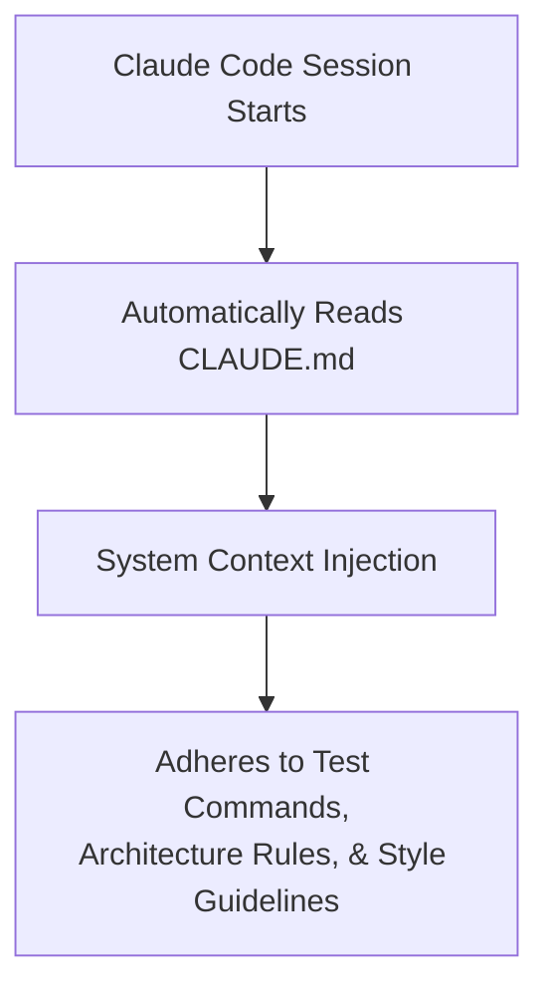

# 📹 Claude.md ｜ Claude Code — The Most Important File

<div className="video-card" style={{border: '1px solid #30363d', borderRadius: '8px', padding: '16px', marginBottom: '24px', background: 'rgba(56, 139, 253, 0.05)'}}>
  <div style={{display: 'flex', gap: '16px', flexWrap: 'wrap'}}>
    <div><strong>Instructor:</strong> Nitish Singh (CampusX)</div>
    <div><strong>Duration:</strong> 2788</div>
    <div><strong>Course:</strong> Module 5: MCP & Claude Code</div>
    <div><strong>Watch Link:</strong> <a href="https://www.youtube.com/watch?v=QzA12C5NsjU" target="_blank" rel="noopener noreferrer">YouTube Lecture ↗</a></div>
  </div>
</div>

## 📌 Executive Summary

The `CLAUDE.md` file is the single most important file in a Claude Code project. Positioned at the repository root, it acts as the agent's persistent memory and executive instruction manual, loaded automatically into context at the start of every session.

This lesson explores `CLAUDE.md` architecture: establishing project build commands, testing frameworks, architectural invariants, code formatting rules, and multi-directory guidelines.

---

## 🏗️ System Architecture & Execution Flow



---

## 📖 Core Concepts & Technical Deep Dive

### 1. The Role of CLAUDE.md
LLMs lose conversational memory between sessions. `CLAUDE.md` provides an immutable reference manual that instructs the model on:
- Exactly which shell commands to run for testing, building, and linting.
- Architectural design patterns that must never be violated.
- Code style and library preferences (e.g. "Use Pydantic v2, never v1").

### 2. Recommended Structure
A production `CLAUDE.md` should include:
- **Build & Test Commands:** Precise commands (`pytest tests/`, `npm run build`).
- **Architecture Overview:** High-level system topology and directory layout.
- **Strict Guidelines:** Constraints ("Never hardcode API keys", "Always use async database sessions").

---

## 💻 Production Implementation

```python
claude_md_content = """# CLAUDE.md - Enterprise AI Hub Guidelines

## Build & Test Commands
- Run Unit Tests: pytest tests/unit -v
- Run Integration Tests: pytest tests/integration -v
- Lint & Type Check: ruff check . && mypy src/

## Architecture Invariants
- Use FastAPI for all REST APIs with strict Pydantic v2 validation.
- All LangChain pipelines must use modern LCEL (Runnable protocol).
- Never use synchronous blocking I/O inside async endpoint functions.

## Code Conventions
- Python 3.12+ standard type annotations.
- Keep functions under 50 lines of code.
"""

print("CLAUDE.md structure verified and ready for project root deployment.")
```

---

## ⚙️ Production Gotchas & Best Practices

:::tip Keep It Concise
Avoid bloated 1,000-line `CLAUDE.md` files that consume half your context window. Keep it under 200 lines focused strictly on essential commands and hard rules.
:::

:::warning Subdirectory Hierarchies
Claude Code also supports hierarchical `CLAUDE.md` files in subdirectories (e.g. `frontend/CLAUDE.md`), which apply specialized rules when working within those folders.
:::

---

## 📊 Architectural Reference & Comparison

| Section | Content | Value to Agent |
| :--- | :--- | :--- |
| **Commands** | Test, build, and lint commands | Enables autonomous test-driven verification |
| **Architecture** | Component responsibilities | Prevents structural anti-patterns |
| **Conventions** | Naming, type hints, formatting | Enforces uniform codebase aesthetics |

---

## 📚 Key Takeaways & Enterprise Checklist

- [ ] **Architecture Verification:** Ensure your design addresses latency, decoupled interfaces, and strict data validation contracts.
- [ ] **Deterministic Testing:** Run unit tests and golden dataset evaluations before shipping changes to staging or production.
- [ ] **Security & Observability:** Enforce input/output guardrails, scrub sensitive credentials/PII, and capture distributed traces.
- [ ] **Scalability & Sizing:** Calibrate model parameters, context limits, and compute instance requirements against projected request concurrency.
