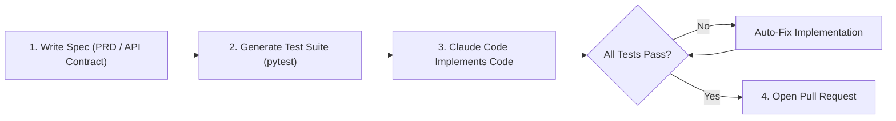

# 📹 Spec-Driven Development in Claude Code

<div className="video-card" style={{border: '1px solid #30363d', borderRadius: '8px', padding: '16px', marginBottom: '24px', background: 'rgba(56, 139, 253, 0.05)'}}>
  <div style={{display: 'flex', gap: '16px', flexWrap: 'wrap'}}>
    <div><strong>Instructor:</strong> Nitish Singh (CampusX)</div>
    <div><strong>Duration:</strong> 1687</div>
    <div><strong>Course:</strong> Module 5: MCP & Claude Code</div>
    <div><strong>Watch Link:</strong> <a href="https://www.youtube.com/watch?v=AjKFApDdffA" target="_blank" rel="noopener noreferrer">YouTube Lecture ↗</a></div>
  </div>
</div>

## 📌 Executive Summary

Spec-Driven Development (SDD) prevents AI coding agents from guessing requirements and introducing regressions. By writing formal specifications (architecture designs, API contracts, data schemas) before writing code, developers ensure deterministic alignment.

This guide explores creating specification documents, translating requirements into test suites first, and using Claude Code to implement features against pre-defined contracts.

---

## 🏗️ System Architecture & Execution Flow



---

## 📖 Core Concepts & Technical Deep Dive

### 1. The Spec-Driven Workflow
- **Step 1 (Specification):** Author a markdown specification detailing the objective, API inputs/outputs, edge cases, and failure modes.
- **Step 2 (Contract Tests):** Generate or write unit tests asserting the exact behavior specified in the spec. Tests initially fail (Red).
- **Step 3 (Implementation):** Prompt Claude Code: `"Implement the feature in src/ matching spec.md until pytest passes."`
- **Step 4 (Verification):** All tests pass (Green), confirming adherence without specification drift.

---

## 💻 Production Implementation

```python
# Example: spec-driven prompt instruction
prompt = """Read specs/auth_service.md carefully.
Implement the TokenValidator class in src/auth.py to satisfy all requirements.
Run 'pytest tests/test_auth.py' after every modification until 100% of tests pass.
Do not modify the test suite."""

print("Spec-Driven Development prompt blueprint loaded.")
```

---

## ⚙️ Production Gotchas & Best Practices

:::tip Immutable Test Suites
Instruct the agent: `"Do not modify the test suite to make tests pass; only modify the implementation code."` This prevents agents from deleting tests that fail.
:::

:::warning Granular Scope
Break large features into multiple discrete specs. An agent implementing a 50-page spec all at once will lose context and introduce subtle bugs.
:::

---

## 📊 Architectural Reference & Comparison

| Phase | Artifact | Owner | Verification |
| :--- | :--- | :--- | :--- |
| **Specification** | `spec.md` | Engineer / Architect | Peer Review |
| **Contract** | `test_feature.py` | Engineer / Agent | Fails initially (Red) |
| **Implementation** | `feature.py` | Claude Code Agent | Passes tests (Green) |

---

## 📚 Key Takeaways & Enterprise Checklist

- [ ] **Architecture Verification:** Ensure your design addresses latency, decoupled interfaces, and strict data validation contracts.
- [ ] **Deterministic Testing:** Run unit tests and golden dataset evaluations before shipping changes to staging or production.
- [ ] **Security & Observability:** Enforce input/output guardrails, scrub sensitive credentials/PII, and capture distributed traces.
- [ ] **Scalability & Sizing:** Calibrate model parameters, context limits, and compute instance requirements against projected request concurrency.
