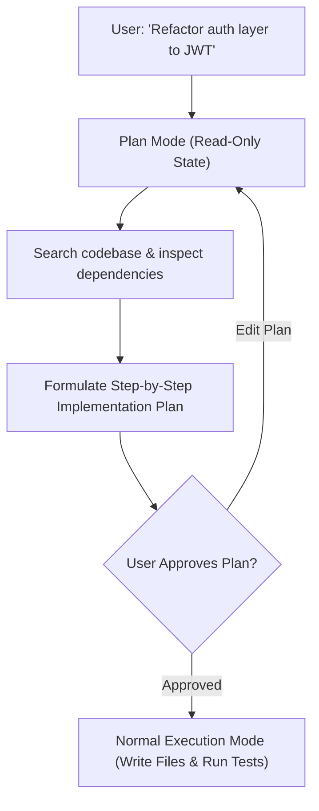

# 📹 Plan Mode in Claude Code ｜ Ultraplan Mode in Claude Code

<div className="video-card" style={{border: '1px solid #30363d', borderRadius: '8px', padding: '16px', marginBottom: '24px', background: 'rgba(56, 139, 253, 0.05)'}}>
  <div style={{display: 'flex', gap: '16px', flexWrap: 'wrap'}}>
    <div><strong>Instructor:</strong> Nitish Singh (CampusX)</div>
    <div><strong>Duration:</strong> 2256</div>
    <div><strong>Course:</strong> Module 5: MCP & Claude Code</div>
    <div><strong>Watch Link:</strong> <a href="https://www.youtube.com/watch?v=yz-7Oczvg34" target="_blank" rel="noopener noreferrer">YouTube Lecture ↗</a></div>
  </div>
</div>

## 📌 Executive Summary

Before executing complex multi-file refactors, developers must prevent agents from impulsively modifying code. Claude Code's Plan Mode (and Ultraplan) forces the agent into a read-only exploration and reasoning state to formulate a comprehensive execution plan before modifying any files.

This lesson explores activating Plan Mode, formulating multi-step architectural strategies, requesting user feedback, and executing plans safely.

---

## 🏗️ System Architecture & Execution Flow



---

## 📖 Core Concepts & Technical Deep Dive

### 1. Read-Only Planning Safeguards
In Plan Mode, tools that modify files or execute destructive shell commands are disabled. The agent can only read files, search the codebase, and formulate reasoning steps.

### 2. Ultraplan Multi-File Strategies
For large refactors touching dozens of files, Ultraplan sequences modifications: defining data models first, updating database migrations second, updating API endpoints third, and modifying frontend callers last.

---

## 💻 Production Implementation

```python
# Blueprint of plan generated by Claude Code Plan Mode
plan_artifact = """# Implementation Plan: Migrate to JWT Auth

1. Add 'pyjwt' to pyproject.toml dependencies.
2. Create src/security/jwt.py with sign_token() and verify_token().
3. Update tests/test_jwt.py to verify token expiration edge cases.
4. Replace session cookie middleware in main.py with HTTPBearer.
5. Run pytest tests/ -v to verify zero regressions.
"""

print("Plan Mode execution artifact structure verified.")
```

---

## ⚙️ Production Gotchas & Best Practices

:::tip Require Plans for Multi-File Changes
Always instruct Claude Code to formulate a plan first whenever a task touches more than two files: `"Enter plan mode and outline the refactoring steps."`
:::

:::warning Scrutinize Step Order
Review the generated plan to ensure database migrations and dependencies are updated *before* code that relies on them is written.
:::

---

## 📊 Architectural Reference & Comparison

| Mode | File Modification | Shell Execution | Goal |
| :--- | :--- | :--- | :--- |
| **Plan Mode** | Disabled (Read-Only) | Read-Only (grep, find) | Architectural strategy & risk identification |
| **Normal Mode** | Enabled (write, edit) | Full permissions | Active code implementation & test runs |

---

## 📚 Key Takeaways & Enterprise Checklist

- [ ] **Architecture Verification:** Ensure your design addresses latency, decoupled interfaces, and strict data validation contracts.
- [ ] **Deterministic Testing:** Run unit tests and golden dataset evaluations before shipping changes to staging or production.
- [ ] **Security & Observability:** Enforce input/output guardrails, scrub sensitive credentials/PII, and capture distributed traces.
- [ ] **Scalability & Sizing:** Calibrate model parameters, context limits, and compute instance requirements against projected request concurrency.
