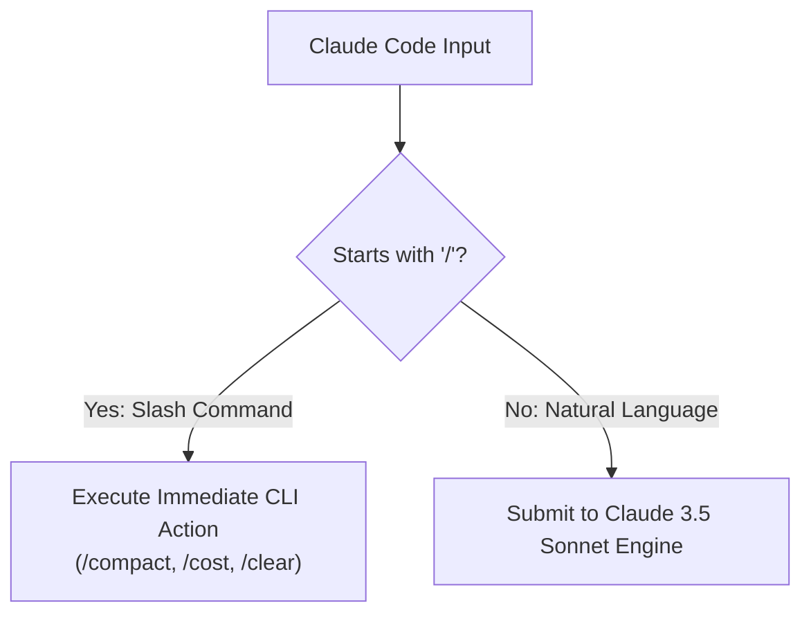

# 📹 Claude Code Custom Slash Commands ｜ Stop Repeating Prompts

<div className="video-card" style={{border: '1px solid #30363d', borderRadius: '8px', padding: '16px', marginBottom: '24px', background: 'rgba(56, 139, 253, 0.05)'}}>
  <div style={{display: 'flex', gap: '16px', flexWrap: 'wrap'}}>
    <div><strong>Instructor:</strong> Nitish Singh (CampusX)</div>
    <div><strong>Duration:</strong> 2787</div>
    <div><strong>Course:</strong> Module 5: MCP & Claude Code</div>
    <div><strong>Watch Link:</strong> <a href="https://www.youtube.com/watch?v=ep2P9hvmvzY" target="_blank" rel="noopener noreferrer">YouTube Lecture ↗</a></div>
  </div>
</div>

## 📌 Executive Summary

Slash commands provide rapid, non-conversational control over the Claude Code agent environment. Using built-in slash commands, developers can inspect token expenditures, compact context windows, review git status, and configure operational modes.

This guide details essential commands (`/help`, `/clear`, `/compact`, `/cost`, `/doctor`, `/review`, `/git`, `/init`) and their operational mechanics.

---

## 🏗️ System Architecture & Execution Flow



---

## 📖 Core Concepts & Technical Deep Dive

### 1. Essential Slash Commands
- `/compact`: Summarizes conversation history and resets active context tokens, keeping critical architectural decisions while freeing up context space.
- `/cost`: Displays real-time API dollar expenditure and token consumption for the active session.
- `/clear`: Wipes conversation history completely for a clean state.
- `/review`: Initiates an automated code review of all uncommitted local git changes.
- `/init`: Analyzes the codebase and generates an initial `CLAUDE.md` project guide.

### 2. Custom User Slash Commands
Developers can create custom slash commands by saving markdown prompt files inside `.claude/commands/`, automating repetitive workflows like `/deploy-staging` or `/run-evals`.

---

## 💻 Production Implementation

```python
# Blueprint for custom slash command: .claude/commands/refactor.md
"""
# /refactor Command

Review the specified file and refactor it adhering to:
1. Extract duplicate logic into reusable helper functions.
2. Add comprehensive type hints and docstrings.
3. Verify that all unit tests pass with pytest.
"""
print("Claude Code Slash Commands architecture loaded.")
```

---

## ⚙️ Production Gotchas & Best Practices

:::tip Frequent Compaction
Run `/compact` every 20-30 minutes during long development sessions. This keeps context fresh and prevents latency degradation.
:::

:::warning Uncommitted Work Before /clear
Running `/clear` wipes conversational memory. Ensure any important architectural context is documented in `CLAUDE.md` before clearing.
:::

---

## 📊 Architectural Reference & Comparison

| Slash Command | Action | Impact on Context Window |
| :--- | :--- | :--- |
| `/compact` | Summarizes history | Frees up 50-80% of context tokens |
| `/cost` | Displays token usage | Zero impact (Local inspection) |
| `/clear` | Wipes session history | Resets context to zero |
| `/review` | Audits git diff | Ingests uncommitted diff into context |

---

## 📚 Key Takeaways & Enterprise Checklist

- [ ] **Architecture Verification:** Ensure your design addresses latency, decoupled interfaces, and strict data validation contracts.
- [ ] **Deterministic Testing:** Run unit tests and golden dataset evaluations before shipping changes to staging or production.
- [ ] **Security & Observability:** Enforce input/output guardrails, scrub sensitive credentials/PII, and capture distributed traces.
- [ ] **Scalability & Sizing:** Calibrate model parameters, context limits, and compute instance requirements against projected request concurrency.
