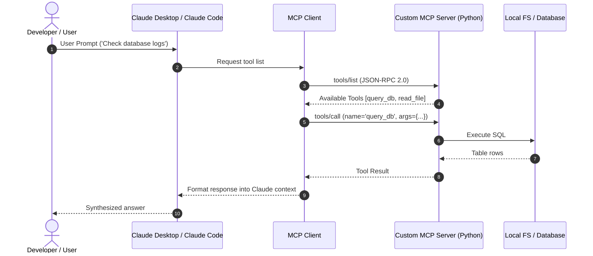

# 📹 Claude Code Custom Slash Commands ｜ Stop Repeating Prompts

<div className="video-card" style={{border: '1px solid #30363d', borderRadius: '8px', padding: '16px', marginBottom: '24px', background: 'rgba(56, 139, 253, 0.05)'}}>
  <div style={{display: 'flex', gap: '16px', flexWrap: 'wrap'}}>
    <div><strong>Instructor:</strong> Nitish Singh (CampusX)</div>
    <div><strong>Duration:</strong> 46m 27s</div>
    <div><strong>Playlist:</strong> Agentic Coding with Claude Code (CampusX)</div>
    <div><strong>Watch Link:</strong> <a href="https://www.youtube.com/watch?v=ep2P9hvmvzY" target="_blank" rel="noopener noreferrer">YouTube Lecture ↗</a></div>
  </div>
</div>

## 📌 Executive Summary & Learning Objectives

This lecture covers **Claude Code Custom Slash Commands ｜ Stop Repeating Prompts**, focusing on production implementations, edge cases, and industry standards:
- Core intuition, architecture, and underlying mechanisms.
- Key differences between theoretical research implementations and scalable enterprise patterns.
- Concrete Python walkthroughs, error recovery, and performance optimization.

---

## 🏗️ Architecture & Conceptual Workflow



---

## 📖 Core Concepts & Technical Deep Dive

### 1. Architectural Foundations
In modern production AI engineering, **Claude Code Custom Slash Commands ｜ Stop Repeating Prompts** is essential for ensuring reliability, low latency, and deterministic outcomes. As AI systems evolve from naive prompt-in / completion-out scripts into distributed systems, engineers must handle:
- **State management & consistency:** Ensuring intermediate states and tool invocations are tracked.
- **Error boundaries & recovery:** Graceful degradation when external LLMs or vector stores encounter rate limits or network partitions.
- **Resource utilization & cost efficiency:** Caching common queries and reducing unnecessary foundation model token expenditure.

### 2. Operational Considerations
- **Latency Optimization:** Pre-computing embeddings, utilizing asynchronous non-blocking event loops, and streaming tokens via Server-Sent Events (SSE).
- **Security & Sandboxing:** Validating inputs before ingestion, sanitizing LLM outputs, and isolating tool execution environments.

---

## 💻 Production Implementation Walkthrough

```python
from mcp.server.fastmcp import FastMCP

# Initialize FastMCP Server
mcp = FastMCP("Production AI Tools Server")

@mcp.tool()
def calculate_token_cost(input_tokens: int, output_tokens: int, model: str = "gpt-4o") -> dict:
    """Calculate total API cost given token counts."""
    rates = {
        "gpt-4o": {"input": 2.50 / 1_000_000, "output": 10.00 / 1_000_000},
        "claude-3-5-sonnet": {"input": 3.00 / 1_000_000, "output": 15.00 / 1_000_000},
    }
    rate = rates.get(model, rates["gpt-4o"])
    cost = (input_tokens * rate["input"]) + (output_tokens * rate["output"])
    return {"model": model, "total_cost_usd": round(cost, 6)}

if __name__ == "__main__":
    # Runs stdio transport protocol for Claude Desktop & Claude Code
    mcp.run(transport="stdio")
```

---

## 💡 Production Best Practices & Tips

:::tip Production Deployment Guideline
When deploying Claude Code Custom Slash Commands ｜ Stop Repeating Prompts in enterprise environments, always configure automated retries with exponential backoff and telemetry tracing (such as OpenTelemetry or LangSmith).
:::

:::warning Common Failure Modes
Watch out for state contamination across concurrent requests. Ensure each session or user interaction uses an isolated thread ID or execution context.
:::

---

## 🎯 Key Takeaways & Quick Reference

| Dimension | Production Standard | Pitfall to Avoid |
| :--- | :--- | :--- |
| **Execution** | Async / Non-blocking with timeouts | Synchronous blocking calls in event loops |
| **Data Validation** | Strict Pydantic v2 schemas | Untyped dictionary access |
| **Monitoring** | Distributed tracing & latency percentiles | Relying only on standard console logs |

## ⏱️ Lecture Timeline & Key Topics

| Timestamp | Key Topic / Concept Discussed |
| :--- | :--- |
| **00:00:00** | हाय गाइज़, माय नेम इज नितेश एंड यू वेलकम... |
| **00:10:26** | ऑफ कस्टम स्लैश कमांड है जहां पे आप इनपुट... |
| **00:21:16** | और अब देखना आप अ हमारा जो कस्टम स्लैश... |
| **00:33:18** | करोगे और सारा का सारा सबसे रीसेंट गेट से... |
| **00:46:25** | नेक्स्ट वीडियो में। बाय।... |


---

---

## 📜 Complete Lecture Transcript (Hindi / Hinglish)

> **Language:** Hindi / Hinglish | **Source:** `09 - Claude Code Custom Slash Commands ｜ Stop Repeating Prompts ｜ CampusX.hi-orig.srt` | **Total Segments:** 24 | **Word Count:** ~7,032 words

<details>
<summary><b>Click to expand full chronological transcript (24 timestamped intervals)</b></summary>

#### ⏱️ [00:00 ➔ 00:02]

हाय गाइज़, माय नेम इज नितेश एंड यू वेलकम टू माय YouTube चैनल। इस वीडियो में भी हम लोग अपना क्लॉट कोड प्लेलिस्ट कंटिन्यू करेंगे। और आज की वीडियो में हमारे दो मेन ऑब्जेक्टिव्स हैं। पहला ऑब्जेक्टिव यह है कि हम आज की वीडियो में कस्टम स्लैश कमांड्स बनाना सीखेंगे। अगर आपको याद होगा तो इस प्लेलिस्ट में हमने पहले स्लैश कमांड्स के बारे में बात की थी। आज हम खुद के स्लैश कमांड्स कैसे बनाए जाते हैं वो सीखेंगे। सेकंड हम आज अपने प्रोजेक्ट में लॉग इन एंड रजिस्ट्रेशन फंक्शनैलिटी ऐड करेंगे। तो ये दो मेन ऑब्जेक्टिव्स हैं आज के वीडियो के। अब वीडियो को स्टार्ट करते हैं। सो सबसे पहले एक बार कस्टम स्लैश कमांड्स के बारे में एक डिस्कशन कर लेते हैं। अ कस्टम स्लैश कमांड्स को अगर हम एकदम सिंपल वर्ड्स में बोलें तो दे आर नथिंग बट प्र्प्स। ऐसे प्र्प्ट्स जिनको आपने सेव कर रखा है कहीं पे और वो ऑटोमेटिकली इनवोक हो जाते हैं जब आप स्लैश कमांड नेम टाइप करते हो क्लॉट कोड के अंदर। जस्ट लाइक बिल्ट इन स्लैश कमांड्स। इनको आप कब यूज करते हो? आप कस्टम स्लश कमांड्स हर ऐसे वर्क फ्लो के लिए यूज करते हो जो कि रिपीटेबल है जो बार-बार आपके प्रोजेक्ट में आप यूज़ कर रहे हो। तो ऐसे वर्क फ्लोस के लिए आप क्या करते हो कि कस्टम स्लैश कमांड्स बना लेते हो। ठीक है? मैं आपको आगे कुछ एग्जांपल्स दूंगा। अ थर्ड कस्टम स्लैश कमांड्स बनाने का तरीका क्या है? कि आप पहले एक मार्कडाउन फाइल बनाते हो अपने कस्टम स्लैश कमांड की और उस मार्कडाउन फाइल को आप डॉट क्लॉट फोल्डर के अंदर सेव कर देते हो। क्लॉट कोड उसको ऑटोमेटिकली आइडेंटिफाई कर लेता है एज अ स्लैश कमांड। ठीक है? अ एक और इंपॉर्टेंट चीज आप दो अलग-अलग टाइप के कस्टम स्लैश कमांड्स बना सकते हो। पहला प्रोजेक्ट स्कोप्ड अगर आप अपने मार्कडाउन फाइल को अपने प्रोजेक्ट डायरेक्टरी के अंदर डॉट क्लॉड के अंदर सेव कर रहे हो तो वो प्रोजेक्ट स्कोप्ड होगा मतलब वो स्लैश कमांड को आप सिर्फ करंट प्रोजेक्ट में यूज़ कर पाओगे इनवोक कर पाओगे और एक सेकंड होता है यूजर स्कोप्ड जहां पर आप अपने मार्कडाउन फाइल को अपने प्रोजेक्ट के अंदर

#### ⏱️ [00:02 ➔ 00:04]

स्टोर ना करके अपने होम डायरेक्टरी के अंदर डॉट क्लॉट फोल्डर के अंदर सेव करते हो तो ये पर्टिकुलर कस्टम स्लैश कमांड कैन बी एक्सेस इन ऑल योर प्रोजेक्ट्स। तो ये यूजर लेवल पे ऑपरेट करता है। तो ये दो टाइप के कस्टम स्लैश कमांड्स आप बना सकते हो। हम दोनों ही बनाना सीखेंगे इस वीडियो में। अब मैं आपको एक क्विक एग्जांपल देता हूं। इनफैक्ट मल्टीपल एग्जांपल्स देता हूं कि किस तरह के सिचुएशंस में किस तरह के वर्क फ्ल्लोस के लिए आपको कस्टम स्लैश कमांड्स बनाने चाहिए। सो एक स्लैश कमांड हो सकता है स्लैश रिव्यू बोल के जिसका काम होगा कि जो भी आपने फाइल अभी बनाई है उसके ऊपर एक कोड रिव्यू रन करें। राइट? अगेन इट इज़ समथिंग व्हिच इज़ अ रिपीटेबल वर्क फ्लो। राइट? आप कभी भी कोड लिखोगे तो उसका कोड रिव्य्यू करोगे ही। तो बार-बार उसको मैनुअली करने से अच्छा है कि आप उसके लिए कस्टम स्लैश कमांड बना दो। सेकंड, आप एक स्लैश कमांड बना सकते हो बाइ द नेम ऑफ़ स्लैश कमिट। राइट? कमिट करना एक रिपीटेबल प्रोसेस है। एवरी टाइम यू डेवलप अ फीचर, यू डू अ मेजर कोड चेंज, यू हैव टू कमिट। राइट? तो आपका स्लैश कमिट कमांड क्या कर सकता है कि इट कैन जनरेट अ गेट कमिट मैसेज बाय सीइंग कि उसने आपके आपके कोड में बेसिकली आपने क्या जनरेट किया है? क्या चेंजेस आपने किए हैं? उसके बेसिस पे इट विल जनरेट अ कस्टम कमिट मैसेज। अ नेक्स्ट स्लैश टेस्ट बोल के भी आप एक कमांड बना सकते हो जो कि आपका जो टेस्ट स्वीट होगा उसको रन करेगा आपके कोड के ऊपर। अगेन टेस्टिंग इज़ समथिंग जो आप हर फीचर को डेवलप करने के बाद करते हो। तो अगेन इट इज़ अ रिपीटेबल वर्क फ्लो जिसको आप कन्वर्ट कर सकते हो इंटू अ कस्टम स्लैश कमांड। सिमिलरली यू कैन आल्सो हैव अ सिक्योरिटी स्कैन बोल के कस्टम स्लैश कमांड जो कि आपके पूरे कोड बेस को वनरेबिलिटीज़ के लिए टेस्ट करेगा। अ आपको ये मल्टीपल टाइम्स करना पड़ता है ड्यूरिंग द डेवलपमेंट ऑफ योर प्रोजेक्ट। इवन व्हेन यू हैव डिप्लॉयड द प्रोजेक्ट उसके बाद भी यह काम आपको बार-बार करना पड़ सकता है। तो फिर उसके लिए भी आप एक कस्टम स्लैश कमांड बना सकते हो। तो नटशेल में कस्टम स्लैश कमांड्स आर

#### ⏱️ [00:04 ➔ 00:06]

नथिंग बट यूजर डिफाइंड स्लैश कमांड्स जिनको आप एक मार्कडाउन फाइल में डाल करके सेव कर लेते हो अपने प्रोजेक्ट में और उसको आप एक्सेस करते हो स्लैश सिंटेक्स की हेल्प से। और जनरली आप ऐसी चीजों को ऑटोमेट करते हो जो रिपीटेबल है आपके वर्क फ्लो में आपके प्रोजेक्ट में जिनको आप बार-बार एग्जीक्यूट करते हो। ठीक है? तो आई रियली होप आपको थ्योरिटिकली ये बात समझ में आ गई। बाकी ये टॉपिक बहुत प्रैक्टिकल है। तो मैं आपको एक बार करके दिखाता हूं। हम क्या करेंगे? हम अभी दो अ कस्टम स्लैश कमांड्स बनाएंगे। बहुत ही सिंपल कस्टम स्लैश कमांड्स हैं। हम क्या करेंगे कि हम अपने डेटाबेस के टेबल्स को पॉपुलेट करने के लिए अ कस्टम स्लैश कमांड्स बनाएंगे। सो हमारे पास दो टेबल्स हैं। एक यूजर टेबल है और एक एक्सपेंस टेबल है। तो मैं एक कमांड बनाऊंगा जिसकी हेल्प से हम यूजर टेबल में एक नया यूजर पॉपुलेट करेंगे और हम एक सेकंड कमांड बनाएंगे जिसकी हेल्प से हम एक्सपेंसेस ऐड करेंगे हमारे एक्सपेंस टेबल में। अब आप सोच रहे होंगे कि फायदा क्या है इस कमांड का? हम मैनुअली क्यों डेटाबेस में एंट्रीज कर रहे हैं? सो ऐसा हम इसलिए कर रहे हैं बिकॉज़ डेवलपमेंट के प्रोसेस में स्पेशली जब हम यूआई वगैरह डिजाइन करेंगे तो हमें थोड़ा यूजर डेटा चाहिए होगा डिस्प्ले करने के लिए। अब जब हम डेवलप कर रहे हैं तब तो हमारे पास कोई यूजर है नहीं। तो हम मैनुअली यूज़र्स क्रिएट करते हैं। ठीक है? तो इसको सीडिंग बोला जाता है। तो वी आर गोइंग टू सीड आवर डेटाबेस और इसी के लिए हम दो कस्टम स्लैश कमांड्स बनाएंगे। ठीक है? तो अब मैं आपको दिखाता हूं कि ये कस्टम स्लैश कमांड्स बनाए कैसे जाते हैं। तो चलो सबसे पहले हम बनाते हैं अपना पहला कस्टम स्लैश कमांड और इस कस्टम स्लैश कमांड का एक ही गोल है कि जब भी आप इस स्लैश कमांड को रन करोगे तो ऑटोमेटिकली आपके डेटाबेस में यूजर टेबल के अंदर एक नया डमी यूजर ऐड हो जाएगा। ठीक है? दिस इज़ द पर्पस। अब मैंने क्या किया है? मैंने एक नया सेशन स्टार्ट कर लिया है और मैंने इस सेशन का नाम रख दिया है कस्टम स्लैश कमांड्स। अब देखते हैं कि ये पूरी चीज कैसे करनी है। तो सबसे पहले आपको क्या करना पड़ेगा कि अपने प्रोजेक्ट के अंदर सिंस दिस इज अ प्रोजेक्ट स्कोप्ड कस्टम

#### ⏱️ [00:06 ➔ 00:08]

स्लैश कमांड तो आप अपने प्रोजेक्ट के डॉट क्लॉट फोल्डर के अंदर एक नया फोल्डर बनाओगे बाय द नेम ऑफ कमांड्स। ठीक है? और फिर इस कमांड्स के अंदर आप अपनी मार्कडाउन फाइल को क्रिएट करोगे। तो मैं इसके अंदर एक फाइल बना रहा हूं। और इस फाइल का नाम है सीड यूजर। अब यहां पे आपको एक चीज हमेशा याद रखनी है कि जो नाम आप अपनी मार्कडाउन फाइल को दोगे वही आपके कस्टम कमांड का कस्टम स्लैश कमांड का नाम हो जाएगा। वही आपको स्लैश करके दिखाई देगा। ठीक है? तो ये हमने फाइल बना ली और अब आपको क्या करना है? इसके अंदर डिटेल में समझाना है कि आपका ये कस्टम स्लैश कमांड क्या करता है। तो मैंने ये ऑलरेडी लिख रखा है। मैं आपको पेस्ट करके दिखाता हूं। सबसे पहले आपको क्या करना होता है कि आपको एक डिस्क्रिप्शन लिखना होता है अपने कस्टम स्लैश कमांड का। तो हमारा डिस्क्रिप्शन है क्रिएट अ सिंगल डमी यूजर इन द डेटाबेस। अब यही एग्जैक्ट डिस्क्रिप्शन दिखाई देगा जब आप स्लैश टाइप करोगे। यह देखो स्लैश अब यहां पे जब आप इनट के आगे जो देख रहे हो इनिशलाइज़ अ न्यू क्लॉड एमडी फाइल यह स्लैश इनट का डिस्क्रिप्शन है। तो हम हमारा जो सीड यूजर वाली फाइल होगी अ जो सीड यूजर वाला कस्टम स्लैश कमांड होगा उसका डिस्क्रिप्शन यहां से आएगा। ठीक है? नेक्स्ट आप बताते हो कि आपके कस्टम स्लैश कमांड को कौन-कौन से टूल्स का एक्सेस है। तो उसके पास फाइल्स को रीड करने का एक्सेस है और उसके पास बैश अ मोड में कमांड्स रन करने का एक्सेस है। बट कौन से कमांड्स? सिर्फ वो कमांड्स जो Python 3 अ से स्टार्ट होते हैं। ऐसा नहीं है कि गिट वाले कमांड्स भी एग्जीक्यूट कर लेगा। सिर्फ Python वाले कमांड्स ही एग्जीक्यूट कर सकता है ये पर्टिकुलर कस्टम स्लैश अ कमांड। ठीक है? अब उसके बाद यहां पे देखो आपको एक बहुत डिटेल्ड डिस्क्रिप्शन देना है कि यू हैव टू रीड डेटाबेस डॉटpy फाइल टू अंडरस्टैंड द यूज़र्स टेबल एंड देन राइट एंड रन अ पाइथन स्क्रिप्ट यूजिंग बैश दैट जनरेट्स अ रियलिस्टिक रैंडम इंडियन यूजर यूजिंग योर ओन नॉलेज ऑफ

#### ⏱️ [00:08 ➔ 00:10]

कॉमन इंडियन नेम्स अक्रॉस रीजंस और आपको यह सारी फील्ड्स जनरेट करनी है। नेम, ईमेल और एक पासवर्ड। पासवर्ड हमेशा 1 2 3 रहेगा। उसको हम एनकोड कर देंगे और क्रिएटेड एट में जिस टाइम पे यूजर क्रिएट हो रहा है वो टाइम आ जाएगा। वो टाइम स्टैंप आ जाएगा। ठीक है? उसके बाद यू हैव टू चेक कि क्या ईमेल ऑलरेडी एकिस्ट करता है कि नहीं। अगर ऑलरेडी एक्सिस्ट करता है तो फिर आपको नया ईमेल जनरेट करना है और तब तक करते रहना है जब तक आपके पास एक यूनिक ईमेल ना आ जाए। ठीक है? उसके बाद यू हैव टू इंसर्ट द यूजर इन द डेटाबेस यूजिंग गेट डीपी फंक्शन एंड फाइनली सब कुछ करने के बाद प्रिंट आउट द डिटेल्स ऑफ द यूजर। ठीक है? तो बेसिकली आप समझ रहे हो हमने इंग्लिश में उसको समझाया कि इस कमांड के एग्जीक्यूशन पे क्या-क्या होना चाहिए। ठीक है? तो बस यही है हमारा कस्टम स्लैश कमांड। अब हमने इसको सेव कर लिया। अब यहां पे एक इंपॉर्टेंट चीज आपको क्या करना पड़ेगा? आपको एक बार क्लॉट को शटडाउन करके दोबारा से स्टार्ट करना पड़ेगा। तभी आपको अपना नया कमांड दिखाई देता है। तो मैं पहले एक बार एग्जिट कर रहा हूं और फिर मैं वापस से एंटर कर रहा हूं। और अब देखना मैं स्लैश सीड यूजर जब करूंगा यू कैन सी मुझे दिखाई दे रहा है मेरा खुद का बनाया हुआ स्लैश कमांड। अब मैं जैसे ही एंटर मारूंगा फिलहाल मैं आपको एक चीज दिखाता हूं। यह मेरा डेटाबेस है। डेटाबेस में यह मेरा यूज़र्स टेबल है। एंड यू कैन सी फिलहाल एक यूजर है जिसका नाम है डेमो यूजर। अब मैं इस कमांड को रन करूंगा। नाउ इट इज़ रीडिंग द फाइल। और वो मुझसे क्वेश्चन पूछ रहा है। शुड आई प्रोसीड। मैंने एंटर मारा एंड यू कैन सी इट सेस कि यह यूजर उसने एंटर किया है। हम एक बार रिफ्रेश करते हैं। एंड यू कैन सी यह रोहन कुलकर्णी बोल के एक यूजर ऐड हुआ है। ये उसका ईमेल आईडी है और ये उसका एंक्रिप्टेड पासवर्ड है। ठीक है? और ये इस टाइम पे इंसर्ट हुआ है। तो दिस इज़ हाउ यू

#### ⏱️ [00:10 ➔ 00:12]

क्रिएट योर अ कस्टम स्लैश कमांड। ठीक है? बहुत ही बेसिक यूसेज था। बट ये अ पर्टिकुलर स्लैश कमांड हम आगे यूज़ करेंगे। जब भी हमें अपना डेटाबेस पॉपुलेट करना होगा। अ एक सेकंड कस्टम स्लैश कमांड बनाते हैं जिसकी हेल्प से हम एक्सपेंसेस टेबल को पॉपुलेट करेंगे। बट ये वाला कस्टम स्लैश कमांड थोड़ा डिफरेंट है। व्हाई? बिकॉज़ इसमें ये ये काइंड ऑफ एक फ्लेक्सिबल काइंड ऑफ कस्टम स्लैश कमांड है जहां पे आप इनपुट प्रोवाइड कर सकते हो। सो मैं इस अ कस्टम स्लैश कमांड को तीन इनपुट्स दूंगा। पहला जो एक्सपेंसेस क्रिएट होंगे डेटाबेस में वो कौन से यूजर के अगेंस्ट होंगे। सेकंड कितने नंबर ऑफ एक्सपेंसेस मैं ऐड करना चाहता हूं। पांच एक्सपेंसेस ऐड करना चाहता हूं, 10 करना चाहता हूं, 15 करना चाहता हूं। एंड थर्ड पिछले कितने महीनों के अंदर का एक्सपेंस मैं ऐड करना चाहता हूं। सो अगर मैं यहां पे सिक्स लिखूंगा तो इसका मतलब है कि जितने भी एक्सपेंसेस क्रिएट होंगे वो आज से पिछले 6 महीनों के बीच में रैंडमली डिस्ट्रीब्यूटेड होंगे। ठीक है? तो ये कस्टम स्लैश कमांड मैं बनाना चाहता हूं। तो इसके लिए व्हाट आई विल डू इज़ आई विल अगेन गो टू द कमांड्स फोल्डर एंड आई विल क्रिएट अ न्यू फाइल बाय द नेम ऑफ़ सीड एक्सपेंस डॉट एमडी। अब यहां पर भी आपको एक डिटेल्ड डिस्क्रिप्शन देना है कि यह पर्टिकुलर कस्टम स्लैश कमांड काम कैसे करता है। सो अगेन मैंने ये अ डिटेल जो है जो डिस्क्रिप्शन है वो ऑलरेडी लिख रखा है। मैं यहां पे पेस्ट करता हूं और आपको एक्सप्लेन करता हूं। सो दिस इज़ द डिस्क्रिप्शन। सबसे पहले यहां पे लिखा हुआ है दैट यू हैव टू सीड रियलिस्टिक डमी एक्सपेंसेस फॉर अ स्पेसिफिक यूजर। उसके बाद यहां पे ये एक चीज नहीं है। अ यहां पे हम बता रहे हैं कि जब हमारा प्रोग्रामर स्लैश सीड एक्सपेंस लिखेगा क्लॉट कोड में तो उसको आगे हिंट्स दिखाई देंगे कि इनपुट में क्या-क्या देना है। तो तीन चीजें दिखाई देंगी। यूजर आईडी काउंट कितने एक्सपेंसेस डालने हैं मंथ्स कितने महीनों

#### ⏱️ [00:12 ➔ 00:14]

पिछले पांच छह कितने भी महीनों का एक्सपेंस हमें ऐड करना है। उसके बाद यहां पे भी आएगा अलाउड टूल्स जो हमने फिर से सेम मेंशन किया है। अ उसके बाद यहां पे हमने एक्सप्लेन किया है कि आपको कैसे काम करना है। यहां पे बस एक चीज अलग है। अगर आप यहां पे ध्यान दो तो लिखा हुआ है यूजर इनपुट डॉलर आर्गुमेंट्स। तो ये जो डॉलर आर्गुमेंट्स है ये काइंड ऑफ एक वेरिएबल है। सो हमारा जो प्रोग्रामर है वो जब स्लैश सीड एक्सपेंस के बाद यूजर आईडी प्रोवाइड करेगा। नंबर ऑफ एक्सपेंसेस प्रोवाइड करेगा। कितने महीनों तक का डेटा डालना है वो प्रोवाइड करेगा तो वो तीनों इनपुट्स आ के इस आर्गुमेंट में आके स्टोर हो जाएंगे। ठीक है? और फिर उसको हम एक्सट्रैक्ट करेंगे। तो यहां पे लिखा हुआ है एक्सट्रैक्ट फॉर एक्सट्रैक्ट फ्रॉम आर्गुमेंट्स। यूजर आईडी इंटीजर होगा, काउंट इंटीजर होगा, मंथ्स इंटीजर होगा। और यहां पर लिखा हुआ है कि अगर इनमें से एक भी चीज मिसिंग है तो फिर बताओ कि दिस इज द करेक्ट फॉर्मेट टू प्रोवाइड इनपुट। ठीक है? उसके बाद स्टेप टू में वेरीफाई यूजर एकिस्ट्स। आप पहले चेक करोगे कि वो पर्टिकुलर यूजर आईडी यूजर टेबल में है या नहीं। उसके बाद जनरेट एंड इंस इंसर्ट एक्सपेंसेस। तो ये सारा डिटेलिंग दिया हुआ है कि स्प्रेड शुड बी इतने महीनों में अगर 6 महीने दिए हुए हैं तो पिछले 6 महीनों में आपको 10 एक्सपेंसेस क्रिएट करने हैं या 20 एक्सपेंसेस क्रिएट करने हैं और ये कैटेगरीज हैं और ये रेंज है। रेंज का गाइडलाइन भी हमने दे दिया है कि फूड है तो 50 से ₹800 के बीच में। हेल्थ है तो 100 से ₹2000 के बीच में। ये आप चेंज कर सकते हो। उसके बाद यहां पे हमने और इंस्ट्रशंस दिए हैं। डिस्ट्रीब्यूट्स कैटेगरीज रफली प्रोपोर्शनली अ और बाकी के सारे इंस्ट्रक्शंस हमने पूरे क्लियरली मेंशन कर दिए। ठीक है? तो एक बार आप जाकर के ये पढ़ना पूरा का पूरा लाइन बाय लाइन रीड करने में अननेसेसरीली वीडियो लंबा हो जाएगा। यू गेट द आईडिया यू हैव टू बी वेरी क्लियर विद योर इंस्ट्रक्शंस। ठीक है? तो ये पूरा इंस्ट्रक्शन हमने दे दिया। अब हम लोग एक बार फिर से स्लश एग्जिट कर जाते हैं और फिर से एक बार हम स्टार्ट करते हैं।

#### ⏱️ [00:14 ➔ 00:16]

और अब आप देखोगे कि जब मैं सीड एक्सपेंस पर जाऊंगा और आगे मैं जैसे ही स्पेस टाइप कर रहा हूं तो मुझे दिखाई दे रहा है कि मुझे तीन इनपुट्स प्रोवाइड करने हैं। तो मैं यूजर आईडी टू के अगेंस्ट चाहता हूं कि पांच नए एक्सपेंस क्रिएट हो। पिछले तीन महीनों में स्प्रेड होने चाहिए ये एक्सपेंस। ठीक है? अब मैं जैसे ही एंटर मारूंगा ये कस्टम स्लैश कमांड एग्जीक्यूट होना स्टार्ट हो जाएगा। और इस पॉइंट पर अगर मैं आपको दिखाऊं तो एक्सपेंसेस में देयर आर एट एक्सपेंसेस और यह सारे यूजर आईडी वन के अगेंस्ट हैं। ठीक है? एक बार देखते हैं ये काम कैसे कर रहा है। यस। एंड इट सेस यस। डन इंसर्टेड फाइव एक्सपेंसेस फॉर यूजर आईडी टू स्पैनिंग बिटवीन दीज़ डेट्स अक्रॉस 3 मंथ्स। ठीक है? एक बार रिफ्रेश करते हैं। एंड यू कैन सी ये पांच नए एक्सपेंसेस आ गए। अगर आप देखोगे तो दीज़ आर द कैटेगरीज़। दीज़ आर द डेट्स अ और ये रहा आपका डिस्क्रिप्शन एंड ऑल। ठीक है? तो ये हमने बना लिया अपना सेकंड कस्टम स्लैश कमांड। तो आई रियली होप आपको ये पूरा फ्लो समझ में आ गया। अब इसी को यूज़ करके हम क्या करेंगे? हम एक नया कस्टम स्लैश कमांड बनाएंगे जिसका काम होगा किसी भी नए फीचर के लिए स्पेक डॉक्यूमेंट क्रिएट करना। इफ यू रिमेंबर लास्ट वीडियो में डेटाबेस वाला फीचर बनाने के प्रोसेस में हम मैनुअली स्पेक डॉक्यूमेंट क्रिएट कर रहे थे। बट अब हम क्या करेंगे कि उस प्रोसेस को ऑटोमेट कर देंगे विथ द हेल्प ऑफ कस्टम स्लैश कमांड। वी विल क्रिएट अ कस्टम स्लैश कमांड जिसमें हम अपने फीचर का डिस्क्रिप्शन डालेंगे और वो कस्टम स्लैश कमांड क्या करेगा? हमारे लिए एक स्पेक डॉक्यूमेंट जनरेट कर देगा। ठीक है? तो वही हम यूज़ करेंगे आज का लॉग इन एंड रजिस्ट्रेशन वाला फीचर डेवलप करने में। तो आई रियली होप आपको अभी तक का फ्लो समझ में आ रहा है। और अब लेट्स मूव ऑन टू द नेक्स्ट पार्ट ऑफ द वीडियो। तो चलो गाइस

#### ⏱️ [00:16 ➔ 00:18]

अब हम बनाते हैं एक नया कस्टम स्लैश कमांड। और इस कमांड का हम नाम रखेंगे क्रिएट स्पेक। बिकॉज़ जब भी कोई भी इस कमांड को एग्जीक्यूट करेगा और एक फीचर का नाम बताएगा तो ये कमांड क्या करेगा कि हमारे लिए उस फीचर का स्पेक डॉक्यूमेंट क्रिएट करेगा। ठीक है? अब यहां पे देखो क्या करना है। मैं आपको पहले एक बार पेस्ट कर देता हूं और फिर मैं आपको रीड करके समझाता हूं कि ये स्पेक कमांड एक्सैक्टली काम कैसे करेगा। तो यहां पर डिस्क्रिप्शन में लिखा हुआ है क्रिएट अ स्पेक फाइल फॉर द नेक्स्ट स्पेंडली फीचर। स्पेंडली हमारे एप्लीकेशन का नाम है। आर्गुमेंट में हमें दो चीजें दी जाएंगी। एक स्टेप नंबर दिया जाएगा कि ये कौन से नंबर का फीचर है। जैसे डेटाबेस फर्स्ट फीचर था। रजिस्ट्रेशन सेकंड फीचर होगा। लॉग इन थर्ड फीचर होगा और फिर हमें फीचर का एक नाम दिया जाएगा। तो दिस इज़ वन एग्जांपल इनपुट। दीज़ आर द अलाउड टूल्स अ दैट वी हैव। यहां पर हमने एक डिस्क्रिप्शन लिखा है। यू आर अ सीनियर डेवलपर प्लानिंग अ न्यू फीचर फॉर द स्पेंडली एक्सपेंस ट्रैकर। ऑलवेज फॉलो द रूल्स इन क्लॉट डॉट एमडी फाइल। यूजर का इनपुट हम इस वेरिएबल में एक्सेप्ट करेंगे। अब स्टेप बाय स्टेप ये पूरी फाइल काम कैसे करेगी? स्टेप वन में हमें डॉक्यूमेंट्स को पास करना है और उसके अंदर से ये तीन चीजें निकालनी हैं। स्टेप नंबर, फीचर का टाइटल और फीचर का स्लग। अ स््लग इज़ बेसिकली अ यूआरएल काइंड ऑफ़ थिंग। ठीक है? इफ यू कैन नॉट इनफर दीज़ फ्रॉम आर्गुमेंट्स आस्क द यूजर टू क्लेरिफाई बिफोर प्रोसीडिंग। ठीक है? स्टेप टू में हमें हमारा काम क्या होगा? हम रिसर्च करेंगे पूरे के पूरे क्लॉट बेस पूरे के पूरे कोड बेस को। हम क्लॉट डॉट एmडी फाइल पढ़ेंगे। app डॉटpy फाइल पढ़ेंगे। डेटाबेस वाली फाइल पढ़ेंगे। और स्पेक फोल्डर में भी अभी तक जितनी भी फाइल्स बनी हुई हैं, वो भी हम पढ़ेंगे। तो अभी तक स्पेक में डेटाबेस वाली फाइल बनी हुई है। तो इससे हमें यह आईडिया लगेगा कि अभी तक कितने फीचर्स डेवलप हो चुके हैं।

#### ⏱️ [00:18 ➔ 00:20]

उसके बाद चेक क्लॉड एमडी टू कंफर्म द रिक्वेस्ट स्टेप इज नॉट ऑलरेडी कंप्लीट। इफ इस काम इस स्टेप को हम हटा सकते हैं। दिस इज़ नॉट नेसेसरी। अ स्टेप थ्री में हमें क्या करना है? वी हैव टू स्टार्ट राइटिंग द स्पेक फाइल। सो यू हैव टू जनरेट अ स्पेक डॉक्यूमेंट विथ दिस एग्जैक्ट स्ट्रक्चर। स्ट्रक्चर क्या है? सबसे पहले फीचर का टाइटल लिखा होगा। फिर एक ओवरव्यू लिखा होगा। वन पैराग्राफ डिस्क्राइबिंग व्हाट दिस फीचर डस एंड व्हाई इट एक्सिस्ट एट दिस स्टेज ऑफ स्पेंडली रोड मैप। किन चीजों पे ये फीचर डिपेंड करता है? कौन-कौन से राउट्स इंप्लीमेंट होंगे? डेटाबेस में क्या कोई चेंजेस करने की जरूरत है या नहीं? कौन-कौन से यूआई टेंप्लेट्स हम क्रिएट करेंगे या मॉडिफाई करेंगे? कौन-कौन सी और फाइल्स मॉडिफाई होंगी? कौन-कौन सी नई फाइल्स क्रिएट होंगी? कौन-कौन सी डिपेंडेंसीज हैं? व्हाट आर द रूल्स ऑफ इंप्लीमेंटेशन और फाइनली व्हाट इज द एक्सेप्टेंस क्राइटेरिया। इस फॉर्मेट में हमें स्पेक डॉक्यूमेंट क्रिएट करना है। उसके बाद जब डॉक्यूमेंट क्रिएट हो जाए तो उसको इस जगह पर सेव करना है। डॉट क्लॉड के अंदर स्पेक्स फोल्डर के अंदर स्टेप नंबर आपके फीचर का नाम और फिर यूजर को बताना है कि उसने स्पेक डॉक्यूमेंट बना लिया है। तो दिस इज़ द वर्किंग ऑफ दिस पर्टिकुलर कस्टम स्लैश कमांड। ठीक है? तो व्हाट आई विल डू इज़ कि मैं एक बार एग्जिट कर जाता हूं। और फिर से एक बार यह रजिस्ट्रेशन वाले सेशन में घुस जाता हूं। ठीक है? यहां पर हम क्या करेंगे कि अ इस स्लैश कमांड को यूज़ करेंगे क्रिएट स्पेक वाला। ठीक है? तो एकदम स्टेप बाय स्टेप जाते हैं। सबसे पहले हमेशा की तरह हम क्या करेंगे कि करेंटली वी विल फर्स्ट चेक कि कुछ ऐसे चेंजेस तो नहीं है जो कमिट नहीं हुए हैं। तो वी विल राइट किट स्टेटस। सो देयर आर सर्टेन फाइल्स जो अभी कमिटेड

#### ⏱️ [00:20 ➔ 00:22]

नहीं है। तो वी विल राइट गेट ऐड गेट कमिट - m और यहां पे हमने लिख देना है क्रिएट अ क्रिएट स्पेक स्लैश कमांड। ठीक है? यह हमने कमिट कर दिया। अब हम क्या करेंगे? सबसे पहले हमारा वर्क फ्लो क्या था कि हम एक नया फीचर ब्रांच क्रिएट करते हैं। राइट? फॉर दैट वी विल राइट गेट चेक आउट माइनस बी फीचर और हमारे फीचर का नाम है रजिस्ट्रेशन। ठीक है? हम अब हमारे इस ब्रांच में आ गए। अब इस ब्रांच में हमें सबसे पहले क्या करना है? स्पेक डॉक्यूमेंट क्रिएट करना है रजिस्ट्रेशन वाले फीचर का। तो उसके लिए हम मैनुअली क्रिएट ना करके इस बार हम लिखेंगे क्रिएट स्पेक। उसके बाद हमें दो चीजें बतानी है। टू रजिस्ट्रेशन। ठीक है? फीचर का नंबर और फीचर का नाम। एंटर मारा और अब देखना आप अ हमारा जो कस्टम स्लैश कमांड है वो अपना काम करना स्टार्ट कर रहा है और वो हमें एक स्पेक डॉक्यूमेंट बना के देगा। यहां पे लिखा आ रहा है नाउ आई हैव एवरीथिंग आई नीड। लेट मी राइट द स्पेक। सो फिलहाल यहां पे एक स्पेक है डेटाबेस वाला। इस स्टेप के बाद हमारे पास दो स्पेक्स होने चाहिए। यह बन गया हमारा स्पेक डॉक्यूमेंट। अ एक काम करते हैं। इसको अलऊ कर देते हैं। ये देखो ये बन गया हमारा स्पेक्ट डॉक्यूमेंट। और अब हम क्या करेंगे? बहुत केयरफुली इस डॉक्यूमेंट को रिव्यू करेंगे। ठीक है? एक बार देखते हैं। ओवरव्यू में लिखा हुआ है इंप्लीमेंट यूजर रजिस्ट्रेशन। सो न्यू

#### ⏱️ [00:22 ➔ 00:24]

विजिटर्स कैन क्रिएट अ स्पेंटली अकाउंट। दिस स्टेप अपग्रेड्स द एकिस्टिंग स्टब गेट रजिस्टर राउट इंटू अ फुल्ली फंक्शनल फॉर्म दैट एक्सेप्ट्स द पोस्ट वैलिडेटस इनपुट। हैशेस द पासवर्ड एंड इंसर्ट्स अ न्यू रो इंटू द यूजर टेबल। बिल्कुल सही है। ऑन सक्सेस द यूजर इज़ रीडायरेक्टेड टू लॉग इन पेज। अ ऑन सक्सेस द यूजर इज़ शोन विद अ सक्सेस मैसेज एंड देन रिीडायरेक्टेड टू द लॉग इन पेज। दिस इज़ द एंट्री पॉइंट फॉर ऑल ऑथेंटिकेटेड फीचर्स दैट फॉलो। डिपेंड्स ऑन द फर्स्ट स्टेप जहां पे डेटाबेस सेटअप हुआ था। राउट्स यह वाले हैं। डेटाबेस में कोई चेंजेस करने की जरूरत नहीं है। अ न्यू डीबी हेल्पर मस्ट बी एडेड टू db.py अ टेंपलेट में आप रजिस्टरhtml में थोड़े चेंजेस करोगे। अ आप बेसिकली ये मेथड पोस्ट ऐड करोगे और एक यूआरएल प्रोवाइड करोगे और एरर मैसेज डिस्प्ले करने का ब्लॉक ऐड करोगे। कौन-कौन से फाइल में चेंजेस हो रहे हैं? apppy में चेंजेस हो रहे हैं? डेटाबेस वाली फाइल में चेंजेस हो रहे हैं। रजिस्टरhtml में चेंजेस हो रहे हैं। कोई नई फाइल नहीं बन रही है। कोई नई डिपेंडेंसी भी नहीं है। रूल्स ऑफ इंप्लीमेंटेशन में सीक्वल एल्केमी या ओआरएम यूज़ नहीं करना है। पैरामीटराइज्ड क्वेरीज़ यूज़ करनी है। पासवर्ड्स को हैश करना है। ऐप सीक्रेट की डालना है। सर्वर साइड वैलिडेशन चेक करना है कि सारी फील्ड्स नॉन एंप्टी हैं। पासवर्ड और कंफर्म पासवर्ड मैच कर रहा है कि नहीं। जो भी स्टैंडर्ड चीजें हैं और यहां पे डेफिनेशन ऑफ डन लिखा हुआ है। तो एक ग्लांस में ऐसा लग रहा है जैसे ये स्पेसिफिकेशन सही है। ठीक है? बाकी तो मैं वीडियो बनाते बनाते पढ़ रहा हूं। जनरली आप बहुत तसल्ली से इसको पढ़ोगे और इफ पॉसिबल इसको आप चार्ट जीपीटी या क्लॉड में डाल के प्रॉपर्ली रिव्यू भी कराओगे। ठीक है? तो अब हम अगले स्टेज पे मूव करते हैं। जहां पे हम इसको एक प्लान में कन्वर्ट करेंगे। ठीक है? टेक्निकल प्लान में। तो उसके लिए व्हाट वी हैव टू डू इज़ वी हैव टू फर्स्ट गो टू प्लान मोड एंड वी हैव टू राइट रीड डॉट क्लॉड

#### ⏱️ [00:24 ➔ 00:26]

स्लश स्पेक्स स्लश 02 रजिस्ट्रेशन डॉट एमडी एंड क्रिएट अ डिटेल्ड इंप्लीमेंटेशन प्लान फॉर द सेम डोंट राइट एनी कोड। ठीक है? तो ये हो गया हमारा प्लान मोड का प्र्ट। लेट मी वंस चेक दिस। सही है? एंटर। सो इट सेस गुड आई हैव ऑल द कॉन्टेक्स्ट दैट आई नीड लेट मी राइट द प्लान सो या दिस इज़ द प्लान यू कैन सी दिस इज द प्लान। अब अगेन मैंने ये चीज पहले बना रखी है। तो मुझे पता है कि प्लान सही होगा बिकॉज़ इट्स बेस्ड ऑन द स्पेक डॉक्यूमेंट। बट आपको इसको प्रॉपर्ली रीड करना है इफ पॉसिबल किसी एआई टूल में डाल के क्रॉस चेक भी करवा लेना है। ठीक है? अब वो मुझसे पूछ रहा है कि वुड यू लाइक टू इंप्लीमेंट द प्लान? आई वुड से यस मैनुअली अप्रूव एडिट्स। एंटर मारा और अब वो कोडिंग स्टार्ट करेगा। ठीक है? तो दिस इज द फर्स्ट चेंज डीबी.py में दिस इज द सेकंड चेंज app.py में अ app.py में एक सीक्रेट की ऐड की है।

#### ⏱️ [00:26 ➔ 00:28]

अ एक नया राउट ऐड किया। नया नहीं। एक्चुअली पहले बस राउट लिखा हुआ था। अब उसका इंप्लीमेंटेशन हो रहा है और फिर आपके HTML वाली फाइल में चेंजेस हो रहे हैं। अगेन HTML वाली फाइल में चेंजेस हो रहे हैं। एंड या वी आर डन। यहां पे समरी आ गई। db.py में क्या हुआ? app. Py में क्या हुआ? और रजिस्टर. में क्या हुआ? ठीक है? अब हमारा काम क्या है? कि हम जो भी कोड लिखा गया उसको वैलिडेट करें अगेंस्ट द स्पेक। ठीक है? तो ये रहा हमारा एक्सेप्टेंस क्राइटेरिया। हम इसी को वैलिडेट करेंगे। इसी को देखेंगे। ठीक है? तो सबसे पहले एक काम करते हैं। हमारा जो एप्लीकेशन है उसको रन कर लेते हैं। Python app डॉट py स्टार्ट हो गया है। एंड यू कैन सी दिस इज़ आवर एप्लीकेशन। अब हम लोग पॉइंट बाय पॉइंट चेक करेंगे सारे एक्सेप्टेंस क्राइटेरियास को। सबसे पहले यह बोला जा रहा है कि स्लैश रजिस्टर पे हिट करने पे रजिस्ट्रेशन फॉर्म खुलना चाहिए। तो एक बार टेस्ट करते हैं। रजिस्ट्रेशन फॉर्म खुल रहा है। उसके बाद सबमिटिंग द फॉर्म विद ऑल वैलिड फील्ड क्रिएट्स अ न्यू यूजर इन यूज़र्स एंड रीडायरेक्ट्स टू लॉग इन। ठीक है? ये भी टेस्ट करते हैं। तो एक नया यूजर बनाते हैं नितेश के नाम से और उसका ईमेल आईडी है ये। पासवर्ड है 1 2 3 4 कंफर्म पासवर्ड 1 2 3 4 क्रिएट अकाउंट। ठीक है? हम रीडायरेक्ट तो हो गए हैं बट पता कैसे चलेगा यूजर ऐड हुआ है कि नहीं उसके लिए हम अपने डेटाबेस में जाएंगे और यूज़र्स में जाएंगे एंड यू कैन सी ये रहा नितेश वाला यूजर तो काम तो कर रहा है ठीक है उसके बाद अगली चीज देखते हैं सबमिटिंग विद मिसमैच्ड पासवर्ड रीरेंडर्स द फॉर्म विद एन एरर मैसेज ओके तो एक काम करते हैं हम वापस जाते हैं यहां पे कुछ भी नाम डालते हैं और यहां पे

#### ⏱️ [00:28 ➔ 00:30]

वन 1 2 3 4 डाल रहा हूं मैं और यहां पे मैं कुछ भी और डाल रहा हूं। इस पे क्लिक किया। इट सेस पासवर्ड डू नॉट मैच। तो ये काम भी हो रहा है। उसके बाद सबमिटिंग विद एन ऑलरेडी रजिस्टर्ड ईमेल शुड थ्रो एन एरर। तो यहां पे मैंने फिर से लिखा नितीश और मेरा ईमेल आईडी है नितीश 1 2 3 4 1 2 3 4 क्रिएट अकाउंट इट सेस ईमेल ऑलरेडी रजिस्टर्ड। सही है। सबमिटिंग विद एनी एंप्टी फील्ड विल आल्सो थ्रो एन एरर। सो मान लो अभी मैं डायरेक्टली बटन पे क्लिक कर दूं तो वो मुझे अलाउ नहीं कर रहा है। व्हिच इज़ अगेन गुड। पासवर्ड इज़ स्टर्ड एज अ हैश। वो मैंने देख लिया। नो डुप्लीकेट यूजर इज़ क्रिएटेड ऑन रिपीटेड वैलिड सबमिशन विथ द सेम ईमेल। ठीक है? ये भी सेम बात है। तो या गाइस हमने जस्ट चेक किया कि जो रजिस्ट्रेशन का फीचर डेवलप किया गया है इस पूरे प्रोसेस में वो सही से काम कर रहा है। ठीक है? तो अब हमारा अगला काम क्या है कि हमें चेंजेस को कमिट करना है। सो वी विल राइट गेट ऐड उसके बाद गेट कमिट ऐड रजिस्ट्रेशन फीचर। ठीक है? और अब हमें क्या करना है? पुश कर देना है तो हम लिखेंगे गेट पुश ओरिजिन फीचर स्लश फीचर का नाम रजिस्ट्रेशन और यह पुश हो गया। अब चलते हैं गेट पे। यह देखो यह पुश हुआ है। लेट्स क्रिएट अ पुल रिक्वेस्ट। क्रिएट पुल रिक्वेस्ट। मर्ज कैन बी परफॉर्म्ड ऑटोमेटिकली लेट्स

#### ⏱️ [00:30 ➔ 00:32]

मर्ज और सक्सेसफुली मर्ज हो गया तो वी कैन डिलीट दिस ब्रांच। सो डिलीट ब्रांच परफेक्ट। नाउ लेट्स गो बैक एंड लेट्स स्विच टू गेट चेक आउट मेन हम मेन वाले ब्रांच में आ गए और अब हम लोग पुल कर लेंगे। अभी अगर आप देखो तो चेंजेस नहीं दिखेंगे आपको। तो हम लोग क्या करते हैं? हम लोग लिखते हैं गेट पुल ओरिजिन मेन। और अब सारे चेंजेस हम पुल कर लेंगे हमारे मेन ब्रांच में। ठीक है? एंड लास्टली हम लोग क्या करेंगे? हम लोग फीचर को डिलीट हम लोग ब्रांच को डिलीट कर देंगे। सो वी विल राइट गेट ब्रांच माइनस डी हमारे ब्रांच का नाम है फीचर स्लश रजिस्ट्रेशन एंटर ब्रांच डिलीटेड। ठीक है? वी कैन एक्चुअली चेक कि हमारे पास सिर्फ एक ब्रांच होगी। दैट इज़ द मेन ब्रांच। ठीक है? एंड विथ दैट हमने हमारी वेबसाइट में एक नया फीचर ऐड कर दिया व्हिच इज़ द रजिस्ट्रेशन फीचर। ठीक है? और यह सारा काम हमने ऑटोमेटेड तरीके से किया। हमारा जो स्पेक डॉक्यूमेंट बना वो हमने ऑटोमेटेड तरीके से बनाया। तो आई रियली होप आप समझ पा रहे हो पूरा फ्लो कैसे हम कर रहे हैं और कैसे उसके अलग-अलग एस्पेक्ट्स को ऑटोमेट करते जा रहे हैं। ठीक है? अब नेक्स्ट हम लोग लॉग इन वाला फीचर बनाएंगे। अब लॉग इन वाला फीचर बनाने के पहले हमारे वर्क फ्लो में मैं एक छोटा सा चेंज कर रहा हूं और वह चेंज यह है कि यह जो हमारे स्टेप्स हैं जहां पर हम कोई भी फीचर डेवलप करने के पहले एक नया ब्रांच बनाते हैं और उस ब्रांच में स्विच करते हैं और उस ब्रांच के अंदर डेवलपमेंट करते हैं। मैं इन तीनों स्टेप्स को भी ऑटोमेट करना चाहता हूं। सो व्हाट आई वांट इज़ कि ये तीनों चीजें भी डॉक्यूमेंट के स्पेक डॉक्यूमेंट के क्रिएशन के साथ ही हो जाएं। सो जैसे ही

#### ⏱️ [00:32 ➔ 00:34]

हम स्लैश क्रिएट स्पेक कमांड को एग्जीक्यूट करें ऑटोमेटिकली एक नया ब्रांच क्रिएट हो जाए और उस ब्रांच में हम स्विच कर जाएं। सो दैट हमें ये काम बार-बार मैनुअली ना करना पड़े बिकॉज़ आगे हमें और बहुत सारे फीचर्स डेवलप करने हैं। तो कुछ खास करना नहीं है। हमें हमारे मार्कडाउन फाइल में बस ये इंस्ट्रक्शंस क्लियरली पास कर देने हैं। इनफैक्ट मैंने कर भी रखा है। मैं आपको दिखाता हूं। यह हमारा क्रिएट स्पेकडी फाइल है। इसमें अगर आप देखो तो मैंने छोटे-छोटे चेंजेस किए हैं। मैं आपको बताता हूं। सबसे पहला चेंज ये है कि अब स्टेप वन में हम क्या कर रहे हैं कि बिफोर स्टार्टिंग वी आर चेकिंग इफ आवर करंट वर्किंग डायरेक्टरी इज़ क्लीन। तो होगा क्या कि गिट स्टेटस रन होगा और अगर कोई अनकमिटेड अनस्टेज्ड चेंजेस हैं तो हमारा प्रोसेस यहीं पे रुक जाएगा और वो बोलेगा कि पहले आप चेंजेस कमिट करो। ठीक है? उसके बाद सेकंड स्टेप बिल्कुल पहले जैसा है। आप आर्गुमेंट्स को पास करोगे। उसके बाद आप ये चेक करोगे कि ब्रांच नेम पहले से कहीं ऑक्यूपाइड तो नहीं है। मतलब पहले से कोई सेम ब्रांच नेम से ब्रांच तो नहीं बन चुकी है। तो आप अगर चेक करोगे और अगर आपको सेम नेम से ब्रांच मिल जाएगा तो आप आगे नंबर अटैच कर दोगे ब्रांच नेम के। ठीक है? ताकि अलग नाम से ब्रांच बन जाए। उसके बाद आप एक बार मेन ब्रांच में स्विच करोगे और सारा का सारा सबसे रीसेंट गेट से कंटेंट पुल करके लाओगे। उसके बाद आप क्या करोगे? एक नया ब्रांच बनाओगे और उसमें स्विच कर जाओगे। ब्रांच नेम हम यहां से फच करेंगे। यहां से इस जगह से। उसके बाद फिर आगे का काम सेम है। आप रिसर्च स्टार्ट करोगे। स्पेक डॉक्यूमेंट लिखोगे एंड उसके बाद डॉक्यूमेंट को सेव करोगे और यूजर को बताओगे। तो एसेंशियली हमने बस ये स्टेप ऐड कर दिया कि ब्रांच क्रिएट करना और उसमें स्विच करना ये भी अब हमारा क्रिएट स्पेक कमांड ही कर देगा हमारे लिए। ठीक है? तो एक काम करते हैं। अ

#### ⏱️ [00:34 ➔ 00:36]

एक बार हम एग्जिट कर जाते हैं। एंड क्लॉड - आर फिर से रन करते हैं। और ये मैंने एक नया सेशन स्टार्ट किया था लॉग इन फीचर बनाने के लिए। यहां पे अब हम काम करेंगे। सो व्हाट वी हैव टू डू इज़ वी हैव टू क्रिएट अ न्यू स्पेक डॉक्यूमेंट फॉर आवर फीचर नंबर थ्री दैट इज लॉग इन एंड लॉगउ। ठीक है? ये हमने एग्जीक्यूट करना स्टार्ट कर दिया। अब देखना यहां पे आपको डिफरेंस दिखाई देगा कि आप अ मेन ब्रांच में ये बोल रहा है दैट देयर इज़ सम चेंजेस व्हिच आर नॉट कमिटेड। बेसिकली ये जो हमने क्रिएट स्पेक वाली फाइल में चेंजेस किए थे वो कमिटेड नहीं है। तो एक काम करते हैं। जल्दी से कमिट कर लेते हैं। गेट ऐड गेट कमिट - m मॉडिफाई क्रिएट स्पेक डॉट एमडी फाइल हो गया। अब हम क्या करेंगे? फिर से इस कमांड को एग्जीक्यूट करेंगे। ठीक है? नथिंग टू कमिट। तो वर्किंग ट्री क्लीन है। अब हमने क्या किया? हमने फच कर लिया जो भी नया था। यू कैन सी वी हैव चेक आउट टू दिस न्यू ब्रांच और ये हमारा स्पेक डॉक्यूमेंट बन गया। ठीक है? एंटर। ठीक है? यू कैन सी यहां पे यू कैन एक्चुअली चेक अगर आप गिट ब्रांच करते हो

#### ⏱️ [00:36 ➔ 00:38]

तो यू वुड सी कि ये फीचर के अंदर आप अभी काम कर रहे हो। ये ब्रांच के अंदर आप अभी काम कर रहे हो। ये ब्रांच अपने आप बनाया। हमने नहीं बनाया। ठीक है? तो इस पॉइंट पे हमारे पास स्पेक्स में अगर हम जाएं तो ये आ गया है हमारा लॉग इन एंड लॉग आउट वाला स्पेक और एक बार इसको जल्दी से गो थ्रू करते हैं। अगेन उतने डिटेल में नहीं जाएंगे। आप लोग जब खुद ये काम कर रहेगे तो आप वीडियो पॉज करके या फिर गेट पे जाके देख लेना। मैं फिलहाल एक जल्दी से ओवरव्यू मोड में देखता हूं। दिस फीचर इंप्लीमेंट्स यूजर ऑथेंटिकेशन वास फ्रेंडली। इट कन्वर्ट्स द लॉग इन स्टॉप इंटू अ फंक्शनल पोस्ट हैंडलर। इट आल्सो इंप्लीमेंट्स लॉगउ व्हिच क्लियर्स द सेशन एंड रीडायरेक्ट टू लैंडिंग पेज। ठीक है? अ एंड रीडायरेक्ट्स टू डैशबोर्ड और अ सूटेबल लैंडिंग पेज। ये एक बार हमें चेक करना पड़ेगा कि लॉग इन होने के बाद हम कहां पे रीडायरेक्ट हो रहे हैं। इट डिपेंड्स ऑन प्रीवियस टू स्टेप्स व्हिच इज़ डेटाबेस सेटअप एंड रजिस्ट्रेशन। दीज़ आर द राउट्स। गेट लॉग इन से हमारा फॉर्म दिखाई देगा। पोस्ट लॉग इन से लॉग इन परफॉर्म होगा। गेट लॉग आउट से हम लॉग आउट हो जाएंगे। डेटाबेस में कोई चेंजेस नहीं है। टेंपल्लेट्स में हमें लॉग इन में मॉडिफाई करना है। दीज़ आर द फाइल्स व्हिच आर गोइंग टू बी मॉडिफाइड। कोई नई फाइल्स नहीं बन रही हैं। देयर आर नो न्यू डिपेंडेंसीज़। दीज़ आर द रूल्स फॉर इंप्लीमेंटेशन। एंड दीज़ दिस इज़ द डेफिनेशन ऑफ़ डन एक्सेप्टेंस क्राइटेरिया। ठीक है? तो अब एक काम करते हैं। प्लान मोड में जाते हैं एंड लेट्स राइट रीड डॉट क्लॉट सपक्स 03 लॉग इन एंड लॉग आउट डॉट एंड जनरेट एन इंप्लीमेंटेशन प्लान डोंट राइट

#### ⏱️ [00:38 ➔ 00:40]

एनी कोड एंटर एंड यू कैन सी दिस इज़ द प्लान। ठीक है? अगेन जैसा मैंने आपको बोला आपको आइडियली इसको कॉपी पेस्ट करके एक बार देखना चाहिए और या फिर आप किसी एआई टूल के थ्रू भी इसको रिव्यू करवा सकते हो। फिलहाल मैं मैनुअली एडिट्स अप्रूव करता हूं। ठीक है? दिस इज द फर्स्ट चेंज। ओके। लॉग इन वाला राउट इंप्लीमेंट हो रहा है। लॉग आउट का राउट इंप्लीमेंट हो रहा है। यह फ्रंट एंड में काम चल रहा है। यह भी फ्रंट एंड में नेविगेशन बार में काम चल रहा है। बेसhml एंड वी आर डन। ठीक है? तो एक काम करते हैं। एक बार एक्सेप्टेंस क्राइटेरिया को टेस्ट करते हैं। सो लेट्स रन द वेबसाइट। यह रही हमारी वेबसाइट। हम जाते हैं साइन इन में। इफ आई रिमेंबर थोड़ी देर पहले हमने एक यूजर बनाया था बाय द नेम ऑफ nitितsh@ camps x.in एंड पासवर्ड वाज़ 1 2 3 4 लेट्स क्लिक ऑन साइन इन एंड यू कैन सी कि वी आर हियर वेलकम बैक हमें दिखा रहा है और यहां पे साइन आउट का ऑप्शन आ रहा है। यू कैन सी एक काम हम कर सकते हैं कि लेट्स चेक वन बाय वन एक काम करते हैं। पहले एक बार साइन आउट करते हैं। रिफ्रेश करते हैं और एक बार स्टेप बाय

#### ⏱️ [00:40 ➔ 00:42]

स्टेप फॉलो करते हैं। विजिटिंग दिस शुड शो अस आवर लॉग इन फॉर्म स्लश लॉग इन ठीक काम कर रहा है। सबमिटिंग द फॉर्म विद वैलिड क्रेडेंशियल्स सेट्स यूजर आईडी एंड रीडरिक्स टू स्लश। ठीक है? यह भी सही से काम कर रहा है। हमने जस्ट चेक किया। एक बार फिर से कर लेते हैं। नितीश 1 2 3 4 ठीक है? यह हम वापस स्लैश वाले यूआरएल पे आ रहे हैं। बट हम इस बार लॉक्ड इन है क्योंकि यहां पे साइन आउट बटन दिखा रहा है। अ नेक्स्ट सबमिटिंग विद अ रॉन्ग पासवर्ड शोज़ इनवैलिड ईमेल और पासवर्ड। सबमिटिंग विद एन अनरजिस्टर्ड ईमेल शो सेम जेनेरिक फ्लैश मैसेज विजिटिंग स्लश लॉगउ क्लियर द सेशन एंड रीडायरेक्ट टू स्लैश ठीक है अगर हम लॉग्ड इन होते हुए अगर लॉग इन विजिट करना चाहें तो दिस इज द प्रॉब्लम हम लॉग इन लॉग्ड इन है फिर भी वी आर एबल टू सी द लॉग इन फॉर्म ये नहीं होना चाहिए ये गलत चीज आ गई रजिस्टर भी हम एक्सेस कर पा रहे हैं। तो एक काम करते हैं। इसको चेंज करते हैं। आई एम एबल टू एक्सेस स्लश लॉग इन एंड स्लश रजिस्टर इवन व्हेन आई एम लॉग्ड इन। दिस शुड नॉट हैपन। एक्चुअली अगर मैं थोड़ा टाइम लेके पूरा का पूरा स्पेक डॉक्यूमेंट पढ़ता तो मैं वहां पर यह बात डाल देता। बट अगेन वीडियो बनाने के प्रोसेस में आई डिड नॉट रियलाइज़। बट कोई बात नहीं। इससे ये भी आप देख पाओगे कि कैसे आप आइटेटिवली चीजों को इंप्रूव करते हो। सो या अ लेट्स से यस अगेन। यस

#### ⏱️ [00:42 ➔ 00:44]

डन। एक काम करते हैं। साइन आउट करते हैं। रिफ्रेश करते हैं। साइन इन करते हैं। नितिश 1 2 3 4 ये हमने लॉगिन कर लिया। और अब अगर मैं स्लैश लॉग इन पे जाऊं तो मैं वापस रीडायरेक्ट हो जा रहा हूं। यहां पे रजिस्टर पे जाऊं तो भी मैं रीडायरेक्ट हो जा रहा हूं। बट अगर मैं साइन आउट कर लूं और फिर मैं अगर लॉग इन करूं तो मैं जा पा रहा हूं। एक काम करते हैं। एक बार गलत यूजर का लॉग इन करके देखते हैं। इट सेस इनवैलिड ईमेल और पासवर्ड। यहां पे भी यह आउटपुट दिखा रहा है। एरर मैसेज दिखा रहा है। अ इसको भी हम लोग रेक्टिफाई कर सकते हैं। बट ठीक है। चलो यह मैं वीडियो बंद करने के बाद रेक्टिफाई कर लूंगा। फॉर नाउ अह द लॉग इन फंक्शनैलिटी इज़ वर्किंग। द रजिस्ट्रेशन फंक्शनैलिटी इज़ आल्सो वर्किंग। ठीक है? तो वी आर गुड। नाउ लेट्स कमिट आवर चेंजेस। सो गेट ऐड गेट कमिट - m ऐ लॉग इन फंक्शनैलिटी एंड नेक्स्ट विल गेट पुश ओरिजिन फीचर लॉग इन एंड लॉग आउट लेट मी क्विकली चेक व्हाट वास द नेम ऑफ द करंट ब्रांच लॉग इन एंड लॉग आउट गेट पुश

#### ⏱️ [00:44 ➔ 00:46]

ऑरिजिन फीचर स्लश लॉगिन इन एंड लॉग आउट। ठीक है? चेंजेस हमने पुश कर दिए। एंड यू कैन सी यहां पे नाउ वी विल क्रिएट अ पुल रिक्वेस्ट। क्रिएट पुल रिक्वेस्ट। आइडली यह जो पूरा काम हो रहा है पुल रिक्वेस्ट वाला यहां पर जो आपका सीनियर डेवलपर है या जो टेक लीड है वो बैठ के सारे चेंजेस स्टडी करता है तभी वो मर्ज करता है पुल रिक्वेस्ट को तो ये एक प्रॉपर काम है सीनियर लेवल पे बट अगेन सिंस यहां पे कोई कॉन्फ्लिक्ट्स नहीं है और हम ही सारा कोड लिख रहे हैं तो हमें पता है कि कोई प्रॉब्लम नहीं है। ठीक है? लेट्स आल्सो डिलीट द ब्रांच। नाउ गेट चेक आउट मेन गेट पुल ओरिजिन मेन ठीक है एंड गेट ब्रांच -d फीचर लॉग इन एंड लॉग आउट। एंड दैट्स इट गाइस। हमने लॉग इन फीचर भी डेवलप कर लिया। ठीक है? तो इस पॉइंट पे हमारे वेबसाइट में डेटाबेस सेटअप हो चुका है। रजिस्ट्रेशन सही से हो रहा है। वि मींस नए यूजर आ सकते हैं और लॉग इन भी कर सकते हैं। अब नेक्स्ट वीडियो में हम लॉग्ड इन यूजर का प्रोफाइल पेज डेवलप करेंगे। फिलहाल कोई प्रोफाइल पेज एक्सिस्ट नहीं करता। हम एक प्रॉपर

#### ⏱️ [00:46 ➔ 00:46]

प्रोफाइल पेज बनाएंगे बट इन द नेक्स्ट वीडियो। सो आई होप आपको यह वीडियो पसंद आया और आपको अभी तक यह जो पूरी प्लेलिस्ट चल रही है वह भी अच्छी लग रही है। प्लीज कमेंट में लिख के बताना अभी तक आपका सेंटीमेंट कैसा रहा है क्लॉट कोड को सीखने के प्रोसेस में और अगर कोई फीडबैक है मेरे लिए तो वह भी आप बता सकते हो। अगर आपको यह वीडियो पसंद आया तो प्लीज लाइक करना। अगर आपने इस चैनल को सब्सक्राइब नहीं किया है तो प्लीज डू सब्सक्राइब। मिलते हैं नेक्स्ट वीडियो में। बाय।

</details>
