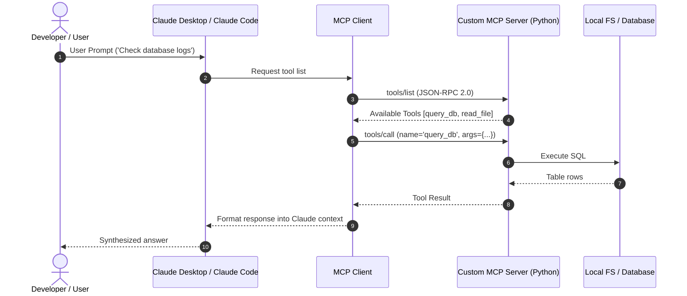

# 📹 Claude Code Skills: Full Guide

<div className="video-card" style={{border: '1px solid #30363d', borderRadius: '8px', padding: '16px', marginBottom: '24px', background: 'rgba(56, 139, 253, 0.05)'}}>
  <div style={{display: 'flex', gap: '16px', flexWrap: 'wrap'}}>
    <div><strong>Instructor:</strong> Nitish Singh (CampusX)</div>
    <div><strong>Duration:</strong> 49m 46s</div>
    <div><strong>Playlist:</strong> Agentic Coding with Claude Code (CampusX)</div>
    <div><strong>Watch Link:</strong> <a href="https://www.youtube.com/watch?v=JN7QCdvJwwM" target="_blank" rel="noopener noreferrer">YouTube Lecture ↗</a></div>
  </div>
</div>

## 📌 Executive Summary & Learning Objectives

This lecture covers **Claude Code Skills: Full Guide**, focusing on production implementations, edge cases, and industry standards:
- Core intuition, architecture, and underlying mechanisms.
- Key differences between theoretical research implementations and scalable enterprise patterns.
- Concrete Python walkthroughs, error recovery, and performance optimization.

---

## 🏗️ Architecture & Conceptual Workflow



---

## 📖 Core Concepts & Technical Deep Dive

### 1. Architectural Foundations
In modern production AI engineering, **Claude Code Skills: Full Guide** is essential for ensuring reliability, low latency, and deterministic outcomes. As AI systems evolve from naive prompt-in / completion-out scripts into distributed systems, engineers must handle:
- **State management & consistency:** Ensuring intermediate states and tool invocations are tracked.
- **Error boundaries & recovery:** Graceful degradation when external LLMs or vector stores encounter rate limits or network partitions.
- **Resource utilization & cost efficiency:** Caching common queries and reducing unnecessary foundation model token expenditure.

### 2. Operational Considerations
- **Latency Optimization:** Pre-computing embeddings, utilizing asynchronous non-blocking event loops, and streaming tokens via Server-Sent Events (SSE).
- **Security & Sandboxing:** Validating inputs before ingestion, sanitizing LLM outputs, and isolating tool execution environments.

---

## 💻 Production Implementation Walkthrough

```python
from mcp.server.fastmcp import FastMCP

# Initialize FastMCP Server
mcp = FastMCP("Production AI Tools Server")

@mcp.tool()
def calculate_token_cost(input_tokens: int, output_tokens: int, model: str = "gpt-4o") -> dict:
    """Calculate total API cost given token counts."""
    rates = {
        "gpt-4o": {"input": 2.50 / 1_000_000, "output": 10.00 / 1_000_000},
        "claude-3-5-sonnet": {"input": 3.00 / 1_000_000, "output": 15.00 / 1_000_000},
    }
    rate = rates.get(model, rates["gpt-4o"])
    cost = (input_tokens * rate["input"]) + (output_tokens * rate["output"])
    return {"model": model, "total_cost_usd": round(cost, 6)}

if __name__ == "__main__":
    # Runs stdio transport protocol for Claude Desktop & Claude Code
    mcp.run(transport="stdio")
```

---

## 💡 Production Best Practices & Tips

:::tip Production Deployment Guideline
When deploying Claude Code Skills: Full Guide in enterprise environments, always configure automated retries with exponential backoff and telemetry tracing (such as OpenTelemetry or LangSmith).
:::

:::warning Common Failure Modes
Watch out for state contamination across concurrent requests. Ensure each session or user interaction uses an isolated thread ID or execution context.
:::

---

## 🎯 Key Takeaways & Quick Reference

| Dimension | Production Standard | Pitfall to Avoid |
| :--- | :--- | :--- |
| **Execution** | Async / Non-blocking with timeouts | Synchronous blocking calls in event loops |
| **Data Validation** | Strict Pydantic v2 schemas | Untyped dictionary access |
| **Monitoring** | Distributed tracing & latency percentiles | Relying only on standard console logs |

## ⏱️ Lecture Timeline & Key Topics

| Timestamp | Key Topic / Concept Discussed |
| :--- | :--- |
| **00:00:00** | हाय गाइस, माय नेम इज नितेश एंड यू वेलकम... |
| **00:11:42** | फोल्डर हो सकता है। फॉर एग्जांपल आप एक... |
| **00:23:07** | द नेक्स्ट स्टेप इज़ टू आइट्रेट एंड... |
| **00:35:46** | स्किल को इंप्लीमेंट करना है टू बिल्ड आवर... |
| **00:49:43** | डू सब्सक्राइब।... |


---

---

## 📜 Complete Lecture Transcript (Hindi / Hinglish)

> **Language:** Hindi / Hinglish | **Source:** `10 - Claude Code Skills： Full Guide ｜ CampusX.hi.srt` | **Total Segments:** 25 | **Word Count:** ~8,399 words

<details>
<summary><b>Click to expand full chronological transcript (25 timestamped intervals)</b></summary>

#### ⏱️ [00:00 ➔ 00:02]

हाय गाइस, माय नेम इज नितेश एंड यू वेलकम टू माय YouTube चैनल। इस वीडियो में भी हम लोग अपना क्लॉड कोड प्लेलिस्ट कंटिन्यू करेंगे। और आज के वीडियो का टॉपिक है स्किल्स। स्किल्स एक बहुत इंपॉर्टेंट टॉपिक है और मैं इसको इसलिए इंपॉर्टेंट बता रहा हूं बिकॉज़ यह सिर्फ क्लॉड कोड के पर्सपेक्टिव से इंपॉर्टेंट नहीं है। स्किल्स कैन बी अप्लाइड टू रेगुलर क्लॉड चैटबॉट एज वेल एज क्लॉड कोवर्क। व्हिच बेसिकली मींस कि स्किल्स एक ऐसा टॉपिक है जिसको अगर आप अच्छे से सीख लेते हो तो आप उसको पूरे के पूरे क्लॉड इकोसिस्टम के ऊपर अप्लाई कर सकते हो और यही हमारे आज के वीडियो का गोल है कि हम सबसे पहले तो स्किल्स का जो कांसेप्ट है उसको थ्योरिटिकली बहुत अच्छे से समझेंगे और फिर उसको प्रैक्टिकली अप्लाई करना सीखेंगे। एंड सेकंड हम आज के वीडियो में अपना जो एक्सपेंस ट्रैकिंग वाला प्रोजेक्ट है उसको भी आगे बढ़ाएंगे। हम आज के वीडियो में हमारा जो एक्सपेंस ट्रैकिंग प्रोजेक्ट में जो प्रोफाइल पेज है उसको डिजाइन करेंगे और उसको डिजाइन करने के लिए हम स्किल्स का कांसेप्ट यूज़ करेंगे। तो दैट इज गोइंग टू बी द मेन आईडिया ऑफ दिस वीडियो। नाउ लेट्स स्टार्ट। अब स्किल्स क्या होते हैं? ये समझने के पहले हम यह समझेंगे कि स्किल्स कौन सी प्रॉब्लम को सॉल्व करते हैं और यह समझने के लिए एक छोटा सा डिस्कशन करते हैं। सो अगर हम बात करें क्लॉड की या चैट जीपीटी की या फिर जेमिनाई की तो इनको आप एक तरह का जनरल पर्पस लैंग्वेज मॉडल बोल सकते हो। व्हिच बेसिकली मीन्स कि इन सारे मॉडल्स के पास कैपेबिलिटी है रीजन करने की, लिखने की, इवन कोड लिखने की अक्रॉस डिफरेंट डोमेनस। बट द प्रॉब्लम इज कि देयर इज अ गैप बिटवीन जनरल कैपेसिटी एंड रिलायबल हाई क्वालिटी आउटपुट फॉर अ स्पेशल टास्क टाइप। इस लाइन का मतलब ये है कि ऑलदो हमारे ये जो मॉडल्स हैं ये बहुत अच्छी जनरल कैपेबिलिटी रखते हैं अक्रॉस वेरियस टास्क बट आप इसको जब कोई एक स्पेशलाइज्ड टास्क एग्जीक्यूट करने को बोलते हो बहुत अच्छे तरीके से तो वहां पे ये मॉडल्स लैक कर जाते हैं। अब इस पॉइंट को मैं एक एग्जांपल के थ्रू समझाता हूं। एग्जांपल है पीपीटी जनरेशन। मान लो कि आप

#### ⏱️ [00:02 ➔ 00:04]

एक कंपनी में एक मार्केटिंग टीम में काम करते हो और आप डे टू डे बेसिस पे आपको बहुत सारे पीपीटीस बनाने पड़ते हैं और आपको वो पीपीटीस हायर मैनेजमेंट के सामने प्रेजेंट करने पड़ते हैं। राइट? तो ये आपका एक बहुत इंपॉर्टेंट जॉब रिस्पांसिबिलिटी है। तो आप क्या करोगे कि आप क्लॉट जैसे किसी चार्ट पॉट को यूज़ कर सकते हो पीपीटी बनाने के लिए। आप रिसर्च करोगे और व्हनेवर यू आर श्योर कि नाउ आई एम रेडी टू क्रिएट अ पीपीटी आप क्लॉड को आसानी से बोल सकते हो कि जनरेट अ पीपीटी और बेस्ड ऑन आवर डिस्कशन। अब अच्छी बात क्या है कि क्लॉड या फिर चार्ट जीपीटी जैसे जो चैटबॉट्स हैं दे आर कैपेबल टू क्रिएट पीपीटीस। राइट? मतलब क्लॉड को पता है कि पावर पॉइंट प्रेजेंटेशन क्या होता है। क्लॉड को यह भी पता है कि किसी स्लाइड का स्ट्रक्चरिंग कैसे करनी चाहिए किसी डिस्कशन के बेसिस पे। और क्लॉड को ये भी पता है कि कौन सी पython लाइब्रेरी को मैं यूज़ कर सकता हूं इन ऑर्डर टू क्रिएट अ पीपीटी। बट द प्रॉब्लम इज़ कि इतना सब कुछ पता होने के बावजूद क्लॉड बहुत अच्छा पीपीटी आपके लिए नहीं बना पाएगा। और उसके पीछे प्राइमरी रीजंस यह हैं कि क्लॉट को यह समझ में नहीं आएगा कि आपके लिए जो पीपीटी बनाना है उसका लेआउट कैसे रखें। या फिर क्लॉट को ये समझ नहीं आएगा कि किस तरह के फोंट्स यूज़ करने चाहिए आपकी पीपीटी में। या फिर क्लॉट क्लॉट को ये समझ में नहीं आएगा कि कहां पे उसको ग्राफ्स में कहां पे उसको चार्ट्स डालने चाहिए। कहां पे उसको टेबल्स डालने चाहिए। इन शॉर्ट आपकी कंपनी के जो डिज़ाइन गाइडलाइंस है टू मेक अ पीपीटी वो क्लॉड को नहीं पता। क्लॉड के पास एक जनरल कैपेबिलिटी है टू क्रिएट पीपीटीस बट स्पेशलाइज्ड आपके टास्क के हिसाब से आपकी कंपनी के हिसाब से पीपीटीस कैसे बनाए जाते हैं ये स्पेशलाइज स्किल क्लॉड के पास नहीं है। आई रियली होप आपको ये बात समझ में आ रही है। तो ये प्रॉब्लम ना बहुत तरह के टास्क में आप फेस करोगे। फॉर एग्जांपल आप वेब वेब डेवलपमेंट कर रहे हो। आप फ्रंट एंड बना रहे हो अपनी वेबसाइट का कि आपकी वेबसाइट कैसी दिखती है और इसके

#### ⏱️ [00:04 ➔ 00:06]

लिए आप क्लॉट कोड जैसा सॉफ्टवेयर यूज़ कर रहे हो व्हिच इज अगेन ग्रेट एट जनरल रीजनिंग बट उसके पास स्पेशलाइज स्किल्स नहीं है टू अंडरस्टैंड कि आपकी कंपनी की वेबसाइट का डिज़ाइन उसको कैसा बनाना चाहिए या फिर लेट्स से आप डेटा एनालिस्ट हो और आप डेटा एनालिसिस के लिए क्लॉट जैसे टूल को यूज़ कर रहे हो तो वो जनरल लेवल पे डेटा एनालिसिस कर देगा बट स्पेशलाइज़्ड आपके काम के हिसाब से डाटा एनालिसिस कैसे करना है वो शायद वो अच्छे से ना समझ पाए पाए। फिर एग्जांपल ले सकते हैं डॉक्यूमेंट्स लिखने का। यू आर अ राइटर या फिर ब्लॉग राइटर हो। आपका क्या स्टाइल है? आप किस तरीके से डॉक्यूमेंट्स को फ्रेम करते हो? किस तरीके से प्रेजेंट करते हो अपने आईडिया को? ये बात क्लॉड को नहीं पता है। वन मोर एग्जांपल कुड बी कोड रिव्यु। यू आर अ सीनियर डेवलपर और आप कोड रिव्य्यू के लिए क्लॉड को यूज़ कर रहे हो। आपका कोड रिव्यु स्टाइल क्या है? यह क्लॉड को नहीं पता। तो दिस इज द मेन प्रॉब्लम जिसके ऊपर स्किल्स का कांसेप्ट आता है। सो द आईडिया इज सिंपल कि एलएलएम्स आर गुड एट जनरल रीजनिंग बट दे डोंट डू वेल ऑन स्पेशलाइज्ड टास्क। अब आप बोलोगे ये कौन सी बड़ी बात है? अगर मुझे कोई भी स्पेशलाइज्ड टास्क करवाना है फॉर एग्जांपल अपने लिए पीपीटी बनवानी है या कोड लिखवाना है या फिर कोई डॉक्यूमेंट क्रिएट करवाना है तो मैं क्या करूंगा कि मैं एक बहुत डिटेल्ड प्र्प में सारे के सारे इंस्ट्रक्शंस लिख करके बता दूंगा कि तुम इस तरीके से इस पीपीटी को बनाओ या इस तरीके से ये फ्रंट एंड डिजाइन करो। राइट? प्रॉब्लम सॉल्व हो गई। एक्चुअली प्रॉब्लम सॉल्व नहीं हुई। इससे और बहुत सारी प्रॉब्लम्स निकल के आती हैं। मैं आपको एक-एक करके बताता हूं। सबसे पहली और सबसे बड़ी प्रॉब्लम ये है कि अगर आपको वो काम बार-बार करवाना है। फॉर एग्जांपल आपको पीपीटीस बार-बार बनवानी है तो आपको क्या करना पड़ेगा कि आपको वो सेम डिटेल्ड प्र्ट अपने प्र्ट के अंदर टाइप करके डालना पड़ेगा। राइट? अब इसमें प्रॉब्लम ये है कि बार-बार लिखने में गलतियां हो सकती है। अब इसको भी आप काउंटर कर सकते हो। अब आप बोल सकते हो कि ठीक है मैं क्या करूंगा कि मैं

#### ⏱️ [00:06 ➔ 00:08]

रादर देन पुटिंग दैट डिटेल्ड प्र्प आई विल सेव इट एज अ सिस्टम प्र्प और सिस्टम प्र्ट तो बस एक ही बार देना पड़ता है। अब इसमें प्रॉब्लम ये है कि अगर आपने उसको सिस्टम प्र्ट में डाल दिया और मान लो वो 20,000 वर्ड्स का एक या 20,000 टोकंस का एक डिटेल्ड इंस्ट्रक्शन है। तो वो सीधे जाके आपकी कॉन्टेक्स्ट विंडो में बैठ जाएगा एंड इट विल ईट अप अ लॉट ऑफ स्पेस। अब आप भले ही उस प्र्प को यूज कर रहे हो या यूज ना कर रहे हो फिर भी आपका कॉन्टेक्स्ट विंडो वो खाते रहेगा। तो दैट इज वन प्रॉब्लम। और प्रॉब्लम क्या आ सकती है कि आप अपने डिटेल्ड प्र्ट के अंदर रिसोर्सेज ऐड नहीं कर सकते। फॉर एग्जांपल आप पीपीटी बनाने के प्रोसेस में कुछ चीजें बताना चाहते हो कि देखो इस तरह के चार्ट्स यूज़ करना, इस तरह के डिज़ाइंस यूज़ करना। तो ये फाइल्स आप कैसे अटैच करोगे अपने प्र्प के साथ? दिस इज़ वन मोर प्रॉब्लम। द नेक्स्ट प्रॉब्लम इज कि आप एक प्र्प्ट को शेयर नहीं कर सकते, इंप्रूव नहीं कर सकते, उसको वर्जन नहीं कर सकते। बिकॉज़ प्र्प इज अ वेरी पर्सनल थिंग। आई मीन देयर आर टूल्स जिसकी हेल्प से आप प्र्ट वर्जनिंग कर सकते हो, शेयर भी कर सकते हो। बट आज भी मोस्ट ऑफ़ द कंपनीज़ दे डोंट यूज़ सच टूल्स। तो प्र्प्ट इज़ समथिंग व्हिच इज़ वेरी पर्सनल टू यू। मैं इस तरह के प्र्प्ट्स लिखता हूं। कोई दूसरा किसी दूसरे तरह के प्र्प्ट्स लिखता है। जनरली हम प्र्प्ट्स एक दूसरे के साथ शेयर नहीं करते। तो दैट इज़ वन मोर प्रॉब्लम। एंड लास्टली प्र्प्ट्स डोंट कंपोज व्हाट इफ मुझे एक सिंगल टास्क करवाने के प्रोसेस में यू नो दो-तीन तरह के स्पेशलाइज्ड टास्क एग्जीक्यूट करने हैं। फॉर एग्जांपल मुझे पीपीटी बनाने के लिए पहले पीडीएफ रीड करना है। दैट इज़ वन स्पेशलाइज़्ड टास्क। उस पीडीएफ के अंदर से मुझे टेबल्स का इनेशन एक्सट्रैक्ट करना है। दैट इज़ अ सेकंड स्पेशलाइज़्ड टास्क। थर्ड उन एक्सट्रैक्टेड टेबल्स को यूज़ करके पीपीटीज़ बनानी है। तो पीपीटी बनाना इज़ अ थर्ड स्पेशलाइज़्ड टास्क। अब आपने इन तीनों के लिए डिटेल्ड इंस्ट्रशंस लिखे और उसको एक सिंगल प्र्ट में डाल दिया। अब हो क्या सकता है कि एलएलएम को जब इतना डिटेल्ड बड़ा और अलग-अलग कॉन्टेक्स्ट का जब प्र्प मिलता है तो हो सकता है कि वो इंस्ट्रक्शंस को

#### ⏱️ [00:08 ➔ 00:10]

मिसरीड कर जाए या कंफ्यूज कर जाए और उसका जो परफॉर्मेंस है वो उतना अच्छा निकल के ना आए। तो यू कैन नॉट कंपोज प्र्प्ट्स। तो दीज़ आर सम ऑफ़ द मेन रीज़ंस जिसकी वजह से आप डिटेल्ड प्र्ट लिख के अपने स्पेशलाइज़्ड टास्क अच्छे से नहीं करवा सकते। तो इस पॉइंट पे अगर मैं समराइज करूं तो हमने कोर प्रॉब्लम आइडेंटिफाई की है हमारे डे टू डे वर्क फ्लो में कि जब भी आपको स्पेशलाइज्ड काम अच्छे से करवाना है रिलायबली करवाना है बार-बार करवाना है तो उसमें एलएलएम्स अच्छे नहीं है। राइट? भले ही आप बहुत अच्छे प्र्ट्स लिख करके अपना काम करवाना चाहो बट प्र्प के थ्रू भी ये काम करवाना बड़ा मुश्किल है। एंड दिस इज़ व्हेयर द रिक्वायरमेंट ऑफ़ स्किल्स कम्स फ्रॉम। ठीक है? तो अब नाउ दैट यू अंडरस्टैंड व्हाई स्किल्स आर रिक्वायर्ड। अब मैं आपको समझाता हूं कि स्किल्स होते क्या हैं? अब देखो यहां पे मैंने लिख रखा है कि स्किल्स क्या होते हैं? एक बार इसको रीड आउट करते हैं। यहां लिखा हुआ है स्किल्स आर रयूजेबल फाइल बेस्ड रिसोर्सेज दैट प्रोवाइड क्लॉड विथ डोमेन स्पेसिफिक एक्सपर्टीज सच एज वर्क फ्लोस, कॉन्टेक्स्ट एंड बेस्ट प्रैक्टिससेस दैट ट्रांसफॉर्म्स जनरल पर्पस एजेंट्स इंटू स्पेशलिस्ट। तो एकदम सिंपल शब्दों में आपका जो स्किल है ना वो बेसिकली एक फोल्डर होता है इनसाइड योर प्रोजेक्ट और उस फोल्डर के अंदर हम अलग-अलग फाइल्स को रखते हैं जिसकी हेल्प से एजेंट्स को ये समझ में आता है या एलएलएम्स को ये समझ में आता है कि किसी स्पेशलाइज्ड टास्क को कैसे कैरी आउट करना है। और सबसे अच्छी बात क्या होती है स्किल्स की कि ये ऑटोमेटिकली तब लोड हो जाते हैं जब इनकी जरूरत होती है। वि मींस कि अगर मैं अभी नॉर्मल चैटिंग कर रहा हूं क्लॉड के साथ और इस पॉइंट पे मैंने एक भी बात नहीं की है कि मुझे पीपीटी बनानी है तो पीपीटी बनाने वाली स्किल इस पॉइंट पे मेरे कॉन्टेक्स्ट मेमोरी में लोड नहीं होगी। बट जैसे ही मैं ये टाइप करूंगा कि नाउ क्रिएट अ पीपीटी आउट ऑफ द डिस्कशन दैट वी हैड। तो अब जैसे ही क्लॉड को समझ में आया कि उसको एक पीपीटी बनाना है जिसके लिए

#### ⏱️ [00:10 ➔ 00:12]

उसको एक स्किल की जरूरत है तो वो झट से जाएगा हमारे फोल्डर में और उस स्किल वाले फोल्डर के अंदर घुसेगा और वहां से जो भी इंपॉर्टेंट फाइल्स हैं उनको लोड करेगा रीड करेगा और उस इंस्ट्रक्शन के बेसिस पे पीपीटी बना के आपको दे देगा। तो दिस इज द बेस्ट पार्ट। यहां पे लिखा हुआ है अनलाइक प्र्प्स स्किल्स लोड ऑन डिमांड एंड एलिमिनेट द नीड टू रिपीटेडली प्रोवाइड द सेम गाइडेंस अक्रॉस मल्टीपल कॉन्वर्सेशंस। तो जहां प्र्प्स को आप बोल सकते हो इंस्ट्रक्शंस जो वन ऑफ टास्क करवाने के लिए सही हैं। स्किल्स ऑन द अदर हैंड एक्ट लाइक जस्ट इन टाइम नॉलेज। जब आपको जरूरत है ऑटोमेटिकली लोड हो जाएगा। तो ये फोटो आप देखो। इससे आपके दिमाग में एकदम क्लियर पिक्चर बन जाएगा कि स्किल्स होते क्या हैं? स्किल्स इज नथिंग बट अ फोल्डर इनसाइड योर प्रोजेक्ट। ठीक है? और इस फोल्डर के अंदर क्या-क्या होता है? दो चीजें होती हैं। पहला एक स्किल डॉट फाइल होती है। अगर ये फाइल नहीं है तो स्किल काम नहीं करेगा। तो ये एकदम रिक्वायर्ड है। ठीक है? sिल डॉट एमडी फाइल के अंदर ही वो सारा डिटेल्ड इंस्ट्रक्शन लिखा होता है कि कैसे किसी स्पेशलाइज्ड टास्क को कैरी आउट करना है। सो अगर पीपीटी बनाने का स्किल है तो यहीं पे हर चीज लिखी होगी कि पीपीटी का लेआउट कैसा होगा? स्लाइड्स की स्ट्रक्चरिंग कैसी होगी? किस तरह का टाइपोग्राफी यूज़ होगा? आपके कब ग्राफ्स यूज़ होंगे, कब चार्ट्स यूज़ होंगे? किस तरह के सिचुएशन में टेबल्स डालने हैं? ये सारा इंस्ट्रक्शन बहुत डिटेल्ड तरीके से skिल डॉट फाइल में लिखा होगा। इसके अलावा अगर आपके स्किल को अपना काम करवाने के लिए कुछ और रिसोर्सेज की जरूरत है तो उन रिसोर्सेज के लिए डेडिकेटेड फोल्डर्स भी आप यहां पे बना सकते हो। जैसे कि स्क्रिप्ट्स का एक अलग फोल्डर हो सकता है। फॉर एग्जांपल आप एक डेटा एनालिसिस के लिए एक स्किल बना रहे हो। तो उसके लिए आपको कुछ पाइथन स्क्रिप्ट्स की जरूरत हो सकती है। तो उन पाइथन स्क्रिप्ट्स को आप स्क्रिप्ट्स बोल के फोल्डर के अंदर डाल सकते हो। फिर आप टेंपल्लेट्स बोल के एक फोल्डर बना सकते हो कि अगर आप पीपीटी वाला स्किल बना रहे हो उसके लिए आपको कुछ डिजाइन गाइडलाइंस चाहिए

#### ⏱️ [00:12 ➔ 00:14]

या कुछ रेफरेंस इमेज चाहिए तो उनको आप टेंपलेट्स फोल्डर में डाल सकते हो। तो दिस इज़ हाउ यू कैन ऑर्गेनाइज द स्किल्स फोल्डर। तो एकदम टॉप लेवल पे आपका प्रोजेक्ट फोल्डर है। उसके अंदर आपका डॉट क्लॉड फोल्डर है। डॉट क्लॉड फोल्डर के अंदर स्किल्स का फोल्डर है जिसके अंदर आप मल्टीपल स्किल्स डाल सकते हो। हर स्किल खुद में एक फोल्डर होगा। उस फोल्डर के अंदर स्किल डॉट एमडी फाइल होगी। साथ में और आपके रिसोर्सेज वाले फोल्डर्स होंगे। तो दिस इज़ द हायरार्की। तो आई होप आपको सबसे पहले यह बात समझ में आ गई। अब एक चीज और डिस्कस कर लेते हैं कि sिल डॉट एमडी फाइल जो कि एकदम रिक्वायर्ड फाइल है किसी भी स्किल को बनाने के लिए उसके अंदर क्या-क्या होता है? तो इसमें दो चीजें होती हैं प्राइमरी। कभी भी आप कोई भी स्किल का स्किल डॉट फाइल जब ओपन करोगे तो उसमें आपको टॉप पे दिखाई देगा यमल फ्रंट मैटर। इसमें दो चीजें होती हैं। पहला स्किल का नाम होता है जिस नाम से क्लॉट आइडेंटिफाई करता है स्किल को और सेकंड एक डिस्क्रिप्शन होता है। डिस्क्रिप्शन बहुत इंपॉर्टेंट चीज है। बिकॉज़ डिस्क्रिप्शन को पढ़ के ही क्लॉट को समझ में आता है कि किस तरह के सिचुएशन में इस स्किल का मुझे यूज़ करना है। या किस तरह के सिचुएशन में मुझे इस स्किल को लोड करना है। तो जैसे अगर आप एक पीपीटी वाला स्किल बना रहे हो तो आप यहां पे बहुत क्लियरली मेंशन करोगे कि जब भी यूजर किसी भी टाइप का पावर पॉइंट प्रेजेंटेशन बनाने को बोलेगा लोड दिस स्किल। तो ये काइंड ऑफ़ एक ट्रिगर होता है जिससे क्लॉड को समझ में आता है कि कब किस स्किल को लोड करना है। ठीक है? उसके बाद यामिल फ्रंट मैटर के नीचे आता है मार्कडाउन बॉडी। मार्कडाउन बॉडी में आप सब चीजें लिखते हो। सारा का सारा जो इंस्ट्रक्शन है, अगर कोड की जरूरत है, तो कोडिंग के जो भी पैटर्न्स हैं, क्या-क्या गलतियां हो सकती हैं, आपके क्या-क्या वैलिडेशन स्टेप्स हैं, ये सारी चीजें आप यहां पे लिखते हो। अगर आपके स्किल को अपना काम करने के लिए कुछ और फाइल्स की रिक्वायरमेंट है तो उन फाइल्स का पाथ लिंक भी आप यहीं पे प्रोवाइड करते हो। तो मान लो आपका डेटा एनालिसिस वाला स्किल है जिसको अपना काम करने के लिए कुछ पाइथन स्क्रिप्ट्स चाहिए। है वो Python

#### ⏱️ [00:14 ➔ 00:16]

स्क्रिप्ट्स आपकी स्क्रिप्ट्स फोल्डर के अंदर स्टर्ड है तो आप उनको मार्क डाउन बॉडी के अंदर ही लिंक दे लिंक कर दोगे तो आपका नीचे लिखा होगा कि टू प्लॉट दिस काइंड ऑफ़ ग्राफ यूज़ द फॉलोइंग कोड और कोड का लिंक है वो लिंक पे क्लिक करके आप स्क्रिप्ट फोल्डर के अंदर घुसोगे और वहां से आप कोड को एग्जीक्यूट करोगे। तो दिस इज़ हाउ द एंटायर स्ट्रक्चरिंग हैपेंस। ठीक है? तो एकदम टॉप पे स्किल्स का फोल्डर है। उसके अंदर स्किल डॉट एमmडी है। स्किल डॉट एमडी में सबसे टॉप पे यममेल फ्रंट मैटर है। जो बताता है स्किल का नाम और उसको कब ट्रिगर करना है। उसके नीचे मार्क डाउन बॉडी है जिसमें सारा डिटेल्ड इंस्ट्रक्शन है। अलोंग विद एनी काइंड ऑफ़ डिपेंडेंसी जो कि आपके बाकी के फोल्डर्स में एग्जिस्ट करती है। ठीक है? तो आई होप मैं आपको समझा पाया कि स्किल्स क्या होता है। ठीक है? अब मैं आपको बताता हूं कि एग्जैक्टली स्किल के लोड होने का प्रोसेस क्या है? कब और कैसे स्किल लोड होता है? ये मैं आपको नेक्स्ट बताता हूं। स्किल्स का कॉन्टेक्स्ट विंडो में जो लोड होने का प्रोसेस है उसको हम प्रोग्रेसिव डिस्क्लोज़र बुलाते हैं। और ये एक बहुत फेमस टर्म है। आप काफी इसको सुनोगे। अ इसमें होता क्या है? बेसिकली जो कोर आईडिया है वो ये है कि डोंट प्रेजेंट इंफॉर्मेशन अंटिल द मोमेंट इट्स नीडेड। ठीक है? द आईडिया इज़ वेरी सिंपल कि जब तक किसी इंफॉर्मेशन की जरूरत नहीं है तब तक हम उसको कॉन्टेक्स्ट विंडो में लोड नहीं करेंगे। क्योंकि कॉन्टेक्स्ट विंडो लिमिटेड है। उसको बचाना बहुत इंपॉर्टेंट है। दैट इज व्हाई हम स्किल्स को तब तक मेमोरी में लोड नहीं करेंगे जब तक कि उसके रिक्वायरमेंट ना हो। और अब ये तीन लेवल पे होता है। सो लेवल वन पे क्या होता है कि आपका स्किल का जो डिस्क्रिप्शन है जो आपका यामल फ्रंट मैटर है वो हमेशा लोड हो जाता है कॉन्टेक्स्ट में बिकॉज़ वो बहुत छोटा सा होता है। राइट? सिर्फ नेम है और डिस्क्रिप्शन है। तो आपके पास अगर 10 स्किल्स हैं तो 10ों स्किल का यामल फ्रंट मैटर या डिस्क्रिप्शन उठ के कॉन्टेक्स्ट में लोड हो जाता है। ठीक है? तो किसी भी सेशन के स्टार्टिंग में क्लॉड को हमेशा पता रहता है कि उसके पास कौन-कौन से स्किल्स हैं और उनका डिस्क्रिप्शन क्या

#### ⏱️ [00:16 ➔ 00:18]

है। मतलब उनको कब ट्रिगर करना है। अब जैसे ही यूजर एक मैसेज भेजता है फॉर एग्जांपल उसने मैसेज भेजा कि मुझे एक पीपीटी बना के दो। तो अब आपका जो क्लॉड है वो सर्च करेगा कि क्या मेरे पास कोई स्किल है जो पीपीटी बनाने में मुझे हेल्प कर सकती है। अगर उसको ऐसी स्किल मिलती है तो फिर वो लेवल टू पे क्या करेगा कि उस पर्टिकुलर स्किल का पीपीटी बनाने वाली स्किल का स्किल डॉट एमडी फाइल का जो बॉडी है उसको लोड करेगा। ठीक है? तो ये ऑन डिमांड लोड होती है। उसके बाद वो लाइन बाय लाइन आपके पूरे के पूरे बॉडी को रीड करेगा। सारे इंस्ट्रक्शन को रीड करेगा। और अब इस प्रोसेस में अगर skिल डॉट फाइल बोलेगा कि अब मुझे आगे का काम करने के लिए इस पर्टिकुलर रिसोर्स या इस पर्टिकुलर पाइथन स्क्रिप्ट की जरूरत है तो फिर लेवल थ्री पे आप उन रेफरेंस रिसोर्सेज को भी फैच करके लाते हो। तो द आईडिया इज़ वेरी सिंपल कि प्रोग्रेसिवली डिस्क्लोज़ करना है। जब जिस मोमेंट पे जिस चीज की जरूरत है उसी को हम लोड करेंगे। अदरवाइज़ हम पूरे टाइम अपने कॉन्टेक्स्ट विंडो को बचा के चलेंगे। ठीक है? तो दिस इज़ हाउ स्किल्स वर्क। एंड दैट इज व्हाई जो प्रॉब्लम मैंने आपको बताया था कि अगर आप एक सिस्टम प्र्ट बना के डाल देते हो स्किल का तो वो आपके पूरे टाइम कॉन्टेक्स्ट विंडो को खाता रहेगा। यहां पे वो सिचुएशन नहीं आती है। तो आई होप आपको समझ में आ गया स्किल्स कैसे काम करती हैं एंड व्हाट इज द कॉनंसेप्ट ऑफ प्रोग्रेसिव डिस्क्लोज़र। नेक्स्ट हम डिस्कस करेंगे कि व्हाट आर द डिफरेंट टाइप्स ऑफ स्किल्स दैट यू कैन क्रिएट। तो बेस्ड ऑन द स्कोप आप दो अलग टाइप के स्किल्स क्रिएट कर सकते हो। पहला है पर्सनल स्किल्स। ये वो स्किल्स हैं जो आप अपने क्लॉट होम फोल्डर में सेव करते हो। बेसिकली आपकी होम डायरेक्टरी में जो डॉट क्लॉड फोल्डर है उसके अंदर सेव करते हो और इन स्किल्स की खासियत क्या है कि ये आपके सारे प्रोजेक्ट्स में अवेलेबल रहते हैं। सो थोड़ी देर पहले जो मैंने आपको बताया था कि स्किल एक फोल्डर है जो आपके प्रोजेक्ट के अंदर लाई करता है। दैट इज नॉट एंटायरली करेक्ट। आप चाहो तो एक

#### ⏱️ [00:18 ➔ 00:20]

स्किल फोल्डर को अपने होम डायरेक्टरी के अंदर डॉट क्लॉट फोल्डर के अंदर भी डाल सकते हो। उससे क्या होगा कि वो पर्टिकुलर स्किल ऑटोमेटिकली आपके सारे प्रोजेक्ट्स में प्रेजेंट हो जाएगा। तो आपका पर्सनल कोडिंग स्टाइल हुआ या आपका पर्सनल राइटिंग स्टाइल हुआ या डिज़ स्टाइल हुआ जो आप हर प्रोजेक्ट में सेम रखना चाहते हो उस तरह की चीजों को आप पर्सनल स्किल्स के थ्रू क्रिएट कर सकते हो। एंड द सेकंड ऑप्शन इज प्रोजेक्ट बेस स्किल्स जिनको आप अपने करंट प्रोजेक्ट के अंदर डॉट क्लॉट फोल्डर के अंदर सेव करते हो। तो ये आपके प्रोजेक्ट स्किल्स कहलाते हैं और ये आपके सिर्फ करंट प्रोजेक्ट के ऊपर अप्लाई करते हैं। और इनको आप अपने टीममेट्स के साथ शेयर कर सकते हो। गेट पे अपलोड कर सकते हो और इसको वर्जन कर सकते हो, इंप्रूव कर सकते हो। ठीक है? तो यही दो मेन टाइप्स ऑफ स्किल्स हैं। मैं आपको दोनों के बारे में आगे चलके बताऊंगा। ठीक है? अ नेक्स्ट एक चीज और डिस्कस करते हैं कि व्हाट आर द वेज़ यूजिंग व्हिच यू कैन क्रिएट स्किल्स। तो सबसे पहला तरीका ये है कि आप मैनुअली स्किल्स को क्रिएट करो। क्योंकि काम तो बहुत सिंपल है। आपको एक फोल्डर बनाना है। उसके अंदर skिल डॉट फाइल बनानी है और उस skिल डॉट फाइल के अंदर डिटेल्ड तरीके से लिखना है कि आपका स्किल कैसे काम करेगा। तो यह कर तो कोई भी सकता है। ऐसा कुछ खास टेक्निकल डिफिकल्टी नहीं है। बट मैं रिकमेंड नहीं करता बिगिनर्स को कि वो खुद के स्किल्स मैनुअली क्रिएट करें। व्हाई? बिकॉज़ शुरू-शुर में आपके पास ना ये एक्सपीरियंस होता है कि स्किल्स को कैसे क्रिएट करना है ना आपके पास एग्जैक्ट फॉर्मेट का अंडरस्टैंडिंग होता है। तो इट इज़ ऑलवेज अ गुड आइडिया कि आप सेकंड तरीका यूज़ करो स्किल्स को क्रिएट करने का। दैट इज़ यूजिंग क्लॉड। आप क्लॉट चैटबॉट को यूज कर सकते हो स्किल्स बनाने के लिए। सो यहां पर अगर आप क्लॉट चैटबॉट में जाओ तो वहां पे आपको प्लस आइकन पे क्लिक करके नीचे स्किल्स का ऑप्शन दिखाई देगा और उसके ऊपर आपको ये स्किल क्रिएटर दिखाई देगा। स्किल क्रिएटर खुद एक स्किल है जिसकी हेल्प से आप दूसरे

#### ⏱️ [00:20 ➔ 00:22]

स्किल्स क्रिएट कर सकते हो। तो ये पर्टिकुलर स्किल क्लॉड आपको देता है और इस स्किल को यूज़ करके आप अपना कोई भी स्किल क्रिएट कर सकते हो। ठीक है? तो मैं आपको दिखाऊंगा थोड़ी देर के बाद कि कैसे हम अपने लिए एक स्किल क्रिएट करेंगे विद द हेल्प ऑफ स्किल क्रिएटर। ठीक है? तो ये ज्यादा रिकमेंडेड अप्रोच है। स्पेशली इफ यू आर अ बिगिनर एंड यू आर क्रिएटिंग योर फर्स्ट स्किल दैट यू यूज़ क्लॉट। ठीक है? एंड देन द थर्ड ऑप्शन इज़ दैट यू इंस्टॉल स्किल्स फ्रॉम कम्युनिटी सोर्सेस। दूसरों ने भी स्किल्स बना रखे हैं। आप उन स्किल्स को भी डायरेक्टली यूज कर सकते हो अपने प्रोजेक्ट में। सो अगर आप एक बार Google करोगे क्लॉट स्किल्स मास्टर प्लेस आई एम सॉरी मार्केट प्लेस तो आपको बहुत तरह की वेबसाइट्स दिखाई देंगी जैसे कि ये एक वेबसाइट है स्किल्स एमपी बोल के जहां पे आपको दूसरों की बनाई हुई स्किल्स दिखाई देंगी अलग-अलग डोमेन की तो आप मार्केटिंग में हो या फिर आप डेटा में हो या फिर कोडिंग में हो अलग-अलग डोमेनस के लिए आपको इस तरह की जगहों पे स्किल्स देखने को मिलेंगी। बट अगेन आई वुड रिकमेंड कि आप स्किल्स को थोड़ा केयरफुली ट्रीट करो। बिकॉज़ अ अगर आप कंप्लीटली रीड नहीं करते हो स्किल को तो इसमें कुछ सिक्योरिटी फ्लॉस भी हो सकते हैं। इस तरह की न्यूज़ भी आई है सरफेस पे कि किसी बंदे ने किसी दूसरे बंदे का स्किल यूज़ किया और उसकी वजह से उसके प्रोजेक्ट से कुछ इंपॉर्टेंट एपीआई कीज़ एक्सट्रा पब्लिक हो गए। तो प्लीज बी केयरफुल बाय यूजिंग कम्युनिटी स्किल्स। बट या एक अच्छा तरीका ये है कि आप एंथ्रोपिक की जो खुद की पब्लिक रेपोजिटरी है स्किल्स की आप उसको भी जाके चेक आउट कर सकते हो। यहां पे आपको एटलीस्ट वो जो रिस्क है सिक्योरिटी का वो नहीं होगा और आपको एंथ्रोपिक का एकदम जो स्टैंडर्ड स्किल्स हैं वो देखने को मिलेंगे। तो दीज़ आर द अ थ्री वेज़ यूजिंग व्हिच यू कैन क्रिएट स्किल्स फॉर योरसेल्फ। ठीक है? अभी थोड़ी देर बाद मैं आपको एक स्किल बना के दिखाऊंगा। अ और एक चीज और डिस्कस कर लेते हैं कि व्हाट आर द

#### ⏱️ [00:22 ➔ 00:24]

स्टेप्स टू क्रिएट अ स्किल। अ तीन-चार स्टेप्स का प्रोसेस है। सबसे पहला स्टेप ये है कि यू हैव टू आइडेंटिफाई द नीड। आप हर चीज के लिए स्किल नहीं बनाओगे। आप सिर्फ उन चीजों के लिए स्किल बनाओगे जो कि एक बहुत स्पेशलाइज्ड टास्क हैं और जो आपको बार-बार करने पड़ रहे हैं। तो उस तरह की चीजों के लिए ही आप स्किल क्रिएट करते हो। देन वंस यू हैव डिसाइडेड कि मुझे इस पर्टिकुलर चीज के लिए स्किल बनाना है। फिर आप उसके लिए एक डायरेक्टरी बनाते हो। उस डायरेक्टरी के अंदर आप एक skिल डॉट फाइल क्रिएट करते हो और वहां पे आप अपना पूरा डिटेल्ड इंस्ट्रक्शन लिखते हो कि वो स्किल काम कैसे करेगा। अगर कोई सपोर्टिंग फाइल्स चाहिए तो वो भी आप वहां पे प्रोवाइड करते हो। अ उसके बाद एक बार जब स्किल क्रिएट हो जाता है उसके बाद आता है एक बहुत इंपॉर्टेंट स्टेप और वो स्टेप है कि आप अपने स्किल को टेस्ट करते हो। ठीक है? तो ये खुद में एक बहुत बड़ा टॉपिक है कि कैसे आप अपने स्किल्स को इवैल्यूएट कर सकते हो। कैसे उसको बेंचमार्क कर सकते हो। बट वो हम इस पर्टिकुलर वीडियो में कवर नहीं करेंगे। बट आगे चल के मैं कभी इस टॉपिक के ऊपर जरूर कुछ आपको पढ़ाऊंगा। बट या टेस्टिंग द स्किल इज़ अ वेरीेंट स्टेप। एंड लास्टली वंस यू हैव टेस्टेड, यू हैव इवैल्यूएटेड। द नेक्स्ट स्टेप इज़ टू आइट्रेट एंड इंप्रूव। एक बार में कोई भी परफेक्ट स्किल नहीं बन सकता। आप एक स्किल बनाओगे। उसको टेस्ट करोगे। कुछ उसमें खामियां दिखाई देंगी। आप पलट के जाके इंप्रूवमेंट्स करोगे। फिर से रन करोगे। एंड यू डू इट आइटेटिवली। एंड इवेंचुअली चार से पांच आइट्रेशन के बाद आपको एक यूज़बल स्किल मिल जाता है। ठीक है? तो आई होप आपको स्किल्स के अराउंड जो भी थ्योरी है वो समझ में आ गई। अब प्रैक्टिकल चीजों की तरफ मूव करने के पहले एक चीज मैं आपको और दिखाना चाहूंगा। सो अगर आपको याद होगा थोड़ी देर पहले मैंने प्रम्प्ट्स में प्रॉब्लम्स गिनाई थी कि क्यों हम उनको स्किल्स की तरह यूज़ नहीं कर सकते। एक बार वापस उस स्लाइड की तरफ चलते हैं। तो ये मैंने पांच प्रॉब्लम्स बताई थी। एक बार देखते हैं कि इन पांचों प्रॉब्लम्स को स्किल्स का कांसेप्ट सॉल्व कर रहा है कि नहीं। सबसे पहले हमने बोला था कि अगर आप प्र्ट के थ्रू टास्क इंस्ट्रक्शन दोगे तो आपको हर बार रीटाइप करना पड़ेगा। स्किल्स के केस में ऐसा नहीं है। आपने एक फाइल बना के

#### ⏱️ [00:24 ➔ 00:26]

छोड़ दी है और वो फाइल ऑटोमेटिकली लोड हो जाती है जब भी जरूरत पड़ती है। तो ये प्रॉब्लम सॉल्व हो गई। सेकंड योर कॉन्टेक्स्ट विंडो गेट्स बर्न। अगर आप उसको सिस्टम प्र्ट की तरह यूज़ करो। यहां पे वह प्रॉब्लम नहीं है। हम सिर्फ डिस्क्रिप्शन प्रोवाइड कर रहे हैं। और जब ज़रूरत पड़ रही है स्किल की तभी वह लोड हो रही है। नेक्स्ट इट्स हार्ड टू बंडल रिसोर्सेज़ विथ प्र्ट्स। हमारे पास ये भी प्रॉब्लम नहीं है। हमारे पास फोल्डर्स हैं। उन फोल्डर्स के अंदर हम किसी भी तरह की फाइल्स, कोड्स रख सकते हैं। यू कांट शेयर वर्जन एंड इंप्रूव अ प्र्प्ट। सही बात है। लेकिन स्किल्स को हम शेयर भी कर सकते हैं, इंप्रूव भी कर सकते हैं। वो सिंपली गिट पर चली जाएगी और हमारे टीममेट्स उसके ऊपर कोलैबोरेट कर सकते हैं। लास्टली हमने बोला था कि प्र्पों्ट्स को आप कंपोज नहीं कर सकते बट स्किल्स को आप कंपोज कर सकते हो। आप तीन अलग स्किल्स को बनाओ। मान लो एक स्किल है पीडीएफ को लोड करने का स्किल। एक स्किल है पीडीएफ से टेबल एक्सट्रैक्ट करने का स्किल। और एक स्किल है पीपीटी बनाने का स्किल। तो पीपीटी बनाने का स्किल के स्किल डॉट फाइल के अंदर आप अ पीडीएफ रीड करने वाले स्किल को लिंक कर सकते हो। तो ऑटोमेटिकली फिर पीडीएफ लिंक करने वाले स्किल को लोड कर दिया जाएगा। अब पीडीएफ लोड करने वाले स्किल के अंदर आप लग लिख सकते हो कि कैसे टेबल्स को एक्सट्रैक्ट करना है? उसका स्किल क्या है? तो यू कैन एक्चुअली कनेक्ट लिंक्स लाइक यू कैन एक्चुअली कनेक्ट दीज़ स्किल्स लाइक लिंक्स। तो ये ऑप्शन आपके पास है कंपोजिबिलिटी का। ठीक है? तो स्किल्स आर वेरी वेरीरी पावरफुल और काफी थ्योरी हमने पढ़ ली। अब ज्यादा मजा तब आएगा जब आप इन चीजों को प्रैक्टिकली करके देखोगे। तो नाउ लेट्स मूव ऑन टू द प्रैक्टिकल पार्ट ऑफ दिस वीडियो। सो अब मैं आपको बताता हूं कि कैसे हम स्किल्स को इंप्लीमेंट करेंगे प्रैक्टिकली हमारी इस वेबसाइट में। सो अभी तक हमारी वेबसाइट में प्रोग्रेस ये है कि हमारा लैंडिंग पेज वगैरह बन चुका है और हमने इस वेबसाइट के अंदर रजिस्ट्रेशन और लॉग इन का फंक्शनैलिटी ऐड कर दिया है। बट द थिंग इज़ कि अभी इस पॉइंट पे अगर आप लॉग इन करते हो जैसे मैं आपको करके दिखा रहा हूं। तो आप वापस लॉग इन करके होम पेज पे ही आ

#### ⏱️ [00:26 ➔ 00:28]

जा रहे हो। राइट? भले ही आप लॉक्ड इन हो बट यू आर कमिंग ऑन द सेम पेज। आइडियली होता क्या है कि आप एक प्रोफाइल पेज या फिर डैशबोर्ड पर रीडायरेक्ट होते हो। तो आज हम लोग वह प्रोफाइल पेज डिजाइन करने वाले हैं और उस प्रोफाइल पेज का डिज़ हम करेंगे एक स्किल की हेल्प से। सो हम लोग ना एक फ्रंट एंड वेब डिज़ाइन का स्किल बनाएंगे और उस डिज़ की हेल्प से हम हमारा प्रोफाइल पेज डिज़ करेंगे। बट हमारा फ्लो ऐसा रहेगा कि पहले मैं आपको विदाउट स्किल यूज यूज किए प्रोफाइल पेज बना के दिखाऊंगा। फिर हम स्किल बनाएंगे और उस स्किल को इंप्लीमेंट करके दोबारा से प्रोफाइल पेज बनाएंगे। ऐसा क्यों कर रहा हूं मैं? सो दैट मैं आपको शो कर पाऊं कि स्किल के आने से आपका जो फ्रंट एंड डिज़ है वो इंप्रूव हुआ। ठीक है? तो दिस इज़ व्हाट वी आर गोइंग टू डू। चलो फिर स्टार्ट करते हैं। सबसे पहले यह हमारा प्रोजेक्ट रेपोजिटरी है। इसमें मैं क्लॉट स्टार्ट कर रहा हूं। और यहां पर मैं इस पर्टिकुलर सेशन का नाम रख रहा हूं प्रोफाइल पेज डिज़। और यहां पे अब हम क्या करेंगे? सबसे पहले अ हम लोग लिखेंगे स्लश क्रिएट स्पेक प्रोफाइल पेज इनफैक्ट जस्ट राइट प्रोफाइल पेज डिज़। अब ये स्लैश कमांड क्या करेगा कि हमारे लिए एक नया ब्रांच ओपन करेगा और वहां पर हमारे लिए एक स्पेक डॉक्यूमेंट क्रिएट करेगा। आई विल से यस। और यह हमारा प्रोफाइल पेज का स्पेक डॉक्यूमेंट जनरेट हो गया। अब इस स्पेक डॉक्यूमेंट में ना बहुत क्लियरली

#### ⏱️ [00:28 ➔ 00:30]

बताया नहीं गया है कि हमारा जो डैशबोर्ड है, प्रोफाइल पेज है, उसका डिज़ाइन कैसा होना चाहिए। तो इंस्टेड ऑफ यूजिंग दिस जनरेटेड स्पेक डॉक्यूमेंट व्हाट आई विल डू इज़ मैंने पहले से एक डॉक्यूमेंट बना रखा है। वो मैं यहां पे पेस्ट कर रहा हूं और मैं आपको बताता हूं रीड करके कि यहां पे क्या होने वाला है। सो यहां पे देखो लिखा हुआ है दिस फीचर रिप्लेसेस द स्लैश प्रोफाइल स्टब विद अ फुल्ली डिज़ प्रोफाइल पेज शोइंग स्टैक्टिक हार्डकोडेड डेटा। ठीक है? तो अभी हमारा जो प्रोफाइल पेज है उसमें प्राइमरीली तीन चीजें दिखाई देंगी। एक दिखाई देगा यूजर इनफो कार्ड्स जहां पर यूजर का डिटेल्स दिखाई देगा। उसके बाद समरी स्टैट्स जहां पे उसने एक पर्टिकुलर ड्यूरेशन में कितना खर्चा किया है? कितने नंबर ऑफ ट्रांजैक्शंस किए हैं और टॉप कैटेगरी क्या है जिसमें उसने खर्चा किया है यह दिखाया जाएगा। उसके नीचे एक ट्रांजैक्शन हिस्ट्री टेबल दिखाया जाएगा जहां पर सारे एक्सपेंसेस दिखाए जाएंगे और उसके नीचे एक कैटेगरी ब्रेकडाउन दिखाया जाएगा जो कि बेसिकली ये बताएगा कि हर कैटेगरी में उसने कितना खर्चा किया। बट एक इंपॉर्टेंट बात क्या है कि ये सब कुछ जो यूआई बनेगा ये स्टैटिक यूआई होगा। इसके अंदर जो डेटा आपको दिखाई देगा वो हमारे डेटाबेस से नहीं आ रहा होगा। वो हार्ड कोडेड डेटा होगा। डमी डेटा होगा। ठीक है? तो यही डिटेल्स मैंने यहां पे लिखे हुए हैं। आप आपको जब ये फाइल मिलेगी गेट hub के ऊपर तो आप एक बार जाके इस पेज को गो थ्रू करना। बहुत ही सिंपल इंस्ट्रक्शंस हैं। ठीक है? तो ये बन गया हमारा स्पेक डॉक्यूमेंट। अब हम प्लान मोड में जाते हैं एंड वी विल से रीड द क्लॉट डॉट फाइल एंड स्पेक्स 04 प्रोफाइल पेज डॉट एमडी एंड कम अप विद द डिटेल्ड इंप्लीमेंटेशन प्लान।

#### ⏱️ [00:30 ➔ 00:32]

लेट्स इट एंटर। तो गाइज़ ये बन गया हमारा प्लान। अब हम इंप्लीमेंटेशन स्टार्ट करते हैं। यह बन गया प्रोफाइल. यह सीएसएस में चेंजेस हो रहे हैं। ओके। यहां पर अपने आप क्लॉट कुछ टेस्ट्स क्रिएट कर रहा है जो कि मैं नहीं चाहता हूं। सो आई वुड से नो। और प्लान इंप्लीमेंटेशन रुक गया। सो आई विल सिंपली से कंटिन्यू इंप्लीमेंटिंग द प्लान। एक काम करते हैं। एक बार इसको अलऊ कर देते हैं। अदरवाइज प्रोसेस रुक जा रहा है। मैं मैनुअली जाके उस फाइल को डिलीट कर दूंगा। यस। एक्चुअली वो बिहाइंड द सीन्स टेस्ट को रन भी कर रहा है। आई गेस। ठीक है? इट सेस कि ऑल सिक्स टेस्ट्स पास्ड। तो हुआ क्या कि उसने नॉट ओनली हमारा प्रोफाइल पेज डिजाइन किया बट साथ ही साथ उसने अ कुछ टेस्ट भी लिख दिए और फिर उनको चला के देख भी लिया और सारे टेस्ट पास भी हो गए। आइडियली ऐसा किया जाता है। आप टेस्ट जनरेट करते हो और उनको रन करके देखते हो। बट हमारा वर्क फ्लो अभी ये नहीं था। अ मुझे थोड़ा और क्लियरली यहां पे लिखना चाहिए था कि आई डोंट वांट टू जनरेट एनी काइंड ऑफ़ टेस्ट्स। बट ठीक है। यहां पर आई गेस यहां से वह पिक कर रहा है इस लाइन से। बट ठीक है। कोई बात नहीं। एक काम करते हैं। वापस वेबसाइट पर चलते हैं। यह रही हमारी वेबसाइट। एक बार साइन आउट करते हैं। साइन इन करते हैं फिर से। यह हमारा यूजर था। यह उसका पासवर्ड था। एंड हम रीडायरेक्ट तो नहीं हुए। एक काम करते हैं। स्लश प्रोफाइल रीडायरेक्ट पे

#### ⏱️ [00:32 ➔ 00:34]

हिट करके देखते हैं। एंड यू कैन सी दिस इज द यूआई जो बना है। यह ऑलरेडी मुझे काफी अच्छा लग रहा है। आई डोंट नो जब हम स्किल यूज़ करेंगे फ्रंट एंड वाला तो क्या इसको भी हम इंप्रूव कर पाएंगे कि नहीं। अ बट ठीक है। चलो फॉर नाउ दिस इज़ द आउटपुट। ये जो भी डेटा आपको दिखाई दे रहा है, दिस इज़ ऑल हार्ड कोडेड। ये डेटाबेस से नहीं आ रहा ये डेटा। हमारे डेटाबेस में इनफैक्ट अभी कोई डेटा है भी नहीं। ठीक है? अगर होगा अभी तो वो हमने खुद से ही जनरेट किया होगा। यूजर ने अभी तक खुद से कोई डेटा जनरेट नहीं किया है। सो दिस इज़ ऑल टॉय डेटा। ठीक है? एक काम और कर लेते हैं। एक छोटा सा कोड हम चलो बाद में लिखेंगे। पहले एक काम करते हैं। लेट्स क्रिएट आवर फ्रंट एंड स्किल और उसको इंप्लीमेंट करके एक बार हम लोग यूआई को दोबारा से बिल्ड करते हैं। सो स्किल मैंने क्रिएट कर लिया है विथ द हेल्प ऑफ क्लॉड। मैं आपको दिखाता हूं मैंने एग्जैक्टली क्या वर्क फ्लो यूज़ किया। मैंने सबसे पहले क्लॉड स्टार्ट किया और वहां पे मैं नीचे गया और वहां से स्किल स्किल क्रिएटर पे मैं गया और मैंने एंटर मार दिया। दिस वाज़ द मैसेज जो क्लॉड को मिला उसने फिर मुझसे पूछा कि व्हाट वुड यू लाइक टू डू? तो मैंने बोला कि आई वुड लाइक टू क्रिएट अ न्यू स्किल फ्रॉम स्क्रैच। उसने मुझे दो-तीन ऑप्शंस और दिए थे। उसने बोला ग्रेट लेट्स बिल्ड वन टू ड्राफ्ट अ गुड स्किल। आई नीड टू अंडरस्टैंड अ फ्यू थिंग्स व्हाट यू वांट इट टू डू। ठीक है? फिर उसने मेरे से पूछा कि बताओ स्किल क्या करेगा? तो मैंने फिर गिवन ऑप्शंस में ये सेलेक्ट किया कि मैं खुद से अपने वर्ड्स में डिस्क्राइब करना चाहता हूं। तो उसने मुझसे बोला कि ठीक है तीन चीजें बताओ स्किल क्या करेगा? कब ट्रिगर होगा और सक्सेसफुल होने पे चीजें कैसी दिखाई देंगी? मैंने यहां पर एक डिटेल्ड तरीके से ये तीनों क्वेश्चंस को आंसर किया। ठीक है? ये स्किल क्या करता है? उसके बाद

#### ⏱️ [00:34 ➔ 00:36]

बेसिकली मैंने तीनों क्वेश्चंस को बहुत डिटेल में आंसर किया। अगेन आप वीडियो पॉज करके पढ़ सकते हो। और उसके बाद जैसे ही उसको ये आंसर मिला उसने स्किल बनाना शुरू कर दिया। उसने हमारा गेटब रेपोजिटरी भी देखा। उससे भी उसने समझा कि हमारा कोड कैसे स्ट्रक्चरर्ड है। और फाइनली उसने बोला आई हैव इनफ कॉन्टेक्स्ट टू वर्क विद अह दिस पर्टिकुलर प्रोजेक्ट। फिर उसने तीन क्वेश्चंस पूछे। शुड द स्किल प्रोड्यूस फ्लास जिंजर 2 प्लस वैनिला सीएसएस? मैंने बोला यस स्टे ट्रू टू द प्रोजेक्ट। उसने बोला आइकॉन्स के लिए कौन सी लाइब्रेरी प्रेफर करोगे? मैंने ये ऑप्शन सेलेक्ट किया। उसके बाद उसने बोला आफ्टर आई ड्राफ्ट द स्किल। डू यू वांट टू टेस्ट इट ऑन अ कपल ऑफ रियल प्र्प्ट्स बिफोर फाइनललाइजिंग। मैंने बोला नहीं टेस्ट अभी मैं नहीं करूंगा। मैं खुद से चला के देखूंगा। आप टेस्ट भी करवा सकते हो। उसके बाद उसने क्या किया? स्किल को बनाना शुरू किया और फाइनली उसने यहां पे स्किल बना के हमें दे दिया। आप चाहो तो इस फाइल पे क्लिक कर सकते हो। और ये उसने हमारा फ्रंट एंड डिज़ाइन स्किल क्रिएट किया है। आप चाहो तो उसका मार्कडाउन कोड भी देख सकते हो। तो अब मुझे कुछ नहीं करना है। मुझे सिंपली इस कोड को कॉपी करना है। अपने प्रोजेक्ट में जाना है। प्रोजेक्ट में हमारी डॉट क्लॉट डायरेक्टरी है। इसके अंदर हम एक नया फोल्डर बनाएंगे बाय द नेम ऑफ स्किल्स। और स्किल्स के अंदर हम फिर से एक नया फोल्डर बनाएंगे बाय द नेम ऑफ फ्रंट एंड डिज़। और फ्रंट एंड डिज़ के अंदर हम एक नई फाइल बनाएंगे। बाय द नेम ऑफ स्किल डॉट md और उस फाइल के अंदर हम यह पूरी चीज को पेस्ट कर देंगे। एंड दैट्स इट गाइस। हमने हमारी खुद की फ्रंट एंड डिज़ स्किल क्रिएट कर ली। अब बस हमें क्या करना है? हमें इस स्किल को इंप्लीमेंट करना है टू बिल्ड आवर यूआई। ठीक है? तो यूआई तो हमने पहले से बना रखा है। तो व्हाट वी विल डू इज कि हम हमारा जो एकिस्टिंग प्रोग्रेस है जहां पे हमने यूआई बनाया है उसको इरेज़ करेंगे। जो

#### ⏱️ [00:36 ➔ 00:38]

हमने अभी यूआई बनाया है उसको इरेज़ करेंगे और इरेज़ करने का तरीका क्या है कि आपके पास एक कमांड होता है जिसको हम बोलते हैं रिवाइंड। रिवाइंड से आप अपने कोड और कॉन्वर्सेशन में पीछे जा सकते हो। सो जैसे ही आप इस पे एंटर करोगे तो वो आपसे पूछेगा कि आपको कितना पीछे जाना है। तो मैं क्या करना चाहता हूं? मैं सीधे यहां पे जाना चाहता हूं जहां पे मैंने स्पेक क्रिएट करवाया था। ठीक है? मैं उस जगह पे जाना चाहता हूं। एकदम शुरू में इस पूरे सेशन के एकदम शुरू में जाना चाहता हूं। मैंने एंटर मारा। अब वो मुझसे ऑप्शंस दे रहा है कि सिर्फ कॉन्वर्सेशन रिस्टोर करना है या फिर कोड प्लस कन्वर्सेशन दोनों को हमें रिस्टोर करना है। तो आई वुड सेलेक्ट द फर्स्ट ऑप्शन और आप एक चीज देखोगे कि यहां स्पेक्स में ये जो स्पेक क्रिएट हुआ था वो स्पेक हट जाएगा। एंड यू कैन सी एंड यू कैन सी वो स्पेक हट गया। ठीक है? और जो भी प्रोग्रेस हुआ था कोड के पॉइंट ऑफ व्यू से वो भी पीछे चला गया। ठीक है? अब मैं क्या करूंगा? मैं एक बार फिर से स्पेक क्रिएट करूंगा। यू कैन सी नया ब्रांच बना और स्पेक फिर से क्रिएट हो रहा है। यह बन गया हमारा स्पेक। यस किया हमने। एंड दिस इज़ द स्पेक। जैसा मैंने लास्ट टाइम भी किया था। मैं इस स्पेक को रिप्लेस कर रहा हूं मेरे बनाए हुए स्पेक से। जहां पे मैंने क्लियरली मेंशन कर रखा है कि मुझे मेरे यूआई में क्या-क्या चाहिए। बस इस बार मैं क्या करूंगा? ये लास्ट टेस्ट वाला जो लाइन है इसको हटा दूंगा। सो दैट अननेसेसरी टेस्ट्स जनरेट ना हो। और आई विल क्विकली चेक कि कोई और गलती तो नहीं है। फाइन। नेक्स्ट हम क्या करेंगे कि हम एक बार ना इस कॉन्वर्सेशन से एग्जिट कर जाएंगे। एग्जिट हम इसलिए कर रहे हैं बिकॉज़ जभी भी आप एक नया स्किल बनाते हो तो वो तब तक आप यूज़ नहीं कर सकते जब तक आप क्लॉट को

#### ⏱️ [00:38 ➔ 00:40]

एक बार रिस्टार्ट ना करो। बिल्कुल वैसा ही जैसे आप कमांड्स के साथ करते हो। तो आई विल राइट क्लॉड - आर और मैं प्रोफाइल पेज डिज़ाइन वाले कॉन्वर्सेशन में जाऊंगा और यहां पे अब मेरे पास स्पेक डॉक्यूमेंट रेडी है। अब मैं प्लान मोड में जाऊंगा और ये रहा मेरा अ प्लान वाला प्र्प। ठीक है? और ये मैंने एंटर मारा और अब प्लानिंग स्टार्ट हो जाएगी। देखो यहां पर लिखा आ रहा है एक्सीलेंट फेज वन कंप्लीट। नाउ लेट मी इनवोक द फ्रंट एंड डिजाइन स्किल एज रिक्वेस्टेड फॉर डिज़ गाइडेंस। ठीक है? तो वो ऑटोमेटिकली लोड हो रही है सक्सेसफुली लोडेड स्किल। ठीक है? तो ये प्लानिंग के टाइम पे ही ऑटोमेटिकली हो रहा है। सो नाउ द प्लान इज़ रेडी। तो इसको इंप्लीमेंट करते हैं बाय एक्सेप्टिंग यस। सो बेस.ml में चेंजेस हो गए। नेक्स्ट प्रोफाइल में कोड लिख रहा है क्लॉड एंड अगेन कुछ तो वह पाई टेस्ट का रन कर रहा है। सो आई विल से यस। सो ये हमारा प्लान इंप्लीमेंट हो गया। अब एक बार इसको ट्राई करते हैं। सो ये हमारी वेबसाइट है। इसको हमने रीलोड किया। साइन इन पे चलते हैं। और यह हमारा पिछला वाला डिज़ाइन है जो हमने विदाउट स्किल इंप्लीमेंट किए बनाया था। अब देखते हैं कि विद स्किल हमारा डिजाइन कैसा बना है। 1 2 3 4 साइन इन और हमको जाना है स्लैश प्रोफाइल में। एंड यू कैन सी गाइस दिस इज़ द अह डिज़ाइन। दिस वाज द प्रीवियस डिजाइन एंड दिस इज द न्यू डिजाइन। तो यू कैन सी माइल्ड इंप्रूवमेंट है लाइक इसने खुद से यह डिसीजन ले लिया कि यह जो कैटेगरीज वाला

#### ⏱️ [00:40 ➔ 00:42]

है यह आपका ट्रांजैक्शन वाले टेबल के साथ आ सकता है। इसके लिए इतना बड़ा एक पूरा कार्ड स्पेंड करने की जरूरत नहीं है। फोंट्स सिमिलर ही लग रहे हैं मुझे। इट्स जस्ट स्लाइटली बेटर है। आई गेस आइकॉनंस सम हाउ यूज नहीं हुए। अ आइकंस यूज़ होने चाहिए थे। बट या मतलब दिस इज द आउटपुट गाइस। मतलब आई होप मैं आपको स्लाइटली दिखा पाया कि क्या इंप्रूवमेंट होता है। दिस इज़ अ वेरी स्मॉल एप्लीकेशन। बहुत बेसिक चीज है। बहुत ज्यादा डिफरेंशिएट करने का मौका नहीं मिला स्किल को। बट व्हेन यू आर डूइंग अ प्रॉपर कॉम्प्लेक्स टास्क, वहां पे यू विल सी द डिफरेंस व्हेन यू आर यूजिंग स्किल्स। तो आई रियली होप आपको मैं समझा पाया कि कैसे स्किल्स को आप प्रैक्टिकली इंप्लीमेंट करते हो। एक छोटा सा चेंज और कर लेते हैं कि अ जभी भी लॉग इन करेंगे वी शुड ऑटोमेटिकली बी रीडायरेक्टेड टू द प्रोफाइल पेज। यह एक बार कोड कर लेते हैं। मेक श्योर द लॉग इन यूजर ऑटोमेटिकली गेट्स रिीडायरेक्टेड। टू द प्रोफाइल पेज एंटर यस ठीक है। एक बार ट्राई आउट करते हैं इसको। सो एक बार मैं साइन आउट कर रहा हूं। लेट मी साइन इन। यह मैंने साइन इन किया एंड आई एम बैक टू अ माय प्रोफाइल पेज। ठीक है? और एक काम और कर लेते हैं एक बार साइन आउट करके। इफ आई ट्राई टू एक्सेस माय प्रोफाइल पेज, आई शुड बी रीडायरेक्टेड बैक टू द लॉग इन पेज। देयर इज़ वन मोर थिंग दैट आई वुड लाइक टू करेक्ट। और वो यह है कि लॉग इन करने पे यहां पे हमें वेलकम बैक दिखाई दे रहा है। अ इसकी

#### ⏱️ [00:42 ➔ 00:44]

जरूरत नहीं है। एक्चुअली एक काम करते हैं। व्हाट वी कैन डू इज वी कैन टेक अ स्नैपशॉट। एंड वी से डोंट वांट टू शो दिस वेलकम मैसेज आफ्टर लॉग इन डन साइन आउट साइन इन सो या अब हम लोग रीडायरेक्ट तो हो रहे हैं बट हमें कोई वेलकम का मैसेज नहीं दिख रहा। हमें डायरेक्टली हमारा प्रोफाइल पेज दिखाई दे रहा है। व्हिच इज़ दिस पेज। ठीक है? एंड नाउ वी कैन आल्सो साइन आउट। वी कैन गो टू रजिस्टर एंड या। सो इस पॉइंट पे हमारी वेबसाइट में लैंडिंग पेज है, लॉगिन हो रहा है, रजिस्ट्रेशन हो रहा है और प्रोफाइल पेज का हमने यूआई क्रिएट कर लिया है। आई होप आपको अभी तक का प्रोग्रेस समझ में आ रहा है। अब एक काम कर लेते हैं। जो भी चेंजेस हमने इस ब्रांच में किए हैं उनको कमिट कर लेते हैं। सो वी विल राइट गेट ऐड गेट कमिट -m ऐड प्रोफाइल पेज यूआई देन गेट पुश आई विल क्विकली चेक कि मेरे ब्रांच का नाम क्या है? ओके। सो देयर आर टू डिज़ अ देयर आर टू ब्रांचेस। एक्चुअली हुआ क्या कि हमने दो बार ये पूरा प्रोसेस किया। तो दो बार हमने स्पेक फाइल जनरेट की। उस प्रोसेस में दो ब्रांचेस बन गए। कोई बात नहीं। अह अभी जो भी चेंजेस हुए हैं, वह प्रोफाइल पेज डिज़ाइन वाले ब्रांच में हुए हैं। तो, एक काम करते हैं। आई विल राइट गेट पुश ओरिजिन

#### ⏱️ [00:44 ➔ 00:46]

फीचर स्लश प्रोफाइल पेज डिज़। हिट एंटर। लेट्स गो टू आवर गेट पेज एंड यू कैन सी यहां पर हमारा दिखाई दे रहा है। सो लेट्स क्रिएट अ पुल रिक्वेस्ट। क्रिएट पुल रिक्वेस्ट। मर्ज कर लेते हैं। मर्ज हो गया। एक बार लेट मी क्विकली चेक डॉट क्लॉट के अंदर स्किल्स के अंदर ये रहा हमारा फ्रंट एंड डिज़ाइन वाला स्किल। तो या दिस इज वर्किंग नाउ व्हाट वी विल डू इज वी विल गेट चेक आउट मेन एंड देन वी विल डू गेट पुल ओरिजिन मेन। ठीक है? सारा कोड हमने पुल कर लिया। अब हम दोनों ब्रांचेस को डिलीट कर देंगे। गेट ब्रांच माइनस डी फीचर प्रोफाइल पेज एंड एक और ब्रांच जो हमने गलती से क्रिएट की थी। गलती से वाली तो डिलीट कर दी। एक और जो ब्रांच है वह है प्रोफाइल पेज डिज़ाइन। इसको भी हमने डिलीट कर दिया। अब हमारे पास एक ही ब्रांच होनी चाहिए व्हिच इज़ द मेन ब्रांच। ठीक है? तो नाउ वी आर डन स्लैश एग्जिट। ठीक है? तो हमने प्रोफाइल पेज वाला पूरा वर्क फ्लो कंप्लीट कर लिया। डिज़ाइन

#### ⏱️ [00:46 ➔ 00:48]

कंप्लीट कर लिया विद द हेल्प ऑफ स्किल्स। अब वीडियो को खत्म करने के पहले एक लास्ट चीज मुझे आपके साथ डिस्कस करनी है और वो यह है कि हमने इस प्लेलिस्ट में पहले कमांड्स के बारे में पढ़ा था स्लैश कमांड्स के बारे में। राइट? अ और हमने कुछ स्लैश कमांड्स बनाए भी थे। जैसे कि क्रिएट स्पेक डॉट एमडी कमांड जिसकी हेल्प से हम किसी भी नए फीचर का स्पेक जनरेट कर रहे थे। गोइंग फॉरवर्ड क्या हुआ है कि एंथ्रोपिक ने कमांड्स और स्किल्स जो हमने आज पढ़ा इन दोनों कांसेप्ट्स को मर्ज कर दिया है। गोइंग फॉरवर्ड कमांड्स एग्ज़िस्ट नहीं करेंगे। सिर्फ स्किल्स एकज़िस्ट करेंगे। व्हिच बेसिकली मींस कि अगर आपको कोई कमांड भी बनाना है तो आप उसको बिल्कुल वैसे ही बनाओगे जैसे आप किसी स्किल को बनाते हो। तो आप उस कमांड का एक फोल्डर बनाओगे। उस फोल्डर के अंदर एक स्किल डॉट एमडी फाइल और उसके रिसोर्सेज को रखोगे। अब आई नो थोड़ा काउंटर इंट्यूटिव साइन साउंड कर रहा होगा कि कमांड और स्किल दो कंप्लीटली अलग चीजें हैं। कमांड को हम ट्रिगर करते हैं एज इन द यूजर द प्रोग्रामर। वेयर एज स्किल ऑटोमेटिकली इनवोक हो जाता है। जब भी मॉडल को लगता है कि उसको अ स्किल की जरूरत है। तो हो क्या रहा है बेसिकली कि दोनों का जो स्ट्रक्चरिंग है ना वो सेम है। आप दोनों ही केसेस में एक मार्कडाउन फाइल बनाते हो। दोनों ही केसेस में एक यामेल फ्रंट मैटर ऐड करते हो। डिस्क्रिप्शन ऐड करते हो और नीचे एक डिटेलिंग ऐड करते हो। तो एंथ्रोपिक ने सोचा कि दो अलग फाइल स्ट्रक्चर बनाने का क्या फायदा? एक सिंगल फाइल स्ट्रक्चर ही रखते हैं। और दोनों को ही आप स्लैश कमांड के थ्रू इनवोक कर सकते हो। मैं आपको दिखाता हूं। सो अगर आप एक नया क्लॉट सेशन स्टार्ट करो और आप स्लैश टाइप करो तो आपको दिखाई देगा कि ये देखो ये जो आपको दिख रहा है स्पेंडली यूआई डिज़र अब ये कमांड हमने नहीं बनाया ये एक्चुअली

#### ⏱️ [00:48 ➔ 00:49]

हमारा स्किल है जो अभी हमने क्रिएट किया तो आप इस स्किल को स्लैश के थ्रू भी एक्सेस कर सकते हो तो गोइंग फॉरवर्ड स्किल कमांड दोनों को आप स्लैश से एक्सेस कर सकते हो। बट एंथ्रोपिक रिकमेंड्स कि डोंट क्रिएट कमांड्स और सिर्फ स्किल्स बनाओ। अगर आप एक [गला साफ़ करने की आवाज़] ऐसा स्किल बनाना चाहते हो जिसको आप कमांड की तरह यूज़ करना चाहते हो। आप चाहते हो कि सिर्फ आप उसको इनवोक करो। क्लॉड खुद से उसको कभी भी ऑटो इनवोक ना करे। उस केस में आपको बस अपने फ्रंट मैटर में एज एन यममेल फ्रंट मैटर में यह फ्लैग ऐड कर देना है। डिसेबल मॉडल इनवोकेशन ट्रू। इससे क्या होगा कि कभी भी क्लॉड अपना काम करने के प्रोसेस में खुद से इस स्किल को या इस कमांड को पिक नहीं करेगा। तो एकदम सिंपल समरी अगर मैं दूं गोइंग फॉरवर्ड कमांड्स बोल करके कोई फोल्डर एक्सिस्ट नहीं किया करेगा। ऑलदो इस प्रोजेक्ट में हम कमांड्स फोल्डर रखेंगे बट आगे जब हम प्रोजेक्ट्स बनाएंगे वहां पे कमांड्स एक्सिस्ट नहीं करेंगे। ये जो भी कमांड्स हैं ये एक्चुअली स्किल्स वाले फोल्डर के अंदर रहेंगे और इनके स्किल डॉट एमडी फाइल में हम ये लाइन ऐड कर देंगे। दैट्स इट। सो दैट यह ऑटोमेटिकली डिस्कवर ना हो पाए इन फ्रंट ऑफ क्लॉड। ठीक है? तो थोड़ा सा कंफ्यूजिंग है बट स्टिल गोइंग फॉरवर्ड दिस इज़ द न्यूज़ दैट स्किल्स एंड कमांड्स हैव बीन मर्ज्ड। ठीक है? तो विथ दैट आई विल कंक्लूड दिस वीडियो। आई होप आपको स्किल्स का कांसेप्ट समझ में आ गया। और प्रैक्टिकली इसको कैसे इंप्लीमेंट करना है वो भी आपने देख लिया। और मिलते हैं नेक्स्ट वीडियो में। अगर आपको यह वीडियो पसंद आया तो प्लीज लाइक करना। अगर आपने इस चैनल को सब्सक्राइब नहीं किया है तो प्लीज डू सब्सक्राइब।

</details>
