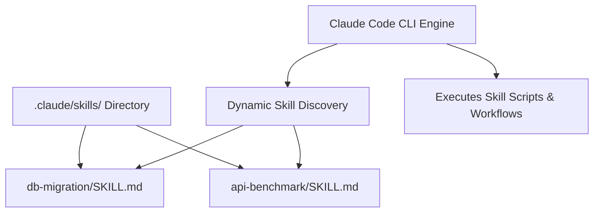

# 📹 Claude Code Skills: Full Guide

<div className="video-card" style={{border: '1px solid #30363d', borderRadius: '8px', padding: '16px', marginBottom: '24px', background: 'rgba(56, 139, 253, 0.05)'}}>
  <div style={{display: 'flex', gap: '16px', flexWrap: 'wrap'}}>
    <div><strong>Instructor:</strong> Nitish Singh (CampusX)</div>
    <div><strong>Duration:</strong> 2986</div>
    <div><strong>Course:</strong> Module 5: MCP & Claude Code</div>
    <div><strong>Watch Link:</strong> <a href="https://www.youtube.com/watch?v=JN7QCdvJwwM" target="_blank" rel="noopener noreferrer">YouTube Lecture ↗</a></div>
  </div>
</div>

## 📌 Executive Summary

Claude Code Skills allow extending the agent's capabilities with custom tools and domain-specific knowledge. A Skill is a dedicated directory containing instructions (`SKILL.md`), helper scripts, and configuration schemas that Claude Code dynamically discovers and executes.

This guide covers Skill directory structure, authoring `SKILL.md` frontmatter, parameter schemas, and building automated skills (e.g. database schema dumpers, automated benchmark runners).

---

## 🏗️ System Architecture & Execution Flow



---

## 📖 Core Concepts & Technical Deep Dive

### 1. Skill Directory Anatomy
Every skill lives inside `.claude/skills/<skill-name>/`:
- `SKILL.md`: Required documentation containing YAML frontmatter (`name`, `description`) and operational markdown instructions.
- `scripts/`: Optional helper Python or bash scripts that the skill executes.
- `examples/`: Reference implementations guiding the agent.

### 2. Dynamic Activation
Claude Code inspects skill descriptions and activates them autonomously when a user request matches the skill's domain (e.g. invoking the database skill when asked to create a migration).

---

## 💻 Production Implementation

```python
skill_md_content = """---
name: db-migration-helper
description: Inspects database schema differences and generates Alembic migration scripts.
---

# Database Migration Helper

## Instructions
1. Run `alembic check` to detect uncommitted schema changes.
2. If differences exist, generate migration: `alembic revision --autogenerate -m "<description>"`
3. Review the generated migration file in `alembic/versions/`.
4. Apply migration locally: `alembic upgrade head`
"""

print("Custom Claude Code Skill structure verified.")
```

---

## ⚙️ Production Gotchas & Best Practices

:::tip Clear Skill Descriptions
Write accurate YAML frontmatter descriptions. The agent reads the description to determine whether the skill is relevant to the active user prompt.
:::

:::warning Self-Contained Scripts
Ensure scripts inside `scripts/` handle missing dependencies gracefully and return informative exit codes.
:::

---

## 📊 Architectural Reference & Comparison

| Skill Component | File Path | Purpose |
| :--- | :--- | :--- |
| **Specification** | `SKILL.md` | YAML metadata & procedural instructions |
| **Executables** | `scripts/*` | Custom bash or Python automation utilities |
| **Templates** | `templates/*` | Boilerplate files used during code generation |

---

## 📚 Key Takeaways & Enterprise Checklist

- [ ] **Architecture Verification:** Ensure your design addresses latency, decoupled interfaces, and strict data validation contracts.
- [ ] **Deterministic Testing:** Run unit tests and golden dataset evaluations before shipping changes to staging or production.
- [ ] **Security & Observability:** Enforce input/output guardrails, scrub sensitive credentials/PII, and capture distributed traces.
- [ ] **Scalability & Sizing:** Calibrate model parameters, context limits, and compute instance requirements against projected request concurrency.
