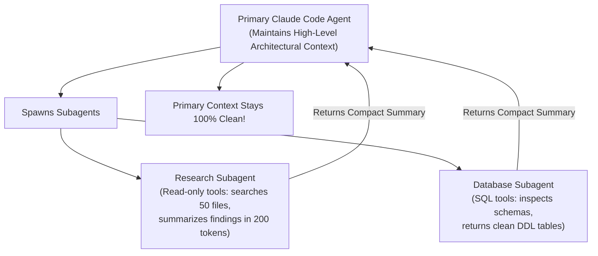

# 📹 Claude SubAgents: Solve Context & Token Cost Problems

<div className="video-card" style={{border: '1px solid #30363d', borderRadius: '8px', padding: '16px', marginBottom: '24px', background: 'rgba(56, 139, 253, 0.05)'}}>
  <div style={{display: 'flex', gap: '16px', flexWrap: 'wrap'}}>
    <div><strong>Instructor:</strong> Nitish Singh (CampusX)</div>
    <div><strong>Duration:</strong> 2904</div>
    <div><strong>Course:</strong> Module 5: MCP & Claude Code</div>
    <div><strong>Watch Link:</strong> <a href="https://www.youtube.com/watch?v=aZCU_wTXwfo" target="_blank" rel="noopener noreferrer">YouTube Lecture ↗</a></div>
  </div>
</div>

## 📌 Executive Summary

As development tasks grow in complexity, single-agent context windows become congested with search logs, test output, and file contents. Claude Code Subagents solve this by spawning isolated worker agents equipped with specialized system prompts and restricted toolsets that report summarized findings back to the primary agent.

This guide details subagent architecture, context window protection, defining custom subagent personas, and parallel subagent execution.

---

## 🏗️ System Architecture & Execution Flow



---

## 📖 Core Concepts & Technical Deep Dive

### 1. The Context Window Hygiene Problem
Searching 100 files with ripgrep dumps tens of thousands of tokens into context. Once context fills up, reasoning degrades. Subagents execute investigative tasks in an isolated context and return only a concise 3-paragraph summary back to the parent agent.

### 2. Defining Custom Subagents
Developers can configure specialized worker subagents in `.claude/agents/` with restricted toolsets (e.g. read-only tools for security auditors).

---

## 💻 Production Implementation

```python
# Blueprint: Subagent invocation concept
def delegate_investigation_to_subagent(task_prompt: str) -> str:
    """Spawns an isolated subagent with fresh context to conduct investigation."""
    # Isolated execution runs, searches files, and returns only the final finding
    return "Investigation complete: 3 endpoints lack rate limiting in src/api/v1/."

print("Claude Code Subagent architecture blueprint loaded.")
```

---

## ⚙️ Production Gotchas & Best Practices

:::tip Delegate Broad Research
Always delegate broad codebase searches or log parsing to subagents to keep your main conversation context clean.
:::

:::warning Task Scoping
Give subagents specific, actionable task descriptions with explicit output format instructions to ensure high-yield summaries.
:::

---

## 📊 Architectural Reference & Comparison

| Agent Type | Context Lifetime | Tool Permissions | Primary Responsibility |
| :--- | :--- | :--- | :--- |
| **Primary Agent** | Persistent across session | Full (Write, Exec, Read) | High-level planning & synthesis |
| **Subagent** | Ephemeral (Task-scoped) | Restricted (Read-only / Tools) | Deep research & noisy investigations |

---

## 📚 Key Takeaways & Enterprise Checklist

- [ ] **Architecture Verification:** Ensure your design addresses latency, decoupled interfaces, and strict data validation contracts.
- [ ] **Deterministic Testing:** Run unit tests and golden dataset evaluations before shipping changes to staging or production.
- [ ] **Security & Observability:** Enforce input/output guardrails, scrub sensitive credentials/PII, and capture distributed traces.
- [ ] **Scalability & Sizing:** Calibrate model parameters, context limits, and compute instance requirements against projected request concurrency.
