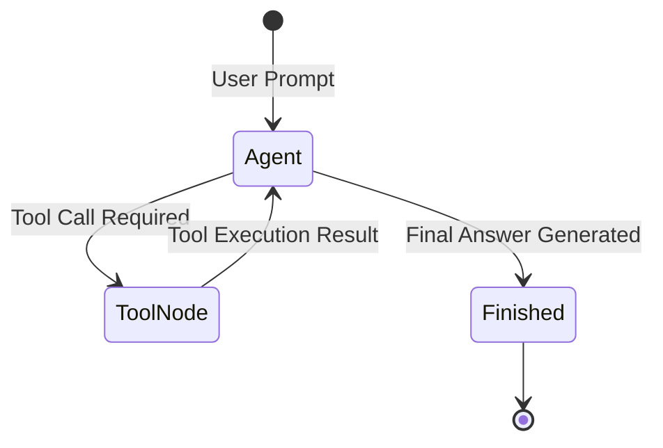

# 📹 Claude SubAgents: Solve Context & Token Cost Problems

<div className="video-card" style={{border: '1px solid #30363d', borderRadius: '8px', padding: '16px', marginBottom: '24px', background: 'rgba(56, 139, 253, 0.05)'}}>
  <div style={{display: 'flex', gap: '16px', flexWrap: 'wrap'}}>
    <div><strong>Instructor:</strong> Nitish Singh (CampusX)</div>
    <div><strong>Duration:</strong> 48m 24s</div>
    <div><strong>Playlist:</strong> Agentic Coding with Claude Code (CampusX)</div>
    <div><strong>Watch Link:</strong> <a href="https://www.youtube.com/watch?v=aZCU_wTXwfo" target="_blank" rel="noopener noreferrer">YouTube Lecture ↗</a></div>
  </div>
</div>

## 📌 Executive Summary & Learning Objectives

This lecture covers **Claude SubAgents: Solve Context & Token Cost Problems**, focusing on production implementations, edge cases, and industry standards:
- Core intuition, architecture, and underlying mechanisms.
- Key differences between theoretical research implementations and scalable enterprise patterns.
- Concrete Python walkthroughs, error recovery, and performance optimization.

---

## 🏗️ Architecture & Conceptual Workflow



---

## 📖 Core Concepts & Technical Deep Dive

### 1. Architectural Foundations
In modern production AI engineering, **Claude SubAgents: Solve Context & Token Cost Problems** is essential for ensuring reliability, low latency, and deterministic outcomes. As AI systems evolve from naive prompt-in / completion-out scripts into distributed systems, engineers must handle:
- **State management & consistency:** Ensuring intermediate states and tool invocations are tracked.
- **Error boundaries & recovery:** Graceful degradation when external LLMs or vector stores encounter rate limits or network partitions.
- **Resource utilization & cost efficiency:** Caching common queries and reducing unnecessary foundation model token expenditure.

### 2. Operational Considerations
- **Latency Optimization:** Pre-computing embeddings, utilizing asynchronous non-blocking event loops, and streaming tokens via Server-Sent Events (SSE).
- **Security & Sandboxing:** Validating inputs before ingestion, sanitizing LLM outputs, and isolating tool execution environments.

---

## 💻 Production Implementation Walkthrough

```python
from mcp.server.fastmcp import FastMCP

# Initialize FastMCP Server
mcp = FastMCP("Production AI Tools Server")

@mcp.tool()
def calculate_token_cost(input_tokens: int, output_tokens: int, model: str = "gpt-4o") -> dict:
    """Calculate total API cost given token counts."""
    rates = {
        "gpt-4o": {"input": 2.50 / 1_000_000, "output": 10.00 / 1_000_000},
        "claude-3-5-sonnet": {"input": 3.00 / 1_000_000, "output": 15.00 / 1_000_000},
    }
    rate = rates.get(model, rates["gpt-4o"])
    cost = (input_tokens * rate["input"]) + (output_tokens * rate["output"])
    return {"model": model, "total_cost_usd": round(cost, 6)}

if __name__ == "__main__":
    # Runs stdio transport protocol for Claude Desktop & Claude Code
    mcp.run(transport="stdio")
```

---

## 💡 Production Best Practices & Tips

:::tip Production Deployment Guideline
When deploying Claude SubAgents: Solve Context & Token Cost Problems in enterprise environments, always configure automated retries with exponential backoff and telemetry tracing (such as OpenTelemetry or LangSmith).
:::

:::warning Common Failure Modes
Watch out for state contamination across concurrent requests. Ensure each session or user interaction uses an isolated thread ID or execution context.
:::

---

## 🎯 Key Takeaways & Quick Reference

| Dimension | Production Standard | Pitfall to Avoid |
| :--- | :--- | :--- |
| **Execution** | Async / Non-blocking with timeouts | Synchronous blocking calls in event loops |
| **Data Validation** | Strict Pydantic v2 schemas | Untyped dictionary access |
| **Monitoring** | Distributed tracing & latency percentiles | Relying only on standard console logs |

## ⏱️ Lecture Timeline & Key Topics

| Timestamp | Key Topic / Concept Discussed |
| :--- | :--- |
| **00:00:00** | हाय गाइस, माय नेम इज नितेश एंड यू वेलकम... |
| **00:11:39** | सेकंड उसने ये प्र्प्ट किया कि एनालाइज... |
| **00:23:13** | हमने ये डिस्कस किया कि सब एजेंट्स क्यों... |
| **00:35:04** | रहा है इंटरनली? सारे के सारे टूल्स को... |
| **00:48:22** | नेक्स्ट वीडियो में। बाय।... |


---

---

## 📜 Complete Lecture Transcript (English)

> **Language:** English | **Source:** `11 - Claude SubAgents： Solve Context & Token Cost Problems ｜ CampusX.hi-orig.srt` | **Total Segments:** 25 | **Word Count:** ~8,401 words

<details>
<summary><b>Click to expand full chronological transcript (25 timestamped intervals)</b></summary>

#### ⏱️ [00:00 ➔ 00:02]

हाय गाइस, माय नेम इज नितेश एंड यू वेलकम टू माय YouTube चैनल। इस वीडियो में भी हम लोग अपना क्लॉट कोड प्लेलिस्ट कंटिन्यू करेंगे। और आज के वीडियो का टॉपिक है सब एजेंट्स। सब एजेंट्स क्लॉट कोड का वन ऑफ द मोस्टेंट टॉपिक है और इसके अराउंड सबसे ज्यादा क्यूरोसिटी भी रहती है स्टूडेंट्स को। एंड दैट इज व्हाई जब मैंने ये प्लेलिस्ट स्टार्ट किया था तब से मुझे मैसेजेस आ रहे हैं कि सर आप सब एजेंट्स वाला टॉपिक कब पढ़ाओगे? सो वी आर गोइंग टू कवर सब एजेंट्स इन ग्रेट डिटेल। इनफैक्ट मैंने प्लान किया है कि हम दो वीडियोस में सब एजेंट्स को पढ़ेंगे। इन दिस वीडियो वी विल डिस्कस सब एजेंट्स एट अ थ्योरिटिकल लेवल। मैं आपको सब एजेंट्स के बारे में सब कुछ बताऊंगा। सब एजेंट्स क्यों चाहिए होते हैं? सब एजेंट्स क्या होते हैं? व्हाट आर द डिफरेंट टाइप्स ऑफ सब एजेंट्स? किस तरह के सिचुएशन में आप सब एजेंट्स को यूज़ करते हो? ये सब कुछ हम आज के वीडियो में पढ़ेंगे और फिर नेक्स्ट वीडियो में मैं आपको प्रैक्टिकली खुद के सब एजेंट्स बनाना दिखाऊंगा। ठीक है? तो रियली एक्साइटेड फॉर दिस वीडियो। लेट्स स्टार्ट नाउ। अब सबसे पहले हम यह डिस्कस करेंगे कि सब एजेंट्स की जरूरत क्यों पड़ी? व्हाट इज द प्रॉब्लम दैट सब एजेंट्स सॉल्व? और यह समझाने के लिए मैं एकदम फर्स्ट प्रिंसिपल अप्रोच यूज़ कर रहा हूं। हम एकदम पीछे जाके सबसे पहले ये डिस्कस करते हैं कि एलएलएम्स के साथ जब आप बातचीत करते हो तो होता क्या है? जनरली आप किसी एलएलएम से जो बातचीत करते हो वो एपीआई कॉल के थ्रू होता है। सो एलएलएम्स के अराउंड एक एपीआई रैपर होता है। हम उस एपीआई को अपना क्वेश्चन भेजते हैं। एपीआई उस क्वेश्चन को एलएलएम में फीड करता है। एलएलएम अपना रिस्पांस देता है। वही रिस्पांस हमें एपीआई के थ्रू वापस मिलता है। राइट? दिस इज़ हाउ द एंटायर सर्विस वर्क्स। अब यहां पर एक इंपॉर्टेंट चीज जो शायद अब आपको पता चल गई होगी वो ये है कि एलएलएम्स आर स्टेटलेस बाय नेचर। व्हिच बेसिकली मींस कि एलएलएम्स की खुद की कोई मेमोरी नहीं होती। इसका मतलब यह है कि अगर मैंने आज एलएलएम से कोई बात की है तो वो बात उसको अगले दिन याद नहीं रहती। उसका एग्जांपल आपके स्क्रीन पे है। मान लो हमने किसी एक दिन एक एपीआई कॉल मारा एलएलएम को और उसमें हमने ये क्वेश्चन पूछा व्हाट इज

#### ⏱️ [00:02 ➔ 00:04]

द कैपिटल ऑफ फ्रांस। अब यह क्वेश्चन एलएलएम के पास गया और एलएलएम ने पलट के हमें झट से रिप्लाई दे दिया पेरिस। बट द थिंग इज कि ना इस पॉइंट पे एलएलएम को क्वेश्चन याद रहेगा ना ही उसको आंसर याद रहेगा। अब अगर हम उसके थोड़ी देर बाद ये क्वेश्चन पूछे व्हाट अबाउट जर्मनी तो इस पॉइंट पे वी आर एक्सपेक्टिंग कि हमें जर्मनी का कैपिटल आंसर में मिले। बट एलएलएम सिंस उसको पिछला क्वेश्चन और पिछला आंसर याद नहीं है। वो आपको कुछ इस तरह का रिप्लाई देगा कि व्हाट अबाउट जर्मनी इन व्हाट कॉन्टेक्स्ट? मतलब उसको नहीं पता कि जर्मनी के बारे में आप क्या पूछ रहे हो। तो दिस इज वन बिग प्रॉब्लम जो एलएलएम्स के साथ होती है। दैट एलएलएम्स आर स्टेटलेस। दे डोंट हैव अ मेमोरी। अब ये बहुत बड़ी प्रॉब्लम इसलिए है बिकॉज़ अगर आप किसी एलएलएम को यूज़ करके एक चैट एप्लीकेशन बनाना चाहते हो तो वो बाय डेफिनेशन इंपॉसिबल है बिकॉज़ आपका प्रीवियस कॉन्वर्सेशन अगर याद ही नहीं रहेगा एलएलएम को तो फिर वो आपको पुराने कॉन्टेक्स्ट के ऊपर आंसर कैसे देगा? तो एप्लीकेशन डेवलपर्स ने एक स्यूशन निकाला इस चीज के लिए और स्यूशन यह था कि कभी भी किसी भी पॉइंट पर आप एलएलएम के पास अगर कोई क्वेश्चन भेजते हो तो आप सिर्फ वो पर्टिकुलर क्वेश्चन ही नहीं भेजते। साथ ही साथ अभी तक की जो पूरी कॉन्वर्सेशन हिस्ट्री है वो भी आप एलएलएम के पास भेजते हो। सो दैट एलएलएम के पास पूरे कॉन्वर्सेशन का कॉन्टेक्स्ट रहे। जैसे इस पर्टिकुलर सिचुएशन में जब हम व्हाट अबाउट जर्मनी भेज रहे होंगे तो हम सिर्फ व्हाट अबाउट जर्मनी एज अ क्वेश्चन नहीं भेजेंगे। हम पिछला जो इंटरेक्शन हुआ था एलएलएम के साथ जहां पे हमने पूछा था व्हाट इज द कैपिटल ऑफ फ्रांस और जो पलट के आंसर मिला था पेरिस उसको भी साथ में भेजेंगे। तो बेसिकली हम ये पूरा का पूरा कॉन्वर्सेशन एक एपीआई कॉल में एलएलएम के पास भेजेंगे। अब एलएलएम को ये पूरी चीज दिखाई दे रही है कि सबसे पहले मुझसे फ्रांस का कैपिटल पूछा गया था। मैंने पेरिस बताया था और अब मुझसे जर्मनी के बारे में पूछा जा रहा है। तो

#### ⏱️ [00:04 ➔ 00:06]

ऑब्वियसली दे मस्ट बी आस्किंग अबाउट द कैपिटल ऑफ जर्मनी। एंड दैट इज व्हाई एलएलएम का जो आउटपुट है वो बर्लिन आ जाता है। तो ये कोई बहुत स्मार्ट तरीका नहीं है चीजों को करने का। बट दिस इज हाउ चैट एप्लीकेशनेशंस आर बिल्ट जो कि एलएलएम्स को यूज़ करते हैं। अब मजेदार चीज क्या है कि ये तरीका बहुत अच्छा काम करता है। अगर आप चैट एप्लीकेशनेशंस बना रहे हो यूजिंग एलएलएम। बट अगर आप एलएलएम को यूज करके कोडिंग एजेंट्स बना रहे हो तो यह तरीका बहुत खराब तरीके से फेल करता है। कब और कैसे? मैं आपको समझाता हूं। सो इमेजिन करो कि आपके पास एक बड़ा सा कोड बेस है। ठीक है? जो आपने और आपकी टीम ने मिलके बनाया है। और इस पॉइंट पे उस कोड बेस में अराउंड 15-20 फाइल्स हैं। और उन 15-20 फाइल्स में बहुत सारा टेक्स्ट ऑलरेडी लिखा हुआ है। रफली अगर बात करें तो कुछ 300 टोकंस इस पूरे कोड बेस में हैं। अब आपने क्या किया? आपने एक पर्टिकुलर डे जाकर के अ आपने सोचा कि मैं इस कोड बेस में एक ऑथेंटिकेशन सिस्टम ऐड करता हूं। तो आपने ये प्र्ट डाला। एनालाइज माय कोड बेस एंड बिल्ड एन ऑथ सिस्टम। ठीक है? अब इस पॉइंट पे क्या हुआ कि आपका सिंस कोडिंग एजेंट को पूरा का पूरा ऑथ सिस्टम डिज़ करना था। तो उसको पहले ये समझना पड़ेगा कि आपका एकिस्टिंग कोड बेस किस तरीके से लिखा हुआ है। कौन सा डेटाबेस आप यूज कर रहे हो? कौन सा बैक एंड सर्विस आप यूज कर रहे हो। आपके एपीआई कॉन्ट्रैक्ट्स क्या है? ये सब कुछ उसको समझना पड़ेगा। तो उसने क्या किया कि उसने पूरे के पूरे 30,000 टोकंस वाले कोड बेस को उठा के कॉन्टेक्स्ट मेमोरी में डाल दिया। ठीक है? और ये कोड बेस और आपका जो मैसेज था कि एनालाइज द कोड बेस बिकॉज़ आई वांट टू डेवलप अ ऑथ सिस्टम। ये पूरी चीज को आपने एलएलएम के पास भेज दिया। ठीक है? कोई प्रॉब्लम नहीं है। अब इस पॉइंट पर आपके एलएलएम ने पूरे के पूरे कोड बेस को एनालाइज किया और आपके मैसेज को पढ़ा और उसने इसके बेसिस पे एक प्लान डेवलप किया कि वो किस तरीके से ऑथेंटिकेशन सिस्टम

#### ⏱️ [00:06 ➔ 00:08]

बनाएगा। ठीक है? और वो प्लान उसने आपको रिटर्न किया। अब यहां पे आपने अगला प्र्प भेजा कि नाउ इंप्लीमेंट द जे डब्ल्यूटी मिडिल वेयर बेस्ड ऑन द प्लान। तो सिंस हमेशा आप क्या करते हो कि अभी तक का पूरा कॉन्वर्सेशन दोबारा से भेजते हो एलएलएम के पास तो आपको करना क्या पड़ा कि आपको अपना कोड बेस पूरा का पूरा जो 30,000 टोकंस का था वो भी दोबारा भेजना पड़ा। फिर आपका अभी तक का जो भी कॉन्वर्सेशन रहा है आपका पहला मैसेज और जो प्लान रिटर्न हुआ था एलएलएम की साइट से वो भी आपने भेजा और आपका जो करंट मैसेज है जहां पे आप बोल रहे हो प्लान को इंप्लीमेंट करने ये सारी चीज आपने भेजी। तो ऑलरेडी इस पॉइंट पर अगर आप कैलकुलेट करो तो 30,000 टोकंस प्लस रफली आपका प्रीवियस कॉन्वर्सेशन आपने जो मैसेज भेजा था और जो प्लान रिटर्न हुआ था वो 2000 टोकंस था और आपका करंट मैसेज मिला के यू आर ऑलरेडी सेंडिंग 32,000 टोकंस इन द करंट टर्न ऑफ द कॉन्वर्सेशन। ठीक है? अब इस पॉइंट पे क्या हुआ? बहुत सारा कोड जनरेट हुआ एलएलएम की साइड से क्योंकि उसने देखा कि आपको प्लान इंप्लीमेंट करवाना है। तो वो सारा का सारा कोड जनरेट हो के आपको मिल गया। अब अगले टर्न थ्री में आपने बोला ऐड रेट लिमिटिंग एंड रिफ्रेश टोकन रोटेशन। कुछ और एडवांस चीजें आप अपने ऑथ सिस्टम में ऐड करना चाहते थे। आपने वो भी ऐड करने को बोला। बट अगेन बाय डेफिनेशन आपको अभी तक का पूरा कॉन्वर्सेशन फिर से भेजना है एलएलएम के पास। तो इस पॉइंट पे आप अपना 30,000 टोकंस का कोड बेस अभी तक का प्रीवियस कॉन्वर्सेशन वि वास टू टर्न्स जो कि रफली 5000 टोकंस का हो चुका है और अभी तक का जितना कोड जनरेट किया है आपके एलएलएम ने और आपके करंट मैसेज को मिला के आपने सब कुछ फिर से एलएलएम के पास भेजा। सो यू आर ऑलरेडी डीलिंग विद 39,000 टोकंस इन द करंट टर्न। नाउ यू कैन इमेजिन प्रॉब्लम क्या हो रही है? प्रॉब्लम ये हो रही है कि आपको यह जो कोड बेस देना था एलएलएम को वो सिर्फ फर्स्ट टर्न के लिए देना था। आपको हर टर्न में पूरा का पूरा

#### ⏱️ [00:08 ➔ 00:10]

कोड बेस भेजने की जरूरत नहीं थी। कोड बेस की आपको जरूरत सिर्फ इसलिए थी बिकॉज़ आप एलएलएम को समझाना चाहते थे आपके कोड बेस का कॉन्टेक्स्ट। पहली बार में ही वो समझ गया। उसने एक प्लान भी डेवलप कर लिया। बट आपको हर सब्सीक्वेंट बार भी पूरे के पूरे कोड बेस को भेजना पड़ रहा है। बिकॉज़ दैट इज हाउ सेशंस वर्क। एलएलएम्स के साथ आप बिल्कुल ऐसे ही काम करते हो। तो होगा क्या कि हर अगला कॉन्वर्सेशन जैसे-जैसे आप करते जाओगे तो आपका जो कॉन्टेक्स्ट विंडो है वो और तेजी से फिल होता जाएगा और हर पर्टिकुलर टर्न में आप और ज्यादा नंबर ऑफ टोकंस यूज़ करोगे। यहां पर यू कैन सी द एग्जांपल बाय द एंड ऑफ़ टर्न एट आप ऑलरेडी एक सिंगल टर्न में अराउंड 76,000 टोकंस भेज रहेगे। बिकॉज़ अभी तक का कन्वर्सेशन इतना बड़ा हो चुका है और आप एक बार में मतलब अभी तक के आठ टर्न्स में आप ऑलरेडी रफली $1 से ज्यादा स्पेंड कर चुके होंगे। दैट इज अ लॉट ऑफ़ मनी। राइट? तो यू कैन अंडरस्टैंड व्हाट इज द प्रॉब्लम? द प्रॉब्लम इज कि आपका कॉन्टेक्स्ट बहुत तेजी से फिल हो रहा है। बिकॉज़ आपको हर बार अभी तक का पूरा कॉन्वर्सेशन भेजना पड़ रहा है। दो बड़ी प्रॉब्लम्स जो आ रही है वो ये है। फर्स्ट देयर इज़ अ कॉन्टेक्स्ट विंडो ओवरफ्लो जो मैंने आपको अभी समझाया। सेकंड एक और चीज होती है जिसको हम लॉस्ट इन द मिडिल इफेक्ट बोलते हैं। तो जब कॉन्टेक्स्ट विंडो बहुत ज्यादा टोकन से फिल हो जाता है तो एलएलएम्स जनरली बहुत पहले वाले टोकंस या फिर बहुत लेट वाले टोकंस के ऊपर ज्यादा फोकस करते हैं। बीच वाले टोकंस को भूलने लग जाते हैं। तो ये भी एक बहुत स्टडीड इफेक्ट है जिसकी वजह से एलएलएम के जो आंसर्स निकल के आते हैं वो उतने अच्छे नहीं होते हैं। तो दीज़ आर द टू मेन प्रॉब्लम्स जिसकी वजह से सब एजेंट्स का जन्म हुआ। ठीक है? तो आई होप मैं आपको समझा पाया कि व्हाट इज द एग्जैक्ट प्रॉब्लम जिसकी वजह से सब एजेंट्स पिक्चर में आए। अब मैं आपको दिखाता हूं कि सब एजेंट्स इस प्रॉब्लम को कैसे सॉल्व करते हैं। तो चलो पहले मैं आपको बताता हूं कि सब एजेंट्स एग्जैक्टली होते क्या है? देखो यहां पे लिखा हुआ है दैट सब एजेंट्स आर स्पेशलाइज्ड एआई असिस्टेंट्स दैट रन इन

#### ⏱️ [00:10 ➔ 00:12]

देयर ओन आइसोलेटेड कॉन्टेक्स्ट विंडोज़ डूइंग हैवी लिफ्टिंग इन अ सेपरेट स्पेस एंड हैंडलिंग बैक ओनली व्हाट मैटर्स। तो आप जब चैट पॉट एज इन क्लॉट कोड से बात कर रहे होते हो तो आप मेन एजेंट से बात कर रहे होते हो। बट आपका मेन एजेंट क्या कर सकता है कि वो अपनी मर्जी से या फिर आपके बोलने पर एक कंप्लीटली नया एजेंट क्रिएट कर सकता है जिसको हम सब एजेंट बुलाते हैं। और उस सब एजेंट की खासियत क्या है कि उस सब एजेंट को अपना खुद का कॉन्टेक्स्ट विंडो फ्रेश कॉन्टेक्स्ट विंडो असाइन होता है जिसके अंदर वो अपना खुद का स्पेशलाइज्ड काम कर सकता है और फिर अपना काम करने के बाद जो रिजल्ट आता है उस रिजल्ट को वापस मेन एजेंट को रिटर्न कर सकता है और जैसे ही ये काम खत्म होता है तो फिर आपका जो सब एजेंट का कॉन्टेक्स्ट विंडो है वो डिलीट कर दिया जाता है। तो दिस इज़ हाउ सब एजेंट्स वर्क। यहां पे देखो एक डेमोंस्ट्रेशन दिया हुआ है कि आप आए और आपने अपने मेन एजेंट को बोला ऐड ऑथ टू माय एक्सप्रेस ऐप। ठीक है? अब क्लॉड ने क्या सोचा कि आई विल एनालाइज योर कोड बेस फर्स्ट। लेट मी स्पॉन अ सब एजेंट फॉर दैट। बिकॉज़ क्लॉड इज़ इंटेलिजेंट इनफ टू अंडरस्टैंड कि अगर मैं पूरा कोड बेस को अपने मेन वाले कॉन्टेक्स्ट विंडो में लोड करूंगा तो मुझे इस पूरे कॉन्वर्सेशन में कोड बेस को लेके चलना पड़ेगा। तो इंस्टेड व्हाट आई कैन डू इज मैं इसके लिए इस एनालिसिस के लिए एक कंप्लीटली नया सब एजेंट क्रिएट कर देता हूं। तो उसने क्या किया? एक नया आइसोलेटेड सब एजेंट क्रिएट कर दिया और इस सब एजेंट के पास उसने दो चीजें भेजी। पहला उसने पूरा का पूरा कोड बेस लोड करने का उसको कमांड दे दिया और सेकंड उसने ये प्र्प्ट किया कि एनालाइज दिस कोड बेस एंड कम अप विद एन इंप्लीमेंटेशन प्लान। अब यह जो एजेंट है इसके अंदर वो सारी कैपेबिलिटीज है जो मेन एजेंट के पास होती है। यहां पर भी वही मॉडल काम कर रहा है। इसको भी वही सिस्टम प्र्ट मिला हुआ है और इसके पास खुद की कॉन्टेक्स्ट विंडो भी है। तो यहां पर अब आपका ये जो सब एजेंट है वो इस पूरे कोड

#### ⏱️ [00:12 ➔ 00:14]

बेस को एनालाइज करता है और फिर पूरे के पूरे 300 टोकंस को यूज़ करके इवेंचुअली इट कम्स अप विद अ इंप्लीमेंटेशन प्लान। और वो इंप्लीमेंटेशन प्लान बहुत छोटा सा है। रफ्ली अराउंड 500 टोकंस। और यही 500 टोकंस वाला जो इंप्लीमेंटेशन प्लान है वो वापस रिटर्न कर देता है हमारा सब एजेंट हमारे मेन एजेंट को जैसा आपको यहां पे दिखाई दे रहा है। यहां पे लिखा हुआ है फाउंड 20 फाइल्स की फाइंडिंग्स आर एक्सप्रेस प्रेस प्रिज्मा स्टक 12 राउट्स नो एकिस्टिंग ऑथेंटिकेशन सेशंस और मिडिलवेयर रेडिस ऑलरेडी कॉन्फ़िगर्ड फॉर कैशिंग। यह समरी जो चाहिए थी मेन एजेंट को वो मिल गई। और इस पॉइंट के बाद आपका जो सब एजेंट का कॉन्टेक्स्ट है उसको डिस्ट्रॉय कर दिया जाता है। और फिर अब गोइंग फॉरवर्ड आपका जो मेन एजेंट है वो इस प्लान के साथ आगे का पूरा कॉन्वर्सेशन कैरी आउट करता है। दिस इज़ हाउ अ सब एजेंट वर्क्स। फायदा क्या हुआ इससे? ये देखो फायदा यह हुआ कि विदाउट अ प्लानिंग सब एजेंट आप हर टर्न ऑफ द कॉन्वर्सेशन में पूरा का पूरा कोड बेस बार-बार भेज रहे थे। जिससे बहुत जल्दी आपकी कॉन्टेक्स्ट विंडो भी फिल हो गया और बहुत ज्यादा पैसे भी आपको देने पड़ रहे थे पर टर्न बेसिस पे। बट जब आप प्लानिंग सब एजेंट यूज़ कर रहे हो तो फायदा क्या हो रहा है कि आपका मेन एजेंट प्लानिंग सब एजेंट को स्पॉन कर रहा है। ट्रिगर कर रहा है और आपका सब एजेंट पलट के एक रिस्पांस दे रहा है। व्हिच इज अ वेरी स्मॉल इंप्लीमेंटेशन प्लान 300 टोकंस के बदले सिर्फ 500 टोकंस का। तो अब आपके पास कुछ इस तरह का सिनेरियो है कि हर सबसीक्वेंट टर्न ऑफ कॉन्वर्सेशन में आपके पास आपके कॉन्टेक्स्ट विंडो में सिर्फ एक प्लान बैठा हुआ है जो कि मान लो अगर 2000 टोकंस का भी है तो इट्स नॉट मच। तो आप हर बार ये प्लान भेज रहे हो और अभी तक का पूरा कॉन्वर्सेशन भेज रहे हो। तो इन अ वे आप रफली हर टर्न ऑफ द कॉन्वर्सेशन में 28 के टोकंस बचा रहे हो। जिसकी वजह से दो फायदे

#### ⏱️ [00:14 ➔ 00:16]

हैं। आपका कॉन्टेक्स्ट विंडो बहुत देर से फिल होगा। बहुत लंबा चल पाएगा आपका कॉन्वर्सेशन। और सेकंड हर टर्न ऑफ द कॉन्वर्सेशन पे आप पैसे भी बचा रहे हो। दिस इज द बिगेस्ट बेनिफिट ऑफ सब एजेंट्स। कि सब एजेंट्स अपने सेपरेट कॉन्टेक्स्ट में अपना स्पेशलाइज्ड टास्क कैरी आउट करते हैं और जो रिजल्ट रिक्वायर्ड होता है बस वही हमें पलट के देते हैं। तो इसको आप एक्चुअली कंपेयर कर सकते हो। प्रोग्रामिंग में जो आप फंक्शनंस यूज़ करते हो ना उनके साथ हमें नहीं मतलब है कि फंक्शन के अंदर क्या कोड लिखा हुआ है। मुझे बस मतलब ये है कि मैं आपको एक इनपुट दे रहा हूं। आप उसको प्रोसेस करो और पलट के मुझे आउटपुट दो। उस आउटपुट को मैं यूज़ करूंगा अपना काम करवाने के लिए। तो दिस इज़ हाउ सब एजेंट्स वर्क। आई रियली होप मैं आपको एकदम फर्स्ट प्रिंसिपल से समझा पाया कि व्हाई डू वी नीड सब एएजेंट्स एंड व्हाट एक्जेक्टली आर सब एजेंट्स। नेक्स्ट अब हम डिस्कस करेंगे व्हाई एंड वेयर शुड वी यूज सब एजेंट्स। ठीक है? व्हाट आर द मेन एडवांटेजेस ऑफ सब एजेंट्स? यह हम सबसे पहले डिस्कस करेंगे। फिर मैं आपको कुछ टिपिकल यूज़ केसेस बताऊंगा जहां पे लोग सब एजेंट्स को यूज़ करते हैं। ठीक है? तो अगर बात करें एडवांटेजेस की, तो एक स्ट्रेट फॉरवर्ड एडवांटेज तो हमने डिस्कस कर ही लिया और वो एडवांटेज है कॉन्टेक्स्ट आइसोलेशन। सब एजेंट्स के साथ आपको एक कंप्लीटली नया कॉन्टेक्स्ट विंडो मिलता है। जहां पर आप कुछ भी एनालिसिस रिलेटेड टास्क करवा सकते हो। तो उसके लिए सबसे प्राइमरीली सब एजेंट्स को यूज़ किया जाता है। सेकंड एक बहुत इंपॉर्टेंट एस्पेक्ट सब एजेंट्स का ये है कि आप स्पेशलाइज्ड सब एजेंट्स बना सकते हो। व्हिच बेसिकली मीन कि आप एक रिसर्च करने वाला सब एजेंट बना सकते हो। आप एक कोड लिखने वाला सब एजेंट बना सकते हो। आप एक सिक्योरिटी ऑडिटर सब एजेंट बना सकते हो। एंड द बेस्ट पार्ट इज कि हर एजेंट को आप अपने हिसाब से डिजाइन कर सकते हो। व्हिच मींस कि हर एजेंट का अपना खुद का सिस्टम प्र्प हो सकता है। उसके खुद के स्किल्स हो सकते हैं। आप हर एजेंट को वही टूल्स असाइन कर सकते हो जिसकी उसको जरूरत

#### ⏱️ [00:16 ➔ 00:18]

है। बाकी टूल्स का एक्सेस आप उसको मना भी कर सकते हो। तो अगले वीडियो में जब हम अपने कस्टम सब एजेंट्स बनाएंगे तो वहां पर आपको दिखाई देगा कि किसी भी स्पेशलाइज्ड काम के लिए आप खुद का सब एजेंट कैसे बनाते हो। थर्ड एडवांटेज इज काइंड ऑफ रिलेटेड कि आप अपने पूरे एप्लीकेशन में एजेंट पॉइंट ऑफ व्यू से मॉड्यूलरिटी ला सकते हो। बेसिकली आप अपने अलग-अलग टास्क के लिए आप अलग-अलग सब एजेंट्स बना सकते हो। आपने कोड एनालाइज करने के लिए एक सब एजेंट बना लिया। आपने प्लान्स को इंप्लीमेंट करने के लिए एक सब एजेंट बना लिया। आपने कोड को रिव्यू करने के लिए एक सब एजेंट बना लिया और फाइनली अपने टेस्ट्स को एग्जीक्यूट करने के लिए आपने एक सब एजेंट बना लिया। तो जो पूरा का पूरा लाइफ साइकिल होता है सॉफ्टवेयर को डेवलप करने का उस पूरे लाइफ साइकिल को एग्जीक्यूट करने के लिए उसके अंदर के अलग-अलग स्पेशलाइज्ड टास्क को एग्जीक्यूट करने के लिए आप अलग-अलग सब एजेंट्स बना सकते हो। और यही आर्किटेक्चर अब एक्सपीरियंस कोडर्स फॉलो कर रहे हैं जब वो इस तरह के एआई कोडिंग टूल्स को यूज कर रहे हैं। एंड द लास्ट एंड द मोस्ट इंटरेस्टिंग एडवांटेजेस दैट यूजिंग सब एजेंट्स आप पैरेललिज्म ला सकते हो अपने वर्क फ्लो में। बेसिकली हमने ये डिस्कस किया कि सब एजेंट को अपना खुद का एक कॉन्टेक्स्ट विंडो मिलता है। जहां पर वो अपने हिसाब से अपना काम कर सकता है। तो अगर आपके पास कभी ऐसा सिचुएशन आता है जहां पे आपके पास पैरेलल वर्क है जहां पे आप एक साथ एक से ज्यादा काम को एग्जीक्यूट कर सकते हो तो वो काम आप सब एजेंट के थ्रू एग्जीक्यूट करवा सकते हो। मैं आपको एक सिंपल एग्जांपल देता हूं। मान लो आपने अपने लिए एक अ ईडीए करने वाला एजेंट बनाया। एक्सप्लोरेटरी डेटा एनालिसिस करने वाला एजेंट बनाया और आपको तीन अलग डेटा सेट्स के ऊपर ईडीए परफॉर्म करना है। तो आप तीनों डेटा सेट्स के ऊपर सीक्वेंशियली ईडीए परफॉर्म करने के बदले अ उस एजेंट के सब एजेंट के तीन इंस्टेंसेस ट्रिगर कर सकते हो और हर इंस्टेंस एक-एक पर्टिकुलर डेटा सेट के ऊपर ईडीए करेगा। और मजेदार बात यह है कि सिंस यह काम कनेक्टेड नहीं

#### ⏱️ [00:18 ➔ 00:20]

है। एक दूसरे पे डिपेंड नहीं करता। दैट इज व्हाई आप यह तीनों टास्क पैरेलली करवा सकते हो। तो कभी भी आपको अपने प्रोजेक्ट में अगर ऐसा स्कोप दिखाई दे रहा है कि आपका कोई टास्क पैरेलली हो सकता है तो वो आप करवा सकते हो विद द हेल्प ऑफ सब एजेंट्स। अगर आप सब एजेंट्स यूज़ ना करो तो फिर पैरेलल टास्क एग्जीक्यूशन इज़ नॉट पॉसिबल बिकॉज़ आप एक सिंगल मेन एजेंट के साथ काम कर रहे हो जो स्टेप बाय स्टेप ही काम कर सकता है। पैरेलली चीजों को एग्जीक्यूट नहीं कर सकता। तो दिस इज़ अगेन अ ब्यूटीफुल साइड एडवांटेज ऑफ़ हैविंग सब एजेंट्स। नेक्स्ट डिस्कस करते हैं कि सब एजेंट्स को सबसे ज्यादा कहां पर यूज किया जाता है? व्हाट आर द यूज केसेस जहां पर सब एजेंट्स आज की डेट में अप्लाई किए जा रहे हैं। तो सबसे पहला और सबसे ज्यादा यूज होने वाला जो सिचुएशन है जहां पे सब एजेंट्स यूज़ किए जा रहे हैं वो है कोड बेस एक्सप्लोरेशन। तो अभी मैंने आपको एग्जांपल के थ्रू भी समझाया कि कोड बेस एक्सप्लोरेशन एक ऐसा टास्क है जिसको अगर आप विदाउट सब एजेट करते हो तो फिर बहुत ज्यादा आपका जो कॉन्टेक्स्ट विंडो है वो आपका कोड बेस खा लेता है और हर टर्न के भी आपको बहुत पैसे देने पड़ते हैं। तो इट इज़ जनरली अ वेरी गुड स्ट्रेटजी कि कोड बेस एक्सप्लोरेशन से रिलेटेड कोई भी टास्क आप हमेशा एक सब एजेंट की हेल्प से ही करो। वैसे आपको खुद ये करने की जरूरत भी नहीं है। अ क्लॉट कोड इज इंटेलिजेंट इनफ कि जब भी आप उसको किसी भी कोड बेस को एक्सप्लोर करने बोलोगे वो ऑटोमेटिकली बिना बताए सब एजेंट्स को ही स्टार्ट करता है और सब एजेंट्स के थ्रू ही एक्सप्लोरेशन करता है। सेकंड यूज़ केस है कोड रिव्यू। कोड रिव्यू एक बहुत इंटरेस्टिंग यूज केस है। आप ऐसा सोच सकते हो कि जो एजेंट कोड लिख रहा है, हम उसी से कोड रिव्यू भी तो करा सकते हैं। बट द प्रॉब्लम इज कि जनरली ऐसा देखा गया है कि जो एजेंट कोड लिख रहा होता है, जिस एजेंट ने फीचर डेवलप किया होता है, वो उतना अच्छा कोड रिव्यू नहीं करता। इट्स लाइक खुद ही को रिव्यू करने में आपके एलएलएम्स आर नॉट दैट ग्रेट। ठीक है? क्योंकि आपके

#### ⏱️ [00:20 ➔ 00:22]

जिस एजेंट ने कोड लिखा है उसको पता है कि उसने एग्जजेक्टली क्या कोड लिखा है। किस तरह के ट्रेड ऑफ्स कंसीडर किए हैं। कौन से अप्रोच सेलेक्ट किए हैं। कौन से अप्रोच रिजेक्ट किए हैं और क्या-क्या अजमशंस लेके वो चला है। तो एक थोड़ा सा उसके अंदर एक इनहेरेंट बायस होता है। जिसकी वजह से जो कोड रिव्यू होता है वो अनबायस तरीके से नहीं हो पाता। दैट इज व्हाई ऐसा देखा गया है कि अगर आप एक एजेंट से कोड लिखवाओ और फिर एक दूसरे एजेंट से कोड रिव्यू करवाओ तो आपको बेटर कोड रिव्यू देखने को मिलता है। तो कोड रिव्यू इज द सेकंड यूज़ केस जहां पे सब एजेंट्स को एक्सटेंसिवली यूज़ किया जाता है। थर्ड यूज़ केस इज़ टेस्टिंग। बेसिकली आप अपने कोड को टेस्ट करने के लिए, टेस्ट को रन करने के लिए अगेन आप एक सेपरेट सब एजेंट को यूज़ करते हो। अगेन द आईडिया इज सेम कि जिस एजेंट ने कोड लिखा है वो खुद ही उतने बेटर टेस्ट केसेस जनरेट नहीं कर पाता और ना टेस्ट केसेस चला के देख पाता है। तो इट इज़ ऑलवेज अ गुड आईडिया कि आप एक एजेंट से कोड लिखवाओ बट एक दूसरे एजेंट से आप उसको टेस्ट करवाओ। ठीक है? फोर्थ यूज़ केस इज़ मल्टी स्टेज पाइपलाइन। सो अगर आपके पास कभी भी इस तरह का टास्क है जहां पे मल्टीपल टास्क कनेक्टेड हैं मतलब पहले टास्क का आउटपुट दूसरे टास्क के लिए इनपुट बनेगा दूसरे टास्क का आउटपुट तीसरे टास्क के लिए इनपुट बनेगा तो इस तरह के सिचुएशन में आप सब एजेंट्स यूज़ कर सकते हो फॉर एग्जांपल आपको एपीआईस बनवानी है तो एपीआईस का जो पूरा कॉन्ट्रैक्ट लिखवाना है वो आप एक एजेंट से करवा लो फिर जो एक्चुअल कोड डेवलपमेंट का काम है वो दूसरे एजेंट से करवा लो और फिर उनको टेस्ट करने का जो काम है वो तीसरे एजेंट से करवा लो। तो जनरली ये जो हैंड ऑफ होता है इंफॉर्मेशनेशन का बिटवीन दीज़ एजेंट्स ये बहुत सही तरीके से होता है। एंड दैट इज़ व्हाई मल्टीस्टेज पाइपलाइंस के लिए आप सब एजेंट्स का इस्तेमाल कर सकते हो। नेक्स्ट जैसा मैंने बताया कि अगर आपके पास कभी भी पैरेलल इंडिपेंडेंट टास्क हैं तो उस तरह के सिचुएशन में आप सब एजेंट्स को इंप्लीमेंट कर सकते हो। मैंने थोड़ी देर पहले आपको ईडीए का एग्जांपल दिया। वन मोर

#### ⏱️ [00:22 ➔ 00:24]

एग्जांपल कुड बी कि आपको एक साथ तीन सेपरेट सर्विसेस डेवलप करानी है। ऑथ सर्विस डेवलप करानी है। पेमेंट सर्विस डेवलप करानी है एंड यूजर सर्विस डेवलप करानी है। एंड अच्छी चीज क्या है कि ये तीनों सर्विज अलग-अलग फाइल्स में इनका कोड लिखा जाएगा। तो सिंस ये तीनों चीजें एक दूसरे से इंडिपेंडेंट हैं। आप इन तीनों को एक साथ पैरेलली डेवलप कर सकते हो विथ द हेल्प ऑफ़ सब एजेंट्स। एंड द लास्ट थिंग इज कि अगर आपको अपने अ कोड का सिक्योरिटी ऑडिट करवाना है कि क्या किसी तरीके से उसको हैक तो नहीं किया जा सकता। किसी तरह की वनरेबिलिटी तो नहीं है तो अगेन आप सिक्योरिटी के लिए एक सेपरेट एजेंट बनाते हो। सेम लॉजिक है यहां पे। जो कोड जो सब एजेंट कोड लिखता है वो खुद का सिक्योरिटी ऑडिट उतने अच्छे से नहीं कर पाता। बिकॉज़ ऑफ़ सम इनहेरेंट बायसेस। तो इट इज़ अ गुड आईडिया दैट यू क्रिएट अ सेपरेट सिक्योरिटी ऑडिट एजेंट। ठीक है? तो दीज़ आर सम प्राइमरी यूज़ केसेस जिसके लिए आज की डेट में इंडस्ट्री में लोग सब एजेंट्स बना रहे हैं। बट अगेन यहां पर मैंने सारी चीजें कवर नहीं की है। इसके अलावा और भी बहुत सारे यूज़ केसेस हैं जो डेली बेसिस पे देखने को मिल रहे हैं। अगर आपको भी कोई इंटरेस्टिंग यूज़ केस पता है तो आप एक बार प्लीज कमेंट में लिख के बताना। सो अभी तक हमने ये डिस्कस किया कि सब एजेंट्स क्यों जरूरी हैं? सब एजेंट्स क्या होते हैं? कैसे काम करते हैं? और हमने ये भी डिस्कस किया कि व्हाट आर द टॉप यूज केसेस ऑफ सब एजेंट्स। अब हम ये डिस्कस करेंगे कि सब एजेंट्स के टाइप्स क्या-क्या हैं। ठीक है? तो क्लॉट कोड हमें दो अलग टाइप्स ऑफ सब एजेंट्स का ऑप्शन देता है। उनमें से पहला ऑप्शन है या पहला टाइप है बिल्ट इन सब एजेंट्स। ऐसे सब एजेंट्स जो हमें नहीं बनाने पड़ते पहले से क्लॉट कोड में बने बनाए आते हैं। और इसमें भी तीन सबसे ज्यादा फेमस जो सब एजेंट्स हैं उनके बारे में मैं आपको बताता हूं। सबसे पहला और सबसे फेमस सब एजेंट है एक्सप्लोर सब एजेंट। इसको क्लॉट कोड तब ट्रिगर करता है जब प्रोग्रामर क्लॉट कोड को किसी भी कोड बेस को एक्सप्लोर करने को बोलता है या फिर

#### ⏱️ [00:24 ➔ 00:26]

किसी पार्ट ऑफ द कोड बेस को एक्सप्लोर करने को बोलता है। तो पास्ट में जब भी मैंने आपको ये क्वेरी रन करके दिखाई है कि एक्सप्लोर द कोड बेस एंड टेल मी अबाउट इट। तो बिहाइंड द सीनंस क्लॉट कोड एक एक्सप्लोर सब एजेंट को ट्रिगर कर रहा था और एक्सप्लोर सब एजेंट पूरे कोड को रीड करता है, समझता है, एनालाइज करता है और आपको कोड बेस की एक समरी बना के देता है। ठीक है? सेकंड आपका है प्लान सब एजेंट। यह तब ट्रिगर होता है जब आप प्लान मोड में जाकर के एक इंप्लीमेंटेशन प्लान जनरेट करना चाहते हो किसी फीचर के लिए जो हमने मल्टीपल टाइम्स अभी तक इस प्लेलिस्ट में किया है। तो आप एक स्पेक डेवलप करते हो स्पेक डॉक्यूमेंट और फिर उस स्पेक डॉक्यूमेंट की हेल्प से एक इंप्लीमेंटेशन प्लान बनाते हो। तो इस प्रोसेस में जो पूरा का पूरा हैवी लिफ्टिंग हो रहा है वो प्लान सब एजेंट के थ्रू हो रहा है। ठीक है? एंड लास्टली देयर इज अ जनरल पर्पस सब एजेंट जो रीड और राइट दोनों टाइप्स ऑफ टास्क के लिए यूज किया जाता है। तो जब भी क्लॉट कोड को लगता है कि उसको किसी भी पर्टिकुलर रीड या राइट टास्क के लिए एक सब एजेंट की जरूरत है तो वो इस जनरल पर्पस सब एजेंट को कॉल करता है। ठीक है? तो ये तीन आपके सबसे प्राइमरी टाइप्स ऑफ बिल्ट इन सब एजेंट्स हैं जो आपको क्लॉड कोड में देखने को मिलेंगे। अब यह क्वेश्चन आ सकता है आपके दिमाग में कि सब एजेंट्स ट्रिगर कैसे होते हैं? वो पिक्चर में आते कैसे हैं? तो इसके भी दो टाइप्स हैं। दो तरीके हैं। पहला तरीका ये है कि आपको क्लॉट कोड को बताने की जरूरत नहीं है कि यूज़ अ सब एजेंट। क्लॉट कोड ऑटोमेटिकली आपके प्रम्प्ट के बेसिस पे समझ जाता है कि उसको इस टास्क को करने के लिए एक सब एजेंट की जरूरत पड़ेगी। तो इंप्लसिट कॉल होता है। प्रोग्रामर नहीं बताता। ठीक है? तो यहां पर लिखा हुआ है क्लॉट रिकॉग्नाइजेस द टास्क दैट इट नीड्स अ सब एजेंट एंड डेलीगेट्स ऑन इट्स ओन। यहां पर हमारा कोई रोल नहीं है। और सेकंड अगर आप चाहो तो आप एक्सप्लसिटली किसी सब एजेंट को कॉल कर सकते हो। ठीक है? तो आप बताते हो कि आपको

#### ⏱️ [00:26 ➔ 00:28]

इस टास्क के लिए एक सब एजेंट की जरूरत है। और फिर क्लॉड आपकी बात मान के एक सब एजेंट को ट्रिगर करता है, स्पॉन करता है। ठीक है? तो ये चीज मैं आपको दिखाऊंगा आज के वीडियो में कि कैसे आप खुद से किसी बिल्ट इन सब एजेंट को ट्रिगर कर सकते हो। बट यही दो तरीके हैं। इंप्लसिटली क्लॉट कोड खुद कर लेता है अपनी समझदारी के हिसाब से। एक्सप्लसिटली प्रोग्रामर बताता है कि मुझे एक सब एजेंट चाहिए। ठीक है? तो ये हो गया आपका पहला टाइप जहां पे बिल्ट इन सब एजेंट्स को हमने डिस्कस किया। सेकंड होते हैं कस्टम सब एजेंट्स। कस्टम सब एजेंट्स वो सब एजेंट्स होते हैं जिनको हम बनाते हैं अपनी जरूरत अपने एप्लीकेशन के हिसाब से। इसमें भी दो टाइप्स होते हैं। एक होता है आपका यूजर लेवल एजेंट्स जो आपकी मशीन पे अवेलेबल होते हैं और आपके हर प्रोजेक्ट में आप उसको यूज कर सकते हो। बिकॉज़ ये डॉट क्लॉट होम डायरेक्टरी में प्रेजेंट होते हैं। और सेकंड होता है आपका प्रोजेक्ट लेवल एजेंट्स जो आपके सिर्फ करंट प्रोजेक्ट के ऊपर एप्लीकेबल है। बाकी प्रोजेक्ट्स इस एजेंट को एक्सेस नहीं कर सकते। ये आपके प्रोजेक्ट के अंदर डॉट क्लॉट फोल्डर के अंदर मिलते हैं। ठीक है? तो बिल्कुल वैसा ही जैसा स्किल्स में आपने पढ़ा था। बिल्कुल सेम वही डिस्टिंशन आपको यहां पे देखने को मिलेगा। अब जब आप कस्टम सब एजेंट्स बनाते हो तो आपको कुछ चीजें कॉन्फ़िगर करनी पड़ती हैं। क्या-क्या चीजें कॉन्फ़िगर करना पड़ता है? मैं आपको बताता हूं। सबसे पहले आप बताते हो कि आपके सब एजेंट के पास कौन-कौन से टूल्स का एक्सेस रहेगा। एक्सप्लोर करने वाला एजेंट है तो उसके पास रीड टूल्स होंगे। कोड लिखने वाला एजेंट है तो उसके पास राइट टूल्स होंगे। रिसर्च एजेंट है तो उसके पास वेब सर्च करने का टूल हो सकता है। यू गेट माय पॉइंट। राइट? उसके बाद हर सब एजेंट का एक सिस्टम प्र्प होता है जिसके थ्रू आप समझाते हो कि उस सब एजेंट का काम क्या है। उसके बाद आप मॉडल भी स्पेसिफाई कर सकते हो हर सब एजेंट को। तो ऐसा हो सकता है कि किसी सब एजेंट को आप ओपस का एक्सेस दे दो। किसी दूसरे सब एजेंट को आप Sonet का एक्सेस दो। तो ये कंट्रोल आपके पास है। उसके बाद आप डिसाइड करते हो कि हर एजेंट

#### ⏱️ [00:28 ➔ 00:30]

हर सब एजेंट के पास क्या-क्या परमिशंस रहेंगी। यू डिसाइड कौन-कौन से हुक्स रहेंगे। हुक्स हालांकि हमने अभी तक पढ़ा नहीं है इस प्लेलिस्ट में बट हुक्स भी एक कांसेप्ट होता है। हुक्स का एक्सेस भी आप दे सकते हो सब एजेंट्स को। एंड लास्टली यू कैन डिसाइड कि कौन से एजेंट्स के पास कौन से स्किल्स का एक्सेस है। ठीक है? तो ये सारी चीजें आप कॉन्फ़िगर कर सकते हो। ये सब कुछ हम डिस्कस करेंगे जब हम नेक्स्ट वीडियो में अपने खुद के कस्टम सब एजेंट्स बनाना सीखेंगे। ठीक है? यहां पे कुछ एग्जांपल्स हैं आपके कस्टम सब एजेंट्स के। आप वीडियो पॉज करके भी देख सकते हो। जैसे आपने अपने लिए एक सिक्योरिटी रिव्यूअर सब एजेंट बनाया। [नाक से की जाने वाली आवाज़] तो इसके पास कौन-कौन से टूल्स हैं? इसके पास रीट टूल है। इसके पास ग्रेप टूल है। इसके पास ग्लोब टूल है। ठीक है? आपने इसको ओपस मॉडल दे रखा है। और ये आपने एक प्र्प्ट यहां पे लिख रखा है। ठीक है? रिव्यू फॉर इंजेक्शन ऑथराइजेशन बायपास एंड डेटा एक्सपोज़र वनरेबिलिटी वनरेबिलिटीज़। फिर आपने एक रिसर्च एजेंट बनाया जिसका काम है रिसर्च परफॉर्म करना। तो इसके पास रीड टूल है, ग्रैप टूल है, वेब सर्च टूल है, वेब फैच टूल है और इसको आपने Sonet दे रखा है। बिकॉज़ एक्सप्लोरेशन में उतना ज्यादा दिमाग लगाने की जरूरत नहीं है। और अगेन आपने यहां पे एक सिस्टम प्र्प रखा है। तो इस तरीके से आप कस्टम सब एजेंट्स बनाते हो। ठीक है? और इसको भी ट्रिगर करने के दो तरीके हैं। इंप्लसिटली क्लॉड को पता चल जाता है। आपकी एजेंट की फाइल को देख के कि कौन सा एजेंट किस तरह के सिचुएशन में यूज़ होना चाहिए। तो मोस्ट ऑफ द टाइम्स क्लॉड खुद से सही एजेंट को सही काम पे लगा देता है। सेकंड अगर आप चाहो तो आप एक्सप्लसिटली क्लॉड को बता सकते हो कि मुझे इस सब एजेंट को इस टास्क पे लगाना है। तो दोनों ऑप्शंस आपके पास अवेलेबल रहते हैं। ठीक है? तो यही है समरी टाइप्स ऑफ सब एजेंट्स की। दो टाइप्स हैं बिल्ट इन वाले और कस्टम वाले। आज के वीडियो में मैं आपको एक डेमोंस्ट्रेशन दिखाऊंगा बिल्ट इन वाले सब एजेंट्स का। और फिर नेक्स्ट वीडियो में हम बहुत डिटेल में कस्टम सब एजेंट्स के ऊपर काम करेंगे। ठीक है? तो आई होप आपको अभी तक का सारा थ्योरेटिकल डिस्कशन समझ में आ गया। अब एक बार प्रैक्टिकली हम लोग क्या करेंगे? हमारा जो एक्सपेंस ट्रैकिंग वाला

#### ⏱️ [00:30 ➔ 00:32]

प्रोजेक्ट है उसको कंटिन्यू करेंगे। उसमें एक नया फीचर ऐड करेंगे और उस फीचर को ऐड करने के प्रोसेस में मैं आपको एक्सप्लोर प्लान और जनरल पर्पस तीनों बिल्ट इन सब एजेंट्स दिखाऊंगा। सो दिस इज़ द करंट स्टेट ऑफ़ आवर प्रोजेक्ट। हमारा जो यूजर है वो लॉग इन कर सकता है, रजिस्टर कर सकता है और लॉग इन करने के बाद उसको अपना प्रोफाइल पेज दिखाई देगा। द ओनली प्रॉब्लम विद दिस प्रोफाइल पेज इज कि यहां पे जो भी डेटा आपको दिखाई दे रहा है ये नंबर्स ये ट्रांजैक्शन का नंबर या ये जो भी ट्रांजैक्शन डेटा है ये सब कुछ डमी डेटा है क्योंकि लास्ट वीडियो में हमने सिर्फ यूआई डेवलप किया था उसको बैक एंड से कनेक्ट नहीं किया था। आज के वीडियो में हम इस यूआई को बैक एंड से कनेक्ट करेंगे। सो दैट जो आपका लॉक्ड इन यूजर है वो अपना एक्चुअल डेटाबेस से आया हुआ डेटा यहां पे देख पाए। यह हमें आज के वीडियो में करना है और यह करने के प्रोसेस में मैं आपको दिखाऊंगा कि कैसे क्लॉट कोड खुद के बिल्ट इन सब एजेंट्स को ट्रिगर करता है। अब वैसे तो आप देख नहीं पाओगे कि कब कौन सा सब एजेंट ट्रिगर होता है। बट यह दिखाने के लिए मैंने एक लाइब्रेरी खोजी है गेट पे। इस लाइब्रेरी का नाम है एजेंट्स ऑब्जर्व। और यह एक रियल टाइम ऑब्जरवेबिलिटी डैशबोर्ड है जो आपको एकदम रियल टाइम में बताता है कि कब कौन सा सब एजेंट ट्रिगर हुआ है और वो एग्जैक्टली क्या कर रहा है। अब जिसने भी ये लाइब्रेरी बनाई है उसने हुक्स का कांसेप्ट यूज़ किया है। हमने हुक्स अभी तक नहीं पढ़ा है आगे पढ़ेंगे। बट हुक्स का कांसेप्ट यूज़ करके उस बंदे ने बहुत सॉलिड एक लाइब्रेरी बनाई है। हम इसी लाइब्रेरी को यूज़ करने वाले हैं। अब इस लाइब्रेरी को इंस्टॉल कैसे करना है वो मैं नहीं दिखाऊंगा। वो सब कुछ यहां पे लिखा हुआ है। वो आप खुद से कर लेना। मैंने ऑलरेडी इंस्टॉल कर रखा है इस लाइब्रेरी को। मैं इसको रन करके दिखाऊंगा और यहीं पर आपको दिखाई देगा कि कब कौन सा बिल्ट इन सब एजेंट ट्रिगर कर रहा है क्लॉट कोड। ठीक है? तो ये आ गए हम अपने कोड में कोड बेस में। सबसे पहले एक नया सेशन स्टार्ट कर

#### ⏱️ [00:32 ➔ 00:34]

लेते हैं और इसको रिनेम कर लेते हैं टू बैक एंड कनेक्शन। ठीक है? उसके बाद सबसे पहले मैं वो एजेंट्स ऑब्जर्व वाली लाइब्रेरी को स्टार्ट करूंगा। सो दैट मैं देख पाऊं कि मेरे कौन से एजेंट्स क्या काम कर रहे हैं। तो उस लाइब्रेरी को इंस्टॉल करने के बाद आपको जब रन करना हो उसके लिए आपके पास ऑब्ज़र्व बोल के एक कमांड होता है। उसके आगे बस आपको स्टार्ट लिखना है। तो ऑटोमेटिकली आपको एक यूआरएल मिलेगा। उस यूआरएल पे जब आप जाओगे तो आपको एक डैशबोर्ड दिखाई देगा। लेट मी शो इट टू यू। सो यह मैंने कॉपी किया और यह मैंने पेस्ट किया एंटर। यू कैन सी ये रहा मेरा एक्सपेंस ट्रैकर प्रोजेक्ट और ये रहा हमारा कॉन्वर्सेशन जिसमें अभी हम बात कर रहे हैं। अगर आप एजेंट्स में जाओ तो आपको फिलहाल एक एजेंट दिखाई देगा जो आपका मेन एजेंट है जिससे आप बात कर रहे हो। ठीक है? तो अब मैं आपको सबसे पहला अ बिल्ट इन एजेंट दिखाता हूं। ठीक है? एक्सप्लोर वाला एजेंट। सो मैं क्या करता हूं? फिलहाल रादर देन बिल्डिंग द फीचर आई विल सिंपली राइट अ प्र्प्ट जहां पे मैंने लिखा है एक्सप्लोर द कोड बेस एंड टेल मी व्हाट दिस इज़ ऑल अबाउट आल्सो टेल मी व्हाट फीचर्स हैव बीन ऑलरेडी डेवलप्ड एंड वि फीचर्स आर येट टू बी डेवलप्ड। ठीक है? तो ये मैंने एक ऐसा प्र्प्ट लिखा है जिसमें क्लॉड कोड को एक्सप्लोर करना ही पड़ेगा

#### ⏱️ [00:34 ➔ 00:36]

पूरे डेटाबेस कोड बेस को बट एक्सप्लोर करने के लिए वो एक्सप्लोर एजेंट को यूज़ करेगा। ठीक है? अ और मैं एक काम और करता हूं। ये पूरी चीज को मैं एक बार कॉपी कर लेता हूं। और एक बार मैं पहले आपको कॉन्टेक्स्ट कमांड रन करके दिखाता हूं जिससे आपको समझ में आ जाए कि अभी हमारा कितना कॉन्टेक्स्ट विंडो खाली है। तो यू कैन सी हमारे पास अभी 147.5 के फ्री स्पेस है। ठीक है? इतना है। अब हम करेंगे एक्सप्लोर। और देखोगे आप कि एक्सप्लोर करने के बाद भी बहुत कम ही आपका टोकन खाएगा हमारा यह पूरा का पूरा प्र्ट। यह हमने रन कर दिया और अब आ जाते हैं हम डैशबोर्ड में। डैशबोर्ड में यह प्र्ट हमने भेज दिया है। अब यह प्र्ट जैसे ही मिला यू कैन सी एक नया सब एजेंट ट्रिगर हो गया। क्लॉड एक्सप्लोर लिखा हुआ है यहां पे। तो दिस शोज़ कि इट इज़ अ बिल्ट इन सब एजेंट जो एक्सप्लोर वाली टाइप का है। और यह कर क्या रहा है इंटरनली? सारे के सारे टूल्स को ट्रिगर कर रहा है। कौन से टूल्स को? रीड टूल की हेल्प से वो अलग-अलग फाइल्स को रीड कर रहा है। एंड द आईडिया इज टू एक्सप्लोर, एनालाइज एंड अंडरस्टैंड द कोड बेस। ठीक है? वही यहां पे हो रहा है। जैसे ही इस सब एजेंट का काम खत्म हो जाएगा, यह कंट्रोल वापस चला जाएगा मेन वाले के पास और ब्लू वाला जो आपका सब एजेंट है वो बंद हो जाएगा। देखो यहां पे लिखा आ रहा है सब एजेंट स्टॉप्ड। और अब कंट्रोल चला गया मेन वाले एजेंट के पास। और अगर हम वापस जाएं तो यह देखो यह मिल गया हमें हमारा आंसर। दिस इज द आंसर। ठीक है? और अब अगर मैं वापस स्लैश कॉन्टेक्स्ट करूं तो यू वुड सी कि अभी भी हमारा जो फ्री स्पेस है वो 142K है। ठीक है? अ अगर पूरा का पूरा कोड बेस लोड हो गया होता हमारे कॉन्टेक्स्ट विंडो

#### ⏱️ [00:36 ➔ 00:38]

में तो यह नंबर बहुत नीचे आ जाता। आई होप आप समझ पा रहे हो। ठीक है? अब मैं आपको दिखाता हूं दूसरा सब एजेंट प्लान वाला सब एजेंट। बट उसके लिए पहले हमें एक स्पेक क्रिएट करना पड़ेगा। ठीक है? तो फॉर दैट व्हाट वी विल डू इज़ वी विल राइट क्रिएट स्पेक। ये हमारा फिफ्थ स्पेक है। और स्पेक का नाम है बैक एंड राउट्स फॉर प्रोफाइल पेज। ठीक है? एंटर मारा। अब यहां पर आप देखोगे कि कोई नया सब एजेंट नहीं आएगा। मेन वाला एजेंट ही यह काम हैंडल कर लेगा। क्योंकि यहां पे बस कुछ ही फाइल्स को उसको स्टडी करना है। appy डेटाबेसdb ये सारी फाइल्स को ही करना है। तो वो खुद से कर रहा है। यहां पे लिखा आ रहा है मेन वाला ही कर रहा है। लेट्स वेट। ये बन गई हमारी नई फाइल। आई विल से यस। यह रहा हमारा स्पेक। बट यह स्पेक अब मैं पढ़ के रिव्यू नहीं करूंगा। मैंने ऑलरेडी यह काम कर रखा है। तो मैंने जो स्पेक बनाया था पास्ट में मैं उसको यहां पे सीधे कॉपी पेस्ट करूंगा। सो मैंने इस वाले स्पेक को हटाया और यहां पे अपना स्पेक डाल दिया। ठीक है? अब हम क्या करेंगे? इस स्पेक के ऊपर प्लान मोड में जाकर के एक प्लान क्रिएट करेंगे। ठीक है? तो मैं आपको प्लान का प्र्ट दिखाता हूं। सो दिस इज द प्र्प्ट रीड दिस फाइल। एक्चुअली इस फाइल का नाम हमें चेंज करना पड़ेगा। हमारी फाइल का नाम है बैक एंड राउट्स फॉर प्रोफाइल पेज। सो यहां पे लिखा होना चाहिए बैक एंड राउट्स फॉर प्रोफाइल पेज। ठीक है? एंड कम अप विथ एन इंप्लीमेंटेशन प्लान फॉर एडिंग द बैक एंड राउट्स। ठीक है? बट यहां पे एक चीज और है आपको जो देखनी है। आगे मैंने लिखा है वाइल इंप्लीमेंटिंग

#### ⏱️ [00:38 ➔ 00:40]

द प्लान इंटू कोड स्प्लिट द वर्क अक्रॉस थ्री पैरेलल सब एजेंट्स। सब एजेंट वन का काम है ये। सब एएजेंट टू का काम है ये। सब एजेंट थ्री का काम है ये। ये काम मैं आपको समझाता हूं। यहां पे मैंने क्या लिखा है। सो मैं आपको एक फ्लेवर देना चाहता हूं। अब मैं आपको दिखाना चाहता हूं कि कैसे पैरेलल सब एजेंट्स कैसे सब एजेंट्स पैरेलली काम करते हैं। तो इस प्रोजेक्ट में तो ऐसा मेरे पास कोई यूज़ केस नहीं है जहां पे मैं आपको दिखा पाऊं। तो मैंने ये सोचा कि व्हाट इफ हम इसी पेज के ऊपर तीन अलग सब एजेंट्स की हेल्प से पैरेलली काम करवाएं। क्या काम करवाएं? हमारा पहला जो सब एजेंट है वो ये वाला जो समरी स्टैट्स है इनके ऊपर काम करेगा। हमारा दूसरा सब एजेंट इस टेबल के ऊपर काम करेगा और हमारा तीसरा सब एजेंट इस टेबल के ऊपर काम करेगा। ठीक है? क्योंकि ये एसेंशियली तीन अलग फीचर्स हैं प्रोफाइल पेज के ऊपर। तो मैंने सोचा व्हाट इफ हम इसको पैरेलली डेवलप करें। हालांकि आई वुड लाइक टू क्लेरिफाई दिस इज़ नॉट अ गुड आईडिया। जनरली आप जभी भी पैरेलली काम करवाना चाहते हो सब एजेंट्स से तो वो जनरली अलग-अलग फाइल्स होनी चाहिए। यहां पे हम एक ही फाइल के ऊपर तीनों सब एजेंट्स को कोड करवा रहे हैं। व्हिच इज़ नॉट अ ग्रेट आईडिया। ठीक है? बट जस्ट एक डेमो की तरह मैं आपको दिखाना चाहता हूं कि बिल्ट इन सब एजेंट्स पैरेलली कैसे काम करते हैं। वो ये आईडिया दिखाने के लिए मैं ये प्र्प्ट ये प्र्प्ट पेस्ट कर रहा हूं। ठीक है? तो अब होगा क्या? दो चीजें होंगी। पहले आपको एक [नाक से की जाने वाली आवाज़] प्लान वाला सब एजेंट दिखाई देगा जो प्लान क्रिएट करेगा और फिर तीन एजेंट्स बनेंगे जो पैरेलली इस फीचर को डेवलप करेंगे। ठीक है? देखना कैसे? सो ये हमने पेस्ट कर दिया हमारा प्र्प्ट और प्लान मोड में हम ऑलरेडी हैं। लेट्स हिट एंटर। अब चलते हैं डैशबोर्ड के पास।

#### ⏱️ [00:40 ➔ 00:42]

यहां पर अब इंटरेस्टिंग चीजें होना स्टार्ट होंगी। यह देखो एक नया सब एजेंट बना है एक्सप्लोर बोल के। अब आप बोलोगे कि एक्सप्लोर वाला सब एजेंट क्यों बना है? प्लान वाला बनना चाहिए था। तो एक्सप्लोर वाला इसलिए बना है क्योंकि प्लान करने के लिए भी आपको पहले कोड बेस को एक्सप्लोर करना पड़ता है। ठीक है? इनफैक्ट अगर आप देखोगे तो दो अलग एक्सप्लोर एजेंट्स बने हैं। ठीक है? अब क्लॉड इंटरनली क्या कर रहा है मुझे नहीं पता। बट उसने पहले दो एक्सप्लोर एजेंट्स बनाए जो कोड बेस को एक्सप्लोर कर रहे हैं, एनालाइज कर रहे हैं और फिर फीडबैक दे रहे हैं मेन एजेंट को। फिर मेन एजेंट क्या करेगा? एक प्लान एजेंट को ट्रिगर करेगा जो कि प्लान डेवलप करेगा और फिर हमारे तीन सब एजेंट्स आएंगे। जनरल पर्पस एजेंट जो कोड करेंगे। ये होना चाहिए आइडियली। बट अगेन मैं अभी फर्स्ट टाइम ही देख रहा हूं। लेट्स सी क्या होता है। तो, यह जो दोनों एक्सप्लोर वाले एजेंट्स थे, इनका काम हो गया। दोनों सब एजेंट्स रुक गए हैं। यहां पे देखो, लिखा आ रहा है। यह देखो, दो आई विल स्टार्ट एक्सप्लोरिंग द टेंपलेट एंड टेस्ट स्ट्रक्चर इन पैरेलल बिफोर डिजाइनिंग द प्लान। तो, उसने दो एक्सप्लोर एजेंट स्टार्ट किए। एक टेस्ट स्ट्रक्चर के लिए, एक टेंपलेट एक्सप्लोर करने के लिए। अगेन आई डोंट नो बिहाइंड द सीनंस क्लॉट क्या सोच रहा है। अभी होपफुली एक प्लान एजेंट ट्रिगर होना चाहिए। ये देखो गाइस एक नया एजेंट स्टार्ट हुआ क्लॉड प्लान बोल के। तो दिस इज द प्लान सब एजेंट जिसका काम है इंप्लीमेंटेशन प्लान बनाना। तो अब हमारा इंप्लीमेंटेशन प्लान बन रहा है। यह देखो गाइस अब जो प्लान एजेंट है वह रुक गया है। यू कैन सी सब एजेंट स्टॉप्ड। तो यहां पर लिखा आ रहा है नाउ आई विल राइट द फाइनल प्लान फाइल। यह काम मेन एजेंट करेगा। ठीक है? तो दिस इज़ द प्लान जो ऊपर हमें दिखाई दे रहा है। अब हमें बस इसको रन कर लेना है और प्लान इंप्लीमेंट होने लग जाएगा। ठीक है? और लेट्स होप तीन सब

#### ⏱️ [00:42 ➔ 00:44]

एजेंट्स पैरेलली ट्रिगर हो जाए। यह देखो गाइस एक क्लॉट जनरल पर्पस एजेंट स्टार्ट हो गया है जो अपना काम कर रहा है। यह दूसरा एजेंट आ गया जनरल पर्पस वाला जो अपना काम कर रहा है और एक और एजेंट आएगा अभी ये रहा हमारा तीसरा एजेंट जो अपना काम कर रहा है। तो ये तीन एजेंट्स पैरेलली अपना काम एग्जीक्यूट कर रहे हैं। और वही हमें यहां पे दिखाई दे रहा है। सब एजेंट वन, सब एजेंट टू, सब एजेंट थ्री। नाउ लेट्स वेट एंड फर्स्ट वाले सब एजेंट ने अपना काम कर दिया और वो स्टॉप हो गया है। सेकंड थर्ड वाला भी स्टॉप हो गया। सेकंड वाला अभी तक अपना काम कर रहा है। सो अब सब एजेंट थ्री भी रुक गया है और अब कंट्रोल मेन वाले एजेंट के पास आ गया है। एंड यू कैन सी अ यहां पे लिखा आ रहा है ऑल थ्री लुक्स करेक्ट नाउ इंटीग्रेटिंग। तो वो फाइल को इंटीग्रेट कर रहा है। जैसा मैंने बोला इट वास नॉट अ गुड आईडिया कि एक ही फाइल में आप तीन सब एजेंट्स के साथ काम कराओ। तो मेन एजेंट को थोड़ी मेहनत करनी पड़ रही है। बट ठीक है जस्ट वांटेड टू शो यू कि पैरेली सब एजेंट्स कैसे काम करते हैं। नाउ आई विल जस्ट वेट कि एक बार मेन एजेंट अपना काम कर ले और उसके बाद हम लोग फिर ऐप को रन करके देखेंगे। एंड यू कैन सी गाइस हमारा इंप्लीमेंटेशन कंप्लीट हो गया है। एक बार इसको ट्राई आउट करते हैं। तो यह हमारी वेबसाइट है। एक बार इसको रिफ्रेश करते हैं। एंड यू कैन सी एज एक्सपेक्टेड हर जगह पे जीरो दिखाई दे रहा है। क्योंकि यह जो करंट लॉक्ड इन यूजर है नितीश इसने कोई भी एक्सपेंसेस नहीं डाले हैं। तो अब हम एक काम करते हैं। कुछ एक्सपेंसेस खुद से डालते हैं। ठीक है? सो अगर आपको याद होगा तो हमने एक कस्टम स्लश कमांड बनाया था स्लश सीड एक्सपेंस बोल के उसको हम यूज करेंगे। बट उसके पहले बस मुझे एक चीज समझनी है कि यहां पर हमारे डेटाबेस में

#### ⏱️ [00:44 ➔ 00:46]

हमारे यूजर आईडी क्या है? यूजर आईडी है थ्री। सो आई वुड राइट इट सीड एक्सपेंस यूजर आईडी थ्री। कितने एक्सपेंसेस हमें चाहिए? हमें थ्री एक्सपेंसेस चाहिए लास्ट सिक्स मंथ्स में। एंड यू कैन सी ये तीन एक्सपेंसेस ऐड हो गए डेटाबेस में। लेट्स चेक देम। सो अब अगर मैं रिफ्रेश करूंगा तो मुझे तीन एक्सपेंसेस दिखने चाहिए। ये देखो ये रहे हमारे तीन एक्सपेंसेस जो हमने जस्ट डाले थे। ये रहा उनका टोटल। ठीक है? एक और काम करते हैं। फिर से सेम कमांड को रन करते हैं। बट इस बार यूजर आईडी थ्री के लिए हम दो और एक्सपेंसेस ऐड करते हैं लास्ट सिक्स मंथ्स में। ये दो एक्सपेंसेस ऐड हुए। लेट्स क्विकली चेक देम। ये देखो अब पांच एक्सपेंसेस हमें दिखाई दे रहे हैं। ठीक है? तो विथ दैट हमने ये फीचर भी कंप्लीट कर लिया। ठीक है? अब एक काम करते हैं। क्विकली से आके इस पूरी चीज को रैप अप कर लेते हैं। तो सबसे पहले हमें कमिट करना है। हम लिखेंगे गेट ऐड गेट कमिट - एम ऐड डायनेमिक राउट्स टू प्रोफाइल पेज। फिर हम क्या करेंगे? हम गेट एक बार ब्रांच का नाम देख लेंगे क्या है? ब्रांच का नाम ये है। इसको हम लोग कॉपी कर लेते हैं और लिखते हैं गेट पुश ओरिजिन ब्रांच का नाम। तो मैंने क्लॉट से ही पूछ लिया कैन यू

#### ⏱️ [00:46 ➔ 00:48]

रिजॉल्व द इशू एंड पुश? तो उसने बताया कि ब्रांच नेम गॉट स्प्लिट बाय द लाइन ब्रेक। ठीक है? तो अब वो पुश कर रहा है। आई विल से यस। एंड आई गेस पुश हो गया है। लेट्स गो टू गेट। दिस इज GH। यह नया आपका लेट्स क्रिएट अ पोल रिक्वेस्ट। लेट्स मर्ज इट एज वेल। लेट्स आल्सो डिलीट द ब्रांच। ठीक है? वी आर डन। नाउ लेट्स गो बैक एंड लेट्स डू गेट चेक आउट मेन और तो गेट पुल ओरिजिन मेन पुल कर लिया हमने एंड नाउ लेट्स डिलीट द ब्रांच गेट ब्रांच माइनस डी फीचर स्लश एक बार फिर से आई विल हैव टू सी द ब्रांच नेम दिस इज़ द नेम गेट ब्रांच माइनस डी एंड वी आर डन। ठीक है? सो विद दैट हमने आज के वीडियो में दो चीजें की। सबसे पहले सब

#### ⏱️ [00:48 ➔ 00:48]

एजेंट्स का कांसेप्ट पढ़ा। प्रैक्टिकली हमने बिल्ट इन सब एजेंट्स को यूज़ करके हमारा वेबसाइट का एक और फीचर डेवलप किया। अब नेक्स्ट वीडियो में हम कस्टम सब एजेंट्स के बारे में पढ़ेंगे। ठीक है? आई होप आपको ये वीडियो यूज़फुल लगा। अगर आपको यह वीडियो अच्छा लगा तो प्लीज लाइक करना। अगर आपने इस चैनल को सब्सक्राइब नहीं किया है, प्लीज डू सब्सक्राइब। मिलते हैं नेक्स्ट वीडियो में। बाय।

</details>
