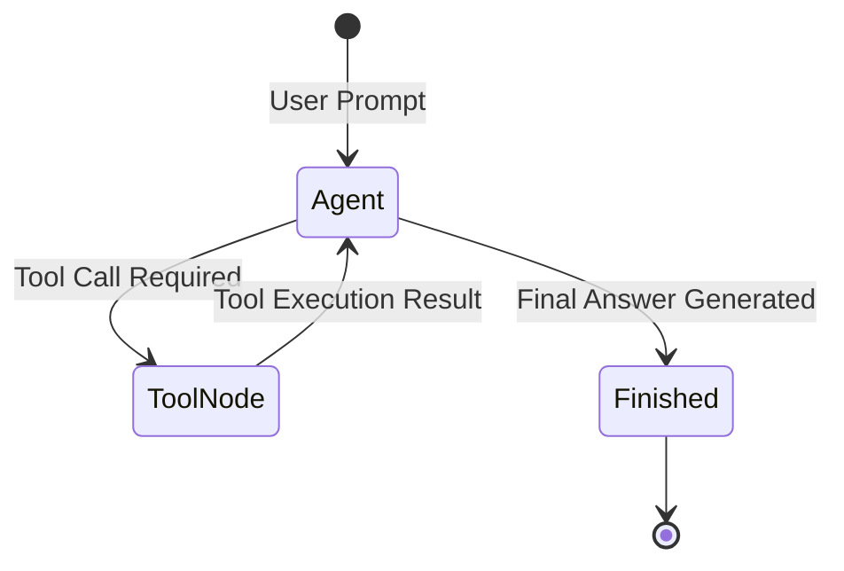

# 📹 Claude Custom Subagents (Build Your Own AI Workers)

<div className="video-card" style={{border: '1px solid #30363d', borderRadius: '8px', padding: '16px', marginBottom: '24px', background: 'rgba(56, 139, 253, 0.05)'}}>
  <div style={{display: 'flex', gap: '16px', flexWrap: 'wrap'}}>
    <div><strong>Instructor:</strong> Nitish Singh (CampusX)</div>
    <div><strong>Duration:</strong> 47m 23s</div>
    <div><strong>Playlist:</strong> Agentic Coding with Claude Code (CampusX)</div>
    <div><strong>Watch Link:</strong> <a href="https://www.youtube.com/watch?v=CBdixlYmtaw" target="_blank" rel="noopener noreferrer">YouTube Lecture ↗</a></div>
  </div>
</div>

## 📌 Executive Summary & Learning Objectives

This lecture covers **Claude Custom Subagents (Build Your Own AI Workers)**, focusing on production implementations, edge cases, and industry standards:
- Core intuition, architecture, and underlying mechanisms.
- Key differences between theoretical research implementations and scalable enterprise patterns.
- Concrete Python walkthroughs, error recovery, and performance optimization.

---

## 🏗️ Architecture & Conceptual Workflow



---

## 📖 Core Concepts & Technical Deep Dive

### 1. Architectural Foundations
In modern production AI engineering, **Claude Custom Subagents (Build Your Own AI Workers)** is essential for ensuring reliability, low latency, and deterministic outcomes. As AI systems evolve from naive prompt-in / completion-out scripts into distributed systems, engineers must handle:
- **State management & consistency:** Ensuring intermediate states and tool invocations are tracked.
- **Error boundaries & recovery:** Graceful degradation when external LLMs or vector stores encounter rate limits or network partitions.
- **Resource utilization & cost efficiency:** Caching common queries and reducing unnecessary foundation model token expenditure.

### 2. Operational Considerations
- **Latency Optimization:** Pre-computing embeddings, utilizing asynchronous non-blocking event loops, and streaming tokens via Server-Sent Events (SSE).
- **Security & Sandboxing:** Validating inputs before ingestion, sanitizing LLM outputs, and isolating tool execution environments.

---

## 💻 Production Implementation Walkthrough

```python
from mcp.server.fastmcp import FastMCP

# Initialize FastMCP Server
mcp = FastMCP("Production AI Tools Server")

@mcp.tool()
def calculate_token_cost(input_tokens: int, output_tokens: int, model: str = "gpt-4o") -> dict:
    """Calculate total API cost given token counts."""
    rates = {
        "gpt-4o": {"input": 2.50 / 1_000_000, "output": 10.00 / 1_000_000},
        "claude-3-5-sonnet": {"input": 3.00 / 1_000_000, "output": 15.00 / 1_000_000},
    }
    rate = rates.get(model, rates["gpt-4o"])
    cost = (input_tokens * rate["input"]) + (output_tokens * rate["output"])
    return {"model": model, "total_cost_usd": round(cost, 6)}

if __name__ == "__main__":
    # Runs stdio transport protocol for Claude Desktop & Claude Code
    mcp.run(transport="stdio")
```

---

## 💡 Production Best Practices & Tips

:::tip Production Deployment Guideline
When deploying Claude Custom Subagents (Build Your Own AI Workers) in enterprise environments, always configure automated retries with exponential backoff and telemetry tracing (such as OpenTelemetry or LangSmith).
:::

:::warning Common Failure Modes
Watch out for state contamination across concurrent requests. Ensure each session or user interaction uses an isolated thread ID or execution context.
:::

---

## 🎯 Key Takeaways & Quick Reference

| Dimension | Production Standard | Pitfall to Avoid |
| :--- | :--- | :--- |
| **Execution** | Async / Non-blocking with timeouts | Synchronous blocking calls in event loops |
| **Data Validation** | Strict Pydantic v2 schemas | Untyped dictionary access |
| **Monitoring** | Distributed tracing & latency percentiles | Relying only on standard console logs |

## ⏱️ Lecture Timeline & Key Topics

| Timestamp | Key Topic / Concept Discussed |
| :--- | :--- |
| **00:00:00** | हाय गाइस, माय नेम इज नितेश एंड यू वेलकम... |
| **00:11:31** | हैं। व्हिच बेसिकली मींस कि एक तरीके से... |
| **00:23:28** | दिस। ठीक है? ये मेरा एजेंट मार्कडाउन... |
| **00:34:58** | कॉन्टेक्स्ट राइटिंग द स्पेक नाउ।... |
| **00:47:20** | नेक्स्ट वीडियो में। बाय।... |


---

---

## 📜 Complete Lecture Transcript (English)

> **Language:** English | **Source:** `12 - Claude Custom Subagents (Build Your Own AI Workers) ｜ CampusX.hi-orig.srt` | **Total Segments:** 24 | **Word Count:** ~8,005 words

<details>
<summary><b>Click to expand full chronological transcript (24 timestamped intervals)</b></summary>

#### ⏱️ [00:00 ➔ 00:02]

हाय गाइस, माय नेम इज नितेश एंड यू वेलकम टू माय YouTube चैनल। इस वीडियो में भी हम लोग अपना क्लॉट कोड प्लेलिस्ट कंटिन्यू करेंगे और आज के वीडियो का टॉपिक है कस्टम सब एजेंट्स। सो अगर आपको याद होगा तो हमने लास्ट वीडियो में सब एजेंट्स पढ़ना शुरू किया था और वहां पे हमने बहुत डिटेल में सब एजेंट्स के बारे में कुछ फाउंडेशनल चीजें कवर की थी। जैसे कि सबसे पहले हमने ये कवर किया था कि सब एजेंट्स की जरूरत क्यों पड़ती है। फिर हमने ये डिस्कस किया था कि सब एजेंट्स एग्जजेक्टली होते क्या हैं? बेसिकली ऐसे एजेंट्स जिनका खुद का कॉन्टेक्स्ट विंडो होता है, खुद का प्रस होता है, खुद के अपने टूल्स होते हैं और वो एक स्पेसिफाइड टास्क को पूरा करने के लिए स्टार्ट किए जाते हैं। उसके बाद हमने पढ़ा था कि अ बिल्ट इन सब एजेंट्स क्या होते हैं क्लॉट कोड में। अ वहां पे हमने तीन टाइप के एजेंट्स देखे एक हमने देखा था एक्सप्लोर वाला एजेंट, एक हमने देखा था प्लान एजेंट और एक हमने देखा था अ जनरल पर्पस एजेंट। ठीक है? और इसके अलावा हमने लास्ट में ये भी डिस्कस किया था कि व्हाट आर द टॉप यूज केसेस जहां पे आप सब एजेंट्स को अप्लाई करते हो। ये सब कुछ हमने लास्ट वीडियो में पढ़ा था। अब हमारे आज के वीडियो का टॉपिक है कि हम अपने खुद के सब एजेंट्स एज इन सब कस्टम सब एजेंट्स कैसे बना सकते हैं? और उनको कैसे ट्रिगर कर सकते हैं ये हम आज के वीडियो में देखने वाले हैं। ठीक है? तो आई गेस मैंने आपको वीडियो का कॉन्टेक्स्ट समझा दिया है। बस एक इंपॉर्टेंट डिस्क्लेमर है वीडियो को शुरू करने के पहले कि अगर आपने पिछला वीडियो नहीं देखा है जहां पे हमने ये सारे की कांसेप्ट्स कवर किए हैं अराउंड सब एजेंट्स तो आपको आज का वीडियो देखने में काफी परेशानी होगी। तो आई वुड रिकमेंड आप इस प्लेलिस्ट में पिछला जो वीडियो है वो एक बार देख करके आओ। फिर आप इस वीडियो को पूरी तरीके से अच्छे से समझ पाओगे। ठीक है? तो अब हम डिस्कस करते हैं कि सबसे पहले कस्टम सब एजेंट्स की क्या जरूरत है? अगर ऑलरेडी बिल्ट इन सब एजेंट्स मौजूद हैं क्लॉट कोड के अंदर तो ऐसी क्या प्रॉब्लम

#### ⏱️ [00:02 ➔ 00:04]

सॉल्व करते हैं कस्टम एजेंट्स जिनकी वजह से हमें कस्टम एजेंट्स चाहिए होते हैं। कस्टम सब एजेंट्स चाहिए होते हैं। ठीक है? लेट्स डिस्कस दिस पॉइंट फर्स्ट। अब सबसे पहले हम ये पॉइंट कवर करेंगे कि व्हाई डू वी नीड कस्टम सब एजेंट्स? अगर हमारे पास बिल्ट इन सब एजेंट्स का ऑप्शन ऑलरेडी है। तो हमें अपने खुद के सब एजेंट्स बनाने की क्या जरूरत है? अब इस क्वेश्चन का एग्जांपल इस क्वेश्चन का आंसर मैं आपको एक एग्जांपल के थ्रू देता हूं। मान लो आपका एक कोड बेस है जहां पे आप कोड लिख रहे हो और आप ना अपने कोड बेस के ऊपर एक सिक्योरिटी ऑडिट कराना चाहते हो। सिंपल शब्दों में बोला जाए तो आप ये चेक करवाना चाहते हो कि कहीं कोई आपके कोड को हैक तो नहीं कर सकता। तो यहां पे आप कई तरह की चीजें टेस्ट करते हो। आप चेक करते हो कि क्या आपके डेटाबेस के ऊपर कोई सीक्वल इंजेक्शन अटैक तो नहीं कर सकता। क्या आपके कोड बेस में कोई एक्सपोज्ड एपीआई कीज़ तो नहीं है? इस तरह की चीजें आप चेक करते हो एक सिक्योरिटी ऑडिट में। अब ऑब्वियसली इस काम को करने के लिए आपको अपने पूरे कोड बेस को कॉन्टेक्स्ट विंडो में लोड करना पड़ेगा। और यह सिर्फ एक बार का काम है। तो एक बार कोड को रीड करने के बाद आगे आपको इस सेशन में इन सारे कोड्स की जरूरत नहीं है। इन सारे फाइल्स की जरूरत नहीं है। तो दिस इज़ अ टिपिकल परफेक्ट यूज़ केस वेयर यू कैन डिप्लॉय अ सब एजेंट। अब ये सिक्योरिटी ऑडिट वाला काम आप बहुत आसानी से एक बिल्ट इन एजेंट से करवा सकते हो। एक बिल्ट इन एजेंट आपके लिए सिक्योरिटी ऑडिट कर देगा। द ओनली प्रॉब्लम इज कि आपकी कंपनी का एक गाइडलाइन है या फिर आप बोल सकते हो कि एक चेक लिस्ट है और आपको अपना सिक्योरिटी ऑडिट उसी गाइडलाइन या चेक लिस्ट के बेसिस पे करना है। अब यहां पे प्रॉब्लम आ जाती है कि आपका जो बिल्ट इन एजेंट है वो आपके हिसाब से स्पेशलाइज्ड तरीके से किसी चेक लिस्ट को फॉलो करते हुए सिक्योरिटी ऑडिट नहीं कर

#### ⏱️ [00:04 ➔ 00:06]

सकता। उस एजेंट के पास एक जेनेरिक नॉलेज है कि सिक्योरिटी ऑडिट कैसे करना है। बट स्पेशलाइज्ड टू योर कोड बेस सिक्योरिटी ऑडिट कैसे करना है। यह आपके बिल्ड इन सब एजेंट को नहीं पता। यहीं पे जरूरत पड़ती है कस्टम सब एजेंट की। अब आप क्या कर सकते हो कि आप एक खुद का एजेंट या सब एजेंट बना सकते हो। और वहां पे आप क्या कर सकते हो कि आप अपने हिसाब से अपने पसंद के टूल्स का एक्सेस उसको दे सकते हो। आप अपने हिसाब से उसको एक सिस्टम प्र्प के थ्रू जितना भी कस्टमाइज्ड स्पेशलाइज्ड इंस्ट्रक्शन आपको देना है वो दे सकते हो। आप अपने स्किल्स का एक्सेस उसको दे सकते हो। तो सिंपल शब्दों में ऐसा बोला जा सकता है कि आप एकदम अपने लिए एक टेलर मेड सब एजेंट बना सकते हो जो आपके लिए आपके टास्क को बिल्कुल वैसा ही करेगा जैसा आप चाहते हो। एंड दिस इज द होल आईडिया बिहाइंड सब एजेंट्स कस्टम सब एजेंट्स कि कभी भी अगर आपको अपने स्पेशलाइज्ड टास्क को करवाने के लिए किसी सब एजेंट की जरूरत है तो फिर आप रादर देन यूजिंग अ बिल्ट इन सब एजेंट एक कस्टम सब एजेंट बनाते हो अपने लिए। ठीक है? अब ये चीज मैंने यहां पे सिक्योरिटी ऑडिट का एग्जांपल देके बताया। इट कैन बी इजीली रिप्लेस्ड बाय अ टेस्टिंग एग्जांपल। जहां पे आप एक टेस्टिंग के लिए सब एजेंट बनाना चाहते हो। बट अगेन टेस्टिंग जो करवानी है वो आपके कोड बेस के ऊपर स्पेशलाइज तरीके से करवानी है। ठीक है? तो यू गेट द आईडिया व्हनेवर देयर इज़ अ नीड फॉर स्पेशलाइजेशन देन यू क्रिएट योर ओन सब एजेंट्स रादर देन गोइंग फॉर बिल्ट इन सब एजेंट्स। ठीक है? तो दिस इज़ द मेन आईडिया। आई रियली होप मैं आपको समझा पाया व्हाई डू वी नीड कस्टम सब एजेंट्स। सो नाउ दैट वी नो कि हमें कस्टम सब एजेंट्स की ज़रूरत क्यों है? अब एक बार हम यह डिस्कस करते हैं कि आप कस्टम सब एजेंट्स को कैसे बनाते हो। ठीक है? तो कस्टम सब एजेंट्स को बनाने का तरीका बहुत सिंपल है। आपको बेसिकली एक

#### ⏱️ [00:06 ➔ 00:08]

मार्कडाउन फाइल क्रिएट करनी पड़ती है। जैसा आप अभी तक करते आ रहे हो क्लॉट कोड में। एवरीथिंग इज़ अ मार्कडाउन फाइल। सिमिलरली सब एजेंट्स आर आल्सो अ मार्कडाउन फाइल। और वो मार्कडाउन फाइल कुछ ऐसी दिखाई देती है। ठीक है? सबसे पहले आपकी मार्कडाउन फाइल में एक यामल फ्रंट मैटर होता है जो आप पहले भी पढ़ चुके हो। यहां पे कुछ की फील्ड्स होती हैं जिसके बारे में आपको बताना होता है। सबसे पहले आपके सब एजेंट का नाम क्या है? एक छोटा सा वन लाइन डिस्क्रिप्शन। उसके बाद नॉट वन लाइन एक्सैक्टली आप बहुत डिटेल में भी डिस्क्राइब कर सकते हो कि आपका एजेंट क्या होता है? क्या है? उसके बाद कौन-कौन से टूल्स का आप एक्सेस देना चाहते हो इस सब एजेंट को। उसके बाद कौन सा मॉडल रहेगा इस सब एजेंट के पीछे यह भी आप बता सकते हो। और इसके अलावा भी और बहुत तरह के फील्ड्स हैं जो आप यहां पे सेट कर सकते हो। सच एज आपके कौन-कौन से स्किल्स आप देना चाहते हो, कौन-कौन से हुक्स का एक्सेस है, मेमोरी दे सकते हो। आप, एफर्ट लेवल सेट कर सकते हो, कलर भी सेट कर सकते हो। ठीक है? तो ये सब कुछ आप बताते हो सबसे पहले यामल फ्रंट मैटर में। उसके बाद आती है आपके सब एजेंट की मेन बॉडी। मेन बॉडी में आप सब एजेंट के बारे में एकदम डिटेल्ड इंस्ट्रक्शंस लिखते हो कि उसको अपना टास्क कैसे कैरी आउट करना है। अगर आप चाहो तो यहीं पर एक सिस्टम प्र्ट भी ऐड कर सकते हो। तो दिस इज़ हाउ यू क्रिएट एन एजेंट। अब अच्छी चीज क्या है कि आप अगर आप चाहो तो आप अपने से खुद से भी यह मार्कडाउन फाइल बना सकते हो। और या फिर अगर आप चाहो तो क्लॉट कोड भी आपको यह फाइल क्रिएट करने में हेल्प करता है। ठीक है? तो दोनों ऑप्शंस हमारे पास हैं। हम दोनों तरीके देखेंगे इस वीडियो में। आपको बेसिकली क्या करना पड़ता है? इस मार्कडाउन फाइल को बना करके डॉट क्लॉड फोल्डर के अंदर एजेंट्स बोल करके एक फोल्डर बनाना पड़ता है। और उस एजेंट्स फोल्डर के अंदर

#### ⏱️ [00:08 ➔ 00:10]

आप इस मार्कडाउन फाइल को सेव करते हो। अगर आप यह प्रोसेस फॉलो करोगे तो आपका कस्टम सब एजेंट बन जाएगा। ठीक है? मैंने लास्ट वीडियो में भी बताया था कि देयर आर टू टाइप्स ऑफ कस्टम सब एजेंट्स। वन इज़ कि आप प्रोजेक्ट लेवल बनाओ व्हिच बेसिकली मींस कि आपका ये जो डॉट क्लॉट फोल्डर है ये आपके प्रोजेक्ट की रूट डायरेक्टरी में है। और सेकंड आप पर्सनल लेवल भी बना सकते हो। पर्सनल लेवल पे बस आपका जो डॉट क्लॉट फोल्डर होगा वो आपकी होम डायरेक्टरी के अंदर होगा। आज हम जितने भी सब एजेंट्स बनाएंगे वो सब के सब प्रोजेक्ट स्पेसिफिक होंगे। प्रोजेक्ट लेवल वाले होंगे। ठीक है? तो आई होप आपको समझ में आ गया कि सब एजेंट इज़ नथिंग बट अ मार्कडाउन फाइल विथ अ यामल फ्रंट मैटर एट अ मेन बॉडी एंड यू हैव टू सेव दिस फाइल टू द डॉट क्लॉड डायरेक्टरी। उसके अंदर एजेंट्स के अंदर यू हैव टू सेव दिस। नेक्स्ट एक चीज़ और डिस्कस कर लेते हैं कि ये एजेंट्स ट्रिगर कैसे होते हैं? तो कस्टम सब एजेंट्स के ट्रिगर होने का भी दो तरीका है। पहला तरीका है ऑटोमेटिकली मतलब आप कोई काम कर रहे हो और सडनली से क्लॉट को ऐसा लगा कि ये काम करने के लिए मेरे पास एक एजेंट है तो फिर वो एजेंट को ऑटोमेटिकली ट्रिगर कर देता है। क्लॉट को कैसे समझ में आता है कि किस काम के लिए कौन सा सब एजेंट अवेलेबल है? ये सिंपल डिस्क्रिप्शन फील्ड क्लॉट को हेल्प करती है टू ट्रूली अंडरस्टैंड कि किस सिनेरियो में किस तरह का सब एजेंट डिप्लॉय करना चाहिए। तो एक तरीका है ऑटोमेटिकली ट्रिगर होना। सेकंड है मैनुअली ट्रिगर करना। बेसिकली वी द प्रोग्रामर ट्रिगरर्स द सब एजेंट जैसा हम इस वीडियो में करेंगे। ठीक है? तो ये आप चाहो तो बोल के भी करवा सकते हो या फिर आप अपने खुद के कस्टम स्लैश कमांड्स क्रिएट कर सकते हो। बेसिकली आप अपने खुद के वर्क फ्लोस क्रिएट कर सकते हो जिसमें ऑटोमेटिकली आपका सब एजेंट ट्रिगर हो जाएगा। फॉर एग्जांपल आपने अपने लिए एक

#### ⏱️ [00:10 ➔ 00:12]

टेस्टिंग सब एजेंट बनाया और आपने स्लैश टेस्ट फीचर बोल करके एक कस्टम कमांड बना दिया और इस कमांड की मार्कडाउन फाइल में आपने बोल रखा है कि जैसे ही मैं इस कमांड को ट्रिगर करूं तुम बिहाइंड द सीन्स इस सब एजेंट को स्टार्ट कर देना और ये सब एजेंट ये काम करेगा। तो आप इस तरह का वर्क फ्लो भी बना सकते हो। हो तो दोनों ऑप्शंस आपके पास अवेलेबल है। जनरली मैंने जो देखा है वर्क फ्लोस में वो यह रहता है कि लोग मैनुअली ज्यादा ट्रिगर करना प्रेफर करते हैं अपने वर्क फ्लो के हिसाब से। बट एट द सेम टाइम आप चाहो तो ऑटोमेटिकली भी ये पूरी चीज काम कर सकती है। ठीक है? तो आई गेस आपको एक डिटेल्ड इंट्रोडक्शन मिल गया अबाउट कस्टम सब एजेंट्स। अब हम प्रैक्टिकली अपने खुद के सब एजेंट्स बनाना सीखेंगे। ठीक है? तो उसके लिए पहले मैं आपके साथ अ थोड़ा प्लान ऑफ एक्शन शेयर करना चाहता हूं कि इस वीडियो में एक्सजेक्टली हम क्या करने वाले हैं। इफ यू रिमेंबर हमारे पास एक रनिंग प्रोजेक्ट है। हम उस रनिंग प्रोजेक्ट में ही सब एजेंट्स को इंप्लीमेंट करना सीखेंगे। अब अगर हम बात करें हमारे प्रोजेक्ट की जो एक्सपेंस ट्रैकर एप्लीकेशन हम बना रहे हैं उसमें हमारा प्रोग्रेस अभी तक यह रहा है कि हमारा यूजर हमारी वेबसाइट पे आकर के रजिस्टर कर सकता है, लॉगिन कर सकता है और लॉगिन करने के बाद वो अपने प्रोफाइल पेज में जा सकता है। अभी जो आपको स्क्रीन पे दिखाई दे रहा है वो हमारे यूजर का प्रोफाइल पेज है और वहां पे जो भी डेटा आपको दिखाई दे रहा है ये रियल डेटा है। ये हम डेटाबेस के अंदर से फैच करके ला रहे हैं। व्हिच बेसिकली मींस कि एक तरीके से हमारा जो प्रोफाइल पेज है वो कंप्लीट है। ठीक है? अब हमारा आज का गोल क्या है कि हम इस प्रोफाइल पेज को थोड़ा सा एनहांस करेंगे। एनहांस कैसे करेंगे कि हम यहां पर एक डेट सेलेक्शन टूल ऐड करेंगे। वो आपने देखा होगा शायद बहुत तरह के डैशबोर्ड्स में क्या होता है कि आपके पास एक डेट रेंज सेलेक्ट करने का ऑप्शन होता है। जैसे फिलहाल मुझे इस यूजर के सारे एक्सपेंसेस

#### ⏱️ [00:12 ➔ 00:14]

दिखाई दे रहे हैं जितने भी उसने हमारे प्लेटफार्म पे ऐड किए हैं। बट व्हाट इफ मेरा यूजर किसी कस्टम डेट रेंज के बीच में अपने एक्सपेंसेस देखना चाहता है। फॉर एग्जांपल 20 सेवंथ फब और आज के डेट के बीच में उसने जितने भी एक्सपेंसेस किए हैं वो देखना चाहता है। तो वो कैसे होगा? वही चीज हम आज अपने इस प्रोफाइल पेज में ऐड करने वाले हैं। सो यहां पर एक काइंड ऑफ ड्रॉपडाउन आ जाएगा जहां से हमारा यूजर दो डेट्स सेलेक्ट करेगा और ऑटोमेटिकली इस पूरे प्रोफाइल पेज में जो भी इनेशन दिखाई दे रहा है यूजर को वो सब कुछ उस डेट रेंज के अंदर दिखाई देने लगेगा। सो टोटल अमाउंट कितना स्पेंड किया वो भी उस दो डेट के बीच में आएगा। नंबर ऑफ ट्रांजैक्शंस कितने हुए वो भी उस डेट के बीच में आएगा। टॉप कैटेगरी भी उसी के बीच में आएगी और रीसेंट ट्रांजैक्शंस में भी सिर्फ वही ट्रांजैक्शंस दिखाई देंगे जो उस डेट रेंज के अंदर फॉल करते हैं। ठीक है? एंड सेम फॉर दिस बाय कैटेगरी वाला चार्ट आल्सो। ठीक है? तो दिस इज़ व्हाट वी आर गोइंग टू इंप्लीमेंट टुडे। बट देयर इज़ अ बिग चेंज। ठीक है? मैं आपको बताता हूं वो चेंज क्या है। हम इस पर्टिकुलर फीचर को वैसे डेवलप नहीं करेंगे जैसे हम अभी तक फीचर्स को डेवलप करते आ रहे हैं। सो अगर आपको याद होगा तो हम ये स्पेक ड्रिवन वर्क फ्लो यूज़ कर रहे हैं टू डेवलप ईच ऑफ़ आवर फीचर्स। जहां पे हम पहले एक नया ब्रांच क्रिएट करते हैं। और फिर उस ब्रांच के अंदर वी क्रिएट अ स्पेक डॉक्यूमेंट देन वी क्रिएट अ प्लान देन वी इंप्लीमेंट इट एंड वैलिडेट इट। और उसके बाद हम जो भी चेंजेस होते हैं उसको हम गेट पर डालते हैं। पीआर क्रिएट करते हैं। उसको मर्ज करते हैं और फिर डिलीट करते हैं करंट ब्रांच को मेन ब्रांच में चले जाते हैं। ये फ्लो हम यूज़ कर रहे थे। बट अब से गोइंग फॉरवर्ड हम जितने भी फीचर्स डेवलप करेंगे इस वेबसाइट में उसमें एक बहुत बड़ा चेंज आने वाला है। चेंज क्या है? मैं आपको बताता हूं। चेंज ये है कि अब हम जब भी कोई नया फीचर डेवलप करेंगे तो

#### ⏱️ [00:14 ➔ 00:16]

उसके डेवलपमेंट के ठीक बाद हम दो स्टेप्स और करेंगे गेट पे पुश करने के पहले। पहला हम उस फीचर को एक्सटेंसिवली टेस्ट करेंगे जो कि हर सॉफ्टवेयर टीम करती भी है। और सेकंड हम उसको कोड रिव्यू भी करेंगे। ठीक है? अ जनरली कोड रिव्यू जो होता है वो आपके पुल रिक्वेस्ट वाले स्टेज पर होता है। अ बट हम काइंड ऑफ एक सेल्फ कोड रिव्यू करेंगे कि प्रोग्रामर ने एक फीचर डेवलप किया है। वो अपने लेवल पे एक बार कोड रिव्यू करके देखना चाहता है कि सब ठीक है। ठीक है? तो गोइंग फॉरवर्ड इस प्लेलिस्ट में अब हम जितने भी फीचर्स ऐड करेंगे इस वेबसाइट के अंदर वो सब के सब इन दो स्टेजेस से गुजरेंगे। फीचर बनेगा। फिर वो टेस्ट होगा। फिर कोड रिव्यू होगा और उसके बाद ही हम पूरी चीज को पुश करेंगे गिट के ऊपर। ठीक है? अब मैं आपको ये टेस्टिंग और कोड रिव्यू वाले स्टेजेस का भी डिटेल बताता हूं। सो टेस्टिंग वाला जो स्टेज है वो ट्रिगर कैसे होगा? हम सबसे पहले एक कस्टम स्लैश कमांड बनाएंगे जिसका नाम होगा स्लैश टेस्ट फीचर। जैसे ही हम स्लैश टेस्ट फीचर को ट्रिगर करेंगे, रन करेंगे, बिहाइंड द सीन्स क्या होगा कि दो सब एजेंट्स स्टार्ट होंगे सीक्वेंशियली एक के बाद एक। पहला जो सब एजेंट है उसका नाम है टेस्ट राइटर। टेस्ट राइटर का काम क्या है? कि वो आपके करंट फीचर के हिसाब से टेस्ट केसेस लिखेगा। ठीक है? और फिर जो अगला सब एजेंट है उसका नाम है टेस्ट रनर। इसका काम क्या है? कि जो भी टेस्ट राइटर ने टेस्ट केसेस लिखे हैं, टेस्ट रनर उनको रन करेगा। ठीक है? दो अलग सब एजेंट्स क्यों बनाए? बिकॉज़ इट्स अ गुड स्ट्रेटजी। एक ही सब एजेंट ने खुद ही टेस्ट केसेस लिखे भी और फिर उनको रन भी किया। इससे बेटर स्ट्रेटजी ये है कि आप एक सब एजेंट को बोलो कि वो टेस्ट केसेस लिखे और दूसरे वाले को बोलो

#### ⏱️ [00:16 ➔ 00:18]

कि वो टेस्ट केसेस रन करके बताएं। ठीक है? और जब ये दोनों सब एजेंट्स अपना-अपना काम कर लेंगे तो हमें एक फाइनल समरी मिलेगी जो हमारा मेन एजेंट हमें दिखाएगा कि पूरा टेस्टिंग स्टेज के बाद व्हाट इज द रिजल्ट। ठीक है? एक बार यहां पे चीजें क्लियर हो जाती हैं। उसके बाद अगला स्टेज ये है कि हम एक और कस्टम स्लैश कमांड बनाएंगे जिसका नाम होगा कोड रिव्यू फीचर। और इसको ट्रिगर करते ही होगा क्या कि एक साथ दो सब एजेंट्स ट्रिगर होंगे पैरेलली। एक सब एजेंट का नाम है सिक्योरिटी रिव्यू सब एजेंट। इसका काम क्या है कि ये हमारे कोड को एनालाइज करेगा टू फाइंड एनी काइंड ऑफ़ सिक्योरिटी थ्रेट्स। जो नया फीचर हमने लिखा है, जो कोड हमने लिखा है, क्या उसमें कोई इस तरह का फ्लॉ है जिसकी वजह से हमारे कोड में हैकिंग हो सकती है? यह चीजें चेक करेगा हमारा सिक्योरिटी रिव्यू वाला एजेंट। और एक सेकंड हमारे पास एक और सब एजेंट होगा विल बी कोड क्वालिटी रिव्यू एजेंट। इसका काम है ये चेक करना कि जो कोड लिखा गया है इस फीचर को डेवलप करने के प्रोसेस में वो कितना सही तरीके से लिखा गया है। क्या सही प्रैक्टिससेस फॉलो की गई है या नहीं? वो हम इस पर्टिकुलर सब एजेंट को टास्क देंगे। अब आई गेस आप समझ पा रहे हो कि ये दोनों सब एजेंट्स पैरेलली क्यों रन हो रहे हैं? बिकॉज़ ये दोनों टास्क एक दूसरे से इंडिपेंडेंट है। इसीलिए ये साथ में रन होंगे और इन दोनों का जो रिजल्ट होगा वो अगेन हमें समराइज करके दिखाया जाएगा थ्रू आवर मेन एजेंट। ये हम फ्लो अब यूज़ करने वाले हैं। एक बार जब यहां पे समरी मिल गई और सब कुछ ठीक है उसके बाद ही हम ये वाला फ्लो इंप्लीमेंट करेंगे। ठीक है? तो आई होप आपको समझ में आ रहा है कि किस तरीके से हम कस्टम सब एजेंट्स का जो कांसेप्ट है उसको इंटीग्रेट कर रहे हैं हमारे करंट प्रोजेक्ट के अंदर। ठीक है? तो अब हम स्टार्ट करते हैं अ इस पूरे प्रोसेस को और सबसे पहले हम क्या करेंगे? हम ये

#### ⏱️ [00:18 ➔ 00:20]

सारे के सारे सब एजेंट्स बिल्ड करेंगे और ये जो दोनों के दोनों कमांड्स हैं इनको भी हम क्रिएट करेंगे। और फिर इस पूरी चीज को जोड़ करके मैं आपको एक फीचर डेवलप करके दिखाऊंगा। सो दैट आपको कंप्लीट आईडिया हो कि पूरी चीज काम कैसे कर रही है। तो गाइस सबसे पहले हम लोग टेस्टिंग वाला जो वर्क फ्लो है वो इंप्लीमेंट करेंगे। पहले मैं दो सब एजेंट्स बनाऊंगा। फर्स्ट विल बी द टेस्ट राइटर सब एजेंट। देन आई विल क्रिएट द टेस्ट रनर सब एजेंट। और फिर इन दोनों को टाई अप करने के लिए आई विल क्रिएट दिस कस्टम स्लैश कमांड बाय द नेम ऑफ़ टेस्ट फीचर। ठीक है? तो लेट मी शो यू कैसे आप एक कस्टम सब एजेंट बनाते हो। आपको क्या करना होता है कि सबसे पहले यू हैव टू गो टू योर अ कोड रेपो। प्रोजेक्ट डायरेक्टरी में आपको जाना है एंड यू हैव टू स्टार्ट क्लॉड। लेट्स रीनेम दिस सेशन टू अ कस्टम सब एजेंट्स। बिकॉज़ यहां पे हम कस्टम सब एजेंट्स ही बनाएंगे। ठीक है? तो जैसा मैंने बोला देयर आर टू वेज़ टू क्रिएट कस्टम सब एजेंट्स। वन इज़ यू डू इट मैनुअली बाय क्रिएटिंग ऑल द फोल्डर्स एंड उसके अंदर एक एजेंट डॉट एमडी फाइल बना के। सेकंड ऑप्शन इज़ कि आप क्लॉट कोड की हेल्प लो। कैसे? आपको सिंपली एक अ कमांड मिलता है स्लैश एजेंट्स बोल के। आपको ये कमांड रन करना है। और ये आपको बता देगा कि आपके करेंटली कितने एजेंट्स रन कर रहे हैं। आपकी लाइब्रेरी में क्या-क्या है एजेंट्स। और फाइनली अगर आप चाहो तो यहां से एजेंट्स टैब में जाके क्रिएट न्यू एजेंट पर क्लिक कर सकते हो। अब यहां पे आपसे पूछा जाएगा कि आपको जो सब एजेंट बनाना है वो प्रोजेक्ट लेवल बनाना है या फिर पर्सनल बनाना है? तो हम प्रोजेक्ट लेवल सब एजेंट बनाएंगे। अब यहां पे हमें फिर से दो ऑप्शंस दिए जा रहे हैं। वुड यू लाइक टू

#### ⏱️ [00:20 ➔ 00:22]

क्रिएट और जनरेट द एजेंट फाइल यूजिंग क्लॉट या फिर आप मैनुअली कॉन्फिग करना चाहते हो? तो सिंस आप फर्स्ट टाइम ऐसा कर रहे हो तो आई वुड रिकमेंड द फर्स्ट ऑप्शन। उसके बाद यहां पे आपको एक डिस्क्रिप्शन बताना है कि आपका सब एजेंट करेगा क्या? तो यहां पे मैंने एक डिस्क्रिप्शन पेस्ट कर रखा है। मैं इसको कॉपी कर रहा हूं। यहां पे देखो लिखा हुआ है यूज़ दिस एजेंट टू राइट पाई टेस्ट टेस्ट केसेस फॉर स्पेंडली फॉर स्पेंडली फीचर्स। इनवोक आफ्टर इंप्लीमेंटिंग एनी फीचर टू जनरेट टेस्ट्स बेस्ड ऑन फीचर स्पेक्स नॉट द इंप्लीमेंटेशन। ठीक है? तो ये हो गया हमारा डिस्क्रिप्शन ऑफ द सब एजेंट। इसको मैं यहां पे पेस्ट कर रहा हूं। पेस्ट करने के बाद यू हैव टू हिट एंटर। और अब वो आपका एजेंट बनाना स्टार्ट कर देगा। नेक्स्ट वो आपसे पूछ रहा है कि आपको अपने सब एजेंट को कौन-कौन से टूल्स का एक्सेस देना है। ठीक है? तो सिंस दिस इज अ एजेंट जिसका काम है टेस्ट केसेस लिखना। मैं इसको रीड एडिट टूल्स का एक्सेस दूंगा। रीड ओनली टूल्स का और एडिट टूल्स का एक्सेस दूंगा। सो व्हाट आई विल डू इज़ इंस्टेड ऑफ़ सेलेक्टिंग ऑल टूल्स आई विल सेलेक्ट रीड ओनली टूल्स एंड आई विल आल्सो गिव इट एक्सेस ऑफ़ एडिट टूल्स। बिकॉज़ इसको चीजें लिखनी होंगी। और उसके बाद आई विल हिट कंटिन्यू। अब मुझे मॉडल सेलेक्ट करना है कि ये जो सब एजेंट है ये कौन से मॉडल के ऊपर रन करेगा। तो फिलहाल आई एम सेलेक्टिंग Sonet। उसके बाद यू कैन आल्सो गिव इट अ कलर। सो फॉर नाउ आई एम गिविंग इट अ कलर अ जो कि रेड है। ठीक है? तो अभी कभी भी फ्यूचर में आपको ये एजेंट काम करता हुआ दिखाई देगा तो वो आपको कुछ ऐसा दिखाई देगा जैसा आपको नीचे दिख रहा है। ठीक है? तो आई विल सेलेक्ट रेड। और उसके बाद आपसे पूछा जा रहा है कि आप अपने एजेंट को कोई मेमोरी देना चाहते हो? तो फिलहाल इस एजेंट को कुछ मेमोरी देने की रिक्वायरमेंट मुझे नहीं दिख रही है। तो मैं नन सेलेक्ट कर रहा हूं। अब ये जो पूरा चीज है ये हमारे एजेंट का एक काइंड ऑफ कंप्लीट डिस्क्रिप्शन और सिस्टम प्र्ट

#### ⏱️ [00:22 ➔ 00:24]

वगैरह आ गया। अगर आप चाहो तो यहीं पे इसको एडिट भी कर सकते हो। मैं जनरली इसको यहां पे एडिट नहीं करता हूं। मैं एक बार क्रिएट कर लेता हूं फाइल को। यू कैन सी यहां पे हमारा एक डॉट क्लॉट फोल्डर के अंदर एजेंट्स फोल्डर बन गया। और एजेंट्स के अंदर अगर आप देखो तो ये बन गई है हमारी एजेंट की एम्प्टी फाइल मार्कडाउन फाइल और यहां पे बहुत डिटेल में लिखा हुआ है कि ये एजेंट काम कैसे करता है। ऊपर में यहां पे आपका यमेल फ्रंट मैटर है। यहां पे आपका एजेंट का नाम है। ये आपका डिस्क्रिप्शन है। उसके बाद ये आपका एक तरह का सिस्टम प्र्ट हो गया। और उसके बाद कैसे काम करेगा ये एजेंट? ये पूरी डिटेल यहां पे लिखी हुई है। ठीक है? अब जनरली क्या करना चाहिए आपको? यह फाइल क्रिएट होने के बाद इसको एक्सटेंसिवली रिव्यू करना चाहिए। ठीक है? आप इसको कहीं पेस्ट कर दो क्लॉड में या चार्ज जीपीटी में और अपने प्रोजेक्ट का कॉन्टेक्स्ट देके पूछो कि ये जो फाइल जनरेट हुई है या कितनी सही है? अच्छी बात तो ये होगी कि आप खुद से मैनुअली पूरी फाइल को पढ़ो। अगर वो आप नहीं कर पा रहे हो तो भी आपको क्या करना चाहिए? किसी एआई एजेंट इस असिस्टेंट के पास जाकर के उसके बारे में पूछना चाहिए। ठीक है? तो व्हाट आई विल डू इज मैं डायरेक्टली तो अ इस जनरेटेड फाइल को यूज़ नहीं करूंगा। इंस्टेड व्हाट आई विल डू इज़ मेरे पास एक दूसरा वर्जन है जो मैंने खुद से पूरा चेक करके बनाया था। उसको मैं यहां पे पेस्ट कर दूंगा। सो व्हाट व्हाट आई विल डू इज़ आई विल रिप्लेस दिस वन विद दिस। ठीक है? ये मेरा एजेंट मार्कडाउन फाइल है जो मैंने खुद से ट्राई आउट किया था थोड़ी देर पहले और ये बिल्कुल सही काम कर रहा था। तो यहां पे यू कैन गो एंड सी अ दिस इज द नेम ये टूल्स का एक्सेस है। मॉडल ये रहा कलर ये रहा और ये बाकी चीजें हैं। अगर आपको इसको थोड़ा और अच्छे से समझना है तो मैंने क्या किया है? मैंने इस पूरे एजेंट फाइल को इस मार्कडाउन फाइल को एक बढ़िया इंफोग्राफिक में कन्वर्ट कर दिया है। मैं आपको वो दिखाता हूं। सो यू कैन सी दिस इज़ द फाइल। बेसिकली दिस इज़ द

#### ⏱️ [00:24 ➔ 00:26]

इंफोग्राफिक बेस्ड ऑन दैट फाइल। अ एजेंट का नाम है स्पेंडली टेस्ट राइटर। इट इज़ अ स्पेशलाइज़्ड एआई दैट राइट्स पाई टेस्ट फॉर स्पेंडली बेस्ड ऑन व्हाट फीचर शुड डू नॉट व्हाट कोड सेज़। कैसे काम करेगा यह? जैसे ही फीचर बनेगा फीचर का कोड लिखाएगा। उसके बाद ये जो हमारा सब एजेंट है ये जाकर के स्पेक फाइल को रीड करेगा। समझने की कोशिश करेगा कि इस फीचर का काम क्या था। और फिर उसके बेसिस पे ये टेस्ट रन करेगा। रन नहीं करेगा। टेस्ट केसेस क्रिएट करेगा। ठीक है? कहां पे क्रिएट करेगा? सो ये हमारे प्रोजेक्ट डायरेक्टरी के अंदर एक टेस्ट बोल के फोल्डर क्रिएट करेगा। सो इस पॉइंट पे हमारी प्रोजेक्ट डायरेक्टरी में टेस्ट बोल के कोई फोल्डर नहीं है। बट जब ये एजेंट अपना काम स्टार्ट करेगा तो एक टेस्ट बोल के फोल्डर बन जाएगा और उसके अंदर टेस्ट अंडरस्कोर फीचर का जो भी नाम है डॉट पीवाई बोल के एक फाइल क्रिएट हो जाएगी। उसी के अंदर सारे टेस्ट केसेस होंगे। यहां पे लिखा हुआ है कि क्या-क्या चीजें टेस्ट किया जाएगा। सो हैप्पी पाथ टेस्ट होगा। बेसिकली हर करेक्ट इनपुट के लिए करेक्ट आउटपुट मिल रहा है कि नहीं। वैलिडेशन चेक किया जाएगा। एचटीटीपी सिमेंैटिक्स चेक किए जाएंगे। अलग-अलग एच केसेस चेक किए जाएंगे। ये चेक किया जाएगा कि लॉक्ड आउट यूजर तो एक्सेस नहीं कर पा रहा है। और बाकी सारी चीजें यहां पे चेक की जाएंगी। यहां पे एक चीज बहुत इंपॉर्टेंट लिखी हुई है वोंट डू वाले सेक्शन में कि आपके जो टेस्ट केसेस बनाए जाएंगे वो आपके स्पेक फाइल के बेसिस पे होंगे ना कि जनरेटेड कोड के बेसिस पे। क्योंकि जनरेटेड कोड हो सकता है गलत हो। बट स्पेक हमेशा सही रहने वाला है। ठीक है? और ये आपका टेक्स्ट टैक है। तो आई वुड रिकमेंड एक बार आप वीडियो को पॉज करके ये पूरा पढ़ लो और उससे भी बेटर है कि आपको जब के ऊपर ये फाइल मिले तो आप इसको जाके खुद से रीड आउट करो। ठीक है? बट जो भी है दिस इज़ आवर फर्स्ट सब एजेंट दैट वी हैव क्रिएटेड विथ द हेल्प ऑफ़ क्लॉट कोड। अब आपको प्रोसेस समझ में आ गया है तो गोइंग फॉरवर्ड हम क्या करेंगे? हम अ मैनुअली भी क्रिएट कर लिया करेंगे सब एजेंट्स को। सो यह टेस्ट राइटर सब एजेंट तो बन गया। अब हम

#### ⏱️ [00:26 ➔ 00:28]

बनाएंगे टेस्ट रनर सब एजेंट। सो प्रोसेस बिल्कुल सेम रहेगा। इनफैक्ट इस बार आई वुड रिकमेंड कि आप एजेंट्स कमांड पे जाओ। एजेंट्स टैब पे जाओ, क्रिएट न्यू एजेंट पे जाओ, प्रोजेक्ट सेलेक्ट करो और इस बार आप मैनुअल कॉन्फ़िगरेशन सेलेक्ट करो। मैनुअल कॉन्फ़िगरेशन में जा के आप क्या कर सकते हो कि आप खुद से सारी चीजें अपने हिसाब से सेट कर सकते हो। जैसे आपको एजेंट का नाम क्या देना है? तो मान लो हमारी एजेंट का नाम है टेस्ट रनर। फिर आप यहां पर खुद से सिस्टम प्र्प सकते हो। फिलहाल मैं दे नहीं रहा हूं। फिर आप यहां पे एग्जैक्टली बता सकते हो कि क्लॉड इसको किस लिए यूज़ करेगा। सब कुछ बताओ बता सकते हो। उसके बाद यू हैव टू टेल कि आपका कौन-कौन से टूल्स रहेंगे। सो पूरा आप मैनुअली अपने एजेंट को कॉन्फ़िगर कर सकते हो। फिलहाल हम ऐसा नहीं कर रहे हैं। मैं बस आपको दिखा रहा था कि दिस इज़ हाउ यू क्रिएट एजेंट्स विथ द हेल्प ऑफ़ मैनुअल कॉन्फ़िगरेशन। इस बार मैं क्या कर रहा हूं? तो इंस्टेड ऑफ़ डूइंग दिस स्लैश एजेंट्स वाला कमांड मैं डायरेक्टली जा रहा हूं हमारे एजेंट्स वाले फोल्डर में और वहां पे मैं एक नई फाइल बना रहा हूं और इस फाइल का नाम है स्पेंडली टेस्ट रनर डॉट एमडी और यहां पे मैं पेस्ट कर रहा हूं डायरेक्टली पूरा का पूरा मार्कडाउन जो मैंने बना रखा है पहले से ठीक है जैसा मैंने बोला ये पूरी चीज़ मैंने ऑलरेडी रन करके देख लिए तो मेरे पास ये सारी एजेंट फाइल्स का मार्कडाउन कंटेंट है। तो मैं उसी को यहां पे पेस्ट कर रहा हूं। और जैसा मैंने बोला इस पर्टिकुलर एजेंट का काम है टेस्ट केसेस को रन करना जो प्रीवियस एजेंट ने बनाए थे। तो दिस इज़ द नेम दिस इज़ द डिस्क्रिप्शन। ये सारे टूल्स आपके पास अवेलेबल हैं। इसके पास आप नोटिस करोगे राइट एक्सेस नहीं है क्योंकि इसको सिर्फ टेस्ट रन करने हैं। ठीक है? मॉडल ये रहा। इसका कलर हमने सेट किया है ग्रीन। दिस इज द सिस्टम प्र्ट। यहां पे हमने बाकी सारे रूल्स स्पेसिफाई कर रखे हैं। अगेन अगर मैं आपको एक इनफोग्राफिक के थ्रू दिखाऊं

#### ⏱️ [00:28 ➔ 00:30]

तो दिस इज़ द इंफोग्राफिक। दिस इज़ द स्पेंटली टेस्ट रनर। ये कैसे काम करेगा? ये सबसे पहले वेरीफाई करेगा कि कोई टेस्ट एग्ज़िस्ट करते हैं कि नहीं फॉर द करंट फीचर। उसके बाद उन टेस्ट को रन करेगा और एक रिपोर्ट जनरेट करके देगा। ठीक है? ये चार लेयर ऑफ एनालिसिस करेगा। पास्ट फेल समरी, वार्निंग फ्लैग्स, फेलियर का डीप टाइप देगा और फिर आपको रिकमेंडेशन देगा कि आगे क्या करना चाहिए। अगर कोई गलती होती है तो क्या-क्या करेगा, क्या-क्या नहीं करेगा। यहां पे लिखा हुआ है। अगेन वीडियो पॉज करके देख लेना। और ये रहा आपका रिपोर्ट। फाइनल रिपोर्ट। कुछ ऐसा दिखाई देगा। उसमें समरी टेबल होगा, पर फेलियर ब्रेकडाउन होगा, वार्निंग्स एंड फ्लैग्स होंगे, रिकमेंडेशंस होंगे और फाइनल वर्डिक्ट होगा। ये चीज़ आपको दिखाई देगी। ठीक है? तो विद दैट हमने अपना सेकंड सब एजेंट भी बना लिया हमारे टेस्टिंग वाले वर्क फ्लो का। अब हमें क्या करना है? इन दोनों को जोड़ना है विद द हेल्प ऑफ अ कस्टम स्लैश कमांड जो हम नेक्स्ट क्रिएट करेंगे। सो जैसा मैंने बोला ये दोनों सब एजेंट्स बन गए हैं। टेस्ट राइटर टेस्ट रनर। अब इनको इनवोक करने के लिए मैं ये नया कस्टम स्लैश कमांड बनाऊंगा बाय द नेम ऑफ़ टेस्ट फीचर। ये कैसे बनाना है? मैंने आपको पास्ट वीडियो में बना बता रखा है। आपको सिंपली अपने डॉट क्लॉट फोल्डर में जाना है। वहां पे कमांड्स वाले फोल्डर पे जाना है। और यहां पे आपको एक नया कमांड क्रिएट करना है। एक नई फाइल बनानी है। फाइल का नाम होगा टेस्ट हफन फीचर डॉट एमडी। और अगेन इसके अंदर का कंटेंट मैं यहां पे पेस्ट कर रहा हूं। एंड आई विल गिव यू अ वॉक थ्रू। यहां पर डिस्क्रिप्शन लिखा हुआ है राइट्स एंड रन टेस्ट फॉर अ स्पेसिफिक स्पेंडली फीचर पास द स्पेक नेम एज आर्गुमेंट। तो इसको चलाने के लिए आपको जो आपका स्पेक नेम है वो बताना पड़ेगा तभी ये काम करेगा। ठीक है? अलाउड टूल्स क्या है? ये रहे। यहां पे डिस्क्रिप्शन दिया हुआ है। और

#### ⏱️ [00:30 ➔ 00:32]

यहां पे दो स्टेप्स में आपको काम करना है। फर्स्ट स्टेप में यू हैव टू राइट टेस्ट। टेस्ट लिखने के लिए आपको यह एजेंट की हेल्प लेनी है। और स्टेप टू में रन टेस्ट और उसके लिए आपको इस एजेंट की हेल्प लेनी है। और एक बार ये दोनों चीजें हो जाए उसके बाद फाइनल आउटपुट में यू हैव टू गिव अ समरी टेबल जिसमें इस फॉर्मेट में चीजें दिखाई देनी चाहिए। ठीक है? तो बहुत सिंपल हमने इंग्लिश में बता दिया कि हमें क्या चाहिए। ठीक है? तो ये हो गया हमारा अ कस्टम स्लैश कमांड जो ट्रिगर करेगा हमारे पूरे के पूरे टेस्टिंग वाले वर्क फ्लो को। ठीक है? अ सो आई होप आपको अभी तक का पूरा फ्लो समझ में आ रहा है। अब जल्दी से हम लोग हमारा जो कोड रिव्यू वाला पार्ट है उसको भी बना लेते हैं। सो मैंने कोड रिव्यू वाला सारा काम कर दिया है। मैं आपको दिखाता हूं मैंने क्या-क्या चेंजेस किए। मैंने दो और एजेंट फाइल्स बनाई हैं। सबसे पहली ये है स्पेंडली सिक्योरिटी रिवर रिव्यूअर बोल के। इसमें हमारा ये जो एजेंट है ना सब एजेंट इसका डिटेल्स है। यू कैन सी अगेन मैं पूरे डिटेल में नहीं जा रहा हूं। आई वुड रिकमेंड आप जब आपके पास गिट वाला लिंक आ जाए तो आप खुद से गेट पे जाकर के इस फाइल को पूरा रीड करने की कोशिश करना यहां पे क्या-क्या लिखा हुआ है और सिमिलरली मैंने एक कोड क्वालिटी के लिए भी एक सब एजेंट बना दिया है। दिस इज़ दैट एजेंट यू कैन सी। तो मेरे पास एजेंट्स में अब ये चार एजेंट्स हैं। यह वाला एजेंट भी मैंने बना लिया है। और अगर आप कमांड्स वाले फोल्डर में जाओ तो वहां पे मैंने ये एक नया कमांड बनाया है कोड रिव्यू फीचर बोल के जिसमें बेसिकली मैं इस कमांड के थ्रू इन दोनों सब एजेंट्स को ऑर्केस्ट्रेट कर रहा हूं। ठीक है? यहां लिखा हुआ है डिस्क्रिप्शन क्या है? यहां पे आप देखो स्टेप वन में क्या है? पैरेलल रिव्यू जहां पे हम एक साथ दोनों एजेंट्स को चला रहे हैं। और यह रहा पहला एजेंट स्पेंडली सिक्योरिटी रिव्यूअर और स्पेंडली क्वालिटी रिव्यूअर इन दोनों एजेंट्स को चला रहे हैं। और

#### ⏱️ [00:32 ➔ 00:34]

स्टेप टू में उनकी हेल्प से एक यूनिफाइड रिपोर्ट बनवा रहे हैं। ठीक है? और स्टेप थ्री में अगर कुछ चेंजेस करवाने हैं बेस्ड ऑन द रिव्यू प्रोसेस तो उसके लिए अप्रूवल मांगा जाएगा। एंड दीज़ आर द रूल्स जो फॉलो किए जाएंगे इस पूरे प्रोसेस में। ठीक है? तो अगेन मैं पूरा हर चीज यहां पे पढ़ के नहीं बता रहा हूं बिकॉज़ इट विल टेक अ लॉट ऑफ टाइम। वीडियो लंबा हो जाएगा। ये ऐसी चीजें हैं जो आपको खुद से जाके पढ़नी चाहिए। अ वो आप वीडियो देखने के प्रोसेस में कर लेना। ठीक है? तो इस पॉइंट पे मेरा पूरा का पूरा जो ऑर्केस्ट्रेशन है वो रेडी है। अब बस मुझे क्या करना होगा? एक बार एग्जिट करना पड़ेगा और फिर से हमें वापस जाना पड़ेगा सेम सेशन में। इनफैक्ट हम सेम सेशन में जाएं या ना जाए आई एम थिंकिंग बिकॉज़ यह पर्टिकुलर जो आपका पूरा का पूरा सेशन है यहां पे हमने सब एजेंट्स बनाए हैं। यहीं पर हमें नया फीचर डेवलप नहीं करना चाहिए। तो एक काम करते हैं। लेट्स एग्जिट एंड लेट्स क्रिएट अ न्यू सेशन। और इस सेशन का नाम रख लेते हैं डेट फिल्टर। बिकॉज़ भाई हमें इस सेशन में बनाना है। ठीक है? आई विल क्विकली चेक क्या हमारे कमांड्स हमें दिख रहे हैं कि नहीं। जैसे कि टेस्ट फीचर ये देखो ये हमारा कमांड दिख रहा है। एंड कोड रिव्यू ये भी हमारा कमांड दिख रहा है। ठीक है? तो दिस मींस कि जो भी हमने चेंजेस किए थे सब एजेंट्स बनाए थे वो सब हमें दिखाई दे रहे हैं। ठीक है? स्लश एजेंट्स में भी अगर हम जाएं तो लाइब्रेरी में यह रहे हमारे चारों एजेंट्स। ठीक है? तो वी कैन सी देम। तो अब गाइस हम लोग स्टार्ट करते हैं हमारा प्रोसेस। बट प्रोसेस को स्टार्ट करने के पहले हमें क्या करना पड़ेगा? एक बार जो भी चेंजेस हमने किए हैं उनको कमिट करना पड़ेगा। तो लेट्स डू गेट ऐड गेट कमिट

#### ⏱️ [00:34 ➔ 00:36]

ऐड सब एजेंट्स। ठीक है? अब हम यहां से अपना काम स्टार्ट करेंगे। तो सबसे पहले हम क्या करेंगे? हम लिखेंगे हम कॉल करेंगे हमारे क्रिएट स्पेक कमांड को और ये हमारे पूरे प्रोसेस में स्टेप नंबर सिक्स होगा। ठीक है? सो स्टेप नंबर सिक्स और इस फीचर का नाम है डेट फिल्टर फॉर प्रोफाइल पेज। ठीक है? बिकॉज़ यही हम डेवलप कर रहे हैं। हमने एंटर मारा। अब वो पूरा प्रोसेस स्टार्ट होगा। एक नया ब्रांच बनेगा और उस ब्रांच के अंदर स्पेक डॉक्यूमेंट क्रिएट होगा। यहां पर लिखा आ रहा है आई हैव इनफ कॉन्टेक्स्ट राइटिंग द स्पेक नाउ। यह बन गई हमारी स्पेक फाइल। इसको हम लोग सेव कर लेते हैं। दिस इज़ द फाइल। एंड वी आर डन। सो व्हाट आई विल डू इज़ एक बार मैं वीडियो को पॉज करके ये स्पेक डॉक्यूमेंट एक बार रीड कर लेता हूं। और अगर कुछ भी ऐसा है जो मुझे ऐड करना है या हटाना है वो मैं आपको बताता हूं। तो स्पेक डॉक्यूमेंट मैंने चेक कर लिया है और जो भी चीजें यहां पर जनरेट हुई हैं बिल्कुल सही हैं। तो अब हम मूव करेंगे नेक्स्ट पार्ट पे जहां पे हम इस स्पेक डॉक्यूमेंट के ऊपर अ एक इंप्लीमेंटेशन प्लान बनाएंगे। सो मैंने यहां पे ये प्र्प्ल डाल दिया है। रीड द स्पेक डॉक्यूमेंट एंड कम अप विद एन इंप्लीमेंटेशन प्लान। आई विल हिट एंटर एंड इट शुड जनरेट अ इंप्लीमेंटेशन प्लान। ठीक है? यहां लिखा आ रहा है आई विल एक्सप्लोर द कोड बेस इन पैरेलल टू अंडरस्टैंड ऑल द रेलेवेंट फाइल्स बिफोर प्लानिंग। उसने दो एक्सप्लोर एजेंट्स

#### ⏱️ [00:36 ➔ 00:38]

ट्रिगर किए हैं और वो पूरा कोड बेस समझेगा। फिर इंप्लीमेंटेशन प्लान बनाएगा जैसा मैंने आपको लास्ट वीडियो में दिखाया भी था। सो आई विल पॉज द वीडियो और जब प्लान बन जाता है, फिर मैं आपको दिखाता हूं कि आगे क्या करना है। सो यू कैन सी हमारा प्लान जनरेट हो गया है। दिस इज द प्लान। अब आइडियली अगेन आपको यह पूरा प्लान रिव्यू करना चाहिए। बट वी आर गोइंग अहेड एंड आई विल सेलेक्ट यस और हमारा इंप्लीमेंटेशन स्टार्ट हो जाएगा। ठीक है? अगेन अ आई विल वेट फॉर द इंप्लीमेंटेशन टू गेट कंप्लीटेड और उसके बाद फिर हम डिस्कस करते हैं कि आगे क्या करना है। सो यू कैन सी द इंप्लीमेंटेशन इज़ कंप्लीट। चार फाइल में चेंजेस हुए हैं। एक काम करते हैं। सबसे पहले वेबसाइट को चला के देखते हैं कि हमारा डेट फिल्टर सही से क्रिएट हुआ कि नहीं। सो मैं एक बार लॉग इन करता हूं। यह मेरा अकाउंट है। आई विल एंटर द पासवर्ड। और ये रहा हमारा प्रोफाइल पेज। एंड यू कैन सी कि यह हमारा डेट फ़िल्टर यहां पे रेडी हो गया है। और यू कैन सी सिर्फ दो डेट रेंजेस के बीच में ही नहीं हम इन पिल्स के थ्रू किसी कस्टम विंडो में भी चीजें देख सकते हैं। जैसे अगर आपको सिर्फ इस मंथ के खर्चे देखने हैं वो आप देख सकते हो। लास्ट 3 मंथ्स के देख सकते हो। लास्ट सिक्स मंथ्स के भी देख सकते हो। और अगर आप चाहो तो किसी कस्टम डेट पे भी आप चीजें देख सकते हो। मान लो हमें चेक करना है मार्च 15 से लेके आज तक कितने खर्चे हुए? तो ये दो खर्चे हुए। ठीक है? एंड यू कैन सी हर चीज उस हिसाब से चेंज हो रही है जो कि हमें चाहिए भी थी। तो हमारा ये जो पूरा का पूरा डेवलपमेंट हुआ है इस फीचर का वो सही से हुआ है। बट अगेन ये तो आपने मैनुअली चेक किया बट आइडियली प्रॉपर टेस्टिंग होनी चाहिए और वही हम नेक्स्ट करेंगे। सो इस

#### ⏱️ [00:38 ➔ 00:40]

पॉइंट पर हम यह स्टेज कर चुके हैं। यह स्टेज क्रॉस कर चुके हैं। अब हमें करनी है टेस्टिंग और टेस्टिंग के बाद कोड रिव्यू। ठीक है? तो वो हम नेक्स्ट करते हैं। बट उसके एक एक काम उसके पहले हम जरूर करेंगे और वो ये है कि हम अपना ऑब्ज़र्व वाला कमांड स्टार्ट करेंगे। सो दैट वी कैन एक्चुअली सी दोज़ कस्टम सब एजेंट्स इन एक्शन। ठीक है? ये हमारा स्टार्ट हो गया सर्वर। लेट्स पेस्ट दिस। सो ये रहा फिलहाल करंट स्टेट ऑफ द अ प्रोजेक्ट। फिलहाल हमारे पास एक मेन एजेंट है। अब हम क्या करेंगे कि हमें सबसे पहले अ टेस्टिंग परफॉर्म करनी है। तो उसके लिए हमारे पास एक कस्टम स्लैश कमांड है टेस्ट फीचर के नाम से। इसमें बस हमें क्या करना है कि हमें अपना स्पेक फाइल का पाथ देना है। सो वो होगा 06 डेट फ़िल्टर प्रोफाइल। आई विल क्विकली चेक या दिस इज द फाइल और इसको हम रन करते हैं। अब देखो यहां पे क्या लिखा आ रहा है? स्टार्टिंग द टेस्टिंग पाइपलाइन इनवोकिंग द टेस्ट राइटर एजेंट। ठीक है? तो पहले टेस्ट राइटर एजेंट स्टार्ट होगा जिसका काम है टेस्ट केसेस लिखना। ये देखो स्टार्ट हो गया। ठीक है? अब अगर हम यहां पर जाएं हमारे डैशबोर्ड में तो यू कैन सी यह रहा हमारा स्पेंडली टेस्ट राइटर एजेंट जो अपना काम करना स्टार्ट कर चुका है और यह अभी जो भी फाइल में चेंजेस हुए हैं उन फाइल्स को स्टडी कर रहा है। साथ ही साथ स्पेक डॉक्यूमेंट को स्टडी कर रहा है। और इन सारी चीजों के बेसिस पे वो टेस्ट

#### ⏱️ [00:40 ➔ 00:42]

केसेस लिखेगा। टेस्ट केसेस कहां लिखेगा? एक नया फोल्डर बनाएगा यहां पे टेस्ट के नाम से। फिलहाल ऐसा कोई फोल्डर नहीं है। बट थोड़ी देर में एक फोल्डर बनेगा टेस्ट के नाम से और उसके अंदर हमारी टेस्ट फाइल्स आएंगी। सो यू कैन सी यहां पे एक टेस्ट बोल के फोल्डर बन गया जिसके अंदर ये हमारी फाइल बन गई जहां पे हमारे सारे टेस्ट केसेस होंगे। ठीक है? इनफैक्ट सारे टेस्ट केसेस आ भी चुके हैं। देखो यहां लिखा आ रहा है टेस्ट फाइल रिटन नाउ इनवोकिंग द टेस्ट रनर। हमारे अगले सब एजेंट को अब कॉल किया जा रहा है और अगला सब एजेंट अब स्टार्ट हो गया। लेट मी शो इट टू यू। यहां पर यू कैन सी यह रनर वाला एजेंट स्टार्ट हो गया है और इसका काम है आप इन सारे टेस्ट केसेस को रन करके देखना और एक रिपोर्ट जनरेट करके देना कि क्या चीजें काम कर रही हैं और कहां पे कोड फंस रहा है। यह देखो हमारा सारा का सारा टेस्ट केसेस रन हो गए। टोटल 76 टेस्ट केसेस थे। उसमें से 73 पास हुए हैं। थ्री फेल हुए हैं। और फेलिंग टेस्ट में यहां लिखा हुआ है ऑल थ्री आर टेस्ट इशूज़ नॉट इंप्लीमेंटेशन बग्स। तो आप यहां पर जाकर रूट कॉज स्टडी कर सकते हो। वर्डिक्ट फाइनल ये रहा। द फीचर इंप्लीमेंटेशन इज़ करेक्ट बिफोर कोड रिव्यू द थ्री सीक्वल इंजेक्शन टेस्ट असरशन शुड बी अ ठीक है। मतलब इसको हम फिलहाल के लिए इग्नोर कर सकते हैं। अ क्योंकि मैंने केयरफुली पढ़ा नहीं है तो मुझे समझने में टाइम लगेगा। बट यू गेट द आईडिया कि दिस इज़ हाउ टेस्टिंग इज़ डन। इस स्टेजेस इस स्टेज में अगर कोई प्रॉब्लम आती है तो फिर आप क्या करोगे? आप प्र्प करोगे क्लॉड को कि वो इन सारे बग्स को एलिमिनेट करे और फिर से आप टेस्टिंग करोगे। तो दिस इज़ लाइक एन आइटरेटिव प्रोसेस। ठीक है? तो एक स्टेज हमने क्रॉस कर लिया। अब हम कोड रिव्यू

#### ⏱️ [00:42 ➔ 00:44]

करेंगे। ठीक है? तो कोड रिव्यू के लिए भी हमारे पास एक स्लैश कमांड है कोड रिव्यू फीचर बोल के। और यहां पे भी हमें प्रोवाइड करना है हमारे स्पेक फाइल का पाथ डेट फ़िल्टर प्रोफाइल। ठीक है? अगेन आई विल हिट एंटर। इस बार वर्क फ्लो थोड़ा डिफरेंट है बिकॉज़ इस बार दो एजेंट्स साथ में ट्रिगर होंगे पैरेलली। ठीक है? और यहां लिखा आ रहा है लॉन्चिंग बोथ रिव्यूअर्स इन पैरेलल नाउ। ठीक है? और दोनों अपना काम साथ में करेंगे और दोनों का रिजल्ट आएगा। उसको मर्ज करके हमें एक समरी दिखाई जाएगी एंड में। यह हमारा येलो वाला है सिक्योरिटी रिव्यूअर जो सिक्योरिटी ऑडिट करेगा। और यह है क्वालिटी रिव्यूअर जो कोड क्वालिटी टेस्ट करेगा। टेस्ट नहीं करेगा, रिव्यू करेगा। और ये दोनों एजेंट्स आपको यहां पे भी दिखने लगेंगे। यह देखो। क्वालिटी रिव्यू सिक्योरिटी रिव्यु दोनों साथ में काम कर रहे हैं। और दोनों ने अपना काम कर लिया और यह हमारी रिपोर्ट आ गई। एक बार इसको पूरा प्रिंट हो जाने देते हैं। फिर हम लोग डिस्कस करेंगे कि यहां पे क्या लिखा आ रहा है। ठीक है? यहां पर अ एक ओवरऑल वर्टिक में आ रहा है कि एक चेंज रिक्वेस्ट किया जा रहा है। द एफ स्ट्रिंग सीक्वल पैटर्न मस्ट बी फिक्स्ड बिफोर कमिटिंग। इट वायलेट्स क्लॉड एमडीस एक्सप्लसिट रूल एंड अंडरमाइंस द नो इंजेक्शन गारंटी। एवरीथिंग एल्स इज़ इदर वर्किंग करेक्टली ऑ अ सजेशन। ठीक है? तो ये आपसे पूछ रहा है कि डू यू वांट मी टू इंप्लीमेंट द एक्शन प्लान नाउ? तो सिंस उसने एक्सप्लसिटली बोला है कि ये चेंज आपको करना चाहिए। लेट्स से यस। ठीक है? कोड में चेंजेस हो रहे हैं। एंड यू कैन सी द चेंजेस आर डन। एक बार हम लोग क्विकली चेक कर लेते हैं कि अब भी

#### ⏱️ [00:44 ➔ 00:46]

सारी चीजें एज एक्सपेक्टेड काम कर रही हैं कि नहीं। सो दिस मंथ, लास्ट 3 मंथ, लास्ट सिक्स मंथ्स ये सारी चीज काम कर रही है। ठीक है? तो जो भी सिक्योरिटी कंसर्न्स थे वो भी हमने एलिमिनेट कर दिए। तो इस पॉइंट पे हम यहां पर हैं। हमने ये पूरा फ्लो कर लिया, ये भी कर लिया, टेस्टिंग भी कर ली, कोड रिव्यू भी कर लिया, चेंजेस भी इंप्लीमेंट कर लिए। अब बस बचा यह फाइनल काम जहां पर हम कमिट करेंगे और पुश करेंगे गेट हब के ऊपर जो आप ऑलरेडी जानते हो। सो सबसे पहले हम गेट ऐड कर लेंगे। फिर हम लिखेंगे गेट कमिट -m ऐड डेट फिल्टर टू प्रोफाइल पेज एंड एक बार आई विल क्विकली चेक हमारे ब्रांच का नाम क्या है? गेट ब्रांच जिसके ऊपर अभी हम काम कर रहे हैं। सो दिस इज़ द नेम ऑफ द ब्रांच। आई विल कॉपी दिस एंड नाउ आई विल पुश द कोड। गेट पुश ओरिजिन हमारी ब्रांच का नाम है फीचर डेट फिल्टर प्रोफाइल एंटर मारा एंड नाउ लेट्स गो टू गेट सो ये रहा हमारा पुश लेट्स क्रिएट अ पुल रिक्वेस्ट लेट्स मर्ज दिस पुल रिक्वेस्ट आइडियली दिस इज़ वेयर यू डू योर कोड रिव्यू जब आप टीम्स में काम करते हो तो यहां पे टीम लीड बैठ के समझता है कि क्या कोड पुश हुआ है और क्या उसको मर्ज करना चाहिए कि नहीं। तो दिस इज़ अ प्रॉपर पीआर रिव्यू अ जो आपको करना चाहिए। बट अगेन सिंस आई एम द ओनली डेवलपर यहां पे। तो आई नो व्हाट इज़ हैपनिंग। सो आई विल मर्ज द पोल रिक्वेस्ट एंड आई विल डिलीट दिस ब्रांच। ठीक है? नाउ आई विल कम बैक एंड आई विल

#### ⏱️ [00:46 ➔ 00:47]

राइट गेट। चेक आउट मेन एंड नेक्स्ट आई विल राइट गेट ब्रांच माइनस डी हमारी ब्रांच का नाम एंड या गाइस द लास्ट थिंग दैट आई नीड टू डू इज़ गेट पुल ओरिजिन मेन और वो सारी सारी फाइल्स हमने पुल कर ली। ठीक है? ये रही हमारी टेस्ट फाइल और डॉट क्लॉट के अंदर [नाक से की जाने वाली आवाज़] अ हमारी एजेंट फाइल्स एंड ऑल एवरीथिंग इज प्रेजेंट। ठीक है? सो या विथ दैट हमने एक और फीचर ऐड कर लिया हमारी वेबसाइट में। दिस इज़ आवर वेबसाइट। अब नेक्स्ट हम इसमें एक्सपेंसेस ऐड करने का फीचर ऐड करेंगे। ठीक है? बट जो भी है गाइस, आई रियली होप आपको इस वीडियो में मजा आया। आपने अपने खुद के सब एजेंट्स बनाए। सब एजेंट्स आपके लिए बहुत तरह की पॉसिबिलिटीज ओपन अप करते हैं। आप बहुत तरह के सब एजेंट्स बना सकते हो और आपको बनाने भी चाहिए अपने अलग-अलग प्रोजेक्ट्स में। सो आई होप आपको यह वीडियो पसंद आया। अगर आपको वीडियो पसंद आया तो प्लीज लाइक करना। अगर आपने चैनल को सब्सक्राइब नहीं किया है तो प्लीज डू सब्सक्राइब। मिलते हैं नेक्स्ट वीडियो में। बाय।

</details>
